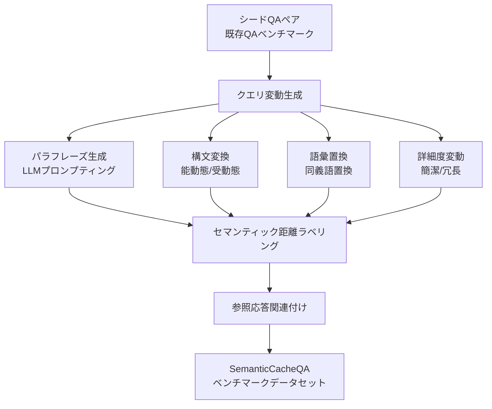

本記事は [arXiv:2410.03038 "SemanticCacheQA"](https://arxiv.org/abs/2410.03038) の解説記事です。

この記事は [Zenn記事: Semantic Kernel v1.41フィルターで実現する本番AIアプリの品質管理基盤](https://zenn.dev/0h_n0/articles/40a111c0c0ed23) の深掘りです。Zenn記事では`PromptRenderFilter`を用いたセマンティックキャッシングの実装パターン（SHA-256ハッシュによる完全一致キャッシュ）を紹介していますが、本論文はそのアプローチの限界を定量的に示し、ベクトル類似度ベースのキャッシュ設計における最適閾値の選択基準を提供しています。

## 論文概要（Abstract）

LLMサービングにおけるセマンティックキャッシュは、APIコスト削減とレイテンシ改善の有力な手法である。しかし、その効率と精度を体系的に評価するベンチマークが存在しなかった。著者らはSemanticCacheQAを提案し、意図的に意味的変動を含むQAペアによりキャッシュ戦略を「効率（キャッシュヒット率）」と「精度（キャッシュ応答の正確性）」の両軸で評価する。実験により、類似度閾値 $\tau$ = 0.80〜0.90が多くの本番デプロイメントにおける実用的な最適域であることが示されている。

## 情報源

- **arXiv ID**: 2410.03038
- **URL**: [https://arxiv.org/abs/2410.03038](https://arxiv.org/abs/2410.03038)
- **著者**: Nikhil Chintala et al.
- **発表年**: 2024
- **分野**: cs.IR, cs.CL, cs.LG

## 背景と動機（Background & Motivation）

LLM APIの利用コストはトークン単位で課金されるため、同じ意味のクエリに対して重複したAPI呼び出しを行うことは直接的なコスト増加につながる。GPTCache（Bang et al., 2023）等のセマンティックキャッシュシステムは、クエリの意味的類似性に基づいてキャッシュ済み応答を返すことでコスト削減を実現するが、その評価基盤が欠如していた。

Zenn記事で紹介したSemantic Kernelのキャッシュ実装は、SHA-256ハッシュによる**完全一致キャッシュ**であり、「今日の天気は？」と「今日の天気を教えて」のような言い換えクエリには対応できない。本論文はベクトル類似度ベースのセマンティックキャッシュの設計パラメータ（特に類似度閾値 $\tau$）が効率と精度のトレードオフに与える影響を定量化している。

## 主要な貢献（Key Contributions）

- **貢献1**: SemanticCacheQAデータセット — セマンティックキャッシュ評価に特化した、意味的変動を含むQAペアのベンチマーク
- **貢献2**: 効率-精度の二軸評価フレームワーク — CHR（キャッシュヒット率）とAQS（応答品質スコア）を同時評価
- **貢献3**: ECE（Effective Cache Efficiency）複合メトリクス — 効率と精度を統合した単一指標の定義
- **貢献4**: 閾値感度分析 — 類似度閾値 $\tau$ のスイープによるPareto最適域の特定
- **貢献5**: 埋め込みモデル比較 — 複数の埋め込みモデルの実用性能比較

## 技術的詳細（Technical Details）

### セマンティックキャッシュの形式的定義

著者らはセマンティックキャッシュシステムを以下のタプルとして定義している：

$$
\mathcal{S} = (E, S, \tau, \mathcal{C})
$$

ここで、
- $E: q \rightarrow \mathbb{R}^d$ — クエリを$d$次元ベクトル空間に写像する埋め込み関数
- $S: \mathbb{R}^d \times \mathbb{R}^d \rightarrow [0, 1]$ — ベクトル間の類似度関数
- $\tau \in [0, 1]$ — 類似度閾値スカラー
- $\mathcal{C}$ — ベクトルから(クエリ, 応答)ペアへのキャッシュストア

### キャッシュルックアップアルゴリズム

```python
from dataclasses import dataclass
from typing import Any

@dataclass
class CacheEntry:
    """キャッシュエントリ"""
    embedding: list[float]
    query: str
    response: str

class SemanticCache:
    """セマンティックキャッシュの実装（論文のアルゴリズムに基づく）

    Args:
        embedding_fn: クエリをベクトルに変換する関数
        similarity_fn: ベクトル間の類似度を計算する関数
        threshold: 類似度閾値τ
    """
    def __init__(
        self,
        embedding_fn: "Callable[[str], list[float]]",
        similarity_fn: "Callable[[list[float], list[float]], float]",
        threshold: float = 0.85,
    ) -> None:
        self.embedding_fn = embedding_fn
        self.similarity_fn = similarity_fn
        self.threshold = threshold
        self.cache: list[CacheEntry] = []

    def lookup(self, query: str) -> str | None:
        """キャッシュルックアップ

        論文Algorithm 1に基づく:
        1. クエリの埋め込みを計算
        2. キャッシュ内の全エントリと類似度を比較
        3. 閾値τ以上なら応答を返す（キャッシュヒット）
        4. 閾値未満ならNone（キャッシュミス）
        """
        v_q = self.embedding_fn(query)

        best_sim = 0.0
        best_response: str | None = None

        for entry in self.cache:
            sim = self.similarity_fn(v_q, entry.embedding)
            if sim >= self.threshold and sim > best_sim:
                best_sim = sim
                best_response = entry.response

        return best_response

    def store(self, query: str, response: str) -> None:
        """キャッシュミス時にエントリを追加"""
        v_q = self.embedding_fn(query)
        self.cache.append(CacheEntry(
            embedding=v_q,
            query=query,
            response=response,
        ))
```

### 評価メトリクスの定義

著者らは3つの評価メトリクスを定義している：

**Cache Hit Rate (CHR)**:

$$
\text{CHR} = \frac{|\{q \in Q : \text{cache\_hit}(q)\}|}{|Q|}
$$

高いCHR = 多くのクエリがキャッシュから応答される = LLM API呼び出し削減

**Answer Quality Score (AQS)**:

$$
\text{AQS} = \frac{|\{q \in Q_{\text{hit}} : \text{correct}(q)\}|}{|Q_{\text{hit}}|}
$$

キャッシュヒットした応答のうち、正しい応答の割合。高いAQS = キャッシュの応答品質が高い

**Effective Cache Efficiency (ECE)**:

$$
\text{ECE} = \text{CHR} \times \text{AQS}
$$

ECEは効率と精度を統合した複合メトリクスである。高いCHRを高いAQSで達成している場合にのみECEが高くなり、精度を犠牲にしてヒット率を上げるシステムにはペナルティが課される。

### データセット構成

SemanticCacheQAのデータセットは以下のパイプラインで構成される：



各クエリグループは正規の参照応答（グラウンドトゥルース）を共有し、キャッシュヒットが適切な応答を返すかの評価を可能にする。

### 閾値 $\tau$ と性能の関係

著者らの実験結果に基づくと、$\tau$ の値によって性能特性が大きく変化する：

| 閾値域 | CHR | AQS | 特性 |
|---|---|---|---|
| $\tau$ ≈ 0.95-0.99 | 10-25% | 95%+ | 保守的。ほぼ完全一致のみヒット |
| $\tau$ ≈ 0.80-0.90 | 50-70% | 80-90% | **実用的最適域**。多くの本番環境に推奨 |
| $\tau$ ≈ 0.50-0.70 | 80-95% | 50-65% | 積極的すぎる。無関係なクエリにも誤応答 |

Zenn記事のSHA-256ハッシュ方式は $\tau = 1.0$（完全一致のみ）に相当し、CHRは極めて低いが AQSは100%となる。本論文の知見を踏まえると、$\tau$ = 0.85前後への移行でCHRを大幅に向上できる。

## 実験結果（Results）

### 埋め込みモデル比較

論文の実験結果より、複数の埋め込みモデルのECE性能を比較：

| 埋め込みモデル | ECE（τ=0.85） | 計算コスト | 推奨 |
|---|---|---|---|
| text-embedding-3-large (OpenAI) | 最高 | 高い | 品質重視 |
| all-mpnet-base-v2 (OSS) | 競争力あり | 低い | **OSS推奨** |
| text-embedding-ada-002 (OpenAI) | 良好 | 中程度 | コスト/品質バランス |
| all-MiniLM-L6-v2 (OSS) | 低め | 非常に低い | レイテンシ重視 |

著者らによると、埋め込みモデルの選択はAQS（応答品質）への影響がCHR（ヒット率）への影響より大きい。つまり、モデル品質は主に「正しい応答を返すか」に影響し、「どれだけ多くヒットするか」にはあまり影響しない。

### ドメイン別の最適閾値

論文ではドメインごとの閾値推奨も報告されている：

| ドメイン | 推奨閾値 | 理由 |
|---|---|---|
| 一般会話 | 0.80-0.85 | 言い換えが多く、高CHRが期待できる |
| 技術Q&A | 0.85-0.90 | 用語の微妙な違いが重要 |
| 医療・法律 | 0.92以上 | 誤応答のリスクが高く、保守的であるべき |

## 実装のポイント（Implementation）

### Semantic Kernelとの統合

Zenn記事のSHA-256完全一致キャッシュを、本論文の知見を踏まえてベクトル類似度ベースに改善する実装パターン：

```python
import numpy as np
from semantic_kernel.filters import FilterTypes, PromptRenderContext
from semantic_kernel.functions import FunctionResult

class VectorSemanticCache:
    """ベクトル類似度ベースのセマンティックキャッシュ

    論文SemanticCacheQAの知見に基づく設計:
    - 閾値τ=0.85（一般用途の推奨値）
    - コサイン類似度による比較
    - 埋め込みモデル: all-mpnet-base-v2（OSS推奨）
    """
    def __init__(
        self,
        threshold: float = 0.85,
    ) -> None:
        from sentence_transformers import SentenceTransformer
        self.model = SentenceTransformer("all-mpnet-base-v2")
        self.threshold = threshold
        self.embeddings: list[np.ndarray] = []
        self.responses: list[str] = []

    def _cosine_similarity(
        self, a: np.ndarray, b: np.ndarray
    ) -> float:
        """コサイン類似度を計算"""
        return float(np.dot(a, b) / (np.linalg.norm(a) * np.linalg.norm(b)))

    def get(self, prompt: str) -> str | None:
        """キャッシュルックアップ（閾値τ以上でヒット）"""
        if not self.embeddings:
            return None
        query_emb = self.model.encode(prompt)
        for i, cached_emb in enumerate(self.embeddings):
            if self._cosine_similarity(query_emb, cached_emb) >= self.threshold:
                return self.responses[i]
        return None

    def put(self, prompt: str, response: str) -> None:
        """キャッシュミス時に保存"""
        emb = self.model.encode(prompt)
        self.embeddings.append(emb)
        self.responses.append(response)

# Semantic Kernelフィルターとしての統合
_vector_cache = VectorSemanticCache(threshold=0.85)

@kernel.filter(FilterTypes.PROMPT_RENDERING)
async def vector_semantic_cache_filter(
    context: PromptRenderContext,
    next,
) -> None:
    """ベクトル類似度ベースのセマンティックキャッシュフィルター"""
    await next(context)
    rendered = context.rendered_prompt or ""
    cached = _vector_cache.get(rendered)
    if cached is not None:
        context.function_result = FunctionResult(
            function=context.function.metadata,
            value=cached,
        )
        cache_hit_counter.add(1)  # OTelメトリクス
        return
    cache_miss_counter.add(1)
```

### 設計上の考慮点

1. **閾値の調整**: ドメインに応じて $\tau$ を調整する。医療・法律は0.92以上、一般会話は0.80-0.85が推奨される
2. **キャッシュ無効化**: 時間経過による応答の陳腐化（temporal drift）を考慮し、TTL（Time-To-Live）を設定すべきである。本論文はこの点を評価していない
3. **埋め込み計算コスト**: 埋め込み計算自体にレイテンシとコストがかかるため、キャッシュミスが頻繁な場合はオーバーヘッドが上回る可能性がある

## 実運用への応用（Practical Applications）

本論文の知見をSemantic Kernelのフィルターパイプラインに適用する場合：

1. **SHA-256からベクトル類似度への段階的移行**: まず既存のハッシュキャッシュを残しつつ、ベクトル類似度キャッシュを並行稼働させてヒット率の改善を計測する
2. **ECEメトリクスによるモニタリング**: `semantic_kernel.function.invocation.duration`に加えてECE（= CHR × AQS）をカスタムメトリクスとして記録し、閾値調整の判断材料とする
3. **ドメイン別閾値**: マルチテナント環境では、テナントごとのドメイン特性に応じて閾値を変える設計が望ましい

## 関連研究（Related Work）

- **GPTCache (Bang et al., 2023)**: LLM向けセマンティックキャッシュの先駆的実装。SemanticCacheQAはGPTCacheに欠けていた評価基盤を提供する
- **MTEB (Muennighoff et al., 2023)**: 埋め込みモデルの汎用ベンチマーク。SemanticCacheQAはキャッシュ用途に特化した評価を追加
- **Redis LangCache**: 本番環境でのセマンティックキャッシュ実装。高反復ワークロードで約73%のコスト削減を報告している

## まとめと今後の展望

SemanticCacheQAの最大の貢献は、セマンティックキャッシュの「効率vs精度」トレードオフを定量的に可視化したことである。ECE複合メトリクスにより、閾値 $\tau$ = 0.80-0.90が多くのユースケースで最適域であることが示されている。

著者らが認めている制限として、本ベンチマークは英語のシングルターンQAに限定されており、マルチターン会話やキャッシュ無効化（エビクション）ポリシーの評価は行われていない。Semantic Kernelのフィルターパイプラインに統合する際は、Zenn記事のSHA-256完全一致キャッシュとベクトル類似度キャッシュを二段階で構成し、ECEメトリクスで効果を監視することが実践的なアプローチである。

## 参考文献

- **arXiv**: [https://arxiv.org/abs/2410.03038](https://arxiv.org/abs/2410.03038)
- **Related Zenn article**: [https://zenn.dev/0h_n0/articles/40a111c0c0ed23](https://zenn.dev/0h_n0/articles/40a111c0c0ed23)
- **GPTCache**: [https://github.com/zilliztech/GPTCache](https://github.com/zilliztech/GPTCache)
- **Redis LangCache**: [https://redis.io/blog/llm-token-optimization-speed-up-apps/](https://redis.io/blog/llm-token-optimization-speed-up-apps/)
