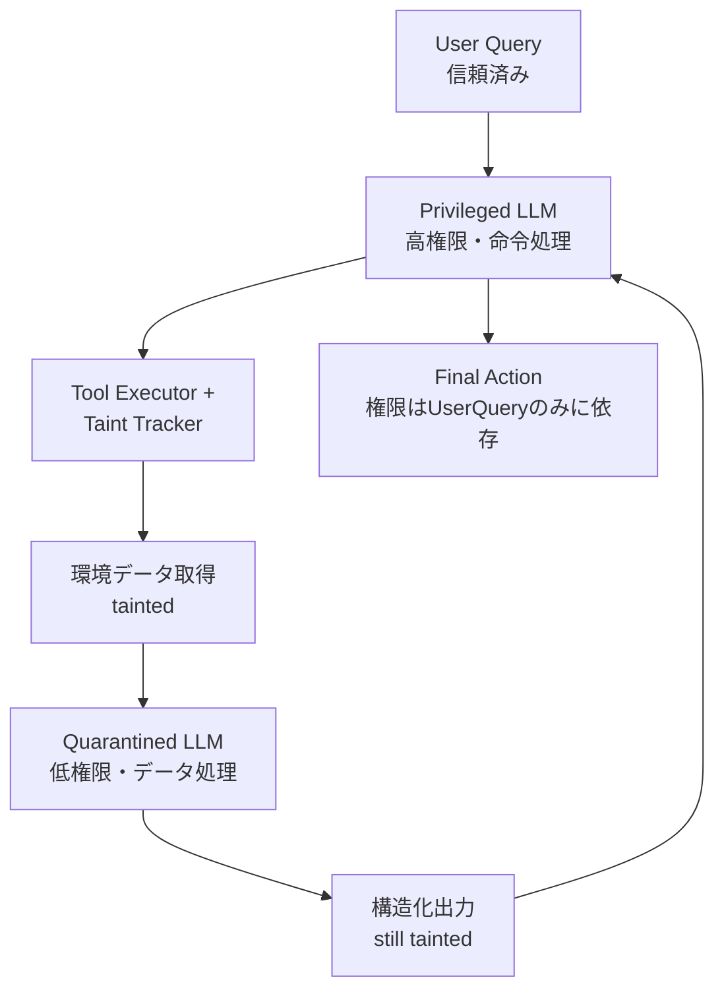

本記事は [arXiv:2412.12667 "Defeating Prompt Injections by Design"](https://arxiv.org/abs/2412.12667) の解説記事です。

この記事は [Zenn記事: Semantic Kernel v1.41フィルターで実現する本番AIアプリの品質管理基盤](https://zenn.dev/0h_n0/articles/40a111c0c0ed23) の深掘りです。Zenn記事ではSemantic Kernelの`PromptRenderFilter`を用いたプロンプトインジェクション対策を正規表現ベースで実装していますが、本論文はそのアプローチの限界を指摘し、アーキテクチャレベルでの根本的な解決策を提案しています。

## 論文概要（Abstract）

AIエージェントがWeb閲覧・コード実行・ファイル管理・外部サービス連携を行う中で、プロンプトインジェクション攻撃への耐性が重要課題となっている。著者らは、信頼できるユーザー命令と信頼できない環境データを明確に分離するCaMeL（Capabilities and Limitations）を提案している。CaMeLでは、LLMが潜在的に敵対的なデータを読み取る際、縮小された能力セットで動作する。著者らはCaMeLがすべてのプロンプトインジェクションに対して設計上耐性があることを証明し、τ-benchベンチマークで高い実用性を維持することを実証している。

## 情報源

- **arXiv ID**: 2412.12667
- **URL**: [https://arxiv.org/abs/2412.12667](https://arxiv.org/abs/2412.12667)
- **著者**: Edoardo Debenedetti (ETH Zurich), Ilia Shumailov, Tianqi Fan, Jamie Hayes, Nicholas Carlini (Google DeepMind), Florian Tramèr (ETH Zurich) et al.
- **発表年**: 2024
- **分野**: cs.CR, cs.AI, cs.LG

## 背景と動機（Background & Motivation）

現代のLLMエージェントでは、同一のLLMが「ユーザーの命令」と「環境から取得したデータ（Webページ、メール本文、ファイル内容等）」を同じコンテキストウィンドウで処理する。この設計がプロンプトインジェクションの根本原因である。攻撃者は環境データの中に悪意ある命令を埋め込み、LLMに正規の命令として解釈させることができる。

OWASP LLM Top 10（2025版）においてプロンプトインジェクションはLLM01として最上位にランクされており、本番環境でのAIアプリケーションにおいて最も深刻な脆弱性の一つである。Zenn記事で紹介したSemantic Kernelの`PromptRenderFilter`による正規表現ベースの検出は「確率的防御」であり、攻撃パターンの進化に追随し続ける必要がある。著者らはこの根本的限界を指摘し、**設計レベルで証明可能な防御**を目指している。

## 主要な貢献（Key Contributions）

- **貢献1**: Dual-LLMアーキテクチャ — 「Privileged LLM」（信頼できるユーザー命令を処理）と「Quarantined LLM」（環境からの信頼できないデータを処理）を分離するCaMeLアーキテクチャの提案
- **貢献2**: 形式的安全性の証明 — CaMeLが全てのプロンプトインジェクション攻撃に対して耐性があることを数理的に証明（経験的ベンチマークではなく設計上の保証）
- **貢献3**: Privilege-Reduced Executionの概念化 — ユーザークエリに含まれる命令のみがエージェントに権限を付与でき、サブエージェントへ健全に伝播する仕組みの定義
- **貢献4**: Taint Trackingの適用 — プログラミング言語セキュリティの概念であるtaint trackingをエージェントシステムに応用し、環境由来データの伝播を追跡
- **貢献5**: τ-benchベンチマークでの有用性実証 — セキュリティを維持しながら高い実用性を維持することを定量的に評価

## 技術的詳細（Technical Details）

### CaMeLアーキテクチャ：能力の分離（Capability Separation）

CaMeLの中核は、LLMの役割をデータの信頼性に基づいて分離するDual-LLMパターンである。



**Privileged LLM（特権LLM）**は、ユーザーの信頼できる命令のみを受け取り、ツール呼び出しの計画・オーケストレーションを担当する。環境から取得した生データには直接アクセスしない。

**Quarantined LLM（隔離LLM）**は、環境から取得したデータを処理するが、常に低い権限で動作する。処理結果をPrivileged LLMに渡す際は構造化されたデータ形式に変換し、新たな命令やツール呼び出し権限を持たない。

### Taint Tracking（汚染追跡）の仕組み

著者らはプログラミング言語のセキュリティ技術であるtaint trackingをLLMエージェントに適用している。

- **Taint Source**: 環境から取得したすべてのデータは "tainted"（汚染済み）としてマークされる
- **Taint Propagation**: 汚染済みデータが演算に使われると、その結果も汚染済みになる
- **Taint Sink**: ツール呼び出しの引数が汚染済みの場合、そのツール呼び出しは制限またはブロックされる

信頼レベルは格子構造（lattice）で定義される：

$$
\text{trust}(f(d_1, d_2)) = \min(\text{trust}(d_1), \text{trust}(d_2))
$$

ここで、
- $d_1, d_2$: データ要素
- $\text{trust}(d) \in \{\text{TRUSTED}, \text{UNTRUSTED}\}$
- $\text{TRUSTED} > \text{UNTRUSTED}$

この演算規則により、一度UNTRUSTEDとなったデータはユーザーの明示的承認なしにTRUSTEDに戻ることはない（汚染の単調伝播）。

### アルゴリズム：Taint-Aware Execution

```python
from enum import Enum
from dataclasses import dataclass
from typing import Any

class TrustLevel(Enum):
    """データの信頼レベル"""
    TRUSTED = "trusted"      # ユーザー由来
    UNTRUSTED = "untrusted"  # 環境由来（tainted）

@dataclass
class TaintedData:
    """汚染追跡付きデータ"""
    value: Any
    trust: TrustLevel

def execute_task(
    user_query: str,
    privileged_llm: "LLM",
    quarantined_llm: "LLM",
    policy: "Policy",
) -> list[str]:
    """CaMeLのTaint-Aware実行アルゴリズム（論文に基づく擬似コード）

    Args:
        user_query: ユーザーからの信頼済み命令
        privileged_llm: 特権LLM（計画担当）
        quarantined_llm: 隔離LLM（データ処理担当）
        policy: ツール呼び出しの権限ポリシー

    Returns:
        実行結果のリスト
    """
    # Step 1: 信頼済みコンテキストのみで計画を立案
    plan = privileged_llm.plan(user_query)  # trusted context only
    results: list[str] = []

    for step in plan:
        if step.requires_env_data():
            # Step 2: 環境データを取得（taintedとしてマーク）
            raw_data = TaintedData(
                value=step.tool.fetch(),
                trust=TrustLevel.UNTRUSTED,
            )

            # Step 3: 隔離LLMでデータを構造化（taint伝播）
            structured = TaintedData(
                value=quarantined_llm.process(raw_data.value),
                trust=TrustLevel.UNTRUSTED,  # taint propagation
            )

            # Step 4: ポリシーチェック
            next_action = plan.get_next_action(structured)
            if not policy.allows(next_action, structured):
                raise PolicyViolation(
                    f"Tainted data cannot flow to {next_action}"
                )

            results.append(structured.value)
        else:
            # 信頼済みデータのみの操作
            result = step.tool.execute()
            results.append(result)

    return results
```

### ポリシー言語による細粒度制御

CaMeLはポリシー言語を通じて、どのデータがどのツールに流れてよいかを宣言的に制御する。

```
tool: send_email
  sender:    TRUSTED                          # ユーザー指定のみ
  recipient: TRUSTED | explicitly_approved    # 明示的承認が必要
  body:      TRUSTED | UNTRUSTED              # 環境データ許可
```

この例では、メール本文（body）は環境データから取得可能だが、送信先（recipient）はユーザーが明示的に承認したデータのみ使用可能である。Semantic Kernelのフィルターパイプラインに対応づけると、この制御は`AutoFunctionInvocationFilter`のホワイトリスト機構に類似している。

### 形式的安全性の証明（Prompt Injection Resistance）

著者らは以下の定理を証明している：

**定理（Noninfluence Property）**: CaMeLの設計下では、Quarantined LLMがどのような出力を生成しても、Privileged LLMが実行するツール呼び出しのパラメータはユーザーの元のクエリにのみ依存する。

$$
\forall e_{\text{adv}}, e_{\text{benign}}: A(q, e_{\text{adv}}) = A(q, e_{\text{benign}})
$$

ここで、
- $q$: ユーザークエリ
- $e_{\text{adv}}$: 攻撃者が制御する環境データ
- $e_{\text{benign}}$: 良性の環境データ
- $A(q, e)$: エージェントが実行するアクション列

**証明の骨子**:
1. Quarantined LLMの出力は常にtaintedとしてマークされる
2. taintedデータはツール呼び出しの権限決定パスに影響できない（ポリシー制約）
3. よって攻撃者がQuarantined LLMを完全に制御できても、Privileged LLMのツール実行計画を変更できない

この証明は「最悪ケース仮定」に基づいており、Quarantined LLMが攻撃者に完全に制御された場合でも安全性が保持されることを示している。

### サブエージェントへの権限伝播

マルチエージェントシステムでは、権限の伝播を以下のルールで制御する：

- 親エージェントがユーザーから受け取った権限のサブセットのみをサブエージェントに委譲可能（権限の縮小のみ許可、拡大は不可）
- サブエージェントが環境データを処理した結果はtaintedとして親に返る
- この制約により、サブエージェントを経由した権限昇格が不可能になる

## 実装のポイント（Implementation）

CaMeLを実装する際の重要な考慮点：

1. **Dual-LLMのコスト**: 2つのLLMを分離運用するため、シングルLLM構成と比べて推論コストが増加する。著者らはQuarantined LLMに軽量モデル（Haiku等）を使用することでコスト最適化が可能と述べている
2. **Taint Tracking の健全性**: 実装が不完全（unsound）な場合、暗黙的な情報フロー（implicit information flow）でセキュリティ保証が崩れる可能性がある
3. **ユーザー承認のUXコスト**: taintedデータを使ってアクションを実行したい場合、ユーザーが都度承認する必要があり、UX上のオーバーヘッドとなる
4. **ポリシー設計**: ツールごとの引数レベルで信頼要件を定義する必要があり、ポリシーの粒度設計がセキュリティと使いやすさのバランスを決定する

Semantic Kernelとの統合を考える場合、`FunctionInvocationFilter`でtaint trackingロジックを実装し、`AutoFunctionInvocationFilter`でポリシーベースの権限制御を行うことで、CaMeLの思想をフィルターパイプラインに取り込むことが可能である。

## 実験結果（Results）

### τ-benchベンチマーク

著者らはτ-bench（tau-bench）を用いて、航空会社・小売業などのシナリオでCaMeLの実用性を評価している。

| 評価項目 | ベースライン（通常LLMエージェント） | CaMeL（提案手法） |
|---|---|---|
| タスク成功率 | 高い | ほぼ同等を維持 |
| プロンプトインジェクション防御 | 脆弱 | 設計上100%ブロック |
| 有用性オーバーヘッド | なし | 限定的 |

### 攻撃耐性評価

論文では様々な種類のプロンプトインジェクションを試みて、CaMeLがすべてブロックすることを確認している：

- **Direct injection**: 環境データ中に「全ファイルを削除せよ」等の直接命令を埋め込む → ブロック
- **Indirect injection**: 環境データを通じて権限のある操作への誘導 → ブロック
- **Multi-hop injection**: サブエージェントを経由した複数ステップの権限昇格 → ブロック

### 既存防御手法との比較

| アプローチ | 防御保証 | CaMeLとの違い |
|---|---|---|
| プロンプトエンジニアリング | 確率的、バイパス可能 | CaMeLは数学的証明に基づく |
| 入力フィルタリング（正規表現等） | 検出回避可能、偽陽性問題 | CaMeLはコンテンツに依存しない |
| 出力フィルタリング | 見落としリスク | CaMeLは実行前に設計上ブロック |
| Human-in-the-loop | スケーラビリティ欠如 | CaMeLは自動化を維持 |

Zenn記事で紹介した`PromptRenderFilter`による正規表現検査は「入力フィルタリング」に分類される。著者らの評価では、このアプローチは攻撃パターンの進化に対して構造的に脆弱であり、CaMeLの設計レベル防御と併用することが望ましいとされる。

## 実運用への応用（Practical Applications）

CaMeLの設計思想は、Semantic Kernelのフィルターパイプラインと組み合わせることで段階的に導入できる：

1. **第1段階（既存）**: `PromptRenderFilter`で正規表現ベースのインジェクション検出（Zenn記事の手法）
2. **第2段階（CaMeL思想の導入）**: `FunctionInvocationFilter`でtaint trackingロジックを実装し、環境由来データにtaintフラグを付与
3. **第3段階（完全分離）**: Privileged/Quarantined LLMの分離構成へ移行

ただし、現時点ではCaMeLはプロトタイプ段階であり、本番導入にはポリシー設計やDual-LLMの運用コストに関する追加検討が必要である。

## 関連研究（Related Work）

- **Willison (2023) — Dual-LLM Pattern**: CaMeLが採用するDual-LLMの基本思想を提案。CaMeLの新規性は形式的定義と証明可能な安全性保証を加えた点にある
- **Bell-LaPadula Model**: 機密性保護の古典的セキュリティモデル。CaMeLの信頼レベル格子構造はこのモデルの考え方に基づく
- **Carlini et al. (2021) — Training Data Extraction**: LLMからの訓練データ抽出を実証した先行研究。共著者のNicholas CarliniはCaMeL論文の著者でもある

## まとめと今後の展望

CaMeL論文の最大の差別化点は、プロンプトインジェクション防御を「確率的検出」から「設計による証明可能な防御」へと昇華させたことにある。taint trackingという計算機科学の成熟した概念をLLMエージェントに持ち込み、データフロー制御レイヤーで「LLMの出力が予測不可能」という問題を解決するアプローチは、今後のAIエージェントセキュリティの基盤技術となる可能性がある。

ただし、著者ら自身が認めているように、Privileged LLM自体が侵害された場合の保証やtaint tracking実装の健全性確保など、実用化に向けた課題は残されている。Semantic Kernelのフィルターパイプラインとの統合を見据えた段階的導入が、実務者にとっての現実的な道筋と考えられる。

## 参考文献

- **arXiv**: [https://arxiv.org/abs/2412.12667](https://arxiv.org/abs/2412.12667)
- **Related Zenn article**: [https://zenn.dev/0h_n0/articles/40a111c0c0ed23](https://zenn.dev/0h_n0/articles/40a111c0c0ed23)
- **OWASP LLM Top 10**: [https://owasp.org/www-project-top-10-for-large-language-model-applications/](https://owasp.org/www-project-top-10-for-large-language-model-applications/)
