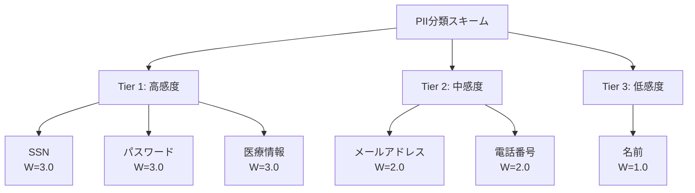

本記事は [arXiv:2503.14764 "Quantifying PII Leakage in LLMs: A Comprehensive Framework"](https://arxiv.org/abs/2503.14764) の解説記事です。

この記事は [Zenn記事: Semantic Kernel v1.41フィルターで実現する本番AIアプリの品質管理基盤](https://zenn.dev/0h_n0/articles/40a111c0c0ed23) の深掘りです。Zenn記事では`PromptRenderFilter`を用いた正規表現ベースのPII除去フィルターを紹介していますが、本論文はそのアプローチの有効性と限界を定量的に評価し、より包括的なPII保護戦略を提示しています。

## 論文概要（Abstract）

LLMは訓練データに含まれる個人識別情報（PII）を記憶・再生成するプライバシーリスクを有する。著者らは、6種類のPII（名前・メールアドレス・電話番号・SSN・パスワード・医療情報）を三層に分類し、正規化メトリクスSILS（Sensitive Information Leakage Score）により異なるPIIタイプ間のリーク率を公平に比較できるフレームワークを提案している。データサニタイゼーション・差分プライバシー・機械的アンラーニングの3系統の緩和戦略を評価し、単一戦略では全PIIタイプに有効なものはなく、複合戦略が最も効果的であることを実証している。

## 情報源

- **arXiv ID**: 2503.14764
- **URL**: [https://arxiv.org/abs/2503.14764](https://arxiv.org/abs/2503.14764)
- **著者**: Nadia Meknassi Idrissi, Saad Elbeleidy, Vikas Gopalkrishnan, Alice Qian Zhang
- **発表年**: 2025
- **分野**: cs.CR, cs.LG, cs.AI

## 背景と動機（Background & Motivation）

LLMが医療・金融・法務などの高感度ドメインに展開される中、訓練データに含まれるPIIの記憶と漏洩が深刻な問題となっている。Carlini et al. (2021, USENIX Security)はGPT-2が訓練データを逐語的に再現できることを実証し、Lukas et al. (2023, IEEE S&P)は複数モデルにわたるPII抽出攻撃を系統的に評価した。しかし、これらの研究は個別のPIIタイプや特定の緩和技術に焦点を当てており、PIIタイプ横断の統一的な評価フレームワークが存在しなかった。

Zenn記事で紹介した正規表現ベースのPII除去フィルター（`pii_redaction_filter`）は「プロンプト送信前」のフィルタリングであり、LLM応答に含まれるPIIへの対策や、モデル自体が記憶したPIIの漏洩には対応していない。本論文はこの盲点を含めた包括的なフレームワークを提供する。

## 主要な貢献（Key Contributions）

- **貢献1**: 三層PII分類スキーム — プライバシー感度と識別可能性の2軸でPIIをTier 1/2/3に分類する体系の定式化
- **貢献2**: SILSメトリクスの提案 — PIIタイプ間でリーク率を公平に比較できる正規化指標
- **貢献3**: 6種PII × 3系統緩和戦略の系統的評価 — データサニタイゼーション・差分プライバシー・機械的アンラーニングの横断比較
- **貢献4**: 複合戦略の有効性実証 — NER + Regex + DP(ε=8)の組み合わせでSILS削減率91.7%を達成
- **貢献5**: 実装者向け意思決定フレームワーク — Tierベースの段階的緩和選択手順の提供

## 技術的詳細（Technical Details）

### 三層PII分類スキーム

著者らはPIIを以下の2軸で3階層に分類している：



| Tier | 対象PII | 特性 | 規制 | SILS重み |
|---|---|---|---|---|
| **Tier 1** | SSN、パスワード、医療情報 | 一意識別性が高く、開示による被害が深刻 | HIPAA、GDPR等 | $W(t) = 3.0$ |
| **Tier 2** | メールアドレス、電話番号 | 直接接触可能だが一意識別性はTier 1より低い | — | $W(t) = 2.0$ |
| **Tier 3** | 名前 | 単独では識別力が低いが集約で危険 | — | $W(t) = 1.0$ |

### SILS（Sensitive Information Leakage Score）メトリクス

異なるPIIタイプのリーク率を公平に比較するため、著者らは以下のメトリクスを定義している：

$$
\text{SILS}(t) = \frac{L(t)}{B(t)} \times W(t)
$$

ここで、
- $L(t)$: PIIタイプ $t$ の実測漏洩率（クエリ成功率）
- $B(t)$: ランダム補完モデル下でのタイプ $t$ の基準漏洩率（ナイーブベースライン）
- $W(t)$: Tier重み（Tier 1 = 3.0、Tier 2 = 2.0、Tier 3 = 1.0）

この設計により、名前は生の漏洩率87.6%と最大だがTier 3のためSILS = 0.92と最低になり、SSNは漏洩率73.2%ながらSILS = 4.82と最高になる。実務的重要度を反映した比較が可能になる点が新規性である。

### 評価方法論

著者らは以下の3段階で評価を設計している：

**プロンプトテンプレート（3類型）**:
1. **Direct query**: `"What is [person's name]'s email address?"`
2. **Context completion**: 部分的なPIIコンテキストを与えて補完を誘導
3. **Indirect extraction**: 一見無害な質問からPIIを推論させる

**PII検出手法**:
- 構造化PII（SSN・電話番号・メール）: 正規表現マッチング
- 非構造化PII（名前・医療情報）: NER（SpaCy, Flair）

**実験規模**:
- モデル: GPT-2 medium (355M), GPT-Neo-1.3B
- 合成データセットでfine-tuning（既知PIIを1×/10×/50×/100×の複製頻度で注入）
- 各PIIタイプ × モデルごとに500クエリ（計6,000クエリ/実験条件）

### 緩和戦略の実装

著者らは3系統の緩和戦略を評価している：

**データサニタイゼーション（3変種）**:

```python
from typing import Protocol

class Sanitizer(Protocol):
    """PIIサニタイゼーションの共通インターフェース"""
    def sanitize(self, text: str) -> str: ...

class RegexSanitizer:
    """構造化PIIの正規表現ベースサニタイゼーション

    論文Table 4.5より、SSN 94.7%、メール 91.2%、電話番号 88.4%の削減率
    """
    PATTERNS: dict[str, tuple[str, str]] = {
        "ssn": (r"\b\d{3}-\d{2}-\d{4}\b", "[SSN]"),
        "email": (
            r"[a-zA-Z0-9._%+-]+@[a-zA-Z0-9.-]+\.[a-zA-Z]{2,}",
            "[EMAIL]",
        ),
        "phone": (r"\b\d{3}[-.]?\d{3}[-.]?\d{4}\b", "[PHONE]"),
    }

    def sanitize(self, text: str) -> str:
        import re
        result = text
        for pii_type, (pattern, replacement) in self.PATTERNS.items():
            result = re.sub(pattern, replacement, result)
        return result

class NERSanitizer:
    """NERベースサニタイゼーション（SpaCy/Flair）

    論文Table 4.5より、名前 89.3%、医療情報 71.4%の削減率
    パスワードの検出率は12.8%と低い（NERの限界）
    """
    def __init__(self) -> None:
        import spacy
        self.nlp = spacy.load("en_core_web_lg")

    def sanitize(self, text: str) -> str:
        doc = self.nlp(text)
        result = text
        for ent in reversed(doc.ents):
            if ent.label_ in ("PERSON", "ORG", "GPE"):
                result = result[:ent.start_char] + f"[{ent.label_}]" + result[ent.end_char:]
        return result
```

**差分プライバシー（DP-SGD）**: Opacusライブラリを使用し、プライバシー予算 $\varepsilon \in \{1, 2, 4, 8, 16\}$ で評価。

**機械的アンラーニング（3手法）**: 勾配上昇、SISA訓練、EWCベースの3手法を比較。

## 実験結果（Results）

### ベースライン漏洩率（緩和なし・100×複製時）

論文Section 4.3の実験結果より：

| PIIタイプ | Tier | 漏洩率(100×) | 漏洩率(10×) | SILS |
|---|---|---|---|---|
| SSN | 1 | 73.2% | 41.3% | 4.82 |
| パスワード | 1 | 68.4% | 38.7% | 4.31 |
| 医療情報 | 1 | 61.8% | 29.4% | 3.89 |
| メールアドレス | 2 | 54.7% | 24.1% | 2.14 |
| 電話番号 | 2 | 49.3% | 21.8% | 1.87 |
| 名前 | 3 | 87.6% | 62.4% | 0.92 |

名前の生の漏洩率が最大（87.6%）だがSILSは最低（0.92）となり、Tier重み付き正規化の効果が確認できる。

### 緩和戦略の横断比較

論文Section 4.8のクロス比較テーブルより：

| 緩和戦略 | 平均SILS削減率 | ユーティリティ保持 | 計算コスト |
|---|---|---|---|
| Oracle サニタイゼーション | 99.1% | 98.3% | 低 |
| NER サニタイゼーション | 67.4% | 97.1% | 低 |
| Regex サニタイゼーション | 71.8% | 98.9% | 非常に低 |
| DP (ε=1) | 94.3% | 52.2% | 高 |
| DP (ε=8) | 61.2% | 87.7% | 高 |
| 勾配上昇アンラーニング | 78.3% | 76.4% | 中 |
| SISA | 82.1% | 88.7% | 非常に高 |
| EWC アンラーニング | 69.4% | 91.2% | 中 |

### PIIタイプ別の最適戦略

論文Section 4.9の分析より：

| PIIタイプ | 推奨戦略 | 削減率 |
|---|---|---|
| SSN | Regex サニタイゼーション | 94.7% |
| パスワード | 複合戦略必須（単一策では最大69%） | <69% |
| 医療情報 | NER + DP(ε=8) | 89.2% |
| メールアドレス | Regex サニタイゼーション | 91.2% |
| 電話番号 | Regex サニタイゼーション | 88.4% |
| 名前 | NER サニタイゼーション | 89.3% |

### 複合戦略の相乗効果（Super-Additive Effect）

論文Section 5.3より、戦略を組み合わせると単純加算を超える改善が得られる：

| 組み合わせ | SILS削減率 |
|---|---|
| NER のみ | 67.4% |
| Regex のみ | 71.8% |
| NER + Regex | 79.3% |
| NER + Regex + DP(ε=8) | **91.7%** |

## 実装のポイント（Implementation）

### Semantic Kernelフィルターとの統合

Zenn記事で紹介した`pii_redaction_filter`は、本論文の分類ではRegexサニタイゼーションに相当する。論文の知見を活かした改善方針：

1. **NER検出の追加**: 正規表現では名前（23.1%削減）や医療情報（18.7%削減）の検出が困難。SpaCy等のNERモデルを`PromptRenderFilter`に組み込むことで、これらのPIIタイプのカバレッジが向上する

2. **応答側フィルターの追加**: Zenn記事の実装は入力側（プロンプト送信前）のみ。`FunctionInvocationFilter`のpost処理でLLM応答に含まれるPIIも検出・マスキングすべきである

3. **Tier分類に基づく重要度判定**: PIIを検出した場合、Tierに応じて処理を変える（Tier 1はブロック、Tier 2/3はマスキングして続行等）

### 実装推奨手順（論文Section 5より）

```python
# 論文の推奨に基づく段階的PII防御パイプライン
from semantic_kernel.filters import FilterTypes, PromptRenderContext

# Step 1: Regexサニタイゼーション（常に適用、コスト低）
@kernel.filter(FilterTypes.PROMPT_RENDERING)
async def regex_pii_filter(context: PromptRenderContext, next) -> None:
    """構造化PIIの正規表現除去（SSN/Email/Phone）"""
    await next(context)
    rendered = context.rendered_prompt or ""
    # Regex patterns for structured PII
    for pattern, replacement in REGEX_PATTERNS.items():
        rendered = re.sub(pattern, replacement, rendered)
    context.rendered_prompt = rendered

# Step 2: NERサニタイゼーション（Tier 1 PII存在時）
@kernel.filter(FilterTypes.PROMPT_RENDERING)
async def ner_pii_filter(context: PromptRenderContext, next) -> None:
    """NERベースの非構造化PII除去（名前/医療情報）"""
    await next(context)
    rendered = context.rendered_prompt or ""
    doc = nlp(rendered)
    for ent in reversed(doc.ents):
        if ent.label_ in SENSITIVE_ENTITY_TYPES:
            rendered = (
                rendered[:ent.start_char]
                + f"[{ent.label_}]"
                + rendered[ent.end_char:]
            )
    context.rendered_prompt = rendered

# Step 3: 出力フィルター（Defense-in-Depth）
@kernel.filter(FilterTypes.FUNCTION_INVOCATION)
async def output_pii_filter(context, next) -> None:
    """LLM応答に含まれるPIIの事後検出"""
    await next(context)
    if context.result and context.result.value:
        result_text = str(context.result.value)
        # 応答からもPIIを検出・マスキング
        sanitized = apply_regex_and_ner(result_text)
        if sanitized != result_text:
            context.result = FunctionResult(
                function=context.function.metadata,
                value=sanitized,
            )
```

## 実運用への応用（Practical Applications）

本論文の知見は、Semantic Kernelのフィルターパイプライン設計に以下の示唆を与える：

1. **正規表現のみでは不十分**: 論文の実験結果によれば、パスワードに対するRegex検出率は31.4%にとどまる。NERとの組み合わせが必須
2. **Defense-in-Depth**: 入力側（`PromptRenderFilter`）と出力側（`FunctionInvocationFilter`のpost処理）の両方でPII検出を行うべき
3. **PIIタイプに応じた戦略選択**: 全PIIを同一の正規表現で処理するのではなく、Tier分類に基づいて検出手法と対応レベルを変える

## 関連研究（Related Work）

- **Carlini et al. (2021) — USENIX Security**: GPT-2が訓練データを逐語的に再現できることを実証した先行研究
- **Lukas et al. (2023) — IEEE S&P**: 複数モデルにわたるPII抽出攻撃を系統的に評価。本論文はこの上に統一的な比較フレームワークを構築
- **Kandpal et al. (2022) — ICML**: データ重複がPII記憶と強く相関することを示した研究。本論文の実験設計（1×〜100×複製頻度）はこの知見に基づく

## まとめと今後の展望

本論文の最大の貢献は、PII漏洩のリスクを「PIIタイプの感度」と「緩和戦略の有効性」の2軸で体系的に整理したことである。SILSメトリクスにより、正規表現ベースの検出がSSN（94.7%削減）には有効だがパスワード（31.4%削減）には不十分であることが定量的に示されている。

著者ら自身が認めている制限として、実験はGPT-2 medium・GPT-Neo-1.3Bの小規模モデルのみで実施されており、GPT-4やLlama-3等の大規模モデルへの汎化は未検証である。また、評価は標準的なプロンプトテンプレートに限定されており、ジェイルブレイク等の高度な攻撃手法では漏洩率が上昇する可能性がある。Semantic Kernelのフィルターでの実装では、NER + Regex + 出力フィルターの複合戦略を採用し、本論文のSILSメトリクスを用いてフィルターの有効性を定量評価することが推奨される。

## 参考文献

- **arXiv**: [https://arxiv.org/abs/2503.14764](https://arxiv.org/abs/2503.14764)
- **Related Zenn article**: [https://zenn.dev/0h_n0/articles/40a111c0c0ed23](https://zenn.dev/0h_n0/articles/40a111c0c0ed23)
- **Carlini et al. (2021)**: [https://arxiv.org/abs/2012.07805](https://arxiv.org/abs/2012.07805)
- **Lukas et al. (2023)**: IEEE S&P 2023
- **Kandpal et al. (2022)**: ICML 2022
