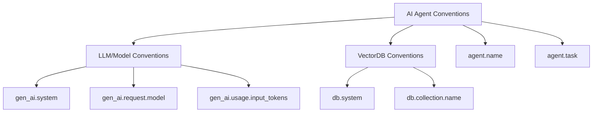

## ブログ概要（Summary）

OpenTelemetryのGenAI SIG（Special Interest Group）が2025年3月に公開したブログ記事では、AIエージェントの可観測性を標準化するためのセマンティック規約策定の進捗と、フレームワーク計装の2つのアプローチが解説されている。著者らは、LLM・ベクトルDB・AIエージェントの3層にわたる統一的なテレメトリ収集の枠組みを提案し、CrewAI・AutoGen・Semantic Kernel・LangGraphなど主要フレームワークとの連携方針を示している。

この記事は [Zenn記事: Semantic Kernel v1.41フィルターで実現する本番AIアプリの品質管理基盤](https://zenn.dev/0h_n0/articles/40a111c0c0ed23) の深掘りです。

## 情報源

- **種別**: CNCFプロジェクト公式ブログ
- **URL**: [https://opentelemetry.io/blog/2025/ai-agent-observability/](https://opentelemetry.io/blog/2025/ai-agent-observability/)
- **著者**: Guangya Liu（IBM）、Sujay Solomon（Google）
- **発表日**: 2025年3月6日

## 技術的背景（Technical Background）

AIエージェントは、LLMの推論能力、外部ツール接続、高次の推論を組み合わせて目標を達成するアプリケーションとして定義される。著者らはGoogleのAIエージェントホワイトペーパーを参照し、この定義に基づいてOpenTelemetryのセマンティック規約を設計している。

従来のWebアプリケーションやマイクロサービスの可観測性は、HTTPリクエスト・データベースクエリ・メッセージキューといった定型的な操作を対象としていた。一方、AIエージェントでは以下の特有の課題が存在する：

1. **非決定的な実行パス**: LLMの出力に依存してツール呼び出しの順序・回数が変動
2. **多層的な処理**: プロンプト構築→LLM推論→ツール実行→結果統合の各段階
3. **複数フレームワークの混在**: CrewAI、AutoGen、Semantic Kernel、LangGraph、PydanticAI等

これらの課題に対し、GenAI SIGはOpenTelemetryの既存のスパン・トレース・イベントモデルを拡張し、AI固有のセマンティック属性を定義するアプローチを採用している。

## 実装アーキテクチャ（Architecture）

### セマンティック規約の3層構造

GenAI SIGが策定中のセマンティック規約は、以下の3層で構成される：



**第1層: LLM/Model Conventions（確定済み）**

LLM呼び出しのテレメトリ属性を定義する。主要な属性は以下のとおりである：

| 属性名 | 型 | 説明 |
|--------|------|------|
| `gen_ai.system` | string | LLMプロバイダ名（openai, anthropic等） |
| `gen_ai.request.model` | string | モデル識別子（gpt-4, claude-3等） |
| `gen_ai.request.temperature` | float | サンプリング温度 |
| `gen_ai.request.max_tokens` | int | 最大トークン数 |
| `gen_ai.usage.input_tokens` | int | 入力トークン数 |
| `gen_ai.usage.output_tokens` | int | 出力トークン数 |
| `gen_ai.response.finish_reasons` | string[] | 完了理由 |

**第2層: VectorDB Conventions（確定済み）**

RAG（Retrieval-Augmented Generation）パイプラインにおけるベクトルDB操作を追跡する。`db.system`、`db.collection.name`等の属性でクエリの特性を記録する。

**第3層: AI Agent Conventions（策定中）**

エージェントレベルの動作を追跡する規約は、[semantic-conventions#1732](https://github.com/open-telemetry/semantic-conventions/issues/1732)でAI Agent Application Convention（確定済み）、[semantic-conventions#1530](https://github.com/open-telemetry/semantic-conventions/issues/1530)でAI Agent Framework Convention（策定中）として進行している。

### 2つの計装アプローチ

著者らは、AIフレームワークにOpenTelemetryテレメトリを追加する方法として2つのアプローチを提示している。

**アプローチ1: Baked-in計装（フレームワーク内蔵型）**

フレームワーク自体にOpenTelemetryのスパン生成コードを組み込む方式である。CrewAIがこの方式を採用しており、フレームワークのコアコードにトレーシングロジックが含まれる。

```python
# Baked-in計装の概念例（CrewAI方式）
from opentelemetry import trace

tracer = trace.get_tracer("crewai.agent")

class Agent:
    def execute_task(self, task: str) -> str:
        with tracer.start_as_current_span(
            "agent.execute_task",
            attributes={
                "gen_ai.system": "openai",
                "agent.name": self.name,
                "agent.task": task,
            }
        ) as span:
            result = self._call_llm(task)
            span.set_attribute(
                "gen_ai.usage.output_tokens",
                result.usage.output_tokens
            )
            return result.content
```

この方式の利点は、フレームワーク内部の詳細なコンテキスト（中間状態、内部メトリクス）にアクセスできることである。一方、フレームワークのメンテナがOpenTelemetryの更新に追従する負担が発生する。

**アプローチ2: 外部計装ライブラリ（OpenTelemetry管理型）**

フレームワーク外部にOpenTelemetry計装ライブラリを配置する方式である。現状では以下の3種類が存在する：

| リポジトリ | 管理主体 | 対象 |
|------------|----------|------|
| Traceloop OpenTelemetry Instrumentation | Traceloop社 | 複数フレームワーク |
| Langtrace | Langtrace社 | LangChain, LlamaIndex等 |
| opentelemetry-python-contrib/instrumentation-genai | OpenTelemetry SIG | OpenAI SDK等 |

著者らは長期的にはOpenTelemetry公式リポジトリへの統合を目指すと述べている。これにより、計装コードの品質保証とセマンティック規約との整合性が担保される。

```python
# 外部計装ライブラリの使用例
from opentelemetry.instrumentation.openai import OpenAIInstrumentor

# 自動計装: OpenAI SDKの全呼び出しにスパンを付与
OpenAIInstrumentor().instrument()

# 以降のOpenAI API呼び出しは自動的にトレースされる
import openai
client = openai.OpenAI()
response = client.chat.completions.create(
    model="gpt-4",
    messages=[{"role": "user", "content": "Hello"}]
)
# → gen_ai.system="openai", gen_ai.request.model="gpt-4" 等の
#   属性を持つスパンが自動生成される
```

### Semantic Kernelとの関連

Zenn元記事で扱うSemantic Kernelは、OpenTelemetryとの統合を公式にサポートしているフレームワークの1つである。Semantic Kernelのフィルター機構（FunctionInvocationFilter、PromptRenderFilter、AutoFunctionInvocationFilter）は、OpenTelemetryのスパンと組み合わせることで、以下のようなテレメトリパイプラインを構築できる：

```python
from opentelemetry import trace
from semantic_kernel.filters import FunctionInvocationContext

tracer = trace.get_tracer("semantic_kernel.filters")

async def telemetry_filter(
    context: FunctionInvocationContext,
    next_filter
) -> None:
    """OpenTelemetryスパンを生成するSemantic Kernelフィルター"""
    with tracer.start_as_current_span(
        f"sk.function.{context.function.name}",
        attributes={
            "sk.function.plugin": context.function.plugin_name,
            "sk.function.name": context.function.name,
        }
    ) as span:
        await next_filter(context)
        if context.result:
            span.set_attribute(
                "sk.function.result_type",
                type(context.result.value).__name__
            )
```

このように、Semantic Kernelのフィルターはアプリケーションレベルのフック、OpenTelemetryはテレメトリ収集の標準規約という異なるレイヤーを担い、両者の組み合わせにより本番環境の可観測性が実現される。

## パフォーマンス最適化（Performance）

ブログ記事ではパフォーマンスの実測値は提示されていないが、OpenTelemetryの計装がAIエージェントに与えるオーバーヘッドについて、以下の一般的な指針が示されている：

- **スパン生成コスト**: OpenTelemetryのスパン生成は1スパンあたりマイクロ秒オーダーであり、LLM推論（数百ミリ秒〜数秒）と比較して無視できる
- **バッチエクスポート**: `BatchSpanProcessor`を使用することで、テレメトリの送信をバッチ化し、ネットワークI/Oの影響を最小化できる
- **サンプリング**: 高トラフィック環境では`TraceIdRatioBasedSampler`を使用してサンプリング率を制御する

```python
from opentelemetry.sdk.trace import TracerProvider
from opentelemetry.sdk.trace.export import BatchSpanProcessor
from opentelemetry.exporter.otlp.proto.grpc.trace_exporter import (
    OTLPSpanExporter,
)
from opentelemetry.sdk.trace.sampling import TraceIdRatioBasedSampler

# 本番環境向け設定例
provider = TracerProvider(
    sampler=TraceIdRatioBasedSampler(0.1)  # 10%サンプリング
)
provider.add_span_processor(
    BatchSpanProcessor(
        OTLPSpanExporter(endpoint="http://otel-collector:4317"),
        max_queue_size=2048,
        max_export_batch_size=512,
        schedule_delay_millis=5000,
    )
)
```

## 運用での学び（Production Lessons）

GenAI SIGの活動から得られた運用上の知見として、以下の点が挙げられている：

**計装の標準化が遅れるリスク**: AIフレームワークの進化速度が速いため、セマンティック規約の策定が追いつかないケースがある。著者らはこの課題に対し、「実験的（experimental）」ステータスの規約を先行リリースし、フィードバックを得ながら安定化させるアプローチを採用している。

**複数フレームワーク混在への対応**: 実際のAIアプリケーションでは、Semantic Kernel（オーケストレーション）+ LangChain（RAGチェーン）+ 独自コード（前後処理）のように複数フレームワークが混在することがある。統一的なセマンティック規約がなければ、フレームワーク間のトレース結合が困難になる。

**コミュニティ駆動の計装開発**: CNCF Slackの`#otel-genai-instrumentation`チャンネルでの議論と、定期的なGenAI SIGミーティングを通じて、計装ライブラリの統合・品質向上が進められている。

## 学術研究との関連（Academic Connection）

OpenTelemetryのAIエージェント可観測性は、以下の学術的背景を基盤としている：

- **分散トレーシング理論**: Dapper（Google, 2010）やZipkin（Twitter）で確立されたスパンベースのトレーシングモデルを、AIエージェントの非決定的な実行フローに適用
- **GoogleのAIエージェントホワイトペーパー**: エージェントの定義と階層構造（ツール使用、計画、反省）の形式化。GenAI SIGはこの定義に基づいてセマンティック属性を設計している
- **プロンプトインジェクション防御**: CaMeL（Debenedetti et al., 2024）のDual-LLM分離は、OpenTelemetryのスパンで特権レベルの異なるLLM呼び出しをトレースすることと相補的である

## まとめと実践への示唆

OpenTelemetry GenAI SIGのブログ記事は、AIエージェントの可観測性に関する業界標準の策定状況を包括的に報告している。LLM呼び出し・ベクトルDB・エージェント動作の3層にわたるセマンティック規約と、フレームワーク内蔵型/外部ライブラリ型の2つの計装アプローチが明確に整理されている。

Semantic Kernelを本番運用するうえでは、フィルター機構とOpenTelemetryの統合が鍵となる。フィルターでアプリケーションレベルの制御（PII除去、キャッシュ、コンテンツ安全性）を行い、OpenTelemetryで標準化されたテレメトリを収集するという役割分担を理解することが、堅牢な可観測性基盤の構築に繋がる。

## 参考文献

- **Blog URL**: [https://opentelemetry.io/blog/2025/ai-agent-observability/](https://opentelemetry.io/blog/2025/ai-agent-observability/)
- **Semantic Conventions Issue #1732**: [AI Agent Application Convention](https://github.com/open-telemetry/semantic-conventions/issues/1732)
- **Semantic Conventions Issue #1530**: [AI Agent Framework Convention](https://github.com/open-telemetry/semantic-conventions/issues/1530)
- **Related Zenn article**: [https://zenn.dev/0h_n0/articles/40a111c0c0ed23](https://zenn.dev/0h_n0/articles/40a111c0c0ed23)
