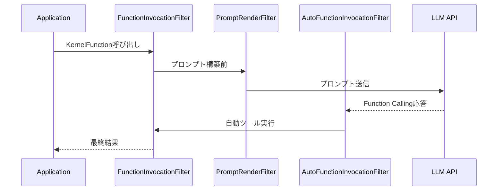

## ブログ概要（Summary）

MicrosoftのSemantic Kernelチーム（Roger Barreto、Eduard van Valkenburg、Dmytro Struk）が2024年11月に公開したブログ記事では、Semantic Kernelのフィルター機構がGA（General Availability）リリースされたことが報告されている。従来のイベントベースAPIから3種類のフィルター（FunctionInvocationFilter、PromptRenderFilter、AutoFunctionInvocationFilter）への移行が完了し、.NETとPythonの両環境で利用可能となった。著者らは「フィルターはセキュリティを向上させるだけでなく、自信を持ってデプロイできるエンタープライズ対応ソリューションの構築に貢献する」と述べている。

この記事は [Zenn記事: Semantic Kernel v1.41フィルターで実現する本番AIアプリの品質管理基盤](https://zenn.dev/0h_n0/articles/40a111c0c0ed23) の深掘りです。

## 情報源

- **種別**: Microsoft公式DevBlog
- **URL**: [https://devblogs.microsoft.com/semantic-kernel/announcing-the-ga-release-of-filters-for-net-and-python-in-semantic-kernel/](https://devblogs.microsoft.com/semantic-kernel/announcing-the-ga-release-of-filters-for-net-and-python-in-semantic-kernel/)
- **著者**: Roger Barreto, Eduard van Valkenburg, Dmytro Struk（Microsoft Semantic Kernel Team）
- **発表日**: 2024年11月21日

## 技術的背景（Technical Background）

Semantic Kernelは、LLM呼び出しの前後にカスタムロジックを挿入するためにイベントベースのAPIを提供していた。しかし、イベントベースのアプローチには以下の制約があった：

1. **制御フローの不透明さ**: イベントハンドラの実行順序が暗黙的で、デバッグが困難
2. **非同期処理の制約**: イベントモデルでは非同期パイプラインの構成が煩雑
3. **コンテキスト共有の制限**: ハンドラ間でのデータ受け渡しに統一的な仕組みがなかった

フィルターパターンは、ASP.NETのMiddleware/Filterパイプラインから着想を得ており、各フィルターが`next`デリゲート/コールバックを呼び出すことで明示的な制御フローを構成する。この設計は、分散システムにおけるインターセプターパターン（gRPC Interceptor、Java Servlet Filter等）と同じ設計思想に基づいている。

## 実装アーキテクチャ（Architecture）

### 3種類のフィルターとパイプライン構造

Semantic Kernelのフィルターは3種類に分類され、それぞれ異なるタイミングで実行される。



**1. FunctionInvocationFilter（関数呼び出しフィルター）**

`KernelFunction`が呼び出されるたびに実行される最も汎用的なフィルターである。関数の入出力に対するインターセプションが可能で、例外処理、結果の上書き、リトライロジックの実装に使用される。

```python
from semantic_kernel.filters import FunctionInvocationContext

async def logging_filter(
    context: FunctionInvocationContext,
    next_filter
) -> None:
    """関数呼び出しのログ記録フィルター"""
    function_name = context.function.name
    plugin_name = context.function.plugin_name

    logger.info(
        "function_invocation_start",
        extra={
            "event": "function_invocation_start",
            "function": function_name,
            "plugin": plugin_name,
            "arguments": str(context.arguments),
        }
    )

    try:
        await next_filter(context)
    except Exception as e:
        logger.error(
            "function_invocation_error",
            extra={
                "event": "function_invocation_error",
                "function": function_name,
                "error.type": type(e).__name__,
                "error.message": str(e),
            }
        )
        raise

    logger.info(
        "function_invocation_end",
        extra={
            "event": "function_invocation_end",
            "function": function_name,
            "result_type": type(context.result.value).__name__
            if context.result else "None",
        }
    )
```

コンテキストオブジェクトは以下のプロパティを公開する：

| プロパティ | 型 | 説明 |
|-----------|------|------|
| `function` | KernelFunction | 実行対象の関数 |
| `arguments` | KernelArguments | 関数の引数 |
| `result` | FunctionResult | 関数の実行結果（`next`呼び出し後に利用可能） |
| `exception` | Exception \| None | 発生した例外 |
| `is_cancel_requested` | bool | 実行キャンセルフラグ |

**2. PromptRenderFilter（プロンプトレンダリングフィルター）**

プロンプトがLLMに送信される前に実行されるフィルターである。プロンプトの内容を検査・変更・差し止めることが可能で、PII（個人識別情報）の除去やプロンプトインジェクションの検出に使用される。

```python
from semantic_kernel.filters import PromptRenderContext

async def pii_removal_filter(
    context: PromptRenderContext,
    next_filter
) -> None:
    """プロンプトからPIIを除去するフィルター"""
    await next_filter(context)

    if context.rendered_prompt:
        original = context.rendered_prompt
        sanitized = remove_pii(original)

        if original != sanitized:
            logger.info(
                "pii_removed",
                extra={
                    "event": "pii_removed",
                    "original_length": len(original),
                    "sanitized_length": len(sanitized),
                }
            )
            context.rendered_prompt = sanitized


def remove_pii(text: str) -> str:
    """正規表現ベースのPII除去（簡易版）"""
    import re
    # メールアドレス
    text = re.sub(
        r"[a-zA-Z0-9._%+-]+@[a-zA-Z0-9.-]+\.[a-zA-Z]{2,}",
        "[EMAIL_REDACTED]",
        text,
    )
    # 日本の電話番号
    text = re.sub(
        r"0\d{1,4}-?\d{1,4}-?\d{4}",
        "[PHONE_REDACTED]",
        text,
    )
    return text
```

**3. AutoFunctionInvocationFilter（自動関数呼び出しフィルター）**

LLMがFunction Calling（ツール使用）を要求した際に自動実行されるフィルターである。チャット履歴、イテレーションカウンター、関数呼び出しの中断制御にアクセスできる。

```python
from semantic_kernel.filters import AutoFunctionInvocationContext

async def safety_gate_filter(
    context: AutoFunctionInvocationContext,
    next_filter
) -> None:
    """自動関数呼び出しの安全性ゲート"""
    function_name = context.function.name

    # 許可リストによる制御
    allowed_functions = {
        "search_web",
        "get_weather",
        "calculate",
    }

    if function_name not in allowed_functions:
        logger.warning(
            "blocked_auto_invocation",
            extra={
                "event": "blocked_auto_invocation",
                "function": function_name,
                "chat_history_length": len(context.chat_history),
                "iteration": context.request_sequence_index,
            }
        )
        context.terminate = True
        return

    # イテレーション回数の上限チェック
    if context.request_sequence_index > 5:
        logger.warning(
            "max_iterations_reached",
            extra={
                "event": "max_iterations_reached",
                "iteration": context.request_sequence_index,
            }
        )
        context.terminate = True
        return

    await next_filter(context)
```

AutoFunctionInvocationFilter固有のプロパティ：

| プロパティ | 型 | 説明 |
|-----------|------|------|
| `chat_history` | ChatHistory | 現在のチャット履歴 |
| `request_sequence_index` | int | Function Callingのイテレーション番号 |
| `function_count` | int | LLMが要求した関数呼び出しの総数 |
| `terminate` | bool | 自動呼び出しループの中断フラグ |

### フィルターの登録と実行順序

フィルターはKernelオブジェクトに登録され、登録順に実行される。複数のフィルターはパイプラインとして連鎖する。

```python
from semantic_kernel import Kernel

kernel = Kernel()

# フィルターの登録（実行順序は登録順）
kernel.add_filter("function_invocation", telemetry_filter)
kernel.add_filter("function_invocation", logging_filter)
kernel.add_filter("prompt_render", pii_removal_filter)
kernel.add_filter("auto_function_invocation", safety_gate_filter)
```

### イベントAPIからの移行パス

GA以前はイベントベースのAPIが使用されていた。著者らはイベントAPIを非推奨とし、フィルターへの移行を推奨している。

```python
# 旧API（非推奨）
@kernel.on_function_invoking
async def on_invoking(sender, args):
    # イベントハンドラ
    pass

# 新API（GA）
async def migration_filter(
    context: FunctionInvocationContext,
    next_filter
) -> None:
    # next呼び出し前 = invoking相当
    pre_process(context)
    await next_filter(context)
    # next呼び出し後 = invoked相当
    post_process(context)
```

## 6つの適用パターン

ブログ記事では、フィルターの具体的な適用パターンとしてサンプルコードへのリンクが示されている。

### 1. PII検出・除去（PIIDetection）

PromptRenderFilterでプロンプト中のPIIを検出し、マスキングまたは除去する。正規表現ベースの簡易アプローチと、NERモデルベースの高精度アプローチの両方が想定される。

### 2. セマンティックキャッシュ（SemanticCachingWithFilters）

FunctionInvocationFilterで、意味的に類似した過去のクエリに対してキャッシュされた応答を返す。ベクトル類似度の閾値 $\tau$ を設定し、$\text{sim}(q, q_{\text{cached}}) > \tau$ の場合にキャッシュヒットとする。

$$
\text{CacheHit}(q) = \begin{cases} \text{cached\_response}(q') & \text{if } \cos(\mathbf{e}(q), \mathbf{e}(q')) > \tau \\
\text{LLM}(q) & \text{otherwise} \end{cases}
$$

ここで $\mathbf{e}(q)$ はクエリ $q$ の埋め込みベクトル、$\tau$ は類似度閾値（一般的に0.90〜0.95）である。

### 3. コンテンツ安全性（ContentSafety）

PromptRenderFilterとFunctionInvocationFilterの組み合わせで、入力プロンプトと出力結果の両方に対してコンテンツ安全性チェックを実施する。Azure AI Content Safetyとの統合が想定されている。

### 4. テキスト要約の品質チェック（QualityCheck - Summarization）

FunctionInvocationFilterで、LLMによる要約結果の品質を評価する。情報保持率や忠実度をメトリクスとして測定し、閾値を下回る場合にリトライする。

### 5. 翻訳品質の検証（QualityCheck - Translation）

FunctionInvocationFilterで、翻訳結果の品質を別のLLM呼び出しまたはBLEUスコア等で評価する。

### 6. プロンプトインジェクション防御

PromptRenderFilterで、ユーザー入力に含まれる潜在的なインジェクション攻撃パターンを検出する。CaMeL（Debenedetti et al., 2024）のDual-LLMアーキテクチャのように、信頼境界の異なるLLM呼び出しを分離するアプローチをフィルターレベルで実装できる。

## パフォーマンス最適化（Performance）

フィルターのオーバーヘッドは、LLM API呼び出しのレイテンシ（数百ミリ秒〜数秒）と比較して無視できる水準である。ただし、以下の最適化が推奨される：

**フィルター内での外部呼び出しの最小化**: PII検出にNERモデルを使用する場合、モデルのロードをフィルター登録時（初期化時）に行い、フィルター実行時にはインファレンスのみとする。

**セマンティックキャッシュのベクトル検索最適化**: キャッシュヒット判定のベクトル検索は、HNSW（Hierarchical Navigable Small World）インデックスを使用して$O(\log n)$で実行する。

**フィルターチェーンの順序最適化**: コストの低いフィルター（ログ記録、メトリクス収集）を先に実行し、コストの高いフィルター（セマンティックキャッシュ、コンテンツ安全性チェック）を後に配置することで、早期リターンの確率を高める。

```python
# 推奨されるフィルター登録順序
kernel.add_filter("function_invocation", metrics_filter)      # 低コスト
kernel.add_filter("function_invocation", cache_filter)         # キャッシュヒット時に早期リターン
kernel.add_filter("function_invocation", content_safety_filter)  # 外部API呼び出し
kernel.add_filter("function_invocation", quality_check_filter)   # 後処理
```

## 運用での学び（Production Lessons）

### フィルターの冪等性

フィルターがリトライロジックを含む場合、同一リクエストに対して複数回実行される可能性がある。フィルター内の副作用（ログ記録、メトリクス送信、外部API呼び出し）は冪等に設計する必要がある。

### エラーハンドリング戦略

フィルター内で発生した例外は、`next`デリゲートの呼び出し前か後かで挙動が異なる。`next`呼び出し前の例外はパイプライン全体をスキップし、`next`呼び出し後の例外は後続フィルターのクリーンアップ処理に影響する。

### テスト戦略

フィルターの単体テストでは、`next`デリゲートをモック化してフィルター単体の動作を検証する。統合テストでは、実際のKernelインスタンスにフィルターを登録し、エンドツーエンドの動作を検証する。

```python
import pytest
from unittest.mock import AsyncMock

@pytest.mark.asyncio
async def test_pii_removal_filter():
    """PII除去フィルターの単体テスト"""
    context = create_mock_prompt_context(
        rendered_prompt="Contact: user@example.com"
    )
    next_filter = AsyncMock()

    await pii_removal_filter(context, next_filter)

    next_filter.assert_called_once()
    assert "[EMAIL_REDACTED]" in context.rendered_prompt
    assert "user@example.com" not in context.rendered_prompt
```

## 学術研究との関連（Academic Connection）

Semantic Kernelのフィルターアーキテクチャは、以下の学術的概念と関連している：

- **Aspect-Oriented Programming（AOP）**: フィルターはAOPの「アドバイス」に相当し、関数呼び出しの前後に横断的関心事（ログ、セキュリティ、キャッシュ）を挿入する
- **Chain of Responsibility パターン**: `next`デリゲートによるフィルターチェーンは、GoFのChain of Responsibilityパターンの非同期版として実装されている
- **プロンプトインジェクション防御**: CaMeL（Debenedetti et al., 2024）のDual-LLMアーキテクチャは、AutoFunctionInvocationFilterで信頼レベルに基づくツール実行制御として実装可能

## まとめと実践への示唆

Semantic KernelのフィルターGA版は、AIアプリケーションの本番運用に必要な横断的関心事を体系的に管理する仕組みを提供する。FunctionInvocationFilter（汎用制御）、PromptRenderFilter（プロンプト保護）、AutoFunctionInvocationFilter（ツール実行制御）の3種類のフィルターは、それぞれ異なるレイヤーの品質管理を担う。

イベントベースAPIからフィルターへの移行により、制御フローの透明性と非同期パイプラインの構成容易性が向上した。PII除去、セマンティックキャッシュ、コンテンツ安全性、品質検証といった具体的な適用パターンが示されており、これらを組み合わせることで、元Zenn記事で解説されている本番AIアプリの品質管理基盤を構築できる。

## 参考文献

- **Blog URL**: [https://devblogs.microsoft.com/semantic-kernel/announcing-the-ga-release-of-filters-for-net-and-python-in-semantic-kernel/](https://devblogs.microsoft.com/semantic-kernel/announcing-the-ga-release-of-filters-for-net-and-python-in-semantic-kernel/)
- **.NET Samples**: [Semantic Kernel Concepts - Filtering](https://github.com/microsoft/semantic-kernel/tree/main/dotnet/samples/Concepts/Filtering)
- **Python Samples**: [auto_function_invoke_filters.py](https://github.com/microsoft/semantic-kernel/blob/main/python/samples/concepts/filtering/auto_function_invoke_filters.py)
- **Related Zenn article**: [https://zenn.dev/0h_n0/articles/40a111c0c0ed23](https://zenn.dev/0h_n0/articles/40a111c0c0ed23)
