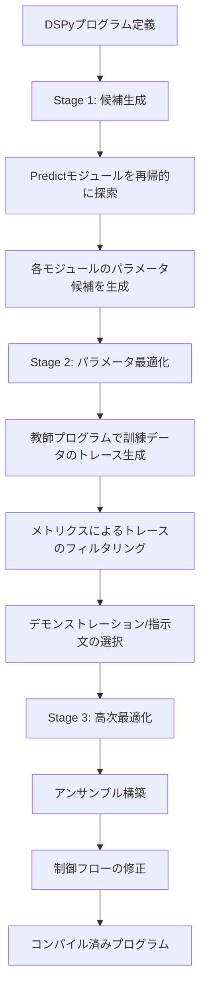

## 論文概要（Abstract）

DSPy（Declarative Self-improving Python）は、Stanford NLPグループが提案した、言語モデル（LM）パイプラインを**テキスト変換グラフ**として抽象化するプログラミングフレームワークである。従来のプロンプトエンジニアリングでは、パイプラインの各ステージごとに手作業でプロンプト文字列を調整する必要があったが、DSPyでは**シグネチャ**（入出力仕様の宣言）、**モジュール**（推論パターンの抽象化）、**テレプロンプター**（自動最適化戦略）の3つの抽象化により、パイプラインの構造定義と最適化を分離する。コンパイラがプログラム構造からプロンプトやファインチューニングを自動生成することで、GPT-3.5で標準few-shotを25%以上、llama2-13b-chatで65%以上上回る性能を達成したと著者らは報告している。

この記事は [Zenn記事: DSPy v3.1 GEPA×Evaluateで構築するプロンプト最適化自動化パイプライン](https://zenn.dev/0h_n0/articles/f9fe90f40b04ef) の深掘りです。

## 情報源

| 項目 | 内容 |
|------|------|
| **arXiv ID** | [2310.03714](https://arxiv.org/abs/2310.03714) |
| **タイトル** | DSPy: Compiling Declarative Language Model Calls into Self-Improving Pipelines |
| **著者** | Omar Khattab, Arnav Singhvi, Paridhi Maheshwari et al. (Stanford NLP) |
| **発表年** | 2023年（ICLR 2024採択） |
| **分野** | cs.CL, cs.AI |
| **リポジトリ** | [stanfordnlp/dspy](https://github.com/stanfordnlp/dspy) |

## 背景と動機

大規模言語モデル（LLM）を複数ステージで連鎖させるパイプライン（RAG、ReAct、Chain-of-Thoughtなど）は、各ステージのプロンプトが**脆弱**であるという根本的な課題を抱えている。モデルの変更、データ分布のシフト、パイプライン構造の修正のいずれにおいても、手作業によるプロンプト再調整が必要になる。著者らはこの状況を「prompt engineering is brittle」と表現し、LangChainなどの既存フレームワークが50以上の1000文字超のハードコードされたプロンプト文字列を含んでいることを指摘している。

DSPyの動機は、ニューラルネットワーク開発におけるPyTorchの役割と同様に、**プログラム構造の定義とパラメータ最適化を明確に分離**することにある。PyTorchでは開発者がレイヤ構成を定義し、SGDなどのオプティマイザが重みを最適化する。DSPyはこの設計哲学をLMパイプラインに持ち込み、プロンプト文字列の手動調整を不要にすることを目指している。

## 主要な貢献

著者らが報告している主要な貢献は以下の通りである。

- **シグネチャ（Signatures）**: 入出力の型と説明を宣言的に定義する仕組みにより、プロンプト文字列のハードコードを排除した
- **パラメータ化モジュール**: Predict、ChainOfThought、ReActなどの推論パターンを、デモンストレーションと指示文をパラメータとして持つ再利用可能なモジュールとして実装した
- **テレプロンプター（コンパイラ）**: BootstrapFewShot、MIPRO等の汎用最適化戦略により、プロンプト・ファインチューニング・拡張・推論技法の組み合わせを自動的に決定する
- **小規模モデルでの競争力**: T5-Large（770Mパラメータ）やllama2-13b-chatをDSPyでコンパイルした結果が、GPT-3.5向けの専門家作成プロンプトチェーンと競争可能な性能を示した
- **ゼロハードコードプロンプト**: DSPyライブラリ自体にはプロンプトのデモンストレーション文字列が一切含まれていない

## 技術的詳細

### シグネチャ（Signatures）

シグネチャは、LMに対する入出力仕様の**自然言語型宣言**である。従来のプロンプトテンプレートが「どのようにLMを呼び出すか」を指定するのに対し、シグネチャは「何を入力し何を出力するか」だけを宣言する。

短縮記法では以下のように書く。

```python
# 短縮記法: "input_field1, input_field2 -> output_field"
qa_signature = "context, question -> answer"
summarize_signature = "document -> summary"
```

クラスベースの記法では、フィールドの説明を付与できる。

```python
import dspy


class QASignature(dspy.Signature):
    """与えられたコンテキストから質問に正確に回答する。"""

    context: str = dspy.InputField(desc="参照するコンテキスト情報")
    question: str = dspy.InputField(desc="ユーザーからの質問")
    answer: str = dspy.OutputField(desc="根拠に基づく簡潔な回答")
```

コンパイラはシグネチャからLMへの実際のプロンプトを自動生成する。docstringはタスクの指示文として利用され、各フィールドの `desc` はフィールド説明としてプロンプトに埋め込まれる。

### モジュール（Modules）

モジュールは、シグネチャを受け取り特定の推論パターンを適用するパラメータ化された単位である。各モジュールは**デモンストレーション（few-shot例）**と**指示文**をパラメータとして保持し、コンパイラによって最適化される。

論文で提案されている主要なモジュールは以下の通りである。

| モジュール | 役割 | 内部動作 |
|-----------|------|---------|
| `dspy.Predict` | 基本予測 | シグネチャに基づきプロンプトを構成しLMを呼び出す |
| `dspy.ChainOfThought` | 段階的推論 | シグネチャに `reasoning` フィールドを自動追加し、段階的思考を促す |
| `dspy.ProgramOfThought` | コード生成推論 | 推論をコード生成として実行し、インタプリタで実行する |
| `dspy.ReAct` | 行動-観察ループ | Thought/Action/Observationのステップを反復する |
| `dspy.MultiChainComparison` | 複数推論比較 | 複数のChainOfThought結果を比較し最良を選択する |

以下はChainOfThoughtとReActを組み合わせたマルチホップQAプログラムの実装例である。

```python
import dspy
from dspy import Signature, InputField, OutputField


class MultiHopQA(dspy.Module):
    """マルチホップ質問応答プログラム。

    2段階の検索と推論を組み合わせて複雑な質問に回答する。
    """

    def __init__(self, num_hops: int = 2) -> None:
        super().__init__()
        self.num_hops = num_hops
        self.retrieve = dspy.Retrieve(k=3)
        self.generate_query = dspy.ChainOfThought("context, question -> search_query")
        self.generate_answer = dspy.ChainOfThought(
            "context, question -> answer"
        )

    def forward(self, question: str) -> dspy.Prediction:
        """質問を受け取り、マルチホップ検索と推論で回答を生成する。

        Args:
            question: ユーザーからの質問文字列。

        Returns:
            dspy.Prediction: answer フィールドを含む予測結果。
        """
        context: list[str] = []
        for _hop in range(self.num_hops):
            query = self.generate_query(
                context="; ".join(context), question=question
            ).search_query
            passages = self.retrieve(query).passages
            context.extend(passages)
        return self.generate_answer(
            context="; ".join(context), question=question
        )
```

### テレプロンプター / オプティマイザ

テレプロンプターは、プログラム構造を変えずにモジュールのパラメータ（デモンストレーション、指示文）を自動最適化する戦略である。著者らは以下のテレプロンプターを提案している。

| テレプロンプター | 最適化対象 | 手法 |
|----------------|-----------|------|
| `LabeledFewShot(k)` | デモンストレーション | 訓練セットから $k$ 件をランダムサンプリング |
| `BootstrapFewShot` | デモンストレーション | 教師プログラムでトレースを生成し、メトリクスでフィルタリング |
| `BootstrapFewShotWithRandomSearch` | デモンストレーション | BootstrapFewShotにランダム探索を追加 |
| `MIPRO` | 指示文 + デモンストレーション | ベイズ最適化（TPE）で指示文とデモンストレーションを同時最適化 |
| `BootstrapFinetune` | モデル重み | デモンストレーションを用いた教師あり微調整 |

### コンパイルプロセス

DSPyコンパイラの最適化は3段階で構成される。



**BootstrapFewShotのコンパイルアルゴリズム**は以下の手順で動作すると著者らは説明している。

1. 教師プログラム $T$ を用意する（未指定時は生徒プログラム $S$ のゼロショット版）
2. 訓練データ $\mathcal{D}_{\text{train}}$ の各入力 $x_i$ に対して $T$ を実行し、内部のPredictモジュールの呼び出しトレース $\tau_i$ を収集する
3. メトリクス関数 $M(x_i, \hat{y}_i)$ でトレースをフィルタリングし、閾値を超えたトレースのみを保持する
4. フィルタリング済みトレースからデモンストレーションを抽出し、生徒プログラム $S$ の対応するPredictモジュールに割り当てる

この過程を数式で表すと、コンパイル済みプログラム $S^*$ は以下のように定義される。

$$
S^* = \text{Compile}(S, T, \mathcal{D}_{\text{train}}, M)
$$

ここで、各Predictモジュール $p_j \in S$ のデモンストレーション集合 $D_j$ は以下で構成される。

$$
D_j = \{ (x_i^{(j)}, y_i^{(j)}) \mid \tau_i \in \mathcal{T}_{\text{valid}}, \ M(x_i, \hat{y}_i) \geq \theta \}
$$

$\mathcal{T}_{\text{valid}}$ はメトリクス閾値 $\theta$ を通過したトレースの集合、$x_i^{(j)}$ と $y_i^{(j)}$ はトレース $\tau_i$ におけるモジュール $p_j$ の入出力である。

**BootstrapFewShotWithRandomSearch** は上記に加えて、デモンストレーションの選択に対してランダム探索を行い、検証セットでの性能が最大となる組み合わせを選択する。

**MIPRO**（Multi-prompt Instruction Proposal Optimizer）は、指示文とデモンストレーションの同時最適化にベイズ最適化（Tree-structured Parzen Estimator）を適用する。各Predictモジュールの指示文候補をLMで生成し、TPEで最適な組み合わせを探索する。

### コード例: コンパイルの実行

```python
import dspy
from dspy.teleprompt import BootstrapFewShot


def validate_answer(example: dspy.Example, pred: dspy.Prediction, trace=None) -> bool:
    """予測結果が正解と一致するか検証する。

    Args:
        example: 正解ラベルを含む訓練データ。
        pred: モデルの予測結果。
        trace: コンパイル時の内部トレース（オプション）。

    Returns:
        bool: 正解と一致する場合True。
    """
    return example.answer.lower() == pred.answer.lower()


# テレプロンプターの設定
teleprompter = BootstrapFewShot(
    metric=validate_answer,
    max_bootstrapped_demos=4,  # ブートストラップで生成するデモの最大数
    max_labeled_demos=16,       # ラベル付きデモの最大数
    max_rounds=1,               # ブートストラップの試行回数
)

# コンパイル実行
compiled_program: MultiHopQA = teleprompter.compile(
    student=MultiHopQA(),
    trainset=trainset,  # List[dspy.Example]
)

# コンパイル済みプログラムの保存と読み込み
compiled_program.save("compiled_multihop.json")

loaded_program = MultiHopQA()
loaded_program.load("compiled_multihop.json")
```

## 実装のポイント

DSPyを実際に使用する際のポイントを、著者らの記述と公式ドキュメントに基づいてまとめる。

### 1. メトリクス設計が最適化の鍵

コンパイラの性能はメトリクス関数の品質に直結する。二値（True/False）よりも段階的スコア（0.0--1.0）を返すメトリクスの方が、BootstrapFewShotのフィルタリングで有効なトレースを多く確保できる。

```python
def graded_metric(
    example: dspy.Example, pred: dspy.Prediction, trace=None
) -> float:
    """段階的スコアを返すメトリクス。

    Args:
        example: 正解を含むデータ。
        pred: モデルの予測。
        trace: コンパイル時トレース。

    Returns:
        float: 0.0から1.0の評価スコア。
    """
    gold = example.answer.lower().strip()
    predicted = pred.answer.lower().strip()
    if gold == predicted:
        return 1.0
    # 部分一致: トークンレベルのF1
    gold_tokens = set(gold.split())
    pred_tokens = set(predicted.split())
    if not pred_tokens or not gold_tokens:
        return 0.0
    overlap = gold_tokens & pred_tokens
    precision = len(overlap) / len(pred_tokens)
    recall = len(overlap) / len(gold_tokens)
    if precision + recall == 0:
        return 0.0
    return 2 * precision * recall / (precision + recall)
```

### 2. 教師モデルと生徒モデルの分離

BootstrapFewShotでは、より大きなモデルを教師として使い、小さなモデルを生徒としてコンパイルすることで、小規模モデルの性能を引き上げられる。

```python
# 教師: GPT-4o、生徒: GPT-4o-mini
teacher_lm = dspy.LM("openai/gpt-4o")
student_lm = dspy.LM("openai/gpt-4o-mini")

# 教師設定でコンパイル
dspy.configure(lm=student_lm)
teleprompter = BootstrapFewShot(
    metric=graded_metric,
    max_bootstrapped_demos=4,
    teacher_settings={"lm": teacher_lm},
)
compiled = teleprompter.compile(MultiHopQA(), trainset=trainset)
```

### 3. アサーション（現在は非推奨）からRefineへの移行

論文発表時点では `dspy.Assert` / `dspy.Suggest` が出力制約の仕組みとして提案されていた。DSPy v3.1ではこれらは非推奨となり、`dspy.Refine` と `dspy.BestOfN` に置き換えられている。詳細は[関連Zenn記事](https://zenn.dev/0h_n0/articles/f9fe90f40b04ef)を参照されたい。

## 実験結果

著者らは2つのベンチマークタスクで評価を実施している。

### GSM8K（数学文章題）

3つのDSPyプログラム（vanilla、CoT、reflection）を複数のコンパイル戦略で評価した結果が報告されている。

| プログラム | コンパイル | GPT-3.5 Dev | GPT-3.5 Test | llama2-13b Dev | llama2-13b Test |
|-----------|-----------|-------------|--------------|----------------|-----------------|
| vanilla | なし | 24.0 | 25.2 | 7.0 | 9.4 |
| vanilla | fewshot | 33.1 | -- | 4.3 | -- |
| vanilla | bootstrap | 44.0 | -- | 28.0 | -- |
| vanilla | bootstrap x2 | 64.7 | 61.7 | 37.3 | 36.5 |
| CoT | なし | 50.0 | -- | 26.7 | -- |
| CoT | fewshot+human_CoT | 78.6 | 72.4 | 34.3 | 33.7 |
| CoT | bootstrap | 80.3 | 72.9 | 43.3 | -- |
| CoT | +ensemble | 88.3 | 81.6 | 43.7 | -- |
| reflection | なし | 65.0 | -- | 36.7 | -- |
| reflection | bootstrap | 83.0 | 76.0 | 44.3 | 40.2 |
| reflection | +ensemble | 86.7 | -- | 49.0 | 46.9 |

GPT-3.5ではvanillaの24.0%からCoT+ensembleの88.3%まで、64.3ポイントの改善が見られる。llama2-13b-chatでも7.0%から49.0%への大幅な改善が報告されている。

### HotPotQA（マルチホップ質問応答）

open-domain fullwiki設定で、ColBERTv2リトリーバを使用した結果が報告されている。Ans/Psgは回答の完全一致（EM）とパッセージ精度を示す。

| プログラム | コンパイル | GPT-3.5 Dev (Ans/Psg) | GPT-3.5 Test (Ans/Psg) | llama2 Dev (Ans/Psg) | llama2 Test (Ans/Psg) |
|-----------|-----------|----------------------|----------------------|---------------------|---------------------|
| vanilla | fewshot | 34.3 / -- | 31.5 / -- | 27.5 / -- | 21.8 / -- |
| CoT_RAG | fewshot | 36.4 / 36.0 | 29.8 / 34.4 | 34.5 / 36.0 | 28.0 / 34.4 |
| CoT_RAG | bootstrap | 42.3 / 36.0 | -- | 38.3 / 36.0 | 32.9 / 34.4 |
| multihop | fewshot | 36.9 / 38.3 | 31.2 / 40.8 | 34.7 / 32.0 | 31.3 / 30.8 |
| multihop | bootstrap | 48.7 / 47.0 | 39.6 / 43.8 | 42.0 / 48.3 | 36.4 / 43.5 |
| multihop | ensemble | 54.7 / -- | 45.6 / -- | 50.0 / -- | 41.0 / -- |

multihop+ensembleで GPT-3.5が54.7%、llama2-13b-chatが50.0%の回答EMを達成している。特筆すべきは、llama2-13b-chat（オープンモデル）がGPT-3.5のfewshotベースライン（34.3%）を大幅に上回っている点である。

### T5-Large（770Mパラメータ）によるファインチューニング

BootstrapFinetuneテレプロンプターを用いてT5-Large（770M）をファインチューニングした結果、HotPotQA devセットで回答EM 39.3%、パッセージ精度46%を達成したと報告されている。200件のラベル付きデータと800件のラベルなしデータを使用し、GPT-3.5の専門家作成プロンプトチェーンと競争可能な性能を示している。

## 実運用への応用

DSPyの実運用上の意義は、**モデル変更時のプロンプト再調整コストの削減**にある。従来は、GPT-3.5からGPT-4oへの移行やオープンモデルへの切り替え時に、プロンプトの書き直しが必要であった。DSPyでは同一プログラムを新しいモデルで再コンパイルするだけで、モデルに適したプロンプトが自動生成される。

関連する[Zenn記事](https://zenn.dev/0h_n0/articles/f9fe90f40b04ef)では、DSPy v3.1のGEPAオプティマイザとEvaluateフレームワークを組み合わせたCI/CDパイプラインが紹介されている。本論文の基盤設計が、現在のv3.1まで一貫して受け継がれていることがわかる。

## Production Deployment Guide

### AWS実装パターン

DSPyベースのLMパイプラインをAWSにデプロイする際の3つの構成パターンを示す。

#### Small構成（サーバレス / 月額推定: $50--200）

少量トラフィック向け。Lambda + API Gatewayで構築し、LLMはOpenAI API等の外部サービスを利用する。DSPyのコンパイル済みプログラムはS3に保存する。

```
API Gateway -> Lambda (DSPy推論) -> OpenAI API
                  |
                  +-> S3 (コンパイル済みプログラムJSON)
                  +-> DynamoDB (キャッシュ/ログ)
```

#### Medium構成（ECS Fargate / 月額推定: $300--800）

中規模トラフィック向け。Fargateでコンテナ化し、ElastiCacheでDSPyのLMキャッシュを永続化する。

```
ALB -> ECS Fargate (DSPyサービス) -> Bedrock / OpenAI API
            |
            +-> ElastiCache Redis (LMキャッシュ)
            +-> S3 (プログラムJSON + 訓練データ)
```

#### Large構成（ECS + SageMaker / 月額推定: $1,500--5,000）

高トラフィック + オープンモデル自社ホスト向け。SageMakerエンドポイントでllama系モデルをホストし、DSPyからvLLM経由で接続する。

```
ALB -> ECS Fargate (DSPyサービス) -> SageMaker Endpoint (vLLM)
            |                              |
            +-> ElastiCache Redis          +-> S3 Model Artifacts
            +-> Step Functions (再コンパイルジョブ)
```

### Terraformインフラコード（Small構成）

```hcl
# main.tf - DSPy Serverless Infrastructure (Small)
terraform {
  required_version = ">= 1.5.0"
  required_providers {
    aws = {
      source  = "hashicorp/aws"
      version = "~> 5.0"
    }
  }
}

provider "aws" {
  region = var.aws_region
}

variable "aws_region" {
  description = "AWS region for deployment"
  type        = string
  default     = "ap-northeast-1"
}

variable "project_name" {
  description = "Project name prefix for resources"
  type        = string
  default     = "dspy-pipeline"
}

variable "openai_api_key_arn" {
  description = "ARN of the Secrets Manager secret containing the OpenAI API key"
  type        = string
}

# S3 bucket for compiled DSPy programs
resource "aws_s3_bucket" "dspy_artifacts" {
  bucket = "${var.project_name}-artifacts-${data.aws_caller_identity.current.account_id}"

  tags = {
    Project = var.project_name
  }
}

resource "aws_s3_bucket_versioning" "dspy_artifacts" {
  bucket = aws_s3_bucket.dspy_artifacts.id
  versioning_configuration {
    status = "Enabled"
  }
}

resource "aws_s3_bucket_server_side_encryption_configuration" "dspy_artifacts" {
  bucket = aws_s3_bucket.dspy_artifacts.id
  rule {
    apply_server_side_encryption_by_default {
      sse_algorithm = "AES256"
    }
  }
}

# DynamoDB table for caching LM responses
resource "aws_dynamodb_table" "lm_cache" {
  name         = "${var.project_name}-lm-cache"
  billing_mode = "PAY_PER_REQUEST"
  hash_key     = "cache_key"

  attribute {
    name = "cache_key"
    type = "S"
  }

  ttl {
    attribute_name = "ttl"
    enabled        = true
  }

  tags = {
    Project = var.project_name
  }
}

# IAM role for Lambda
resource "aws_iam_role" "lambda_role" {
  name = "${var.project_name}-lambda-role"

  assume_role_policy = jsonencode({
    Version = "2012-10-17"
    Statement = [
      {
        Action = "sts:AssumeRole"
        Effect = "Allow"
        Principal = {
          Service = "lambda.amazonaws.com"
        }
      }
    ]
  })
}

resource "aws_iam_role_policy" "lambda_policy" {
  name = "${var.project_name}-lambda-policy"
  role = aws_iam_role.lambda_role.id

  policy = jsonencode({
    Version = "2012-10-17"
    Statement = [
      {
        Effect = "Allow"
        Action = [
          "s3:GetObject",
          "s3:PutObject",
        ]
        Resource = "${aws_s3_bucket.dspy_artifacts.arn}/*"
      },
      {
        Effect = "Allow"
        Action = [
          "dynamodb:GetItem",
          "dynamodb:PutItem",
          "dynamodb:Query",
        ]
        Resource = aws_dynamodb_table.lm_cache.arn
      },
      {
        Effect = "Allow"
        Action = [
          "secretsmanager:GetSecretValue",
        ]
        Resource = var.openai_api_key_arn
      },
      {
        Effect = "Allow"
        Action = [
          "logs:CreateLogGroup",
          "logs:CreateLogStream",
          "logs:PutLogEvents",
        ]
        Resource = "arn:aws:logs:*:*:*"
      },
      {
        Effect = "Allow"
        Action = [
          "xray:PutTraceSegments",
          "xray:PutTelemetryRecords",
        ]
        Resource = "*"
      }
    ]
  })
}

# Lambda function for DSPy inference
resource "aws_lambda_function" "dspy_inference" {
  function_name = "${var.project_name}-inference"
  role          = aws_iam_role.lambda_role.arn
  handler       = "handler.lambda_handler"
  runtime       = "python3.12"
  timeout       = 120
  memory_size   = 512

  filename         = "lambda_package.zip"
  source_code_hash = filebase64sha256("lambda_package.zip")

  environment {
    variables = {
      S3_BUCKET          = aws_s3_bucket.dspy_artifacts.bucket
      PROGRAM_KEY        = "compiled/program.json"
      DYNAMODB_TABLE     = aws_dynamodb_table.lm_cache.name
      OPENAI_API_KEY_ARN = var.openai_api_key_arn
      POWERTOOLS_SERVICE_NAME = var.project_name
    }
  }

  tracing_config {
    mode = "Active"
  }

  tags = {
    Project = var.project_name
  }
}

# API Gateway
resource "aws_apigatewayv2_api" "dspy_api" {
  name          = "${var.project_name}-api"
  protocol_type = "HTTP"

  cors_configuration {
    allow_origins = ["*"]
    allow_methods = ["POST", "OPTIONS"]
    allow_headers = ["Content-Type", "Authorization"]
    max_age       = 3600
  }
}

resource "aws_apigatewayv2_stage" "default" {
  api_id      = aws_apigatewayv2_api.dspy_api.id
  name        = "$default"
  auto_deploy = true

  access_log_settings {
    destination_arn = aws_cloudwatch_log_group.api_gw.arn
    format = jsonencode({
      requestId      = "$context.requestId"
      ip             = "$context.identity.sourceIp"
      requestTime    = "$context.requestTime"
      httpMethod     = "$context.httpMethod"
      routeKey       = "$context.routeKey"
      status         = "$context.status"
      protocol       = "$context.protocol"
      responseLength = "$context.responseLength"
      integrationLatency = "$context.integrationLatency"
    })
  }
}

resource "aws_apigatewayv2_integration" "lambda" {
  api_id             = aws_apigatewayv2_api.dspy_api.id
  integration_type   = "AWS_PROXY"
  integration_uri    = aws_lambda_function.dspy_inference.invoke_arn
  payload_format_version = "2.0"
}

resource "aws_apigatewayv2_route" "inference" {
  api_id    = aws_apigatewayv2_api.dspy_api.id
  route_key = "POST /inference"
  target    = "integrations/${aws_apigatewayv2_integration.lambda.id}"
}

resource "aws_lambda_permission" "api_gw" {
  statement_id  = "AllowAPIGatewayInvoke"
  action        = "lambda:InvokeFunction"
  function_name = aws_lambda_function.dspy_inference.function_name
  principal     = "apigateway.amazonaws.com"
  source_arn    = "${aws_apigatewayv2_api.dspy_api.execution_arn}/*/*"
}

# CloudWatch Log Groups
resource "aws_cloudwatch_log_group" "lambda" {
  name              = "/aws/lambda/${aws_lambda_function.dspy_inference.function_name}"
  retention_in_days = 30
}

resource "aws_cloudwatch_log_group" "api_gw" {
  name              = "/aws/apigateway/${var.project_name}"
  retention_in_days = 14
}

data "aws_caller_identity" "current" {}

output "api_endpoint" {
  value = aws_apigatewayv2_api.dspy_api.api_endpoint
}

output "lambda_function_name" {
  value = aws_lambda_function.dspy_inference.function_name
}

output "s3_bucket_name" {
  value = aws_s3_bucket.dspy_artifacts.bucket
}
```

### 運用・監視設定

#### CloudWatchアラーム + X-Ray トレーシング

```python
# monitoring.py
"""DSPyパイプラインの運用監視設定。

CloudWatch MetricsとX-Rayを組み合わせた監視基盤。
"""
import json
import time
from typing import Any

import boto3


def create_cloudwatch_alarms(
    function_name: str,
    sns_topic_arn: str,
    region: str = "ap-northeast-1",
) -> list[str]:
    """Lambda関数のCloudWatchアラームを作成する。

    Args:
        function_name: 監視対象のLambda関数名。
        sns_topic_arn: 通知先のSNSトピックARN。
        region: AWSリージョン。

    Returns:
        list[str]: 作成されたアラームのARNリスト。
    """
    cw = boto3.client("cloudwatch", region_name=region)
    alarm_arns: list[str] = []

    alarms_config = [
        {
            "AlarmName": f"{function_name}-high-error-rate",
            "MetricName": "Errors",
            "Namespace": "AWS/Lambda",
            "Statistic": "Sum",
            "Period": 300,
            "EvaluationPeriods": 2,
            "Threshold": 5.0,
            "ComparisonOperator": "GreaterThanThreshold",
            "AlarmDescription": "Lambda error count exceeds 5 in 5 minutes",
        },
        {
            "AlarmName": f"{function_name}-high-duration",
            "MetricName": "Duration",
            "Namespace": "AWS/Lambda",
            "Statistic": "p99",
            "Period": 300,
            "EvaluationPeriods": 3,
            "Threshold": 90000.0,  # 90 seconds (p99)
            "ComparisonOperator": "GreaterThanThreshold",
            "AlarmDescription": "Lambda p99 duration exceeds 90s",
        },
        {
            "AlarmName": f"{function_name}-throttles",
            "MetricName": "Throttles",
            "Namespace": "AWS/Lambda",
            "Statistic": "Sum",
            "Period": 60,
            "EvaluationPeriods": 1,
            "Threshold": 1.0,
            "ComparisonOperator": "GreaterThanOrEqualToThreshold",
            "AlarmDescription": "Lambda throttling detected",
        },
    ]

    for config in alarms_config:
        cw.put_metric_alarm(
            **config,
            Dimensions=[
                {"Name": "FunctionName", "Value": function_name},
            ],
            AlarmActions=[sns_topic_arn],
            OKActions=[sns_topic_arn],
            TreatMissingData="notBreaching",
        )
        alarm_arns.append(config["AlarmName"])

    return alarm_arns


def put_custom_metric(
    metric_name: str,
    value: float,
    unit: str = "None",
    dimensions: dict[str, str] | None = None,
) -> None:
    """DSPyパイプラインのカスタムメトリクスをCloudWatchに送信する。

    Args:
        metric_name: メトリクス名（例: "CompilationDuration", "InferenceScore"）。
        value: メトリクス値。
        unit: 単位（Seconds, Count, None等）。
        dimensions: 追加ディメンション。
    """
    cw = boto3.client("cloudwatch")
    metric_data: dict[str, Any] = {
        "MetricName": metric_name,
        "Value": value,
        "Unit": unit,
        "Timestamp": time.time(),
    }
    if dimensions:
        metric_data["Dimensions"] = [
            {"Name": k, "Value": v} for k, v in dimensions.items()
        ]

    cw.put_metric_data(
        Namespace="DSPy/Pipeline",
        MetricData=[metric_data],
    )
```

#### Cost Explorerによるコスト監視

```python
# cost_monitor.py
"""DSPyパイプラインのAPI費用とAWSコストを監視する。

日次でコスト情報を取得し、閾値超過時にアラートを送信する。
"""
import datetime
import json

import boto3


def get_daily_cost(
    service_filter: str = "AWS Lambda",
    days_back: int = 7,
) -> list[dict[str, str | float]]:
    """指定サービスの日次コストを取得する。

    Args:
        service_filter: 取得対象のAWSサービス名。
        days_back: 何日前からのデータを取得するか。

    Returns:
        list[dict]: 日付とコストのリスト。
    """
    ce = boto3.client("ce")
    end_date = datetime.date.today()
    start_date = end_date - datetime.timedelta(days=days_back)

    response = ce.get_cost_and_usage(
        TimePeriod={
            "Start": start_date.isoformat(),
            "End": end_date.isoformat(),
        },
        Granularity="DAILY",
        Metrics=["UnblendedCost"],
        Filter={
            "Dimensions": {
                "Key": "SERVICE",
                "Values": [service_filter],
            }
        },
    )

    costs: list[dict[str, str | float]] = []
    for result in response["ResultsByTime"]:
        costs.append({
            "date": result["TimePeriod"]["Start"],
            "cost_usd": float(
                result["Total"]["UnblendedCost"]["Amount"]
            ),
        })
    return costs


def check_cost_threshold(
    daily_threshold_usd: float = 10.0,
    sns_topic_arn: str | None = None,
) -> bool:
    """直近のコストが閾値を超えていないか確認する。

    Args:
        daily_threshold_usd: 日次コスト閾値（USD）。
        sns_topic_arn: アラート送信先SNSトピックARN。

    Returns:
        bool: 閾値以内ならTrue。
    """
    costs = get_daily_cost(days_back=1)
    if not costs:
        return True

    latest_cost = costs[-1]["cost_usd"]
    if latest_cost > daily_threshold_usd:
        if sns_topic_arn:
            sns = boto3.client("sns")
            sns.publish(
                TopicArn=sns_topic_arn,
                Subject="DSPy Pipeline Cost Alert",
                Message=json.dumps({
                    "event": "cost_threshold_exceeded",
                    "date": str(costs[-1]["date"]),
                    "cost_usd": latest_cost,
                    "threshold_usd": daily_threshold_usd,
                }),
            )
        return False
    return True
```

### コスト最適化チェックリスト

DSPyパイプラインの運用コストを最適化するためのチェックリストを以下に示す。

**LLM API費用の最適化:**

- [ ] DSPyのLMキャッシュを有効化し、同一入力の重複呼び出しを削減している
- [ ] DynamoDB TTLを設定し、キャッシュの有効期限を管理している
- [ ] 開発・テスト環境では `gpt-4o-mini` 等の低コストモデルを使用している
- [ ] BootstrapFewShotの `max_rounds` を必要最小限に設定している
- [ ] コンパイルは訓練データの変更時のみ実行し、不要な再コンパイルを避けている
- [ ] バッチ推論にはOpenAI Batch APIを活用している
- [ ] プロンプトキャッシュ（Anthropic等）を活用し、プレフィックス共有でコスト削減している

**AWS インフラ費用の最適化:**

- [ ] Lambda関数のメモリサイズを実測に基づいて最適化している（512MB推奨開始）
- [ ] Lambda Provisioned Concurrencyを本番環境でのコールドスタート回避に使用している
- [ ] API GatewayのスロットリングでLambda同時実行数を制限している
- [ ] S3ライフサイクルポリシーで古いコンパイル済みプログラムを自動削除している
- [ ] DynamoDBのオンデマンドキャパシティモードを少量トラフィックで使用している
- [ ] CloudWatch Logsの保持期間を30日以内に設定している
- [ ] 不要なX-Rayトレースのサンプリングレートを調整している

**コンパイル・最適化コストの管理:**

- [ ] コンパイルジョブにタイムアウトを設定している（Step Functions / Lambda）
- [ ] 最適化のAPI呼び出し回数をメトリクスとして記録している
- [ ] コンパイル結果のスコアが改善しない場合の早期停止を実装している
- [ ] 訓練データのサイズを最小有効量に制限している（BootstrapFewShot: 50--200件目安）
- [ ] MIPROのベイズ最適化のtrial数を上限設定している
- [ ] ファインチューニング（BootstrapFinetune）はスポットインスタンスで実行している

**監視・アラート:**

- [ ] LLM APIの月次費用にBudgets Alertを設定している
- [ ] Lambda Errorsのアラームを設定している
- [ ] p99レイテンシのアラームを設定している
- [ ] Cost Explorerで日次コスト推移を監視している
- [ ] カスタムメトリクス（推論スコア、コンパイル時間）をCloudWatchに送信している
- [ ] 異常コスト検知（Cost Anomaly Detection）を有効化している

## 関連研究

- **LMQL (Beurer-Kellner et al., 2023)**: LMへの問い合わせを制約付きプログラミング言語として定義するアプローチ。DSPyがモジュール単位の抽象化を採用するのに対し、LMQLはクエリレベルの制約記述に焦点を当てている
- **Demonstrate-Search-Predict (Khattab et al., 2022)**: DSPyの前身であり、検索拡張生成（RAG）パイプラインの体系的な構成を提案した。DSPyはこの考え方を汎用フレームワークに拡張したものである
- **Automatic Prompt Engineer (APE) (Zhou et al., 2023)**: LMを使ってプロンプト候補を生成・評価する手法。DSPyのMIPROテレプロンプターは、APEの知見をパイプライン全体の最適化に統合している
- **TextGrad (Yuksekgonul et al., 2024)**: テキストフィードバックを勾配として扱い、LMの出力を反復改善するフレームワーク。DSPyのテレプロンプターがデモンストレーションベースの最適化であるのに対し、TextGradは微分可能なテキスト最適化を行う

## まとめと今後の展望

DSPyは、LMパイプラインの構造定義と最適化の分離という設計原則により、プロンプトエンジニアリングのパラダイムを変革する可能性を示した。著者らの実験では、数行のDSPyプログラムと自動コンパイルにより、手作業で構築された専門家レベルのプロンプトチェーンと同等以上の性能が達成されている。今後の方向性として、より多様なモジュール構成の自動探索、マルチモーダルパイプラインへの拡張、そして継続的なプロンプト最適化のCI/CDパイプラインへの統合（関連Zenn記事で紹介されているGEPAベースの自動化など）が期待される。

## 参考文献

1. Khattab, O., Singhvi, A., Maheshwari, P., Zhang, Z., Santhanam, K., Vardhamanan, S., ... & Potts, C. (2023). DSPy: Compiling Declarative Language Model Calls into Self-Improving Pipelines. arXiv:2310.03714. [https://arxiv.org/abs/2310.03714](https://arxiv.org/abs/2310.03714)
2. Khattab, O., Santhanam, K., Li, X. L., Hall, D., Liang, P., Potts, C., & Zaharia, M. (2022). Demonstrate-Search-Predict: Composing retrieval and language models for knowledge-intensive NLP. arXiv:2212.14024.
3. Zhou, Y., Muresanu, A. I., Han, Z., Paster, K., Pitis, S., Chan, H., & Ba, J. (2023). Large Language Models Are Human-Level Prompt Engineers. ICLR 2023.
4. Beurer-Kellner, L., Fischer, M., & Vechev, M. (2023). Prompting Is Programming: A Query Language for Large Language Models. PLDI 2023.
5. DSPy公式ドキュメント. [https://dspy.ai/](https://dspy.ai/)
6. DSPy GitHubリポジトリ. [https://github.com/stanfordnlp/dspy](https://github.com/stanfordnlp/dspy)

---

この記事はAI（Claude Code）により自動生成されました。内容の正確性については複数の情報源で検証していますが、実際の利用時は公式ドキュメントもご確認ください。
