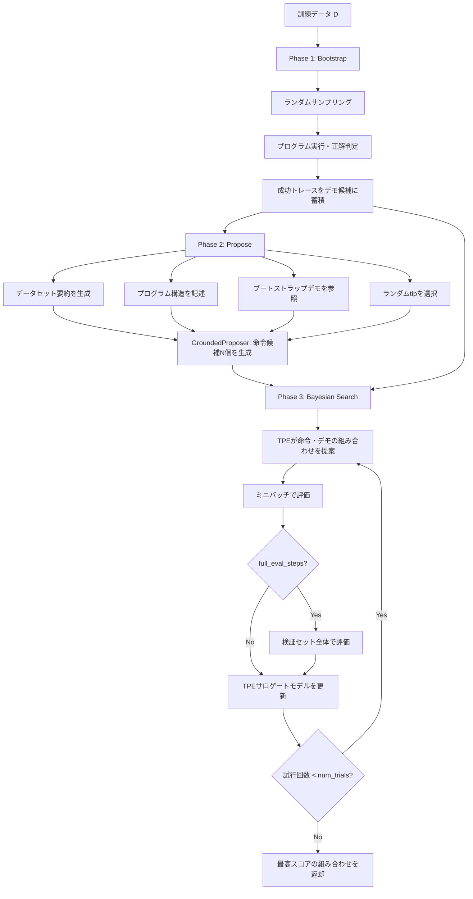

## 論文概要（Abstract）

MIPROv2（Multi-prompt Instruction PRoposal Optimizer Version 2）は、複数のLM呼び出しモジュールで構成されるDSPyプログラムに対して、各モジュールの命令文（instruction）とfew-shotデモンストレーションを同時にベイズ最適化するアルゴリズムである。著者らは、プログラム構造やデータを考慮した命令提案手法、ミニバッチ評価による代理モデル学習、および提案生成自体を改善するメタ最適化の3つの戦略を導入している。Llama-3-8Bを用いた評価で、7つの多段LMプログラムのうち5つでベースラインを上回り、最大13%の精度向上を達成したと報告されている。EMNLP 2024に採録された研究である。

この記事は [Zenn記事: DSPy v3.1 GEPA×Evaluateで構築するプロンプト最適化自動化パイプライン](https://zenn.dev/0h_n0/articles/f9fe90f40b04ef) の深掘りです。

## 情報源

| 項目 | 内容 |
|------|------|
| arXiv ID | [2406.11695](https://arxiv.org/abs/2406.11695) |
| タイトル | Optimizing Instructions and Demonstrations for Multi-Stage Language Model Programs |
| 著者 | Krista Opsahl-Ong, Michael J Ryan, Josh Purtell, et al. （Krista・Michael は共同筆頭著者） |
| 発表年 | 2024（EMNLP 2024 採録） |
| 分野 | cs.CL（自然言語処理）/ cs.AI |
| コード | [https://dspy.ai](https://dspy.ai) （DSPyフレームワークに統合） |

## 背景と動機

近年、単一のLM呼び出しではなく、検索・推論・分類などの複数モジュールをパイプラインとして連結する**LMプログラム**が注目されている。DSPyはこのパラダイムを支えるフレームワークであるが、各モジュールのプロンプト（命令文とfew-shotデモ）を手動で調整するコストは、モジュール数に応じて指数的に増大する。

既存のプロンプト最適化手法には2つの課題があった。第一に、OPRO（Yang et al., 2024）のようなモジュール単位の手法は、モジュール間の相互作用（クレジット割り当て問題）を無視する。第二に、命令文とfew-shotデモの同時最適化を扱うアルゴリズムが存在しなかった。著者らはこれらの課題を解決するため、ベイズ最適化を用いてプログラム全体を横断的に最適化するMIPROv2を提案している。

## 主要な貢献

著者らは以下の5つの貢献を報告している。

- **命令文とfew-shotデモの同時最適化**: 各モジュールの命令候補とデモ候補を離散カテゴリカル変数として定義し、TPEベースのベイズ最適化で最適な組み合わせを探索する手法を提案
- **データ・プログラム認識型の命令提案**: データセットの要約、プログラムの制御フロー記述、ブートストラップ済みデモ、過去の命令・スコア履歴の4種類のグラウンディング情報を用いた命令生成
- **ミニバッチ評価による効率化**: TPEのノイズに対する頑健性を活かし、検証セット全体ではなくランダムサブセットで評価することで計算コストを削減
- **メタ最適化（MIPRO++）**: 命令提案に使うハイパーパラメータ（温度、グラウンディング要素の選択）自体をベイズ最適化する手続きを導入し、ScoNeタスクで0-shot MIPRO（71.5%）から75.7%への改善を確認
- **体系的なベンチマーク**: 6種類のタスク・7プログラム構成で、命令のみ/デモのみ/同時最適化の効果を定量比較

## 技術的詳細

### 問題定式化

LMプログラム $$\Phi$$ は、複数のプロンプトテンプレートを持ち、各テンプレートには変数 $$V$$ がある。最適化目標は以下のように定式化される。

$$
\Phi^* = \arg\max_{V \mapsto S} \frac{1}{|D|} \sum_{(x, x') \in D} \mu(\Phi_{V \mapsto S}(x), x')
$$

ここで $$S$$ は各変数への文字列割り当て、$$D$$ は訓練データ、$$\mu$$ はタスク固有の評価指標である。変数 $$V$$ は「命令文」と「few-shotデモ集合」の2種類に分解される。

### TPE（Tree-structured Parzen Estimator）による探索

MIPROv2はOptunaのTPEサンプラー（`multivariate=True`）を使用する。TPEは、観測されたトライアルをスコアの良い群と悪い群に分割し、それぞれの分布を推定する。

**分位点による分割**: $$\gamma$$ 個の「良い」トライアル群と残りの「悪い」群に分ける。Optunaのデフォルトでは以下が用いられる。

$$
\gamma(n) = \min\left(\lceil 0.1n \rceil,\ 25\right)
$$

**2つの密度モデル**: 良い群のパラメータ分布 $$\ell(x)$$ と悪い群の分布 $$g(x)$$ をガウス混合モデル（GMM）で推定する。

$$
\ell(x) = \frac{1}{|\mathcal{D}_{\text{good}}|+1} \left( w_{\text{prior}} + \sum_{j \in \mathcal{D}_{\text{good}}} \mathcal{N}(x \mid \mu_j, \sigma_j) \right)
$$

**獲得関数**: Expected Improvement（EI）に比例する以下の比率を最大化する候補を選択する。

$$
\text{EI}(x) \propto \frac{\ell(x)}{g(x)}
$$

この比率が高い領域は「良いトライアルが集中し、悪いトライアルが少ない」パラメータ空間であり、次に評価すべき有望な候補を示す。

### 探索空間の構成

各Predictorモジュール $$i$$ に対して、以下の離散カテゴリカル変数が定義される。

- **命令変数** `{i}_predictor_instruction`: 生成された $$N$$ 個の命令候補からの選択（インデックス 0 は元の命令）
- **デモ変数** `{i}_predictor_demos`: ブートストラップされた $$N$$ 個のデモセットからの選択

モジュール数が $$M$$、各モジュールの候補数が $$N$$ の場合、探索空間のサイズは $$N^{2M}$$ となる。

### アルゴリズム全体像



### 命令提案の実装（擬似コード）

```python
from typing import List, Dict, Any, Optional
import dspy

class GroundedProposer:
    """データ・プログラム認識型の命令提案モジュール。

    4種類のグラウンディング情報を組み合わせ、
    多様な命令候補を生成する。
    """

    TIPS: List[str] = [
        "be creative",
        "be concise",
        "use step-by-step reasoning",
        "focus on accuracy",
        "be specific about format",
        "think about edge cases",
    ]

    def __init__(
        self,
        prompt_model: dspy.LM,
        program_aware: bool = True,
        data_aware: bool = True,
        tip_aware: bool = True,
        fewshot_aware: bool = True,
    ) -> None:
        self.prompt_model = prompt_model
        self.program_aware = program_aware
        self.data_aware = data_aware
        self.tip_aware = tip_aware
        self.fewshot_aware = fewshot_aware

    def propose_instructions(
        self,
        module: dspy.Module,
        trainset: List[dspy.Example],
        demos: Optional[List[dspy.Example]] = None,
        num_candidates: int = 10,
    ) -> List[str]:
        """指定モジュールに対する命令候補を生成する。

        Args:
            module: 命令を最適化する対象のDSPyモジュール
            trainset: 訓練データセット
            demos: ブートストラップ済みデモンストレーション
            num_candidates: 生成する命令候補の数

        Returns:
            命令文字列のリスト（先頭要素は元の命令）
        """
        context: Dict[str, Any] = {}

        if self.data_aware:
            context["dataset_summary"] = self._summarize_dataset(trainset)
        if self.program_aware:
            context["program_description"] = self._describe_program(module)
        if self.fewshot_aware and demos:
            context["demo_examples"] = demos[:3]

        instructions: List[str] = [module.signature.instructions]  # slot 0 = 元の命令

        for _ in range(num_candidates - 1):
            if self.tip_aware:
                import random
                context["tip"] = random.choice(self.TIPS)

            candidate = self._generate_instruction(context)
            instructions.append(candidate)

        return instructions

    def _summarize_dataset(self, trainset: List[dspy.Example]) -> str:
        """DatasetDescriptorでデータセットの統計的要約を生成する。"""
        ...

    def _describe_program(self, module: dspy.Module) -> str:
        """DescribeModule/DescribeProgramでモジュール構造を記述する。"""
        ...

    def _generate_instruction(self, context: Dict[str, Any]) -> str:
        """コンテキストに基づきGenerateSingleModuleInstructionで命令を生成する。"""
        ...
```

### ミニバッチ評価の仕組み

通常のベイズ最適化では各トライアルを全検証セットで評価するが、これはLM呼び出しコストが高い場合に非現実的である。MIPROv2はTPEがノイズに頑健であることを活かし、以下の2段階評価を採用する。

1. **ミニバッチ評価**: 各トライアルをランダムな35件のサブセットで評価
2. **定期的な全体評価**: `minibatch_full_eval_steps`（デフォルト5）トライアルごとに、最高スコアの候補を全検証セットで再評価

これにより、論文のベンチマークではトライアルあたりの評価コストを約85-93%削減しつつ、最終的な最適化品質を維持している。

## 実装のポイント

### ハイパーパラメータガイド

| パラメータ | 推奨値 | 説明 |
|-----------|--------|------|
| `num_candidates` | 7-10 | モジュールあたりの命令・デモ候補数 |
| `max_bootstrapped_demos` | 3-4 | ブートストラップデモの最大数（品質は数より重要） |
| `max_labeled_demos` | 4-16 | ラベル付きデモの最大数（タスク複雑度に依存） |
| `init_temperature` | 0.5-1.0 | 命令生成の多様性を制御 |
| `minibatch_size` | 20-50 | 安定した評価のためのバッチサイズ |
| `minibatch_full_eval_steps` | 5-20 | 検証ノイズが高い場合は大きく設定 |
| `seed` | 9（固定値） | 再現性確保のための乱数シード |

### autoモードの比較

| モード | `num_candidates` | `num_trials` | 検証セット上限 | 用途 |
|--------|-----------------|-------------|--------------|------|
| `light` | 3-5 | 10-15 | 100件 | プロトタイピング |
| `medium` | 6-8 | 20-30 | 300件 | 標準的な最適化 |
| `heavy` | 10+ | 40-50+ | 1000件 | 本番システム向け |

### num_trialsの決め方

著者らは以下の目安を提示している。

$$
\text{num\_trials} \geq 0.75 \times M \times K
$$

ここで $$M$$ はモジュール数、$$K$$ は変数種別数（命令+デモなら2、0-shotなら1）である。例えば2モジュール・命令+デモの場合、最低 $$0.75 \times 2 \times 2 = 3$$ トライアルだが、実用上は15-30トライアルが推奨される。

### 実装例

```python
import dspy
from dspy.teleprompt import MIPROv2

def setup_miprov2_optimization(
    program: dspy.Module,
    trainset: list[dspy.Example],
    metric: callable,
    mode: str = "medium",
) -> dspy.Module:
    """MIPROv2による最適化のセットアップと実行。

    Args:
        program: 最適化対象のDSPyプログラム
        trainset: 訓練データセット
        metric: 評価関数（Example -> float）
        mode: 最適化モード（light/medium/heavy）

    Returns:
        最適化済みのDSPyプログラム
    """
    optimizer = MIPROv2(
        metric=metric,
        auto=mode,
        num_threads=4,
        max_bootstrapped_demos=4,
        max_labeled_demos=4,
        verbose=True,
        track_stats=True,
    )

    optimized = optimizer.compile(
        program,
        trainset=trainset,
        minibatch=True,
        minibatch_size=35,
        minibatch_full_eval_steps=5,
        program_aware_proposer=True,
        data_aware_proposer=True,
        tip_aware_proposer=True,
        fewshot_aware_proposer=True,
    )

    return optimized
```

## 実験結果

### ベンチマーク概要

著者らは6種類のタスク・7つのプログラム構成で評価を行っている（論文Table 2）。

| タスク | 種別 | モジュール数 | 評価指標 | Train / Dev / Test |
|--------|------|-------------|---------|-------------------|
| HotPotQA | Multi-Hop QA | 2 | Exact Match | 500 / 500 / 2000 |
| HotPotQA Conditional | Multi-Hop QA | 2 | Custom | 500 / 200 / 200 |
| Iris | 分類 | 1 | Accuracy | 75 / - / 75 |
| Heart Disease | 分類 | 2 | Accuracy | 120 / - / 183 |
| ScoNe | 自然言語推論 | 1 | Exact Match | 500 / 500 / 1200 |
| HoVer | 検索 | 4 | Retrieval@21 | 500 / 500 / 1520 |

### 主要結果（テスト精度、Llama-3-8B使用）

以下は論文Table 2から抜粋した代表的な結果である。

| 手法 | ScoNe | HotPotQA | Heart Disease | HoVer |
|------|-------|----------|---------------|-------|
| 0-Shot（命令のみ） | 56.2% | 36.1% | - | 25.3% |
| Bootstrap Random（デモのみ） | 75.4% | 45.8% | 79.2% | - |
| MIPRO（同時最適化） | **79.4%** | 46.4% | - | **39.0%** |

著者らは以下の知見を報告している。

1. **デモは命令より効果が大きい**: 大半のタスクで、命令のみの最適化よりデモ追加の効果が顕著
2. **同時最適化は6タスク中5タスクで最良**: ScoNe（+4.0pp vs デモのみ）やHoVer（+13.7pp vs 命令のみ）で顕著な改善
3. **条件的ルールには命令が有効**: ScoNeのように「否定が含まれる場合のみ推論を反転させる」といったルールはデモだけでは学習困難
4. **グラウンディングの効果はタスク依存**: HotPotQA/HoVerでは有効だがScoNeでは逆効果。MIPRO++はこの選択を自動化
5. **MIPRO++の効果**: 0-shot MIPROの71.5%からMIPRO++は75.7%に改善（ScoNe）

### 統計的有意性

著者らはWilcoxon符号付き順位検定（$$p < 0.05$$）を用いて、改善の統計的有意性を検証している。

### 使用モデルと計算コスト

| 役割 | モデル |
|------|--------|
| タスク実行 | Llama-3-8B（temperature 0.7） |
| 命令提案 | GPT-3.5（デフォルト）/ GPT-4（ScoNe, HoVer） |
| デモブートストラップ | Llama-3-8B / GPT-4（複雑タスク） |

トライアル数は、HotPotQA・ScoNeで50回の全体評価（約300回のミニバッチ評価に相当）、その他タスクで20-30回と報告されている。

## 実運用への応用

### Zenn記事との接続

[Zenn記事](https://zenn.dev/0h_n0/articles/f9fe90f40b04ef)で解説されているDSPy v3.1のGEPA（Generate, Evaluate, Propose, Accept）パイプラインにおいて、MIPROv2は「Propose」と「Accept」のステップを自動化する役割を担う。手動でプロンプトを調整する代わりに、MIPROv2がデータ駆動で最適な命令・デモの組み合わせを発見する。

### 本番適用時の留意点

1. **計算コストの見積もり**: `num_trials × minibatch_size` 回のLM呼び出しが最低限必要。LLM APIのレート制限とコストを事前に確認する
2. **モデル分離戦略**: `prompt_model`に高性能モデル（GPT-4等）、`task_model`に低コストモデル（Llama-3等）を割り当てることで、命令品質と実行コストを両立できる
3. **検証セットの品質**: ミニバッチ評価の精度はデータの代表性に依存する。偏ったサンプリングは局所最適に陥るリスクがある
4. **再最適化のタイミング**: モデルの更新やデータ分布の変化時に再最適化が必要。CIパイプラインに組み込むことを推奨

## Production Deployment Guide

### AWS実装パターン

MIPROv2を本番環境に導入する場合、以下の3つの構成が考えられる。

| 構成 | 想定ユースケース | 月額概算（USD） |
|------|-----------------|----------------|
| Small（サーバーレス） | 日次バッチ最適化、1-2パイプライン | $150-400 |
| Medium（ECS + ElastiCache） | 複数パイプライン、リアルタイムフィードバック | $800-1,500 |
| Large（EKS + SageMaker） | 大規模マルチテナント、継続的最適化 | $3,000-8,000 |

#### Small構成の概要

```
Lambda (最適化トリガー)
  → Step Functions (ワークフロー管理)
    → Lambda (MIPROv2実行、メモリ10GB、タイムアウト15分)
      → Bedrock / 外部LLM API (タスク実行・命令提案)
    → S3 (最適化結果・候補保存)
    → DynamoDB (トライアル履歴・メトリクス)
  → SNS (完了通知)
```

#### Medium構成の概要

```
API Gateway → ECS Fargate (MIPROv2ワーカー)
  → ElastiCache Redis (候補キャッシュ、トライアル状態)
  → RDS PostgreSQL (メトリクス履歴、A/Bテスト結果)
  → Bedrock / SageMaker Endpoint (LM推論)
  → S3 (最適化アーティファクト)
```

#### Large構成の概要

```
ALB → EKS (MIPROv2オーケストレーター + ワーカー)
  → SageMaker (モデルホスティング、バッチ推論)
  → Aurora PostgreSQL (マルチテナントメトリクス)
  → ElastiCache Redis Cluster (分散キャッシュ)
  → Kinesis (リアルタイムメトリクスストリーム)
  → S3 (長期アーティファクト保存)
```

### Terraformインフラコード（Small構成）

```hcl
terraform {
  required_version = ">= 1.5.0"
  required_providers {
    aws = {
      source  = "hashicorp/aws"
      version = "~> 5.0"
    }
  }
}

provider "aws" {
  region = "ap-northeast-1"
}

# --- S3: 最適化結果の保存 ---
resource "aws_s3_bucket" "miprov2_artifacts" {
  bucket = "miprov2-optimization-artifacts"
}

resource "aws_s3_bucket_versioning" "miprov2_artifacts" {
  bucket = aws_s3_bucket.miprov2_artifacts.id
  versioning_configuration {
    status = "Enabled"
  }
}

resource "aws_s3_bucket_lifecycle_configuration" "miprov2_artifacts" {
  bucket = aws_s3_bucket.miprov2_artifacts.id

  rule {
    id     = "expire-old-artifacts"
    status = "Enabled"

    transition {
      days          = 30
      storage_class = "STANDARD_IA"
    }

    expiration {
      days = 180
    }
  }
}

# --- DynamoDB: トライアル履歴 ---
resource "aws_dynamodb_table" "trial_history" {
  name         = "miprov2-trial-history"
  billing_mode = "PAY_PER_REQUEST"
  hash_key     = "pipeline_id"
  range_key    = "trial_id"

  attribute {
    name = "pipeline_id"
    type = "S"
  }

  attribute {
    name = "trial_id"
    type = "S"
  }

  ttl {
    attribute_name = "expires_at"
    enabled        = true
  }

  tags = {
    Project = "miprov2-optimizer"
  }
}

# --- IAM: Lambda実行ロール ---
resource "aws_iam_role" "miprov2_lambda" {
  name = "miprov2-lambda-role"

  assume_role_policy = jsonencode({
    Version = "2012-10-17"
    Statement = [
      {
        Action = "sts:AssumeRole"
        Effect = "Allow"
        Principal = {
          Service = "lambda.amazonaws.com"
        }
      }
    ]
  })
}

resource "aws_iam_role_policy" "miprov2_lambda" {
  name = "miprov2-lambda-policy"
  role = aws_iam_role.miprov2_lambda.id

  policy = jsonencode({
    Version = "2012-10-17"
    Statement = [
      {
        Effect = "Allow"
        Action = [
          "s3:GetObject",
          "s3:PutObject",
          "s3:ListBucket"
        ]
        Resource = [
          aws_s3_bucket.miprov2_artifacts.arn,
          "${aws_s3_bucket.miprov2_artifacts.arn}/*"
        ]
      },
      {
        Effect = "Allow"
        Action = [
          "dynamodb:PutItem",
          "dynamodb:GetItem",
          "dynamodb:Query",
          "dynamodb:UpdateItem"
        ]
        Resource = aws_dynamodb_table.trial_history.arn
      },
      {
        Effect = "Allow"
        Action = [
          "bedrock:InvokeModel",
          "bedrock:InvokeModelWithResponseStream"
        ]
        Resource = "arn:aws:bedrock:ap-northeast-1::foundation-model/*"
      },
      {
        Effect = "Allow"
        Action = [
          "logs:CreateLogGroup",
          "logs:CreateLogStream",
          "logs:PutLogEvents"
        ]
        Resource = "arn:aws:logs:*:*:*"
      }
    ]
  })
}

# --- Lambda: MIPROv2最適化ワーカー ---
resource "aws_lambda_function" "miprov2_worker" {
  function_name = "miprov2-optimization-worker"
  role          = aws_iam_role.miprov2_lambda.arn
  handler       = "handler.optimize"
  runtime       = "python3.12"
  timeout       = 900
  memory_size   = 10240

  filename         = "lambda_package.zip"
  source_code_hash = filebase64sha256("lambda_package.zip")

  environment {
    variables = {
      ARTIFACTS_BUCKET    = aws_s3_bucket.miprov2_artifacts.id
      TRIAL_HISTORY_TABLE = aws_dynamodb_table.trial_history.name
      MIPROV2_AUTO_MODE   = "medium"
      LOG_LEVEL           = "INFO"
    }
  }

  tags = {
    Project = "miprov2-optimizer"
  }
}

# --- Step Functions: ワークフロー管理 ---
resource "aws_sfn_state_machine" "miprov2_pipeline" {
  name     = "miprov2-optimization-pipeline"
  role_arn = aws_iam_role.step_functions.arn

  definition = jsonencode({
    Comment = "MIPROv2 Optimization Pipeline"
    StartAt = "ValidateInput"
    States = {
      ValidateInput = {
        Type     = "Task"
        Resource = aws_lambda_function.miprov2_worker.arn
        Parameters = {
          "action"    = "validate"
          "input.$"   = "$"
        }
        Next = "RunOptimization"
      }
      RunOptimization = {
        Type     = "Task"
        Resource = aws_lambda_function.miprov2_worker.arn
        Parameters = {
          "action"      = "optimize"
          "config.$"    = "$.config"
          "trainset.$"  = "$.trainset_s3_key"
        }
        TimeoutSeconds = 900
        Retry = [
          {
            ErrorEquals     = ["States.TaskFailed"]
            IntervalSeconds = 60
            MaxAttempts     = 2
            BackoffRate     = 2.0
          }
        ]
        Next = "SaveResults"
      }
      SaveResults = {
        Type     = "Task"
        Resource = aws_lambda_function.miprov2_worker.arn
        Parameters = {
          "action"     = "save"
          "results.$"  = "$.optimization_results"
        }
        Next = "NotifyComplete"
      }
      NotifyComplete = {
        Type     = "Task"
        Resource = "arn:aws:states:::sns:publish"
        Parameters = {
          "TopicArn"  = aws_sns_topic.miprov2_notifications.arn
          "Message.$" = "States.Format('MIPROv2 optimization complete: {}', $.optimization_results.best_score)"
        }
        End = true
      }
    }
  })
}

resource "aws_iam_role" "step_functions" {
  name = "miprov2-stepfunctions-role"

  assume_role_policy = jsonencode({
    Version = "2012-10-17"
    Statement = [
      {
        Action = "sts:AssumeRole"
        Effect = "Allow"
        Principal = {
          Service = "states.amazonaws.com"
        }
      }
    ]
  })
}

resource "aws_iam_role_policy" "step_functions" {
  name = "miprov2-stepfunctions-policy"
  role = aws_iam_role.step_functions.id

  policy = jsonencode({
    Version = "2012-10-17"
    Statement = [
      {
        Effect   = "Allow"
        Action   = "lambda:InvokeFunction"
        Resource = aws_lambda_function.miprov2_worker.arn
      },
      {
        Effect   = "Allow"
        Action   = "sns:Publish"
        Resource = aws_sns_topic.miprov2_notifications.arn
      }
    ]
  })
}

# --- SNS: 完了通知 ---
resource "aws_sns_topic" "miprov2_notifications" {
  name = "miprov2-optimization-notifications"
}

# --- EventBridge: 日次トリガー ---
resource "aws_cloudwatch_event_rule" "daily_optimization" {
  name                = "miprov2-daily-trigger"
  description         = "Trigger MIPROv2 optimization daily at 03:00 JST"
  schedule_expression = "cron(0 18 * * ? *)"
}

resource "aws_cloudwatch_event_target" "step_functions" {
  rule     = aws_cloudwatch_event_rule.daily_optimization.name
  arn      = aws_sfn_state_machine.miprov2_pipeline.arn
  role_arn = aws_iam_role.eventbridge.arn

  input = jsonencode({
    config = {
      auto_mode    = "medium"
      num_threads  = 4
      minibatch    = true
    }
    trainset_s3_key = "datasets/current/trainset.json"
  })
}

resource "aws_iam_role" "eventbridge" {
  name = "miprov2-eventbridge-role"

  assume_role_policy = jsonencode({
    Version = "2012-10-17"
    Statement = [
      {
        Action = "sts:AssumeRole"
        Effect = "Allow"
        Principal = {
          Service = "events.amazonaws.com"
        }
      }
    ]
  })
}

resource "aws_iam_role_policy" "eventbridge" {
  name = "miprov2-eventbridge-policy"
  role = aws_iam_role.eventbridge.id

  policy = jsonencode({
    Version = "2012-10-17"
    Statement = [
      {
        Effect   = "Allow"
        Action   = "states:StartExecution"
        Resource = aws_sfn_state_machine.miprov2_pipeline.arn
      }
    ]
  })
}
```

### 運用・監視設定

#### CloudWatch ダッシュボード

```hcl
resource "aws_cloudwatch_dashboard" "miprov2" {
  dashboard_name = "MIPROv2-Optimization"

  dashboard_body = jsonencode({
    widgets = [
      {
        type   = "metric"
        x      = 0
        y      = 0
        width  = 12
        height = 6
        properties = {
          metrics = [
            ["AWS/Lambda", "Duration", "FunctionName",
             aws_lambda_function.miprov2_worker.function_name,
             { stat = "Average", period = 86400 }],
            ["AWS/Lambda", "Errors", "FunctionName",
             aws_lambda_function.miprov2_worker.function_name,
             { stat = "Sum", period = 86400 }]
          ]
          title  = "Lambda Execution Metrics (Daily)"
          region = "ap-northeast-1"
        }
      },
      {
        type   = "metric"
        x      = 12
        y      = 0
        width  = 12
        height = 6
        properties = {
          metrics = [
            ["AWS/DynamoDB", "ConsumedReadCapacityUnits",
             "TableName", aws_dynamodb_table.trial_history.name,
             { stat = "Sum", period = 3600 }],
            ["AWS/DynamoDB", "ConsumedWriteCapacityUnits",
             "TableName", aws_dynamodb_table.trial_history.name,
             { stat = "Sum", period = 3600 }]
          ]
          title  = "DynamoDB Throughput (Hourly)"
          region = "ap-northeast-1"
        }
      },
      {
        type   = "metric"
        x      = 0
        y      = 6
        width  = 24
        height = 6
        properties = {
          metrics = [
            ["AWS/States", "ExecutionsSucceeded",
             "StateMachineArn", aws_sfn_state_machine.miprov2_pipeline.arn,
             { stat = "Sum", period = 86400 }],
            ["AWS/States", "ExecutionsFailed",
             "StateMachineArn", aws_sfn_state_machine.miprov2_pipeline.arn,
             { stat = "Sum", period = 86400 }],
            ["AWS/States", "ExecutionTime",
             "StateMachineArn", aws_sfn_state_machine.miprov2_pipeline.arn,
             { stat = "Average", period = 86400 }]
          ]
          title  = "Step Functions Pipeline (Daily)"
          region = "ap-northeast-1"
        }
      }
    ]
  })
}
```

#### CloudWatch Alarms

```hcl
resource "aws_cloudwatch_metric_alarm" "lambda_errors" {
  alarm_name          = "miprov2-lambda-errors"
  comparison_operator = "GreaterThanThreshold"
  evaluation_periods  = 1
  metric_name         = "Errors"
  namespace           = "AWS/Lambda"
  period              = 86400
  statistic           = "Sum"
  threshold           = 3
  alarm_description   = "MIPROv2 Lambda errors exceed threshold"

  dimensions = {
    FunctionName = aws_lambda_function.miprov2_worker.function_name
  }

  alarm_actions = [aws_sns_topic.miprov2_notifications.arn]
}

resource "aws_cloudwatch_metric_alarm" "optimization_duration" {
  alarm_name          = "miprov2-optimization-slow"
  comparison_operator = "GreaterThanThreshold"
  evaluation_periods  = 1
  metric_name         = "ExecutionTime"
  namespace           = "AWS/States"
  period              = 86400
  statistic           = "Average"
  threshold           = 600000
  alarm_description   = "MIPROv2 optimization exceeds 10 minutes"

  dimensions = {
    StateMachineArn = aws_sfn_state_machine.miprov2_pipeline.arn
  }

  alarm_actions = [aws_sns_topic.miprov2_notifications.arn]
}
```

#### X-Ray トレーシング

```hcl
resource "aws_lambda_function" "miprov2_worker_xray" {
  # ... (既存のLambda設定に追加)
  tracing_config {
    mode = "Active"
  }
}

resource "aws_xray_sampling_rule" "miprov2" {
  rule_name      = "miprov2-sampling"
  priority       = 1000
  version        = 1
  reservoir_size = 1
  fixed_rate     = 0.1
  url_path       = "*"
  host           = "*"
  http_method    = "*"
  service_type   = "*"
  service_name   = "miprov2-*"
  resource_arn   = "*"
}
```

#### Cost Explorer タグベースのコスト追跡

```hcl
resource "aws_ce_cost_category" "miprov2" {
  name = "MIPROv2-Costs"

  rule {
    value = "MIPROv2-Optimization"
    rule {
      tags {
        key    = "Project"
        values = ["miprov2-optimizer"]
      }
    }
  }

  rule {
    value = "MIPROv2-LLM-API"
    rule {
      tags {
        key    = "CostCenter"
        values = ["llm-api-calls"]
      }
    }
  }
}

resource "aws_budgets_budget" "miprov2_monthly" {
  name         = "miprov2-monthly-budget"
  budget_type  = "COST"
  limit_amount = "500"
  limit_unit   = "USD"
  time_unit    = "MONTHLY"

  cost_filter {
    name   = "TagKeyValue"
    values = ["user:Project$miprov2-optimizer"]
  }

  notification {
    comparison_operator       = "GREATER_THAN"
    threshold                 = 80
    threshold_type            = "PERCENTAGE"
    notification_type         = "ACTUAL"
    subscriber_email_addresses = ["admin@example.com"]
  }

  notification {
    comparison_operator       = "GREATER_THAN"
    threshold                 = 100
    threshold_type            = "PERCENTAGE"
    notification_type         = "FORECASTED"
    subscriber_email_addresses = ["admin@example.com"]
  }
}
```

### コスト最適化チェックリスト

#### LLM API コスト

- [ ] `prompt_model` と `task_model` を分離し、命令提案には高性能モデル、タスク実行には低コストモデルを使用
- [ ] `minibatch=True` を有効化し、全検証セット評価の頻度を削減
- [ ] `minibatch_size` を必要最小限（20-35）に設定
- [ ] `num_candidates` を過剰に設定していないか確認（7-10が目安）
- [ ] `num_trials` が `0.75 * M * K` の下限から大きく乖離していないか確認
- [ ] 不要なグラウンディング要素（program_aware等）を無効化してトークン消費を削減
- [ ] Bedrock Provisioned Throughputの利用を検討（安定した大量リクエスト時）

#### コンピュート コスト

- [ ] Lambda関数のメモリサイズを実測に基づいて調整（Power Tuning活用）
- [ ] Lambda関数のタイムアウトを実行時間の1.5倍に設定
- [ ] Step Functionsの Express Workflow を検討（5分以内の実行ケース）
- [ ] 不要な再試行回数を削減（`MaxAttempts` の見直し）
- [ ] Graviton（ARM64）ランタイムの採用でLambdaコストを20%削減

#### ストレージ コスト

- [ ] S3ライフサイクルポリシーで古いアーティファクトをStandard-IAに移行
- [ ] DynamoDB TTLで期限切れトライアル履歴を自動削除
- [ ] S3 Intelligent-Tieringの活用を検討
- [ ] 不要なバージョニング対象を限定

#### ネットワーク コスト

- [ ] LLM APIとLambdaを同一リージョンに配置
- [ ] VPCエンドポイントでS3/DynamoDBへのアクセスをプライベート化
- [ ] NAT Gatewayの不要利用を排除

#### 運用 コスト

- [ ] CloudWatch Logsの保持期間を90日以下に設定
- [ ] X-Rayサンプリングレートを本番は10%以下に抑制
- [ ] CloudWatchメトリクスのカスタム名前空間を最小限に
- [ ] 未使用のアラームやダッシュボードウィジェットを削除
- [ ] AWS Budgets アラートの閾値を80%と100%（予測）に設定

## 関連研究

### OPRO（Yang et al., 2024）

LMに過去のプロンプト-スコアペアを入力し、改善提案を生成するメタプロンプティング手法。MIPROv2との違いは、OPROがモジュール単独の最適化に留まるのに対し、MIPROv2はプログラム全体の組み合わせ最適化を行う点である。

### DSPy BootstrapFewShotWithRandomSearch

デモンストレーションのランダム探索による最適化。MIPROv2はこの手法のブートストラップ戦略を Phase 1 で継承しつつ、TPEによる探索でランダムサーチを置き換えている。論文のベンチマークでは、MIPROv2が多くのタスクでこのベースラインを上回ったと報告されている。

### APE（Automatic Prompt Engineer, Zhou et al., 2023）

LMを用いてプロンプト候補を生成し、評価ベースで選択するフレームワーク。MIPROv2はAPEの命令生成アイデアを拡張し、データ・プログラム認識型のグラウンディングとベイズ最適化による効率的な探索を追加している。

### Optuna / TPE（Watanabe, 2023）

MIPROv2が採用するベイズ最適化バックエンドの基盤研究。TPEの多変量版（`multivariate=True`）を用いることで、異なるモジュール間のパラメータ相関をモデル化できる点が、プロンプト最適化において重要であると著者らは述べている。

## まとめと今後の展望

MIPROv2は、多段LMプログラムにおける命令文とfew-shotデモの同時最適化を、TPEベースのベイズ最適化で実現したアルゴリズムである。Llama-3-8Bでの評価で最大13%の精度改善を達成し、ミニバッチ評価やメタ最適化（MIPRO++）といった実用的な効率化手法も導入している。今後の課題として著者らは、極端な計算予算下での最適化ダイナミクスの解明、およびより多くのモジュールを持つ大規模パイプラインへのスケーラビリティ検証を挙げている。DSPyフレームワークへの統合により、実務者がプロンプトエンジニアリングの手作業を削減し、データ駆動でプログラム全体を最適化する道が開かれている。

## 参考文献

- Opsahl-Ong, K., Ryan, M. J., Purtell, J., Broman, D., Potts, C., Zaharia, M., & Khattab, O. (2024). Optimizing Instructions and Demonstrations for Multi-Stage Language Model Programs. *EMNLP 2024*. [https://arxiv.org/abs/2406.11695](https://arxiv.org/abs/2406.11695)
- DSPy MIPROv2 API Documentation: [https://dspy.ai/api/optimizers/MIPROv2/](https://dspy.ai/api/optimizers/MIPROv2/)
- DSPy GitHub Repository: [https://github.com/stanfordnlp/dspy](https://github.com/stanfordnlp/dspy)
- Zenn記事: [DSPy v3.1 GEPA×Evaluateで構築するプロンプト最適化自動化パイプライン](https://zenn.dev/0h_n0/articles/f9fe90f40b04ef)

---

*この記事はAI（Claude）による論文解説です。内容の正確性には注意を払っていますが、詳細は原論文を参照してください。*
