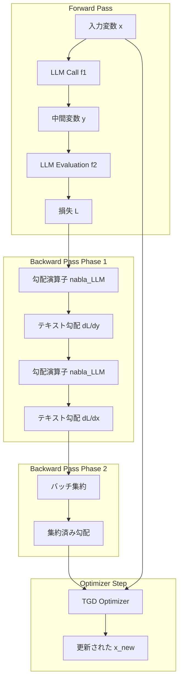

## 論文概要（Abstract）

TextGradは、ニューラルネットワークにおける自動微分（Automatic Differentiation）の概念をテキスト空間に拡張したフレームワークである。LLMが生成する自然言語フィードバックを「テキスト勾配（textual gradient）」として扱い、計算グラフ上を逆伝播させることで、プロンプト・コード・分子構造など多様な非微分可能変数を最適化する。著者らは、GPT-4oのGPQAゼロショット精度を51%から55%に向上させ、LeetCode-Hard問題の解決率で20%の相対的性能向上を達成したと報告している。フレームワークはPyTorchライクなAPIで設計され、ドメイン非依存の汎用最適化基盤として機能する。

この記事は [Zenn記事: DSPy v3.1 GEPA×Evaluateで構築するプロンプト最適化自動化パイプライン](https://zenn.dev/0h_n0/articles/f9fe90f40b04ef) の深掘りです。

## 情報源

| 項目 | 内容 |
|------|------|
| arXiv ID | 2407.10930 |
| URL | [https://arxiv.org/abs/2407.10930](https://arxiv.org/abs/2407.10930) |
| 著者 | Mert Yuksekgonul, Federico Bianchi, Joseph Boen et al. (Stanford University) |
| 発表年 | 2024年 |
| 分野 | cs.CL, cs.AI, cs.LG |
| 掲載 | Nature (2025年3月) |

## 背景と動機

現代のAIシステムは単一モデルではなく、複数のLLM呼び出し・外部ツール・評価器を組み合わせた**複合AIシステム（Compound AI System）**として構築される。こうしたシステムの各コンポーネントを最適化するには、従来の数値的勾配降下法が適用できない。プロンプトやコードといった離散的テキスト変数は微分不可能であり、損失関数も自然言語で記述されることが多いためである。

TextGradの著者らは、ニューラルネットワーク訓練における逆伝播（backpropagation）のアナロジーに着目した。数値勾配の代わりにLLMが生成する自然言語のフィードバック（批判・改善提案）を「テキスト勾配」として扱い、計算グラフ上を逆方向に伝播させるという着想である。PyTorchが数値テンソルの自動微分を提供するように、TextGradはテキスト変数の自動微分を提供する。この枠組みにより、プロンプト最適化・コード改善・分子設計・放射線治療計画など、従来は個別に手法を設計していた問題群を統一的に扱える。

## 主要な貢献

著者らは以下の貢献を報告している。

- **テキスト空間での自動微分フレームワークの定式化**: 計算グラフ・テキスト勾配・勾配演算子・TGDオプティマイザからなる統一的な最適化基盤を提案
- **ドメイン非依存の汎用設計**: 同一のフレームワーク（勾配演算子・オプティマイザ）を変更せずに、コード最適化・質問応答・分子設計・放射線治療計画の4領域で有効性を実証
- **インスタンス最適化とプロンプト最適化の統合**: テスト時に個別の解を洗練する「インスタンス最適化」と、ミニバッチSGDで汎化的な指示を学習する「プロンプト最適化」の両方をサポート
- **PyTorchライクなAPIによる実装**: `Variable`、`BlackboxLLM`、`TextLoss`、`TGD`など、深層学習実践者に馴染みのあるインターフェースを提供
- **Nature掲載による学術的検証**: 2025年3月にNatureに掲載され、フレームワークの科学的妥当性が確認された

## 技術的詳細

### 計算グラフとテキスト変数

TextGradでは、複合AIシステムを有向非巡回グラフ（DAG）として表現する。グラフの各ノードはテキスト変数 $$v$$ であり、エッジは関数 $$f_v$$ による変換を表す。

$$
v = f_v(\text{PredecessorsOf}(v)) \quad \forall v \in V
$$

ここで $$V$$ は計算グラフ中の全変数の集合、$$f_v$$ はLLM呼び出し・数値シミュレータ・外部API呼び出しなどの任意の関数である。変数 $$v$$ はプロンプト文字列、コードスニペット、分子のSMILES表現、治療パラメータなど、多様な非構造化データを取りうる。

### フォワードパスとバックワードパス

フォワードパスでは、入力変数から出発してDAGを順方向にたどり、各ノードで関数 $$f_v$$ を適用して出力を計算する。最終的に損失変数 $$L$$ が得られる。

バックワードパスでは、損失 $$L$$ から逆方向にたどり、各変数に対するテキスト勾配を計算する。単純な連鎖 $$x \xrightarrow{\text{LLM}} y \xrightarrow{\text{LLM}} L$$ の場合、以下のように伝播する。

$$
\frac{\partial L}{\partial y} = \nabla_{\text{LLM}}(y, L)
$$

$$
\frac{\partial L}{\partial x} = \nabla_{\text{LLM}}\left(x, y, \frac{\partial L}{\partial y}\right)
$$

ここで $$\nabla_{\text{LLM}}$$ はLLMベースの勾配演算子であり、変数とその評価結果（あるいは上流勾配）を入力として、改善のための自然言語フィードバックを出力する。

### 2ステップバックワード: インスタンスレベルフィードバックとバッチ集約

TextGradのバックワードパスは2つのフェーズで構成される。

**フェーズ1: インスタンスレベル勾配計算**

個々のデータポイントに対して、勾配演算子が具体的なフィードバックを生成する。勾配演算子への入力プロンプトは以下の構造を持つ。

> "Here is a conversation: {x&#124;y}. Below are criticisms on {y}: {dL/dy}. Explain how to improve {x}."

このプロンプトにより、上流の勾配（出力への批判）を入力変数への改善提案に変換する。これは数値的自動微分における連鎖律（chain rule）のテキスト版と解釈できる。

**フェーズ2: マルチパス集約**

変数 $$v$$ が複数の後続ノードに接続されている場合、各後続ノードからの勾配を集合として収集し、集約する。

$$
\frac{\partial L}{\partial v} = \bigcup_{w \in \text{Successors}(v)} \nabla_f\left(v, w, \frac{\partial L}{\partial w}\right)
$$

集約されたテキスト勾配は、自然言語による批判のセットとして表現される。

### TextGradの計算フロー

以下のMermaidダイアグラムは、TextGradの全体的な計算フローを示す。



### TGD（Textual Gradient Descent）オプティマイザ

数値的勾配降下法が $$x \leftarrow x - \eta \nabla L$$ で変数を更新するのに対し、TGDはLLMを用いてテキスト変数を更新する。

$$
x_{\text{new}} = \text{TGD.step}\left(x, \frac{\partial L}{\partial x}\right) \triangleq \text{LLM}\left(\text{"Below are criticisms on } x \text{: } \frac{\partial L}{\partial x} \text{. Incorporate criticisms and produce a new variable."}\right)
$$

TGDオプティマイザは現在の変数値とテキスト勾配（批判・改善提案）を受け取り、LLMを用いて改善された新しい変数値を生成する。数値勾配降下における学習率 $$\eta$$ に相当するパラメータは、LLMの生成能力に暗黙的に組み込まれている。

### 数値的自動微分との対応関係

TextGradと従来の自動微分の対応関係を整理する。

| 数値的自動微分 | TextGrad |
|----------------|----------|
| テンソル変数 | テキスト変数（プロンプト、コード、SMILES等） |
| 微分可能な関数 | LLM呼び出し、シミュレータ |
| 数値的勾配 $$\nabla L$$ | テキスト勾配（自然言語フィードバック） |
| 連鎖律 | LLMによる上流勾配の変換 |
| SGDオプティマイザ | TGDオプティマイザ |
| 損失関数 $$L(y, \hat{y})$$ | 自然言語で記述された評価基準 |
| ミニバッチ学習 | ミニバッチテキスト勾配集約 |

### 擬似コード

以下はTextGradのコアループの擬似コードである。

```python
def textgrad_optimization_loop(
    variable: str,
    loss_fn: callable,
    gradient_engine: str = "gpt-4o",
    n_iterations: int = 5,
) -> str:
    """TextGradによる変数最適化のコアループ。

    Args:
        variable: 最適化対象のテキスト変数（プロンプト、コード等）
        loss_fn: 自然言語で記述された評価関数
        gradient_engine: 勾配計算に使用するLLMモデル名
        n_iterations: 最適化反復回数

    Returns:
        最適化後のテキスト変数
    """
    for i in range(n_iterations):
        # Phase 1: フォワードパス
        output: str = llm_call(variable)
        loss: str = loss_fn(output)

        # Phase 2: バックワードパス（インスタンスレベル）
        grad_output: str = gradient_operator(
            variable=output,
            loss=loss,
            engine=gradient_engine,
        )
        grad_variable: str = gradient_operator(
            variable=variable,
            output=output,
            upstream_gradient=grad_output,
            engine=gradient_engine,
        )

        # Phase 3: TGDによる更新
        variable = tgd_step(
            current_value=variable,
            textual_gradient=grad_variable,
            engine=gradient_engine,
        )

    return variable
```

## 実装のポイント

### TextGradのインストールと基本的な使い方

```python
# インストール
# pip install textgrad

import textgrad as tg
from textgrad.engine import get_engine


def optimize_answer(
    question: str,
    initial_answer: str,
    evaluation_instruction: str,
    model_name: str = "gpt-4o",
    n_iterations: int = 3,
) -> str:
    """TextGradで回答を反復的に改善する。

    Args:
        question: 入力質問
        initial_answer: 初期回答
        evaluation_instruction: 評価基準の自然言語記述
        model_name: 使用するLLMモデル名
        n_iterations: 最適化反復回数

    Returns:
        最適化された回答文字列
    """
    # バックワードエンジンの設定
    tg.set_backward_engine(model_name, override=True)

    # テキスト変数の定義（requires_grad=Trueで勾配計算を有効化）
    answer: tg.Variable = tg.Variable(
        initial_answer,
        role_description="answer to the question",
        requires_grad=True,
    )

    # 損失関数の定義（自然言語で評価基準を記述）
    loss_fn: tg.TextLoss = tg.TextLoss(evaluation_instruction)

    # TGDオプティマイザの初期化
    optimizer: tg.TGD = tg.TGD(parameters=[answer])

    for step in range(n_iterations):
        # フォワードパス: 損失計算
        loss: tg.Variable = loss_fn(answer)

        # バックワードパス: テキスト勾配の計算
        loss.backward()

        # オプティマイザステップ: 変数の更新
        optimizer.step()

        # 勾配のリセット（PyTorchと同様）
        optimizer.zero_grad()

    return answer.value
```

### プロンプト最適化（ミニバッチSGD）

プロンプト最適化では、複数の訓練サンプルからミニバッチを構成し、集約されたテキスト勾配でプロンプトを更新する。

```python
import textgrad as tg
from typing import list


def optimize_system_prompt(
    train_examples: list[dict[str, str]],
    initial_prompt: str,
    eval_instruction: str,
    batch_size: int = 3,
    n_iterations: int = 12,
    model_name: str = "gpt-4o",
) -> str:
    """ミニバッチSGDでシステムプロンプトを最適化する。

    Args:
        train_examples: 訓練データのリスト（{"input": ..., "expected": ...}）
        initial_prompt: 初期システムプロンプト
        eval_instruction: 評価基準
        batch_size: ミニバッチサイズ
        n_iterations: 反復回数
        model_name: 使用するLLMモデル名

    Returns:
        最適化されたシステムプロンプト
    """
    tg.set_backward_engine(model_name, override=True)

    system_prompt: tg.Variable = tg.Variable(
        initial_prompt,
        role_description="system prompt for the LLM",
        requires_grad=True,
    )
    model: tg.BlackboxLLM = tg.BlackboxLLM(model_name)
    optimizer: tg.TGD = tg.TGD(parameters=[system_prompt])

    for iteration in range(n_iterations):
        # ミニバッチの構成
        batch: list[dict[str, str]] = train_examples[
            (iteration * batch_size) % len(train_examples):
            (iteration * batch_size) % len(train_examples) + batch_size
        ]
        total_loss: tg.Variable | None = None

        for example in batch:
            input_var: tg.Variable = tg.Variable(
                example["input"],
                role_description="user input",
                requires_grad=False,
            )
            # フォワードパス
            prediction: tg.Variable = model(
                system_prompt, input_var
            )
            # 個別損失の計算
            loss: tg.Variable = tg.TextLoss(eval_instruction)(prediction)
            total_loss = loss if total_loss is None else tg.sum(
                [total_loss, loss]
            )

        # バッチ集約されたテキスト勾配の逆伝播
        total_loss.backward()
        optimizer.step()
        optimizer.zero_grad()

    return system_prompt.value
```

### 実装上の注意点

1. **バックワードエンジンの選択**: 勾配計算には高性能なモデル（GPT-4o等）を使用し、フォワードパスには低コストなモデル（GPT-3.5-turbo等）を使用することでコスト効率を高められる
2. **反復回数の調整**: 著者らの実験ではインスタンス最適化で3-5回、プロンプト最適化で12回程度の反復が報告されている
3. **評価基準の設計**: `TextLoss`に渡す評価基準の記述が最適化の品質に直結するため、具体的で測定可能な基準を設定する

## 実験結果

著者らは以下のベンチマークで評価を実施した。

### コード最適化（LeetCode Hard）

GPT-4oによるゼロショットコード生成の成功率を、TextGradによる反復改善で向上させた。

| 手法 | LeetCode Hard 正解率 |
|------|---------------------|
| GPT-4o ゼロショット | 7% |
| GPT-4o + Reflexion（1ショット） | 15% |
| **TextGrad（0ショット、5反復）** | **36%** |

著者らは、TextGradがReflexion（1ショット）に対して20%以上の相対的性能向上を達成したと報告している。

### 質問応答（テスト時最適化）

GPQA（Graduate-Level Google-Proof QA）ベンチマークにおいて、回答を反復的に洗練した。

| 手法 | GPQA精度 |
|------|---------|
| Chain-of-Thought（ベースライン） | 51.0% |
| 先行手法最良 | 53.6% |
| **TextGrad（3反復 + 多数決）** | **55.0%** |

また、MMLU（Massive Multitask Language Understanding）の個別カテゴリでも改善が報告されている。

| カテゴリ | ベースライン | TextGrad |
|----------|-------------|----------|
| Machine Learning | 85.7% | **88.4%** |
| College Physics | 91.2% | **95.1%** |

### プロンプト最適化（推論タスク）

GPT-4oのフィードバックを用いてGPT-3.5-turbo向けプロンプトを最適化した結果を以下に示す。ミニバッチサイズ3、12反復で実施された。

| データセット | CoT 0ショット | DSPy（8デモ） | TextGrad（0デモ） |
|-------------|--------------|--------------|------------------|
| Object Counting | 77.8% | 84.9% | **91.9%** |
| Word Sorting | 76.7% | **79.8%** | **79.8%** |
| GSM8k | 72.9% | **81.1%** | **81.1%** |

著者らは、TextGradがデモ例なし（0デモ）でDSPyの8デモと同等以上の性能を達成した点を強調している。

### 分子設計

58のタンパク質標的に対し、結合親和性（Vina score）と薬剤様性（QED score）の多目的最適化をSMILES文字列に対して実施した。著者らは、TextGradが29の臨床承認薬と同等の親和性・薬剤様性を持つ構造的に新規な分子を生成したと報告している。

### 放射線治療計画

5名の前立腺がん患者の治療計画を最適化した結果、PTV（計画標的体積）への線量は処方線量と一致し、膀胱・直腸の平均線量は臨床計画よりも低い（臓器保護が改善された）と報告されている。

## 実運用への応用

### DSPyとの関係

関連するZenn記事で紹介されている[DSPy v3.1のGEPAオプティマイザ](https://zenn.dev/0h_n0/articles/f9fe90f40b04ef)は、プロンプトの自動最適化という点でTextGradと共通の目標を持つ。両者の違いは以下の通りである。

| 観点 | TextGrad | DSPy GEPA |
|------|----------|-----------|
| 最適化対象 | テキスト変数全般（プロンプト、コード、分子等） | LLMプログラムのプロンプト・デモ例 |
| 手法 | テキスト勾配による逆伝播 | グループ内相対パフォーマンスによる探索 |
| ドメイン | 汎用（コード、科学、医療等） | LLMパイプライン特化 |
| デモ例の必要性 | 不要（0デモで動作） | デモ例の自動選択を含む |
| 統合先 | textgradライブラリ | DSPyフレームワーク |

実運用では、DSPyのパイプライン構築力とTextGradのテスト時最適化を組み合わせる構成が考えられる。具体的には、DSPy GEPAでパイプライン全体のプロンプトを最適化し、推論時にTextGradで個別の出力を洗練するハイブリッド戦略が有効である。

### 適用が有効なユースケース

1. **コードレビュー自動化**: 生成されたコードをTextGradで反復改善し、テスト通過率を向上
2. **RAGパイプラインの回答品質改善**: 検索結果と回答の整合性をテキスト勾配で最適化
3. **プロンプトエンジニアリングの自動化**: 手動調整の代わりにミニバッチSGDでシステムプロンプトを最適化

## Production Deployment Guide

### AWS実装パターン

TextGradベースの最適化システムをAWS上にデプロイする3つの構成パターンを示す。

#### Small構成（サーバーレス）: 月額 約$150-300

少量のバッチ処理やオンデマンド最適化に適する。

- **API Gateway** + **Lambda**: TextGrad最適化リクエストの受付と実行
- **SQS**: 非同期ジョブキュー（最適化は数分かかるため）
- **DynamoDB**: 最適化履歴と変数バージョン管理
- **S3**: 最適化されたプロンプト・コードのアーティファクト保存
- **CloudWatch**: ログ・メトリクス・アラーム

#### Medium構成（コンテナ）: 月額 約$500-1,200

継続的な最適化パイプラインやチーム利用に適する。

- **ECS Fargate**: TextGradワーカーコンテナ（スポットインスタンス活用）
- **ElastiCache (Redis)**: 勾配キャッシュ（同一入力への再計算回避）
- **RDS PostgreSQL**: 最適化実験管理・メトリクス記録
- **Step Functions**: 多段階最適化ワークフロー管理
- **ECR**: コンテナイメージ管理

#### Large構成（EKS）: 月額 約$2,000-5,000

大規模プロンプト最適化やマルチテナントサービスに適する。

- **EKS**: Kubernetesクラスタでワーカーをオートスケール
- **Karpenter**: ノードプロビジョニング最適化
- **Amazon Bedrock**: Claude/Titan等のマネージドLLMエンドポイント
- **OpenSearch**: 最適化履歴の検索・分析
- **Grafana + Prometheus**: 詳細なオブザーバビリティ

### Terraformインフラコード（Small構成）

```hcl
# =============================================================================
# TextGrad Optimization Service - Serverless Configuration
# =============================================================================

terraform {
  required_version = ">= 1.5.0"

  required_providers {
    aws = {
      source  = "hashicorp/aws"
      version = "~> 5.0"
    }
  }

  backend "s3" {
    bucket = "textgrad-terraform-state"
    key    = "small/terraform.tfstate"
    region = "ap-northeast-1"
  }
}

provider "aws" {
  region = "ap-northeast-1"

  default_tags {
    tags = {
      Project     = "textgrad-optimizer"
      Environment = var.environment
      ManagedBy   = "terraform"
    }
  }
}

# -----------------------------------------------------------------------------
# Variables
# -----------------------------------------------------------------------------

variable "environment" {
  description = "Deployment environment"
  type        = string
  default     = "production"
}

variable "openai_api_key_ssm_path" {
  description = "SSM Parameter Store path for OpenAI API key"
  type        = string
  default     = "/textgrad/openai-api-key"
}

# -----------------------------------------------------------------------------
# DynamoDB: 最適化履歴テーブル
# -----------------------------------------------------------------------------

resource "aws_dynamodb_table" "optimization_history" {
  name         = "textgrad-optimization-history"
  billing_mode = "PAY_PER_REQUEST"
  hash_key     = "optimization_id"
  range_key    = "iteration"

  attribute {
    name = "optimization_id"
    type = "S"
  }

  attribute {
    name = "iteration"
    type = "N"
  }

  attribute {
    name = "created_at"
    type = "S"
  }

  global_secondary_index {
    name            = "created-at-index"
    hash_key        = "created_at"
    projection_type = "ALL"
  }

  point_in_time_recovery {
    enabled = true
  }

  ttl {
    attribute_name = "expires_at"
    enabled        = true
  }
}

# -----------------------------------------------------------------------------
# S3: アーティファクト保存
# -----------------------------------------------------------------------------

resource "aws_s3_bucket" "artifacts" {
  bucket = "textgrad-artifacts-${var.environment}"
}

resource "aws_s3_bucket_versioning" "artifacts" {
  bucket = aws_s3_bucket.artifacts.id

  versioning_configuration {
    status = "Enabled"
  }
}

resource "aws_s3_bucket_lifecycle_configuration" "artifacts" {
  bucket = aws_s3_bucket.artifacts.id

  rule {
    id     = "archive-old-artifacts"
    status = "Enabled"

    transition {
      days          = 30
      storage_class = "STANDARD_IA"
    }

    transition {
      days          = 90
      storage_class = "GLACIER"
    }

    expiration {
      days = 365
    }
  }
}

resource "aws_s3_bucket_server_side_encryption_configuration" "artifacts" {
  bucket = aws_s3_bucket.artifacts.id

  rule {
    apply_server_side_encryption_by_default {
      sse_algorithm = "aws:kms"
    }
  }
}

# -----------------------------------------------------------------------------
# SQS: 非同期ジョブキュー
# -----------------------------------------------------------------------------

resource "aws_sqs_queue" "optimization_jobs" {
  name                       = "textgrad-optimization-jobs"
  visibility_timeout_seconds = 900
  message_retention_seconds  = 86400
  receive_wait_time_seconds  = 20

  redrive_policy = jsonencode({
    deadLetterTargetArn = aws_sqs_queue.optimization_dlq.arn
    maxReceiveCount     = 3
  })
}

resource "aws_sqs_queue" "optimization_dlq" {
  name                      = "textgrad-optimization-dlq"
  message_retention_seconds = 1209600
}

# -----------------------------------------------------------------------------
# Lambda: TextGrad最適化ワーカー
# -----------------------------------------------------------------------------

resource "aws_lambda_function" "textgrad_worker" {
  function_name = "textgrad-optimization-worker"
  role          = aws_iam_role.lambda_execution.arn
  handler       = "handler.lambda_handler"
  runtime       = "python3.12"
  timeout       = 900
  memory_size   = 1024

  filename         = "lambda_package.zip"
  source_code_hash = filebase64sha256("lambda_package.zip")

  environment {
    variables = {
      DYNAMODB_TABLE    = aws_dynamodb_table.optimization_history.name
      S3_BUCKET         = aws_s3_bucket.artifacts.id
      SSM_API_KEY_PATH  = var.openai_api_key_ssm_path
      POWERTOOLS_SERVICE_NAME = "textgrad-worker"
      LOG_LEVEL         = "INFO"
    }
  }

  tracing_config {
    mode = "Active"
  }
}

resource "aws_lambda_event_source_mapping" "sqs_trigger" {
  event_source_arn = aws_sqs_queue.optimization_jobs.arn
  function_name    = aws_lambda_function.textgrad_worker.arn
  batch_size       = 1
}

# -----------------------------------------------------------------------------
# API Gateway: REST API
# -----------------------------------------------------------------------------

resource "aws_apigatewayv2_api" "textgrad_api" {
  name          = "textgrad-api"
  protocol_type = "HTTP"

  cors_configuration {
    allow_origins = ["*"]
    allow_methods = ["POST", "GET"]
    allow_headers = ["Content-Type", "Authorization"]
    max_age       = 3600
  }
}

resource "aws_apigatewayv2_stage" "default" {
  api_id      = aws_apigatewayv2_api.textgrad_api.id
  name        = "$default"
  auto_deploy = true

  access_log_settings {
    destination_arn = aws_cloudwatch_log_group.api_gateway.arn
    format = jsonencode({
      requestId      = "$context.requestId"
      ip             = "$context.identity.sourceIp"
      requestTime    = "$context.requestTime"
      httpMethod     = "$context.httpMethod"
      routeKey       = "$context.routeKey"
      status         = "$context.status"
      protocol       = "$context.protocol"
      responseLength = "$context.responseLength"
      integrationLatency = "$context.integrationLatency"
    })
  }
}

# -----------------------------------------------------------------------------
# IAM: Lambda実行ロール
# -----------------------------------------------------------------------------

resource "aws_iam_role" "lambda_execution" {
  name = "textgrad-lambda-execution"

  assume_role_policy = jsonencode({
    Version = "2012-10-17"
    Statement = [
      {
        Action = "sts:AssumeRole"
        Effect = "Allow"
        Principal = {
          Service = "lambda.amazonaws.com"
        }
      }
    ]
  })
}

resource "aws_iam_role_policy" "lambda_permissions" {
  name = "textgrad-lambda-permissions"
  role = aws_iam_role.lambda_execution.id

  policy = jsonencode({
    Version = "2012-10-17"
    Statement = [
      {
        Effect = "Allow"
        Action = [
          "dynamodb:PutItem",
          "dynamodb:GetItem",
          "dynamodb:Query",
          "dynamodb:UpdateItem",
        ]
        Resource = [
          aws_dynamodb_table.optimization_history.arn,
          "${aws_dynamodb_table.optimization_history.arn}/index/*",
        ]
      },
      {
        Effect = "Allow"
        Action = [
          "s3:PutObject",
          "s3:GetObject",
        ]
        Resource = "${aws_s3_bucket.artifacts.arn}/*"
      },
      {
        Effect = "Allow"
        Action = [
          "sqs:ReceiveMessage",
          "sqs:DeleteMessage",
          "sqs:GetQueueAttributes",
        ]
        Resource = aws_sqs_queue.optimization_jobs.arn
      },
      {
        Effect = "Allow"
        Action = [
          "ssm:GetParameter",
        ]
        Resource = "arn:aws:ssm:*:*:parameter${var.openai_api_key_ssm_path}"
      },
      {
        Effect = "Allow"
        Action = [
          "logs:CreateLogGroup",
          "logs:CreateLogStream",
          "logs:PutLogEvents",
        ]
        Resource = "arn:aws:logs:*:*:*"
      },
      {
        Effect = "Allow"
        Action = [
          "xray:PutTraceSegments",
          "xray:PutTelemetryRecords",
        ]
        Resource = "*"
      },
    ]
  })
}

# -----------------------------------------------------------------------------
# CloudWatch: ログ・アラーム
# -----------------------------------------------------------------------------

resource "aws_cloudwatch_log_group" "lambda_worker" {
  name              = "/aws/lambda/${aws_lambda_function.textgrad_worker.function_name}"
  retention_in_days = 30
}

resource "aws_cloudwatch_log_group" "api_gateway" {
  name              = "/aws/apigateway/textgrad-api"
  retention_in_days = 14
}

resource "aws_cloudwatch_metric_alarm" "dlq_messages" {
  alarm_name          = "textgrad-dlq-messages"
  comparison_operator = "GreaterThanThreshold"
  evaluation_periods  = 1
  metric_name         = "ApproximateNumberOfMessagesVisible"
  namespace           = "AWS/SQS"
  period              = 300
  statistic           = "Sum"
  threshold           = 0
  alarm_description   = "Alert when messages appear in the dead letter queue"

  dimensions = {
    QueueName = aws_sqs_queue.optimization_dlq.name
  }

  alarm_actions = []
}

resource "aws_cloudwatch_metric_alarm" "lambda_errors" {
  alarm_name          = "textgrad-lambda-errors"
  comparison_operator = "GreaterThanThreshold"
  evaluation_periods  = 2
  metric_name         = "Errors"
  namespace           = "AWS/Lambda"
  period              = 300
  statistic           = "Sum"
  threshold           = 5
  alarm_description   = "Alert on elevated Lambda error rate"

  dimensions = {
    FunctionName = aws_lambda_function.textgrad_worker.function_name
  }

  alarm_actions = []
}

# -----------------------------------------------------------------------------
# Outputs
# -----------------------------------------------------------------------------

output "api_endpoint" {
  value       = aws_apigatewayv2_api.textgrad_api.api_endpoint
  description = "TextGrad API endpoint URL"
}

output "dynamodb_table" {
  value       = aws_dynamodb_table.optimization_history.name
  description = "DynamoDB table name for optimization history"
}

output "s3_bucket" {
  value       = aws_s3_bucket.artifacts.id
  description = "S3 bucket for optimization artifacts"
}
```

### 運用・監視設定

#### CloudWatch ダッシュボードとカスタムメトリクス

```python
import boto3
from datetime import datetime
from typing import Any


def create_textgrad_dashboard(
    region: str = "ap-northeast-1",
) -> dict[str, Any]:
    """TextGrad運用監視用のCloudWatchダッシュボードを作成する。

    Args:
        region: AWSリージョン

    Returns:
        ダッシュボード作成レスポンス
    """
    client: boto3.client = boto3.client("cloudwatch", region_name=region)

    dashboard_body: dict[str, Any] = {
        "widgets": [
            {
                "type": "metric",
                "x": 0, "y": 0, "width": 12, "height": 6,
                "properties": {
                    "title": "Optimization Requests",
                    "metrics": [
                        ["TextGrad", "OptimizationRequests", "Status", "Success"],
                        ["TextGrad", "OptimizationRequests", "Status", "Failed"],
                    ],
                    "period": 300,
                    "stat": "Sum",
                    "region": region,
                },
            },
            {
                "type": "metric",
                "x": 12, "y": 0, "width": 12, "height": 6,
                "properties": {
                    "title": "Optimization Duration (ms)",
                    "metrics": [
                        ["TextGrad", "OptimizationDuration", "Type", "Instance"],
                        ["TextGrad", "OptimizationDuration", "Type", "Prompt"],
                    ],
                    "period": 300,
                    "stat": "Average",
                    "region": region,
                },
            },
            {
                "type": "metric",
                "x": 0, "y": 6, "width": 12, "height": 6,
                "properties": {
                    "title": "LLM API Costs (USD)",
                    "metrics": [
                        ["TextGrad", "LLMAPICost", "Engine", "Forward"],
                        ["TextGrad", "LLMAPICost", "Engine", "Backward"],
                        ["TextGrad", "LLMAPICost", "Engine", "Optimizer"],
                    ],
                    "period": 3600,
                    "stat": "Sum",
                    "region": region,
                },
            },
            {
                "type": "metric",
                "x": 12, "y": 6, "width": 12, "height": 6,
                "properties": {
                    "title": "DLQ Messages",
                    "metrics": [
                        [
                            "AWS/SQS",
                            "ApproximateNumberOfMessagesVisible",
                            "QueueName",
                            "textgrad-optimization-dlq",
                        ],
                    ],
                    "period": 300,
                    "stat": "Maximum",
                    "region": region,
                },
            },
        ],
    }

    import json
    response: dict[str, Any] = client.put_dashboard(
        DashboardName="TextGrad-Operations",
        DashboardBody=json.dumps(dashboard_body),
    )
    return response


def put_optimization_metrics(
    optimization_id: str,
    duration_ms: float,
    iteration_count: int,
    llm_cost_usd: float,
    success: bool,
    optimization_type: str = "Instance",
    region: str = "ap-northeast-1",
) -> None:
    """TextGrad最適化のカスタムメトリクスを送信する。

    Args:
        optimization_id: 最適化ジョブID
        duration_ms: 最適化にかかった時間（ミリ秒）
        iteration_count: 反復回数
        llm_cost_usd: LLM API費用（USD）
        success: 成功したかどうか
        optimization_type: 最適化タイプ（Instance/Prompt）
        region: AWSリージョン
    """
    client: boto3.client = boto3.client("cloudwatch", region_name=region)

    client.put_metric_data(
        Namespace="TextGrad",
        MetricData=[
            {
                "MetricName": "OptimizationRequests",
                "Dimensions": [
                    {"Name": "Status", "Value": "Success" if success else "Failed"},
                ],
                "Timestamp": datetime.utcnow(),
                "Value": 1,
                "Unit": "Count",
            },
            {
                "MetricName": "OptimizationDuration",
                "Dimensions": [
                    {"Name": "Type", "Value": optimization_type},
                ],
                "Timestamp": datetime.utcnow(),
                "Value": duration_ms,
                "Unit": "Milliseconds",
            },
            {
                "MetricName": "LLMAPICost",
                "Dimensions": [
                    {"Name": "Engine", "Value": "Total"},
                ],
                "Timestamp": datetime.utcnow(),
                "Value": llm_cost_usd,
                "Unit": "None",
            },
            {
                "MetricName": "IterationCount",
                "Dimensions": [
                    {"Name": "Type", "Value": optimization_type},
                ],
                "Timestamp": datetime.utcnow(),
                "Value": iteration_count,
                "Unit": "Count",
            },
        ],
    )
```

#### X-Ray トレーシング設定

```python
from aws_xray_sdk.core import xray_recorder, patch_all
from aws_xray_sdk.core.models.subsegment import Subsegment


# X-Rayの初期化（Lambda起動時に1回実行）
xray_recorder.configure(service="textgrad-worker")
patch_all()


def traced_optimization_step(
    variable_value: str,
    loss_text: str,
    iteration: int,
) -> str:
    """X-Rayトレース付きの最適化ステップ。

    Args:
        variable_value: 現在の変数値
        loss_text: 損失テキスト
        iteration: 現在の反復番号

    Returns:
        更新された変数値
    """
    subsegment: Subsegment = xray_recorder.begin_subsegment(
        f"optimization_iteration_{iteration}"
    )
    subsegment.put_annotation("iteration", iteration)
    subsegment.put_metadata("variable_length", len(variable_value))

    try:
        # フォワードパス
        with xray_recorder.in_subsegment("forward_pass"):
            output: str = llm_forward(variable_value)

        # バックワードパス
        with xray_recorder.in_subsegment("backward_pass"):
            gradient: str = compute_textual_gradient(output, loss_text)

        # TGDステップ
        with xray_recorder.in_subsegment("tgd_step"):
            new_value: str = tgd_update(variable_value, gradient)

        subsegment.put_annotation("status", "success")
        return new_value

    except Exception as e:
        subsegment.put_annotation("status", "error")
        subsegment.add_exception(e, stack=True)
        raise
    finally:
        xray_recorder.end_subsegment()
```

#### Cost Explorer によるLLMコスト分析

```python
import boto3
from datetime import datetime, timedelta
from typing import Any


def analyze_textgrad_costs(
    days: int = 30,
    region: str = "ap-northeast-1",
) -> dict[str, Any]:
    """TextGrad関連のAWSコストを分析する。

    Args:
        days: 分析対象の過去日数
        region: AWSリージョン

    Returns:
        コスト分析結果
    """
    client: boto3.client = boto3.client("ce", region_name="us-east-1")

    end_date: str = datetime.utcnow().strftime("%Y-%m-%d")
    start_date: str = (
        datetime.utcnow() - timedelta(days=days)
    ).strftime("%Y-%m-%d")

    response: dict[str, Any] = client.get_cost_and_usage(
        TimePeriod={"Start": start_date, "End": end_date},
        Granularity="DAILY",
        Metrics=["UnblendedCost"],
        Filter={
            "Tags": {
                "Key": "Project",
                "Values": ["textgrad-optimizer"],
            }
        },
        GroupBy=[
            {"Type": "DIMENSION", "Key": "SERVICE"},
        ],
    )

    total_cost: float = sum(
        float(day["Total"]["UnblendedCost"]["Amount"])
        for day in response["ResultsByTime"]
    )

    return {
        "period": f"{start_date} to {end_date}",
        "total_cost_usd": round(total_cost, 2),
        "daily_breakdown": response["ResultsByTime"],
    }
```

### コスト最適化チェックリスト

TextGradシステムのコスト最適化のために、以下の項目を確認する。

#### LLM API費用の削減

- [ ] フォワードパスに低コストモデル（GPT-3.5-turbo等）を使用しているか
- [ ] バックワードエンジンのモデル選択が適切か（GPT-4oが必要な場面のみ使用）
- [ ] 不要な反復を避けるため、早期停止条件を設定しているか
- [ ] プロンプトキャッシュを有効化し、同一プロンプトの再計算を回避しているか
- [ ] ミニバッチサイズを適切に設定しているか（大きすぎるとAPIコスト増）
- [ ] トークン数の上限を設定し、冗長な勾配テキストを制限しているか
- [ ] OpenAI Batch APIの活用でプロンプト最適化のコストを50%削減できるか検討したか

#### AWSインフラ費用の削減

- [ ] Lambda関数のメモリサイズが適切か（過剰割り当てはコスト増）
- [ ] Lambda関数のタイムアウト設定が適切か（最適化完了後は速やかに終了）
- [ ] DynamoDBのPAY_PER_REQUESTが適切か（定常トラフィックならPROVISIONEDも検討）
- [ ] S3のライフサイクルポリシーで古いアーティファクトをGlacierに移行しているか
- [ ] CloudWatch Logsの保持期間が適切か（不要に長いとコスト増）
- [ ] SQSのメッセージ保持期間が適切か
- [ ] 未使用のリソース（テスト用Lambda、古いS3バケット等）を削除しているか

#### 運用効率の改善

- [ ] 最適化結果のキャッシュを実装し、同一入力への再実行を防止しているか
- [ ] 最適化履歴のTTLを設定し、DynamoDBのストレージコストを管理しているか
- [ ] CloudWatchアラームで異常なAPIコスト増を検知できるか
- [ ] 月次のコストレポートを自動生成しているか
- [ ] タグベースのコスト配分で、プロジェクト別のコストを追跡しているか
- [ ] Savings Plansの適用を検討したか（定常的なLambda利用がある場合）
- [ ] Reserved Capacityの適用を検討したか（DynamoDBの定常利用がある場合）

## 関連研究

TextGradは以下の先行研究と関連する。

- **ProTeGi (Pryzant et al., 2023)**: プロンプトに対するテキスト勾配を初めて提案した研究。TextGradはこれを一般化し、プロンプト以外の変数（コード・分子等）にも適用可能にした
- **APE - Automatic Prompt Engineer (Zhou et al., 2023)**: LLMを用いたプロンプトの自動生成・選択手法。TextGradとは異なり、勾配ベースの反復改善ではなく探索ベースのアプローチを採る
- **OPRO (Yang et al., 2024)**: LLMをオプティマイザとして使用し、過去の試行履歴から改善されたプロンプトを生成する手法。TextGradの逆伝播構造とは対照的に、直接的な最適化を行う
- **DSPy (Khattab et al., 2023; 2024)**: LLMパイプラインのプログラム合成と最適化フレームワーク。関連するZenn記事で紹介されているGEPAオプティマイザは、TextGradとは異なるアプローチでプロンプト最適化を実現する。DSPyのBetterTogetherオプティマイザ（Soylu et al., 2024）は、プロンプト最適化と重み微調整を交互に実行する手法を提案している

## まとめと今後の展望

TextGradは、自動微分の概念をテキスト空間に拡張し、LLMによるフィードバックを勾配として逆伝播させる汎用最適化フレームワークである。コード・質問応答・分子設計・放射線治療計画と幅広い領域で有効性が実証され、2025年にNatureに掲載された。今後は、テキスト勾配の分散低減手法、より効率的な集約戦略、DSPy等の既存フレームワークとの深い統合が期待される。テキスト空間での最適化理論の確立は、複合AIシステムの体系的な改善に向けた基盤となる可能性がある。

## 参考文献

1. Yuksekgonul, M., Bianchi, F., Boen, J., Liu, S., Huang, Z., Guestrin, C., & Zou, J. (2024). TextGrad: Automatic "Differentiation" via Text. arXiv:2406.07496. Nature (2025).
2. Pryzant, R., Iter, D., Li, J., Lee, Y. T., Zhu, C., & Zeng, M. (2023). Automatic Prompt Optimization with "Gradient Descent" and Beam Search (ProTeGi). EMNLP 2023.
3. Zhou, Y., Muresanu, A. I., Han, Z., Paster, K., Pitis, S., Chan, H., & Ba, J. (2023). Large Language Models Are Human-Level Prompt Engineers. ICLR 2023.
4. Yang, C., Wang, X., Lu, Y., Liu, H., Le, Q. V., Zhou, D., & Chen, X. (2024). Large Language Models as Optimizers (OPRO). ICLR 2024.
5. Khattab, O., Singhvi, A., Maheshwari, P., Zhang, Z., Santhanam, K., Vardhamanan, S., Haq, S., Sharma, A., Joshi, T. T., Mober, H., et al. (2023). DSPy: Compiling Declarative Language Model Calls into Self-Improving Pipelines. ICLR 2024.
6. Soylu, D., Potts, C., & Khattab, O. (2024). Fine-Tuning and Prompt Optimization: Two Great Steps that Work Better Together. EMNLP 2024.
