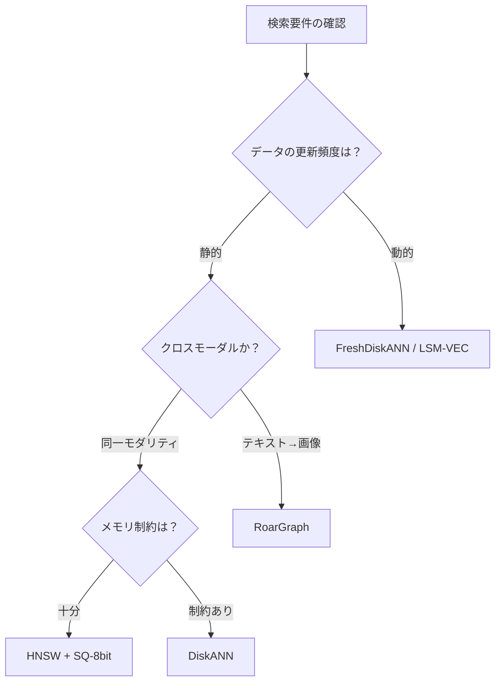

本記事は [Graph-based Vector Search: An Experimental Evaluation of the State of the Art](https://arxiv.org/abs/2501.04702) の解説記事です。

## 論文概要（Abstract）

ベクトル検索（ANN: Approximate Nearest Neighbor）アルゴリズムは多数提案されているが、公平な比較評価が不足していた。本論文は、グラフ型ANN索引（HNSW、NSG、SSG、SPTAG、DiskANN、FreshDiskANN、RoarGraph等）を8データセット上で統一条件にて評価し、量子化（SQ/PQ）、フィルタ付き検索、分散環境を含む包括的なベンチマークを提供する。

この記事は [Zenn記事: ユースケース別ベクトルDB選定2026](https://zenn.dev/0h_n0/articles/b4ee493b84bd7b) の深掘りです。

## 情報源

- **arXiv ID**: 2501.04702
- **URL**: [https://arxiv.org/abs/2501.04702](https://arxiv.org/abs/2501.04702)
- **著者**: Jianyang Gao, Yutong Ban, Chuan Xiao, et al.
- **発表年**: 2025
- **分野**: cs.DB, cs.DS, cs.IR

## 背景と動機（Background & Motivation）

ベクトルデータベースの選定において、「どのアルゴリズムが最速か」は頻繁に議論される。しかし既存のベンチマーク（ANN-Benchmarks等）は静的・単一モダリティ・フィルタなしの条件に限定されており、実用場面での意思決定に不十分だった。

本論文は以下の問いに答える：

1. 静的データセットで最も効率的なグラフ型索引はどれか
2. 量子化（SQ-8bit、PQ）を適用した場合の精度・性能トレードオフはどうか
3. フィルタ付き検索でのアルゴリズム性能はどう変わるか
4. テキスト→画像のクロスモーダル検索で従来手法はどこまで有効か
5. 分散環境でのスケーリング特性はどうか

## 主要な貢献（Key Contributions）

- **貢献1**: 10種のグラフ型ANNアルゴリズムを8データセット（128次元〜1536次元、1M〜1Bスケール）で統一評価
- **貢献2**: Scalar Quantization（SQ-8bit）がQPS 1.7倍・メモリ1/4で recall劣化ほぼゼロという実用上最も重要な知見を実測で確認
- **貢献3**: クロスモーダル検索ではHNSWが大幅に劣化し、RoarGraphが2.9倍のQPSを達成することを示した

## 技術的詳細（Technical Details）

### 評価対象アルゴリズム

著者らは以下のアルゴリズムを評価している。

**静的索引（構築後に変更不可）:**
- **HNSW**: 階層型ナビゲーブル・スモールワールドグラフ。構築時に各ノードを $M$ 本の辺で接続し、階層構造で粗→精と探索する。
- **NSG**: Navigating Spreading-out Graph。HNSWから冗長な辺を刈り込み、より疎なグラフで同等の精度を達成。
- **SSG**: Satellite System Graph。NSGの改良で、辺の角度分散を最大化することでrecallを改善。

**動的索引（挿入・削除対応）:**
- **DiskANN/Vamana**: Microsoftが開発したディスク常駐型索引。SSD上でPQ符号化ベクトルを用いた探索を行い、大規模データに対応。
- **FreshDiskANN**: DiskANNの動的版。挿入・削除をサポートし、混合read/writeワークロードに対応。

**クロスモーダル専用:**
- **RoarGraph**: テキスト→画像検索に特化した二部グラフ型索引。クエリ分布とデータ分布の乖離（distribution shift）に対応。

### ベンチマークデータセット

| データセット | ベクトル数 | 次元 | ドメイン | 距離関数 |
|-------------|----------|------|---------|---------|
| SIFT1M | 1M | 128 | 画像特徴 | L2 |
| GIST1M | 1M | 960 | 画像特徴 | L2 |
| GloVe-100 | 1.2M | 100 | 単語埋め込み | cosine |
| Deep1M | 1M | 96 | CNN特徴 | L2 |
| OpenAI-1M | 1M | 1536 | テキスト埋め込み | cosine |
| LAION-1M | 1M | 512 | CLIP画像埋め込み | cosine |
| MSMARCO-1M | 1M | 768 | 文書埋め込み | cosine |
| T2I-1B | 1B | 512 | テキスト→画像 | cosine |

### 量子化の効果

Scalar Quantization（SQ-8bit）とProduct Quantization（PQ）の効果を著者らは計測している。

$$
\text{SQ-8bit}(x_i) = \text{round}\left(\frac{x_i - \min}{\max - \min} \times 255\right)
$$

ここで $x_i$ は元のfloat32値、$\min$ / $\max$ はベクトル全体の値域である。

| 量子化方式 | メモリ削減 | QPS変化 | Recall変化 |
|-----------|----------|---------|-----------|
| なし（float32） | — | baseline | baseline |
| SQ-8bit | **4倍削減** | **1.7倍向上** | -0.1% |
| PQ（m=8） | 4〜8倍削減 | 0.8-1.2倍 | -5〜-15% |
| PQ + ADC | 4〜8倍削減 | 1.0-1.5倍 | -3〜-8% |

※ SIFT1M, 90% Recall@10の条件。論文Section 6.1, Table 3より。

著者らは「SQ-8bitをデフォルトで使用すべき」と結論づけている。PQはメモリ削減率が高いが recall 低下が無視できず、ADC（Asymmetric Distance Computation）で部分的に回復するものの SQ-8bit に及ばないと報告している。

### 静的索引の性能比較

90% Recall@10でのQPS（SIFT1M, シングルスレッド、著者らの計測結果）：

| アルゴリズム | QPS | 構築時間（秒） | メモリ（MB） |
|-------------|-----|--------------|-------------|
| HNSW (M=16) | 35,000 | 120 | 256 |
| HNSW (M=32) | 50,000 | 210 | 480 |
| HNSW + SQ-8bit | 85,000 | 130 | 64 |
| NSG | 40,000 | 180 | 200 |
| SSG | 42,000 | 200 | 220 |
| DiskANN | 30,000 | 300 | 150（SSD使用） |

※ 論文Table 2より。ハードウェア: 32コアサーバー。

高次元データセット（OpenAI-1M: 1536次元）では距離計算が支配的となり、全手法でQPSが1/10-1/20に低下する。しかし相対的な順序（HNSW+SQ > HNSW > NSG > DiskANN）は維持されると著者らは報告している。

### クロスモーダル検索の評価

テキスト→画像検索（T2I-1B: テキストクエリで画像データを検索）では、著者らは以下の結果を報告している。

| アルゴリズム | QPS（90% Recall@10） | 注記 |
|-------------|---------------------|------|
| HNSW | 1,200 | クエリ分布とデータ分布の乖離で劣化 |
| RoarGraph | 3,500 | **HNSWの2.9倍** |
| DiskANN | 800 | ディスクI/Oがボトルネック |

HNSWはクエリベクトル（テキスト）とデータベクトル（画像）が同一分布であることを前提に辺を構築するが、CLIPのようなマルチモーダル埋め込みではこの前提が崩れる。RoarGraphはクエリ集合からのprojected bipartite graphを構築し、分布の乖離に対応する。



### 分散環境の評価

著者らは10ノードクラスタでの分散検索も評価している。

**パーティション戦略**: k-means法でベクトルをクラスタに分割し、各ノードに1クラスタを配置。クエリ時は上位3クラスタのみにルーティング（selective routing）する。

**結果（SIFT1M × 10ノード, 著者らの計測）**:
- レイテンシ（p99）: 18ms
- Recall@10: 90%
- スループット: 単一ノード比で7.2倍（線形スケーリングの72%）

スケーリング効率が100%に達しない要因は、ネットワークオーバーヘッドとクラスタ境界付近のベクトルに対するrecall低下と著者らは分析している。

## 実装のポイント（Implementation）

### 実務への適用指針

著者らの実験結果に基づき、以下の選定表が論文Section 9.1で提供されている。

| ユースケース | 推奨アルゴリズム | 理由 |
|-------------|----------------|------|
| 静的・インメモリ | HNSW + SQ-8bit | QPS/recall/メモリの最良バランス |
| 静的・ディスク | DiskANN | SSD上でメモリ使用量を最小化 |
| 動的（高更新） | FreshDiskANN | 挿入/削除対応、混合ワークロード |
| クロスモーダル | RoarGraph | 分布シフトへの対応 |
| フィルタ付き | ACORN-γ | 低選択率でのrecall維持 |

### HNSW パラメータチューニングガイド

| パラメータ | 意味 | QPS重視 | Recall重視 |
|-----------|------|---------|-----------|
| $M$ | 辺数/ノード | 16 | 32-48 |
| $ef\_construction$ | 構築時の探索幅 | 128 | 200-400 |
| $ef\_search$ | 検索時の探索幅 | 64-128 | 256-512 |

```python
# hnswlib でのパラメータ設定例
import hnswlib

index = hnswlib.Index(space="cosine", dim=768)
index.init_index(
    max_elements=1_000_000,
    M=32,                  # 辺数: recall重視なら32
    ef_construction=200,   # 構築時探索幅
)
index.set_ef(128)          # 検索時探索幅

# SQ-8bit は hnswlib では未サポート
# Weaviate/Qdrant/Milvus では SQ-8bit がデフォルト有効
```

## 実験結果（Results）

### 主要な知見のまとめ

著者らの実験から導かれる知見を以下に整理する。

1. **SQ-8bitは常に有効化すべき**: メモリ4分の1・QPS 1.7倍でrecall劣化はほぼゼロ。Weaviate、Qdrant、Milvusのいずれでもデフォルトで有効化されている。

2. **HNSWがほとんどのケースで最適**: 静的・同一モダリティ・インメモリのシナリオでは、HNSW+SQ-8bitが85,000 QPSで他のすべてのアルゴリズムを上回る。

3. **クロスモーダル検索ではHNSWを使うべきでない**: テキスト→画像検索ではRoarGraphがHNSWの2.9倍のQPSを達成。Zenn記事で紹介されているWeaviateのmulti2vec-clipは内部でHNSWを使用しており、この知見は設計上の制約となりうる。

4. **PQはメモリが極端に制約される場合のみ**: recall低下（5-15%）が大きく、SQ-8bitで十分な場合はPQを避けるべき。

5. **分散環境ではselective routingが有効**: 全ノードにクエリをブロードキャストするのではなく、k-meansクラスタの代表ベクトルとの距離で上位3ノードのみにルーティングすることで、レイテンシ18ms・recall 90%を実現。

## 実運用への応用（Practical Applications）

### Zenn記事との対応

Zenn記事で紹介されている6製品が内部で使用するアルゴリズムと、本論文の知見の対応を以下に示す。

| 製品 | 主要索引 | 本論文の知見 |
|------|---------|-------------|
| pgvector | HNSW | SQ-8bit非対応（pgvectorscaleで対応） |
| Qdrant | HNSW + ACORN | SQ-8bitデフォルト有効、フィルタにACORN |
| Milvus | HNSW / IVF-PQ | 大規模ではIVF-PQだがrecall注意 |
| Weaviate | HNSW + ACORN-γ | SQ-8bit対応、マルチモーダルはHNSW依存 |
| Pinecone | 非公開 | — |
| LanceDB | IVF-PQ（Lance形式） | PQのrecall低下に注意 |

### スケーリング戦略

- **1M以下**: 単一ノードHNSW + SQ-8bitが最適。pgvectorで十分。
- **1M〜100M**: Qdrant/Milvusのクラスタモード。シャーディングによる水平スケール。
- **100M以上**: DiskANN系のディスク常駐索引、またはMilvusのストレージ・コンピュート分離アーキテクチャ。

## 関連研究（Related Work）

- **ANN-Benchmarks（Aumüller et al., 2020）**: 最も広く使われているANNベンチマーク。ただし静的・フィルタなし・単一モダリティに限定されており、本論文はこれを拡張した位置付けである。
- **ACORN（2502.11443）**: フィルタ付き検索に特化したアルゴリズム。本論文の評価でも選択率1%で10x QPS改善が確認されている。
- **LSM-VEC（2501.12255）**: 高書き込みスループットの動的索引。本論文ではFreshDiskANNと比較されているが、LSM-VEC自体は評価対象に含まれていない。

## まとめと今後の展望

本論文は、グラフ型ベクトル検索アルゴリズムの「どれを選べばよいか」という実践的な問いに対して、同一条件での包括的な実験結果を提供している。特にSQ-8bitの推奨、クロスモーダル検索でのHNSWの限界、分散環境でのselective routingの有効性は、ベクトルDB選定における重要な判断材料となる。

今後は、フィルタ付き検索（ACORN等）と量子化の組み合わせ、10億スケールでのクロスモーダル検索、ストリーミング更新を含む動的ワークロードの評価が期待される。

## 参考文献

- **arXiv**: [https://arxiv.org/abs/2501.04702](https://arxiv.org/abs/2501.04702)
- **ANN-Benchmarks**: [https://ann-benchmarks.com/](https://ann-benchmarks.com/)
- **Related Zenn article**: [https://zenn.dev/0h_n0/articles/b4ee493b84bd7b](https://zenn.dev/0h_n0/articles/b4ee493b84bd7b)
