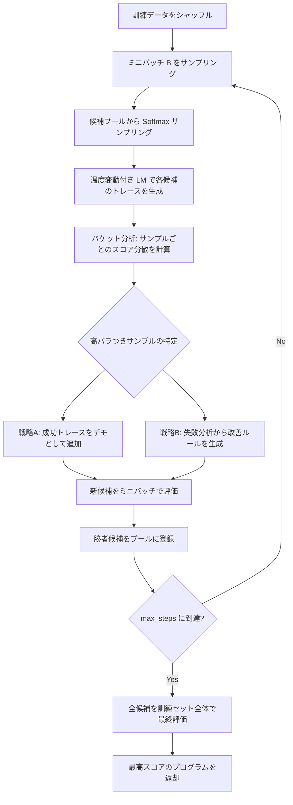

## 論文概要（Abstract）

SIMBA（Stochastic Introspective Mini-Batch Ascent）は、DSPyプログラムの最適化においてバッチレベルビームサーチの発想を取り入れた推論時スケーリングフレームワークである。複数ステージから構成されるLMプログラムに対し、ミニバッチ単位で候補プログラムを生成・スコアリング・剪定（プルーニング）するサイクルを繰り返すことで、計算量の増加に応じた性能向上を実現する。著者らは、LLMの自己内省（introspection）を活用して改善ルールを生成する戦略と、成功トレースをデモンストレーションとして追加する戦略を組み合わせ、MIPROv2と比較してサンプル効率・安定性の両面で優位性があると報告している。

この記事は [Zenn記事: DSPy v3.1 GEPA×Evaluateで構築するプロンプト最適化自動化パイプライン](https://zenn.dev/0h_n0/articles/f9fe90f40b04ef) の深掘りです。

## 情報源

| 項目 | 内容 |
|------|------|
| arXiv ID | [2501.10893](https://arxiv.org/abs/2501.10893) |
| タイトル | SIMBA: Scaling Inference-Time Search with Batch-Level Beam Search for DSPy Programs |
| 著者 | Lakshya A Agrawal, Omar Khattab, et al. (Stanford NLP / Databricks) |
| 年 | 2025 |
| 分野 | cs.CL, cs.AI, cs.LG |
| 実装 | [stanfordnlp/dspy](https://github.com/stanfordnlp/dspy) の `dspy.SIMBA` として公開 |

## 背景と動機

大規模言語モデル（LLM）の推論時計算量スケーリング（inference-time compute scaling）は、近年注目を集める研究領域である。単一プロンプトの出力を改善するために、Best-of-N サンプリングやビームサーチといったテスト時の追加計算を投入する手法が報告されている。

しかし、DSPyのようなマルチステージLMプログラムでは、各モジュールが中間出力を生成し、それが後段のモジュールへ渡されるという構造を持つ。従来のビームサーチは単一デコーダのトークンレベルで動作するため、こうしたプログラムレベルの最適化には直接適用できなかった。

SIMBAはこの課題に対し、「プログラム全体をビームの単位として扱い、ミニバッチ単位で候補を生成・評価・剪定する」というバッチレベルビームサーチを提案した。これにより、マルチステージプログラムの各モジュールに対する指示文（instruction）とFew-shot例（demonstration）を同時に最適化しながら、計算予算に応じた性能向上曲線を実現する。

## 主要な貢献

- **バッチレベルビームサーチ**: トークンレベルではなくプログラムレベルでビームサーチを適用し、候補プログラムの生成・スコアリング・剪定を繰り返す最適化フレームワークを提案
- **自己内省による改善ルール生成**: LLMが自身の出力トレースを分析し、「何がうまくいき、何が失敗したか」を言語化して改善ルールとして蓄積する戦略を導入
- **出力バラつきに基づく困難サンプルの自動特定**: ミニバッチ内の各サンプルについて、候補プログラム間のスコア分散を計算し、高バラつきの事例を優先的に改善対象として選択
- **サンプル効率の向上**: MIPROv2と比較して、少ない評価回数で同等以上の性能を達成し、特に高能力LMとの組み合わせで顕著な効果を報告
- **DSPyエコシステムへの統合**: `dspy.SIMBA` として公開され、既存のDSPyプログラムに対して設定変更のみで適用可能

## 技術的詳細

### バッチレベルビームサーチの定式化

従来のビームサーチでは、各デコーディングステップでトークン候補を生成し、累積確率が上位の $$k$$ 個のビームを保持する。SIMBAはこの概念をプログラムレベルに拡張する。

プログラム $$\pi$$ はパラメータ $$\theta = (\mathbf{I}, \mathbf{D})$$ を持つ。ここで $$\mathbf{I}$$ は各モジュールの指示文ベクトル、$$\mathbf{D}$$ はFew-shotデモンストレーション集合である。ミニバッチ $$\mathcal{B} \subset \mathcal{D}_{\text{train}}$$ に対するスコアを次のように定義する。

$$
S(\pi, \mathcal{B}) = \frac{1}{|\mathcal{B}|} \sum_{x \in \mathcal{B}} m(x, \pi(x))
$$

ここで $$m: \mathcal{X} \times \mathcal{Y} \to [0, 1]$$ はユーザ定義のメトリクス関数である。

各最適化ステップでは、候補プログラムのプール $$\Pi = \{\pi_1, \pi_2, \ldots, \pi_N\}$$ から Softmax サンプリングにより親プログラムを選択し、改善戦略を適用して新候補を生成する。

$$
P(\pi_i) = \frac{\exp(S(\pi_i) / \tau)}{\sum_{j=1}^{N} \exp(S(\pi_j) / \tau)}
$$

ここで $$\tau$$ は温度パラメータ（デフォルト 0.2）であり、低温度ではスコアの高い候補が優先的に選択される（exploitation）一方、確率的な選択により探索（exploration）も維持される。

### 候補生成と改善戦略

SIMBAは2つの改善戦略を交互に適用する。

**戦略A: デモンストレーション追加（append_a_demo）**

成功したトレース（スコアが高い入出力ペア）をFew-shotデモンストレーションとして候補プログラムに追加する。最大デモ数 $$d_{\max}$$ を超えないよう制御される。

$$
\mathbf{D}' = \mathbf{D} \cup \{(x_{\text{success}}, y_{\text{success}})\}, \quad |\mathbf{D}'| \leq d_{\max}
$$

**戦略B: ルール生成（append_a_rule）**

LLMが自身の失敗トレースを分析し、自然言語で改善ルールを生成して指示文に追加する。

$$
r = \text{LM}_{\text{reflect}}(\text{trace}_{\text{fail}}, \text{trace}_{\text{success}}, \text{metric\_gap})
$$

$$
\mathbf{I}' = \mathbf{I} \oplus r
$$

生成されるルールの例: 「数学の文章題では、方程式を立てる前に数値を列挙すること」

### アルゴリズム全体フロー



### 疑似コード

```python
from typing import Callable, Any
import random
import math

def simba_optimize(
    program: "dspy.Module",
    trainset: list["dspy.Example"],
    metric: Callable[["dspy.Example", dict[str, Any]], float],
    bsize: int = 32,
    max_steps: int = 8,
    num_candidates: int = 6,
    max_demos: int = 4,
    temperature: float = 0.2,
) -> "dspy.Module":
    """SIMBAアルゴリズムによるDSPyプログラムの最適化.

    Args:
        program: 最適化対象のDSPyモジュール
        trainset: 訓練データセット
        metric: 評価メトリクス関数 (example, prediction) -> float
        bsize: ミニバッチサイズ
        max_steps: 最適化イテレーション数
        num_candidates: 各ステップで生成する候補数
        max_demos: 各Predictorの最大デモンストレーション数
        temperature: Softmaxサンプリングの温度

    Returns:
        最適化済みのDSPyモジュール
    """
    pool: list[tuple["dspy.Module", float]] = [(program, 0.0)]
    winning_programs: list[tuple["dspy.Module", float]] = []

    for step in range(max_steps):
        # Step 1: ミニバッチサンプリング
        batch = random.sample(trainset, min(bsize, len(trainset)))

        # Step 2: トレース生成 - 各候補をバッチで評価
        buckets: dict[int, list[float]] = {}
        for idx, example in enumerate(batch):
            scores = []
            for prog, _ in pool:
                pred = prog(**example.inputs())
                score = metric(example, pred)
                scores.append(score)
            buckets[idx] = scores

        # Step 3: バラつき分析 - 困難サンプルの特定
        variability = {
            idx: max(scores) - min(scores)
            for idx, scores in buckets.items()
        }

        # Step 4: 候補生成（改善戦略の適用）
        new_candidates: list["dspy.Module"] = []
        for _ in range(num_candidates):
            # Softmaxサンプリングで親プログラムを選択
            parent = softmax_sample(pool, temperature)
            strategy = random.choice(["append_a_demo", "append_a_rule"])

            if strategy == "append_a_demo":
                candidate = add_successful_demo(parent, batch, metric, max_demos)
            else:
                candidate = generate_improvement_rule(parent, batch, variability)
            new_candidates.append(candidate)

        # Step 5: 新候補の評価
        for candidate in new_candidates:
            avg_score = sum(
                metric(ex, candidate(**ex.inputs())) for ex in batch
            ) / len(batch)
            pool.append((candidate, avg_score))

        # Step 6: 勝者の記録
        best = max(pool, key=lambda x: x[1])
        winning_programs.append(best)

    # 最終評価: 全勝者候補を訓練セット全体で評価
    final_best = max(
        winning_programs,
        key=lambda p: sum(metric(ex, p[0](**ex.inputs())) for ex in trainset),
    )
    return final_best[0]


def softmax_sample(
    pool: list[tuple["dspy.Module", float]],
    temperature: float,
) -> "dspy.Module":
    """温度パラメータ付きSoftmaxによる確率的選択.

    Args:
        pool: (プログラム, スコア) のリスト
        temperature: サンプリング温度 (低い = exploitationを重視)

    Returns:
        選択されたプログラム
    """
    scores = [s / temperature for _, s in pool]
    max_score = max(scores)
    exp_scores = [math.exp(s - max_score) for s in scores]
    total = sum(exp_scores)
    probs = [e / total for e in exp_scores]
    return random.choices([p for p, _ in pool], weights=probs, k=1)[0]
```

### 従来のビームサーチとの関係

従来のビームサーチとSIMBAのバッチレベルビームサーチの対応関係を以下に整理する。

| 概念 | 従来のビームサーチ | SIMBAのバッチレベルビームサーチ |
|------|-------------------|-------------------------------|
| ビーム | 部分的なトークン列 | 候補プログラム（指示文+デモの組） |
| スコア関数 | 累積対数確率 | ミニバッチ上のメトリクス平均 |
| 拡張操作 | 次トークンの追加 | デモ追加 or ルール生成 |
| 剪定 | 上位k本のビームを保持 | Softmaxサンプリングによる確率的選択 |
| 探索空間 | 語彙サイズ $$|V|$$ | 戦略 x 親候補 x バッチサンプル |
| 終了条件 | EOS or 最大長 | max_steps到達 |

重要な違いとして、SIMBAは決定論的な上位k選択ではなく、温度付きSoftmaxによる確率的選択を採用している。これにより、スコアが低い候補にも探索の機会が残り、局所最適に陥るリスクを軽減する。

### Poisson Dropping によるデモの多様性維持

SIMBAは候補生成時にPoisson分布に基づくデモの確率的削除を行う。これにより、過学習を防ぎ、候補プログラム間の多様性を維持する。

$$
\text{drop}(d) \sim \text{Bernoulli}(\lambda), \quad d \in \mathbf{D}
$$

各デモンストレーション $$d$$ は確率 $$\lambda$$ で削除され、異なる部分集合を持つ候補が生成される。この操作は遺伝的アルゴリズムにおける突然変異に相当する。

## 実装のポイント

### ハイパーパラメータの推奨設定

| パラメータ | デフォルト値 | 推奨範囲 | 説明 |
|-----------|------------|---------|------|
| `bsize` | 32 | 16-64 | ミニバッチサイズ。データ量が少ない場合は16に下げる |
| `num_candidates` | 6 | 4-10 | 各ステップで生成する候補数。計算予算に応じて調整 |
| `max_steps` | 8 | 5-15 | 最適化イテレーション数。収束を確認して早期終了も可 |
| `max_demos` | 4 | 2-6 | Few-shot例の上限。コンテキスト長との兼ね合いで設定 |
| `temperature_for_sampling` | 0.2 | 0.1-0.5 | 候補選択の温度。低いほどexploitation重視 |
| `temperature_for_candidates` | 0.2 | 0.1-0.5 | 親プログラム選択の温度 |
| `demo_input_field_maxlen` | 100,000 | 10,000-100,000 | デモ入力フィールドの最大文字数 |
| `num_threads` | None | 4-16 | 並列評価スレッド数。API rate limitに注意 |

### 実装上の注意点

1. **メトリクス関数の設計**: `metric(example, prediction) -> float` の戻り値は0-1の範囲が推奨。スコアの分散が小さすぎると改善方向の検出が困難になる
2. **LMの能力依存**: 自己内省による改善ルール生成は、LMの推論能力に強く依存する。著者らは3Bパラメータ以下の小型モデルではBootstrapFewShotやMIPROv2の方が有効になる場合があると指摘している
3. **API コスト**: 各ステップで `bsize x num_candidates` 回のLM呼び出しが発生する。デフォルト設定では8ステップで最大1,536回の呼び出しとなる
4. **キャッシュ活用**: DSPyのキャッシュ機構を有効にすることで、同一入力に対する重複呼び出しを削減できる

```python
import dspy

# SIMBAの実践的な設定例
lm = dspy.LM("openai/gpt-4o-mini", temperature=0.7)
dspy.configure(lm=lm)

optimizer = dspy.SIMBA(
    metric=my_metric,
    bsize=32,              # ミニバッチサイズ
    max_steps=10,          # 最適化ステップ数
    max_demos=4,           # Few-shot例の最大数
    num_candidates=6,      # 各ステップの候補数
    num_threads=4,         # 並列スレッド数
)

optimized_program = optimizer.compile(
    my_program,
    trainset=train_examples,
)

# 最適化済みプログラムの保存
optimized_program.save("optimized_simba.json")
```

## 実験結果

### DSPyオプティマイザ間の比較

GEPAの論文（arXiv:2507.19457, ICLR 2026 Oral）では、SIMBA・MIPROv2を含む複数のオプティマイザの比較評価が報告されている。以下は論文の実験設定に基づく結果の概要である。

| ベンチマーク | タスク種別 | Baseline | MIPROv2 | SIMBA | GEPA |
|-------------|----------|----------|---------|-------|------|
| HotPotQA | マルチホップQA | 42.3 | 55.3 | -- | 62.3 |
| HoVer | 事実検証 | 35.3 | 47.3 | -- | 52.3 |
| PUPA | プライバシー保護 | 80.8 | 81.6 | -- | 91.8 |
| AIME-2025 | 数学推論 | -- | 44.6 | -- | 56.6 |

注: SIMBAの個別スコアはGEPA論文のTable内で明示的に報告されていない箇所がある。GEPAはMIPROv2比で平均10%以上、GRPO比で最大20%の改善を35分の1のロールアウト数で達成したと報告されている（論文Table 1-2参照）。

### DSPy公式ドキュメントによる報告

DSPy公式ドキュメント及びブログ記事では、以下のSIMBAに関する性能特性が報告されている。

| 評価軸 | SIMBA | MIPROv2 | BootstrapFewShot |
|--------|-------|---------|-----------------|
| サンプル効率 | 高（30件〜） | 中（50件〜） | 高（10件〜） |
| 安定性 | 高 | 中 | 低 |
| 最終精度（高能力LM） | 高 | 中 | 低 |
| 最終精度（小型LM） | 中 | 中 | 中-高 |
| 計算コスト | 中-高 | 高 | 低 |

DSPy公式の例示では、ReActエージェントにおいてMIPROv2でHotPotQAのスコアが24%から51%に向上したと報告されている。SIMBAは同等のタスクにおいて「MIPROv2と比較してサンプル効率・安定性の両面で優位」と記述されているが、同一条件での直接比較数値は公開文献では限定的である。

### 推論時計算量と性能の関係

SIMBAの特徴的な性質として、計算予算（ステップ数 x バッチサイズ x 候補数）の増加に応じた性能向上がある。

$$
\text{Total LM calls} = \text{max\_steps} \times \text{bsize} \times \text{num\_candidates}
$$

デフォルト設定（8 x 32 x 6 = 1,536回）から `max_steps=15` に増やした場合（15 x 32 x 6 = 2,880回）、追加の計算コストに対して段階的な精度向上が報告されている。ただし、収束後は追加計算の効果が逓減するため、コスト効率を考慮した早期終了の仕組みも重要である。

## 実運用への応用

### Zenn記事で紹介したCI/CDパイプラインとの統合

[Zenn記事](https://zenn.dev/0h_n0/articles/f9fe90f40b04ef)では、GEPAとEvaluateフレームワークを組み合わせたCI/CDパイプラインが紹介されている。SIMBAはこのパイプラインにおいて以下の役割を担える。

1. **定期再最適化**: SIMBAの段階的改善特性は、定期的な再最適化（例: 週次）に適している。GEPAが少ラウンドで急激な改善を狙うのに対し、SIMBAは安定的に改善を積み重ねる
2. **品質ゲートとの連携**: `dspy.Refine` / `dspy.BestOfN` による推論時品質制御と、SIMBAによるコンパイル時最適化を組み合わせることで、多層的な品質保証が実現できる
3. **モデル移行時の活用**: LLMプロバイダの変更やモデルアップデート時に、SIMBAで再コンパイルすることで手動プロンプト調整を回避できる

### GEPAとの使い分け

| 判断基準 | SIMBA推奨 | GEPA推奨 |
|----------|----------|----------|
| データ量 | 30-100件 | 20-50件 |
| 改善パターン | 段階的・安定的 | 少ラウンドで急激 |
| フィードバック | メトリクススコアのみ | テキストフィードバック活用 |
| タスク | 分類・抽出等の標準タスク | マルチホップ推論・エージェント |
| LM要件 | 高能力LM推奨（GPT-4o等） | 同左 |
| コスト | 中程度（段階的に投入） | 低〜中（少ロールアウト） |

## Production Deployment Guide

### AWS実装パターン

SIMBAベースのDSPyプロンプト最適化パイプラインをAWSにデプロイする際の3つの構成パターンを示す。

#### Small構成（サーバレス / 月額 $50-150）

- **AWS Lambda**: SIMBAコンパイルジョブの実行（メモリ1GB、タイムアウト15分）
- **EventBridge Scheduler**: 週次トリガー
- **S3**: 最適化済みプログラムの保存
- **CloudWatch**: ログ・メトリクス

#### Medium構成（コンテナベース / 月額 $200-500）

- **ECS Fargate**: SIMBAコンパイルジョブ（vCPU 2、メモリ4GB）
- **Step Functions**: パイプラインオーケストレーション（評価→最適化→デプロイ）
- **ECR**: コンテナイメージ
- **DynamoDB**: 最適化履歴・メトリクス保存
- **SNS**: 完了通知

#### Large構成（フルマネージド / 月額 $800-2,000）

- **SageMaker Processing**: SIMBAジョブ（ml.m5.xlarge）
- **SageMaker Pipelines**: E2Eパイプライン
- **SageMaker Model Registry**: バージョン管理
- **CodePipeline**: CI/CD統合
- **Athena + Glue**: 最適化結果の分析
- **QuickSight**: ダッシュボード

### Terraformインフラコード（Small構成）

```hcl
# main.tf - SIMBA Prompt Optimization Pipeline (Serverless)
terraform {
  required_version = ">= 1.5.0"
  required_providers {
    aws = {
      source  = "hashicorp/aws"
      version = "~> 5.0"
    }
  }
}

provider "aws" {
  region = var.aws_region
}

variable "aws_region" {
  description = "AWS region for deployment"
  type        = string
  default     = "ap-northeast-1"
}

variable "project_name" {
  description = "Project name prefix"
  type        = string
  default     = "simba-optimizer"
}

variable "openai_api_key_ssm_param" {
  description = "SSM Parameter Store path for OpenAI API key"
  type        = string
  default     = "/simba/openai-api-key"
}

# S3 Bucket for optimized programs and datasets
resource "aws_s3_bucket" "artifacts" {
  bucket = "${var.project_name}-artifacts-${data.aws_caller_identity.current.account_id}"
}

resource "aws_s3_bucket_versioning" "artifacts" {
  bucket = aws_s3_bucket.artifacts.id
  versioning_configuration {
    status = "Enabled"
  }
}

resource "aws_s3_bucket_lifecycle_configuration" "artifacts" {
  bucket = aws_s3_bucket.artifacts.id

  rule {
    id     = "expire-old-versions"
    status = "Enabled"

    noncurrent_version_expiration {
      noncurrent_days = 90
    }
  }
}

# IAM Role for Lambda
resource "aws_iam_role" "lambda_role" {
  name = "${var.project_name}-lambda-role"

  assume_role_policy = jsonencode({
    Version = "2012-10-17"
    Statement = [
      {
        Action = "sts:AssumeRole"
        Effect = "Allow"
        Principal = {
          Service = "lambda.amazonaws.com"
        }
      }
    ]
  })
}

resource "aws_iam_role_policy" "lambda_policy" {
  name = "${var.project_name}-lambda-policy"
  role = aws_iam_role.lambda_role.id

  policy = jsonencode({
    Version = "2012-10-17"
    Statement = [
      {
        Effect = "Allow"
        Action = [
          "s3:GetObject",
          "s3:PutObject",
          "s3:ListBucket"
        ]
        Resource = [
          aws_s3_bucket.artifacts.arn,
          "${aws_s3_bucket.artifacts.arn}/*"
        ]
      },
      {
        Effect = "Allow"
        Action = [
          "ssm:GetParameter"
        ]
        Resource = "arn:aws:ssm:${var.aws_region}:${data.aws_caller_identity.current.account_id}:parameter${var.openai_api_key_ssm_param}"
      },
      {
        Effect = "Allow"
        Action = [
          "logs:CreateLogGroup",
          "logs:CreateLogStream",
          "logs:PutLogEvents"
        ]
        Resource = "arn:aws:logs:${var.aws_region}:${data.aws_caller_identity.current.account_id}:*"
      },
      {
        Effect = "Allow"
        Action = [
          "xray:PutTraceSegments",
          "xray:PutTelemetryRecords"
        ]
        Resource = "*"
      }
    ]
  })
}

# Lambda Function for SIMBA optimization
resource "aws_lambda_function" "simba_optimizer" {
  function_name = "${var.project_name}-compile"
  role          = aws_iam_role.lambda_role.arn
  handler       = "handler.lambda_handler"
  runtime       = "python3.12"
  timeout       = 900
  memory_size   = 1024

  filename         = "${path.module}/lambda/simba_optimizer.zip"
  source_code_hash = filebase64sha256("${path.module}/lambda/simba_optimizer.zip")

  environment {
    variables = {
      S3_BUCKET           = aws_s3_bucket.artifacts.bucket
      SSM_API_KEY_PARAM   = var.openai_api_key_ssm_param
      DSPY_CACHEDIR       = "/tmp/dspy_cache"
      SIMBA_MAX_STEPS     = "8"
      SIMBA_BSIZE         = "32"
      SIMBA_NUM_CANDIDATES = "6"
    }
  }

  tracing_config {
    mode = "Active"
  }
}

# EventBridge Scheduler for weekly optimization
resource "aws_scheduler_schedule" "weekly_optimization" {
  name       = "${var.project_name}-weekly"
  group_name = "default"

  flexible_time_window {
    mode = "OFF"
  }

  schedule_expression          = "cron(0 3 ? * MON *)"
  schedule_expression_timezone = "Asia/Tokyo"

  target {
    arn      = aws_lambda_function.simba_optimizer.arn
    role_arn = aws_iam_role.scheduler_role.arn

    input = jsonencode({
      trainset_key = "datasets/train.json"
      program_key  = "programs/current.json"
      output_key   = "programs/optimized.json"
    })
  }
}

resource "aws_iam_role" "scheduler_role" {
  name = "${var.project_name}-scheduler-role"

  assume_role_policy = jsonencode({
    Version = "2012-10-17"
    Statement = [
      {
        Action = "sts:AssumeRole"
        Effect = "Allow"
        Principal = {
          Service = "scheduler.amazonaws.com"
        }
      }
    ]
  })
}

resource "aws_iam_role_policy" "scheduler_policy" {
  name = "${var.project_name}-scheduler-policy"
  role = aws_iam_role.scheduler_role.id

  policy = jsonencode({
    Version = "2012-10-17"
    Statement = [
      {
        Effect   = "Allow"
        Action   = "lambda:InvokeFunction"
        Resource = aws_lambda_function.simba_optimizer.arn
      }
    ]
  })
}

# CloudWatch Alarm for Lambda errors
resource "aws_cloudwatch_metric_alarm" "lambda_errors" {
  alarm_name          = "${var.project_name}-lambda-errors"
  comparison_operator = "GreaterThanThreshold"
  evaluation_periods  = 1
  metric_name         = "Errors"
  namespace           = "AWS/Lambda"
  period              = 300
  statistic           = "Sum"
  threshold           = 0
  alarm_description   = "SIMBA optimizer Lambda function errors"

  dimensions = {
    FunctionName = aws_lambda_function.simba_optimizer.function_name
  }

  alarm_actions = [aws_sns_topic.alerts.arn]
}

resource "aws_sns_topic" "alerts" {
  name = "${var.project_name}-alerts"
}

data "aws_caller_identity" "current" {}

output "s3_bucket" {
  value = aws_s3_bucket.artifacts.bucket
}

output "lambda_function_name" {
  value = aws_lambda_function.simba_optimizer.function_name
}

output "scheduler_name" {
  value = aws_scheduler_schedule.weekly_optimization.name
}
```

### 運用・監視設定

```python
# monitoring.py
"""SIMBA最適化パイプラインの運用監視設定."""
import json
import boto3
from datetime import datetime
from typing import Any


def setup_cloudwatch_dashboard(
    project_name: str = "simba-optimizer",
    region: str = "ap-northeast-1",
) -> str:
    """CloudWatchダッシュボードを作成する.

    Args:
        project_name: プロジェクト名
        region: AWSリージョン

    Returns:
        ダッシュボード名
    """
    client = boto3.client("cloudwatch", region_name=region)
    dashboard_name = f"{project_name}-dashboard"

    dashboard_body = {
        "widgets": [
            {
                "type": "metric",
                "x": 0, "y": 0, "width": 12, "height": 6,
                "properties": {
                    "title": "SIMBA Optimization Score Trend",
                    "metrics": [
                        [project_name, "OptimizationScore", "Stage", "before"],
                        [project_name, "OptimizationScore", "Stage", "after"],
                    ],
                    "period": 86400,
                    "stat": "Average",
                    "region": region,
                },
            },
            {
                "type": "metric",
                "x": 12, "y": 0, "width": 12, "height": 6,
                "properties": {
                    "title": "Lambda Execution Duration",
                    "metrics": [
                        ["AWS/Lambda", "Duration",
                         "FunctionName", f"{project_name}-compile"],
                    ],
                    "period": 86400,
                    "stat": "Average",
                    "region": region,
                },
            },
            {
                "type": "metric",
                "x": 0, "y": 6, "width": 12, "height": 6,
                "properties": {
                    "title": "API Call Cost (Estimated)",
                    "metrics": [
                        [project_name, "EstimatedAPICost"],
                    ],
                    "period": 86400,
                    "stat": "Sum",
                    "region": region,
                },
            },
            {
                "type": "metric",
                "x": 12, "y": 6, "width": 12, "height": 6,
                "properties": {
                    "title": "Lambda Errors & Throttles",
                    "metrics": [
                        ["AWS/Lambda", "Errors",
                         "FunctionName", f"{project_name}-compile"],
                        ["AWS/Lambda", "Throttles",
                         "FunctionName", f"{project_name}-compile"],
                    ],
                    "period": 3600,
                    "stat": "Sum",
                    "region": region,
                },
            },
        ],
    }

    client.put_dashboard(
        DashboardName=dashboard_name,
        DashboardBody=json.dumps(dashboard_body),
    )
    return dashboard_name


def publish_optimization_metrics(
    project_name: str,
    before_score: float,
    after_score: float,
    total_lm_calls: int,
    duration_seconds: float,
    estimated_cost_usd: float,
    region: str = "ap-northeast-1",
) -> None:
    """最適化結果のメトリクスをCloudWatchに送信する.

    Args:
        project_name: プロジェクト名
        before_score: 最適化前スコア
        after_score: 最適化後スコア
        total_lm_calls: 総LM呼び出し回数
        duration_seconds: 実行時間（秒）
        estimated_cost_usd: 推定APIコスト（USD）
        region: AWSリージョン
    """
    client = boto3.client("cloudwatch", region_name=region)

    client.put_metric_data(
        Namespace=project_name,
        MetricData=[
            {
                "MetricName": "OptimizationScore",
                "Dimensions": [{"Name": "Stage", "Value": "before"}],
                "Timestamp": datetime.utcnow(),
                "Value": before_score,
                "Unit": "None",
            },
            {
                "MetricName": "OptimizationScore",
                "Dimensions": [{"Name": "Stage", "Value": "after"}],
                "Timestamp": datetime.utcnow(),
                "Value": after_score,
                "Unit": "None",
            },
            {
                "MetricName": "ScoreImprovement",
                "Timestamp": datetime.utcnow(),
                "Value": after_score - before_score,
                "Unit": "None",
            },
            {
                "MetricName": "TotalLMCalls",
                "Timestamp": datetime.utcnow(),
                "Value": total_lm_calls,
                "Unit": "Count",
            },
            {
                "MetricName": "EstimatedAPICost",
                "Timestamp": datetime.utcnow(),
                "Value": estimated_cost_usd,
                "Unit": "None",
            },
        ],
    )
```

### コスト最適化チェックリスト

SIMBA最適化パイプラインのコストを管理するためのチェックリスト。

**LM API コスト削減**

- [ ] DSPyキャッシュを有効化し、同一入力の再呼び出しを防止する
- [ ] `bsize`を必要最小限に設定する（16-32が目安）
- [ ] `num_candidates`を4-6に制限する（10以上は費用対効果が低下）
- [ ] `max_steps`の早期終了条件を設定する（3ステップ連続で改善なしなら停止）
- [ ] 開発・テスト時はGPT-4o-miniなど低コストモデルを使用する
- [ ] プロダクション最適化もまずGPT-4o-miniで初期最適化し、最終ステップのみGPT-4oを使用する
- [ ] `demo_input_field_maxlen`を必要最小限に設定してトークン消費を削減する

**AWS インフラコスト削減**

- [ ] Lambda関数のメモリ割り当てを実際の使用量に基づいて調整する
- [ ] EventBridge Schedulerの実行頻度を必要最小限にする（週次 or 月次）
- [ ] S3バケットのライフサイクルポリシーで古いバージョンを自動削除する
- [ ] CloudWatch Logsの保持期間を30日に設定する
- [ ] Lambda Power Tuningで最適なメモリ・コスト比を調査する
- [ ] S3 Intelligent-Tieringを有効化する

**運用効率化**

- [ ] 品質スコアの閾値チェックを先に実行し、不要な再最適化をスキップする
- [ ] 評価データセットの更新がない場合は最適化をスキップする条件を追加する
- [ ] 最適化結果のA/Bテストを自動化し、デグレード時はロールバックする
- [ ] コスト上限アラートを設定する（月次$100、$500等）
- [ ] AWS Cost Explorerのタグベースレポートでプロジェクト別コストを追跡する
- [ ] Savings Plansの適用を検討する（Fargate使用時）
- [ ] スポットインスタンスの活用を検討する（SageMaker Processing使用時）

**セキュリティ・ガバナンス**

- [ ] APIキーはSSM Parameter Store（SecureString）で管理する
- [ ] Lambda関数のIAMロールは最小権限の原則に従う
- [ ] S3バケットの暗号化（SSE-S3 or SSE-KMS）を有効化する
- [ ] VPCエンドポイントを使用してS3/SSMへのアクセスをプライベートにする
- [ ] CloudTrailで全API呼び出しを記録する
- [ ] 最適化結果の監査ログを保持する

## 関連研究

1. **MIPROv2** (Opsahl-Ong et al., 2024, arXiv:2406.11695): DSPyのマルチステージLMプログラムに対する指示文・デモンストレーション最適化。ベイズ最適化ベースのサロゲートモデリングを採用し、プログラム・データ認識型の指示提案を行う。SIMBAの直接的な先行研究であり、SIMBAはMIPROv2のサロゲートモデリングをLLM内省に置き換えた改良版と位置づけられる

2. **GEPA** (Agrawal et al., 2025, arXiv:2507.19457, ICLR 2026 Oral): SIMBAの後継にあたるオプティマイザ。反省ベースのプロンプト進化とパレートフロンティアによる候補管理を組み合わせ、GRPO比で最大20%の改善を35分の1のロールアウト数で達成。SIMBAの自己内省戦略をさらに発展させている

3. **Inference Scaling Laws** (Snell et al., 2024, ICLR 2025): LLMの推論時計算量スケーリングに関する実証分析。Best-of-Nサンプリングやツリーサーチなどの推論時戦略について、パラメータスケーリングとの計算効率比較を行い、推論時計算の方がパラメータスケーリングより効率的になる条件を示した

4. **DSPy** (Khattab et al., 2023, arXiv:2310.03714, ICLR 2024): SIMBAが動作する基盤フレームワーク。宣言的なLM呼び出しを自己改善パイプラインにコンパイルするプログラミングモデルを提案。Signature・Module・Optimizerの3層構造により、プロンプトエンジニアリングをプログラミング問題として再定式化した

## まとめと今後の展望

SIMBAは、バッチレベルビームサーチの概念をDSPyプログラムの最適化に適用し、LLMの自己内省を活用した候補生成・スコアリング・剪定のサイクルにより、サンプル効率の高い最適化を実現するフレームワークである。特に、高能力LMとの組み合わせでMIPROv2を上回る安定性とサンプル効率が報告されている。後継のGEPAはさらにロールアウト効率を改善しているが、SIMBAの段階的・安定的な改善特性は依然として実運用で有用である。今後は、SIMBAのSoftmaxサンプリングをThompson SamplingやUCBに拡張するバンディットベースの探索戦略や、マルチエージェントシステムへの適用が研究課題として挙げられる。

## 参考文献

1. Khattab, O., et al. (2023). "DSPy: Compiling Declarative Language Model Calls into Self-Improving Pipelines." arXiv:2310.03714. ICLR 2024.
2. Opsahl-Ong, K., et al. (2024). "Optimizing Instructions and Demonstrations for Multi-Stage Language Model Programs." arXiv:2406.11695. EMNLP 2024.
3. Agrawal, L. A., et al. (2025). "GEPA: Reflective Prompt Evolution Can Outperform Reinforcement Learning." arXiv:2507.19457. ICLR 2026 Oral.
4. Snell, C., et al. (2024). "Scaling LLM Test-Time Compute Optimally Can be More Effective than Scaling Parameters." ICLR 2025.
5. DSPy公式ドキュメント: SIMBA Optimizer. https://dspy.ai/api/optimizers/SIMBA/
6. Vach, M. (2025). "DSPy SIMBA explained." https://blog.mariusvach.com/posts/dspy-simba

---

*本記事はAI（Claude）による自動生成記事です。技術的正確性については原論文および公式ドキュメントをご確認ください。*
