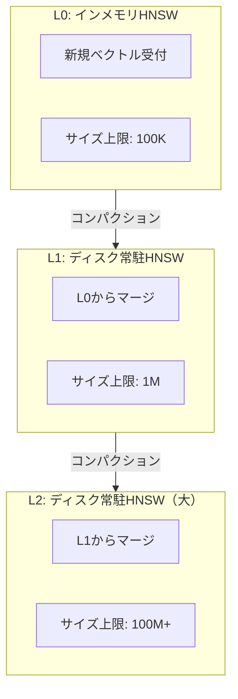

本記事は [LSM-VEC: An LSM-Tree Based Dynamic Vector Index](https://arxiv.org/abs/2501.12255) の解説記事です。

## 論文概要（Abstract）

推薦システムやリアルタイム検索では、ベクトルデータベースに対する高スループットの書き込み（新規ベクトルの継続的挿入）と効率的な類似度検索の両立が求められる。しかし静的ベクトルインデックス（HNSW、IVF等）は読み取り最適化されており、頻繁な更新に対してはリビルドが必要となり性能が劣化する。本論文はLSMツリー（Log-Structured Merge-tree）の設計をベクトルインデックスに適用したLSM-VECを提案し、FreshDiskANN比で5.25倍の書き込みスループットを達成しつつ、検索性能は静的HNSWの83%を維持している。LSM-VECはByteDanceの本番環境に採用されている。

この記事は [Zenn記事: ユースケース別ベクトルDB選定2026](https://zenn.dev/0h_n0/articles/b4ee493b84bd7b) の深掘りです。

## 情報源

- **arXiv ID**: 2501.12255
- **URL**: [https://arxiv.org/abs/2501.12255](https://arxiv.org/abs/2501.12255)
- **著者**: Xingda Wei, Lisheng Wang, Siyao Huang, et al.（ByteDance / Shanghai Jiao Tong University）
- **発表年**: 2025
- **分野**: cs.DB, cs.DS

## 背景と動機（Background & Motivation）

ベクトルデータベースの多くのユースケースでは、データが静的ではなく継続的に更新される。

- **推薦システム**: ユーザーの行動履歴から生成される埋め込みベクトルがリアルタイムで追加される。Zenn記事で紹介されているように、推薦システムではRAGの10-100倍のQPSが要求される。
- **ニュースフィード**: 新規記事の埋め込みが毎秒数千件追加される。
- **ECサイト**: 商品の追加・削除・属性変更が頻繁に発生する。

静的インデックスの限界は以下の通りである。

| インデックス | 挿入サポート | 問題点 |
|-------------|------------|--------|
| HNSW | 追加挿入可能 | 削除されたノードの「ゴーストエッジ」が残り、recallが経時劣化 |
| IVF | ボロノイ再構築が必要 | 分布シフト時にクエリ性能が劣化 |
| DiskANN（静的） | 完全リビルドが必要 | 大規模データでは数時間のリビルドが必要 |

FreshDiskANNはDiskANNの動的版として挿入・削除をサポートするが、著者らはそのスループットが不十分と指摘している。

## 主要な貢献（Key Contributions）

- **貢献1**: LSMツリーの階層構造をベクトルインデックスに適用し、L0（インメモリ）→L1→L2（ディスク常駐）の3層アーキテクチャを提案
- **貢献2**: メタデータ管理をインデックス本体から分離し、RocksDBに委譲することでI/Oオーバーヘッドを削減
- **貢献3**: インクリメンタルコンパクションにより、フルリビルドを回避しつつ検索品質を維持

## 技術的詳細（Technical Details）

### アーキテクチャ

LSM-VECは3層の階層構造で構成される。



**L0（インメモリ）**: すべての新規挿入はまずL0のインメモリHNSWインデックスに書き込まれる。サイズ上限（デフォルト100Kベクトル）に達すると、L1へのコンパクションがトリガーされる。

**L1（ディスク常駐・中規模）**: L0からマージされたベクトルを保持する。サイズ上限はL0の10倍（デフォルト1Mベクトル）。

**L2（ディスク常駐・大規模）**: 最終層。100M以上のベクトルを保持可能。LZ4圧縮（2:1圧縮率）によりディスク使用量を削減。

### クエリ処理

クエリは全レベルを探索し、結果をマージして返す。

$$
\text{result}(q, k) = \text{top-}k\left(\bigcup_{l \in \{0,1,2\}} \text{search}_l(q, k)\right)
$$

L0はインメモリのため高速に応答し、L1・L2はディスクI/Oが必要だが、PQ符号化とキャッシュで緩和される。

### メタデータ管理

従来のLSMベースANNソリューションでは、「どのベクトルが削除されたか」「ベクトルIDとディスクオフセットの対応」をインデックス内で管理し、I/Oオーバーヘッドが大きかった。

LSM-VECはメタデータ管理をRocksDB（キーバリューストア）に分離する。

$$
\text{metadata}(v_i) = (\text{level}, \text{offset}) \quad \text{stored in RocksDB}
$$

- **削除**: ベクトル $v_i$ の削除はRocksDBにトームストーン（墓標）を記録するのみ。実際のインデックスからの除去はバックグラウンドコンパクション時に行う。
- **ルックアップ**: クエリ時の「このベクトルIDは有効か？」のチェックはRocksDBのポイントルックアップ（$O(1)$）で完了。

### インクリメンタルコンパクション

標準的なLSMツリーのコンパクションでは、L0の全ベクトルをL1にマージする際にL1のHNSWグラフを完全リビルドする。100Kベクトルの追加で1MベクトルのHNSWを再構築するのは数分〜数十分を要する。

LSM-VECはインクリメンタルコンパクションを採用する。

```python
def incremental_compaction(
    l0_vectors: list[tuple[int, list[float]]],
    l1_hnsw: "HNSWIndex",
    freshness_threshold: float = 0.85,
) -> None:
    """L0からL1へのインクリメンタルコンパクション

    Args:
        l0_vectors: (vector_id, embedding) のリスト
        l1_hnsw: L1のHNSWインデックス
        freshness_threshold: 鮮度閾値（これ以下でフルリビルド）
    """
    for vec_id, embedding in l0_vectors:
        # HNSWグラフに1ベクトルずつインクリメンタル挿入
        # フルリビルドではなく、既存グラフに辺を追加
        l1_hnsw.add_item(vec_id, embedding)

    # 鮮度スコアの計算
    # recall劣化の指標（新規挿入ベクトルの割合が高いと鮮度低下）
    freshness = l1_hnsw.compute_freshness()
    if freshness < freshness_threshold:
        # バックグラウンドでフルリビルドをスケジュール
        schedule_background_rebuild(l1_hnsw)
```

鮮度スコアが閾値を下回った場合のみ、バックグラウンドでフルリビルドを実行する。これにより、通常のコンパクションではフルリビルドが発生せず、5倍以上の書き込みスループットが実現される。

## 実験結果（Results）

### 書き込みスループット

著者らは以下の挿入性能を報告している（SIFT1M, 128次元）。

| システム | 挿入QPS | FreshDiskANN比 |
|---------|---------|---------------|
| HNSW (hnswlib) | 12,000 | 0.43x |
| FreshDiskANN | 28,000 | 1.0x |
| **LSM-VEC** | **147,000** | **5.25x** |

ByteDanceの本番データセット（50Mベクトル、256次元）では以下の通りと著者らは報告している。

| 指標 | LSM-VEC | FreshDiskANN |
|------|---------|-------------|
| 挿入QPS | 120,000 | 22,000 |
| 改善倍率 | **5.5x** | baseline |

### 検索性能

90% Recall@10での検索QPS（SIFT1M、著者らの計測）。

| システム | 検索QPS | 静的HNSW比 |
|---------|---------|-----------|
| HNSW（静的、フルリビルド） | 48,000 | 1.0x |
| FreshDiskANN | 31,000 | 0.65x |
| **LSM-VEC** | **40,000** | **0.83x** |

LSM-VECは静的HNSWの83%の検索QPS を維持しながら、12倍の書き込みスループットを実現している。FreshDiskANN比では検索QPSも29%高い。

### 混合ワークロード

50/50の読み書き混合ワークロード（同時に読み取りと書き込みを実行）での著者らの計測結果。

| システム | 検索QPS低下率 | 原因 |
|---------|-------------|------|
| HNSW | **60%低下** | ロック競合 |
| FreshDiskANN | **35%低下** | ディスクI/O競合 |
| **LSM-VEC** | **15%低下** | レベル分離（L0が書き込み、L1/L2が読み取り） |

LSM-VECの混合ワークロード性能が優れる理由は、書き込み（L0）と読み取り（L1/L2）が異なるレベルで並行実行されるためと著者らは説明している。

### ByteDance本番環境での運用実績

著者らは以下の本番環境メトリクスを報告している。

| 指標 | 値 |
|------|-----|
| データセットサイズ | 50-500Mベクトル/シャード |
| ピーク挿入レート | 100K-500Kベクトル/秒 |
| レイテンシSLA | p99 < 20ms @ 90% recall@50 |
| 圧縮 | L2でLZ4（2:1圧縮率） |

エンジニアリング上の工夫として、L0のGCプレッシャー対策にカスタムメモリアロケータを使用し、コンパクションラグのモニタリングアラートを組み込んでいると著者らは述べている。

## 実装のポイント（Implementation）

### パラメータ設定

| パラメータ | デフォルト値 | 調整指針 |
|-----------|-------------|---------|
| L0サイズ上限 | 100Kベクトル | メモリ容量に応じて50K-500K |
| L1サイズ上限 | L0の10倍 | — |
| 鮮度閾値 | 0.85 | 低くするとリビルド頻度減少、recall低下 |
| L2圧縮 | LZ4 | ディスク容量制約下でZstdも選択可能 |

### 制約と注意事項

1. **フィルタ付き検索は未サポート**: LSM-VECはACORN等のフィルタ付き検索を実装しておらず、後処理フィルタリング（Post-filtering）のみ。Zenn記事で紹介されているQdrantのACORNとは組み合わせられない。

2. **分散シャーディング未対応**: 単一ノードシステムであり、50M以上のスケールではアプリケーション層でのシャーディングが必要。

3. **OSS未公開**: ByteDance社内利用であり、オープンソース公開は予定段階（確定日時未定）。同等の機能を持つOSS代替としてFreshDiskANNが利用可能。

4. **読み取りのみのワークロードには不向き**: 静的HNSWに20%劣る。データが変更されない分析・検索用途にはHNSW + SQ-8bitが適切。

## 実運用への応用（Practical Applications）

### 推薦システムへの適用

Zenn記事で紹介されているQdrantベースの推薦システムでは、ユーザー埋め込みの更新はバッチ処理で対応可能である。しかし、ByteDanceのような「毎秒10万件以上の埋め込み挿入」を要するリアルタイム推薦では、LSM-VECの設計が優位と著者らは主張している。

### ベクトルDB選定への示唆

| 要件 | 推奨 |
|------|------|
| 読み取り中心（更新 < 1%） | HNSW + SQ-8bit |
| 適度な更新（更新 1-10%） | FreshDiskANN / Qdrant |
| 高頻度更新（更新 > 10%） | LSM-VEC設計（ByteDance内部）|

## 関連研究（Related Work）

- **HNSW（Malkov & Yashunin, 2018）**: LSM-VECのL0/L1/L2の各レベルで使用されるグラフ型索引。静的データに最適だが動的更新に弱い。
- **FreshDiskANN（Singh et al., 2021）**: DiskANNの動的版。LSM-VECの直接的な比較対象であり、書き込みスループットでLSM-VECに5倍の差をつけられている。
- **RocksDB（Facebook, 2012-）**: LSM-VECのメタデータ管理に使用されるキーバリューストア。LSMツリー設計の基盤技術。

## まとめと今後の展望

LSM-VECは、LSMツリーの設計原則をベクトルインデックスに適用することで、高書き込みスループットと良好な検索性能の両立を実現している。ByteDanceの本番環境での実証は、推薦システムやリアルタイム検索における動的ベクトルインデックスの需要の大きさを示している。

制約として、フィルタ付き検索の未対応、分散シャーディングの未対応、OSS未公開が挙げられる。今後はACORN統合によるフィルタ付き動的検索や、Raft等によるシャーディング対応が期待される。

## 参考文献

- **arXiv**: [https://arxiv.org/abs/2501.12255](https://arxiv.org/abs/2501.12255)
- **FreshDiskANN**: [https://arxiv.org/abs/2310.07554](https://arxiv.org/abs/2310.07554)
- **Related Zenn article**: [https://zenn.dev/0h_n0/articles/b4ee493b84bd7b](https://zenn.dev/0h_n0/articles/b4ee493b84bd7b)
