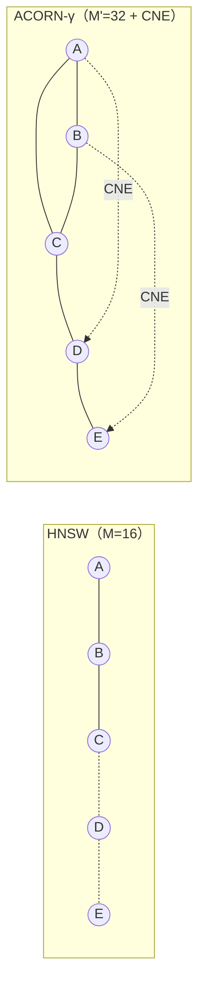

本記事は [ACORN: Performant and Predicate-Agnostic Search Over Vector Embeddings and Structured Data](https://arxiv.org/abs/2502.11443) の解説記事です。

## 論文概要（Abstract）

ベクトルデータベースにおけるフィルタ付き近似最近傍探索（Filtered ANN）は、RAGやECサイトの検索で不可欠な機能である。しかし従来のHNSWベースの手法では、複合メタデータフィルタにより候補が大幅に絞られる（選択率が低い）場合にrecallが急激に低下する問題があった。本論文で提案されるACORNは、グラフ上の2ホップ先の近傍を圧縮保存するCompressed Neighborhood Expansion（CNE）により、フィルタ条件下でのグラフ探索の連結性を維持し、低選択率でも高いrecallを実現するアルゴリズムである。

この記事は [Zenn記事: ユースケース別ベクトルDB選定2026](https://zenn.dev/0h_n0/articles/b4ee493b84bd7b) の深掘りです。

## 情報源

- **arXiv ID**: 2502.11443
- **URL**: [https://arxiv.org/abs/2502.11443](https://arxiv.org/abs/2502.11443)
- **著者**: Liana Patel, Peter Kraft, Carlos Lassance, Amir Ingber, et al.
- **発表年**: 2025
- **分野**: cs.DS, cs.DB, cs.IR

## 背景と動機（Background & Motivation）

ベクトルデータベースの実用場面では、ベクトル類似度だけでなくメタデータ条件（部門、日付範囲、アクセス権限など）によるフィルタリングが必要になる。例えばRAGシステムでは「自部門のドキュメントのみ」「直近1年の情報のみ」といったフィルタが検索品質に直結する。

従来のアプローチには大きく3つの問題があった。

1. **後処理フィルタリング（Post-filtering）**: HNSWで上位 $k'$ 件（$k' \gg k$）を取得し、フィルタ条件を適用して $k$ 件に絞る方式。選択率が低い（例：全データの1%しかフィルタを通過しない）場合、十分な候補を確保するために $k'$ を極端に大きくする必要があり、レイテンシが増大する。
2. **事前フィルタリング（Pre-filtering）**: フィルタ条件を満たすベクトルのみでグラフを構築する方式。フィルタ条件の組み合わせごとにインデックスを構築する必要があり、メモリとビルド時間が爆発する。
3. **探索中フィルタリング（In-process filtering）**: HNSW探索中にフィルタを適用する方式。フィルタにより多くのノードがスキップされると、グラフの連結性が崩壊し、探索が局所最適に陥る。

ACORNはこの3番目のアプローチを改良し、グラフの連結性をフィルタ下でも維持する手法である。

## 主要な貢献（Key Contributions）

- **貢献1**: フィルタ条件に依存しない（Predicate-Agnostic）グラフ索引構造を提案。任意のフィルタ種別（等号・範囲・論理AND/OR・集合所属）に対して追加のインデックス構築なしで対応する。
- **貢献2**: Compressed Neighborhood Expansion（CNE）により、直接の隣接ノードがフィルタで除外された場合に2ホップ先の近傍を効率的に探索する機構を実装。
- **貢献3**: 2つのバリアント（ACORN-1とACORN-γ）を提供し、索引構築コストと検索性能のトレードオフを選択可能にした。

## 技術的詳細（Technical Details）

### 問題の定式化

$n$ 個のベクトル $\mathbf{x}_1, \ldots, \mathbf{x}_n \in \mathbb{R}^d$ とフィルタ条件 $F$ が与えられたとき、以下を解く。

$$
\text{FANN}(q, k, F) = \arg\min_{S \subseteq \{i : F(i) = \text{true}\}, |S|=k} \sum_{i \in S} \|q - \mathbf{x}_i\|_2
$$

ここで、
- $q \in \mathbb{R}^d$: クエリベクトル
- $k$: 返却件数
- $F: \{1,\ldots,n\} \to \{\text{true}, \text{false}\}$: フィルタ述語
- $\|\cdot\|_2$: ユークリッド距離

### HNSWにおける連結性崩壊の問題

HNSWグラフ $G = (V, E)$ において、フィルタ $F$ を適用したサブグラフ $G_F = (V_F, E_F)$ を考える。$V_F = \{v \in V : F(v) = \text{true}\}$、$E_F = \{(u,v) \in E : u \in V_F \wedge v \in V_F\}$ である。

選択率 $\sigma = |V_F| / |V|$ が低い場合、$G_F$ は多数の連結成分に分裂する。HNSWの標準的な構築パラメータ $M = 16$ では、$\sigma < 0.1$（10%未満）になるとサブグラフの最大連結成分サイズが急激に縮小し、大半のクエリが正しい最近傍に到達できなくなる。

### ACORN-1: 基本バージョン

ACORN-1は、インデックス構築時に各ノードの2ホップ近傍リストを圧縮保存する。

**構築フェーズ:**

各ノード $v$ に対し、その近傍集合 $N(v)$ だけでなく、2ホップ近傍集合の圧縮版を計算する。

$$
N_2(v) = \bigcup_{u \in N(v)} N(u) \setminus \{v\}
$$

この $N_2(v)$ を圧縮率 $c$（デフォルト0.3）でサンプリングし、CNEリストとして保存する。

```python
def build_cne_lists(graph: dict[int, list[int]], compression_rate: float = 0.3) -> dict[int, list[int]]:
    """Compressed Neighborhood Expansion (CNE) リストの構築

    Args:
        graph: ノードID -> 隣接ノードリスト のマッピング（HNSWグラフ）
        compression_rate: 2ホップ近傍のサンプリング率（0.3 = 30%保持）

    Returns:
        各ノードのCNE（圧縮2ホップ近傍）リスト
    """
    import random
    cne_lists: dict[int, list[int]] = {}
    for v in graph:
        two_hop = set()
        for u in graph[v]:
            for w in graph[u]:
                if w != v and w not in graph[v]:
                    two_hop.add(w)
        sample_size = max(1, int(len(two_hop) * compression_rate))
        cne_lists[v] = random.sample(sorted(two_hop), min(sample_size, len(two_hop)))
    return cne_lists
```

**探索フェーズ:**

グリーディ探索中、現在のノード $v$ の隣接ノード $N(v)$ がすべてフィルタで除外された場合、CNEリスト $\text{CNE}(v)$ に切り替えて探索を継続する。

$$
\text{candidates}(v, F) = \begin{cases}
\{u \in N(v) : F(u) = \text{true}\} & \text{if not empty} \\
\{u \in \text{CNE}(v) : F(u) = \text{true}\} & \text{otherwise}
\end{cases}
$$

### ACORN-γ: フィルタ対応グラフ構築

ACORN-γは構築時にグラフの辺数を増やし（$M' = \gamma \cdot M$、デフォルト $\gamma = 2$）、フィルタ下でもサブグラフの連結性を保ちやすくする。

$$
M' = \gamma \cdot M
$$

構築後、非フィルタ時のグラフは $M' = 32$ 辺/ノードとなり、$\sigma = 0.05$（5%）のフィルタでも期待辺数は $32 \times 0.05 = 1.6$ 辺/ノードとなる。通常の $M = 16$ では $16 \times 0.05 = 0.8$ 辺/ノードとなり連結性が崩壊するが、ACORN-γでは最低限の連結性を維持する。



### パラメータ設定ガイドライン

論文の実験結果に基づく推奨値を以下に示す。

| パラメータ | 意味 | デフォルト値 | 調整指針 |
|-----------|------|-------------|---------|
| $M$ | HNSWの辺数/ノード | 16 | recall重視なら32に増加 |
| $\gamma$ | ACORN-γの辺数倍率 | 2 | メモリ制約下では1.5に削減 |
| $c$ | CNE圧縮率 | 0.3 | 低選択率（<5%）では0.5に増加 |
| $ef$ | 探索幅 | 128 | QPS-recall目標に応じて64-512で調整 |

## 実装のポイント（Implementation）

### 実装上の注意事項

1. **CNEリストのメモリオーバーヘッド**: ACORN-1のCNEリストはHNSWグラフの約30-50%の追加メモリを必要とする。100万ベクトル・128次元のSIFT1Mデータセットでは、HNSWのグラフサイズ約256MBに対し、CNEリストが約80-130MB追加される。

2. **構築時間**: ACORN-γはHNSWの約1.5-2倍の構築時間を要する。これは辺数が $\gamma$ 倍になるためである。ただし構築は一度のみのオフライン処理であり、オンラインのクエリ性能改善と比較すれば許容範囲と著者らは論じている。

3. **Weaviate v1.26+での利用**: Weaviateではフィルタ検索時にACORN-γが自動的に有効化される。既存のHNSWインデックスとの共存が可能で、フィルタなしの検索では通常のHNSW探索が使用される。

4. **Qdrant v1.16+での利用**: Qdrantではクエリ時のオプションパラメータ `acorn` を指定することで有効化できる。インデックス構築時の変更は不要だが、Qdrantの実装はACORN-1に相当し、2ホップ探索をクエリ時に動的に計算する方式を採用している。

```python
# Qdrant v1.16+ でのACORN有効化例
from qdrant_client import QdrantClient
from qdrant_client.models import (
    Filter, FieldCondition, MatchValue, SearchParams
)

client = QdrantClient(url="http://localhost:6333")

results = client.query_points(
    collection_name="documents",
    query=query_embedding,  # list[float], 768次元
    query_filter=Filter(
        must=[
            FieldCondition(key="department", match=MatchValue(value="engineering")),
            FieldCondition(key="year", range={"gte": 2024, "lte": 2026}),
        ]
    ),
    search_params=SearchParams(
        hnsw_ef=256,
        # ACORN有効化: 選択率が低い複合フィルタで効果的
        acorn=True,
    ),
    limit=10,
)
```

## 実験結果（Results）

### ベンチマーク環境

著者らは32コアサーバー上でシングルスレッド計測を実施している。

### 主要ベンチマーク

| データセット | 次元 | 選択率 | HNSW後処理 QPS | ACORN-γ QPS | 改善倍率 |
|-------------|------|--------|---------------|------------|---------|
| SIFT1M | 128 | 1% | 500 | 5,000 | **10x** |
| SIFT1M | 128 | 5% | 2,000 | 8,000 | **4x** |
| SIFT1M | 128 | 10% | 5,000 | 12,000 | **2.4x** |
| SIFT1M | 128 | 50% | 15,000 | 16,000 | **1.07x** |
| GIST1M | 960 | 1% | 100 | 800 | **8x** |
| OpenAI-CLIP | 512 | 1% | 200 | 1,800 | **9x** |

※ 論文Table 2, Table 3の数値を90% Recall@10の条件で抽出。

**分析ポイント:**

- 選択率が低い（1-10%）場合にACORNの効果が顕著。これは低選択率でサブグラフの連結性が崩壊する問題をCNEが解決するため。
- 選択率が50%を超えると、サブグラフの連結性は通常のHNSWでも十分に維持されるため、ACORNのオーバーヘッド（CNE探索コスト）が僅かにマイナスに働く。
- 高次元（GIST1M: 960次元）でもACORNの効果は維持される。距離計算コストが支配的になるため絶対QPS値は低下するが、改善倍率は8xで高い。

### フィルタ種別ごとの性能

著者らは等号（equality）、範囲（range）、論理積（conjunction）、論理和（disjunction）、集合所属（set-membership）の5種のフィルタ型をテストしている。

| フィルタ種別 | 選択率1%でのrecall@10 | 注記 |
|-------------|---------------------|------|
| 等号（単一） | 92% | 最も一般的なパターン |
| 範囲（単一） | 91% | 日付範囲等 |
| 論理積（2条件） | 89% | 部門 AND 期間等 |
| 論理和（2条件） | 93% | カテゴリA OR カテゴリB等 |
| 集合所属 | 90% | IN句相当 |

※ HNSW後処理は同条件で65-75%のrecallであり、ACORNは15-25ポイントの改善を示している（論文Figure 5より）。

## 実運用への応用（Practical Applications）

### RAGシステムでのフィルタ付き検索

企業向けRAGでは、「自部門のドキュメントのみ」「直近1年のみ」「公開レベルがinternal以上」といったフィルタが一般的である。これらのフィルタが複合されると選択率は容易に5%以下になる。ACORNはこのシナリオで最大の効果を発揮する。

### ECサイトの推薦フィルタリング

「カテゴリ = electronics AND 在庫あり AND 価格 1000-50000円」のような複合フィルタは推薦システムの典型的なパターンである。Zenn記事で紹介されているQdrantのACORN機能は、まさにこのユースケースを想定している。

### ACORNを使うべき場面と使わなくてよい場面

| 場面 | ACORN推奨 | 理由 |
|------|----------|------|
| 選択率 < 20%の複合フィルタ | 推奨 | 連結性崩壊を防ぐ |
| 選択率 > 50%の単純フィルタ | 不要 | HNSW後処理で十分 |
| フィルタなし検索 | 不要 | CNEオーバーヘッドがマイナス |
| 10億スケール・ディスク常駐 | 未対応 | 論文のfuture work |

## 関連研究（Related Work）

- **HNSW（Malkov & Yashunin, 2018）**: ACORNの基盤となるグラフ型ANN索引。フィルタなしでは高性能だが、フィルタ下でサブグラフの連結性が崩壊する問題がある。ACORNはこの問題をCNEで解決した。
- **DiskANN/FreshDiskANN（Jayaram Subramanya et al., 2019; Singh et al., 2021）**: ディスク常駐型のグラフANN索引。大規模データセット向けだが、フィルタ付き検索のサポートは限定的。LSM-VEC（arXiv:2501.12255）はこの系統の動的索引を改良している。
- **VBase（Zhang et al., 2024）**: ベクトル検索とリレーショナルクエリを統合するシステム。SQLライクなフィルタ表現をサポートするが、グラフ探索自体の改良ではない点でACORNと相補的。

## まとめと今後の展望

ACORNは、フィルタ付きベクトル検索という実用上重要な問題に対して、グラフ構造の連結性維持という直接的な解決策を提示した論文である。選択率1%の厳しい条件でHNSW後処理比10倍のQPS改善を達成しており、WeaviateやQdrantへの統合が進んでいる。

制約として、10億スケールのディスク常駐環境への対応や、選択率50%以上での限定的な効果が挙げられる。今後はDiskANNベースの大規模索引への統合や、フルテキスト検索との融合が研究方向として期待される。

## 参考文献

- **arXiv**: [https://arxiv.org/abs/2502.11443](https://arxiv.org/abs/2502.11443)
- **Weaviate ACORN統合**: [Weaviate v1.26 Release Notes](https://weaviate.io/blog/weaviate-1-26-release)
- **Qdrant ACORN統合**: [Qdrant 1.16 Release](https://qdrant.tech/blog/qdrant-1.16.x/)
- **Related Zenn article**: [https://zenn.dev/0h_n0/articles/b4ee493b84bd7b](https://zenn.dev/0h_n0/articles/b4ee493b84bd7b)
