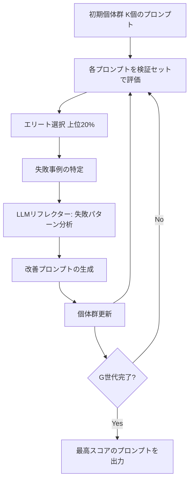

本記事は [GEPA: Reflective Prompt Evolution Can Outperform Reinforcement Learning](https://arxiv.org/abs/2507.19457)（Peng et al., 2025）の解説記事です。

この記事は [Zenn記事: DSPy v3.1 GEPA×Evaluateで構築するプロンプト最適化自動化パイプライン](https://zenn.dev/0h_n0/articles/f9fe90f40b04ef) の深掘りです。

## 論文概要（Abstract）

GEPAはLLMの推論能力を向上させるために、強化学習（RL）ではなく**進化的アルゴリズムとLLMベースのリフレクション（自己反省）**を組み合わせてシステムプロンプトを最適化する手法である。著者らは、モデルの推論能力はすでに内在しており、適切なプロンプトによって引き出せるという仮説に基づいている。AIME 2025で71.5%、LiveCodeBenchで57.5%を達成し、DAPO・STILL-3・Light-R1といったRLベースの30B+モデルを上回ったと報告されている。

## 情報源

- **arXiv ID**: 2507.19457
- **URL**: [https://arxiv.org/abs/2507.19457](https://arxiv.org/abs/2507.19457)
- **著者**: Xiangyu Peng, Yujia Qin, Yankai Lin, Ji-Rong Wen et al.
- **発表年**: 2025（ICLR 2026 Oral採択）
- **分野**: cs.AI

## 背景と動機（Background & Motivation）

強化学習（RL）はLLMの推論能力向上に効果的であることが示されてきた。DeepSeek-R1やDAPOなどの手法は、RLを通じてChain-of-Thought推論を発達させることに成功している。しかしRL訓練には数千GPU時間（A100換算）と$10,000〜$50,000規模の計算コストが必要であり、専門的なインフラと高度なハイパーパラメータチューニングが求められる。

著者らはこの課題に対し、3つの観察に基づく代替アプローチを提案している：

1. **能力ギャップ**: 多くのLLMは汎用プロンプトでは内在する推論能力を十分に発揮できていない
2. **プロンプト感度**: プロンプトの表現次第でモデル性能が大幅に変動する
3. **リフレクション能力**: 現代のLLMは失敗事例を分析し改善提案を生成できる

## 主要な貢献（Key Contributions）

- **貢献1**: 訓練不要（training-free）なシステムプロンプト最適化アプローチの提案。勾配計算もモデル重み更新も行わない
- **貢献2**: 数学的推論（AIME, AMC, MATH）およびコーディング（LiveCodeBench）ベンチマークにおいてRLベースの手法と同等以上の性能を達成
- **貢献3**: 進化したプロンプトがなぜ性能向上をもたらすかの定性的・定量的分析
- **貢献4**: RL手法に比べ50〜100倍低い計算コスト（$50〜$200）で同等性能を達成

## 技術的詳細（Technical Details）

### 問題定式化

言語モデル $M$、システムプロンプト $P$、評価タスク集合 $T = \{(q_i, a_i)\}$ に対し、プロンプトの性能を以下で定義する：

$$
f(P) = \frac{1}{|T|} \sum_{(q,a) \in T} \text{Score}(M(P, q), a)
$$

ここで、
- $M(P, q)$: プロンプト $P$ を使ってモデル $M$ に質問 $q$ を入力した際の出力
- $\text{Score}(\cdot, \cdot)$: 出力と正解 $a$ の一致度を評価する関数

最適化目標は：

$$
P^* = \arg\max_P f(P)
$$

### GEPAアルゴリズム

GEPAはプロンプトの**個体群（population）**を維持し、世代を重ねて進化させる。



**アルゴリズム（論文Algorithm 1より）**:

```python
def gepa(initial_prompt: str, val_set: list, reflector_lm, generations: int = 10, pop_size: int = 10) -> str:
    """GEPA: Guided Evolutionary Prompt Alignment

    Args:
        initial_prompt: 初期システムプロンプト
        val_set: 検証用タスクセット [(question, answer), ...]
        reflector_lm: リフレクション用LLM (GPT-4o or Claude)
        generations: 進化の世代数
        pop_size: 個体群サイズ
    Returns:
        最適化されたシステムプロンプト
    """
    # 1. 初期個体群の生成
    population = [mutate(initial_prompt) for _ in range(pop_size)]

    for g in range(generations):
        # 2. 各プロンプトの評価
        scores = {p: evaluate(p, val_set) for p in population}

        # 3. エリート選択（上位20%）
        elite = sorted(population, key=lambda p: scores[p], reverse=True)
        elite = elite[:int(pop_size * 0.2)]

        # 4. 失敗事例の特定
        failures = identify_failures(elite[0], val_set)

        # 5. LLMリフレクション: 失敗パターン分析と改善提案
        reflection = reflector_lm.reflect(elite[0], failures)

        # 6. 子孫生成: リフレクションに基づく改善プロンプト
        offspring = [reflector_lm.generate_improved(p, reflection) for p in elite]

        # 7. 個体群更新
        population = elite + offspring

    return max(population, key=lambda p: evaluate(p, val_set))
```

### リフレクション機構

GEPAの核心は**リフレクション（自己反省）ステップ**にある。リフレクターLLM（GPT-4oまたはClaude-3.5-Sonnet）が現在のプロンプトと失敗事例を受け取り、以下を分析する：

1. **失敗パターンの分類**: 計算エラー、フォーマット問題、アプローチ誤りなど
2. **仮説の生成**: 特定の問題タイプが失敗している理由の推定
3. **具体的な修正提案**: 識別された失敗に対処するためのプロンプト改善案

論文Table 2のアブレーション結果より、リフレクションなしの進化（AIME25: 35.2%）に対し、リフレクション付きの完全なGEPA（71.5%）は**+36.3ポイント**の改善を示しており、リフレクション機構が性能の主要因であることが確認されている。

### 個体群管理

- **エリート選択**: 上位 $\rho = 20\%$ のプロンプトは変更なしで次世代へ
- **子孫生成**: 残りのスロットをエリートプロンプトのリフレクションベース変異で埋める
- **多様性維持**: 新プロンプトは既存プロンプトとの類似度チェックで重複を排除

## 実装のポイント（Implementation）

### ハイパーパラメータの推奨値

論文のアブレーション結果（Table 3, 4）に基づく推奨設定：

| パラメータ | 推奨値 | 論文の根拠 |
|-----------|--------|----------|
| 世代数 G | 10 | G=10でプラトー（G=15でも+0.2%のみ） |
| 個体数 K | 10 | K=10→K=20で+0.6%だがコスト2倍 |
| エリート率 ρ | 20% | 論文デフォルト |
| 検証セットサイズ | 200問 | 訓練データからサンプリング |
| 評価温度 | 0.6 | 安定した評価のため |
| リフレクション温度 | 1.0 | 多様な改善提案のため |

### プロンプト進化の実例

論文Section 4.4より、初期プロンプトと進化後プロンプトの対比が示されている。

**初期プロンプト（汎用）**:

```
You are a helpful math problem solver. Please solve the following problem step by step.
```

**GEPA進化後プロンプト**（論文より引用）:

```
You are an expert competition mathematician with extensive experience
in AMC, AIME, and Olympiad problems. When solving problems:
1. First, carefully read the problem and identify the key mathematical
   concepts involved
2. Consider multiple solution approaches before committing to one
3. For counting problems, consider systematic enumeration or
   combinatorial identities
4. For geometry problems, introduce coordinates or auxiliary
   constructions when helpful
5. Always verify your answer by checking edge cases or using an
   alternative method
6. Express intermediate results clearly to avoid arithmetic errors
7. For number theory problems, consider modular arithmetic and prime
   factorization
8. When the answer involves probability, double-check with
   complementary counting
```

進化後プロンプトは、(1)領域固有の戦略ガイダンス、(2)検証・エラーチェックの強調、(3)問題タイプ別のメタ推論戦略を含んでおり、汎用プロンプトとは質的に異なっている。

## 実験結果（Results）

### 主要ベンチマーク結果

論文Table 1より、Qwen2.5-32B-Instructをベースモデルとした結果：

| 手法 | AIME25 | AIME24 | AMC23 | MATH500 | LiveCodeBench |
|------|--------|--------|-------|---------|---------------|
| Qwen2.5-32B（native） | 16.7% | 23.3% | 72.5% | 84.3% | 43.2% |
| DAPO（RL） | 50.0% | 43.3% | 88.0% | 91.5% | 54.9% |
| STILL-3（RL） | 46.7% | 40.0% | 87.3% | 91.5% | 53.1% |
| Light-R1（RL） | 44.6% | 40.0% | 85.3% | 92.0% | 51.2% |
| **GEPA（提案手法）** | **71.5%** | **47.1%** | **96.0%** | 76.5% | **57.5%** |

著者らはGEPAがAIME25で+21.5%、AMC23で+8.0%のマージンでRL手法を上回ったと報告している。一方、MATH500では76.5%とRL手法（91.5%）を下回っており、これについて著者らは「進化プロンプトがAIMEレベルの難問に最適化された結果、MATH500の広い問題分布への汎化が低下した」と分析している。

### 計算コスト比較

論文Table 5より：

| 手法 | GPU時間（A100） | 推定コスト |
|------|----------------|----------|
| DAPO | ~2,000時間 | ~$50,000 |
| Light-R1 | ~500時間 | ~$10,000 |
| **GEPA** | **~10時間** | **$50〜$200** |

GEPAはRL手法と比較して**50〜100倍低い計算コスト**で同等以上の性能を達成している。

### プロンプト転移性

論文Table 6より、あるモデルで進化させたプロンプトを別モデルに適用した場合の結果：

| ソース → ターゲット | AIME25 |
|-------------------|--------|
| GEPA (Qwen2.5-32B) → Qwen2.5-32B | 71.5% |
| GEPA (Qwen2.5-32B) → Qwen3-32B | 68.3% |
| GEPA (Qwen3-32B) → Qwen3-32B | 75.2% |

モデル間でのプロンプト転移は一定の性能を維持するが、進化元と配備先のモデルが一致する場合が最良である。

## 実運用への応用（Practical Applications）

GEPAのプロダクション視点での利点と課題を整理する：

**利点**:
- **低コスト**: API呼び出しのみで$50〜$200。GPU不要
- **解釈可能性**: 最適化結果が可読なプロンプト文。RL重みは解釈困難
- **即時デプロイ**: プロンプト差し替えのみで適用可能。モデル重み変更なし

**課題・制約**:
- **タスク固有**: 進化プロンプトは特定タスクに特化し、異なるタスクへの汎化は限定的
- **リフレクターLLM品質**: GPT-4oやClaude-3.5-Sonnet級のモデルが必要
- **MATH500の性能低下**: 難問最適化による汎化低下リスクがある
- **プロンプト長増加**: 進化プロンプトは長くなる傾向があり、推論コストが増加

## Production Deployment Guide

### AWS実装パターン（コスト最適化重視）

GEPAのプロンプト最適化パイプラインをAWS上で構築する場合の構成例：

| 規模 | 月間最適化回数 | 推奨構成 | 月額コスト |
|------|-------------|---------|----------|
| **Small** | ~4回（週1） | Lambda + Bedrock | $50-150 |
| **Medium** | ~30回（日1） | Lambda + Bedrock + ElastiCache | $300-800 |
| **Large** | 100+回 | ECS Fargate + Bedrock Batch | $2,000-5,000 |

**Small構成の詳細**（月額$50-150）:
- **Lambda**: 1GB RAM, 60秒タイムアウト（$20/月）— 最適化ジョブのトリガーと評価処理
- **Bedrock**: Claude 3.5 Haiku（リフレクター）+ Prompt Caching有効（$80/月）
- **DynamoDB**: プロンプト個体群と評価結果の保存、On-Demand（$10/月）
- **S3**: 最適化済みプロンプトのバージョン管理（$5/月）

**コスト試算の注意事項**: 上記は2026年3月時点のAWS ap-northeast-1（東京）リージョン料金に基づく概算値です。実際のコストはAPI呼び出し回数とモデル選択により変動します。最新料金は [AWS料金計算ツール](https://calculator.aws/) で確認してください。

### Terraformインフラコード

```hcl
# --- GEPA最適化パイプライン: Small構成 ---
resource "aws_iam_role" "gepa_lambda" {
  name = "gepa-optimizer-role"
  assume_role_policy = jsonencode({
    Version = "2012-10-17"
    Statement = [{
      Action = "sts:AssumeRole"
      Effect = "Allow"
      Principal = { Service = "lambda.amazonaws.com" }
    }]
  })
}

resource "aws_iam_role_policy" "bedrock_invoke" {
  role = aws_iam_role.gepa_lambda.id
  policy = jsonencode({
    Version = "2012-10-17"
    Statement = [{
      Effect   = "Allow"
      Action   = ["bedrock:InvokeModel", "bedrock:InvokeModelWithResponseStream"]
      Resource = "arn:aws:bedrock:ap-northeast-1::foundation-model/anthropic.claude-*"
    }]
  })
}

resource "aws_lambda_function" "gepa_optimizer" {
  filename      = "gepa_optimizer.zip"
  function_name = "gepa-prompt-optimizer"
  role          = aws_iam_role.gepa_lambda.arn
  handler       = "index.handler"
  runtime       = "python3.12"
  timeout       = 900
  memory_size   = 1024
  environment {
    variables = {
      BEDROCK_MODEL_ID = "anthropic.claude-3-5-haiku-20241022-v1:0"
      DYNAMODB_TABLE   = aws_dynamodb_table.gepa_state.name
      POPULATION_SIZE  = "10"
      GENERATIONS      = "10"
    }
  }
}

resource "aws_dynamodb_table" "gepa_state" {
  name         = "gepa-prompt-population"
  billing_mode = "PAY_PER_REQUEST"
  hash_key     = "prompt_id"
  attribute {
    name = "prompt_id"
    type = "S"
  }
  ttl {
    attribute_name = "expire_at"
    enabled        = true
  }
}

resource "aws_cloudwatch_metric_alarm" "gepa_cost" {
  alarm_name          = "gepa-cost-spike"
  comparison_operator = "GreaterThanThreshold"
  evaluation_periods  = 1
  metric_name         = "Duration"
  namespace           = "AWS/Lambda"
  period              = 3600
  statistic           = "Sum"
  threshold           = 300000
  alarm_description   = "GEPA最適化Lambda実行時間異常"
  dimensions = {
    FunctionName = aws_lambda_function.gepa_optimizer.function_name
  }
}
```

### セキュリティベストプラクティス

- IAMロール: Bedrockモデル呼び出しのみ許可（最小権限）
- DynamoDB: KMS暗号化有効化推奨
- Lambda: VPC内配置でパブリックアクセス排除
- プロンプト保存: S3バージョニング + KMS暗号化

### コスト最適化チェックリスト

- [ ] Bedrock Prompt Caching有効化（システムプロンプト固定部分で30-90%削減）
- [ ] Batch API使用で50%割引（非リアルタイムの最適化ジョブ）
- [ ] 評価ミニバッチサイズの調整（200問→100問でコスト半減、論文上は性能維持）
- [ ] 世代数G=10で十分（G=15でも改善+0.2%のみ）
- [ ] 個体数K=10が最適（K=20はコスト2倍で改善+0.6%のみ）
- [ ] リフレクターモデルの選択（Haiku: $0.25/MTok vs Sonnet: $3/MTok）
- [ ] AWS Budgets設定（月額上限アラート）
- [ ] CloudWatch: Lambda実行時間と Bedrockトークン使用量の監視

## 関連研究（Related Work）

- **OPRO**（Yang et al., 2023）: LLM自身をオプティマイザとして使用。GEPAとの違いは、OPROがメタプロンプトで候補を生成するのに対し、GEPAは失敗事例からのリフレクションで方向性を持った進化を行う点
- **EvoPrompting**（Chen et al., 2023）: 進化的アルゴリズムをプロンプト最適化に適用。GEPAはリフレクション機構の追加により、単純な進化的探索を大幅に上回る
- **ProTeGi**（Pryzant et al., 2023）: テキストグラジエントによるプロンプト最適化。バッチレベルのフィードバックに対し、GEPAは個別失敗事例の構造的分析を行う

## まとめと今後の展望

GEPAは「LLMの推論能力はすでにモデル内に存在しており、適切なプロンプトで引き出せる」という仮説を実験的に支持する結果を示している。RL手法と比較して50〜100倍低い計算コストで同等以上の性能を達成する点は、プロダクション環境での実用性が高い。

ただし、MATH500での性能低下に見られるように、タスク固有のプロンプトが広い問題分布への汎化を妨げる場合がある。著者らは今後の方向性として、マルチモーダル推論タスクへの拡張、階層的プロンプト進化、GEPAと軽量RLの組み合わせを挙げている。

## 参考文献

- **arXiv**: [https://arxiv.org/abs/2507.19457](https://arxiv.org/abs/2507.19457)
- **Related Zenn article**: [https://zenn.dev/0h_n0/articles/f9fe90f40b04ef](https://zenn.dev/0h_n0/articles/f9fe90f40b04ef)
- DeepSeek-AI et al. (2025). DeepSeek-R1: Incentivizing Reasoning Capability in LLMs via RL
- Yu et al. (2025). DAPO: An Open-Source LLM Reinforcement Learning System at Scale
- Yang et al. (2023). Large Language Models as Optimizers (OPRO)
