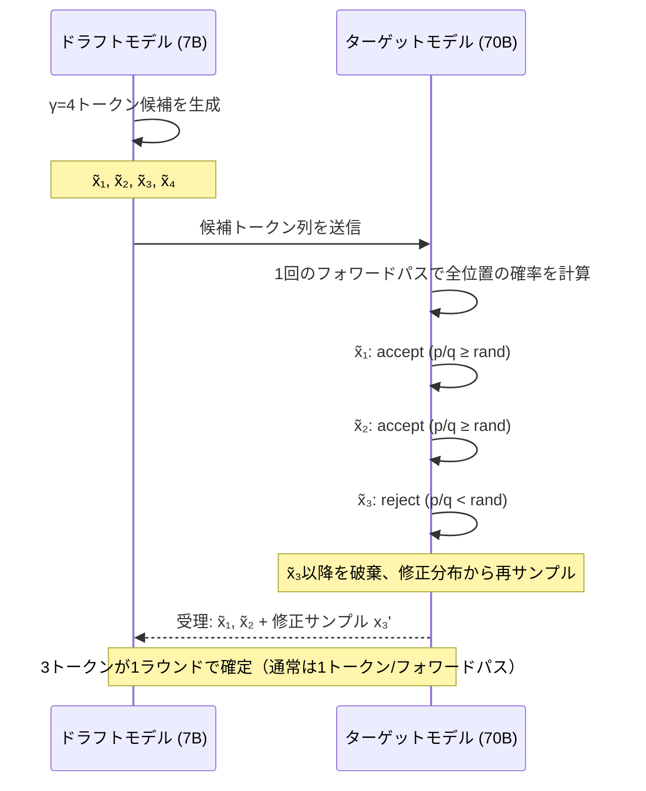

本記事は [arXiv:2302.01318 "Accelerating Large Language Model Decoding with Speculative Sampling"](https://arxiv.org/abs/2302.01318) の解説記事です。

## 論文概要（Abstract）

DeepMindのCharlie Chen, Sebastian Borgeaud, Geoffrey Hintonらによる本論文は、LLMの自己回帰デコードを高速化する**投機的サンプリング（Speculative Sampling）**を提案している。小さなドラフトモデルが複数のトークン候補を並列に生成し、大きなターゲットモデルが1回のフォワードパスでまとめて受理/棄却を判定する。棄却時には確率分布を修正してサンプリングし直すことで、出力分布の数学的等価性が保証される。著者らは、Chinchilla 70Bをターゲットモデルとした実験で2-3倍の実時間短縮を報告している。

この記事は [Zenn記事: LLMストリーミングのUX実装 SSEからAG-UIまで実践ガイド](https://zenn.dev/0h_n0/articles/fc33050cf4ccf4) の深掘りです。

## 情報源

- **arXiv ID**: 2302.01318
- **URL**: [https://arxiv.org/abs/2302.01318](https://arxiv.org/abs/2302.01318)
- **著者**: Charlie Chen, Sebastian Borgeaud, Geoffrey Hinton et al.
- **発表年**: 2023
- **分野**: cs.CL, cs.LG
- **所属**: DeepMind

## 背景と動機（Background & Motivation）

LLMの自己回帰デコードは、1トークンの生成に1回のフォワードパスが必要であり、逐次処理が本質的なボトルネックとなる。Zenn記事で解説したTTFT（Time to First Token）がPrefillフェーズのレイテンシであるのに対し、TPOT（Time Per Output Token）はDecodingフェーズの各トークン生成にかかる時間である。ストリーミングUXにおいてTPOTが大きいと、トークンの到着間隔が長くなり、テキストの流れが途切れ途切れに見える問題が生じる。

投機的サンプリングは、このTPOTを削減する手法である。基本的なアイデアは「小さいモデルで数トークン先まで予測し、大きいモデルで一括検証する」というものであり、予測が当たったトークンは追加コストなしで受理され、ハズレた場合のみ修正される。

## 主要な貢献（Key Contributions）

- **貢献1**: ドラフトモデルの候補トークン列をターゲットモデルが1回のフォワードパスで検証する「修正付き棄却サンプリング」アルゴリズムを提案し、出力分布の等価性を数学的に証明した（定理1, 2）
- **貢献2**: Chinchilla 70B（ターゲット）+ 7B/4B（ドラフト）の組み合わせで、XSum, HumanEval, WMT等のタスクにおいて2-3倍の実時間短縮を実験的に確認した
- **貢献3**: 先読みトークン数$\gamma$の最適値が4-7の範囲にあることを実験的に示し、実装上のガイドラインを提供した

## 技術的詳細（Technical Details）

### 投機的サンプリングのアルゴリズム

投機的サンプリングは以下の3ステップで構成される。

**ステップ1: ドラフト生成**

小さなドラフトモデル$M_q$が、現在のコンテキスト$x_{1:n}$から$\gamma$個のトークン候補を自己回帰的に生成する:

$$
\tilde{x}_{n+1}, \tilde{x}_{n+2}, \ldots, \tilde{x}_{n+\gamma} \sim q(\cdot | x_{1:n}), q(\cdot | x_{1:n}, \tilde{x}_{n+1}), \ldots
$$

ここで$q$はドラフトモデルの確率分布、$\gamma$は先読みトークン数（look-ahead）である。

**ステップ2: 一括検証**

ターゲットモデル$M_p$が、ドラフトトークン列を含む$x_{1:n}, \tilde{x}_{n+1}, \ldots, \tilde{x}_{n+\gamma}$に対して**1回のフォワードパス**を実行し、各位置の確率分布$p(\cdot | x_{1:n+i})$を同時に計算する。

**ステップ3: 受理/棄却判定**

各ドラフトトークン$\tilde{x}_{n+i}$について、以下の受理確率で判定する:

$$
\text{accept} = \min\left(1, \frac{p(\tilde{x}_{n+i} | x_{1:n+i-1})}{q(\tilde{x}_{n+i} | x_{1:n+i-1})}\right)
$$

この判定を$i = 1, 2, \ldots, \gamma$の順に実行し、最初に棄却されたトークン以降はすべて破棄する。

### 修正付き棄却サンプリング

棄却時には、ターゲットモデルの分布から修正サンプルを生成する。修正分布$p'$は以下で定義される:

$$
p'(x) = \text{norm}\left(\max\left(0, p(x) - q(x)\right)\right)
$$

ここで$\text{norm}$は確率分布への正規化を表す。この修正により、受理されたトークン列の分布は厳密にターゲットモデル$M_p$の分布と一致する。著者らは定理1でこの等価性を証明している。



### 期待される高速化

1ラウンドあたりに確定するトークン数の期待値は、受理率$\alpha$に依存する:

$$
\mathbb{E}[\text{tokens per round}] = \frac{1 - \alpha^{\gamma+1}}{1 - \alpha}
$$

ここで$\alpha$はドラフトモデルの平均受理率である。$\alpha$が高いほど（ドラフトモデルの予測精度が高いほど）、1ラウンドで多くのトークンが確定する。

ドラフトモデルのフォワードパスコストを$c$（ターゲットモデルの$c$倍、通常$c \ll 1$）とすると、壁時計時間での高速化は概ね以下で見積もられる:

$$
\text{speedup} \approx \frac{\mathbb{E}[\text{tokens per round}]}{1 + \gamma \cdot c}
$$

## 実装のポイント（Implementation）

投機的サンプリングの実装における注意点を整理する。

**ドラフトモデルの選択**: 同系列の小モデル（例: Llama-3-8B → Llama-3-70B）が高い受理率を得やすい。アーキテクチャが異なるモデル間では受理率が低下する。

**KVキャッシュ管理**: ドラフトモデルとターゲットモデルで別々のKVキャッシュを管理する必要がある。棄却されたトークンに対応するKVキャッシュエントリは削除（rollback）が必要。

```python
from typing import List, Tuple
import torch

def speculative_decode(
    target_model: torch.nn.Module,
    draft_model: torch.nn.Module,
    input_ids: torch.Tensor,
    gamma: int = 5,
    temperature: float = 1.0,
) -> Tuple[torch.Tensor, int]:
    """投機的デコードの1ラウンド実行

    Args:
        target_model: ターゲット（大）モデル
        draft_model: ドラフト（小）モデル
        input_ids: 入力トークン列 (1, seq_len)
        gamma: 先読みトークン数
        temperature: サンプリング温度

    Returns:
        (確定トークン列, 受理数)
    """
    # Step 1: ドラフトモデルでγトークン生成
    draft_tokens: List[int] = []
    draft_probs: List[torch.Tensor] = []
    current = input_ids

    for _ in range(gamma):
        logits = draft_model(current).logits[:, -1, :]
        probs = torch.softmax(logits / temperature, dim=-1)
        token = torch.multinomial(probs, 1)
        draft_tokens.append(token.item())
        draft_probs.append(probs.squeeze(0))
        current = torch.cat([current, token], dim=-1)

    # Step 2: ターゲットモデルで一括検証
    all_ids = torch.cat([
        input_ids,
        torch.tensor([draft_tokens], device=input_ids.device)
    ], dim=-1)
    target_logits = target_model(all_ids).logits
    seq_len = input_ids.shape[1]

    accepted = []
    for i in range(gamma):
        target_prob = torch.softmax(
            target_logits[:, seq_len + i, :] / temperature, dim=-1
        ).squeeze(0)
        draft_prob = draft_probs[i]
        token = draft_tokens[i]

        # Step 3: 受理/棄却判定
        ratio = target_prob[token] / (draft_prob[token] + 1e-10)
        if torch.rand(1).item() < min(1.0, ratio.item()):
            accepted.append(token)
        else:
            # 修正分布からサンプル
            corrected = torch.clamp(target_prob - draft_prob, min=0)
            corrected = corrected / (corrected.sum() + 1e-10)
            bonus = torch.multinomial(corrected, 1).item()
            accepted.append(bonus)
            break

    return torch.tensor(accepted), len(accepted)
```

**バッチサイズとの関係**: 投機的サンプリングの効果はバッチサイズが小さい場合（1-4）に最大化される。大きなバッチでは、ドラフトモデルの計算コストが相対的に増大し、メリットが薄れる。著者らもこの点を認めている。

**先読み数$\gamma$の選択**: 論文のFigure 5によると、$\gamma = 4 \sim 7$が最適範囲である。$\gamma$が大きすぎると後半のトークンの受理率が下がり、無駄な計算が増える。

## 実験結果（Results）

著者らはChinchilla 70Bをターゲットモデル、7Bおよび4Bモデルをドラフトモデルとして評価を行っている。

論文の主要な実験結果:

| タスク | ドラフト | 受理率 α | Wallclock Speedup |
|--------|---------|---------|-------------------|
| XSum（要約） | 7B | 0.72 | **2.5x** |
| HumanEval（コード） | 7B | 0.85 | **3.5x** |
| WMT（翻訳） | 4B | 0.65 | **2.1x** |

著者らが報告した結果から、コード生成タスク（HumanEval）では受理率が高く（$\alpha = 0.85$）、高速化の効果が顕著である。これはコード生成が比較的予測可能なパターン（構文、インデント、変数名の再使用等）を含むためと考えられる。一方、創作的なテキスト生成では受理率が低下し、高速化効果も限定的になる。

出力品質については、修正付き棄却サンプリングにより、ターゲットモデル単独の出力と数学的に同一の分布が保証されるため、品質劣化は発生しない。

## 実運用への応用（Practical Applications）

Zenn記事で解説したストリーミングUXの文脈では、投機的サンプリングはTPOT（Time Per Output Token）の削減に直結する。TTFTが「ストリーミング開始までの待ち時間」であるのに対し、TPOTは「テキストが流れる速度」を決定する。投機的サンプリングにより、ストリーミング中のテキスト到着間隔を短縮できる。

実装の観点では、投機的サンプリングはvLLM、TGI（Text Generation Inference）、llama.cpp等の主要な推論フレームワークに既に組み込まれている。vLLMでは`--speculative-model`フラグで有効化できるため、アプリケーションコードの変更なしに導入可能である。

ただし、バッチサイズが大きい高スループット環境では効果が薄れるため、1対1のチャットボットやコード補完のようなインタラクティブな用途に最も適している。

## Production Deployment Guide

### AWS実装パターン（コスト最適化重視）

投機的サンプリングをAWSで展開する場合、ドラフトモデルとターゲットモデルの同時ロードが必要なため、GPU メモリ要件に注意が必要。

| 規模 | 月間リクエスト | 推奨構成 | 月額コスト | 主要サービス |
|------|--------------|---------|-----------|------------|
| **Small** | ~3,000 (100/日) | Serverless | $80-200 | Lambda + Bedrock（投機的デコード不要） |
| **Medium** | ~30,000 (1,000/日) | Hybrid | $500-1,500 | ECS Fargate + vLLM (speculative) |
| **Large** | 300,000+ (10,000/日) | Container | $3,000-8,000 | EKS + vLLM + dual GPU per pod |

**Medium構成の詳細** (月額$500-1,500):
- **ECS Fargate**: 4 vCPU, 30GB RAM ($200/月) — vLLMサーバー
- **EC2 g5.xlarge (Spot)**: ターゲット+ドラフトモデル同居 ($300/月)
- **S3**: モデル重みストレージ ($20/月)
- **ALB**: Application Load Balancer ($20/月)

**コスト試算の注意事項**: 上記は2026年4月時点のAWS ap-northeast-1（東京）リージョン料金に基づく概算値です。Spot Instancesの価格は需給により変動します。

### Terraformインフラコード

```hcl
resource "aws_ecs_task_definition" "vllm_speculative" {
  family                   = "vllm-speculative"
  requires_compatibilities = ["EC2"]
  network_mode             = "awsvpc"

  container_definitions = jsonencode([{
    name      = "vllm-server"
    image     = "vllm/vllm-openai:latest"
    essential = true

    command = [
      "--model", "meta-llama/Llama-3.1-70B-Instruct",
      "--speculative-model", "meta-llama/Llama-3.1-8B-Instruct",
      "--num-speculative-tokens", "5",
      "--gpu-memory-utilization", "0.90",
      "--max-model-len", "4096"
    ]

    resourceRequirements = [
      { type = "GPU", value = "1" }
    ]

    portMappings = [{
      containerPort = 8000
      protocol      = "tcp"
    }]

    logConfiguration = {
      logDriver = "awslogs"
      options = {
        "awslogs-group"  = "/ecs/vllm-speculative"
        "awslogs-region" = "ap-northeast-1"
      }
    }
  }])
}

resource "aws_cloudwatch_metric_alarm" "tpot_p99" {
  alarm_name          = "vllm-tpot-p99-high"
  comparison_operator = "GreaterThanThreshold"
  evaluation_periods  = 2
  metric_name         = "TPOT_P99"
  namespace           = "VLLMSpeculative"
  period              = 300
  statistic           = "Maximum"
  threshold           = 50
  alarm_description   = "TPOT P99が50msを超過"
}
```

### 運用・監視設定

```sql
-- vLLM投機的デコードの受理率監視
fields @timestamp, acceptance_rate, num_speculative_tokens, speedup_ratio
| stats avg(acceptance_rate) as avg_alpha,
        pct(speedup_ratio, 50) as median_speedup
  by bin(5m)

-- バッチサイズ別の効果分析
fields @timestamp, batch_size, speedup_ratio
| stats avg(speedup_ratio) as avg_speedup by batch_size
| sort batch_size asc
```

### コスト最適化チェックリスト

**アーキテクチャ選択**:
- [ ] ~100 req/日 → Bedrock直接利用（投機的デコード不要） - $80-200/月
- [ ] ~1000 req/日 → ECS + vLLM speculative - $500-1,500/月
- [ ] 10000+ req/日 → EKS + vLLM + dual GPU pods - $3,000-8,000/月

**リソース最適化**:
- [ ] ドラフトモデル選択: ターゲットと同系列で最小サイズ
- [ ] GPU メモリ: ターゲット+ドラフト合計が90%以内
- [ ] Spot Instances: g5.xlarge優先（最大90%削減）
- [ ] γ（先読みトークン数）: 5をデフォルト、タスク別チューニング
- [ ] バッチサイズ: 1-4で最大効果

**LLMコスト削減**:
- [ ] コード補完タスク: 受理率高、投機的デコードの効果大
- [ ] チャットタスク: 受理率中、効果はモデルペアに依存
- [ ] 要約タスク: 受理率中〜高、安定した効果
- [ ] 創作タスク: 受理率低、効果限定的

**監視・アラート**:
- [ ] 受理率（α）の継続監視（0.7以下で警告）
- [ ] TPOT P99の監視
- [ ] GPU メモリ使用率（ドラフト+ターゲット合計）
- [ ] バッチサイズ分布の可視化

**リソース管理**:
- [ ] ドラフトモデルの定期更新（ターゲット更新に追従）
- [ ] タスク別の投機的デコード有効/無効切替
- [ ] GPU メモリ不足時のフォールバック（ドラフトモデル無効化）
- [ ] Spot中断対策: On-Demandへの自動フォールバック

## 関連研究（Related Work）

- **Speculative Decoding (Chen et al., 2022, arXiv:2211.17192)**: Google Researchによる独立した同時期の研究。同様のドラフトモデル検証方式を提案しているが、数学的証明のアプローチが異なる
- **Medusa (arXiv:2401.02038)**: 追加のデコーディングヘッドを使った投機的デコード。別モデルを用意せず単一モデルのヘッド追加で実現可能
- **EAGLE-2 (arXiv:2406.16858)**: 動的ドラフトツリーを使った最新の投機的デコード。受理率の向上と適応的な先読み数の調整を実現

## まとめと今後の展望

投機的サンプリングは、LLMのデコード速度を出力品質の劣化なしに2-3倍高速化する手法であり、ストリーミングUXにおけるTPOT改善に直結する。vLLM等の主要フレームワークに既に実装されており、設定変更のみで導入可能な点が実用上の大きな利点である。

今後の課題として、(1) 大バッチ環境での効果改善、(2) ドラフトモデルの自動選択、(3) マルチターン会話でのKVキャッシュ効率化が挙げられる。Medusa、EAGLE-2等の後続研究がこれらの課題に取り組んでおり、投機的デコード分野は活発に発展している。

## 参考文献

- **arXiv**: [https://arxiv.org/abs/2302.01318](https://arxiv.org/abs/2302.01318)
- **Related**: Medusa (arXiv:2401.02038), EAGLE-2 (arXiv:2406.16858)
- **Implementation**: vLLM (`--speculative-model` flag), TGI, llama.cpp
- **Related Zenn article**: [https://zenn.dev/0h_n0/articles/fc33050cf4ccf4](https://zenn.dev/0h_n0/articles/fc33050cf4ccf4)
