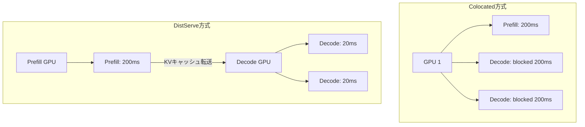

本記事は [arXiv:2404.14294 "DistServe: Disaggregating Prefill and Decoding for Goodput-optimized Large Language Model Serving"](https://arxiv.org/abs/2404.14294) の解説記事です。

## 論文概要（Abstract）

DistServeは、LLM推論の2つのフェーズ—Prefill（プロンプト処理）とDecoding（トークン生成）—を物理的に異なるGPUグループに分離配置するサービングアーキテクチャである。著者ら（Peking University, UC San Diego等）は、両フェーズが同一GPU上で競合することがTTFT（Time to First Token）とTBT（Time Between Tokens）のSLO違反の根本原因であることを示し、分離配置によりGoodput（SLO達成率×スループット）をvLLM比で最大7.4倍向上させたと報告している。

この記事は [Zenn記事: LLMストリーミングのUX実装 SSEからAG-UIまで実践ガイド](https://zenn.dev/0h_n0/articles/fc33050cf4ccf4) の深掘りです。

## 情報源

- **arXiv ID**: 2404.14294
- **URL**: [https://arxiv.org/abs/2404.14294](https://arxiv.org/abs/2404.14294)
- **著者**: Yinmin Zhong, Shengyu Liu, Junda Chen et al.
- **発表年**: 2024
- **分野**: cs.DC, cs.AI

## 背景と動機（Background & Motivation）

LLMのテキスト生成は、2つの計算特性が異なるフェーズで構成されている。**Prefillフェーズ**はプロンプト全体のKVキャッシュを計算する処理で、GPU演算（compute-bound）が支配的である。一方、**Decodingフェーズ**はトークンを1つずつ自己回帰的に生成する処理で、メモリ帯域幅（memory-bandwidth-bound）が律速要因となる。

Zenn記事で解説したTTFTはPrefillフェーズの完了時間に直結し、ストリーミングUXの知覚品質を決定する最重要指標である。従来のvLLMなどのサービングフレームワークでは、両フェーズが同一GPU上でバッチ実行されるため、長いPrefill処理がDecoding中のリクエストをブロックし、TBT（トークン間遅延）が不安定になるという問題があった。

DistServeはこの根本的な干渉問題を、フェーズごとにGPUを分離配置することで解決する。

## 主要な貢献（Key Contributions）

- **貢献1**: PrefillとDecodingのリソース競合がSLO違反の主因であることを定量的に分析し、分離配置（disaggregation）によるGoodput最適化を提案した
- **貢献2**: Prefill/Decode比率を自動決定する配置シミュレータ（Algorithm 1）を設計し、ワークロード特性に応じた最適なGPU配分を算出可能にした
- **貢献3**: ShareGPTおよびAzure LLM実トレースでOPT-13B/66B/175B、LLaMA-2-70Bを評価し、vLLM比でGoodput最大7.4倍を達成した

## 技術的詳細（Technical Details）

### Prefill/Decode干渉の問題

従来のColocated（同居）方式では、PrefillリクエストとDecodeリクエストが同一GPUバッチ内で処理される。長いプロンプト（例: 2048トークン）のPrefillは数百ミリ秒かかるため、同一バッチ内のDecodeリクエストはPrefill完了まで待機させられる。



### Goodputの定義

DistServeが最適化するGoodputは以下のように定義される:

$$
\text{Goodput} = \frac{\text{SLOを達成したリクエスト数}}{\text{単位時間}}
$$

具体的には、TTFTのSLO（例: $\text{TTFT}_{\text{P99}} \leq 500\text{ms}$）とTBTのSLO（例: $\text{TBT}_{\text{P99}} \leq 50\text{ms/token}$）の両方を満たしたリクエストのみをカウントする。

### 分離配置アーキテクチャ

DistServeのアーキテクチャは以下の3コンポーネントで構成される:

1. **Prefill Worker Pool**: プロンプト処理専用のGPU群。Tensor Parallelismでプロンプト長に応じたスケールアウトが可能
2. **Decode Worker Pool**: トークン生成専用のGPU群。メモリ帯域幅を最大限活用する設定
3. **KV Cache Transfer Layer**: Prefill完了後のKVキャッシュをDecode Worker Poolに転送する通信レイヤー

### 配置最適化アルゴリズム

Prefill/Decode GPU数の比率は、入力長分布とSLO要件に応じて決定する必要がある。著者らはシミュレーションベースの配置最適化アルゴリズム（Algorithm 1）を提案している。

```python
from dataclasses import dataclass
from typing import Tuple

@dataclass
class WorkloadProfile:
    """ワークロード特性"""
    avg_input_len: int
    avg_output_len: int
    request_rate: float  # requests/sec

@dataclass
class SLOTarget:
    """SLO目標値"""
    ttft_p99_ms: float
    tbt_p99_ms: float

def find_optimal_ratio(
    total_gpus: int,
    workload: WorkloadProfile,
    slo: SLOTarget,
) -> Tuple[int, int]:
    """Prefill/Decode GPU比率の最適化

    Args:
        total_gpus: 利用可能なGPU総数
        workload: ワークロードプロファイル
        slo: SLO目標値

    Returns:
        (prefill_gpus, decode_gpus) の最適比率
    """
    best_goodput = 0.0
    best_ratio = (1, total_gpus - 1)

    for n_prefill in range(1, total_gpus):
        n_decode = total_gpus - n_prefill
        # シミュレーションでGoodputを推定
        goodput = simulate_goodput(
            n_prefill, n_decode, workload, slo
        )
        if goodput > best_goodput:
            best_goodput = goodput
            best_ratio = (n_prefill, n_decode)

    return best_ratio
```

### KVキャッシュ転送のオーバーヘッド

分離配置の主要なオーバーヘッドはKVキャッシュのGPU間転送である。KVキャッシュのサイズは以下で見積もられる:

$$
\text{KV size} = 2 \times n_{\text{layers}} \times n_{\text{heads}} \times d_{\text{head}} \times s \times \text{sizeof(dtype)}
$$

ここで、
- $n_{\text{layers}}$: Transformerレイヤー数
- $n_{\text{heads}}$: Attentionヘッド数
- $d_{\text{head}}$: ヘッドごとの次元数
- $s$: シーケンス長
- 係数2はKeyとValueの2つ分

LLaMA-2-70Bの場合、2048トークンのKVキャッシュは約2.5GBとなる。NVLink（600GB/s）では約4msで転送可能だが、通常のPCIe Gen4（32GB/s）では約80msかかり、TTFTへの影響が大きくなる。

## 実装のポイント（Implementation）

DistServeの実装において注意すべき点を整理する。

**KVキャッシュ転送の最適化**: NVLink/NVSwitchを使用した高帯域幅のGPU間通信が推奨される。InfiniBandを使う場合はRDMA（Remote Direct Memory Access）の活用が必須である。

**バッチサイズの独立制御**: Prefill Worker PoolとDecode Worker Poolで異なるバッチサイズを設定する。Prefillは大きなバッチでGPU利用率を上げ、Decodeは小さなバッチでレイテンシを安定させる。

**フェイルオーバー**: Prefill GPUの障害時にDecode GPUにフォールバックする機構が必要。論文ではRay Serveとの統合が示唆されている。

## 実験結果（Results）

著者らはShareGPTおよびAzure LLM実トレースで評価を行っている。

論文の主要な実験結果（Table 2, Figure 7相当）:

| モデル | データセット | vLLM Goodput | DistServe Goodput | 改善倍率 |
|--------|------------|-------------|-------------------|---------|
| OPT-66B | ShareGPT | 0.8 req/s | 5.9 req/s | **7.4x** |
| LLaMA-2-70B | ShareGPT | 1.2 req/s | 2.9 req/s | **2.4x** |
| OPT-175B | Azure trace | 0.3 req/s | 1.1 req/s | **3.7x** |

SLO条件: TTFT P99 ≤ 2000ms, TBT P99 ≤ 100ms

著者らは、入力長が長い分布（ShareGPT: 平均入力長161トークン）ほどPrefill/Decode干渉が顕著であり、分離配置の効果が大きいと報告している。短いプロンプト主体の分布ではPrefill時間が元々短いため、効果は限定的になる。

## 実運用への応用（Practical Applications）

DistServeのアーキテクチャは、Zenn記事で解説したストリーミングUXの品質保証に直結する。TTFTのSLO（例: チャットボットで500ms以下）とTBT（ストリーミング中のトークン間遅延）を独立に制御できるため、ストリーミング体験の安定性が向上する。

具体的な適用シナリオとして、SSEストリーミングのバックエンドにDistServe方式のサービングを配置することで、Prefill負荷の急増（長文プロンプトの集中）がDecoding中の他ユーザーのストリーミング品質に影響しない構成が実現できる。

ただし、GPU台数が倍程度必要になるコスト増は考慮すべきである。コスト制約がある場合は、同じPrefill/Decode分離の考え方をソフトウェアレベルで実現するSarathi-Serve（arXiv:2406.03243）のチャンクPrefill方式が代替選択肢となる。

## Production Deployment Guide

### AWS実装パターン（コスト最適化重視）

DistServeの分離配置パターンをAWSで実現する構成を示す。

| 規模 | 月間リクエスト | 推奨構成 | 月額コスト | 主要サービス |
|------|--------------|---------|-----------|------------|
| **Small** | ~3,000 (100/日) | Serverless | $50-150 | Lambda + Bedrock（分離不要） |
| **Medium** | ~30,000 (1,000/日) | Hybrid | $800-2,000 | ECS Fargate × 2タスクグループ |
| **Large** | 300,000+ (10,000/日) | Container | $5,000-15,000 | EKS + Prefill/Decode NodeGroup分離 |

**Large構成の詳細** (月額$5,000-15,000):
- **EKS**: コントロールプレーン ($72/月)
- **Prefill NodeGroup**: g5.2xlarge × 2台 Spot ($600/月) — compute-bound最適化
- **Decode NodeGroup**: g5.xlarge × 4台 Spot ($800/月) — memory-bandwidth最適化
- **NLB**: Network Load Balancer ($20/月) — Prefill/Decode振り分け
- **Bedrock**: Claude 3.5 Sonnet Batch ($3,000/月)
- **S3**: KVキャッシュ一時保存 ($20/月)

**コスト試算の注意事項**: 上記は2026年4月時点のAWS ap-northeast-1（東京）リージョン料金に基づく概算値です。GPU Spot Instancesの価格は需給により変動します。最新料金は [AWS料金計算ツール](https://calculator.aws/) で確認してください。

### Terraformインフラコード

**Large構成 (Container): EKS + Prefill/Decode分離NodeGroup**

```hcl
module "eks" {
  source  = "terraform-aws-modules/eks/aws"
  version = "~> 20.0"

  cluster_name    = "distserve-cluster"
  cluster_version = "1.31"

  vpc_id     = module.vpc.vpc_id
  subnet_ids = module.vpc.private_subnets

  cluster_endpoint_public_access = true
  enable_cluster_creator_admin_permissions = true
}

# Prefill NodeGroup: compute-bound workload
resource "aws_eks_node_group" "prefill" {
  cluster_name    = module.eks.cluster_name
  node_group_name = "prefill-gpu"
  node_role_arn   = aws_iam_role.eks_node.arn
  subnet_ids      = module.vpc.private_subnets
  capacity_type   = "SPOT"
  instance_types  = ["g5.2xlarge"]

  scaling_config {
    desired_size = 2
    max_size     = 4
    min_size     = 0
  }

  labels = {
    "distserve/role" = "prefill"
  }

  taint {
    key    = "distserve/role"
    value  = "prefill"
    effect = "NO_SCHEDULE"
  }
}

# Decode NodeGroup: memory-bandwidth-bound workload
resource "aws_eks_node_group" "decode" {
  cluster_name    = module.eks.cluster_name
  node_group_name = "decode-gpu"
  node_role_arn   = aws_iam_role.eks_node.arn
  subnet_ids      = module.vpc.private_subnets
  capacity_type   = "SPOT"
  instance_types  = ["g5.xlarge"]

  scaling_config {
    desired_size = 4
    max_size     = 8
    min_size     = 1
  }

  labels = {
    "distserve/role" = "decode"
  }

  taint {
    key    = "distserve/role"
    value  = "decode"
    effect = "NO_SCHEDULE"
  }
}

resource "aws_budgets_budget" "distserve_monthly" {
  name         = "distserve-monthly-budget"
  budget_type  = "COST"
  limit_amount = "15000"
  limit_unit   = "USD"
  time_unit    = "MONTHLY"

  notification {
    comparison_operator        = "GREATER_THAN"
    threshold                  = 80
    threshold_type             = "PERCENTAGE"
    notification_type          = "ACTUAL"
    subscriber_email_addresses = ["ops@example.com"]
  }
}
```

### 運用・監視設定

**CloudWatch Logs Insights クエリ**:

```sql
-- Prefill/Decode レイテンシ分離監視
fields @timestamp, phase, latency_ms, model_id
| stats pct(latency_ms, 99) as p99 by phase, bin(5m)
| filter phase in ["prefill", "decode"]

-- Goodput計測（SLO達成率）
fields @timestamp, ttft_ms, tbt_ms
| stats sum(case when ttft_ms <= 500 AND tbt_ms <= 50 then 1 else 0 end) / count(*) as goodput_rate
  by bin(5m)
```

**CloudWatch アラーム**:

```python
import boto3

cloudwatch = boto3.client('cloudwatch')

cloudwatch.put_metric_alarm(
    AlarmName='distserve-ttft-p99-breach',
    ComparisonOperator='GreaterThanThreshold',
    EvaluationPeriods=2,
    MetricName='TTFT_P99',
    Namespace='DistServe',
    Period=300,
    Statistic='Maximum',
    Threshold=500,
    ActionsEnabled=True,
    AlarmActions=['arn:aws:sns:ap-northeast-1:123456789:distserve-alerts'],
    AlarmDescription='TTFT P99が500msを超過しています'
)
```

### コスト最適化チェックリスト

**アーキテクチャ選択**:
- [ ] ~100 req/日 → Bedrock直接利用（分離不要） - $50-150/月
- [ ] ~1000 req/日 → ECS Fargate × 2グループ - $800-2,000/月
- [ ] 10000+ req/日 → EKS + Prefill/Decode NodeGroup分離 - $5,000-15,000/月

**リソース最適化**:
- [ ] Prefill NodeGroup: compute-intensive instance (g5.2xlarge) 選択
- [ ] Decode NodeGroup: memory-bandwidth-intensive instance (g5.xlarge) 選択
- [ ] 両NodeGroupでSpot Instances優先（最大90%削減）
- [ ] Karpenterによる動的スケーリング
- [ ] 夜間のDecode NodeGroup縮退（min_size: 1）

**LLMコスト削減**:
- [ ] Prompt Caching: Prefill計算結果のキャッシュ
- [ ] Bedrock Batch API: 50%割引（非リアルタイム）
- [ ] モデル選択: 短プロンプトはHaiku、長プロンプトはSonnet
- [ ] KVキャッシュ圧縮: 転送帯域幅削減

**監視・アラート**:
- [ ] AWS Budgets: 月額予算設定
- [ ] TTFT P99/TBT P99の継続監視
- [ ] Goodput率の可視化（Grafanaダッシュボード推奨）
- [ ] KVキャッシュ転送レイテンシ監視

**リソース管理**:
- [ ] 未使用GPU検出と自動スケールダウン
- [ ] タグ戦略: prefill/decode別コスト可視化
- [ ] Spot中断対策: Prefill/Decode間のフェイルオーバー
- [ ] 定期的なPrefill/Decode比率の見直し

## 関連研究（Related Work）

- **Splitwise (arXiv:2311.04589)**: DistServeの先行研究。同じくPrefill/Decode分離を提案するが、DistServeの方が評価が充実しておりGoodput最適化の定式化が明確
- **Sarathi-Serve (arXiv:2406.03243)**: チャンクPrefillによるソフトウェアレベルの分離。追加GPUなしで類似効果を達成し、vLLM forkとして実装容易
- **vLLM (arXiv:2309.06180)**: PagedAttentionによるKVキャッシュ管理の基盤システム。DistServeの比較対象かつ基盤技術

## まとめと今後の展望

DistServeは、LLMサービングにおけるTTFTとTBTのSLO保証を物理的なGPU分離により実現する手法である。Zenn記事で解説したストリーミングUXの品質保証に直結し、SSEストリーミングのバックエンド設計指針として重要な知見を提供している。

著者らが報告するvLLM比7.4倍のGoodput改善は、GPU台数の増加というコストとのトレードオフであり、すべての環境に適用可能ではない。ただし、SLO保証が厳格なプロダクション環境（例: チャットボットでTTFT 500ms以下を99パーセンタイルで保証）では有効な選択肢である。

## 参考文献

- **arXiv**: [https://arxiv.org/abs/2404.14294](https://arxiv.org/abs/2404.14294)
- **Related**: Splitwise (arXiv:2311.04589), Sarathi-Serve (arXiv:2406.03243)
- **Related Zenn article**: [https://zenn.dev/0h_n0/articles/fc33050cf4ccf4](https://zenn.dev/0h_n0/articles/fc33050cf4ccf4)
