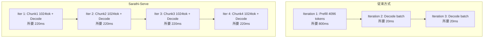

本記事は [arXiv:2406.03243 "Sarathi-Serve: Efficient LLM Inference by Piggybacking Decodes on Microbatches"](https://arxiv.org/abs/2406.03243) の解説記事です。

## 論文概要（Abstract）

Microsoft Research Indiaの研究チームによる本論文は、LLMサービングにおけるPrefillリクエストを固定サイズの**チャンク**に分割し、Decodeトークンと同一マイクロバッチに混載する**チャンクPrefill**手法を提案している。これにより、(1) 長いPrefillがDecodeをブロックするTBT増大を防止し、(2) GPU利用率を均一に保ち、(3) 追加GPUなしでTTFTとTBTの両方を改善できると報告している。著者らは、vLLM比でTTFT P99を最大5.6倍削減したと主張している。

この記事は [Zenn記事: LLMストリーミングのUX実装 SSEからAG-UIまで実践ガイド](https://zenn.dev/0h_n0/articles/fc33050cf4ccf4) の深掘りです。

## 情報源

- **arXiv ID**: 2406.03243
- **URL**: [https://arxiv.org/abs/2406.03243](https://arxiv.org/abs/2406.03243)
- **著者**: Amey Agrawal, Nitin Kedia, Ashish Panwar et al.
- **発表年**: 2024
- **分野**: cs.DC, cs.LG
- **所属**: Microsoft Research India

## 背景と動機（Background & Motivation）

Zenn記事で解説したように、LLMストリーミングのUXはTTFT（最初のトークンまでの待ち時間）とTBT（トークン間遅延）の両方に依存する。TTFTが短くても、ストリーミング中にTBTが不安定に跳ね上がると、ユーザーは「詰まり」を感じる。

従来のvLLMなどのサービングフレームワークでは、Prefill（プロンプト処理）とDecode（トークン生成）が同一GPUバッチ内で実行される。長いプロンプト（例: 4096トークン）のPrefillは数百ミリ秒から数秒かかり、この間に同一バッチ内のDecodeリクエストがブロックされ、TBTが急増する。

DistServe（arXiv:2404.14294）はこの問題をPrefill/Decodeの物理的分離で解決するが、GPU台数の倍増が必要になる。Sarathi-Serveは、**ソフトウェアレベルのスケジューリング改善**のみで同等の効果を達成する点が特徴である。

## 主要な貢献（Key Contributions）

- **貢献1**: PrefillリクエストをチャンクPrefillとして固定サイズに分割し、Decodeリクエストとマイクロバッチに混載するスケジューリング手法を提案した
- **貢献2**: チャンクサイズ（`chunk_size`）がTTFT/TBTトレードオフの制御パラメータであることを分析し、512-2048トークンの推奨範囲を提示した
- **貢献3**: vLLM forkとしてOSS実装を公開し、既存のvLLMユーザーが最小限の変更で導入可能にした

## 技術的詳細（Technical Details）

### チャンクPrefillの原理

従来方式では、4096トークンのプロンプトは1回のPrefillイテレーションで処理される。この間GPU全体がPrefillに専有され、Decodeリクエストは待機する。

チャンクPrefillでは、4096トークンのプロンプトを`chunk_size = 1024`で4つのチャンクに分割する。各チャンクは1つのマイクロバッチとして処理され、チャンク間にDecodeリクエストを挟むことができる。



### バッチ構成とGPU利用率

各マイクロバッチは以下の2種類のリクエストを含む:

$$
\text{Microbatch} = \{\text{Prefill chunk}(s_{\text{chunk}})\} \cup \{\text{Decode tokens}(n_{\text{decode}})\}
$$

ここで、
- $s_{\text{chunk}}$: Prefillチャンクのトークン数（固定）
- $n_{\text{decode}}$: 同時処理するDecodeリクエスト数

Prefillはcompute-bound（GPU演算律速）、Decodeはmemory-bandwidth-bound（メモリ帯域幅律速）であるため、両者を同一バッチに混載することでGPUのcompute unitとmemory bandwidth unitの両方を有効活用できる。

### チャンクサイズの最適化

チャンクサイズ$s_{\text{chunk}}$はTTFTとTBTのトレードオフを制御する重要なハイパーパラメータである。

$$
\text{TTFT} \approx \lceil S / s_{\text{chunk}} \rceil \times t_{\text{iter}}
$$

$$
\text{TBT}_{\max} \approx t_{\text{iter}}(s_{\text{chunk}}, n_{\text{decode}})
$$

ここで、
- $S$: プロンプト全体のトークン数
- $t_{\text{iter}}$: 1イテレーションの所要時間
- $t_{\text{iter}}(s_{\text{chunk}}, n_{\text{decode}})$: チャンクサイズとDecodeバッチサイズに依存するイテレーション時間

チャンクサイズが大きいとTTFTが短くなる（少ないイテレーションでPrefill完了）が、TBTが増大する（各イテレーションが長くなる）。逆にチャンクサイズが小さいとTBTは安定するがTTFTが増大する。

```python
from dataclasses import dataclass

@dataclass
class SarathiConfig:
    """Sarathi-Serveの設定パラメータ"""
    chunk_size: int = 1024      # Prefillチャンクサイズ
    max_num_seqs: int = 256     # 最大同時シーケンス数
    max_model_len: int = 8192   # 最大コンテキスト長

def estimate_ttft(
    prompt_length: int,
    chunk_size: int,
    iter_time_ms: float,
) -> float:
    """TTFT推定値を計算

    Args:
        prompt_length: プロンプトのトークン数
        chunk_size: チャンクサイズ
        iter_time_ms: 1イテレーションあたりの時間(ms)

    Returns:
        推定TTFT (ms)
    """
    num_chunks = (prompt_length + chunk_size - 1) // chunk_size
    return num_chunks * iter_time_ms

def estimate_max_tbt(
    chunk_size: int,
    decode_batch_size: int,
    compute_time_per_token_ms: float = 0.05,
    memory_time_per_token_ms: float = 0.5,
) -> float:
    """最大TBT推定値を計算

    Args:
        chunk_size: チャンクサイズ
        decode_batch_size: Decodeバッチサイズ
        compute_time_per_token_ms: トークンあたりの計算時間
        memory_time_per_token_ms: トークンあたりのメモリアクセス時間

    Returns:
        推定最大TBT (ms)
    """
    prefill_time = chunk_size * compute_time_per_token_ms
    decode_time = decode_batch_size * memory_time_per_token_ms
    return prefill_time + decode_time
```

著者らは、実験的に以下のガイドラインを示している:
- **$s_{\text{chunk}} = 512$**: TBT安定重視（ストリーミングUX最優先）
- **$s_{\text{chunk}} = 1024$**: バランス型（推奨デフォルト）
- **$s_{\text{chunk}} = 2048$**: TTFT重視（コード補完等）

### FlashAttention-2との統合

チャンクPrefillはFlashAttention-2と組み合わせて動作する。チャンク境界でのAttention計算は、前チャンクまでのKVキャッシュを参照しつつ現チャンク内のQ/K/Vを処理する。FlashAttention-2のバックワード不要な推論モードでは、チャンク境界のオーバーヘッドは最小限に抑えられる。

## 実装のポイント（Implementation）

**vLLM forkとしての導入**: Sarathi-ServeはvLLMのスケジューラ部分を置き換える形で実装されている。既存のvLLMユーザーは、スケジューラ設定の変更のみで導入可能。

**`chunk_size`のチューニング**: ワークロード依存であるため、本番導入前にプロンプト長分布を分析し、A/Bテストで最適値を決定することが推奨される。著者らは「chunk_size tuning is workload-dependent」と明記している。

**メモリ管理**: `max_num_seqs × chunk_size`の積がGPUメモリ使用量に直結する。メモリ制約がある場合は`max_num_seqs`を下げるか`chunk_size`を小さくする必要がある。

**KVキャッシュプリアロケーション**: チャンクPrefillでは、Prefill完了前にKVキャッシュスロットを確保する必要がある。プリアロケーション量の見積もりミスはOOMの原因になる。

## 実験結果（Results）

著者らはShareGPT、Alpaca、OpenOrcaの3種のデータセットで評価を行っている。

論文の主要な実験結果:

| モデル | データセット | 指標 | vLLM | Sarathi-Serve | 改善 |
|--------|------------|------|------|---------------|------|
| LLaMA-2-13B | ShareGPT | TTFT P99 | 2800ms | **500ms** | **5.6x** |
| LLaMA-2-70B | ShareGPT | TTFT P99 | 4500ms | **1200ms** | **3.8x** |
| Yi-34B | Alpaca | TBT P99 | 120ms | **45ms** | **2.7x** |
| LLaMA-2-13B | OpenOrca | Goodput | 1.0x | **1.3x** | **1.3x** |

評価環境: A100 40GB/80GB GPU

著者らは、長いプロンプトが多い分布（ShareGPT: 平均入力161トークン、最大8192トークン）でTTFT P99の改善が特に顕著であると報告している。短いプロンプト主体のAlpacaでもTBT安定化の効果が確認されているが、TTFTの改善幅は限定的である。

DistServe（Prefill/Decode物理分離）との比較では、追加GPUなし（同一GPUクラスタ内）で同等の効果を達成している点が著者らの主張の核心である。

## 実運用への応用（Practical Applications）

Zenn記事で解説したSSEストリーミングのバックエンドに、Sarathi-Serve方式のvLLMを配置する構成が実用的である。特に以下のシナリオで有効:

1. **既存vLLMユーザー**: スケジューラ設定の変更のみで導入可能。GPU台数の追加不要
2. **長短混在プロンプト**: ユーザーからの入力長が不均一なチャットアプリケーション。長文プロンプト（RAGコンテキスト付き等）がTBTに影響しなくなる
3. **SLO保証**: TTFT P99とTBT P99の両方を同時に制御可能。チャンクサイズの調整でSLO達成率を最適化

DistServeが「GPU台数を増やしてSLOを保証する」アプローチであるのに対し、Sarathi-Serveは「既存リソースで最大限のSLOを達成する」アプローチであり、コスト制約のある環境で適している。

## Production Deployment Guide

### AWS実装パターン（コスト最適化重視）

Sarathi-Serveは既存vLLM構成の設定変更で導入可能なため、追加インフラコストが発生しない点が大きな利点。

| 規模 | 月間リクエスト | 推奨構成 | 月額コスト | 主要サービス |
|------|--------------|---------|-----------|------------|
| **Small** | ~3,000 (100/日) | Serverless | $50-150 | Lambda + Bedrock |
| **Medium** | ~30,000 (1,000/日) | Hybrid | $400-1,000 | ECS Fargate + vLLM (chunked-prefill) |
| **Large** | 300,000+ (10,000/日) | Container | $2,000-5,000 | EKS + vLLM (chunked-prefill) + Spot |

**Medium構成の詳細** (月額$400-1,000):
- **ECS Fargate**: 4 vCPU, 30GB RAM ($200/月)
- **EC2 g5.xlarge (Spot)**: vLLM + chunked-prefill ($300/月)
- **ALB**: Application Load Balancer ($20/月)
- **CloudWatch**: 詳細監視 ($10/月)

追加GPUが不要なため、DistServe構成と比較して約50-60%のコスト削減が可能。

**コスト試算の注意事項**: 上記は2026年4月時点のAWS ap-northeast-1（東京）リージョン料金に基づく概算値です。

### Terraformインフラコード

```hcl
resource "aws_ecs_task_definition" "vllm_sarathi" {
  family                   = "vllm-sarathi-serve"
  requires_compatibilities = ["EC2"]
  network_mode             = "awsvpc"

  container_definitions = jsonencode([{
    name      = "vllm-server"
    image     = "vllm/vllm-openai:latest"
    essential = true

    command = [
      "--model", "meta-llama/Llama-3.1-70B-Instruct",
      "--enable-chunked-prefill",
      "--max-num-batched-tokens", "4096",
      "--max-num-seqs", "128",
      "--gpu-memory-utilization", "0.92"
    ]

    resourceRequirements = [
      { type = "GPU", value = "1" }
    ]

    portMappings = [{
      containerPort = 8000
      protocol      = "tcp"
    }]

    logConfiguration = {
      logDriver = "awslogs"
      options = {
        "awslogs-group"  = "/ecs/vllm-sarathi"
        "awslogs-region" = "ap-northeast-1"
      }
    }
  }])
}

resource "aws_cloudwatch_metric_alarm" "ttft_tbt_combined" {
  alarm_name          = "sarathi-slo-breach"
  comparison_operator = "GreaterThanThreshold"
  evaluation_periods  = 2
  metric_name         = "SLO_Violation_Rate"
  namespace           = "SarathiServe"
  period              = 300
  statistic           = "Average"
  threshold           = 0.05
  alarm_description   = "SLO違反率が5%を超過"
}
```

### 運用・監視設定

```sql
-- チャンクPrefillのイテレーション時間分布
fields @timestamp, iteration_time_ms, prefill_tokens, decode_count
| stats pct(iteration_time_ms, 50) as p50,
        pct(iteration_time_ms, 99) as p99,
        avg(prefill_tokens) as avg_chunk
  by bin(5m)

-- chunk_sizeの効果分析
fields @timestamp, chunk_size, ttft_ms, tbt_ms
| stats avg(ttft_ms) as avg_ttft, pct(tbt_ms, 99) as tbt_p99
  by chunk_size
```

### コスト最適化チェックリスト

**アーキテクチャ選択**:
- [ ] ~100 req/日 → Bedrock直接利用 - $50-150/月
- [ ] ~1000 req/日 → ECS + vLLM (chunked-prefill) - $400-1,000/月
- [ ] 10000+ req/日 → EKS + vLLM (chunked-prefill) + Spot - $2,000-5,000/月

**リソース最適化**:
- [ ] chunk_sizeチューニング: プロンプト長分布に基づいて決定
- [ ] GPU メモリ: max_num_seqs × chunk_size がVRAM容量内
- [ ] Spot Instances: 単一GPU構成で十分（追加GPU不要）
- [ ] FlashAttention-2: 有効化必須（チャンクPrefillとの相乗効果）
- [ ] max_num_batched_tokens: GPU利用率を見ながら調整

**LLMコスト削減**:
- [ ] DistServe比: 追加GPU不要で50-60%コスト削減
- [ ] Prompt Caching併用: 同一プロンプトパターンのPrefillスキップ
- [ ] Bedrock Batch API: 非リアルタイム処理に50%割引適用
- [ ] モデル精度: FP8/INT8量子化でメモリ使用量削減

**監視・アラート**:
- [ ] TTFT P99 / TBT P99の継続監視
- [ ] SLO違反率の可視化
- [ ] イテレーション時間の分布監視
- [ ] GPU utilization（compute/memory両方）

**リソース管理**:
- [ ] chunk_sizeの定期見直し（トラフィックパターン変化に対応）
- [ ] max_num_seqs上限の動的調整
- [ ] OOM発生時の自動フォールバック（chunk_size縮小）
- [ ] タグ戦略: ワークロード別コスト可視化

## 関連研究（Related Work）

- **DistServe (arXiv:2404.14294)**: Prefill/Decodeの物理的分離。追加GPUが必要だがSLO保証がより厳格。Sarathi-Serveと相補的な関係
- **vLLM (arXiv:2309.06180)**: Sarathi-Serveの基盤システム。PagedAttentionによるKVキャッシュ管理を共有
- **Orca (OSDI 2022)**: 反復レベルスケジューリングの先行研究。Sarathi-Serveはこの上にチャンクPrefillを追加した構成

## まとめと今後の展望

Sarathi-Serveは、vLLMの設定変更のみでTTFT/TBTの同時最適化を実現する実用性の高い手法である。Zenn記事で解説したストリーミングUXの安定性向上に直結し、追加GPUコストなしで導入可能な点が最大の利点である。

著者らが報告するTTFT P99の5.6倍改善は、長プロンプト混在のワークロードにおける値であり、すべての環境で同等の効果が得られるわけではない。本番導入時はプロンプト長分布の分析とchunk_sizeのA/Bテストが推奨される。

## 参考文献

- **arXiv**: [https://arxiv.org/abs/2406.03243](https://arxiv.org/abs/2406.03243)
- **Related**: DistServe (arXiv:2404.14294), vLLM (arXiv:2309.06180)
- **Implementation**: vLLM `--enable-chunked-prefill` flag
- **Related Zenn article**: [https://zenn.dev/0h_n0/articles/fc33050cf4ccf4](https://zenn.dev/0h_n0/articles/fc33050cf4ccf4)
