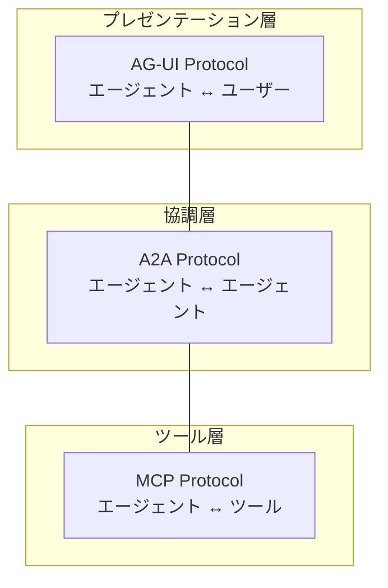

本記事は [CopilotKit Blog: AG-UI Protocol: Bridging Agents to Any Front End](https://www.copilotkit.ai/blog/ag-ui-protocol-bridging-agents-to-any-front-end) の解説記事です。

## ブログ概要（Summary）

AG-UI（Agent-User Interaction Protocol）は、CopilotKitが提唱するオープンプロトコルであり、AIエージェントとフロントエンドアプリケーション間のリアルタイム通信を標準化する。HTTP POST + SSE（Server-Sent Events）をトランスポート層に採用し、16種類の構造化JSONイベントによってテキストストリーミング、ツール呼び出し、共有状態同期、ライフサイクル管理を統一的に扱う。2026年3月にはAmazon Bedrock AgentCore RuntimeとOracleがAG-UIを採用し、エコシステムが拡大している。

この記事は [Zenn記事: LLMストリーミングのUX実装 SSEからAG-UIまで実践ガイド](https://zenn.dev/0h_n0/articles/fc33050cf4ccf4) の深掘りです。

## 情報源

- **種別**: 企業テックブログ
- **URL**: [https://www.copilotkit.ai/blog/ag-ui-protocol-bridging-agents-to-any-front-end](https://www.copilotkit.ai/blog/ag-ui-protocol-bridging-agents-to-any-front-end)
- **組織**: CopilotKit
- **著者**: Nathan Tarbert
- **発表日**: 2025年6月2日

## 技術的背景（Technical Background）

LLMアプリケーションはチャットボットからマルチステップエージェントへと進化しており、フロントエンドとバックエンド間の通信要件が大幅に増加している。従来のSSEストリーミングは「テキストトークンを逐次送信する」ことに特化していたが、エージェント型アプリケーションでは以下の追加要件が生じる:

1. **ツール呼び出しの進捗表示**: エージェントがWeb検索やデータベースクエリを実行中であることをUIに通知
2. **共有状態の同期**: エージェントとフロントエンドが同一のアプリケーション状態を参照・更新
3. **ライフサイクル管理**: エージェントの実行開始・完了・エラーをUIが追跡
4. **Human-in-the-loop**: エージェントの判断にユーザーの確認・承認を組み込む

Zenn記事で解説したSSEの基本実装はテキストストリーミングに最適だが、上記の複合的な通信パターンには不十分である。AG-UIはSSEの上にイベント型のプロトコル層を構築することで、この問題を解決する。

## 実装アーキテクチャ（Architecture）

### 3層プロトコルスタック

AG-UIは、エージェントエコシステムの3層プロトコルスタックにおけるプレゼンテーション層を担当する。



各プロトコルは独立して動作し、コンポーネントの入れ替えがシステム全体に影響しない設計になっている:
- **MCP（Model Context Protocol）**: エージェントがツール（API、DB等）と通信するプロトコル
- **A2A（Agent-to-Agent）**: エージェント間の協調・委譲プロトコル
- **AG-UI**: エージェントがフロントエンドUIと通信するプロトコル

### トランスポート層

AG-UIはHTTP POST + SSEをトランスポートに採用している。クライアントが1回のHTTP POSTでユーザー入力を送信し、サーバーがSSEストリームで構造化JSONイベントを返す。

この選択は、Zenn記事で解説した「SSEがLLMストリーミングの事実上の標準」である理由と一致する:
- 標準HTTPヘッダーによるCDN/プロキシ互換性
- ブラウザ組み込みの自動再接続
- 既存インフラとの親和性

### 16種イベントタイプ

AG-UIは以下のカテゴリに分類される16種のイベントタイプを定義している:

| カテゴリ | イベント | 用途 |
|---------|---------|------|
| **ライフサイクル** | `RUN_STARTED` | エージェント実行開始 |
| | `RUN_FINISHED` | エージェント実行完了 |
| | `RUN_ERROR` | エラー発生 |
| **テキストメッセージ** | `TEXT_MESSAGE_START` | メッセージ開始 |
| | `TEXT_MESSAGE_CONTENT` | テキストチャンク配信 |
| | `TEXT_MESSAGE_END` | メッセージ完了 |
| **ツール呼び出し** | `TOOL_CALL_START` | ツール呼び出し開始 |
| | `TOOL_CALL_ARGS` | ツール引数ストリーミング |
| | `TOOL_CALL_END` | ツール呼び出し完了 |
| **状態管理** | `STATE_SNAPSHOT` | 状態全体のスナップショット |
| | `STATE_DELTA` | 状態の差分更新 |
| **ステップ管理** | `STEP_STARTED` | 処理ステップ開始 |
| | `STEP_FINISHED` | 処理ステップ完了 |
| **カスタム** | `CUSTOM` | アプリ固有のイベント |

### イベントディスパッチの実装パターン

AG-UIイベントの処理は、SSEストリームから受信したJSONイベントを`type`フィールドで振り分けるパターンが基本となる。

```typescript
// AG-UI イベントハンドラの実装例
interface AGUIEvent {
  type: string;
  id?: string;
  delta?: string;
  state?: Record<string, unknown>;
  tool?: {
    name: string;
    args?: Record<string, unknown>;
  };
}

interface AGUIHandlers {
  onTextStart: () => void;
  onTextContent: (delta: string) => void;
  onTextEnd: () => void;
  onToolCallStart: (toolName: string) => void;
  onToolCallEnd: (toolName: string) => void;
  onStateDelta: (delta: Record<string, unknown>) => void;
  onRunFinished: () => void;
  onError: (error: string) => void;
}

function createAGUIDispatcher(handlers: AGUIHandlers) {
  return function dispatch(event: AGUIEvent): void {
    switch (event.type) {
      case "TEXT_MESSAGE_START":
        handlers.onTextStart();
        break;

      case "TEXT_MESSAGE_CONTENT":
        // SSEストリーミングと同じ逐次テキスト追記
        if (event.delta) {
          handlers.onTextContent(event.delta);
        }
        break;

      case "TEXT_MESSAGE_END":
        handlers.onTextEnd();
        break;

      case "TOOL_CALL_START":
        // 「Web検索中...」等の中間ステップをUIに表示
        if (event.tool) {
          handlers.onToolCallStart(event.tool.name);
        }
        break;

      case "TOOL_CALL_END":
        if (event.tool) {
          handlers.onToolCallEnd(event.tool.name);
        }
        break;

      case "STATE_DELTA":
        // フロントエンドとの共有状態を差分更新
        if (event.state) {
          handlers.onStateDelta(event.state);
        }
        break;

      case "RUN_FINISHED":
        handlers.onRunFinished();
        break;

      case "RUN_ERROR":
        handlers.onError(event.delta ?? "Unknown error");
        break;
    }
  };
}
```

### 共有状態同期

AG-UIの特徴的な機能として、`STATE_SNAPSHOT`と`STATE_DELTA`によるフロントエンドとバックエンドの**共有状態同期**がある。エージェントが処理中にアプリケーション状態を更新し、その変更をリアルタイムにUIに反映できる。

```typescript
// 共有状態管理の実装例
import { useReducer, useCallback } from "react";

interface SharedState {
  searchResults: Array<{ title: string; url: string }>;
  processingStep: string;
  progress: number;
}

type StateAction =
  | { type: "SNAPSHOT"; payload: SharedState }
  | { type: "DELTA"; payload: Partial<SharedState> };

function sharedStateReducer(
  state: SharedState,
  action: StateAction,
): SharedState {
  switch (action.type) {
    case "SNAPSHOT":
      return action.payload;
    case "DELTA":
      return { ...state, ...action.payload };
  }
}

function useAGUISharedState(initialState: SharedState) {
  const [state, dispatch] = useReducer(sharedStateReducer, initialState);

  const handleStateDelta = useCallback(
    (delta: Record<string, unknown>) => {
      dispatch({
        type: "DELTA",
        payload: delta as Partial<SharedState>,
      });
    },
    [],
  );

  const handleStateSnapshot = useCallback(
    (snapshot: Record<string, unknown>) => {
      dispatch({
        type: "SNAPSHOT",
        payload: snapshot as SharedState,
      });
    },
    [],
  );

  return { state, handleStateDelta, handleStateSnapshot };
}
```

## パフォーマンス最適化（Performance）

AG-UIプロトコル自体は軽量なJSONイベントの配信であり、SSEベースのため既存のストリーミングインフラをそのまま活用できる。パフォーマンス上の考慮点は以下の通り:

**イベント頻度の制御**: `STATE_DELTA`イベントを高頻度で送信するとクライアント側のレンダリング負荷が増大する。100ms以上の間隔でバッチ化（デバウンス）することが推奨される。

**ペイロードサイズ**: `STATE_SNAPSHOT`は状態全体を送信するため、大きなアプリケーション状態では帯域幅を消費する。初回接続時のみ`STATE_SNAPSHOT`を使い、以降は`STATE_DELTA`（差分のみ）を使う設計がCopilotKitの実装で採用されている。

**HTTP/2との併用**: Zenn記事で解説したHTTP/1.1のSSE接続数制限（ドメインあたり6本）は、HTTP/2環境では事実上解消される。AG-UIの複数ストリーム（テキスト + ツール + 状態）を同一接続で多重化可能。

## 運用での学び（Production Lessons）

### エコシステムの拡大

2026年3月時点で、以下の主要プラットフォームがAG-UIを採用している:

- **Amazon Bedrock AgentCore Runtime**: AWSが公式にAG-UIエンドポイントを提供。FASTテンプレートパターンでGenerative UI、共有状態、Human-in-the-loopフローが利用可能
- **Oracle**: Agent Specの標準通信プロトコルとしてAG-UI採用
- **Google**: CopilotKitとの共同リリースで標準化に参加
- **LangGraph, CrewAI**: エージェントフレームワーク側からのAG-UIサポート

### 導入時の注意点

AG-UIは2025年に登場した比較的新しいプロトコルであり、以下の制約がある:

1. **仕様の安定性**: イベントタイプの追加・変更が今後も予想される。プロダクション採用時はバージョンピニングが推奨される
2. **CopilotKit以外の実装**: CopilotKitのSDKが事実上のリファレンス実装であり、他フレームワークでの独自実装は追加の工数が必要
3. **デバッグツール**: SSEの汎用デバッグツール（DevToolsのNetwork tab等）で基本的な確認は可能だが、AG-UI固有のイベントフローを可視化するツールは発展途上

## 学術研究との関連（Academic Connection）

AG-UIの設計は、HCI（Human-Computer Interaction）分野の以下の研究成果と関連する:

- **Generative UI**: LLMがUIコンポーネントを動的に生成・更新する概念。AG-UIの`STATE_DELTA`イベントがこれを実現するインフラを提供
- **Mixed-Initiative Interaction**: 人間とAIが交互にイニシアティブを取る対話モデル。AG-UIのツール呼び出しイベントとHuman-in-the-loopフローがこのパターンを実装
- **Event-Driven Architecture**: ソフトウェアアーキテクチャにおけるイベント駆動パターン。AG-UIは16種のドメインイベントを標準化することで、エージェントUIの設計パターンを確立

なお、AG-UIに直接言及した査読付き学術論文は2026年4月時点では確認できていない。これはプロトコルの新しさに起因するものであり、今後の学術的分析が期待される。

## Production Deployment Guide

### AWS実装パターン（コスト最適化重視）

AG-UIプロトコルをAWSで展開する場合、Amazon Bedrock AgentCore Runtimeのネイティブサポートを活用するのが最も効率的。

| 規模 | 月間リクエスト | 推奨構成 | 月額コスト | 主要サービス |
|------|--------------|---------|-----------|------------|
| **Small** | ~3,000 (100/日) | Serverless | $80-200 | Lambda + Bedrock AgentCore |
| **Medium** | ~30,000 (1,000/日) | Hybrid | $500-1,200 | Lambda + ECS + Bedrock AgentCore |
| **Large** | 300,000+ (10,000/日) | Container | $2,000-6,000 | EKS + CopilotKit Self-hosted |

**Small構成の詳細** (月額$80-200):
- **Lambda**: AG-UIイベント中継 ($20/月)
- **Bedrock AgentCore**: AG-UIネイティブエンドポイント ($100/月)
- **DynamoDB**: 共有状態ストア ($10/月)
- **API Gateway**: WebSocket API（AG-UI SSEストリーム用） ($5/月)

**コスト試算の注意事項**: 上記は2026年4月時点のAWS ap-northeast-1（東京）リージョン料金に基づく概算値です。Bedrock AgentCore Runtimeの料金は利用量により変動します。

### Terraformインフラコード

**Small構成: Lambda + Bedrock AgentCore**

```hcl
resource "aws_iam_role" "agui_lambda" {
  name = "agui-lambda-role"

  assume_role_policy = jsonencode({
    Version = "2012-10-17"
    Statement = [{
      Action    = "sts:AssumeRole"
      Effect    = "Allow"
      Principal = { Service = "lambda.amazonaws.com" }
    }]
  })
}

resource "aws_iam_role_policy" "agui_bedrock" {
  role = aws_iam_role.agui_lambda.id
  policy = jsonencode({
    Version = "2012-10-17"
    Statement = [
      {
        Effect   = "Allow"
        Action   = ["bedrock:InvokeAgent", "bedrock:InvokeAgentWithResponseStream"]
        Resource = "*"
      },
      {
        Effect   = "Allow"
        Action   = ["dynamodb:GetItem", "dynamodb:PutItem", "dynamodb:UpdateItem"]
        Resource = aws_dynamodb_table.agui_state.arn
      }
    ]
  })
}

resource "aws_lambda_function" "agui_handler" {
  filename      = "agui-handler.zip"
  function_name = "agui-event-handler"
  role          = aws_iam_role.agui_lambda.arn
  handler       = "index.handler"
  runtime       = "nodejs20.x"
  timeout       = 300
  memory_size   = 512

  environment {
    variables = {
      AGUI_VERSION      = "1.0"
      STATE_TABLE       = aws_dynamodb_table.agui_state.name
      BEDROCK_AGENT_ID  = "your-agent-id"
    }
  }
}

resource "aws_dynamodb_table" "agui_state" {
  name         = "agui-shared-state"
  billing_mode = "PAY_PER_REQUEST"
  hash_key     = "session_id"

  attribute {
    name = "session_id"
    type = "S"
  }

  ttl {
    attribute_name = "expire_at"
    enabled        = true
  }
}

resource "aws_apigatewayv2_api" "agui_ws" {
  name                       = "agui-websocket"
  protocol_type              = "WEBSOCKET"
  route_selection_expression = "$request.body.action"
}

resource "aws_cloudwatch_metric_alarm" "agui_errors" {
  alarm_name          = "agui-event-errors"
  comparison_operator = "GreaterThanThreshold"
  evaluation_periods  = 1
  metric_name         = "Errors"
  namespace           = "AWS/Lambda"
  period              = 300
  statistic           = "Sum"
  threshold           = 5
  alarm_description   = "AG-UIイベント処理エラー率上昇"

  dimensions = {
    FunctionName = aws_lambda_function.agui_handler.function_name
  }
}
```

### 運用・監視設定

```sql
-- AG-UIイベントタイプ別の分布監視
fields @timestamp, event_type, latency_ms
| stats count(*) as event_count,
        avg(latency_ms) as avg_latency
  by event_type
| sort event_count desc

-- STATE_DELTA頻度の監視（過剰な状態更新検出）
fields @timestamp, event_type, payload_size_bytes
| filter event_type = "STATE_DELTA"
| stats count(*) as delta_count,
        avg(payload_size_bytes) as avg_size
  by bin(1m)
| filter delta_count > 100
```

### コスト最適化チェックリスト

**アーキテクチャ選択**:
- [ ] ~100 req/日 → Lambda + Bedrock AgentCore - $80-200/月
- [ ] ~1000 req/日 → Lambda + ECS + Bedrock AgentCore - $500-1,200/月
- [ ] 10000+ req/日 → EKS + CopilotKit Self-hosted - $2,000-6,000/月

**リソース最適化**:
- [ ] Bedrock AgentCore: AG-UIネイティブエンドポイント使用（自前実装不要）
- [ ] Lambda: AG-UIイベント中継のみ（軽量、512MB RAM推奨）
- [ ] DynamoDB: On-Demand（共有状態ストア）
- [ ] HTTP/2: SSE多重化によるコネクション効率化
- [ ] STATE_DELTA: デバウンス（100ms間隔）でイベント数削減

**LLMコスト削減**:
- [ ] Bedrock Batch API: 非リアルタイム処理に50%割引
- [ ] Prompt Caching: ツール定義プロンプトのキャッシュ
- [ ] モデル選択: ツール呼び出し判定にはHaiku、テキスト生成にはSonnet
- [ ] トークン制限: STATE_SNAPSHOTサイズの上限設定

**監視・アラート**:
- [ ] イベントタイプ別の頻度監視
- [ ] STATE_DELTA過剰送信の検出
- [ ] RUN_ERRORイベント率
- [ ] SSEストリーム断続の検出

**リソース管理**:
- [ ] セッション状態のTTL設定（DynamoDB）
- [ ] AG-UIプロトコルバージョンのピニング
- [ ] CopilotKit SDKの定期更新
- [ ] ツール呼び出しのタイムアウト設定

## まとめと実践への示唆

AG-UIプロトコルは、Zenn記事で解説したSSEストリーミングの上に構築されたエージェント特化の通信レイヤーであり、テキスト配信に加えてツール呼び出し進捗、共有状態同期、ライフサイクル管理を統一的に扱える。

Amazon Bedrock AgentCore RuntimeやOracleの採用により、エンタープライズ環境での利用基盤が整いつつある。ただし、2026年4月時点ではプロトコル仕様が安定途上であり、CopilotKit SDKへの依存度が高い点は留意が必要である。

チャットボットからエージェント型アプリケーションへの移行を検討する場合、まずSSEベースの基本ストリーミング（Zenn記事の実装）を構築した上で、エージェント機能の追加時にAG-UIプロトコルを導入するという段階的アプローチが現実的である。

## 参考文献

- **Blog URL**: [https://www.copilotkit.ai/blog/ag-ui-protocol-bridging-agents-to-any-front-end](https://www.copilotkit.ai/blog/ag-ui-protocol-bridging-agents-to-any-front-end)
- **AG-UI公式ドキュメント**: [https://docs.ag-ui.com/](https://docs.ag-ui.com/)
- **GitHub**: [https://github.com/ag-ui-protocol/ag-ui](https://github.com/ag-ui-protocol/ag-ui)
- **CopilotKit**: [https://github.com/CopilotKit/CopilotKit](https://github.com/CopilotKit/CopilotKit)
- **AWS Bedrock AgentCore AG-UI対応**: [https://aws.amazon.com/about-aws/whats-new/2026/03/amazon-bedrock-agentcore-runtime-ag-ui-protocol/](https://aws.amazon.com/about-aws/whats-new/2026/03/amazon-bedrock-agentcore-runtime-ag-ui-protocol/)
- **Related Zenn article**: [https://zenn.dev/0h_n0/articles/fc33050cf4ccf4](https://zenn.dev/0h_n0/articles/fc33050cf4ccf4)
