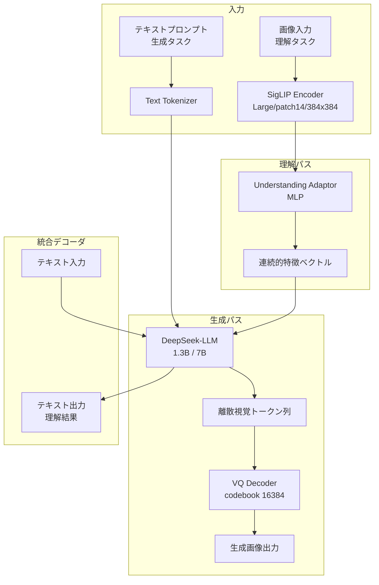

本記事は [Janus: Decoupling Visual Encoding for Unified Multimodal Understanding and Generation](https://arxiv.org/abs/2411.07975) の解説記事です。

## 論文概要（Abstract）

DeepSeek AIのChengyue Wu, Xiaokang Chen, Zhiyu Wuらによる本論文は、マルチモーダル理解と画像生成を**単一のLLM**で統合するフレームワーク**Janus**を提案している。核心的なアイデアは、理解と生成で**異なる視覚エンコーダ**を使い分けることで、両タスク間の表現競合（representation conflict）を解消する点にある。理解にはSigLIPエンコーダ（高水準の意味特徴を抽出）、生成にはVQ tokenizer（離散的な視覚トークンを出力）を使用し、共通のTransformer LLMデコーダでそれらを統合する。著者らは、1.3Bパラメータのモデルで既存の7B以上のモデルを理解タスクで上回る性能を報告している。

この記事は [Zenn記事: Gemini 2.0マルチモーダルAPI実践ガイド 画像・動画・音声の統合処理と移行戦略](https://zenn.dev/0h_n0/articles/7d6fd9f7d490ab) の深掘りです。Zenn記事がGemini APIの統合的なマルチモーダル処理（画像認識と画像生成の両方を単一APIで扱う設計）を解説しているのに対し、本論文はそのようなマルチモーダル統合を実現するためのアーキテクチャ上の課題と解決策を技術的に掘り下げている。

## 情報源

- **arXiv ID**: 2411.07975
- **URL**: [https://arxiv.org/abs/2411.07975](https://arxiv.org/abs/2411.07975)
- **著者**: Chengyue Wu, Xiaokang Chen, Zhiyu Wu et al.
- **発表年**: 2024
- **分野**: cs.CV, cs.CL
- **所属**: DeepSeek AI
- **コード**: [github.com/deepseek-ai/Janus](https://github.com/deepseek-ai/Janus)（MIT License）

## 背景と動機（Background & Motivation）

マルチモーダルAIにおいて、「画像を理解する」タスクと「画像を生成する」タスクを単一のモデルで実現することは、Gemini等の統合APIが示すように強い実用上のニーズがある。しかし、従来の統合モデルの多くは、理解と生成の両方に**同一の視覚エンコーダ**を使用しており、これが性能上のボトルネックとなっていた。

著者らは、理解タスクと生成タスクでは視覚エンコーダに求められる性質が本質的に異なると指摘している。具体的には:

- **理解タスク**が必要とする特徴: 高水準の意味的表現（例: 「犬がボールを追いかけている」という場面理解）。空間的な細部よりもシーン全体の意味が重要
- **生成タスク**が必要とする特徴: 低水準の空間的・テクスチャ的詳細（例: 毛並みの質感、光の反射の方向）。ピクセルレベルの再構成能力が必要

この二つの要求は根本的に相反しており、単一のエンコーダで両方を最適化しようとすると「表現競合（representation conflict）」が生じる。論文のTable 3では、LLaVA（理解専用モデル）のSigLIPエンコーダを画像生成に転用した実験で、生成品質が著しく低下することが確認されている。逆に、VQ tokenizerを理解タスクに使用した場合も、意味理解の精度が大幅に劣化する。

Janusは、この問題に対し「エンコーダを分離し、デコーダで統合する」という設計方針で対処する。

## 主要な貢献（Key Contributions）

- **貢献1**: 視覚エンコーダの分離（Decoupled Visual Encoding）アーキテクチャを提案し、理解用と生成用で異なるエンコーダを使用することで表現競合を解消した
- **貢献2**: 分離したエンコーダの出力を**単一のAutoregressive LLM**で統合処理する枠組みを構築し、タスク切替のオーバーヘッドを排除した
- **貢献3**: 1.3Bパラメータモデルで、理解タスク（MMBench 79.2%）と生成タスク（GenEval 0.61）の両方において、パラメータ数が数倍以上の既存モデルを上回る性能を達成した
- **貢献4**: 3段階の学習手順により、事前学習済みエンコーダとLLMの転移学習パイプラインを設計した

## 技術的詳細（Technical Details）

### アーキテクチャ概要

Janusのアーキテクチャは、(1) 理解用視覚エンコーダ（SigLIP）、(2) 生成用視覚エンコーダ（VQ tokenizer）、(3) 統合LLMデコーダ（DeepSeek-LLM）の3コンポーネントで構成される。



理解タスクでは、入力画像がSigLIPエンコーダで連続的な特徴ベクトルに変換され、MLPアダプタを通じてLLMの入力空間にマッピングされる。生成タスクでは、LLMが離散的な視覚トークンを自己回帰的に生成し、VQデコーダがそれを画像に復元する。

### SigLIPの対照学習損失

理解用エンコーダSigLIPは、画像とテキストの対照学習（contrastive learning）で事前訓練されている。SigLIPはSigmoid損失を使用し、バッチ内の全ペアに対して独立に二値分類を行う:

$$
\mathcal{L}_{\text{SigLIP}} = -\frac{1}{N^2} \sum_{i=1}^{N} \sum_{j=1}^{N} \log \sigma\left(y_{ij} \cdot z_{ij}\right)
$$

ここで各変数は以下のように定義される:

- $N$: バッチサイズ
- $z_{ij} = t \cdot \mathbf{x}_i^{\top} \mathbf{y}_j + b$: 画像$i$とテキスト$j$の類似度スコア（$t$は学習可能な温度パラメータ、$b$はバイアス）
- $y_{ij} = 2 \cdot \mathbb{1}[i = j] - 1$: ペアが一致すれば$+1$、不一致なら$-1$
- $\sigma$: シグモイド関数
- $\mathbf{x}_i$: 画像$i$のL2正規化された特徴ベクトル
- $\mathbf{y}_j$: テキスト$j$のL2正規化された特徴ベクトル

SigLIPはsoftmax正規化が不要なため大規模バッチでの分散学習が容易である。Janusでは**SigLIP-Large（patch 14, 384x384）**を使用している。

### VQ-VAEの量子化損失

生成用エンコーダはVQ tokenizer（codebook size 16384）であり、画像をダウンサンプリング比16で離散トークン列に変換する。VQ-VAEの学習損失は以下で定義される:

$$
\mathcal{L}_{VQ} = \|z - \text{sg}[e]\|^2 + \beta\|\text{sg}[z] - e\|^2
$$

各変数の定義:

- $z$: エンコーダの出力（連続ベクトル）
- $e$: 最近傍のコードブックエントリ（離散ベクトル）
- $\text{sg}[\cdot]$: stop-gradient演算子（勾配の逆伝播を遮断）
- $\beta$: コミットメント損失の重み係数（通常0.25）

第1項はコードブック更新損失、第2項はコミットメント損失であり、stop-gradientにより各項が一方のコンポーネントのみを更新する。$384 \times 384$の入力画像はダウンサンプリング比16により$24 \times 24 = 576$個の離散トークンに変換される。

### 3段階の学習手順

Janusは以下の3段階で学習される。論文Section 3.2より。

**Stage 1: アダプタのみの学習**

理解用MLPアダプタのみを学習し、SigLIPエンコーダとLLMの重みは凍結する。生成用VQ tokenizerも学習済みのまま使用する。この段階では、SigLIPの特徴空間とLLMの入力空間のアライメントを行う。

**Stage 2: エンコーダ＋アダプタの学習**

理解用エンコーダ（SigLIP）とアダプタを解凍して学習する。LLMも学習対象に含め、理解タスクと生成タスクの混合データで学習する。エンコーダの学習率はLLMの0.1倍に設定し、事前学習済みの特徴表現を崩さないようにする。

**Stage 3: フルファインチューニング**

全パラメータを解凍し、instruction-tuningデータで最終調整を行う。理解タスク（VQA、キャプション生成等）と生成タスク（テキストから画像生成）の両方を含む混合データセットで学習する。

各Stageでの学習パラメータ:

| Stage | 学習対象 | LLM LR | Encoder LR | データ |
|-------|---------|--------|------------|--------|
| 1 | アダプタのみ | - | - | 理解データ |
| 2 | エンコーダ+アダプタ+LLM | $1 \times 10^{-4}$ | $1 \times 10^{-5}$ | 理解+生成混合 |
| 3 | 全パラメータ | $5 \times 10^{-5}$ | $5 \times 10^{-6}$ | Instruction-tuning |

## 実装のポイント（Implementation）

### 学習率スケジューリング

Janusの学習で最も重要な実装上の工夫は、**エンコーダの学習率をLLMの0.1倍に設定する**点である。これにより、事前学習済みのSigLIPエンコーダが保持する豊かな視覚特徴が、ファインチューニングで破壊されることを防ぐ。

```python
from typing import Dict, List
import torch
from torch.optim import AdamW


def create_janus_optimizer(
    model: torch.nn.Module,
    llm_lr: float = 1e-4,
    encoder_lr_ratio: float = 0.1,
    weight_decay: float = 0.01,
) -> AdamW:
    """Janusの差分学習率オプティマイザを構成する

    エンコーダの学習率をLLMの0.1倍に設定することで、
    事前学習済み特徴の破壊を防止する。

    Args:
        model: Janusモデル（エンコーダ + LLM）
        llm_lr: LLMの学習率
        encoder_lr_ratio: エンコーダLR / LLM LR の比率
        weight_decay: Weight decay係数

    Returns:
        差分学習率が設定されたAdamWオプティマイザ
    """
    param_groups: List[Dict] = [
        {
            "params": [
                p for n, p in model.named_parameters()
                if "vision_encoder" in n and p.requires_grad
            ],
            "lr": llm_lr * encoder_lr_ratio,
            "name": "vision_encoder",
        },
        {
            "params": [
                p for n, p in model.named_parameters()
                if "adaptor" in n and p.requires_grad
            ],
            "lr": llm_lr,
            "name": "adaptor",
        },
        {
            "params": [
                p for n, p in model.named_parameters()
                if "language_model" in n and p.requires_grad
            ],
            "lr": llm_lr,
            "name": "language_model",
        },
    ]

    return AdamW(param_groups, weight_decay=weight_decay)
```

### VQ tokenizerの推論時パイプライン

画像生成時には、LLMが自己回帰的に576個（$24 \times 24$）の離散トークンを出力し、VQデコーダが画像に復元する。Classifier-Free Guidance（CFG）を適用して生成品質を向上させる。

```python
import torch
from typing import Optional


def generate_image_tokens(
    model: torch.nn.Module,
    prompt_ids: torch.Tensor,
    num_image_tokens: int = 576,
    temperature: float = 1.0,
    top_k: Optional[int] = 2048,
    cfg_weight: float = 5.0,
) -> torch.Tensor:
    """LLMから離散画像トークンを自己回帰生成する

    Args:
        model: Janus LLMモデル
        prompt_ids: テキストプロンプトのトークンID (1, seq_len)
        num_image_tokens: 生成する画像トークン数（デフォルト576 = 24x24）
        temperature: サンプリング温度
        top_k: Top-kフィルタリング（Noneで無効化）
        cfg_weight: Classifier-Free Guidanceの重み

    Returns:
        生成された画像トークンID (1, num_image_tokens)
    """
    generated: list[int] = []
    current_ids = prompt_ids

    for _ in range(num_image_tokens):
        logits = model(current_ids).logits[:, -1, :]

        # Classifier-Free Guidance
        if cfg_weight > 1.0:
            uncond_logits = model(
                torch.zeros_like(prompt_ids[:, :1])
            ).logits[:, -1, :]
            logits = uncond_logits + cfg_weight * (logits - uncond_logits)

        logits = logits / temperature

        if top_k is not None:
            values, _ = torch.topk(logits, top_k, dim=-1)
            min_value = values[:, -1].unsqueeze(-1)
            logits = torch.where(
                logits < min_value,
                torch.full_like(logits, float("-inf")),
                logits,
            )

        probs = torch.softmax(logits, dim=-1)
        next_token = torch.multinomial(probs, 1)
        generated.append(next_token.item())
        current_ids = torch.cat([current_ids, next_token], dim=-1)

    return torch.tensor([generated], device=prompt_ids.device)
```

## 実験結果（Results）

### マルチモーダル理解ベンチマーク

著者らは、Janus 1.3Bモデルを複数の理解ベンチマークで評価している。論文Table 1より:

| モデル | パラメータ | MMBench | SeedBench | POPE | GQA |
|--------|-----------|---------|-----------|------|-----|
| LLaVA-1.5 | 7B | 64.3 | 66.2 | 85.9 | 62.0 |
| Qwen-VL-Chat | 7B | 60.6 | 65.4 | - | 57.5 |
| SEED-LLaMA | 14B | 46.4 | 51.5 | - | - |
| Show-o | 1.3B | 58.3 | - | 73.8 | - |
| **Janus** | **1.3B** | **79.2** | **72.0** | **89.4** | **60.3** |

Janus 1.3BはMMBenchで79.2%を達成し、7BのLLaVA-1.5（64.3%）や14BのSEED-LLaMA（46.4%）を大幅に上回っている。著者らは、エンコーダ分離により理解用エンコーダが生成タスクの制約から解放され、高水準の意味的特徴抽出に集中できることが性能向上の主因であると分析している。

### 画像生成ベンチマーク

生成タスクについても、同規模のモデルに対して競争力のある結果が報告されている。論文Table 2より:

| モデル | パラメータ | FID (COCO)↓ | GenEval↑ |
|--------|-----------|------------|----------|
| DALL-E 2 | 6.5B | 10.39 | 0.52 |
| SEED-LLaMA | 14B | 14.23 | 0.44 |
| Show-o | 1.3B | 9.24 | 0.53 |
| **Janus** | **1.3B** | **7.08** | **0.61** |

FID（Frechet Inception Distance、低いほど良い）は7.08であり、6.5BのDALL-E 2（10.39）を下回っている。GenEval（総合的な画像生成品質の指標、高いほど良い）は0.61で、DALL-E 2の0.52を上回る。

### アブレーション実験: エンコーダ分離の効果

論文Table 3のアブレーション実験は、エンコーダ分離の有効性を直接的に示している:

| 構成 | MMBench (理解) | GenEval (生成) |
|------|--------------|---------------|
| 単一エンコーダ（SigLIP） | 77.5 | 0.37 |
| 単一エンコーダ（VQ） | 57.8 | 0.58 |
| **分離エンコーダ（Janus）** | **79.2** | **0.61** |

SigLIPのみを使用した場合、理解は77.5%と高いが生成は0.37と大幅に劣化する。VQのみでは生成は0.58だが理解が57.8%に落ちる。分離エンコーダは両方のタスクで最良の結果を達成している。

## 実運用への応用（Practical Applications）

Zenn記事で解説されたGemini 2.0のマルチモーダルAPIは、画像認識と画像生成を単一APIで提供している。Janusの研究は、このような統合マルチモーダルサービスの内部アーキテクチャとして、エンコーダ分離が有効な設計原則であることを示している。

Janusのコードとモデル重みはMITライセンスで公開されており（[github.com/deepseek-ai/Janus](https://github.com/deepseek-ai/Janus)）、1.3Bモデルは単一GPU（16GB VRAM）で推論可能である。ただし画像生成は$384 \times 384$解像度に限定されるため、高解像度が必要な場合はJanusFlow（arXiv:2502.01385、$768 \times 768$対応）が選択肢となる。

## Production Deployment Guide

### AWSにおけるデュアルエンコーダ・マルチモーダルサービスの実装パターン

Janusのデュアルエンコーダアーキテクチャをプロダクション環境にデプロイする際、理解用エンコーダ（SigLIP）と生成用エンコーダ（VQ tokenizer）+デコーダを効率的にサービングする必要がある。理解タスクと生成タスクでは計算リソース要件が異なるため、独立したスケーリングが有効である。

| 規模 | 月間リクエスト | 推奨構成 | 月額コスト | 主要サービス |
|------|--------------|---------|-----------|------------|
| **Small** | ~3,000 (100/日) | Serverless+Endpoint | $150-400 | Lambda + SageMaker Endpoint (ml.g5.xlarge) |
| **Large** | 30,000+ (1,000+/日) | Container | $2,000-6,000 | EKS + GPU Nodes + 独立スケーリング |

**Small構成**: Lambda（ルーティング）+ SageMaker Endpoint (ml.g5.xlarge, Janus 1.3Bサービング) + S3 + API Gateway。

**Large構成**: EKS + 理解用GPU Node Group (g5.xlarge, Spot) + 生成用GPU Node Group (g5.2xlarge, Spot) + ALB。タスク別の独立スケーリングが可能。

**コスト試算の注意事項**: 上記は2026年4月時点のAWS ap-northeast-1（東京）リージョン料金に基づく概算値です。Spot Instancesの価格は需給により変動します。

### Terraformインフラコード

**Small構成: Lambda + SageMaker Endpoint**

```hcl
resource "aws_sagemaker_model" "janus_model" {
  name               = "janus-1-3b-multimodal"
  execution_role_arn = var.sagemaker_role_arn

  primary_container {
    image          = "763104351884.dkr.ecr.ap-northeast-1.amazonaws.com/pytorch-inference:2.1.0-gpu-py310-cu118-ubuntu20.04-sagemaker"
    model_data_url = "s3://${var.model_bucket}/janus-1.3b/model.tar.gz"

    environment = {
      MODEL_NAME            = "deepseek-ai/Janus-1.3B"
      UNDERSTANDING_ENCODER = "siglip-large-patch14-384"
      GENERATION_ENCODER    = "vq-tokenizer-16384"
    }
  }
}

resource "aws_sagemaker_endpoint_configuration" "janus_config" {
  name = "janus-multimodal-config"

  production_variants {
    variant_name           = "primary"
    model_name             = aws_sagemaker_model.janus_model.name
    instance_type          = "ml.g5.xlarge"
    initial_instance_count = 1
  }
}

resource "aws_sagemaker_endpoint" "janus_endpoint" {
  name                 = "janus-multimodal-endpoint"
  endpoint_config_name = aws_sagemaker_endpoint_configuration.janus_config.name
}
```

**Large構成**: EKSではタスク別のNode Groupを定義し、理解用（g5.xlarge, Spot）と生成用（g5.2xlarge, Spot）を独立してスケーリングする。`labels`でPodのスケジューリングを制御し、GPU taintで非GPUワークロードの混在を防止する。

### 運用・監視設定

```sql
-- デュアルエンコーダのレイテンシ監視
fields @timestamp, task_type, encoder_latency_ms, llm_latency_ms, total_latency_ms
| filter task_type in ["understanding", "generation"]
| stats avg(encoder_latency_ms) as avg_encoder,
        pct(total_latency_ms, 99) as p99_total
  by task_type, bin(5m)
```

### コスト最適化チェックリスト

**アーキテクチャ選択**:
- [ ] ~100 req/日（理解のみ） → SageMaker Endpoint (ml.g5.xlarge) - $300/月
- [ ] ~100 req/日（理解+生成） → SageMaker Endpoint (ml.g5.xlarge) - $300-400/月
- [ ] 1,000+ req/日 → EKS + タスク別GPU Node Group - $2,000-6,000/月

**モデルサービング最適化**:
- [ ] Janus 1.3B: 単一GPU (16GB VRAM) で理解+生成の両方が動作
- [ ] Janus 7B: g5.2xlarge (24GB VRAM) が必要
- [ ] 理解タスクのバッチ処理: SigLIPエンコーダは画像バッチ処理が効率的
- [ ] 生成タスク: 自己回帰のため逐次処理が基本、CFGで2倍のフォワードパス

**監視・アラート**:
- [ ] タスク別レイテンシ P99（理解: <500ms目標、生成: <10s目標）
- [ ] GPU メモリ使用率（SigLIP ~400MB + LLM + VQ Decoder ~100MB）
- [ ] VQ codebook利用率（低下はコードブック崩壊の兆候）
- [ ] Spot中断対策: On-Demandへの自動フォールバック

## 関連研究（Related Work）

- **LLaVA (arXiv:2304.08485)**: SigLIPエンコーダ + LLMによる視覚言語モデル。理解タスクに特化しており、画像生成能力は持たない。JanusはLLaVAの理解パスを踏襲しつつ、生成パスを追加したと解釈できる
- **SEED-LLaMA (arXiv:2310.01218)**: VQ tokenizerを使い、理解と生成の両方を単一エンコーダで実現する統合モデル。Janusの論文ではTable 1, 2の比較対象として登場し、単一エンコーダの限界を示す例となっている
- **Show-o (arXiv:2408.12528)**: 同じく理解と生成の統合を目指すモデルで、Janus 1.3Bと同規模。単一エンコーダ方式であり、Janusとの直接比較でエンコーダ分離の効果が確認されている
- **JanusFlow (arXiv:2502.01385)**: Janusの後継モデル。VQ tokenizerの離散トークン方式をRectified Flow（連続的な生成フレームワーク）に置き換え、画像生成品質を大幅に向上させた。$768 \times 768$解像度にも対応

## まとめと今後の展望

Janusは、マルチモーダル理解と画像生成を統合するモデルにおいて、「視覚エンコーダの分離」という明快な設計原則が有効であることを実証した。理解には高水準の意味的特徴を、生成には低水準の空間的詳細を、それぞれ最適なエンコーダで処理し、共通のLLMデコーダで統合するこのアプローチは、1.3Bという小規模モデルで7B以上の既存モデルを凌駕する効率性を実現している。

Zenn記事で紹介されたGeminiのような統合マルチモーダルAPIの内部設計として、エンコーダ分離は今後のスタンダードになる可能性がある。後続のJanusFlowがRectified Flowの導入で生成品質をさらに向上させていることからも、この設計方針の拡張性が確認できる。

今後の課題として、動画理解・生成への拡張、高解像度画像生成（JanusFlowで一部対応）、音声モダリティの統合が挙げられる。

## 参考文献

- **arXiv**: [https://arxiv.org/abs/2411.07975](https://arxiv.org/abs/2411.07975)
- **Code**: [https://github.com/deepseek-ai/Janus](https://github.com/deepseek-ai/Janus) (MIT License)
- **Related**: LLaVA (arXiv:2304.08485), SEED-LLaMA (arXiv:2310.01218), Show-o (arXiv:2408.12528), JanusFlow (arXiv:2502.01385)
- **SigLIP**: [arXiv:2303.15343](https://arxiv.org/abs/2303.15343)
- **Related Zenn article**: [https://zenn.dev/0h_n0/articles/7d6fd9f7d490ab](https://zenn.dev/0h_n0/articles/7d6fd9f7d490ab)
