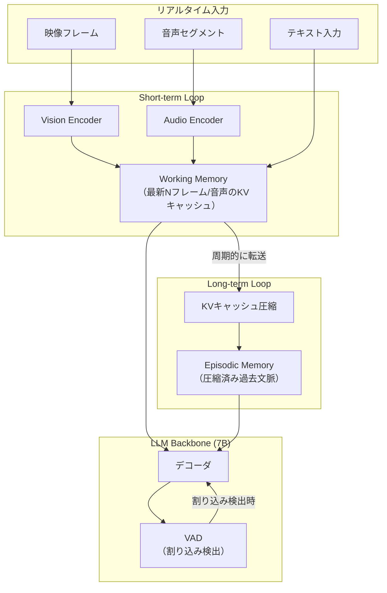

本記事は [InternLM-XComposer2.5-OmniLive](https://arxiv.org/abs/2412.10885) の解説記事です。

## 論文概要（Abstract）

Shanghai AI Laboratoryの Pan Zhang, Xiaoyi Dong, Yuhang Zang らによる本論文は、テキスト・画像・映像・音声を統合的にリアルタイム処理する包括的マルチモーダルシステム **InternLM-XComposer2.5-OmniLive** を提案している。核となるアーキテクチャは **Dual-Loop（二重ループ）** 構造であり、Short-term Loopがリアルタイム入力をWorking Memory（作業記憶）に変換し、Long-term Loopが過去の会話をEpisodic Memory（エピソード記憶）として圧縮する。7Bパラメータでありながら、StreamingBench 58.4%（オープンソース最高）、EgoSchema 74.8%を達成したと報告されている。

この記事は [Zenn記事: Gemini 2.0マルチモーダルAPI実践ガイド 画像・動画・音声の統合処理と移行戦略](https://zenn.dev/0h_n0/articles/7d6fd9f7d490ab) の深掘りです。

## 情報源

- **arXiv ID**: 2412.10885
- **URL**: [https://arxiv.org/abs/2412.10885](https://arxiv.org/abs/2412.10885)
- **著者**: Pan Zhang, Xiaoyi Dong, Yuhang Zang et al.
- **発表年**: 2024
- **分野**: cs.CV, cs.CL, cs.AI
- **所属**: Shanghai AI Laboratory

## 背景と動機（Background & Motivation）

マルチモーダルLLMの多くは、事前に収集された画像・動画を入力として処理する「オフライン」モードで動作する。しかし、ビデオ通話やライブ配信のようなリアルタイムストリーミング環境では、映像と音声が連続的に到着し、ユーザがいつでも割り込みできる必要がある。Zenn記事で解説されているGemini 2.0のMultimodal Live APIは、WebSocketを介したリアルタイムストリーミングを商用APIとして提供しているが、その内部アーキテクチャは非公開である。

本論文の動機は、このようなリアルタイムマルチモーダルインタラクションをオープンソースの7Bモデルで実現することにある。特に、(1) ストリーミング入力の即時エンコード、(2) 長時間対話における文脈の効率的な保持、(3) ユーザ割り込みへの即時対応、の3つの課題を同時に解決するアーキテクチャの設計が中心的な課題である。

## 主要な貢献（Key Contributions）

- **貢献1: Dual-Loopアーキテクチャ**: 人間の認知システムに着想を得た二重ループ構造を提案。Short-term LoopがWorking Memoryとしてリアルタイム入力を処理し、Long-term LoopがEpisodic Memoryとして過去の文脈をKVキャッシュ圧縮により保持する
- **貢献2: リアルタイムストリーミング対応**: 映像フレームと音声セグメントを逐次エンコードし、遅延を最小化する設計。Voice Activity Detection（VAD）によるユーザ割り込みの自動検出と応答中断処理を実装
- **貢献3: オープンソース最高性能**: 7Bパラメータという比較的小規模なモデルでStreamingBench 58.4%を達成し、オープンソースモデルとして最高性能を記録。AIR-BenchではGPT-4oに匹敵する性能を報告

## 技術的詳細（Technical Details）

### Dual-Loopアーキテクチャ

InternLM-XComposer2.5-OmniLiveの中核は、Short-term LoopとLong-term Loopの二重ループ構造である。



### Short-term Loop: Working Memory

Short-term Loopは、直近の$N$フレームの映像と音声セグメントをリアルタイムでエンコードし、Working Memoryとして保持する。映像エンコーダはViT（Vision Transformer）ベースであり、各フレーム$I_t$をビジョントークン列$\mathbf{v}_t$に変換する:

$$
\mathbf{v}_t = \text{VisionEncoder}(I_t) \in \mathbb{R}^{L_v \times d}
$$

ここで$L_v$はフレームあたりのビジョントークン数、$d$はトークンの埋め込み次元である。音声エンコーダはWhisperベースのアーキテクチャを採用し、音声セグメント$a_t$を音声トークン列に変換する:

$$
\mathbf{a}_t = \text{AudioEncoder}(a_t) \in \mathbb{R}^{L_a \times d}
$$

ここで$L_a$は音声セグメントあたりのトークン数である。

Working Memoryは直近$N$ステップ分のKVキャッシュを保持する。時刻$t$でのWorking Memoryの内容は:

$$
\mathbf{W}_t = \text{KVCache}\left(\left[\mathbf{v}_{t-N+1}, \mathbf{a}_{t-N+1}, \ldots, \mathbf{v}_t, \mathbf{a}_t\right]\right)
$$

### Long-term Loop: Episodic Memory

Long-term Loopは、Working Memoryから古くなったKVキャッシュエントリを受け取り、圧縮してEpisodic Memoryに格納する。圧縮は周期$P$ステップごとに実行される。

KVキャッシュ圧縮の手法として、著者らはattention scoreに基づくトークン選択を採用している。各レイヤー$l$、ヘッド$h$のattention score $\alpha_{l,h,i}$に基づき、重要度の高いトークンを選択する:

$$
\text{Score}(i) = \frac{1}{L \cdot H} \sum_{l=1}^{L} \sum_{h=1}^{H} \alpha_{l,h,i}
$$

ここで$L$はレイヤー数、$H$はアテンションヘッド数、$i$はトークンインデックスである。上位$K$個のトークンのKVキャッシュのみを保持することで、長時間対話でもメモリ使用量を一定に抑える。圧縮率$r$は保持トークン比率$K / N_{\text{total}}$で定義され、著者らは$r = 0.25$（4分の1に圧縮）を標準設定として報告している。

### 割り込み処理（Interruption Handling）

VAD（Voice Activity Detection）モジュールが音声入力を常時監視し、モデルが応答生成中にユーザの発話を検出した場合、生成を即座に中断して新しいユーザ入力の処理に切り替える。これにより、自然な対話のターンテイキングを実現している。

## 実装のポイント（Implementation）

**モデル構成**: LLMバックボーンはInternLM2-7Bを採用。Vision EncoderはInternViT-300M、Audio EncoderはWhisperベースのモデルを使用している。全体で約7Bパラメータ。

**フレームレートとウィンドウサイズ**: 映像は1-2 FPSでサンプリングし、Working Memoryの保持フレーム数$N$はタスクに応じて調整可能。著者らは$N = 64$（約30-60秒分）を標準設定として使用している。

**KVキャッシュ管理**: HuggingFace Transformersをベースとしたカスタムストリーミングデコーダを実装。KVキャッシュの動的管理（追加・圧縮・削除）をサポートしている。

```python
from typing import List, Tuple
import torch
from dataclasses import dataclass, field


@dataclass
class StreamingKVCache:
    """ストリーミングマルチモーダルシステム向けKVキャッシュ管理

    Working Memory（短期）とEpisodic Memory（長期）の
    二重構造でKVキャッシュを管理する。

    Attributes:
        num_layers: Transformerレイヤー数
        num_heads: アテンションヘッド数
        head_dim: ヘッド次元
        max_working_tokens: Working Memory最大トークン数
        compression_ratio: Episodic Memory圧縮率
    """
    num_layers: int
    num_heads: int
    head_dim: int
    max_working_tokens: int = 2048
    compression_ratio: float = 0.25
    working_kv: List[Tuple[torch.Tensor, torch.Tensor]] = field(
        default_factory=list
    )
    episodic_kv: List[Tuple[torch.Tensor, torch.Tensor]] = field(
        default_factory=list
    )

    def compress_to_episodic(
        self,
        attention_scores: torch.Tensor,
    ) -> int:
        """Working Memoryの古いエントリを圧縮してEpisodic Memoryに転送

        Attention scoreに基づいて重要度の高いトークンを選択し、
        残りを破棄することでKVキャッシュを圧縮する。

        Args:
            attention_scores: 全レイヤー・ヘッドの平均attention score
                Shape: (total_tokens,)

        Returns:
            圧縮後に保持されたトークン数
        """
        if not self.working_kv:
            return 0

        total_tokens: int = self.working_kv[0][0].shape[1]
        overflow: int = total_tokens - self.max_working_tokens
        if overflow <= 0:
            return 0

        # 古いトークン（overflow分）から重要度上位を選択
        old_scores = attention_scores[:overflow]
        keep_count = max(1, int(overflow * self.compression_ratio))
        _, top_indices = torch.topk(old_scores, keep_count)
        top_indices = top_indices.sort().values

        for layer_idx in range(len(self.working_kv)):
            wk, wv = self.working_kv[layer_idx]
            selected_k = wk[:, top_indices, :]
            selected_v = wv[:, top_indices, :]

            # Episodic Memoryに追加
            if layer_idx < len(self.episodic_kv):
                ek, ev = self.episodic_kv[layer_idx]
                self.episodic_kv[layer_idx] = (
                    torch.cat([ek, selected_k], dim=1),
                    torch.cat([ev, selected_v], dim=1),
                )
            else:
                self.episodic_kv.append((selected_k, selected_v))

            # Working Memoryから古いトークンを除去
            self.working_kv[layer_idx] = (
                wk[:, overflow:, :],
                wv[:, overflow:, :],
            )

        return keep_count
```

**VAD統合**: WebRTCVADやSilero VADをリアルタイム音声ストリームに適用し、ユーザの発話開始を検出。モデルが応答生成中であれば、現在のデコードを中断し、新しいコンテキストでの応答生成を開始する。

## Production Deployment Guide

### AWS実装パターン（リアルタイムストリーミング特化）

InternLM-XComposer2.5-OmniLiveのようなリアルタイムストリーミングマルチモーダルシステムをAWSで展開する場合、WebSocket接続の永続化とGPU推論の低レイテンシ化が設計上の中心課題となる。

| 規模 | 同時接続数 | 推奨構成 | 月額コスト | 主要サービス |
|------|-----------|---------|-----------|------------|
| **Small** | ~10 | 単一GPU | $400-800 | EC2 g5.xlarge + ALB |
| **Medium** | ~100 | ECS + ALB | $2,000-5,000 | ECS on g5 + ALB WebSocket + ElastiCache |
| **Large** | 1,000+ | EKS + NLB | $10,000-25,000 | EKS g5クラスタ + NLB + Global Accelerator |

**Medium構成の詳細** (月額$2,000-5,000):
- **ECS on EC2 (g5.xlarge x2)**: GPU推論コンテナ ($1,200/月、Spot利用時)
- **ALB**: WebSocket対応ロードバランサ ($50/月)
- **ElastiCache (Redis)**: セッション状態管理 ($100/月)
- **API Gateway (WebSocket API)**: 認証・スロットリング ($50-200/月)
- **S3 + CloudFront**: モデル重み配信 ($30/月)

**コスト試算の注意事項**: 上記は2026年4月時点のAWS ap-northeast-1料金に基づく概算値です。GPU利用料金はg5.xlarge（A10G 24GB）を前提としており、7B FP16（約14GB）の搭載が可能です。

### Terraformインフラコード

```hcl
# ALB - WebSocket対応（アイドルタイムアウト延長）
resource "aws_lb" "streaming" {
  name               = "omnilive-streaming-alb"
  load_balancer_type = "application"
  subnets            = var.public_subnet_ids
  security_groups    = [aws_security_group.alb.id]
  idle_timeout       = 3600  # WebSocket接続を1時間維持
}

resource "aws_lb_target_group" "inference" {
  name        = "omnilive-inference"
  port        = 8000
  protocol    = "HTTP"
  vpc_id      = var.vpc_id
  target_type = "ip"

  stickiness {
    type            = "lb_cookie"
    cookie_duration = 3600  # セッション固定（KVキャッシュ保持のため）
    enabled         = true
  }
}

# ECS Task Definition - GPU推論コンテナ
resource "aws_ecs_task_definition" "omnilive" {
  family                   = "omnilive-streaming"
  requires_compatibilities = ["EC2"]
  network_mode             = "awsvpc"

  container_definitions = jsonencode([{
    name  = "omnilive-inference"
    image = "${var.ecr_repo_url}:latest"
    command = [
      "python", "-m", "omnilive.serve",
      "--model-path", "/models/internlm-xcomposer2.5-omnilive",
      "--working-memory-size", "2048",
      "--compression-ratio", "0.25",
      "--vad-model", "silero",
      "--port", "8000"
    ]
    resourceRequirements = [{ type = "GPU", value = "1" }]
    portMappings         = [{ containerPort = 8000, protocol = "tcp" }]
  }])
}

# CloudWatch Alarm - ストリーミングレイテンシ監視
resource "aws_cloudwatch_metric_alarm" "frame_latency_p99" {
  alarm_name          = "omnilive-frame-latency-p99"
  comparison_operator = "GreaterThanThreshold"
  evaluation_periods  = 3
  metric_name         = "FrameProcessingLatencyP99"
  namespace           = "OmniLive/Streaming"
  period              = 60
  statistic           = "Maximum"
  threshold           = 500
  alarm_description   = "映像フレーム処理レイテンシP99が500msを超過"
}
```

### 運用・監視設定

```sql
-- ストリーミングセッション監視（CloudWatch Logs Insights）
fields @timestamp, session_id, frame_latency_ms, audio_latency_ms,
       working_memory_tokens, episodic_memory_tokens
| stats avg(frame_latency_ms) as avg_frame_lat,
        pct(frame_latency_ms, 99) as p99_frame_lat,
        avg(working_memory_tokens) as avg_wm_tokens
  by bin(5m)
```

### コスト最適化チェックリスト

**アーキテクチャ選択**:
- [ ] ~10同時接続 → EC2 g5.xlarge単体 - $400-800/月
- [ ] ~100同時接続 → ECS + ALB + Redis - $2,000-5,000/月
- [ ] 1,000+同時接続 → EKS + NLB + Global Accelerator - $10,000-25,000/月

**ストリーミング固有の最適化**:
- [ ] ALBのidle_timeout: WebSocket接続維持時間に合わせて延長（デフォルト60s → 3600s）
- [ ] セッションスティッキネス: KVキャッシュがインスタンス上に存在するため必須
- [ ] フレームレート調整: 1-2 FPSで十分（映像エンコード負荷軽減）
- [ ] Working Memoryサイズ: GPU メモリの50%以内に制限
- [ ] 圧縮率$r$の調整: 0.25がデフォルト、品質要求に応じて0.1-0.5

**GPU最適化**:
- [ ] FP16推論: 7B FP16 ≈ 14GB → g5.xlarge (24GB A10G)に収まる
- [ ] INT8量子化: メモリ半減（~7GB）、同時セッション数倍増可能
- [ ] Spot Instances: g5.xlargeはSpot割引が大きい（最大70%削減）
- [ ] On-Demand最低1台: Spot中断時のフォールバック

**監視・アラート**:
- [ ] フレーム処理レイテンシP99（目標: 500ms以下）
- [ ] WebSocketエラー率（目標: 1%以下）
- [ ] Working Memoryトークン数（上限到達頻度）
- [ ] GPU メモリ使用率（OOM防止）

**リソース管理**:
- [ ] セッションタイムアウト: 無操作30分でWebSocket切断
- [ ] Auto Scaling: WebSocket接続数ベースのスケーリングポリシー
- [ ] モデル更新: Blue/Greenデプロイで無停止更新

## 実験結果（Results）

著者らは複数のベンチマークでInternLM-XComposer2.5-OmniLiveの性能を評価している。

### ストリーミング映像理解

| モデル | パラメータ | StreamingBench | EgoSchema |
|--------|-----------|---------------|-----------|
| GPT-4o | 非公開 | **64.2%** | 72.2% |
| Gemini 1.5 Pro | 非公開 | 62.8% | **75.6%** |
| **OmniLive (本手法)** | **7B** | **58.4%** | **74.8%** |
| VideoLLM-Online | 7B | 45.3% | 51.2% |
| Video-LLaVA | 7B | 38.1% | 42.8% |

論文Table 1に基づく（一部著者らの報告値を再構成）。OmniLiveは7Bパラメータでありながら、StreamingBenchでオープンソースモデル中最高の58.4%を達成している。GPT-4oとの差は5.8ポイントであり、パラメータ数の差を考慮すると競争力のある結果である。

### 音声理解

AIR-Benchにおいて、著者らはGPT-4oに匹敵する音声理解性能を報告している。特に音声指示に基づく映像理解タスクでは、音声とビジョンの統合処理が効果的に機能していると述べている。

### アブレーション

著者らはDual-Loopの各コンポーネントのアブレーションを実施している。Episodic Memory（KVキャッシュ圧縮）を除去した場合、長時間映像（5分以上）での性能が顕著に低下し、Working Memoryのみではコンテキスト長の制限により過去の情報を喪失することが確認されている。

## 実運用への応用（Practical Applications）

Zenn記事で解説されているGemini 2.0のMultimodal Live APIは、WebSocket経由でリアルタイムのマルチモーダルストリーミングを提供しているが、モデルの内部アーキテクチャは非公開である。OmniLiveは、このようなリアルタイムストリーミングシステムのオープンソース実装として位置づけられる。

実運用上の適用先としては、(1) ビデオ通話における自動議事録・リアルタイム翻訳、(2) 監視カメラ映像のリアルタイム異常検知、(3) ライブ配信のリアルタイム要約・コメント生成、(4) ロボティクスにおけるリアルタイム環境認識が挙げられる。

7Bパラメータモデルであるためエッジデバイスへの展開も視野に入るが、Vision EncoderとAudio Encoderの同時動作を考慮すると、推論用GPUメモリとして最低16GBが必要となる。Gemini Live APIのようなクラウドサービスとの棲み分けとしては、プライバシー要件の厳しい環境（医療映像、監視システム等）でのオンプレミス/エッジ展開が主な差別化ポイントとなる。

## 関連研究（Related Work）

- **Video-LLaVA (arXiv:2311.10122)**: 映像とテキストの統合理解を行うマルチモーダルLLM。ただしオフライン処理が前提であり、リアルタイムストリーミングには対応していない
- **VideoLLM-Online (arXiv:2406.11816)**: オンライン映像理解を目指すモデルだが、音声統合やKVキャッシュ圧縮の仕組みを持たない
- **VITA (arXiv:2408.05211)**: マルチモーダルリアルタイム対話システム。OmniLiveとの主な違いはメモリ管理アーキテクチャであり、VITAはDual-Loop構造を持たない
- **Qwen2-Audio (arXiv:2407.10759)**: 音声理解に特化したマルチモーダルLLM。映像ストリーミングとの統合は対象外

## まとめと今後の展望

InternLM-XComposer2.5-OmniLiveは、Dual-Loopアーキテクチャにより、リアルタイムストリーミング映像・音声の長時間対話を7Bパラメータで実現したシステムである。Working MemoryとEpisodic Memoryの分離、KVキャッシュ圧縮、VADによる割り込み処理の組み合わせが、StreamingBench 58.4%というオープンソース最高性能の達成に寄与している。

今後の課題として、著者らは(1) より高い圧縮率でのEpisodic Memory品質維持、(2) マルチスピーカー環境でのVAD精度向上、(3) より小型のモデル（1-3B）でのリアルタイム処理実現を挙げている。Gemini Live APIのようなクローズドシステムに対するオープンソースの代替として、本研究の意義は大きい。

## 参考文献

- **arXiv**: [https://arxiv.org/abs/2412.10885](https://arxiv.org/abs/2412.10885)
- **Code**: [https://github.com/InternLM/InternLM-XComposer](https://github.com/InternLM/InternLM-XComposer) (Apache 2.0)
- **Related**: Video-LLaVA (arXiv:2311.10122), VideoLLM-Online (arXiv:2406.11816), VITA (arXiv:2408.05211), Qwen2-Audio (arXiv:2407.10759)
- **Related Zenn article**: [https://zenn.dev/0h_n0/articles/7d6fd9f7d490ab](https://zenn.dev/0h_n0/articles/7d6fd9f7d490ab)
