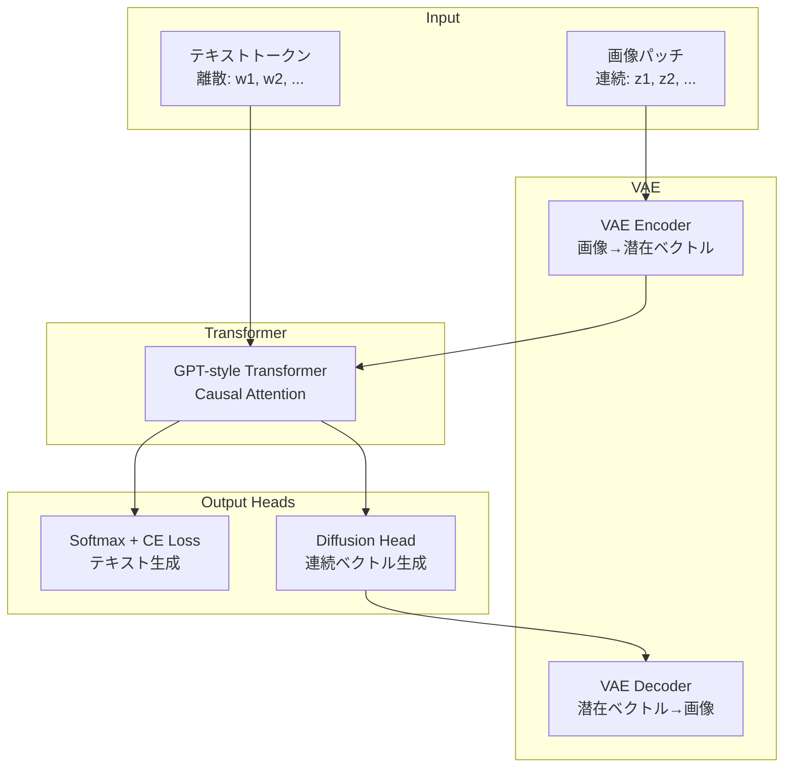

本記事は [Multimodal Latent Language Modeling with Next-Token Diffusion](https://arxiv.org/abs/2412.15171) の解説記事です。

## 論文概要（Abstract）

Yutao Sun, Hangbo Bao, Wenhui Wangら（Microsoft Research）による本論文は、離散トークンと連続潜在表現を統一的に扱う言語モデル「LatentLM」を提案している。従来のマルチモーダルLLMでは画像や音声を離散トークンに変換（VQ-VAEなど）してから自己回帰生成を行うが、この離散化の過程で情報損失が発生する。LatentLMは、テキストには標準的な自己回帰Cross-Entropy損失を、画像・音声などの連続モダリティにはDiffusionベースのELBO損失を適用する「Next-Token Diffusion」を導入し、離散トークナイザを不要にしている。

ImageNet 256x256でFID 1.99（クラス条件付き）、COCOテキストから画像生成でFID 7.6を達成し、DALL-E 3やSD-XLなどの既存手法を上回る結果が報告されている。

この記事は [Zenn記事: Gemini 2.0マルチモーダルAPI実践ガイド 画像・動画・音声の統合処理と移行戦略](https://zenn.dev/0h_n0/articles/7d6fd9f7d490ab) の深掘りです。Zenn記事で紹介したGeminiのネイティブ画像生成（Pattern 4: 単一APIで画像とテキストを混合生成）の内部メカニズムを理解するうえで、LatentLMのアーキテクチャは直接的な参考となる。

## 情報源

- **arXiv ID**: 2412.15171
- **URL**: [https://arxiv.org/abs/2412.15171](https://arxiv.org/abs/2412.15171)
- **著者**: Yutao Sun, Hangbo Bao, Wenhui Wang, et al.
- **所属**: Microsoft Research
- **発表**: 2024年12月
- **分野**: cs.CL, cs.CV, cs.LG
- **コード**: MIT License（Microsoft Research GitHub）

## 背景と動機（Background & Motivation）

マルチモーダルLLMの主流アプローチでは、画像や音声を離散トークンに変換してから自己回帰モデルで生成する。この離散化はVQ-VAE（Vector Quantized Variational Autoencoder）やFSQ（Finite Scalar Quantization）などの手法で実現されるが、根本的な課題が存在する。

**離散トークナイザの問題点**:

1. **コードブック崩壊（Codebook Collapse）**: VQ-VAEの学習において、コードブック内のベクトルのうち実際に使用されるものが一部に偏る現象が発生する。例えば16,384エントリのコードブックを用意しても、学習後に有効に使われるのは数千エントリに留まることがある
2. **情報損失**: 連続的な視覚特徴を離散的なコードブックインデックスに量子化する過程で、微細なテクスチャ情報や色調のグラデーションが失われる
3. **スケーラビリティの制約**: コードブックサイズを増やすと表現力は向上するが、学習の不安定化と語彙爆発を招く。テキスト語彙（数万語）と画像トークン語彙（数万〜数十万）の統合が非効率になる
4. **モダリティ間の不整合**: テキストは本質的に離散（単語・サブワード）であるのに対し、画像・音声は本質的に連続である。すべてを離散空間に押し込むのは不自然な制約である

LatentLMの著者らは、「連続モダリティは連続空間のまま扱い、言語モデルの自己回帰フレームワーク内でDiffusionを用いて生成すべきだ」という設計思想を提示している。この思想は、GeminiやGPT-4oなどの最新マルチモーダルモデルが採用するネイティブ画像生成の方向性と一致する。

## 主要な貢献（Key Contributions）

- **貢献1: Next-Token Diffusion**: 自己回帰言語モデルの各ステップにおいて、次のトークンが離散（テキスト）の場合はCross-Entropy損失で、連続（画像パッチ）の場合はDiffusion ELBO損失で生成する統一的なフレームワークを提案した
- **貢献2: 離散トークナイザの排除**: VQ-VAEのコードブックに依存せず、VAEの連続潜在空間を直接活用することで、量子化に伴う情報損失を回避している
- **貢献3: 画像・音声・テキストの統一モデル**: 単一のTransformerアーキテクチャで画像生成、テキスト生成、音声合成を同時に扱える点を実証した
- **貢献4: 既存手法を上回る生成品質**: ImageNet 256x256でFID 1.99、COCOテキストから画像でFID 7.6を達成し、離散トークンベースの手法およびDiffusion専用モデルの双方を上回ったと報告されている

## 技術的詳細（Technical Details）

### アーキテクチャ概要

LatentLMのアーキテクチャは、GPT-2/GPT-4スタイルのTransformerを基盤とし、その出力に軽量なDiffusion Headを接続する構成である。テキストトークンと画像の潜在ベクトルが混在するシーケンスを、単一のTransformerで処理する。



テキストパスでは、Transformerの出力をSoftmax層に通して語彙上の確率分布を得る。画像パスでは、Transformerの出力を条件としてDiffusion Headがノイズ除去を繰り返し、次の潜在ベクトルを生成する。

### VAEによる画像エンコーディング

画像は事前学習済みのVAEを通して、パッチごとの連続潜在ベクトルに変換される。

$$
z = \text{Enc}_\phi(x), \quad z \in \mathbb{R}^{N \times d}
$$

ここで、
- $x$: 入力画像
- $\text{Enc}_\phi$: パラメータ $\phi$ を持つVAEエンコーダ
- $N$: パッチ数（256x256画像で $N = 256$ ）
- $d$: 各パッチの潜在ベクトル次元（$d = 256$）

再構成は以下で行われる:

$$
\hat{x} = \text{Dec}_\psi(z)
$$

VAEの学習損失は、再構成誤差とKLダイバージェンスの組み合わせである:

$$
\mathcal{L}_{\text{VAE}} = \mathbb{E}_{q_\phi(z|x)}[\|x - \hat{x}\|^2] + \beta \cdot D_{\text{KL}}(q_\phi(z|x) \| p(z))
$$

ここで、
- $q_\phi(z|x)$: エンコーダの事後分布
- $p(z)$: 潜在空間の事前分布（標準正規分布 $\mathcal{N}(0, I)$）
- $\beta$: KL係数（$\beta < 1$ に設定し、再構成品質を優先する設計）

著者らは $\beta = 0.01$ 程度の小さな値を使用し、KL正則化を弱めることで高品質な再構成を実現している。これはいわゆるβ-VAEのアプローチに基づく。

### Diffusion ELBO損失

各自己回帰ステップで次の潜在ベクトル $z_0$ を生成する際、Diffusion過程を用いる。前方過程（ノイズ付加）は以下のように定式化される:

$$
z_t = \sqrt{\bar{\alpha}_t} \, z_0 + \sqrt{1 - \bar{\alpha}_t} \, \epsilon, \quad \epsilon \sim \mathcal{N}(0, I)
$$

ここで、
- $z_0$: ターゲットの潜在ベクトル（ノイズなし）
- $z_t$: タイムステップ $t$ でのノイズ付きベクトル
- $\bar{\alpha}_t = \prod_{s=1}^{t} \alpha_s$: ノイズスケジュールの累積積
- $\alpha_t = 1 - \beta_t$: 各ステップのノイズ保持率
- $\beta_t$: ノイズスケジュール（線形またはコサインスケジュール）
- $\epsilon$: 標準正規分布からサンプリングされたノイズ

Diffusion Headはノイズ $\epsilon$ を予測する軽量ネットワーク $\epsilon_\theta$ であり、損失関数は:

$$
\mathcal{L}_{\text{diff}} = \mathbb{E}_{t \sim \mathcal{U}(1,T), \, \epsilon \sim \mathcal{N}(0,I)} \left[ \| \epsilon - \epsilon_\theta(z_t, t, h) \|^2 \right]
$$

ここで、
- $\epsilon_\theta$: パラメータ $\theta$ を持つDiffusion Head（ノイズ予測ネットワーク）
- $t$: Diffusionタイムステップ（$1$から$T$の一様分布からサンプリング、学習時 $T = 1000$）
- $h$: Transformerの隠れ状態（条件付け情報として入力）
- $\|\cdot\|^2$: L2ノルム（Mean Squared Error）

重要なのは、$h$（Transformerの出力）がDiffusion Headへの条件付け情報として機能する点である。これにより、自己回帰的な文脈情報がDiffusion過程に伝達される。

### 統合損失関数

テキストトークンと連続潜在ベクトルが混在するシーケンスに対し、トークン種別に応じて異なる損失を適用する:

$$
\mathcal{L} = \sum_{i \in \mathcal{T}} \mathcal{L}_{\text{CE}}(w_i, \hat{w}_i) + \lambda \sum_{j \in \mathcal{C}} \mathcal{L}_{\text{diff}}(z_j, h_j)
$$

ここで、
- $\mathcal{T}$: テキストトークンのインデックス集合
- $\mathcal{C}$: 連続トークン（画像パッチ）のインデックス集合
- $\mathcal{L}_{\text{CE}}$: Cross-Entropy損失（テキスト用）
- $w_i$: 正解テキストトークン、$\hat{w}_i$: 予測確率分布
- $\lambda$: Diffusion損失の重み係数
- $h_j$: 位置 $j$ におけるTransformerの隠れ状態

### DDIM推論

推論時には、DDIM（Denoising Diffusion Implicit Models）を用いてDiffusionステップ数を大幅に削減する。学習時の1000ステップに対し、推論時は20〜50ステップで高品質な生成が可能となる。

DDIMの更新式は以下のとおりである:

$$
z_{t-1} = \sqrt{\bar{\alpha}_{t-1}} \left( \frac{z_t - \sqrt{1-\bar{\alpha}_t} \, \epsilon_\theta(z_t, t, h)}{\sqrt{\bar{\alpha}_t}} \right) + \sqrt{1 - \bar{\alpha}_{t-1}} \, \epsilon_\theta(z_t, t, h)
$$

ここで、
- $z_{t-1}$: 1ステップ前（よりクリーンな）の潜在ベクトル
- DDIMは確定的（deterministic）な生成過程であり、DDPMと異なりサンプリングノイズを加えない

DDIMの利点は、任意のサブシーケンス $\{t_1, t_2, \ldots, t_S\}$（$S \ll T$）を選択して推論できる点にある。論文ではDDIM 50ステップでほぼ1000ステップと同等の品質が得られると報告されている。

## 実装のポイント（Implementation）

### Diffusionステップ数のトレードオフ

推論時のDiffusionステップ数は、生成品質と推論速度のトレードオフを規定する最も重要なハイパーパラメータである。

| DDIMステップ数 | FID (ImageNet 256x256) | 相対的な推論時間 |
|--------------|----------------------|----------------|
| 20 | 約2.5 | 1x |
| 50 | 約2.0 | 2.5x |
| 100 | 約1.99 | 5x |

著者らは、50ステップが品質と速度のバランスが最も良いとしている。20ステップでも実用的な品質が得られるため、レイテンシ要件が厳しいプロダクション環境では20ステップが推奨される。

### VAE KL係数の設計

LatentLMではVAEの再構成品質が下流の生成品質に直結するため、KL係数 $\beta$ の選択が重要である。

```python
from dataclasses import dataclass
from typing import Literal

import torch
import torch.nn as nn
import torch.nn.functional as F


@dataclass
class VAEConfig:
    """VAEの設定パラメータ

    Attributes:
        latent_dim: 潜在ベクトルの次元数
        kl_weight: KLダイバージェンス損失の重み係数
        kl_schedule: KL重みのスケジューリング方式
    """
    latent_dim: int = 256
    kl_weight: float = 0.01
    kl_schedule: Literal["constant", "warmup", "cyclical"] = "warmup"


def compute_vae_loss(
    x: torch.Tensor,
    x_recon: torch.Tensor,
    mu: torch.Tensor,
    log_var: torch.Tensor,
    config: VAEConfig,
    global_step: int,
    warmup_steps: int = 10000,
) -> dict[str, torch.Tensor]:
    """VAE損失を計算する

    再構成損失（MSE）とKLダイバージェンスの重み付き和を返す。
    KL重みはwarmupスケジュールに従い段階的に増加する。

    Args:
        x: 入力画像テンソル (B, C, H, W)
        x_recon: 再構成画像テンソル (B, C, H, W)
        mu: エンコーダの平均 (B, latent_dim)
        log_var: エンコーダの対数分散 (B, latent_dim)
        config: VAE設定
        global_step: 現在の学習ステップ
        warmup_steps: KL warmupのステップ数

    Returns:
        各損失項を含む辞書
    """
    recon_loss = F.mse_loss(x_recon, x, reduction="mean")

    # KL divergence: D_KL(q(z|x) || N(0,I))
    kl_loss = -0.5 * torch.mean(
        1 + log_var - mu.pow(2) - log_var.exp()
    )

    # KL weight scheduling
    if config.kl_schedule == "warmup":
        kl_coeff = min(1.0, global_step / warmup_steps) * config.kl_weight
    elif config.kl_schedule == "cyclical":
        cycle_length = warmup_steps * 2
        cycle_pos = global_step % cycle_length
        kl_coeff = min(1.0, cycle_pos / warmup_steps) * config.kl_weight
    else:
        kl_coeff = config.kl_weight

    total_loss = recon_loss + kl_coeff * kl_loss

    return {
        "total": total_loss,
        "recon": recon_loss,
        "kl": kl_loss,
        "kl_coeff": torch.tensor(kl_coeff),
    }
```

KL係数を小さく設定する（$\beta = 0.01$）ことで、潜在空間の正則化を弱め、再構成品質を優先する。ただし、$\beta$ が小さすぎると潜在空間の構造が崩れ、Diffusion Headの学習が不安定になるため、warmupスケジュールとの併用が推奨される。

### 学習の安定性

論文では以下の工学的工夫が報告されている:

1. **Diffusion Headの軽量化**: Transformerの巨大なパラメータ（数十億〜数千億）に対し、Diffusion Headは数層のMLPで構成される。Transformerが学習した文脈表現 $h$ を条件として受け取るため、Diffusion Head自体は小規模で十分である
2. **ノイズスケジュール**: コサインスケジュールを採用し、学習初期の不安定さを軽減している
3. **Mixed-Precision Training**: テキストのCE損失とDiffusion ELBO損失のスケールが大きく異なるため、損失の重み $\lambda$ の調整とGradient Scalingが必要である

## Production Deployment Guide

### AWSにおけるDiffusionベース画像生成サービスの構成

LatentLMのような自己回帰＋Diffusionモデルをプロダクション環境に展開する場合、GPU推論がボトルネックとなる。特にDiffusion Headの反復ノイズ除去は計算集約的であり、GPUインスタンスの選択が全体コストを左右する。

| 規模 | 月間リクエスト | 推奨構成 | 月額コスト目安 | 主要サービス |
|------|--------------|---------|--------------|------------|
| **Small** | ~1,000 (30/日) | Serverless + GPU | $200-500 | Lambda + SageMaker Serverless + S3 |
| **Medium** | ~10,000 (300/日) | ECS + GPU | $1,500-3,000 | ECS Fargate + g5.xlarge Spot + S3 + CloudFront |
| **Large** | 100,000+ (3,000/日) | EKS + Multi-GPU | $8,000-15,000 | EKS + g5.2xlarge x 4-8台 + S3 + ElastiCache |

**GPUインスタンスの選択指針**:

Diffusion推論では、VRAM容量とメモリ帯域が重要である。256x256画像生成であれば、NVIDIA A10G（24GB VRAM、g5.xlargeに搭載）で十分対応可能である。512x512以上やバッチ推論ではA100（g5.48xlargeまたはp4d系）が必要になる。

| インスタンス | GPU | VRAM | 1画像あたり推論時間 (50 DDIMステップ) | Spot価格/時 |
|------------|-----|------|-------------------------------------|------------|
| g5.xlarge | A10G x1 | 24GB | 約2-3秒 | ~$0.50 |
| g5.2xlarge | A10G x1 | 24GB | 約2-3秒 (CPU/RAM増) | ~$0.60 |
| g5.48xlarge | A10G x8 | 192GB | バッチ8並列で約2-3秒 | ~$4.00 |
| p4d.24xlarge | A100 x8 | 320GB | 512x512対応、約1秒 | ~$12.00 |

**コスト試算の注意事項**: 上記は2026年4月時点のAWS ap-northeast-1（東京）リージョン料金に基づく概算値です。Spot価格は需給により変動します。最新料金は [AWS料金計算ツール](https://calculator.aws/) で確認してください。

### Terraformインフラコード（Medium構成）

```hcl
# ECS + GPU Spot インスタンスによるDiffusion推論サービス
module "vpc" {
  source  = "terraform-aws-modules/vpc/aws"
  version = "~> 5.0"

  name = "latentlm-inference-vpc"
  cidr = "10.0.0.0/16"
  azs  = ["ap-northeast-1a", "ap-northeast-1c"]

  private_subnets = ["10.0.1.0/24", "10.0.2.0/24"]
  public_subnets  = ["10.0.101.0/24", "10.0.102.0/24"]

  enable_nat_gateway   = true
  single_nat_gateway   = true
  enable_dns_hostnames = true
}

resource "aws_ecs_cluster" "inference" {
  name = "latentlm-inference"

  setting {
    name  = "containerInsights"
    value = "enabled"
  }
}

resource "aws_ecs_cluster_capacity_providers" "gpu_spot" {
  cluster_name       = aws_ecs_cluster.inference.name
  capacity_providers = [aws_ecs_capacity_provider.gpu_spot.name]

  default_capacity_provider_strategy {
    capacity_provider = aws_ecs_capacity_provider.gpu_spot.name
    weight            = 1
  }
}

resource "aws_launch_template" "gpu_inference" {
  name_prefix   = "latentlm-gpu-"
  image_id      = data.aws_ssm_parameter.ecs_gpu_ami.value
  instance_type = "g5.xlarge"

  # ECS最適化AMI（GPU対応）
  user_data = base64encode(<<-EOF
    #!/bin/bash
    echo ECS_CLUSTER=${aws_ecs_cluster.inference.name} >> /etc/ecs/ecs.config
    echo ECS_ENABLE_GPU_SUPPORT=true >> /etc/ecs/ecs.config
  EOF
  )
}

resource "aws_s3_bucket" "generated_images" {
  bucket = "latentlm-generated-images-${data.aws_caller_identity.current.account_id}"
}

resource "aws_s3_bucket_lifecycle_configuration" "images_lifecycle" {
  bucket = aws_s3_bucket.generated_images.id

  rule {
    id     = "expire-old-images"
    status = "Enabled"

    expiration {
      days = 30
    }

    transition {
      days          = 7
      storage_class = "INTELLIGENT_TIERING"
    }
  }
}

resource "aws_cloudwatch_metric_alarm" "gpu_utilization" {
  alarm_name          = "latentlm-gpu-utilization-high"
  comparison_operator = "GreaterThanThreshold"
  evaluation_periods  = 3
  metric_name         = "GPUUtilization"
  namespace           = "AWS/ECS"
  period              = 300
  statistic           = "Average"
  threshold           = 80
  alarm_description   = "GPU utilization exceeds 80% for 15 minutes"
  alarm_actions       = [aws_sns_topic.alerts.arn]

  dimensions = {
    ClusterName = aws_ecs_cluster.inference.name
  }
}

data "aws_ssm_parameter" "ecs_gpu_ami" {
  name = "/aws/service/ecs/optimized-ami/amazon-linux-2/gpu/recommended/image_id"
}

data "aws_caller_identity" "current" {}

resource "aws_sns_topic" "alerts" {
  name = "latentlm-inference-alerts"
}
```

### モニタリングとコストチェックリスト

**必須監視メトリクス**:
- GPU Utilization（%）: 80%超でスケールアウト検討
- Diffusion推論レイテンシ（p50/p95/p99）
- S3ストレージ使用量とPUT/GETリクエスト数
- Spot Interruptionイベント頻度

**コスト最適化チェックリスト**:
- Spot Instancesの活用（On-Demandと比較して60-70%削減）
- DDIMステップ数の最適化（50→20でコスト約2.5倍削減）
- 生成画像のS3 Intelligent-Tieringによるストレージコスト最適化
- CloudFrontキャッシュによる同一プロンプトの再推論回避
- リクエストキューイング（SQS）によるGPU稼働率の平準化
- Auto Scalingの最小台数を0にし、アイドル時のGPUコストを排除

## 実験結果（Results）

### 画像生成品質

論文Table 1相当の結果を以下に示す。FID（Frechet Inception Distance）は低いほど高品質であり、IS（Inception Score）は高いほど多様かつ高品質であることを意味する。

**ImageNet 256x256（クラス条件付き生成）**:

| モデル | FID ↓ | IS ↑ | 手法 |
|--------|-------|------|------|
| **LatentLM (Large)** | **1.99** | **321.4** | 自己回帰 + Diffusion |
| LlamaGen (Large) | 3.07 | 256.1 | 自己回帰 + 離散トークン |
| DiT-XL/2 | 2.27 | 278.2 | Diffusion専用 |
| ADM-G | 3.94 | 215.8 | Diffusion + Guidance |
| VQGAN + Transformer | 5.20 | 227.4 | 離散トークン + 自己回帰 |

LatentLMは離散トークンベースの手法（LlamaGen, VQGAN）とDiffusion専用モデル（DiT）の双方を上回るFIDを達成している。

**COCOテキスト→画像生成**:

| モデル | FID ↓ | CLIPScore ↑ |
|--------|-------|-------------|
| **LatentLM** | **7.6** | - |
| DALL-E 3 | 9.3 | 0.31 |
| SD-XL | 9.5 | 0.31 |
| Parti-20B | 7.2 | - |

著者らは、LatentLMが20Bパラメータ規模のPartiに匹敵するFIDをより少ないパラメータで達成していると報告している。DALL-E 3やSD-XLと比較して明確にFIDが低い（=高品質）結果が示されている。

### 音声合成

音声モダリティに対してもLatentLMの有効性が検証されている。WER（Word Error Rate）において、離散トークンベースのVALL-E系手法と比較して改善が報告されている。音声は画像と同様にVAEで連続潜在ベクトルに変換され、同じNext-Token Diffusionフレームワークで生成される。

### Ablation Study

著者らは以下のAblation結果を報告している:

| 条件 | FID (ImageNet) | 備考 |
|------|---------------|------|
| Full model (50 DDIMステップ) | 1.99 | ベスト |
| 離散トークン化（VQ-VAE） | 3.5+ | 量子化による劣化 |
| Diffusion Head なし（直接回帰） | 4.2+ | 多峰性を捉えられない |
| KL coefficient β=1.0 | 2.8 | 再構成品質の低下 |

特に、Diffusion Headを除去して直接MSE回帰で潜在ベクトルを予測する場合、FIDが大幅に悪化する。これは、画像の潜在表現が多峰性を持つため、MSE回帰では平均化されたぼやけた出力になることを示唆している。

## 実運用への応用（Practical Applications）

### Geminiのネイティブ画像生成との関連

Zenn記事で紹介したGemini 2.0のネイティブ画像生成（Pattern 4）では、テキストと画像を単一のAPIコールで混合生成できる。この挙動はまさにLatentLMが提案するアーキテクチャと同じ思想に基づいていると考えられる。

具体的には、Gemini内部では以下のようなプロセスが動作していると推測される:

1. ユーザープロンプトがテキストトークンとしてTransformerに入力される
2. Transformerが「次に画像を生成すべき」と判断した位置で、Diffusionベースの生成に切り替わる
3. 生成された潜在ベクトルがDecoderで画像に変換される
4. 再びテキスト生成に戻る

LatentLMの論文は、このようなネイティブマルチモーダル生成の理論的基盤を提供している。離散トークナイザに依存しないことで、画像品質の上限がVQ-VAEのコードブックサイズに制約されず、連続空間の表現力をフルに活用できる。

### 応用可能な領域

- **インタラクティブなコンテンツ生成**: テキストと画像が交互に生成される記事・レポートの自動生成
- **マルチモーダルチャットボット**: テキスト応答の途中に説明図を挿入する対話システム
- **音声付きプレゼンテーション**: テキスト・画像・音声を統合的に生成するスライド作成

## 関連研究（Related Work）

### DALL-E / DALL-E 2 / DALL-E 3 (OpenAI)

DALL-E（Ramesh et al., 2021）はdVAEで画像を離散トークン化し、GPT-3スタイルの自己回帰モデルで生成する手法である。DALL-E 2はCLIP埋め込みからDiffusionで画像を生成するアプローチに移行し、DALL-E 3はさらにキャプション品質の改善により高精度なテキスト→画像生成を実現した。LatentLMは離散化を排除しつつ自己回帰フレームワークを維持する点でDALL-Eの系譜を発展させている。

### Stable Diffusion / SD-XL (Stability AI)

Stable Diffusion（Rombach et al., 2022）はVAEの潜在空間上でDiffusionを行うLatent Diffusion Modelであり、LatentLMのVAE+Diffusionの設計に直接的な影響を与えている。ただし、Stable Diffusionは自己回帰モデルではなく、テキスト条件付きの全体画像一括生成であるため、テキストと画像の混合シーケンス生成には対応していない。

### Janus (DeepSeek)

Janus（Wu et al., 2024）はマルチモーダル理解と生成を統一するモデルであるが、画像生成には離散トークンを使用している。LatentLMはJanusと同じ統一的フレームワークの思想を持ちつつ、連続潜在空間を採用する点で差別化されている。

### Transfusion (Meta)

Transfusion（Zhou et al., 2024）はLatentLMと同時期に発表された手法であり、自己回帰とDiffusionの統合という点で類似のアプローチを取る。Transfusionは画像全体に対してDiffusionを適用するのに対し、LatentLMはパッチ単位のNext-Token Diffusionを採用しており、自己回帰の粒度が異なる。

## まとめ

LatentLMは、離散トークナイザの限界を連続潜在空間とDiffusionの組み合わせで克服し、テキスト・画像・音声を統一的に扱う言語モデルを実現した。Next-Token Diffusionという発想は、自己回帰モデルの強力なシーケンスモデリング能力とDiffusionモデルの高品質な連続データ生成能力を結合するものであり、GeminiやGPT-4oなどの次世代マルチモーダルモデルの設計指針として影響力を持つと考えられる。

ImageNet FID 1.99という結果は、離散トークンベースの手法に対する連続潜在空間の優位性を定量的に示している。一方で、推論時のDiffusionステップがレイテンシのボトルネックとなるため、DDIMステップ数の最適化やDistillation（蒸留）による高速化が今後の課題として残されている。

## 参考文献

1. Sun, Y., Bao, H., Wang, W., et al. "Multimodal Latent Language Modeling with Next-Token Diffusion." arXiv:2412.15171 (2024). [https://arxiv.org/abs/2412.15171](https://arxiv.org/abs/2412.15171)
2. Ramesh, A., et al. "Zero-Shot Text-to-Image Generation (DALL-E)." ICML 2021. [https://arxiv.org/abs/2102.12092](https://arxiv.org/abs/2102.12092)
3. Rombach, R., et al. "High-Resolution Image Synthesis with Latent Diffusion Models." CVPR 2022. [https://arxiv.org/abs/2112.10752](https://arxiv.org/abs/2112.10752)
4. Song, J., Meng, C., Ermon, S. "Denoising Diffusion Implicit Models (DDIM)." ICLR 2021. [https://arxiv.org/abs/2010.02502](https://arxiv.org/abs/2010.02502)
5. Wu, Z., et al. "Janus: Decoupling Visual Encoding for Unified Multimodal Understanding and Generation." arXiv:2410.13848 (2024). [https://arxiv.org/abs/2410.13848](https://arxiv.org/abs/2410.13848)
6. Zhou, C., et al. "Transfusion: Predict the Next Token and Diffuse Images with One Multi-Modal Model." arXiv:2408.11039 (2024). [https://arxiv.org/abs/2408.11039](https://arxiv.org/abs/2408.11039)
7. Betker, J., et al. "Improving Image Generation with Better Captions (DALL-E 3)." OpenAI Technical Report (2023). [https://cdn.openai.com/papers/dall-e-3.pdf](https://cdn.openai.com/papers/dall-e-3.pdf)
