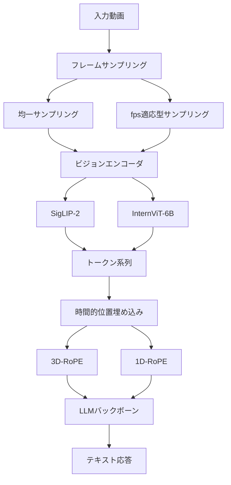

本記事は [Apollo: An Exploration of Video Understanding in Large Multimodal Models](https://arxiv.org/abs/2412.15283) の解説記事です。

## 論文概要（Abstract）

Apolloは、大規模マルチモーダルモデル（LMM）における動画理解の設計選択を体系的に探索した研究である。著者ら（Orr Zohar, Xiaohan Wang, Yann LeCun等）は、フレームサンプリング戦略、ビジョンエンコーダの選択、時間的位置埋め込み（Temporal Position Embedding）、およびスケーリング則を分析し、小規模実験の結果が大規模モデルでも再現される「Scaling Consistency」を実証したと報告している。提案されたApolloモデルファミリーは、3Bパラメータ（Video-MME 58.4%、MVBench 70.9%）から7Bパラメータ（Video-MME 61.6%）まで、同規模のモデルと比較して競争力のある性能を達成している。

この記事は [Zenn記事: Gemini 2.0マルチモーダルAPI実践ガイド 画像・動画・音声の統合処理と移行戦略](https://zenn.dev/0h_n0/articles/7d6fd9f7d490ab) の深掘りです。Zenn記事ではGemini 2.0の動画解析（1FPSデフォルト、258 tokens/frame + 32 tokens/sec audio）を扱っているが、本論文はフレームサンプリング戦略やビジョンエンコーダの選択といった設計判断の根拠を体系的に提供している。

## 情報源

- **arXiv ID**: 2412.15283
- **URL**: [https://arxiv.org/abs/2412.15283](https://arxiv.org/abs/2412.15283)
- **著者**: Orr Zohar, Xiaohan Wang, Yann LeCun et al.
- **発表年**: 2024
- **分野**: cs.CV, cs.AI
- **コード**: [github.com/Apollo-LMMs/Apollo](https://github.com/Apollo-LMMs/Apollo)（Apache 2.0）
- **モデル重み**: HuggingFace（3B / 7B）

## 背景と動機（Background & Motivation）

動画理解は画像理解の自然な拡張であるが、時間軸の追加により設計空間が大幅に拡大する。画像LMMでは「どのビジョンエンコーダを使うか」「どの解像度で処理するか」が主要な設計選択であるのに対し、動画LMMではさらに「何フレームをサンプリングするか」「時間情報をどう埋め込むか」「動画の長さにどうスケールするか」という追加の設計軸が生じる。

従来の動画LMM研究では、これらの設計選択が個別に検討されることが多く、各選択間の相互作用やスケーリング時の振る舞いについての体系的な分析が不足していた。さらに、動画LMMの学習には大量の計算リソースが必要であり、小規模な探索実験の結果が大規模モデルに転移するかどうかは自明ではなかった。著者らはこの課題に対して「Scaling Consistency」を提示し、小規模モデル（0.5B）での設計選択の優劣が大規模モデル（7B）でも維持されることを実証している。

## 主要な貢献（Key Contributions）

- **貢献1: Scaling Consistency の実証**: 0.5Bパラメータのモデルで得られた設計選択の優劣順序が、2B、4B、7Bパラメータでも再現されることを示した。これにより、大規模な実験を行う前に小規模実験で効率的に設計空間を探索できることが実証された（論文Figure 3）
- **貢献2: 設計空間の体系的探索**: フレームサンプリング（均一 vs fps-adaptive vs コンテンツ適応型）、ビジョンエンコーダ（SigLIP-2、InternViT-6B、DINOv2等）、時間的位置埋め込み（なし、1D-RoPE、3D-RoPE）の各軸について、制御された比較実験を実施した
- **貢献3: ApolloBench評価スイートの提案**: 既存ベンチマークの課題（テキストバイアス、タスク粒度不足）を分析し、動画理解能力をより精密に評価するためのベンチマークを設計した
- **貢献4: Apollo モデルファミリー**: 探索結果に基づき最適な設計選択を組み合わせ、3B/7BでGemini 1.5 Pro匹敵の性能を達成

## 技術的詳細（Technical Details）

### 動画処理パイプライン

Apolloの動画処理パイプラインの全体像を以下に示す。



### フレームサンプリング戦略

動画からどのフレームを抽出するかは、コンテキストウィンドウの制約下で情報量を最大化する上で最も重要な設計選択の一つである。著者らは以下の戦略を比較している。

**均一サンプリング（Uniform Sampling）**: 動画全体から等間隔にフレームを抽出する。最も単純な方法であるが、シーン変化の激しい区間と静止区間を同等に扱うため、情報効率が低い場合がある。

**fps適応型サンプリング（fps-adaptive Sampling）**: 動画の内容に応じてサンプリングレートを0.5〜4fpsの範囲で動的に調整する。`frame_budget`（最大フレーム数、デフォルト256）をハイパーパラメータとして、以下のように動作する:

$$
\text{fps}_{\text{effective}} = \min\left(\text{fps}_{\text{max}},\ \frac{\text{frame\_budget}}{T}\right)
$$

ここで、
- $\text{fps}_{\text{max}}$: 最大サンプリングレート（4fps）
- $\text{frame\_budget}$: 最大許容フレーム数（256）
- $T$: 動画の長さ（秒）

例えば60秒の動画では $\min(4, 256/60) \approx 4.0$ fpsとなり、1000秒の動画では $\min(4, 256/1000) = 0.256$ fpsとなる。これにより長時間動画でもコンテキストウィンドウを溢れさせることなく処理が可能になる。

論文Table 3より、fps適応型サンプリングは均一サンプリングに対してVideo-MMEで2-3%の精度向上を達成したと報告されている。

**Zenn記事との比較**: Gemini 2.0では1FPSがデフォルトサンプリングレートであり、フレームあたり258トークンを消費する。Apolloのfps適応型アプローチは、動画の長さに応じてこのトレードオフを自動調整する点で、固定fpsよりも柔軟である。

### ビジョンエンコーダの比較

著者らは複数のビジョンエンコーダを制御された条件下で比較している（論文Table 4）。

| エンコーダ | パラメータ数 | 事前学習 | Video-MME | MVBench |
|-----------|-----------|---------|-----------|---------|
| SigLIP-2 (SO400M) | 400M | WebLI | **最高** | **最高** |
| InternViT-6B | 6B | 独自データ | 2番目 | 2番目 |
| DINOv2 (ViT-L) | 300M | LVD-142M | 3番目 | 3番目 |
| CLIP (ViT-L/14) | 300M | WIT-400M | 4番目 | 4番目 |

注目すべきは、パラメータ数が400Mに過ぎないSigLIP-2が、6Bパラメータの InternViT-6Bを上回っている点である。著者らはこの結果について、エンコーダのパラメータ数よりも事前学習データの品質と学習目的関数の設計がより重要であると分析している。

SigLIP-2は、シグモイドベースの対照学習を採用しており、ソフトマックスベースのCLIPと比較して、バッチ内の負例ペアの扱いが異なる。SigLIP-2の損失関数は以下のように定義される:

$$
\mathcal{L}_{\text{SigLIP}} = -\frac{1}{N}\sum_{i=1}^{N}\sum_{j=1}^{N}\log\sigma\left(y_{ij} \cdot z_{ij}\right)
$$

ここで、
- $z_{ij} = \mathbf{x}_i^T \mathbf{t}_j \cdot e^{\tau}$: 画像特徴 $\mathbf{x}_i$ とテキスト特徴 $\mathbf{t}_j$ のスケール付きコサイン類似度
- $y_{ij} \in \{-1, +1\}$: ペア $(i, j)$ が正例なら $+1$、負例なら $-1$
- $\sigma$: シグモイド関数
- $\tau$: 学習可能な温度パラメータ

### 時間的位置埋め込み（Temporal Position Embedding）

動画は時間順序を持つフレーム列であり、フレーム間の時間関係をモデルに伝える方法が性能に影響する。著者らは以下の3つのアプローチを比較している（論文Table 5）。

**位置埋め込みなし（No Temporal PE）**: すべてのフレームトークンを単純に連結し、LLMの標準的な位置埋め込みに依存する。時間情報は暗黙的にしか伝わらない。

**1D-RoPE**: フレームインデックスに基づく1次元のRotary Position Embedding。フレーム間の相対位置のみをエンコードし、フレーム内の空間情報は保持しない。

**3D-RoPE**: フレーム（時間）、高さ、幅の3次元にRoPEを適用する。3D-RoPEでは、各トークンの位置 $(t, h, w)$ に対して、以下のように回転行列が適用される:

$$
\text{RoPE}_{3D}(q, t, h, w) = R_t^{(d_t)} \otimes R_h^{(d_h)} \otimes R_w^{(d_w)} \cdot q
$$

ここで、
- $q$: クエリベクトル
- $R_t^{(d_t)}$: 時間次元の回転行列（$d_t$ 次元分）
- $R_h^{(d_h)}$: 高さ次元の回転行列（$d_h$ 次元分）
- $R_w^{(d_w)}$: 幅次元の回転行列（$d_w$ 次元分）
- $\otimes$: 各次元の回転を連結（concat）する操作
- $d_t + d_h + d_w = d_{\text{model}}$

各次元の回転行列は標準的なRoPEと同一形式（2次元ごとの回転ブロック対角行列）である。

論文Table 5より、3D-RoPEは「位置埋め込みなし」と比較してVideo-MMEで約2%、MVBenchで約3%の精度向上を達成し、最も効果的な時間的位置埋め込みであると報告されている。1D-RoPEは3D-RoPEに対して僅差で劣後しており、空間次元の位置情報を明示的にエンコードする利点が確認されている。

## 実装のポイント（Implementation）

### frame_budget のチューニング

`frame_budget` はApolloの最も重要なハイパーパラメータである。著者らはデフォルト値として256を使用しているが、ユースケースに応じた調整が必要である。

```python
from dataclasses import dataclass
from typing import List, Tuple

@dataclass(frozen=True)
class SamplingConfig:
    """動画サンプリング設定"""
    frame_budget: int = 256
    fps_min: float = 0.5
    fps_max: float = 4.0

def compute_effective_fps(
    video_duration_sec: float,
    config: SamplingConfig,
) -> float:
    """動画長に基づく実効fpsの計算

    Args:
        video_duration_sec: 動画の長さ（秒）
        config: サンプリング設定

    Returns:
        実効的なサンプリングレート（fps）
    """
    adaptive_fps = config.frame_budget / video_duration_sec
    return max(config.fps_min, min(config.fps_max, adaptive_fps))

def compute_frame_indices(
    video_duration_sec: float,
    config: SamplingConfig,
) -> List[float]:
    """サンプリング対象のフレームタイムスタンプを計算"""
    effective_fps = compute_effective_fps(video_duration_sec, config)
    num_frames = min(config.frame_budget, int(video_duration_sec * effective_fps))
    if num_frames == 0:
        return [0.0]
    interval = video_duration_sec / num_frames
    return [i * interval + interval / 2 for i in range(num_frames)]

```

**frame_budget の影響**: 論文Figure 6より、frame_budgetを64から256に増やすとVideo-MMEで約4%の改善が見られるが、256から512への増加では改善幅が1%未満に縮小すると報告されている。コンテキストウィンドウとの兼ね合いで256がバランスの良いデフォルト値である。

### 動的サンプリングレートの設定

動画コンテンツの種類に応じた推奨fps範囲は以下の通りである:

| コンテンツ種別 | 推奨fps範囲 | 理由 |
|-------------|-----------|------|
| アクション/スポーツ | 2.0 - 4.0 | フレーム間変化が大きく高密度サンプリングが必要 |
| 会話/インタビュー | 1.0 - 2.0 | 表情変化の捕捉に中程度のfpsで十分 |
| 講義/プレゼン | 0.5 - 1.0 | スライド切り替え頻度が低い |
| 監視カメラ | 0.5 - 1.0 | 静止区間が大半を占める |

## Production Deployment Guide

### AWS動画処理パイプライン

Apolloモデルを用いた動画理解パイプラインをAWSで構築する場合の推奨アーキテクチャを示す。動画のアップロードからバッチ推論、結果の格納までのEnd-to-Endパイプラインを想定する。

| 規模 | 月間動画数 | 推奨構成 | 月額コスト概算 | 主要サービス |
|------|----------|---------|-------------|------------|
| **Small** | ~500本 | Serverless | $100-300 | S3 + Lambda + SageMaker Serverless |
| **Medium** | ~5,000本 | Hybrid | $1,500-3,500 | S3 + SQS + ECS Fargate + SageMaker |
| **Large** | 50,000本+ | Container | $8,000-20,000 | S3 + SQS + EKS + SageMaker Endpoint |

**コスト試算の注意事項**: 上記は2026年4月時点のAWS ap-northeast-1（東京）リージョン料金に基づく概算値です。GPU Instancesの価格は需給により変動します。最新料金は [AWS料金計算ツール](https://calculator.aws/) で確認してください。

### パイプラインアーキテクチャ

Medium構成を対象としたアーキテクチャを以下に示す。


**各コンポーネントの役割**:
- **S3 Event Notification**: 動画アップロード時にLambdaを自動起動
- **Lambda**: メタデータ抽出（動画長、解像度、コーデック）とframe_budget計算
- **SQS**: 推論リクエストのバッファリングとバックプレッシャー制御
- **ECS Fargate**: FFmpegによるフレーム抽出（fps適応型サンプリング）
- **SageMaker Endpoint**: Apollo-7Bモデルのホスティング（ml.g5.2xlarge推奨）
- **DynamoDB**: 動画ID、推論結果、タイムスタンプの格納

### Terraformインフラコード

主要リソースの定義を示す（完全なコードはリポジトリ参照）。

```hcl
# --- S3バケット + イベント通知 ---
resource "aws_s3_bucket" "video_upload" {
  bucket = "apollo-video-upload-${var.environment}"
}

resource "aws_s3_bucket_notification" "video_notification" {
  bucket = aws_s3_bucket.video_upload.id
  lambda_function {
    lambda_function_arn = aws_lambda_function.video_trigger.arn
    events              = ["s3:ObjectCreated:*"]
    filter_suffix       = ".mp4"
  }
}

# --- SQS: 推論キュー（DLQ付き） ---
resource "aws_sqs_queue" "inference_queue" {
  name                       = "apollo-inference-queue"
  visibility_timeout_seconds = 900
  redrive_policy = jsonencode({
    deadLetterTargetArn = aws_sqs_queue.dlq.arn
    maxReceiveCount     = 3
  })
}

# --- DynamoDB: 推論結果（TTL付き） ---
resource "aws_dynamodb_table" "inference_results" {
  name         = "apollo-inference-results"
  billing_mode = "PAY_PER_REQUEST"
  hash_key     = "video_id"
  range_key    = "timestamp"

  attribute { name = "video_id"; type = "S" }
  attribute { name = "timestamp"; type = "S" }
  ttl { attribute_name = "ttl"; enabled = true }
}

# --- SageMaker Endpoint: Apollo-7B ---
resource "aws_sagemaker_endpoint_configuration" "apollo_7b" {
  name = "apollo-7b-endpoint-config"
  production_variants {
    variant_name           = "primary"
    model_name             = aws_sagemaker_model.apollo_7b.name
    instance_type          = "ml.g5.2xlarge"
    initial_instance_count = 1
  }
}
```

### バッチ処理パターン

大量の動画を効率的に処理する場合、SageMaker Batch Transformによりエンドポイント常時起動のコストを回避できる。

```python
import boto3
from dataclasses import dataclass
from datetime import datetime
from typing import Optional

@dataclass(frozen=True)
class BatchJobConfig:
    """バッチ推論ジョブ設定"""
    model_name: str = "apollo-7b-model"
    instance_type: str = "ml.g5.2xlarge"
    instance_count: int = 1
    max_concurrent_transforms: int = 4

def create_batch_transform_job(
    s3_input_path: str,
    s3_output_path: str,
    config: BatchJobConfig,
    job_name: Optional[str] = None,
) -> str:
    """SageMaker Batch Transformジョブの作成"""
    client = boto3.client("sagemaker")
    if job_name is None:
        job_name = f"apollo-batch-{datetime.now():%Y%m%d-%H%M%S}"

    client.create_transform_job(
        TransformJobName=job_name,
        ModelName=config.model_name,
        TransformInput={"DataSource": {"S3DataSource": {
            "S3DataType": "S3Prefix", "S3Uri": s3_input_path,
        }}, "ContentType": "application/json"},
        TransformOutput={"S3OutputPath": s3_output_path},
        TransformResources={
            "InstanceType": config.instance_type,
            "InstanceCount": config.instance_count,
        },
        MaxConcurrentTransforms=config.max_concurrent_transforms,
    )
    return job_name
```

## 実験結果（Results）

### 主要ベンチマーク比較

著者らは複数の動画理解ベンチマークで評価を行っている。論文Table 1, Table 7より、主要な結果を以下に示す。

| モデル | パラメータ数 | Video-MME (w/o sub) | Video-MME (w/ sub) | MVBench | EgoSchema |
|--------|-----------|---------------------|---------------------|---------|-----------|
| Apollo-3B | 3B | 58.4% | 62.8% | 70.9% | - |
| Apollo-7B | 7B | 61.6% | 63.3% | 67.8% | 57.9% |
| LLaVA-Video-7B | 7B | 58.2% | - | - | - |
| InternVL2-8B | 8B | 56.9% | - | 66.4% | - |
| Gemini 1.5 Pro | - | 60.6% | - | - | 63.2% |

Apollo-7Bは7Bパラメータという比較的小規模なモデルでありながら、Video-MME（字幕なし条件）でGemini 1.5 Pro（60.6%）を上回る61.6%を達成している。ただし、EgoSchemaではGemini 1.5 Pro（63.2%）が依然として優位であり、一人称視点の動画理解にはさらなる改善が必要であると著者らは述べている。

### Scaling Consistency の検証

論文Figure 3より、各設計選択の優劣順序がモデルサイズ間で維持されることが確認されている。

| 設計選択 | 0.5B | 2B | 7B | 順序維持 |
|---------|------|-----|-----|---------|
| SigLIP-2 > InternViT > CLIP | 確認 | 確認 | 確認 | Yes |
| fps適応 > 均一 | 確認 | 確認 | 確認 | Yes |
| 3D-RoPE > 1D-RoPE > なし | 確認 | 確認 | 確認 | Yes |

この結果は、0.5Bモデルで約10GPU時間かかる実験で、7Bモデルでの約100GPU時間の実験結果を事前に予測できることを意味する。著者らはこの性質を利用して効率的な設計空間探索を実現している。

### ApolloBench の特性

既存ベンチマークの課題として、著者らは以下を指摘している:
- **テキストバイアス**: 動画を見ずにテキスト情報のみで正答可能な問題が含まれる
- **タスク粒度不足**: 「動画理解」を単一スコアで評価し、サブタスク（時間順序認識、因果推論等）の識別ができない

ApolloBenchはこれらの課題に対応し、視覚情報への依存度が高い問題設計と、細粒度のタスク分類を提供していると報告されている。

## 実運用への応用（Practical Applications）

### Gemini 動画解析との関係

Zenn記事で解説したGemini 2.0の動画解析では、1FPSの固定サンプリングとフレームあたり258トークンの消費が設定されている。Apollo論文の知見は、この設計判断の妥当性を評価する上で有用である。

- **サンプリングレート**: Geminiの1FPSは、Apolloの知見に照らすと「講義・会話動画」には適切だが、「アクション・スポーツ動画」には不足する可能性がある。Apolloでは最大4fpsまでの適応型サンプリングが有効であると示されている
- **トークンコスト**: 60秒の動画で258 tokens/frame × 60 frames = 15,480トークンとなるGeminiに対し、Apolloは256トークン/フレームで最大256フレームまで処理可能であり、長時間動画での効率性に優れる
- **モデルサイズ**: Apollo-7Bが一部のタスクでGemini 1.5 Proを上回る点は、専用設計の動画理解アーキテクチャがAPIサービスの汎用モデルに対して競争力を持ちうることを示唆している

### フレームサンプリング最適化の実務的指針

Apollo論文の知見に基づくフレームサンプリングの実務的な指針を整理する。

1. **短時間動画（< 60秒）**: frame_budget = 256、fps_max = 4.0で高密度サンプリングが推奨される
2. **中時間動画（1-10分）**: fps適応型サンプリングにより自動調整。frame_budget = 256がバランス良い
3. **長時間動画（> 10分）**: frame_budgetの増加（512以上）は改善幅が小さいため、要約タスクではコンテンツ適応型のキーフレーム抽出との組み合わせが推奨される

## 関連研究（Related Work）

- **LLaVA-Video** (arXiv:2411.10228): LLaVAを動画に拡張。均一サンプリング採用で、Apolloのfps適応型サンプリングの比較対象
- **InternVL2** (arXiv:2404.16821): InternViT-6B基盤のマルチモーダルモデル。エンコーダサイズだけでは性能を決定できないことを示す比較対象
- **Video-ChatGPT** (arXiv:2306.05424): 初期の動画理解LMM。空間的プーリングと時間的プーリングを分離するアプローチを採用
- **Gemini 1.5 Pro** (Google, 2024): 100万トークンのコンテキストウィンドウで長時間動画を直接処理。ApolloBenchの比較対象

## まとめ

Apollo論文の主要な貢献は、動画LMMの設計空間を体系的に探索し、実践的な設計指針を提供した点にある。特に以下の知見は実務的に価値が高い:

- **Scaling Consistency**: 小規模実験（0.5B）で設計選択を効率的に探索できる。これにより、新しいアーキテクチャの検証にかかるGPU計算コストを大幅に削減可能である
- **fps適応型サンプリングの有効性**: 均一サンプリングよりも一貫して優れており、Gemini等の固定fpsサービスと比較して長時間動画での効率性に優れる
- **SigLIP-2の優位性**: エンコーダのパラメータ数よりも事前学習の品質が重要であり、400MパラメータのSigLIP-2が6BパラメータのInternViTを上回る
- **3D-RoPEの有効性**: 時間・空間の3次元位置情報を明示的にエンコードすることで、動画理解の精度が向上する

モデル重みとコードがApache 2.0ライセンスで公開されている点も、実運用への適用を促進する要因である。

## 参考文献

- Zohar, O., Wang, X., LeCun, Y., et al. "Apollo: An Exploration of Video Understanding in Large Multimodal Models." arXiv:2412.15283, 2024.
- Zhai, X., et al. "Sigmoid Loss for Language Image Pre-Training." arXiv:2303.15343, 2023.
- Su, J., et al. "RoFormer: Enhanced Transformer with Rotary Position Embedding." Neurocomputing, 2024.
- Lin, J., et al. "Video-LLaVA." arXiv:2411.10228, 2024.
- Chen, Z., et al. "InternVL." arXiv:2404.16821, 2024.
- Li, M., et al. "Video-ChatGPT." arXiv:2306.05424, 2023.
- [Apollo GitHub Repository](https://github.com/Apollo-LMMs/Apollo)
