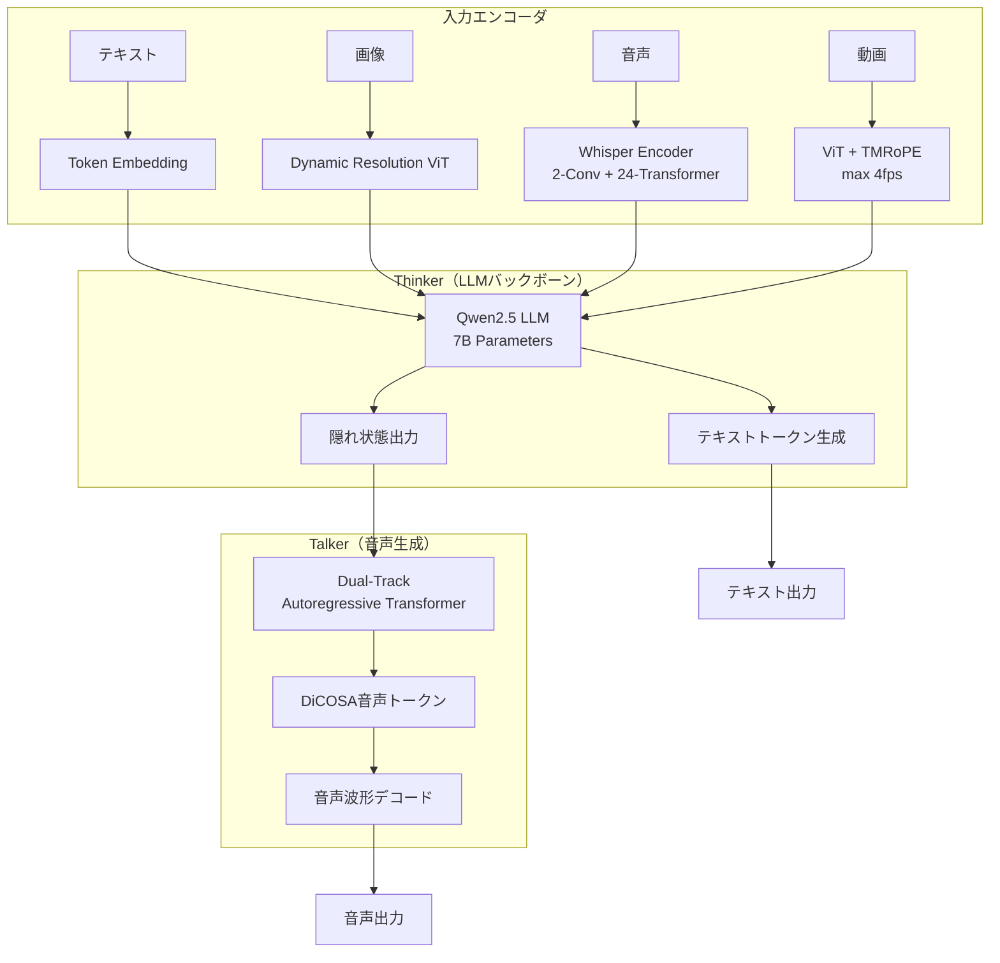

本記事は [Qwen2.5-Omni Technical Report](https://arxiv.org/abs/2502.07927) の解説記事です。

## 論文概要（Abstract）

Qwen2.5-Omniは、テキスト・画像・音声・動画を統合的に入力として受け取り、テキストと自然な音声をストリーミングで同時生成するend-to-endマルチモーダルモデルである。著者らは「Thinker-Talker」と呼ぶ新しいアーキテクチャを提案しており、Thinker（LLMバックボーン）がテキスト生成を担い、Talker（デュアルトラック自己回帰Transformer）が音声トークンを並列生成する構造を採用している。7Bパラメータという比較的コンパクトなモデルサイズでありながら、音声認識・画像理解・動画理解の各ベンチマークにおいてGPT-4o-miniを上回る性能を報告している。

この記事は [Zenn記事: Gemini 2.0マルチモーダルAPI実践ガイド 画像・動画・音声の統合処理と移行戦略](https://zenn.dev/0h_n0/articles/7d6fd9f7d490ab) の深掘りです。

## 情報源

- **arXiv ID**: 2502.07927
- **URL**: [https://arxiv.org/abs/2502.07927](https://arxiv.org/abs/2502.07927)
- **著者**: Jin Xu, Zhifang Guo, Jinzheng He, et al.（Qwen Team, Alibaba Group）
- **発表**: 2025年2月
- **分野**: cs.CL, cs.AI, cs.MM
- **コード・重み**: [Qwen/Qwen2.5-Omni-7B](https://huggingface.co/Qwen/Qwen2.5-Omni-7B)（HuggingFace）

## 背景と動機（Background & Motivation）

マルチモーダルAIの研究は急速に進展しているが、テキストと自然な音声をリアルタイムにストリーミング生成できるend-to-endモデルには技術的課題が多い。Zenn記事で解説したGemini 2.0のようなクラウドAPIは存在するが、オープンウェイトでの実現は限られている。

従来のマルチモーダルモデルには主に2つの問題があった。第一に、音声入力処理が外部ASRシステムに依存し、パイプライン全体のレイテンシが増大する点。第二に、テキスト生成と音声生成の逐次実行ではストリーミング出力が困難な点である。著者らはこれらを解決するため、テキスト推論と音声生成を構造的に分離しつつ並列実行可能なアーキテクチャを設計した。

## 主要な貢献（Key Contributions）

- **Thinker-Talkerアーキテクチャの提案**: テキスト生成（Thinker）と音声トークン生成（Talker）を分離した二段構成により、テキストと音声のストリーミング同時生成を実現した
- **TMRoPE（Time-aligned Multimodal RoPE）の導入**: 音声・動画・テキストの時間的アラインメントを位置エンコーディングレベルで統一する手法を提案し、異なるモダリティ間の時間同期を自然に扱えるようにした
- **DiCOSAコーデックによる離散音声トークン化**: 音声波形をディスクリートトークンに変換するコーデックを設計し、LLMの自己回帰フレームワーク内で音声生成を可能にした
- **7Bパラメータでの高い汎化性能**: 音声認識（LibriSpeech WER 1.3%）、画像理解（MMStar 64.2%）、動画理解（Video-MME 65.4%）、音声合成（MOS約4.2）の各タスクで競合モデルを上回る性能を達成した

## 技術的詳細（Technical Details）

### Thinker-Talkerアーキテクチャ

Qwen2.5-Omniの中核は、2つのコンポーネントに分離された生成パイプラインである。

**Thinker**はQwen2.5ベースのLLMバックボーンであり、マルチモーダル入力（テキスト・画像・音声・動画）を受け取ってテキストトークンを自己回帰的に生成する。音声入力はWhisperスタイルのエンコーダ（2層Conv + 24層Transformer）で特徴量に変換され、画像は動的解像度ViT（最大4fps）でエンコードされる。

**Talker**はデュアルトラック自己回帰Transformerであり、Thinkerが生成したテキストトークンの隠れ状態を入力として受け取り、DiCOSAコーデックに基づく離散音声トークンを並列に生成する。Thinkerの推論が1ステップ進むたびに、Talkerが対応する音声トークンを生成するため、テキストと音声のストリーミング同時出力が実現される。



### TMRoPE（Time-aligned Multimodal RoPE）

従来のRoPE（Rotary Position Embedding）はテキストトークンの1次元位置情報のみを扱うが、マルチモーダル入力では音声・動画の時間軸とテキストの順序軸を統一的に扱う必要がある。著者らはTMRoPEとして、各モダリティのトークンに対して時間軸に沿った位置IDを割り当てる手法を提案している。

RoPEの基本定義として、位置 $m$ の回転行列は以下で定義される:

$$
\text{RoPE}(x_m, m) = x_m \cdot e^{im\theta}
$$

ここで、
- $x_m$: 位置 $m$ のトークン埋め込みベクトル
- $\theta$: 周波数パラメータ（$\theta_j = 10000^{-2j/d}$、$d$ は次元数）

TMRoPEでは、位置ID $m$ を時間情報に基づいて割り当てる。具体的には、音声トークンの場合はフレームレート（例: 12.5Hz）に基づき、動画トークンの場合はサンプリングレート（最大4fps）に基づいて位置IDを計算する:

$$
m_{\text{audio}}(t) = \lfloor t \cdot f_{\text{audio}} \rfloor, \quad m_{\text{video}}(t) = \lfloor t \cdot f_{\text{video}} \rfloor
$$

ここで、
- $t$: 実時間（秒）
- $f_{\text{audio}}$: 音声のフレームレート（12.5Hz）
- $f_{\text{video}}$: 動画のサンプリングレート（最大4fps）

この設計により、同じ時刻 $t$ に対応する音声トークンと動画フレームが近い位置IDを持ち、Attention計算において時間的に近接するモダリティ間の相互参照が自然に促進される。

### DiCOSAコーデック

音声波形を離散トークンに変換するためのコーデックである。著者らは、Vector Quantization（VQ）を用いて音声特徴量を有限のコードブックにマッピングし、LLMの語彙空間と統合可能な離散表現を得ている。Talkerはこの離散音声トークンを自己回帰的に生成し、後段のデコーダが波形に復元する。

## 実装のポイント（Implementation）

音声エンコーダはWhisperアーキテクチャに準拠し、2層Conv + 24層Transformerで構成される。入力は16kHzサンプリング・80次元メルフィルタバンクで前処理される。画像エンコーダはQwen2-VLの動的解像度ViTを踏襲し、動画は最大4fpsでサンプリング後にTMRoPEで時間アラインメントを付与する。

ストリーミング推論時は、Thinkerが1トークン生成するたびに隠れ状態がTalkerに渡され、対応する音声チャンクが並列生成される。以下はHuggingFace Transformersを用いた推論例である:

```python
from transformers import AutoModelForCausalLM, AutoProcessor
from typing import Optional


def generate_multimodal_response(
    text_prompt: str,
    image_url: Optional[str] = None,
    audio_path: Optional[str] = None,
    model_name: str = "Qwen/Qwen2.5-Omni-7B",
    max_new_tokens: int = 512,
) -> dict[str, str]:
    """マルチモーダル入力からテキスト応答を生成する

    Args:
        text_prompt: テキストプロンプト
        image_url: 画像URL（省略可）
        audio_path: 音声ファイルパス（省略可）
        model_name: HuggingFaceモデルID
        max_new_tokens: 最大生成トークン数

    Returns:
        {"text": 生成テキスト} の辞書
    """
    processor = AutoProcessor.from_pretrained(model_name)
    model = AutoModelForCausalLM.from_pretrained(
        model_name, torch_dtype="auto", device_map="cuda",
        trust_remote_code=True,
    )

    content: list[dict] = []
    if image_url is not None:
        content.append({"type": "image", "image": image_url})
    if audio_path is not None:
        content.append({"type": "audio", "audio": audio_path})
    content.append({"type": "text", "text": text_prompt})

    messages = [{"role": "user", "content": content}]
    inputs = processor.apply_chat_template(
        messages, tokenize=True, return_tensors="pt",
        add_generation_prompt=True,
    ).to(model.device)

    outputs = model.generate(**inputs, max_new_tokens=max_new_tokens)
    decoded = processor.batch_decode(
        outputs[:, inputs["input_ids"].shape[1]:],
        skip_special_tokens=True,
    )
    return {"text": decoded[0]}
```

7Bパラメータモデルのため、FP16推論で約14GBのGPUメモリが必要である。NVIDIA A10G/L4（24GB）で動作可能であり、INT4/INT8量子化でRTX 4090等でも推論可能とされている。

## Production Deployment Guide

### AWS実装パターン（マルチモーダルモデルサービング）

Qwen2.5-OmniのようなGPU推論を伴うマルチモーダルモデルをAWS上に展開する場合のトラフィック量別推奨構成を示す。

| 規模 | 月間リクエスト | 推奨構成 | 月額コスト | 主要サービス |
|------|--------------|---------|-----------|------------|
| **Small** | ~3,000 (100/日) | Serverless + API | $50-150 | Lambda + Bedrock + DynamoDB |
| **Medium** | ~30,000 (1,000/日) | GPU Hybrid | $500-1,500 | ECS Fargate (API) + EC2 g5 (推論) |
| **Large** | 300,000+ (10,000/日) | GPU Cluster | $2,000-5,000 | EKS + Karpenter + g5.xlarge Spot |

**Small構成の詳細** (月額$50-150):

7Bモデルの自前ホスティングはSmall規模ではコスト効率が悪いため、Bedrockのマルチモーダルモデル（Claude 3.5等）をプロキシとして利用し、Qwen2.5-Omni固有の機能（音声生成）が不要なユースケースに対応する構成を想定する。

- **Lambda**: 512MB RAM, 30秒タイムアウト ($15/月) — API中継・前処理
- **Bedrock**: Claude 3.5 Haiku, Prompt Caching有効 ($80/月) — マルチモーダル推論
- **DynamoDB**: On-Demand ($10/月) — 推論結果キャッシュ・リクエストログ
- **S3**: 入力ファイル一時保存 ($5/月)
- **CloudWatch**: 基本監視 ($5/月)

**Large構成の詳細** (月額$2,000-5,000):

Qwen2.5-Omni 7Bモデルを自前でホスティングし、テキスト+音声のストリーミング生成を含むフル機能を提供する構成である。

- **EKS**: コントロールプレーン ($72/月)
- **EC2 Spot**: g5.xlarge (24GB VRAM, A10G) × 2-4台 (平均$900/月)
- **Karpenter**: GPU Nodeの自動スケーリング（Spot優先、On-Demandフォールバック）
- **EFS**: モデル重み共有ストレージ ($50/月) — Pod間でのモデルキャッシュ
- **ALB**: WebSocket/gRPCストリーミング対応ロードバランサー ($30/月)
- **ElastiCache Redis**: 推論結果キャッシュ ($15/月)

**コスト試算の注意事項**: 上記は2026年4月時点のAWS ap-northeast-1（東京）リージョン料金に基づく概算値です。GPU Spotインスタンスの可用性は時間帯により変動します。最新料金は [AWS料金計算ツール](https://calculator.aws/) で確認してください。

### Terraformインフラコード

**Small構成 (Serverless): Lambda + Bedrock + DynamoDB**

```hcl
module "vpc" {
  source  = "terraform-aws-modules/vpc/aws"
  version = "~> 5.0"

  name = "qwen-omni-vpc"
  cidr = "10.0.0.0/16"
  azs  = ["ap-northeast-1a", "ap-northeast-1c"]
  private_subnets = ["10.0.1.0/24", "10.0.2.0/24"]

  enable_nat_gateway   = false
  enable_dns_hostnames = true
}

resource "aws_iam_role" "lambda_bedrock" {
  name = "qwen-omni-lambda-role"

  assume_role_policy = jsonencode({
    Version = "2012-10-17"
    Statement = [{
      Action    = "sts:AssumeRole"
      Effect    = "Allow"
      Principal = { Service = "lambda.amazonaws.com" }
    }]
  })
}

resource "aws_iam_role_policy" "bedrock_invoke" {
  role = aws_iam_role.lambda_bedrock.id
  policy = jsonencode({
    Version = "2012-10-17"
    Statement = [
      {
        Effect   = "Allow"
        Action   = ["bedrock:InvokeModel", "bedrock:InvokeModelWithResponseStream"]
        Resource = "arn:aws:bedrock:ap-northeast-1::foundation-model/anthropic.claude-3-5-haiku*"
      },
      {
        Effect   = "Allow"
        Action   = ["s3:GetObject", "s3:PutObject"]
        Resource = "${aws_s3_bucket.input_files.arn}/*"
      }
    ]
  })
}

resource "aws_s3_bucket" "input_files" {
  bucket = "qwen-omni-input-files"

  lifecycle_rule {
    enabled = true
    expiration {
      days = 1
    }
  }
}

resource "aws_lambda_function" "multimodal_proxy" {
  filename      = "lambda.zip"
  function_name = "qwen-omni-proxy"
  role          = aws_iam_role.lambda_bedrock.arn
  handler       = "index.handler"
  runtime       = "python3.12"
  timeout       = 60
  memory_size   = 512

  environment {
    variables = {
      BEDROCK_MODEL_ID = "anthropic.claude-3-5-haiku-20241022-v1:0"
      DYNAMODB_TABLE   = aws_dynamodb_table.inference_cache.name
      S3_BUCKET        = aws_s3_bucket.input_files.id
    }
  }
}

resource "aws_dynamodb_table" "inference_cache" {
  name         = "qwen-omni-cache"
  billing_mode = "PAY_PER_REQUEST"
  hash_key     = "request_hash"

  attribute {
    name = "request_hash"
    type = "S"
  }

  ttl {
    attribute_name = "expire_at"
    enabled        = true
  }
}

resource "aws_cloudwatch_metric_alarm" "lambda_errors" {
  alarm_name          = "qwen-omni-lambda-errors"
  comparison_operator = "GreaterThanThreshold"
  evaluation_periods  = 2
  metric_name         = "Errors"
  namespace           = "AWS/Lambda"
  period              = 300
  statistic           = "Sum"
  threshold           = 5
  alarm_description   = "Lambda推論エラー率が閾値を超過"

  dimensions = {
    FunctionName = aws_lambda_function.multimodal_proxy.function_name
  }
}
```

**Large構成 (GPU Cluster): EKS + Karpenter（NodePool抜粋）**

```hcl
# KarpenterによるGPU Nodeの自動スケーリング設定
resource "kubectl_manifest" "karpenter_gpu_nodepool" {
  yaml_body = yamlencode({
    apiVersion = "karpenter.sh/v1"
    kind       = "NodePool"
    metadata   = { name = "gpu-inference" }
    spec = {
      template = {
        spec = {
          requirements = [
            { key = "node.kubernetes.io/instance-type", operator = "In", values = ["g5.xlarge", "g5.2xlarge"] },
            { key = "karpenter.sh/capacity-type", operator = "In", values = ["spot", "on-demand"] },
            { key = "topology.kubernetes.io/zone", operator = "In", values = ["ap-northeast-1a", "ap-northeast-1c"] }
          ]
          nodeClassRef = { name = "default" }
        }
      }
      limits   = { "nvidia.com/gpu" = 8 }
      disruption = {
        consolidationPolicy = "WhenEmptyOrUnderutilized"
        consolidateAfter    = "60s"
      }
    }
  })
}
```

### 運用・監視設定

**CloudWatch Logs Insights クエリ**:

```sql
-- GPU推論レイテンシの監視
fields @timestamp, inference_latency_ms, modality_type, gpu_utilization
| stats avg(inference_latency_ms) as avg_latency,
        pct(inference_latency_ms, 95) as p95_latency,
        avg(gpu_utilization) as avg_gpu_util
  by bin(1h)

-- モダリティ別リクエスト分布
fields @timestamp, modality_type
| stats count(*) as request_count
  by modality_type, bin(1h)
```

**X-Rayトレーシング**: `aws_xray_sdk` を用いて推論パイプライン全体をトレースし、モダリティ別のレイテンシ分布を可視化する。GPU推論のボトルネック特定にはサブセグメント単位の計測が有効である。

### コスト最適化チェックリスト

**アーキテクチャ選択**:
- [ ] ~100 req/日 → Lambda + Bedrock (Serverless) — $50-150/月
- [ ] ~1000 req/日 → ECS + EC2 g5 (GPU Hybrid) — $500-1,500/月
- [ ] 10000+ req/日 → EKS + Karpenter + Spot (GPU Cluster) — $2,000-5,000/月

**GPUリソース最適化**:
- [ ] Spot Instances優先: g5.xlargeのSpot価格はOn-Demandの最大70%削減
- [ ] Karpenter: GPU Nodeの自動スケーリング（夜間0台へスケールダウン）
- [ ] モデル量子化: INT8量子化でVRAM使用量を約50%削減（品質劣化は要検証）
- [ ] バッチ推論: 複数リクエストのバッチ処理でGPU使用効率を向上
- [ ] モデルキャッシュ: EFSでPod間のモデル重み共有、起動時間を短縮

**LLM/マルチモーダルコスト削減**:
- [ ] Bedrock Prompt Caching: 固定部分のキャッシュで30-90%削減
- [ ] 入力前処理: 画像リサイズ・音声圧縮で入力トークン数を削減
- [ ] 推論結果キャッシュ: DynamoDBに同一入力の結果を保存（TTL付き）
- [ ] モデル選択: 軽量タスクにはHaiku、重要タスクにはSonnetを使い分け

**監視・アラート**:
- [ ] AWS Budgets: 月額予算設定（80%で警告、100%でアクション）
- [ ] CloudWatch: GPU使用率・推論レイテンシの継続監視
- [ ] X-Ray: モダリティ別のレイテンシ分布トレーシング
- [ ] Cost Anomaly Detection: GPU Spotの急騰検知
- [ ] 日次コストレポート: SNS/Slackへ自動送信

**セキュリティ**:
- [ ] IAM最小権限: Bedrock/S3/DynamoDBのリソースレベル制限
- [ ] VPCエンドポイント: Bedrock/S3へのプライベート接続
- [ ] 入力バリデーション: ファイルサイズ・形式の制限
- [ ] 暗号化: S3 SSE-KMS, DynamoDB暗号化, EFS暗号化

## 実験結果（Results）

### 音声認識（ASR）

著者らはLibriSpeechベンチマークにおいて、WER（Word Error Rate）1.3%（clean）/ 2.7%（other）を報告している（論文Table 2より）。

| モデル | LibriSpeech clean (WER↓) | LibriSpeech other (WER↓) |
|--------|-------------------------|-------------------------|
| Whisper-large-v3 | 1.8% | 3.6% |
| Qwen2-Audio | 1.6% | 3.6% |
| **Qwen2.5-Omni** | **1.3%** | **2.7%** |

### マルチモーダル理解

画像・動画理解ベンチマークにおいても、7Bパラメータモデルとして高い性能が報告されている（論文Table 3, Table 4より）。

| ベンチマーク | Qwen2.5-Omni (7B) | GPT-4o-mini | Gemini 1.5 Pro |
|------------|-------------------|-------------|----------------|
| MMStar | 64.2 | 54.8 | 59.1 |
| MMMU | 62.5 | 60.0 | 62.2 |
| Video-MME (w/o sub) | 65.4 | 64.8 | 75.0 |
| MVBench | 72.4 | — | — |

MMStarおよびMMUでは、著者らはQwen2.5-OmniがGPT-4o-miniを上回ると報告している。一方、Video-MMEではGemini 1.5 Proには及ばないものの、GPT-4o-miniと同等の性能を示している。

### 音声合成（TTS）

生成音声の品質についても評価が行われており、MOS（Mean Opinion Score）は約4.2と報告されている。これは自然な音声と知覚される水準であり、著者らはCosyVoice等の専用TTSモデルと同等の品質であると主張している（論文Table 5より）。

## 実運用への応用（Practical Applications）

Zenn記事で解説したGemini 2.0のMultimodal Live APIは、WebSocketベースのストリーミング通信で画像・音声・動画のリアルタイム処理を実現している。Qwen2.5-Omniはこれと類似のユースケースに対応可能なオープンソース代替として位置づけられる。

Gemini 2.0がクラウドAPI経由のサービスであるのに対し、Qwen2.5-Omniはオープンウェイトモデルであるため、プライベートクラウドやエッジデバイスへのデプロイが可能である点が大きな差異である。たとえば、医療データや個人情報を含むマルチモーダルデータの処理において、データをクラウドに送信できない規制要件がある場合に、自前環境でのホスティングが選択肢となる。

また、Thinker-Talkerアーキテクチャのテキスト+音声同時ストリーミング生成は、Gemini 2.0のLive APIが提供するリアルタイム音声会話機能と類似しており、音声アシスタントや対話型ナビゲーションシステムへの応用が考えられる。ただし、7Bモデルの推論にはGPUが必要であり、エッジデバイスでの利用には量子化やモデル蒸留等のさらなる軽量化が求められる。

## 関連研究（Related Work）

- **GPT-4o (OpenAI, 2024)**: テキスト・画像・音声を統合的に扱うマルチモーダルモデル。Qwen2.5-Omniの主要な比較対象であり、著者らはGPT-4o-miniを上回る性能を複数ベンチマークで報告している
- **Gemini 2.0 (Google, 2024)**: Zenn記事で解説した統合マルチモーダルAPI。クラウドサービスとして提供され、Live APIによるリアルタイムストリーミングを特徴とする。Qwen2.5-Omniはオープンウェイトである点で差別化される
- **VITA (2024)**: 音声・画像・テキストを統合処理するオープンソースモデル。end-to-endアーキテクチャを採用するが、音声品質ではQwen2.5-Omniが優位と報告されている
- **CosyVoice (2024)**: Qwenチームの高品質TTSモデル。DiCOSAコーデックの基盤技術を共有している

## まとめと今後の展望

Qwen2.5-Omniは、テキスト・画像・音声・動画の4モダリティを統合的に処理し、テキストと音声のストリーミング同時生成を実現するend-to-endモデルとして意義がある。Thinker-Talkerアーキテクチャによるテキスト推論と音声生成の構造的分離は、将来のマルチモーダルモデル設計における参考事例となりうる。

今後の課題として、(1) モデルスケーリング（72B等）による性能向上、(2) 多言語音声合成品質の改善、(3) エッジ向け軽量化が挙げられる。オープンウェイトモデルとしてのQwen2.5-Omniは、マルチモーダルAIの民主化において重要な位置を占めると考えられる。

## 参考文献

- **arXiv**: [https://arxiv.org/abs/2502.07927](https://arxiv.org/abs/2502.07927)
- **HuggingFace**: [https://huggingface.co/Qwen/Qwen2.5-Omni-7B](https://huggingface.co/Qwen/Qwen2.5-Omni-7B)
- **関連Zenn記事**: [Gemini 2.0マルチモーダルAPI実践ガイド](https://zenn.dev/0h_n0/articles/7d6fd9f7d490ab)
