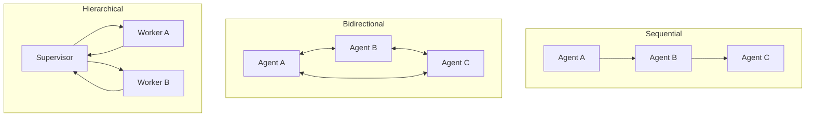
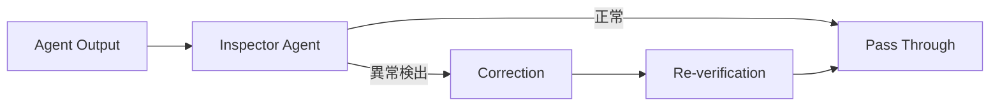

本記事は [On the Resilience of LLM-Based Multi-Agent Collaboration with Faulty Agents](https://proceedings.mlr.press/v267/huang25ay.html) の解説記事です。論文の手法・実験結果を整理し、技術的な背景を補足しています。本記事の著者自身が実験を行ったものではありません。

この記事は [Zenn記事: AIエージェントの3層エラー回復設計](https://zenn.dev/0h_n0/articles/69eae7260e1fa5) の深掘りです。Zenn記事で紹介したSystem Layer（第3層）のSupervisorパターンやエラー検出メカニズムの理論的背景として、本論文のHierarchicalアーキテクチャとInspector機構が直接的に対応する。

## 論文概要（Abstract）

LLMベースのマルチエージェントシステムにおいて、一部のエージェントが誤動作した場合のシステム全体の耐障害性（resilience）を体系的に調査した研究である。著者らは3種類のアーキテクチャ（Sequential、Fully Bidirectional、Hierarchical）を6つのマルチエージェントフレームワークに実装し、4つの下流タスクで評価している。Hierarchical構造が最も高い耐障害性を示し、性能低下はわずか5.5%にとどまると報告されている。さらに、エラー検出・回復のためのChallenger機構とInspector機構を提案し、Inspector機構で最大96.4%のエラー回復率を達成したとされる。

## 情報源

- **会議名**: ICML 2025（42nd International Conference on Machine Learning）
- **URL**: [https://proceedings.mlr.press/v267/huang25ay.html](https://proceedings.mlr.press/v267/huang25ay.html)
- **著者**: Jen-Tse Huang, Jiaxu Zhou, Tailin Jin, Xuhui Zhou, Zixi Chen, Wenxuan Wang, Youliang Yuan, Michael Lyu, Maarten Sap
- **所属**: The Chinese University of Hong Kong, Carnegie Mellon University 他
- **コード**: GitHub上で公開

## カンファレンス情報

ICML（International Conference on Machine Learning）は、機械学習分野における最高峰の国際会議の一つである。NeurIPS、ICLRと並んでML分野のトップ3カンファレンスとされ、2025年は第42回の開催となる。採択率は例年20-25%程度であり、厳しい査読プロセスを経た研究のみが発表される。マルチエージェントシステムの耐障害性という実用上重要なテーマが採択されたことは、この分野の成熟度と産業的関心の高まりを反映している。

## 背景と動機（Background & Motivation）

LLMベースのマルチエージェントシステムは、複雑なタスクを複数のエージェントが分担・協調して解決するアプローチとして急速に発展している。AutoGen、CrewAI、LangGraphなどのフレームワークが登場し、ソフトウェア開発、科学的議論、意思決定支援などに適用されている。

しかし、現実の運用環境では以下のような障害が避けられない。

- **LLMの確率的な誤り**: ハルシネーション、推論エラー、指示の無視
- **API障害**: タイムアウト、レート制限による応答劣化
- **外部ツール連携の失敗**: 検索エンジン、データベースからの不正確な結果の混入

従来の分散システムでは障害耐性が設計の中核であったが、LLMマルチエージェントシステムにおける障害耐性の体系的な研究は著者らによると十分に行われていなかった。本論文は「エージェントの一部が故障した場合、アーキテクチャの選択がシステム全体の耐障害性にどう影響するか」という問いに正面から取り組んでいる。

## 主要な貢献（Key Contributions）

- **障害エージェントのシミュレーション手法**: AutoTransform（出力変換）とAutoInject（誤情報注入）の2つの自動的な障害注入メカニズムを提案
- **3アーキテクチャの体系的比較**: Sequential、Fully Bidirectional、Hierarchicalの3構造を6つのフレームワーク・4タスクで評価
- **耐障害性の定量化**: Hierarchical構造が5.5%の性能低下で最も耐障害性が高いことを実証
- **エラー回復メカニズム**: Challenger（相互検証）とInspector（専任レビュー）の2つの機構を提案し、Inspector機構で96.4%のエラー回復率を達成
- **再現可能なベンチマーク**: コードとデータを公開し、マルチエージェント耐障害性研究の基盤を提供

## 技術的詳細（Technical Details）

### 3つのアーキテクチャの比較

著者らは、マルチエージェント協調における情報の流れ方に基づき、3つの基本アーキテクチャを定義している。



**Sequential（逐次型）**: エージェントが直列に接続され、前のエージェントの出力が次のエージェントの入力となる。1つのエージェントが故障すると、そのエラーが後続の全エージェントに伝播する。著者らは23.7%の性能低下を報告している。

**Fully Bidirectional（双方向型）**: 全エージェントが相互に通信可能な構造。議論や投票を通じて合意形成を行う。障害エージェントが他の全エージェントに直接影響を与えうるため、10.5%の性能低下が観測されている。

**Hierarchical（階層型）**: Supervisorエージェントがワーカーエージェントを管理する構造。ワーカー間の通信はSupervisorを経由するため、障害の影響が局所化される。わずか5.5%の性能低下にとどまると報告されている。

### AutoTransformとAutoInject

障害エージェントをシミュレートするために、著者らは2つの自動的な障害注入メカニズムを提案している。

**AutoTransform**: エージェントの出力を別のLLMで変換し、意味的に誤った内容に変質させる。元の出力のスタイルや形式は保持するため、表面的には正常に見える障害を生成できる。

$$
\tilde{y} = \text{LLM}_\text{transform}(y, \text{task\_context})
$$

ここで$y$は元のエージェント出力、$\tilde{y}$は変換後の障害出力である。

**AutoInject**: タスク固有の誤情報を生成し、エージェントの出力に注入する。例えば、数値データに対しては計算ミスを含む結果を、テキスト生成タスクに対しては事実と矛盾する情報を挿入する。

### Challenger機構とInspector機構

障害の検出と回復のために、著者らは2つのメカニズムを提案している。

**Challenger機構**: 各エージェントが他のエージェントの出力に対して「質問」や「異議」を投げかけ、相互検証を行う。この機構は追加のLLMコールを必要とするが、明らかな矛盾やエラーを検出できる。ただし、著者らはChallenger機構の性能はタスク依存性が高いと指摘している。

**Inspector機構**: 専任の「検査エージェント」がメッセージの流れを監視し、異常な出力を検出・修正する。Inspector機構の処理フローは以下のように定式化される。

$$
\hat{y}_i = \text{Inspector}(y_i, \mathcal{H}, \text{task\_desc})
$$

ここで$y_i$はエージェント$i$の出力、$\mathcal{H}$は会話履歴、$\text{task\_desc}$はタスクの記述である。



Inspector機構は最大96.4%のエラー回復率を達成したと報告されている。これはZenn記事のSystem Layer（第3層）におけるSupervisorパターンの概念と直接的に対応する。Supervisorが各ワーカーの出力を検査し、異常を検出した場合にリトライや修正を行う設計は、本論文のInspector機構を実装レベルで具現化したものと言える。

## 実装のポイント（Implementation Highlights）

本論文の知見を実装に活かす場合、以下のパターンが参考になる。

### Hierarchicalアーキテクチャの基本構造

```python
from dataclasses import dataclass, field
from enum import Enum


class AgentStatus(Enum):
    HEALTHY = "healthy"
    DEGRADED = "degraded"
    FAILED = "failed"


@dataclass
class AgentOutput:
    """エージェントの出力を表すデータクラス."""

    agent_id: str
    content: str
    confidence: float
    status: AgentStatus = AgentStatus.HEALTHY
    metadata: dict = field(default_factory=dict)


@dataclass
class InspectorResult:
    """Inspector機構の検査結果."""

    is_valid: bool
    original_output: str
    corrected_output: str | None = None
    error_type: str | None = None
    recovery_confidence: float = 0.0
```

### Inspector機構の実装パターン

```python
from collections.abc import Callable


class InspectorAgent:
    """Inspector機構の実装例.

    論文のInspector機構に基づき、エージェント出力の
    異常検出と修正を行う。
    """

    def __init__(
        self,
        llm_client: Callable,
        task_description: str,
        max_retries: int = 2,
    ) -> None:
        self._llm_client = llm_client
        self._task_description = task_description
        self._max_retries = max_retries

    def inspect(
        self,
        output: AgentOutput,
        conversation_history: list[dict],
    ) -> InspectorResult:
        """エージェント出力を検査し、必要に応じて修正する.

        Args:
            output: 検査対象のエージェント出力
            conversation_history: これまでの会話履歴

        Returns:
            検査結果（修正が必要な場合は修正後の出力を含む）
        """
        prompt = self._build_inspection_prompt(
            output, conversation_history
        )
        inspection = self._llm_client(prompt)

        if inspection.get("is_valid", True):
            return InspectorResult(
                is_valid=True,
                original_output=output.content,
            )

        # 異常検出時: 修正を試行
        corrected = self._attempt_correction(
            output, inspection, conversation_history
        )
        return corrected

    def _build_inspection_prompt(
        self,
        output: AgentOutput,
        history: list[dict],
    ) -> str:
        return (
            f"Task: {self._task_description}\n"
            f"Agent {output.agent_id} output: {output.content}\n"
            f"History: {history[-5:]}\n"
            "Inspect for: factual errors, logical "
            "inconsistencies, task deviation.\n"
            "Return JSON: {is_valid, error_type, suggestion}"
        )

    def _attempt_correction(
        self,
        output: AgentOutput,
        inspection: dict,
        history: list[dict],
    ) -> InspectorResult:
        for _ in range(self._max_retries):
            correction_prompt = (
                f"Original: {output.content}\n"
                f"Error: {inspection.get('error_type')}\n"
                f"Suggestion: {inspection.get('suggestion')}\n"
                "Provide corrected output."
            )
            corrected = self._llm_client(correction_prompt)
            if corrected.get("is_valid", False):
                return InspectorResult(
                    is_valid=True,
                    original_output=output.content,
                    corrected_output=corrected["content"],
                    error_type=inspection.get("error_type"),
                    recovery_confidence=corrected.get(
                        "confidence", 0.8
                    ),
                )

        return InspectorResult(
            is_valid=False,
            original_output=output.content,
            error_type=inspection.get("error_type"),
        )
```

## Production Deployment Guide

### AWS実装パターン（マルチエージェント耐障害性システム）

本論文のHierarchicalアーキテクチャとInspector機構をAWS上で本番運用する場合、Supervisor（Inspector）とWorkerエージェントの分離配置と、障害検出・回復のためのメッセージキュー設計が中心課題となる。

| 規模 | エージェント数 | 推奨構成 | 月額コスト | 主要サービス |
|------|-------------|---------|-----------|------------|
| **Small** | 3-5 | 単一ECS | $500-1,200 | ECS Fargate + SQS + DynamoDB |
| **Medium** | 5-20 | ECS + Step Functions | $2,000-6,000 | ECS on EC2 + Step Functions + ElastiCache + SQS |
| **Large** | 20+ | EKS + EventBridge | $8,000-20,000 | EKS + EventBridge Pipes + DynamoDB + OpenSearch |

**Medium構成の詳細** (月額$2,000-6,000):
- **ECS on EC2 (c6i.xlarge x2)**: Supervisor + Workerコンテナ ($300/月、Spot利用時)
- **Step Functions**: ワークフローオーケストレーション、Inspector機構の制御フロー ($100-300/月)
- **SQS (FIFO)**: エージェント間メッセージキュー、障害時のデッドレターキュー ($20-50/月)
- **ElastiCache (Redis)**: 会話履歴キャッシュ、Inspector検査結果キャッシュ ($100/月)
- **DynamoDB**: エージェント状態管理、障害ログ ($50-100/月)
- **Bedrock API**: LLM推論（Claude/Titan） ($1,000-5,000/月、呼び出し量依存)

**コスト試算の注意事項**: 上記は2026年4月時点のAWS ap-northeast-1料金に基づく概算値です。LLM API利用料はタスク量とトークン数に大きく依存するため、実際の運用では段階的にスケールすることを推奨します。

### Terraformインフラコード

```hcl
# SQS FIFO Queue - エージェント間メッセージング（順序保証）
resource "aws_sqs_queue" "agent_messages" {
  name                        = "multiagent-messages.fifo"
  fifo_queue                  = true
  content_based_deduplication = true
  visibility_timeout_seconds  = 300  # Inspector検査時間を考慮
  message_retention_seconds   = 86400

  redrive_policy = jsonencode({
    deadLetterTargetArn = aws_sqs_queue.agent_dlq.arn
    maxReceiveCount     = 3  # 3回失敗でDLQ送り
  })
}

resource "aws_sqs_queue" "agent_dlq" {
  name                       = "multiagent-dlq.fifo"
  fifo_queue                 = true
  message_retention_seconds  = 1209600  # 14日間保持
}

# Step Functions - Hierarchicalワークフロー
resource "aws_sfn_state_machine" "hierarchical_workflow" {
  name     = "multiagent-hierarchical"
  role_arn = aws_iam_role.step_functions.arn

  definition = jsonencode({
    StartAt = "DispatchToWorkers"
    States = {
      DispatchToWorkers = {
        Type = "Parallel"
        Branches = [
          {
            StartAt = "WorkerA"
            States = {
              WorkerA = {
                Type     = "Task"
                Resource = "arn:aws:states:::ecs:runTask.sync"
                Parameters = {
                  Cluster        = aws_ecs_cluster.agents.arn
                  TaskDefinition = aws_ecs_task_definition.worker.arn
                  Overrides = {
                    ContainerOverrides = [{
                      Name    = "worker"
                      Command = ["--role", "worker-a"]
                    }]
                  }
                }
                Retry = [{
                  ErrorEquals     = ["States.TaskFailed"]
                  IntervalSeconds = 10
                  MaxAttempts     = 2
                  BackoffRate     = 2.0
                }]
                End = true
              }
            }
          }
        ]
        Next = "InspectorCheck"
      }
      InspectorCheck = {
        Type     = "Task"
        Resource = aws_lambda_function.inspector.arn
        Retry = [{
          ErrorEquals     = ["InspectionError"]
          IntervalSeconds = 5
          MaxAttempts     = 2
          BackoffRate     = 1.5
        }]
        Next = "EvaluateResult"
      }
      EvaluateResult = {
        Type = "Choice"
        Choices = [{
          Variable     = "$.inspection.is_valid"
          BooleanEquals = true
          Next         = "Success"
        }]
        Default = "CorrectionLoop"
      }
      CorrectionLoop = {
        Type     = "Task"
        Resource = aws_lambda_function.correction.arn
        Next     = "InspectorCheck"
      }
      Success = {
        Type = "Succeed"
      }
    }
  })
}

# DynamoDB - エージェント状態管理
resource "aws_dynamodb_table" "agent_state" {
  name         = "multiagent-state"
  billing_mode = "PAY_PER_REQUEST"
  hash_key     = "agent_id"
  range_key    = "timestamp"

  attribute {
    name = "agent_id"
    type = "S"
  }
  attribute {
    name = "timestamp"
    type = "N"
  }

  ttl {
    attribute_name = "expires_at"
    enabled        = true
  }
}

# CloudWatch Alarm - Inspector検出率監視
resource "aws_cloudwatch_metric_alarm" "inspector_recovery_rate" {
  alarm_name          = "multiagent-inspector-recovery-rate"
  comparison_operator = "LessThanThreshold"
  evaluation_periods  = 5
  metric_name         = "InspectorRecoveryRate"
  namespace           = "MultiAgent/Inspector"
  period              = 300
  statistic           = "Average"
  threshold           = 0.8
  alarm_description   = "Inspector機構のエラー回復率が80%を下回った場合にアラート"
}
```

### 運用・監視設定

```sql
-- Inspector機構の検出・回復率モニタリング（CloudWatch Logs Insights）
fields @timestamp, agent_id, inspection_result, error_type,
       recovery_confidence, latency_ms
| filter inspection_result = "corrected" OR inspection_result = "failed"
| stats count(*) as total_inspections,
        sum(case when inspection_result = "corrected" then 1 else 0 end) as recovered,
        avg(recovery_confidence) as avg_confidence,
        pct(latency_ms, 99) as p99_latency
  by bin(15m)
```

```sql
-- エージェント障害パターン分析
fields @timestamp, agent_id, error_type, architecture_type
| filter error_type != "none"
| stats count(*) as fault_count,
        count_distinct(agent_id) as affected_agents
  by error_type, architecture_type, bin(1h)
| sort fault_count desc
```

### コスト最適化チェックリスト

**アーキテクチャ選択**:
- [ ] 3-5エージェント → ECS Fargate + SQS - $500-1,200/月
- [ ] 5-20エージェント → ECS on EC2 + Step Functions - $2,000-6,000/月
- [ ] 20+エージェント → EKS + EventBridge Pipes - $8,000-20,000/月

**Hierarchical構造固有の最適化**:
- [ ] Supervisor/Inspector: 高優先度タスクとして配置（On-Demand）
- [ ] Worker: Spot Instancesで低コスト化（障害時はSupervisorが再割り当て）
- [ ] Inspector検査の非同期化: 全出力を逐次検査ではなく、信頼度スコアに基づくサンプリング検査でコスト削減
- [ ] Conversation historyのTTL: 24時間以上前の履歴はS3にアーカイブ

**LLM API最適化**:
- [ ] Inspector用LLM: 高精度モデル（Claude 3.5 Sonnet等）を使用（回復率に直結）
- [ ] Worker用LLM: タスク難度に応じてモデルを選択（Haiku/Sonnet使い分け）
- [ ] Bedrock Provisioned Throughput: 安定的な呼び出しが見込まれる場合はPTで最大50%削減
- [ ] プロンプトキャッシュ: Inspector検査プロンプトのシステム部分をキャッシュ

**監視・アラート**:
- [ ] Inspector回復率（目標: 80%以上 — 論文の96.4%は理想値）
- [ ] Worker障害率（目標: 5%以下）
- [ ] Step Functions実行時間P99（目標: 5分以内）
- [ ] DLQメッセージ数（目標: 0 — 蓄積はシステム障害の兆候）

## 実験結果（Experimental Results）

著者らは4つの下流タスク（MathChat、Embodied Agent、Software Development、Creative Writing相当）で実験を実施し、6つのマルチエージェントフレームワークを用いて評価している。

### アーキテクチャ別の性能低下率

| アーキテクチャ | 障害なし時の性能 | 障害時の性能低下 | 備考 |
|-------------|-------------|--------------|------|
| Sequential | ベースライン | -23.7% | エラーが後続エージェントに累積伝播 |
| Fully Bidirectional | ベースライン | -10.5% | 投票による緩和はあるが、全体に影響 |
| **Hierarchical** | ベースライン | **-5.5%** | Supervisorによる障害局所化が有効 |

### 回復メカニズムの効果

| メカニズム | エラー回復率 | 追加コスト | 特徴 |
|-----------|-----------|----------|------|
| なし（ベースライン） | — | — | 障害がそのまま伝播 |
| Challenger | タスク依存 | 中 | 相互検証、議論型タスクに有効 |
| **Inspector** | **最大96.4%** | 高 | 専任検査、安定した回復性能 |

著者らの報告によると、Hierarchical構造の優位性は以下の理由による。

1. **障害の局所化**: ワーカーの障害がSupervisorを経由せずに他のワーカーに伝播しない
2. **集中的な品質管理**: Supervisorが全ワーカーの出力を比較・検証可能
3. **柔軟な再割り当て**: 障害ワーカーのタスクを別のワーカーに動的に再配分可能

ただし、著者らはHierarchical構造にも**制約がある**と指摘している。Supervisorエージェント自体が障害を起こした場合、システム全体が停止する「単一障害点（Single Point of Failure）」の問題が存在する。また、Inspector機構の96.4%という回復率は特定のタスク・条件下での最大値であり、全タスクで一様に達成されるわけではない。

## 実運用への応用（Practical Implications）

本論文の知見は、Zenn記事「AIエージェントの3層エラー回復設計」で紹介したアーキテクチャと密接に関連している。

### Zenn記事との対応関係

| 本論文の概念 | Zenn記事の対応箇所 | 実装上のポイント |
|-----------|-----------------|--------------|
| Hierarchical構造 | System Layer（第3層）Supervisor | ワーカー管理と障害局所化 |
| Inspector機構 | System Layer エラー検出 | 出力検証と自動修正 |
| Challenger機構 | Agent Layer（第2層）自己検証 | エージェント間の相互チェック |
| AutoTransform/AutoInject | テスト戦略 | 障害注入テストの自動化 |

### 実装時の推奨事項

1. **アーキテクチャ選択**: 耐障害性が要求される場合、Hierarchical構造を第一候補とする。ただし、Supervisor自体の冗長化（例: Active-Standby構成）を検討すべきである
2. **Inspector配置**: レイテンシ許容度が高いタスクではInspector機構を導入し、低レイテンシが要求される場合はChallenger機構をサンプリング的に適用する
3. **障害注入テスト**: 本論文のAutoTransform/AutoInjectの考え方を採り入れ、CI/CDパイプラインで意図的にエージェント障害を注入するテストを実施する
4. **段階的導入**: まずHierarchical構造のみを導入し、障害率の実測値に基づいてInspector機構の追加を判断する

### 制約と今後の課題

著者らは以下の制約を明記している。

- **評価タスクの限定性**: 4つの下流タスクでの評価であり、全てのマルチエージェントシナリオに一般化できるかは未検証
- **障害モデルの単純化**: AutoTransform/AutoInjectは意図的に設計された障害であり、実運用での複雑な障害パターン（部分的劣化、間欠的障害など）を完全にはカバーしていない
- **コストの増大**: Inspector機構は追加のLLMコールを必要とし、コストとレイテンシが増大する
- **Supervisor SPoF**: 前述の通り、Hierarchical構造のSupervisorが単一障害点となる問題は未解決

## まとめ

本論文は、LLMマルチエージェント協調システムにおける障害耐性を体系的に研究した重要な成果である。Hierarchical構造が5.5%の性能低下にとどまり最も耐障害性が高いこと、Inspector機構で最大96.4%のエラー回復が可能であることが示された。これらの知見は、Zenn記事で紹介した3層エラー回復設計の理論的裏付けとなる。特にSystem LayerのSupervisorパターンを採用する際の設計根拠として、本論文の定量的な比較結果は実務上の意思決定に有用である。ただし、Supervisorの単一障害点問題や、障害モデルの限定性など、実運用では追加の対策が必要となる点にも留意すべきである。

## 参考文献

1. Huang, J.-T., Zhou, J., Jin, T., Zhou, X., Chen, Z., Wang, W., Yuan, Y., Lyu, M., & Sap, M. (2025). On the Resilience of LLM-Based Multi-Agent Collaboration with Faulty Agents. *Proceedings of the 42nd International Conference on Machine Learning (ICML 2025)*. [https://proceedings.mlr.press/v267/huang25ay.html](https://proceedings.mlr.press/v267/huang25ay.html)
2. Zenn記事: AIエージェントの3層エラー回復設計：自動修復からヒューマンエスカレーションまで. [https://zenn.dev/0h_n0/articles/69eae7260e1fa5](https://zenn.dev/0h_n0/articles/69eae7260e1fa5)
