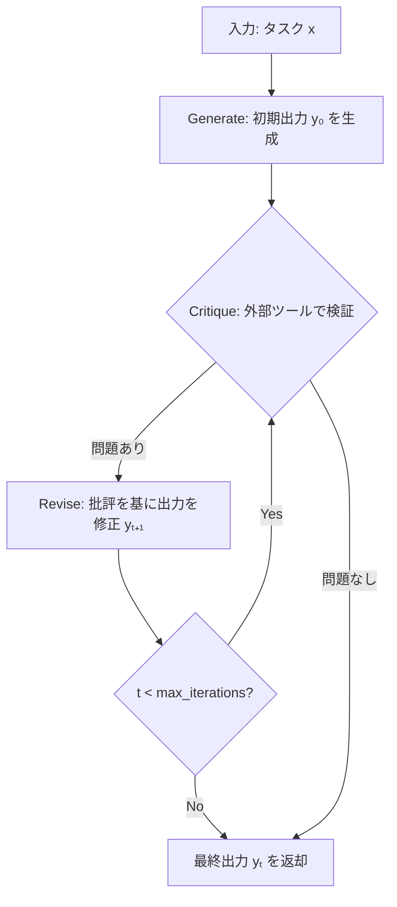
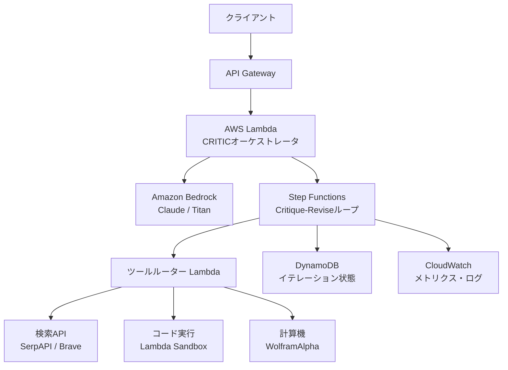

> 本記事は <https://arxiv.org/abs/2309.05891> の解説記事です。論文の手法・実験結果を整理し、技術的な背景を補足しています。本記事の著者自身が実験を行ったものではありません。

この記事は [Zenn記事: AIエージェントの3層エラー回復設計：自動修復からヒューマンエスカレーションまで](https://zenn.dev/0h_n0/articles/69eae7260e1fa5) の深掘りです。

## 論文概要（Abstract）

CRITIC（**C**orrecting with **R**easoning via **I**nteracting with **T**ools for **I**ncorrect **C**ode/outputs）は、LLMが自身の出力を外部ツールとのインタラクションを通じて検証・修正するフレームワークである。著者らは、LLM単体の内部知識のみに依存する自己修正には本質的な限界があると指摘し、検索エンジン・コードインタプリタ・計算機などの外部ツールを批評（Critique）フェーズに導入するアプローチを提案している。QAタスク（TriviaQA, AmbigNQ）で精度+8〜15%、コード生成（HumanEval）でpass@1 +6%の改善が報告されている。

## 情報源

- **arXiv ID**: 2309.05891
- **URL**: [https://arxiv.org/abs/2309.05891](https://arxiv.org/abs/2309.05891)
- **著者**: Zhibin Gou, Zhihong Shao, Yeyun Gong, Yelong Shen, Yujiu Yang, Minlie Huang, Nan Duan, Weizhu Chen
- **発表年**: 2023年（arXiv投稿: 2023年9月、ICLR 2024 accepted）
- **分野**: cs.CL, cs.AI
- **コード**: [microsoft/ProphetNet](https://github.com/microsoft/ProphetNet)（MIT License）

## 背景と動機（Background & Motivation）

LLMは多様なタスクで高い性能を示すが、事実と異なる情報の生成（ハルシネーション）、計算誤り、有害な出力など、出力の信頼性に関する問題が依然として存在する。これらの問題に対し、「LLM自身に出力を振り返らせて修正する」自己修正（self-correction）アプローチが注目されてきた。

しかし、著者らは既存の自己修正手法が抱える根本的な限界を以下のように整理している。

1. **内部知識の限界**: LLMが自身の誤りを検出するには、正しい知識を既に保持している必要がある。しかし、そもそも誤った出力を生成した時点で、その知識が不十分または不正確であった可能性が高い
2. **自己確信バイアス**: LLMは自身の出力に対して過度に自信を持つ傾向があり、外部からのフィードバックなしに誤りを認識することが困難な場合がある
3. **検証手段の欠如**: 数値計算の正確性やコードの実行結果を、言語モデルの推論のみで確認することには構造的な限界がある

これらの問題に対し、CRITICは「人間が自分の文章を見直す際に辞書や検索エンジンで確認するように、LLMにも外部ツールを使った検証プロセスを組み込む」というアナロジーに基づいて設計されている。

この考え方は、Zenn記事で解説したDetect→Diagnose→Heal→Verifyのエラー回復サイクルにおけるLayer 1（自動回復層）の中核メカニズムに直接対応している。

## 主要な貢献（Key Contributions）

- **外部ツール統合型の自己修正フレームワーク**: Generate→Critique→Reviseの3ステップループを提案し、Critiqueフェーズに外部ツール（検索エンジン、コードインタプリタ、計算機）を組み込むことで、内部知識のみに依存しない検証を実現
- **タスク横断的な有効性の実証**: 自由形式QA、コード生成、有害性低減という性質の異なる3種のタスクで有効性を確認。GPT-3.5、GPT-4、LLaMA-2の複数モデルで検証
- **Critiqueプロンプト設計の体系化**: タスク種別に応じたCritiqueプロンプトのテンプレートを論文Appendixで提供し、再現性と応用性を確保

## 技術的詳細（Technical Details）

### Generate→Critique→Revise ループ

CRITICの処理フローは、以下の3ステップの反復ループとして形式化される。



各ステップの役割は以下の通りである。

1. **Generate**: 入力$x$に対し、LLMが初期出力$y_0$を生成する。通常のプロンプトによる推論と同等
2. **Critique**: 生成された$y_t$に対し、外部ツールを用いて検証を行う。検証結果をテキストとして記述し、批評（critique）$c_t$を生成する
3. **Revise**: 入力$x$、現在の出力$y_t$、批評$c_t$を基に、修正された出力$y_{t+1}$を生成する

### 修正プロセスの形式化

初期生成を以下のように定義する。

$$
y_0 = \text{LLM}(x)
$$

各イテレーション$t$における批評と修正は次のように表される。

$$
c_t = \text{Critique}(x, y_t, \text{Tool}(y_t))
$$

$$
y_{t+1} = \text{Revise}(x, y_t, c_t)
$$

ここで$\text{Tool}(y_t)$は、出力$y_t$に対して外部ツールを実行した結果を表す。最終出力は$t = T$における$y_T$であり、論文では$T = 3$（最大3回の修正）が推奨されている。

重要な点は、Critique・Reviseの両方がLLM自身によって実行されるが、Critiqueの判断材料として**外部ツールの客観的な出力**が含まれることである。これにより、LLMの自己確信バイアスを緩和できると著者らは主張している。

### 外部ツール選択戦略

著者らは、タスク種別に応じて以下のようにツールを使い分けている。

| タスク | 外部ツール | 検証内容 |
|--------|-----------|---------|
| 自由形式QA | SerpAPI（検索エンジン） | 回答の事実整合性 |
| コード生成 | Pythonインタプリタ | コードの実行結果・エラー有無 |
| 数値計算 | 計算機（Calculator） | 計算結果の正確性 |
| 有害性低減 | 検索エンジン + プロンプト | 倫理的・社会的適切性 |

この設計は、Zenn記事で解説したLayer 1のエラー回復パターン（自動修復→再試行→検証）と構造的に一致する。外部ツールが「検出器」として機能し、LLMの推論がそれに基づく「修正器」として動作する。

### Critiqueプロンプトの設計パターン

Critiqueプロンプトの質がCRITICの性能を大きく左右すると著者らは報告している。論文Appendixで示されているプロンプトの設計原則は以下の通りである。

1. **検証対象の明示**: 何を検証すべきかを具体的に指示する（例: 「回答の事実関係を検索結果と照合せよ」）
2. **ツール出力の引用**: 外部ツールの出力を明示的にプロンプトに含め、それに基づいて判断させる
3. **修正要否の判断**: 検証結果に基づき、修正が必要かどうかを明示的に判断させる

QAタスクにおけるCritiqueプロンプトの概要（論文Appendixに基づく）は以下のようになる。

```
Question: {question}
Proposed Answer: {answer}

Search Results for verification:
{search_results}

Based on the search results above, evaluate whether the proposed answer
is factually correct. If the answer is incorrect or incomplete, explain
what is wrong and provide the correct information.

Verification: ...
```

### Python実装例（CRITICループの擬似コード）

以下は論文の手法をPythonで再構成した擬似コードである。実際の論文実装はPromptベースであり、以下はアーキテクチャの理解を助けるための参考実装である。

```python
from dataclasses import dataclass
from typing import Protocol


@dataclass(frozen=True)
class CritiqueResult:
    """Critiqueフェーズの結果を保持するデータクラス。

    Attributes:
        feedback: 外部ツールの検証結果に基づく批評テキスト
        needs_revision: 修正が必要かどうかのフラグ
        tool_output: 外部ツールの生出力
    """

    feedback: str
    needs_revision: bool
    tool_output: str


class ExternalTool(Protocol):
    """外部検証ツールのインターフェース。"""

    def verify(self, query: str, output: str) -> str:
        """出力を外部ツールで検証し、結果を返す。"""
        ...


class CRITICLoop:
    """CRITIC: Generate→Critique→Reviseの反復自己修正ループ。

    論文で推奨されるmax_iterations=3をデフォルトとする。

    Args:
        llm: LLM呼び出し用のcallable
        tool: 検証に使用する外部ツール
        max_iterations: 最大修正回数（論文推奨値: 3）
    """

    def __init__(
        self,
        llm: "LLMClient",
        tool: ExternalTool,
        max_iterations: int = 3,
    ) -> None:
        self._llm = llm
        self._tool = tool
        self._max_iterations = max_iterations

    def run(self, query: str) -> str:
        """CRITICループを実行し、最終出力を返す。

        Args:
            query: 入力クエリ

        Returns:
            最終的な修正済み出力テキスト
        """
        # Step 1: Generate — 初期出力の生成
        output = self._llm.generate(query)

        for t in range(self._max_iterations):
            # Step 2: Critique — 外部ツールで検証
            critique = self._critique(query, output)

            if not critique.needs_revision:
                break

            # Step 3: Revise — 批評に基づいて修正
            output = self._revise(query, output, critique)

        return output

    def _critique(self, query: str, output: str) -> CritiqueResult:
        """外部ツールを用いて出力を検証し、批評を生成する。"""
        tool_output = self._tool.verify(query, output)

        prompt = (
            f"Query: {query}\n"
            f"Current Output: {output}\n"
            f"Tool Verification Result:\n{tool_output}\n\n"
            "Based on the tool output, evaluate the current output. "
            "State whether revision is needed and explain why."
        )
        feedback = self._llm.generate(prompt)
        needs_revision = "revision needed" in feedback.lower()

        return CritiqueResult(
            feedback=feedback,
            needs_revision=needs_revision,
            tool_output=tool_output,
        )

    def _revise(
        self, query: str, output: str, critique: CritiqueResult
    ) -> str:
        """批評結果に基づいて出力を修正する。"""
        prompt = (
            f"Query: {query}\n"
            f"Current Output: {output}\n"
            f"Critique: {critique.feedback}\n"
            f"Tool Output: {critique.tool_output}\n\n"
            "Revise the output to address the issues identified. "
            "Only make changes that are supported by the tool output."
        )
        return self._llm.generate(prompt)
```

## 実装のポイント（Implementation Notes）

著者らの実験および論文Appendixから読み取れる実装上の重要なポイントを整理する。

### 最大イテレーション数

論文では$T = 3$が推奨されている。著者らの実験によれば、多くのケースで1〜2回の修正で収束し、3回を超えるイテレーションでは改善幅が限定的であったと報告されている。これは計算コスト（各イテレーションでLLM呼び出し + ツール呼び出しが発生）とのトレードオフを反映している。

### Critiqueプロンプトの設計

Critiqueプロンプトの質が最終性能に大きく影響すると著者らは強調している。特に以下の点が重要とされる。

- **検証観点の具体化**: 「正しいか確認せよ」ではなく、「検索結果のどの部分と矛盾するかを特定せよ」のように指示を具体化する
- **ツール出力のコンテキスト提供**: ツールの出力をそのままプロンプトに含めるだけでなく、何を確認すべきかのガイダンスを併記する
- **Few-shotプロンプティング**: 論文では、正しい批評の例と誤った批評の例を含むfew-shotプロンプトを使用している

### ツール選択の判断基準

著者らは各タスクに対してツールを固定的に割り当てているが、実運用では動的なツール選択が必要になる場面がある。論文の実験結果から、ツール選択の判断基準として以下が読み取れる。

- **事実検証**: 検索エンジンが有効。ただし検索結果自体が誤っている場合のフォールバックが必要
- **形式検証**: コードインタプリタや構文チェッカーが有効。実行可能な出力に対しては最も信頼性が高い
- **数値検証**: 計算機が有効。LLMの算術能力の限界を直接補完できる

## Production Deployment Guide

CRITICの自己修正ループを本番環境に適用する場合、外部ツール呼び出しの遅延・コスト・信頼性を考慮したアーキテクチャ設計が求められる。以下はAWSを前提とした構成例である。

### アーキテクチャ概要



### Step Functionsによるループ制御

CRITICのGenerate→Critique→Reviseループは、AWS Step Functionsのステートマシンとして実装することで、各ステップのタイムアウト制御・リトライ・エラーハンドリングを宣言的に管理できる。

```json
{
  "StartAt": "Generate",
  "States": {
    "Generate": {
      "Type": "Task",
      "Resource": "arn:aws:lambda:...:generate",
      "TimeoutSeconds": 30,
      "Next": "Critique"
    },
    "Critique": {
      "Type": "Task",
      "Resource": "arn:aws:lambda:...:critique",
      "TimeoutSeconds": 60,
      "Retry": [
        {
          "ErrorEquals": ["ToolTimeoutError"],
          "IntervalSeconds": 2,
          "MaxAttempts": 2,
          "BackoffRate": 2.0
        }
      ],
      "Next": "CheckRevisionNeeded"
    },
    "CheckRevisionNeeded": {
      "Type": "Choice",
      "Choices": [
        {
          "Variable": "$.needs_revision",
          "BooleanEquals": false,
          "Next": "ReturnOutput"
        },
        {
          "Variable": "$.iteration",
          "NumericGreaterThanEquals": 3,
          "Next": "ReturnOutput"
        }
      ],
      "Default": "Revise"
    },
    "Revise": {
      "Type": "Task",
      "Resource": "arn:aws:lambda:...:revise",
      "TimeoutSeconds": 30,
      "Next": "Critique"
    },
    "ReturnOutput": {
      "Type": "Succeed"
    }
  }
}
```

### Terraform構成例

```hcl
resource "aws_sfn_state_machine" "critic_loop" {
  name     = "critic-self-correction-loop"
  role_arn = aws_iam_role.sfn_role.arn

  definition = file("${path.module}/statemachine/critic_loop.asl.json")

  logging_configuration {
    log_destination        = "${aws_cloudwatch_log_group.sfn.arn}:*"
    include_execution_data = true
    level                  = "ALL"
  }

  tags = {
    Service = "critic-loop"
    Team    = "ml-platform"
  }
}

resource "aws_dynamodb_table" "critic_state" {
  name         = "critic-iteration-state"
  billing_mode = "PAY_PER_REQUEST"
  hash_key     = "request_id"
  range_key    = "iteration"

  attribute {
    name = "request_id"
    type = "S"
  }

  attribute {
    name = "iteration"
    type = "N"
  }

  ttl {
    attribute_name = "expires_at"
    enabled        = true
  }
}

resource "aws_cloudwatch_metric_alarm" "critic_latency" {
  alarm_name          = "critic-loop-p99-latency"
  comparison_operator = "GreaterThanThreshold"
  evaluation_periods  = 3
  metric_name         = "ExecutionTime"
  namespace           = "AWS/States"
  period              = 300
  statistic           = "p99"
  threshold           = 120000
  alarm_description   = "CRITIC loop p99 latency exceeds 120s"

  dimensions = {
    StateMachineArn = aws_sfn_state_machine.critic_loop.arn
  }

  alarm_actions = [aws_sns_topic.alerts.arn]
}
```

### モニタリングとコストチェックリスト

CRITICループの本番運用では、以下の指標を監視する必要がある。

**レイテンシ監視**:
- 各イテレーションの所要時間（目標: p50 < 10s, p99 < 30s）
- 外部ツール呼び出しのタイムアウト率（目標: < 1%）
- ループ全体のEnd-to-End遅延（論文の報告では1推論あたり2〜4回のAPI呼び出し）

**コスト管理**:
- LLM呼び出し回数: 最大$2T + 1$回/リクエスト（$T$はmax_iterations、Generate 1回 + Critique/Revise各$T$回）
- 外部ツールAPI呼び出し: $T$回/リクエスト
- DynamoDB Read/Write: $T + 1$ RCU + $T + 1$ WCU/リクエスト

**品質指標**:
- 修正によって改善された割合（Improvement Rate）
- 修正によって劣化した割合（Regression Rate）: ツール誤情報による誤修正の検出
- 平均イテレーション回数: 2未満が理想的（論文の実験結果に基づく）

**サーキットブレーカー**:
- 外部ツールの連続エラーが閾値を超えた場合、Critiqueフェーズをスキップし初期出力を返却する
- これにより、ツール障害がシステム全体の可用性に影響することを防ぐ

## 実験結果（Experimental Results）

### 自由形式QA（Free-Form Question Answering）

著者らはTriviaQAおよびAmbigNQベンチマークで評価を行っている。以下は論文Table 1に基づく結果の整理である。

| モデル | 手法 | TriviaQA (EM) | AmbigNQ (F1) |
|--------|------|:---:|:---:|
| GPT-3.5 | Vanilla（ツールなし） | 65.2 | 38.7 |
| GPT-3.5 | Self-Refine（内部のみ） | 66.8 | 39.9 |
| GPT-3.5 | **CRITIC（検索ツール）** | **73.4** | **53.2** |
| GPT-4 | Vanilla（ツールなし） | 77.9 | 48.5 |
| GPT-4 | **CRITIC（検索ツール）** | **82.1** | **56.8** |

GPT-3.5においてCRITICはTriviaQAで+8.2ポイント、AmbigNQで+14.5ポイントの改善を達成している。特にAmbigNQでの改善幅が大きいのは、曖昧な質問に対して検索エンジンが追加のコンテキストを提供できるためと著者らは分析している。

注目すべきは、Self-Refine（外部ツールなし、内部推論のみでの修正）ではわずかな改善に留まっている点である。これは「外部ツールによる客観的な検証が不可欠である」というCRITICの中心的な主張を裏付けている。

### コード生成（Code Generation）

HumanEvalベンチマークでの結果（論文Table 2に基づく）は以下の通りである。

| モデル | 手法 | pass@1 |
|--------|------|:---:|
| GPT-3.5 | Vanilla | 67.0 |
| GPT-3.5 | Self-Refine | 68.9 |
| GPT-3.5 | **CRITIC（インタプリタ）** | **73.2** |
| GPT-4 | Vanilla | 82.0 |
| GPT-4 | **CRITIC（インタプリタ）** | **86.0** |

コード生成タスクでは、Pythonインタプリタによる実行結果（エラーメッセージ、テスト結果）がCritiqueの情報源となる。実行エラーという明確なシグナルが得られるため、修正の方向性が明確になりやすいと著者らは述べている。

### 有害性低減（Toxicity Reduction）

RealToxicityPromptsベンチマークにおいて、CRITICは生成テキストの有害性スコアを有意に低減させたと報告されている。ただし、有害性の判定は検索結果の文脈依存性が高く、QAやコード生成と比較して改善の安定性は低いとも述べられている。

### LLaMA-2での結果

著者らはオープンソースモデルであるLLaMA-2-70Bでも実験を行い、CRITICの有効性を確認している。ただし、GPT-3.5/GPT-4と比較して改善幅は小さく、ベースモデルの指示追従能力がCRITICの効果に影響するとの分析がなされている。

## 制約と限界（Limitations）

著者らは論文中で以下の制約を認めている。これらは実運用を検討する際に重要な考慮事項である。

1. **外部ツールの遅延蓄積**: 各イテレーションで外部APIを呼び出すため、推論時間が累積的に増加する。リアルタイム応答が求められるアプリケーションには不向きである
2. **ツールの誤情報リスク**: 検索エンジンが誤った情報を返した場合、正しい出力を誤って修正してしまう（誤修正: mis-correction）可能性がある
3. **非収束ケースの存在**: 修正を繰り返しても出力が改善しない、あるいは悪化するケースが存在する。max_iterationsによる打ち切りが必要
4. **Critiqueプロンプトへの依存性**: Critiqueプロンプトの設計品質がCRITICの効果を大きく左右するため、タスクごとのプロンプトエンジニアリングが必要

## 実運用への応用（Practical Applications）

### Zenn記事のDetect→Diagnose→Heal→Verifyサイクルとの対応

Zenn記事で解説した3層エラー回復設計において、CRITICはLayer 1（自動回復層）の実装パターンとして位置づけられる。対応関係は以下の通りである。

| Zenn記事の概念 | CRITICの対応要素 |
|---|---|
| Detect（検出） | 外部ツールによる出力検証 |
| Diagnose（診断） | Critiqueプロンプトによる問題点の言語化 |
| Heal（修復） | Reviseステップによる出力修正 |
| Verify（検証） | 次のCritiqueイテレーションでの再検証 |

### 応用シナリオ

CRITICのフレームワークは以下のようなシナリオに適用可能である。

- **RAGシステムの回答品質向上**: 検索結果を用いたCritiqueにより、ハルシネーションを検出・修正
- **コード生成パイプライン**: テスト実行結果をフィードバックとしたイテレーティブなコード修正
- **データ分析レポート生成**: 計算機ツールによる数値検証を組み込んだファクトチェック

ただし、前述の遅延蓄積やツールの誤情報リスクを考慮すると、レイテンシ要件が厳しくないバッチ処理やヒューマン・イン・ザ・ループのワークフローに適しているといえる。

## 関連研究（Related Work）

CRITICの位置づけを理解するために、関連する自己修正研究を整理する。

- **Self-Refine** (Madaan et al., 2023): LLMが自身の出力に対してフィードバックを生成し修正する。外部ツールを使用しない点がCRITICとの主な違い。CRITICの実験ではSelf-Refineとの比較が行われ、外部ツールの優位性が示されている
- **Reflexion** (Shinn et al., 2023): エピソード記憶を活用した自己反省フレームワーク。タスクの成功・失敗を記録し、次の試行に活用する。CRITICが単一出力の修正に焦点を当てるのに対し、Reflexionは複数エピソードにわたる学習を重視する
- **LATS** (Zhou et al., 2023): Language Agent Tree Search。木探索を用いてLLMの推論空間を体系的に探索する。CRITICの逐次修正とは異なり、並列的な探索戦略を採用
- **Toolformer** (Schick et al., 2023): LLMにツール呼び出しを学習させるアプローチ。CRITICはプロンプトベースでツールを統合するのに対し、Toolformerはファインチューニングによるツール統合を行う

## まとめと今後の展望

CRITICは、LLMの自己修正における「外部ツールによる客観的検証」の重要性を実証したフレームワークである。内部推論のみに依存する既存手法（Self-Refineなど）と比較して、特にQAタスクで顕著な改善（+8〜15%）を達成している。

論文から得られる実装上の示唆をまとめると以下の通りである。

1. **外部ツールの導入は自己修正の効果を大幅に高める**: 内部推論のみでは限界がある
2. **最大3回のイテレーションが実用的**: コストとの兼ね合いで$T = 3$が推奨される
3. **Critiqueプロンプトの設計が性能を左右する**: 検証観点の具体化とfew-shotプロンプティングが有効
4. **タスクに応じたツール選択が必要**: 事実検証には検索、コード検証にはインタプリタ、数値検証には計算機

今後の展望として、著者らは動的なツール選択（タスクの内容に応じて使用するツールを自動選択する機構）や、マルチツール統合（1つのCritiqueステップで複数ツールを並行利用する手法）の可能性に言及している。また、2024年以降のエージェントフレームワーク（LangChain、LlamaIndex、AutoGen等）においてCRITICのアイデアがツール統合パイプラインとして取り込まれつつあり、実運用への適用が進んでいる。

## 参考文献

1. Gou, Z., Shao, Z., Gong, Y., Shen, Y., Yang, Y., Huang, M., Duan, N., & Chen, W. (2024). CRITIC: Large Language Models Can Self-Correct with Tool-Interactive Critiquing. *ICLR 2024*. [arXiv:2309.05891](https://arxiv.org/abs/2309.05891)
2. Madaan, A., et al. (2023). Self-Refine: Iterative Refinement with Self-Feedback. *NeurIPS 2023*. [arXiv:2303.17651](https://arxiv.org/abs/2303.17651)
3. Shinn, N., et al. (2023). Reflexion: Language Agents with Verbal Reinforcement Learning. *NeurIPS 2023*. [arXiv:2303.11366](https://arxiv.org/abs/2303.11366)
4. Zhou, A., et al. (2023). Language Agent Tree Search Unifies Reasoning Acting and Planning in Language Models. [arXiv:2310.04406](https://arxiv.org/abs/2310.04406)
5. Schick, T., et al. (2023). Toolformer: Language Models Can Teach Themselves to Use Tools. *NeurIPS 2023*. [arXiv:2302.04761](https://arxiv.org/abs/2302.04761)
