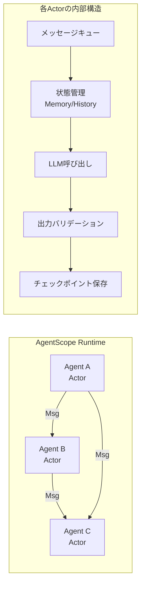
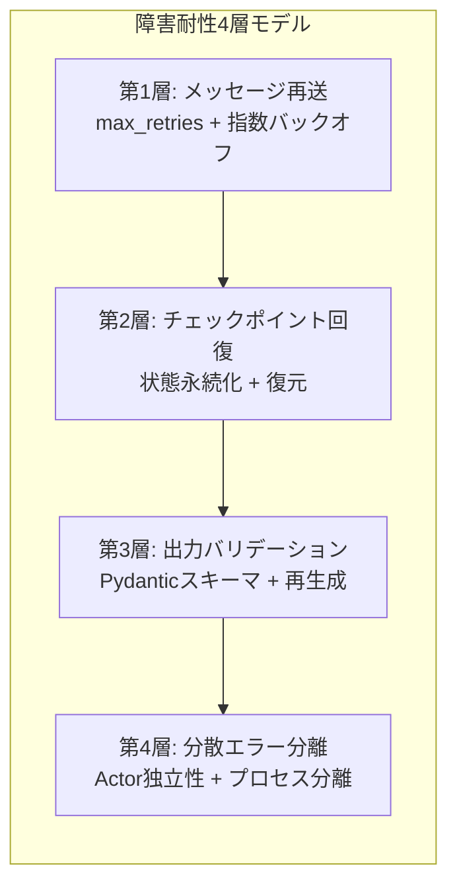
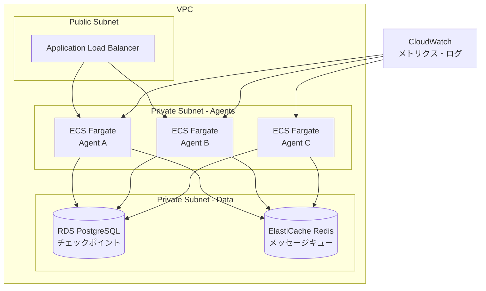

> 本記事は [arXiv:2402.18679](https://arxiv.org/abs/2402.18679) の解説記事です。論文の主張・実験結果を整理し、技術的な背景を補足しています。本記事の著者自身が実験を行ったものではありません。

この記事は [Zenn記事: AIエージェントの3層エラー回復設計](https://zenn.dev/0h_n0/articles/69eae7260e1fa5) の深掘りです。

## 論文概要（Abstract）

AgentScopeは、Alibaba Groupが開発したプロダクション対応のマルチエージェントプラットフォームである。著者らは、既存のマルチエージェントフレームワークが研究プロトタイプに留まり、本番環境で求められる障害耐性・分散実行・構造化出力の検証といった要件を十分に満たしていないと指摘している。AgentScopeはActorモデルに基づくメッセージパッシング、チェックポイントベースの状態永続化、Pydanticスキーマによる出力バリデーション、分散エラー分離の4層で障害耐性を実現し、会話・コード生成・ゲームAI等のタスクで検証されている。

## 情報源

- **arXiv ID**: 2402.18679
- **URL**: [https://arxiv.org/abs/2402.18679](https://arxiv.org/abs/2402.18679)
- **著者**: Dawei Gao, Zitao Li, Weirui Kuang, Xuchen Pan, Daoyuan Chen, Zhijian Ma, et al.（Alibaba Group）
- **発表年**: 2024年（arXiv投稿: 2024年2月）
- **分野**: cs.MA, cs.AI
- **GitHub**: [modelscope/agentscope](https://github.com/modelscope/agentscope)（Apache 2.0ライセンス）

## 背景と動機（Background & Motivation）

2023年後半以降、LLMを基盤とするマルチエージェントシステムの実用化が急速に進んでいる。AutoGen、LangChain、CrewAIなどのフレームワークが登場し、複数のAIエージェントが協調してタスクを遂行するアーキテクチャが注目を集めている。

しかし、研究用途では十分に機能するこれらのフレームワークも、本番環境ではいくつかの根本的な課題を抱えている。

1. **障害耐性の欠如**: LLM APIのタイムアウト、不正な出力フォーマット、ネットワーク障害などの例外処理が不十分である。単一エージェントの障害がシステム全体に波及するケースが頻発する
2. **分散実行の困難さ**: 複数エージェントを別々のプロセスやマシンで実行する仕組みが組み込まれておらず、スケーラビリティに制約がある
3. **状態管理の脆弱性**: 長時間実行されるエージェントパイプラインにおいて、中間状態の永続化と障害からの復旧手段が提供されていない
4. **出力の信頼性**: LLMの出力が期待されたスキーマに従わない場合の対処が開発者に委ねられている

著者らは、これらの課題を体系的に解決するプラットフォームとしてAgentScopeを設計したと述べている。特に、分散システム理論で確立されたActorモデルをマルチエージェントアーキテクチャに適用することで、障害分離とメッセージベースの協調を自然に実現している点が特徴的である。

## 主要な貢献（Key Contributions）

- **Actorモデルベースのマルチエージェントアーキテクチャ**: 各エージェントを独立したActorとして実装し、メッセージパッシングによる疎結合な協調を実現
- **4層の障害耐性メカニズム**: メッセージ再送、チェックポイント回復、出力バリデーション、分散エラー分離を統合的に提供
- **宣言的なワークフロー定義**: Pipeline・IfElse・WhileLoop等の高水準オーケストレータにより、エージェント間の制御フローをコードの記述量を抑えて構築可能
- **RPC透過な分散実行**: ローカル実行と分散実行をコード変更なしで切り替え可能な設計

## 技術的詳細（Technical Details）

### Actorモデルアーキテクチャ

AgentScopeのコア設計はActorモデル（Hewitt et al., 1973）に基づいている。Actorモデルでは、各計算単位（Actor）は以下の3つの操作のみを行う。

1. メッセージを受信する
2. 内部状態を更新する
3. メッセージを送信する（他のActorへ）

AgentScopeでは、各エージェントが1つのActorに対応する。エージェント間の通信はすべて`Msg`オブジェクトのパッシングで行われ、共有メモリや直接的な関数呼び出しは使用しない。この設計により、あるエージェントが障害を起こしても他のエージェントの状態が破壊されることがない。



### 障害耐性メカニズム（4層構成）

AgentScopeの障害耐性は以下の4層で構成されている。これはZenn記事で解説した3層エラー回復設計（自動リトライ → チェックポイント回復 → ヒューマンエスカレーション）と密接に対応する。

#### 第1層: 障害耐性メッセージパッシング

エージェント間のメッセージ配信においてリトライとタイムアウト制御が組み込まれている。LLM APIへのリクエストが失敗した場合、設定された`max_retries`回数まで自動的に再試行される。

著者らは、デフォルト設定として`max_retries=3`、`timeout`をAPI呼び出しごとに設定可能としている。リトライ間隔は指数バックオフが適用され、LLM APIプロバイダへの過負荷を防止する。

#### 第2層: チェックポイントベースの状態永続化

長時間実行されるマルチエージェントパイプラインにおいて、各エージェントの状態を定期的にチェックポイントとして永続化する。障害発生時には最新のチェックポイントからエージェントの状態を復元し、パイプライン全体を最初からやり直すことなく処理を再開できる。

チェックポイントには以下の情報が含まれる。

- エージェントのメモリ（会話履歴）
- 内部変数の状態
- 処理の進行状況（パイプライン中のどのステップまで完了したか）

#### 第3層: 構造化出力バリデーション

LLMの出力が期待されたフォーマットに従っているかを、Pydanticスキーマを用いて自動検証する。バリデーションに失敗した場合、エラー情報をLLMへのプロンプトに含めて再生成を要求する。

この仕組みにより、JSONパースエラーやフィールドの欠落といった出力形式の問題が自動的に修正される。著者らは、バリデーションリトライにより出力の構造的正確性が大幅に向上すると報告している。

#### 第4層: 分散エラー分離

Actorモデルの本質的な特性として、各エージェント（Actor）は独立したプロセスまたはスレッドで実行される。あるエージェントが例外を発生させても、そのエージェントのプロセスのみが影響を受け、他のエージェントは正常に動作を継続する。

RPC（Remote Procedure Call）経由で通信する分散配置環境では、エージェント間のネットワーク障害も個別に処理される。通信先エージェントが応答しない場合、タイムアウト後にフォールバック処理に移行する。



### メッセージパッシングの詳細設計

AgentScopeにおけるメッセージは`Msg`クラスとして定義されている。`Msg`は送信元エージェント名、受信先、コンテンツ、メタデータを保持し、エージェント間通信の基本単位となる。

メッセージの流れは以下の通りである。

1. 送信側エージェントが`Msg`を生成
2. ランタイムがメッセージを受信側エージェントのキューに配置
3. 受信側エージェントがキューからメッセージを取り出し処理
4. 配信失敗時はリトライキューに移動し、バックオフ後に再送

分散環境ではgRPCベースのRPC層がメッセージのシリアライズ・転送を担当する。著者らは、RPC層の通信レイテンシが数ミリ秒程度であり、LLM推論時間（数秒〜数十秒）と比較して無視できる水準であると報告している。

### Python実装例

以下は、AgentScopeを使って障害耐性を備えたマルチエージェントシステムを構築する実装例である。

```python
"""AgentScopeを使った障害耐性マルチエージェントの構築例.

AgentScope v0.0.5以降を想定した構成で、
メッセージリトライ・出力バリデーション・パイプラインオーケストレーションを示す。
"""

from typing import Any

import agentscope
from agentscope.agents import DialogAgent
from agentscope.message import Msg
from agentscope.parsers import MarkdownJsonDictParser
from agentscope.pipelines import PipelineBase, WhileLoopPipeline


def create_validated_agent(
    name: str,
    model_config_name: str,
    sys_prompt: str,
    required_keys: list[str],
    max_retries: int = 3,
) -> DialogAgent:
    """出力バリデーション付きエージェントを作成する.

    Args:
        name: エージェント名
        model_config_name: モデル設定名（agentscope.init で登録済み）
        sys_prompt: システムプロンプト
        required_keys: 出力JSONに必須のキー一覧
        max_retries: バリデーション失敗時のリトライ回数

    Returns:
        バリデーション設定済みのDialogAgent
    """
    agent = DialogAgent(
        name=name,
        model_config_name=model_config_name,
        sys_prompt=sys_prompt,
    )
    # MarkdownJsonDictParserで出力形式を強制
    parser = MarkdownJsonDictParser(
        content_hint={key: f"<{key}の値>" for key in required_keys},
        required_keys=required_keys,
    )
    agent.set_parser(parser)
    return agent


def build_fault_tolerant_pipeline() -> None:
    """障害耐性付きマルチエージェントパイプラインを構築・実行する.

    AgentScopeのPipeline + WhileLoopを組み合わせ、
    品質チェックが通るまで繰り返すループを実装する。
    """
    # AgentScope初期化（リトライ・タイムアウト設定含む）
    agentscope.init(
        model_configs=[
            {
                "config_name": "gpt4_config",
                "model_type": "openai_chat",
                "model_name": "gpt-4",
                "api_key": "YOUR_API_KEY",
                "max_retries": 3,  # API呼び出しリトライ
                "timeout": 60,  # タイムアウト（秒）
            },
        ],
    )

    # エージェント定義
    researcher = create_validated_agent(
        name="Researcher",
        model_config_name="gpt4_config",
        sys_prompt="あなたはリサーチャーです。与えられたトピックを調査し結果を報告します。",
        required_keys=["findings", "confidence", "sources"],
    )

    reviewer = create_validated_agent(
        name="Reviewer",
        model_config_name="gpt4_config",
        sys_prompt="あなたはレビュアーです。リサーチ結果の品質を評価します。",
        required_keys=["approved", "feedback"],
    )

    # パイプライン構成: Researcher → Reviewer
    # WhileLoopで品質基準を満たすまで繰り返す
    def quality_check(msg: Msg) -> bool:
        """レビュー結果が承認でなければループ継続."""
        try:
            parsed = msg.parsed
            return not parsed.get("approved", False)
        except (AttributeError, TypeError):
            return True  # パース不能な場合もループ継続

    pipeline = PipelineBase(operators=[researcher, reviewer])

    loop = WhileLoopPipeline(
        loop_body_operators=[pipeline],
        condition_func=quality_check,
        max_loop=3,  # 最大3回まで
    )

    # 実行
    initial_msg = Msg(
        name="User",
        content="LLMの障害耐性設計パターンについて調査してください",
        role="user",
    )
    result = loop(initial_msg)
    print(f"最終結果: {result.content}")
```

上記の実装例で注目すべきポイントは以下の通りである。

1. **`max_retries`と`timeout`**: モデル設定で指定し、API呼び出しレベルの障害に対処する（第1層）
2. **`MarkdownJsonDictParser`**: `required_keys`を指定することで、LLM出力のスキーマを強制し、不正な出力を自動的にリジェクト・再生成する（第3層）
3. **`WhileLoopPipeline`**: レビューが承認されるまで処理を繰り返すスーパーバイザパターン（第2〜3層の組み合わせ）
4. **`PipelineBase`**: エージェント間の処理順序を宣言的に定義し、個別エージェントの障害がパイプライン全体の制御フローに影響しない設計

## 実装のポイント（Configuration Guide）

AgentScopeを本番環境で運用する際の主要な設定パラメータを整理する。

### リトライ・タイムアウト設定

| パラメータ | デフォルト | 推奨値 | 説明 |
|-----------|----------|--------|------|
| `max_retries` | 3 | 3-5 | API呼び出し失敗時のリトライ回数 |
| `timeout` | なし | 30-120秒 | API呼び出しのタイムアウト |
| `retry_interval` | 1秒 | 1-5秒 | リトライ間の基本間隔（指数バックオフの基底） |

### 分散実行設定

AgentScopeは、`to_dist()`メソッドを呼び出すだけでエージェントをRPC経由の分散実行に切り替えられる。

```python
# ローカル実行
agent = DialogAgent(name="local_agent", ...)

# 分散実行に切り替え（コード変更最小限）
agent = DialogAgent(name="distributed_agent", ...).to_dist()
```

著者らは、この設計によりプロトタイプから本番環境への移行コストを大幅に削減できると述べている。ただし、分散環境ではネットワーク遅延やパーティション障害への追加的な考慮が必要であり、`to_dist()`だけで本番品質の分散システムが完成するわけではない点に注意が必要である。

### チェックポイント設定

チェックポイントの保存先はローカルファイルシステムまたはデータベースを指定可能である。長時間パイプラインでは、各ステップの完了時にチェックポイントを保存し、障害発生時に最新のチェックポイントから再開することを著者らは推奨している。

## Production Deployment Guide

AgentScopeのようなActorモデルベースのマルチエージェントプラットフォームを本番環境にデプロイする際のアーキテクチャパターンを整理する。以下はAWS上での構成例である。

### アーキテクチャ概要



### コンピューティング層

各エージェントをECS Fargate上のコンテナとして配置する。Actorモデルの設計思想と合致し、エージェントごとにリソース（CPU・メモリ）を独立に割り当てられる。

- **タスク定義**: エージェントごとに個別のECSタスク定義を作成し、LLM API呼び出し量に応じたリソースを設定
- **オートスケーリング**: エージェントの処理キュー長に基づくターゲットトラッキングスケーリングを設定
- **ヘルスチェック**: ECSサービスのヘルスチェックにより、応答しないエージェントコンテナを自動的に再起動

### 状態永続化層

チェックポイントの保存先としてRDS（PostgreSQL）を使用する。

```hcl
# Terraform: チェックポイント用RDS設定例
resource "aws_db_instance" "checkpoint_db" {
  identifier           = "agentscope-checkpoints"
  engine               = "postgres"
  engine_version       = "16.1"
  instance_class       = "db.r6g.large"
  allocated_storage    = 100
  storage_encrypted    = true

  # Multi-AZ配置で高可用性を確保
  multi_az             = true

  # 自動バックアップ（7日間保持）
  backup_retention_period = 7

  # パフォーマンス監視
  performance_insights_enabled = true
}
```

チェックポイントデータのサイズはエージェントの会話履歴長に依存する。著者らの実験では、数十ターンの会話で数KB〜数十KB程度であり、RDSのストレージコストは限定的と考えられる。

### メッセージング層

エージェント間のメッセージパッシングにはElastiCache（Redis）を活用する。AgentScope自体はgRPCベースの通信を内蔵しているが、本番環境ではメッセージの永続化と監査のためにRedisを中間層として配置することが有効である。

### モニタリング・オブザーバビリティ

マルチエージェントシステムのモニタリングでは、エージェント単位の粒度での可観測性が必要である。

- **CloudWatch Metrics**: エージェントごとのLLM API呼び出し回数、レイテンシ、エラー率
- **CloudWatch Logs**: 構造化ログ（JSON形式）でエージェント間のメッセージフローを追跡
- **X-Ray / OpenTelemetry**: 分散トレーシングにより、マルチエージェントパイプラインのボトルネックを特定

Zenn記事で解説したOpenTelemetryによるSpan記録は、AgentScopeの分散トレーシングと組み合わせることで、エージェント単位の障害診断を実現できる。

### コストチェックリスト

マルチエージェントシステムの本番運用では、以下のコスト要素を事前に見積もる必要がある。

| 項目 | 主要コスト要因 | 最適化手段 |
|------|-------------|----------|
| LLM API | トークン使用量 | キャッシュ、プロンプト最適化、モデルの使い分け |
| コンピューティング | Fargateタスク稼働時間 | オートスケーリング、Spot Fargate |
| データベース | RDSインスタンス時間 | リザーブドインスタンス、チェックポイント保持期間の最適化 |
| ネットワーク | エージェント間通信量 | 同一AZ配置、メッセージ圧縮 |
| モニタリング | CloudWatch取り込み量 | ログレベル調整、サンプリング率設定 |

著者らの論文では本番運用コストの詳細な分析は行われていないが、Actorモデルのプロセス分離はリソース効率の面でオーバーヘッドを伴う可能性がある。特にエージェント数が多い場合、各Actorに個別のコンテナを割り当てるとコストが線形に増加する点に留意が必要である。

## 実験結果（Experimental Results）

著者らは、AgentScopeを以下の複数タスクで評価している。

### 対象タスク

1. **マルチエージェント会話**: 複数のAIエージェント間のグループディスカッション。会話の文脈維持とターン管理の正確性を検証
2. **コード生成**: ユーザの要求仕様に基づき、複数エージェントが分担してコードを生成・レビュー・修正するパイプライン
3. **ゲームAI**: マルチプレイヤーゲーム（人狼ゲーム等）における戦略的意思決定エージェントの構築

### 分散実行の性能評価

分散環境での実験において、著者らは以下の結果を報告している。

- **通信レイテンシ**: gRPCベースのRPC通信のオーバーヘッドは数ミリ秒程度であり、LLM推論のレイテンシ（数秒〜数十秒）と比較して無視できる水準
- **エラー率**: 分散環境での通信エラーはリトライメカニズムにより自動的に回復され、パイプライン全体の成功率に大きな影響を与えなかったと報告されている
- **スケーラビリティ**: エージェント数の増加に対してほぼ線形にスケールすることが確認されている

ただし、論文中で報告されているのは比較的小規模（数十エージェント以下）の実験であり、数百〜数千エージェント規模での検証結果は提供されていない。大規模分散環境での性能特性については今後の検証が必要である。

### 障害耐性の検証

構造化出力バリデーションの効果について、著者らはPydanticスキーマによる自動リトライにより、出力フォーマットの遵守率が向上したと報告している。特にJSON形式の出力を要求するタスクにおいて、パース失敗率の削減が確認されている。

チェックポイント回復については、長時間実行パイプラインにおいて中間地点からの再開が可能であることが実装レベルで示されているが、大規模な障害注入テスト（chaos engineering的な検証）の結果は論文中では報告されていない。

## 実運用への応用（Practical Applications）

### Zenn記事の3層モデルとの対応

AgentScopeの障害耐性メカニズムは、Zenn記事「AIエージェントの3層エラー回復設計」で提示したモデルと以下のように対応する。

| Zenn記事の3層モデル | AgentScopeの対応機能 |
|-------------------|-------------------|
| 第1層: 自動リトライ・バリデーション | メッセージ再送（max_retries）+ Pydantic出力バリデーション |
| 第2層: チェックポイント回復 | 状態永続化 + チェックポイントからの再開 |
| 第3層: ヒューマンエスカレーション | WhileLoopによるスーパーバイザ監視 + エラー分離 |

AgentScopeは第1層・第2層をプラットフォームレベルで組み込んでおり、開発者がこれらの障害耐性メカニズムを個別に実装する負担を軽減している。第3層（ヒューマンエスカレーション）については、AgentScope自体には自動的なヒューマンインザループ機能は組み込まれていないが、WhileLoopパターンとearly exitの組み合わせで実装することが可能である。

### 適用が有効なユースケース

- **カスタマーサポート**: 複数の専門エージェント（FAQ、技術サポート、請求対応）をPipelineで連携させ、対応不能な場合にヒューマンエスカレーション
- **データパイプライン**: データ収集 → 前処理 → 分析 → レポート生成の各ステップを個別エージェントで実行し、チェックポイントで障害からの復旧を保証
- **コードレビュー自動化**: コード分析エージェントとレビューエージェントのWhileLoopによる反復的品質改善

## 関連研究との比較（Related Work）

| フレームワーク | アーキテクチャ | 障害耐性 | 分散実行 | 出力バリデーション |
|-------------|------------|---------|---------|----------------|
| **AgentScope** | Actorモデル | 4層統合 | RPC透過 | Pydantic組み込み |
| **LangGraph** | グラフベース | チェックポイント | なし（単一プロセス） | 外部ライブラリ依存 |
| **CrewAI** | ロールベース | リトライのみ | なし | Pydantic連携 |
| **AutoGen** | 会話ベース | 限定的 | なし（実験的） | コード実行サンドボックス |

**LangGraph**（LangChain）はステートグラフによる柔軟なワークフロー定義に強みがあるが、分散実行は単一プロセス内の並行処理に限定される。チェックポイント機能は提供されているものの、プロセス間のエラー分離は設計に含まれていない。

**CrewAI**はロールベースのエージェント定義が直感的であるが、障害耐性はAPIレベルのリトライに限定されており、チェックポイント回復や分散エラー分離の仕組みは提供されていない。

**AutoGen**（Microsoft）は会話パターンの柔軟性に優れるが、分散実行は実験的な段階にあり、本番環境での障害耐性は開発者が個別に実装する必要がある。

AgentScopeの差別化ポイントは、Actorモデルに基づく設計によりこれらの機能を統合的に提供している点にある。ただし、LangGraphやCrewAIと比較してコミュニティの規模が小さく、英語ドキュメントが限定的であることは実務上の制約となりうる。

## 制約と課題（Limitations）

著者らが明示的に述べている制約、および論文の内容から推測される課題を整理する。

1. **ドキュメント**: 中国語ドキュメントが中心であり、英語ドキュメントはまだ発展途上である
2. **大規模分散の実績**: 数百〜数千エージェント規模での本番運用の実績は論文中で報告されていない
3. **レート制限の手動設定**: LLM APIプロバイダのレート制限への対応は開発者が手動で設定する必要がある
4. **エコシステムの成熟度**: LangChain/LangGraphと比較してサードパーティツールとのインテグレーションが限定的である
5. **チェックポイントのオーバーヘッド**: 状態永続化の頻度とパフォーマンスのトレードオフについての定量的分析は提供されていない

## まとめと今後の展望

AgentScopeは、Actorモデルをマルチエージェントシステムに体系的に適用し、プロダクション環境で求められる障害耐性を4層で実現したプラットフォームである。メッセージ再送、チェックポイント回復、構造化出力バリデーション、分散エラー分離の各メカニズムが統合的に提供されており、開発者が障害耐性を個別に実装する負担を軽減している。

特に、`to_dist()`による透過的な分散化と、PydanticベースのLLM出力検証は、プロトタイプから本番環境への移行を効率化する実用的な設計である。

一方で、大規模分散環境での実績やエコシステムの成熟度には課題が残っており、LangGraphやCrewAIのようなコミュニティが大きいフレームワークとの使い分けが重要である。マルチエージェントプラットフォームの選定においては、障害耐性の要件レベル、分散実行の必要性、既存エコシステムとの統合度を総合的に評価することが推奨される。

## 参考文献

1. Gao, D., Li, Z., Kuang, W., Pan, X., Chen, D., Ma, Z., et al. (2024). AgentScope: A Flexible yet Robust Multi-Agent Platform. [arXiv:2402.18679](https://arxiv.org/abs/2402.18679)
2. Hewitt, C., Bishop, P., & Steiger, R. (1973). A Universal Modular ACTOR Formalism for Artificial Intelligence. IJCAI.
3. Wu, Q., Bansal, G., Zhang, J., et al. (2023). AutoGen: Enabling Next-Gen LLM Applications via Multi-Agent Conversation. [arXiv:2308.08155](https://arxiv.org/abs/2308.08155)
4. LangGraph Documentation. [https://langchain-ai.github.io/langgraph/](https://langchain-ai.github.io/langgraph/)
5. CrewAI Documentation. [https://docs.crewai.com/](https://docs.crewai.com/)
