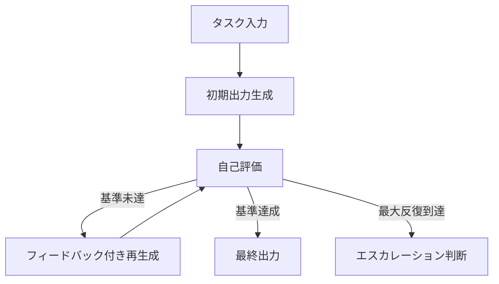
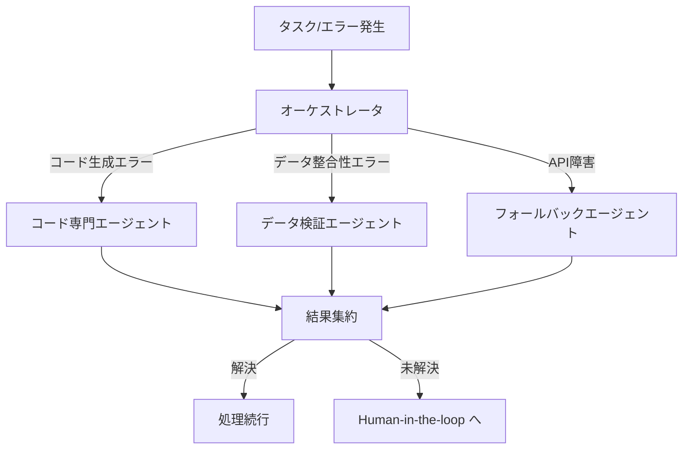
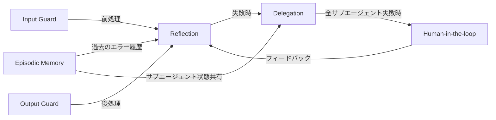
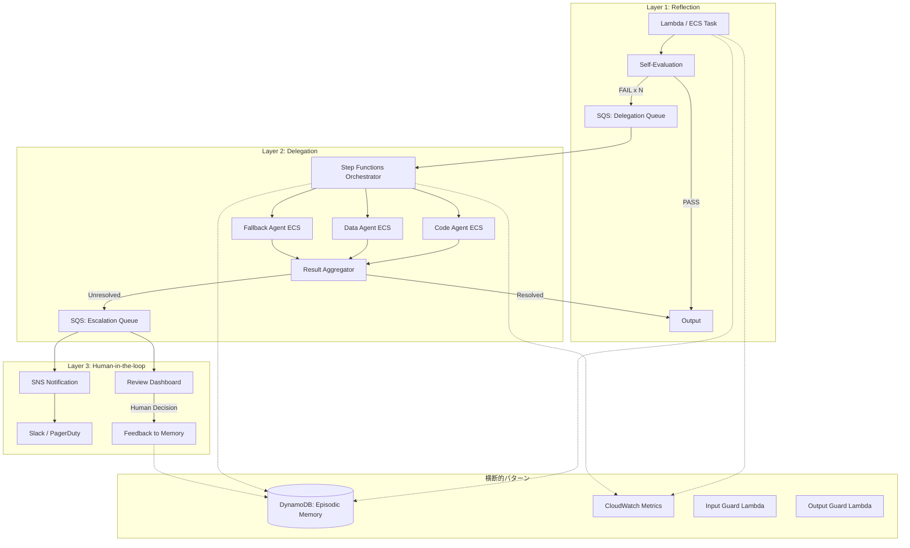

## 論文概要（Abstract）

本記事は <https://arxiv.org/abs/2405.14751> の解説記事です。

ファウンデーションモデル（FM）ベースのエージェント開発が急速に進む中、再利用可能な設計知識の体系化が遅れていた。著者らは、AutoGPT・BabyAGI・MetaGPT・LangChainエージェント等の実システムから帰納的に**18種類のアーキテクチャ設計パターン**を抽出し、8カテゴリに分類したカタログを提示している。各パターンには適用条件・トレードオフ・実装上の注意点が記述されており、エージェント設計の共通語彙として機能することを目指している。

この記事は [Zenn記事: AIエージェントの3層エラー回復設計](https://zenn.dev/0h_n0/articles/69eae7260e1fa5) の深掘りです。

## 情報源

- **arXiv ID**: 2405.14751
- **URL**: [arXiv:2405.14751](https://arxiv.org/abs/2405.14751)
- **著者**: Yue Liu, Sin Kit Lo, Qinghua Lu, Liming Zhu, Dehai Zhao, Xiwei Xu
- **発表年**: 2024年5月
- **分野**: Software Engineering (cs.SE), Artificial Intelligence (cs.AI)

## 背景と動機（Background）

### エージェント開発における設計知識の断片化

GPT-4やClaude等のファウンデーションモデルを中核としたエージェントシステムは、2023年以降急速に増加した。AutoGPT、BabyAGI、CrewAI、LangChainエージェントなど多数のフレームワークが登場しているが、これらの設計判断は各プロジェクトに閉じており、体系的な整理がなされていなかった。

従来のソフトウェア工学では、GoFデザインパターン（1994）やEnterprise Integration Patterns（2003）のように、繰り返し現れる設計上の問題とその解法をパターンとして記録・共有する文化が確立されている。しかし、FMベースエージェントの領域では以下の課題があったと著者らは指摘している：

1. **共通語彙の欠如**: 同じ設計概念が異なる名前で呼ばれ、コミュニケーションコストが高い
2. **設計判断の暗黙知化**: なぜその構造を選んだのかが明文化されていない
3. **パターン間の関係性が不明**: どのパターンを組み合わせると効果的か、あるいは衝突するかが整理されていない

### なぜこの研究が重要か

エージェント開発においてエラー回復は中心的な課題である。Zenn記事で紹介した3層エラー回復モデル（自動修復→ワークフロー回復→ヒューマンエスカレーション）は実践的な設計指針だが、その理論的裏付けとなるパターン体系が本論文である。Reflectionパターン（Layer 1）、Delegationパターン（Layer 2）、Human-in-the-loopパターン（Layer 3）がそれぞれ対応し、個別の技法ではなく体系的な設計パターンとして位置づけられる。

## 主要な貢献（Key Contributions）

1. **18種類のアーキテクチャ設計パターンの体系化**: 実システムから帰納的に抽出した再利用可能な設計パターンを、問題・解決策・適用条件・トレードオフの形式で記述
2. **8カテゴリの分類体系**: Goal, Plan, Role, Memory, Tool, Prompt, Interaction, Safetyの8軸でパターンを組織化し、パターン間の依存関係を明示
3. **事例による検証**: AutoGPT、MetaGPT等の実システムにおけるパターン適用を分析し、カタログの網羅性と有用性を定性的に検証

## 技術的詳細（Technical Details）

### 8カテゴリの概要

著者らは18のパターンを以下の8カテゴリに分類している。各カテゴリはエージェントアーキテクチャの異なる側面を担当する。

```mermaid
graph TD
    A[Agent Design Patterns] --> B[Goal]
    A --> C[Plan]
    A --> D[Role]
    A --> E[Memory]
    A --> F[Tool]
    A --> G[Prompt]
    A --> H[Interaction]
    A --> I[Safety]
    B --> B1[Goal Decomposition]
    B --> B2[Goal Prioritization]
    C --> C1[Single-path Plan]
    C --> C2[Multi-path Plan]
    D --> D1[Agent Persona]
    D --> D2[Agent Teamwork]
    E --> E1[Episodic Memory]
    E --> E2[Semantic Memory]
    E --> E3[Procedural Memory]
    F --> F1[Tool Creation]
    F --> F2[Tool Selection]
    G --> G1[Prompt Engineering]
    G --> G2[Prompt Chaining]
    H --> H1[Reflection]
    H --> H2[Human-in-the-loop]
    H --> H3[Delegation]
    I --> I1[Input Guard]
    I --> I2[Output Guard]
    I --> I3[Guardrail Composition]
```



各カテゴリの要点を以下にまとめる：

| カテゴリ | パターン数 | 主な関心事 |
|----------|-----------|-----------|
| Goal | 2 | タスクの分解と優先順位付け |
| Plan | 2 | 実行計画の単一経路・複数経路戦略 |
| Role | 2 | エージェントのペルソナとチーム構成 |
| Memory | 3 | エピソード・セマンティック・手続き記憶 |
| Tool | 2 | ツールの作成と動的選択 |
| Prompt | 2 | プロンプト設計とチェイニング |
| Interaction | 3 | 自己反省・人間介入・委譲 |
| Safety | 3 | 入出力ガード・ガードレール合成 |

エラー回復に直接関わるのは**Interactionカテゴリの3パターン**である。以下、それぞれを詳述する。

### Reflection Pattern（自己反省パターン）— Layer 1 対応

**問題**: エージェントが生成した出力に誤りや品質不足が含まれるが、毎回人間がチェックするのはスケーラブルでない。

**解決策**: エージェント自身が出力を評価し、基準を満たさない場合は反復的に修正するループを構成する。

著者らは、Reflectionパターンの構造を以下のように記述している：

1. **生成フェーズ**: エージェントがタスクに対する初期出力を生成
2. **評価フェーズ**: 同一または別のFMが出力を評価基準に照らして判定
3. **修正フェーズ**: 評価結果をフィードバックとして再生成
4. **終了条件**: 品質基準を満たすか、最大反復回数に達した場合にループを終了



**適用条件**:
- 出力品質の評価基準が明確に定義可能な場合
- FMが自身の出力の欠陥を検出できる能力を持つ場合
- 反復によるレイテンシ増加が許容される場合

**トレードオフ**: 著者らは、反復回数の増加に伴いAPIコストとレイテンシが線形に増加することを指摘している。また、FM自身による評価にはバイアスがあり、自身のエラーを検出できない盲点が存在する。このため、後述のDelegationやHuman-in-the-loopとの組み合わせが重要になる。

Zenn記事の3層モデルにおけるLayer 1（自動修復）は、このReflectionパターンの直接的な実装に当たる。

### Delegation Pattern（委譲パターン）— Layer 2 対応

**問題**: 単一のエージェントがすべてのタスクや例外処理を担当すると、複雑性が増大し、特定領域での品質が低下する。

**解決策**: 特定の機能やエラーリカバリを専門のサブエージェントに委譲する。オーケストレータがタスクの振り分けとサブエージェント間の調整を行う。

著者らは、Delegationパターンの構成要素を以下のように整理している：

1. **オーケストレータ**: タスクの分類と適切なサブエージェントへのルーティング
2. **専門エージェント群**: 各領域に特化した能力を持つサブエージェント
3. **結果集約**: サブエージェントの出力を統合して最終結果を構成
4. **エラーハンドリング**: サブエージェントの失敗時に代替エージェントへの再委譲や上位層へのエスカレーション



**適用条件**:
- タスクが明確に分割可能で、各部分に異なる専門性が必要な場合
- サブエージェント間の通信オーバーヘッドが許容される場合
- エラーの種類に応じて異なる回復戦略が有効な場合

**トレードオフ**: 著者らは、委譲の粒度設計が最も困難な判断であると述べている。粒度が細かすぎるとオーケストレーションのオーバーヘッドが支配的になり、粗すぎると単一エージェントと変わらなくなる。また、サブエージェント間の状態共有にはMemoryパターンとの組み合わせが必要になる。

Zenn記事のLayer 2（ワークフロー回復）は、Delegationパターンにおけるエラーハンドリング機構に対応する。

### Human-in-the-loop Pattern（人間介在パターン）— Layer 3 対応

**問題**: エージェントの自律的な判断には限界があり、高リスクな決定や曖昧な状況では人間の介入が不可欠である。

**解決策**: 特定の条件をトリガーとして人間の判断を要求するインタラクションポイントを設計する。

著者らは、Human-in-the-loopパターンにおける介入トリガーの類型を以下のように分類している：

1. **確信度ベース**: FMの出力確信度が閾値を下回った場合
2. **リスクベース**: 操作が不可逆またはコストが高い場合（本番デプロイ、データ削除等）
3. **ポリシーベース**: 規制要件やコンプライアンスルールに該当する場合
4. **エスカレーションベース**: Reflectionの最大反復やDelegationの全サブエージェント失敗時

**適用条件**:
- 自律的な判断のリスクが許容範囲を超える場面が存在する場合
- 人間のレスポンスタイムがシステム全体のSLAに収まる場合
- 人間のフィードバックをエージェントの学習に活用可能な場合

**トレードオフ**: 介入頻度とエージェントの自律性はトレードオフの関係にある。介入が多すぎると人間がボトルネックになり、少なすぎると重大なエラーを見逃す。著者らは、適切な閾値設定とエスカレーションポリシーの設計が実用上の最大の課題であると述べている。

### パターン間の依存関係

著者らは、パターンが孤立して機能するのではなく、相互に依存・補完し合うことを強調している。エラー回復に関連する主要な依存関係は以下の通りである：



この依存構造は、Zenn記事で提示した3層モデル（Layer 1 → Layer 2 → Layer 3）のエスカレーション階層と一致する。各層が独立ではなく、前の層の失敗が次の層のトリガーとなる連鎖構造をパターンレベルで定義している点が本論文の貢献である。

また、Memory、Safety（Input Guard/Output Guard）パターンは横断的に機能し、各Interactionパターンの効果を強化する。例えば、Episodic Memoryを用いてReflectionの過去の修正履歴を蓄積することで、同種のエラーに対する修正精度が向上する。

### Python実装例：Reflectionパターンの簡易実装

以下は、Reflectionパターンの基本構造を示すPython実装例である。本論文の記述に基づき、生成→評価→修正ループの骨格を示す。

```python
"""Reflection Pattern の簡易実装例.

本論文の Reflection パターンに基づく自己評価・修正ループの骨格実装。
実際の FM 呼び出しは抽象化している。
"""

from dataclasses import dataclass
from enum import Enum
from typing import Protocol


class EvalResult(Enum):
    """評価結果."""

    PASS = "pass"
    FAIL = "fail"


@dataclass(frozen=True)
class ReflectionFeedback:
    """Reflection 評価のフィードバック."""

    result: EvalResult
    issues: list[str]
    suggestions: list[str]


class Generator(Protocol):
    """出力生成インターフェース."""

    def generate(self, task: str, feedback: ReflectionFeedback | None = None) -> str:
        """タスクに対する出力を生成する."""
        ...


class Evaluator(Protocol):
    """出力評価インターフェース."""

    def evaluate(self, task: str, output: str) -> ReflectionFeedback:
        """出力を評価基準に照らして判定する."""
        ...


@dataclass
class ReflectionConfig:
    """Reflection ループの設定."""

    max_iterations: int = 3
    escalation_enabled: bool = True


class ReflectionLoop:
    """Reflection パターンの実装.

    生成 → 評価 → 修正のループを最大 max_iterations 回実行する。
    基準を満たさず最大反復に達した場合は EscalationRequired を送出する。
    """

    def __init__(
        self,
        generator: Generator,
        evaluator: Evaluator,
        config: ReflectionConfig | None = None,
    ) -> None:
        self._generator = generator
        self._evaluator = evaluator
        self._config = config or ReflectionConfig()

    def run(self, task: str) -> str:
        """Reflection ループを実行し、品質基準を満たす出力を返す.

        Args:
            task: 生成タスクの記述

        Returns:
            品質基準を満たした出力文字列

        Raises:
            EscalationRequired: 最大反復到達時（Layer 2/3 へのエスカレーション）
        """
        feedback: ReflectionFeedback | None = None

        for iteration in range(self._config.max_iterations):
            output = self._generator.generate(task, feedback)
            feedback = self._evaluator.evaluate(task, output)

            if feedback.result == EvalResult.PASS:
                return output

        # 最大反復到達 — Delegation または Human-in-the-loop へ
        if self._config.escalation_enabled:
            raise EscalationRequired(
                task=task,
                last_output=output,
                last_feedback=feedback,
                iterations=self._config.max_iterations,
            )
        return output


class EscalationRequired(Exception):
    """Reflection ループが基準未達のまま最大反復に到達した場合の例外.

    Delegation パターンまたは Human-in-the-loop パターンへの
    エスカレーションを示す。
    """

    def __init__(
        self,
        task: str,
        last_output: str,
        last_feedback: ReflectionFeedback | None,
        iterations: int,
    ) -> None:
        self.task = task
        self.last_output = last_output
        self.last_feedback = last_feedback
        self.iterations = iterations
        super().__init__(
            f"Reflection failed after {iterations} iterations: "
            f"{[i for i in (last_feedback.issues if last_feedback else [])]}"
        )
```

この実装で注目すべき設計判断は以下の通り：

- **Protocol による抽象化**: Generator・Evaluator を Protocol で定義し、FM の種類に依存しない構造とした。これは論文が述べる「パターンは特定の実装に依存しない」という原則に沿っている
- **EscalationRequired 例外**: Reflection の失敗を例外として伝播させることで、Delegation パターンや Human-in-the-loop パターンとの接続点を明示した
- **イミュータブルな ReflectionFeedback**: `frozen=True` により、評価結果が後から変更されないことを型レベルで保証

## 実装のポイント

著者らのパターン記述から読み取れる実装上の重要な判断基準を整理する。

**Reflection パターン**:
- 最大反復回数は2〜5回が実用的な範囲であると報告されている。回数を増やしても品質改善は逓減し、コストは線形増加する
- 評価基準は定量的（テスト通過率等）と定性的（可読性等）の組み合わせが効果的
- 自己評価のバイアスを軽減するには、生成と評価で異なるFMを使用する手法がある

**Delegation パターン**:
- サブエージェントの登録は静的（設計時定義）と動的（実行時発見）の2方式がある
- 状態共有にはShared Memory（Semantic Memory パターン）を用いるのが一般的
- タイムアウトとサーキットブレーカーの設計が安定性に直結する

**Human-in-the-loop パターン**:
- 介入リクエストには十分なコンテキスト（エラー履歴、試行済み戦略）を添付する
- 非同期介入（チケットシステム）と同期介入（リアルタイムチャット）で設計が大きく異なる
- 人間のフィードバックをEpisodic Memoryに蓄積し、将来の自動判断に活用する仕組みが推奨されている

## Production Deployment Guide

本論文のパターンを組み合わせたマルチパターンエージェントシステムを本番環境にデプロイする際の設計指針を、AWSを中心としたインフラ構成とともに示す。

### アーキテクチャ概要

3層エラー回復モデルをAWS上で実現するための推奨構成：



### Terraform によるインフラ定義（抜粋）

以下は、Reflection ループの最大反復到達時に Delegation 層へエスカレーションするための SQS キュー定義の例である：

```hcl
# Reflection → Delegation エスカレーションキュー
resource "aws_sqs_queue" "delegation_queue" {
  name                       = "agent-delegation-queue"
  visibility_timeout_seconds = 300
  message_retention_seconds  = 86400
  redrive_policy = jsonencode({
    deadLetterTargetArn = aws_sqs_queue.delegation_dlq.arn
    maxReceiveCount     = 3
  })

  tags = {
    Pattern = "Delegation"
    Layer   = "2"
  }
}

resource "aws_sqs_queue" "delegation_dlq" {
  name                      = "agent-delegation-dlq"
  message_retention_seconds = 1209600  # 14 days
}

# Delegation → Human-in-the-loop エスカレーション
resource "aws_sqs_queue" "escalation_queue" {
  name                       = "agent-escalation-queue"
  visibility_timeout_seconds = 600
  message_retention_seconds  = 604800  # 7 days

  tags = {
    Pattern = "Human-in-the-loop"
    Layer   = "3"
  }
}

# SNS による通知（Slack/PagerDuty 連携）
resource "aws_sns_topic" "escalation_notify" {
  name = "agent-escalation-notify"
}

resource "aws_sns_topic_subscription" "slack_webhook" {
  topic_arn = aws_sns_topic.escalation_notify.arn
  protocol  = "https"
  endpoint  = var.slack_webhook_url
}
```

### モニタリング設計

各パターンの健全性を監視するために、以下のメトリクスを CloudWatch に送出する：

| メトリクス | パターン | 意味 | アラート閾値（参考） |
|-----------|---------|------|-------------------|
| `reflection.iteration_count` | Reflection | 1タスクあたりの反復回数 | 平均 > 2.5 |
| `reflection.escalation_rate` | Reflection | Delegation へのエスカレーション率 | > 15% |
| `delegation.resolution_rate` | Delegation | サブエージェントによる解決率 | < 70% |
| `delegation.latency_p99` | Delegation | サブエージェント応答の P99 レイテンシ | > 30s |
| `hitl.pending_count` | Human-in-the-loop | 未処理の人間介入リクエスト数 | > 10 |
| `hitl.response_time_p50` | Human-in-the-loop | 人間応答時間の中央値 | > 30min |
| `memory.episodic_hit_rate` | Episodic Memory | 過去事例の再利用率 | < 20% |

### コストチェックリスト

マルチパターンエージェントシステムのコスト管理における主要項目：

- **FM API コスト**: Reflection の反復回数が最大のコストドライバー。最大反復数の適切な設定と、評価用 FM に軽量モデル（Claude Haiku 等）を使う戦略が有効
- **コンピュート**: Delegation のサブエージェント並列実行数に応じて ECS タスクが増加。スポットインスタンスの活用と適切なオートスケーリング設定が必要
- **キュー/通知**: SQS・SNS のコストは通常無視できる水準だが、DLQ の滞留モニタリングは必須
- **ストレージ**: DynamoDB の Episodic Memory は書き込み量に注意。TTL 設定により古い記録を自動削除
- **人的コスト**: Human-in-the-loop の介入頻度がオペレーションコストに直結。エスカレーション率の継続的な改善が Layer 1/2 の品質向上によって実現される

## 事例分析（Case Studies）

本論文は定量的なベンチマーク実験ではなく、既存システムにおけるパターン適用の定性分析を行っている。以下に主要な事例を紹介する。

### AutoGPT における適用

著者らの分析によると、AutoGPT は以下のパターンを組み合わせている：

- **Goal Decomposition**: ユーザーの高レベル目標を小タスクに分解
- **Single-path Plan**: 逐次的な計画実行
- **Reflection**: 各ステップの出力を自己評価し、必要に応じて再試行
- **Tool Selection**: 利用可能なツール群から動的に選択
- **Episodic Memory**: 過去の実行結果をコンテキストとして保持

AutoGPT の課題として著者らは、Reflection の反復が過剰になりやすく（いわゆるループトラップ）、明示的なエスカレーション機構（Delegation や Human-in-the-loop）が弱い点を指摘している。

### MetaGPT における適用

MetaGPT はマルチエージェント構成を採用しており、以下のパターンが顕著である：

- **Agent Teamwork**: Product Manager、Engineer、QA等の役割に特化したエージェント群
- **Delegation**: 役割間でのタスク委譲と結果統合
- **Procedural Memory**: ソフトウェア開発プロセス（要件定義→設計→実装→テスト）の手続き的知識
- **Output Guard**: 生成コードの品質チェック

MetaGPT は Delegation パターンの成功例であるが、著者らは各エージェント間の通信オーバーヘッドと、役割の粒度設計が品質に大きく影響することを報告している。

### LangChain エージェントにおける適用

LangChain のエージェントフレームワークでは：

- **Tool Selection**: ReAct フレームワークによる動的ツール選択
- **Prompt Chaining**: 中間結果を次のプロンプトに連鎖
- **Input Guard / Output Guard**: LangChain の Guardrails 機構

これらの事例分析を通じて、著者らは「ほとんどのエージェントシステムは3〜6個のパターンを組み合わせている」と報告している。単独パターンで動作するシステムは実用的なものには見られなかった。

### 制約と限界

著者らは以下の制約を認めている：

- **定量的検証の欠如**: パターン適用の効果を定量的に測定するベンチマークは提供されていない
- **進化速度への追随**: FMベースエージェントの領域は急速に変化しており、新しいパターンが継続的に出現する可能性がある
- **汎用性の限界**: 抽出元のシステムは主にテキストベースのエージェントであり、マルチモーダルエージェントへの適用性は検証されていない

## 実運用への応用

本論文のパターンカタログは、Zenn記事で紹介した3層エラー回復モデルの設計根拠として機能する。

| 3層モデル | 対応パターン | 設計指針 |
|----------|-------------|---------|
| Layer 1: 自動修復 | Reflection + Output Guard | 最大反復回数を設定し、超過時は Layer 2 へ |
| Layer 2: ワークフロー回復 | Delegation + Agent Teamwork | 専門エージェントへの委譲と並列回復戦略 |
| Layer 3: ヒューマンエスカレーション | Human-in-the-loop + Input Guard | 介入トリガーの明確化とコンテキスト伝達 |
| 横断的 | Episodic Memory + Guardrails | エラー履歴の蓄積と安全性確保 |

実運用において著者らのカタログを活用する際の推奨事項：

1. **パターンの段階的導入**: まずReflection（Layer 1）を実装し、エスカレーション率を観測してからDelegation（Layer 2）を追加する。全パターンを一度に導入するのは複雑性が高すぎる
2. **パターン間のインターフェース設計**: 各パターンの境界（エスカレーション条件、フィードバック形式）を先に定義し、実装を後から埋める
3. **Episodic Memory の早期導入**: エラー履歴の蓄積は、他のすべてのパターンの品質向上に寄与する。最初から導入する価値がある

## 関連研究

FMベースエージェントの設計パターンに関する研究は、2024年以降急速に増加している。

- **Xi et al. (2023)**: "The Rise and Potential of Large Language Model Based Agents: A Survey" — LLMエージェントの包括的サーベイ。アーキテクチャを Brain-Perception-Action の3モジュールに分類しているが、設計パターンとしての形式化は行っていない
- **Wang et al. (2024)**: "A Survey on Large Language Model based Autonomous Agents" — 自律エージェントの構成要素を Profile-Memory-Planning-Action に分類。本論文より粗い粒度だが、実験的評価を含む点で補完的
- **Weng (2023)**: "LLM Powered Autonomous Agents" — Lilian Weng によるブログ記事。Planning, Memory, Tool Use の3軸で整理しており、本論文のカタログのサブセットに対応する
- **GoF Design Patterns (1994)**: 従来のソフトウェア設計パターンの古典。著者らはGoFの記述形式（Context-Problem-Solution-Consequences）を参考にしつつ、FMエージェント固有の要素（プロンプト、ファウンデーションモデル、自律性レベル）を加えている

本論文の独自性は、実システムからの帰納的抽出と、パターン間依存関係の明示化にある。

## まとめと今後の展望

本論文は、FMベースエージェントの設計知識を18の再利用可能なパターンとして体系化した。特にInteractionカテゴリのReflection・Delegation・Human-in-the-loopの3パターンは、エラー回復の階層構造を設計レベルで定義するものであり、Zenn記事で提示した3層モデルの理論的基盤となる。

著者らの貢献は設計語彙の標準化にあり、「このシステムはReflectionパターンを採用し、最大3回の反復後にDelegationへエスカレーションする」といった記述が可能になる。これにより、チーム間のコミュニケーションコストが低減し、設計レビューの効率が向上する。

一方で、定量的な検証が不足している点は今後の課題である。各パターンの組み合わせが品質・コスト・レイテンシに与える影響を定量的に測定するベンチマークの整備が期待される。また、マルチモーダルエージェントやエンボディドエージェントへの拡張も今後の研究方向として挙げられている。

## 参考文献

1. Liu, Y., Lo, S. K., Lu, Q., Zhu, L., Zhao, D., & Xu, X. (2024). Agent Design Pattern Catalogue: A Collection of Architectural Patterns for Foundation Model based Agents. *arXiv preprint arXiv:2405.14751*.
2. Gamma, E., Helm, R., Johnson, R., & Vlissides, J. (1994). *Design Patterns: Elements of Reusable Object-Oriented Software*. Addison-Wesley.
3. Xi, Z., et al. (2023). The Rise and Potential of Large Language Model Based Agents: A Survey. *arXiv preprint arXiv:2309.07864*.
4. Wang, L., et al. (2024). A Survey on Large Language Model based Autonomous Agents. *Frontiers of Computer Science*, 18(6).
5. Weng, L. (2023). LLM Powered Autonomous Agents. *Lil'Log*.
6. Hohpe, G., & Woolf, B. (2003). *Enterprise Integration Patterns*. Addison-Wesley.
