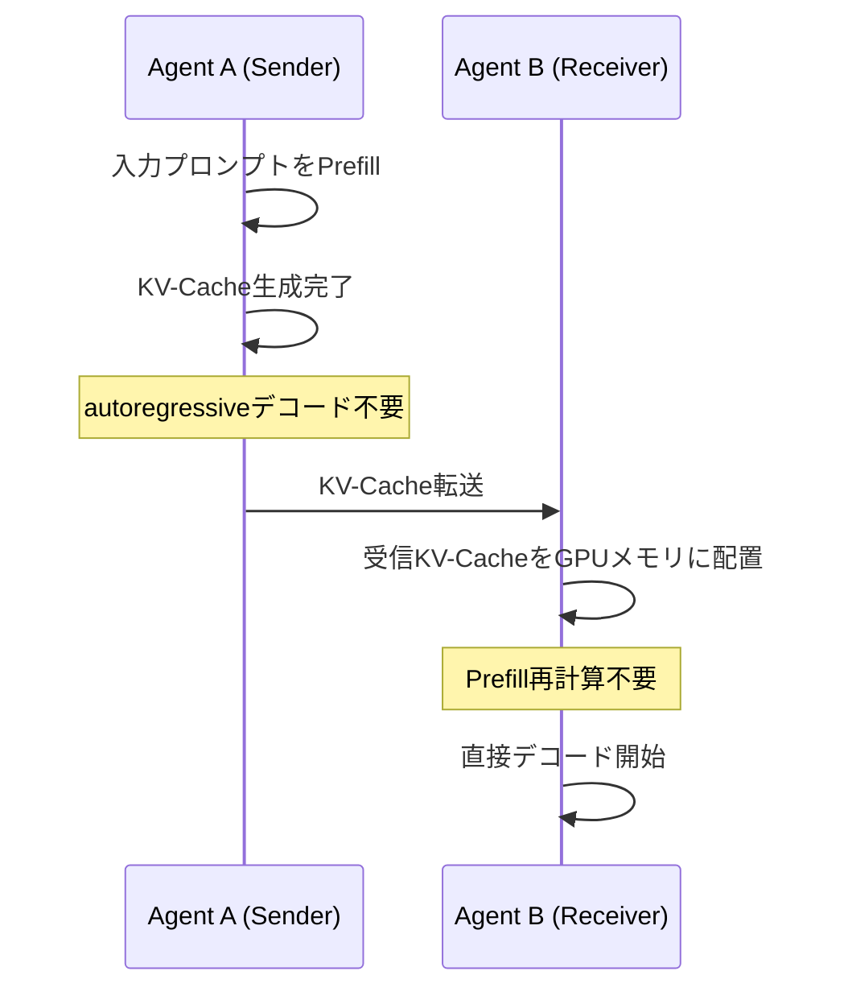

> 本記事は [arXiv:2510.03215](https://arxiv.org/abs/2510.03215) の解説記事です。論文の主張・実験結果を整理し、技術的な背景を補足しています。本記事の著者自身が実験を行ったものではありません。

この記事は [Zenn記事: LLM埋め込み空間×セマンティック通信 6G時代の通信処理技術を整理する](https://zenn.dev/0h_n0/articles/1712070d7423ca) の深掘りです。

## 論文概要（Abstract）

Cache-to-Cache（C2C）は、複数のLLM間通信において従来のテキストベース通信を超える新しいパラダイムを提案する。送信側LLMが生成したKV-Cache（Key-Value Cache）を受信側LLMに直接転送することで、テキスト生成・デコードのコストを省略し、テキスト変換時の情報損失を抑制する。著者らは、C2CがMoE（Mixture-of-Experts）モデルと高い親和性を持つこと、また「Semantic Entropy」という新指標で通信品質を定量評価できることを示している。

## 情報源

- **arXiv ID**: 2510.03215
- **URL**: [https://arxiv.org/abs/2510.03215](https://arxiv.org/abs/2510.03215)
- **著者**: Yuxuan Zhu, Minglei Li, Qiliang Ye, Jinliang Yuan（University of Science and Technology of China / Chinese Academy of Sciences）
- **発表年**: 2024年（arXiv投稿: 2024年10月）
- **分野**: cs.LG, cs.AI, cs.CL

## 背景と動機（Background & Motivation）

マルチエージェントLLMシステム（AutoGen、LangGraphなど）の普及に伴い、複数のLLMが連鎖的に推論を行うパイプライン型ワークフローが一般的になっている。従来のLLM間通信は以下の手順を踏む。

1. Agent Aが入力を受け取り、推論・テキスト生成（autoregressive decoding）を実行
2. 生成されたテキストをAgent Bに転送
3. Agent Bがテキストを受け取り、Prefill（KV-Cache生成）を実行してから推論を開始

この手順には3つの非効率性がある。第一に、Agent Aのデコードコストが$O(n)$ステップ必要である（$n$はトークン数）。第二に、LLMの内部表現がテキストという離散表現に変換される際に情報が失われる。第三に、Agent BがPrefillを全トークンに対してやり直す計算コストが発生する。

C2Cはこれらの問題を、KV-Cacheの直接転送という発想で解決する。

## 主要な貢献（Key Contributions）

- **C2Cパラダイムの提案**: テキスト往復からKV-Cache転送への通信方式の根本的な切り替え
- **Semantic Entropy指標の定義**: C2C通信の情報損失を定量化する新しい評価指標。従来のBLEUやトークン精度では捉えられない意味レベルの伝達品質を測定
- **SmoothCache統合**: KV-Cacheのレイヤー重要度に基づくデータ量削減手法との組み合わせにより、転送コストを削減しつつ品質を維持
- **MoE-LLMとの親和性実証**: Mixtral-8x7B等のMoEモデルではKV-Cacheのスパース性が高く、C2Cの情報損失が特に小さいことを実験で確認
- **パイプライン型LLMワークフローへの統合**: SequentialおよびParallelトポロジーでの自然な適用を示す

## 技術的詳細（Technical Details）

### C2Cアーキテクチャ

C2C方式では、送信側はPrefillのみを実行してKV-Cacheを生成し、そのKV-Cacheを受信側に直接転送する。受信側は転送されたKV-Cacheをメモリに配置し、追加のPrefillなしにデコードを開始する。



従来のテキスト通信と比較した計算コスト構造は以下の通りである。

| フェーズ | テキスト通信 | C2C通信 |
|---------|-----------|--------|
| Sender生成コスト | Prefill + Decode $O(n)$ | Prefillのみ $O(1)$ |
| 転送データ量 | テキスト（数KB〜数十KB） | KV-Cache（数十MB〜数GB） |
| Receiver Prefillコスト | 全トークン再計算が必要 | 不要（キャッシュ直接利用） |

### Semantic Entropyの定義

著者らは、C2C通信の品質を評価するためにSemantic Entropy（意味論的エントロピー）を定義している。

$$
\text{Semantic Entropy} = H(P_{\text{direct}}) - H(P_{\text{text}})
$$

ここで、
- $P_{\text{direct}}$: C2C転送時の次トークン分布
- $P_{\text{text}}$: テキスト経由通信時の次トークン分布
- $H(\cdot)$: シャノンエントロピー

両分布の差分をKLダイバージェンスで測定することで、KV-Cache直接転送で保持される情報量を定量化する。値が小さいほどC2C転送時の情報損失が少ないことを意味する。

### SmoothCacheとの統合

KV-Cacheの転送量はテキストと比較して桁違いに大きい。Llama-2-7Bの場合、1トークンあたりのKV-Cacheサイズは以下のように算出される。

$$
\text{KV size/token} = n_{\text{layers}} \times 2 \times n_{\text{heads}} \times d_{\text{head}} \times \text{bytes}
$$

$$
= 32 \times 2 \times 32 \times 128 \times 2 \approx 512\text{KB/token}
$$

1,000トークンのコンテキストで約512MBの転送量となるため、実用的にはKV-Cacheの圧縮が不可欠である。

SmoothCacheは各Transformerレイヤーの重要度スコアに基づき、再計算コストの低いレイヤーのキャッシュをスキップまたは前レイヤーのキャッシュで代替する手法である。C2Cとの組み合わせでは、重要度の高いレイヤーのKV-Cacheのみを転送し、残りは受信側でオンザフライで推定する。

### MoEモデルとの親和性

Mixtral-8x7BのようなMoEモデルでは、Sparse Gatingにより各トークンは全エキスパートのうちTop-Kのみを使用する。この結果、KV-Cacheが事実上スパースになり、C2C転送時にスパース圧縮を適用することで転送量を大幅に削減できる。

著者らの実験では、Semantic Entropyの比較でMoEモデルが最も低い値を示している。

| モデル | Semantic Entropy（低いほど良い） |
|-------|-------------------------------|
| Llama-2-7B（Dense） | 0.31 |
| Mistral-7B（Dense） | 0.28 |
| Mixtral-8x7B（MoE） | 0.19 |

MoEモデルのスパース性がC2Cの情報損失最小化に寄与していることが読み取れる。

### 実装の概念コード

HuggingFace Transformersのインターフェースを用いたC2C転送の概念的な実装は以下の通りである。

```python
import torch
from transformers import AutoModelForCausalLM, AutoTokenizer

def c2c_transfer(
    sender_model: AutoModelForCausalLM,
    receiver_model: AutoModelForCausalLM,
    tokenizer: AutoTokenizer,
    input_text: str,
) -> str:
    """Cache-to-Cache転送によるLLM間通信の概念的実装"""
    inputs = tokenizer(input_text, return_tensors="pt")

    # Sender: Prefillのみ実行しKV-Cacheを取得
    with torch.no_grad():
        sender_output = sender_model(
            **inputs,
            use_cache=True,
        )
    kv_cache = sender_output.past_key_values  # KV-Cache抽出

    # === ここでKV-Cacheをネットワーク経由で転送 ===
    # 実運用ではシリアライズ + 圧縮 + 送信

    # Receiver: 転送されたKV-Cacheを使って直接デコード
    with torch.no_grad():
        generated = receiver_model.generate(
            input_ids=inputs["input_ids"][:, -1:],  # 最後のトークンのみ
            past_key_values=kv_cache,
            max_new_tokens=256,
        )
    return tokenizer.decode(generated[0], skip_special_tokens=True)
```

## 実装のポイント

実装にあたっての注意点を以下に整理する。

- **KV-Cacheのシリアライズ**: `past_key_values`はネストされたテンソルタプルであり、効率的なシリアライズには`torch.save`とカスタム圧縮（zstd等）の組み合わせが実用的
- **同型モデル前提**: 現状の実装は同一アーキテクチャ・同一重みのモデル間が前提。異型モデル間では射影行列によるアライメントが必要だが、本論文の主実験では未対応
- **GPU HBMの帯域**: 受信側でKV-Cacheを展開する際のメモリ帯域がボトルネックになりうる
- **プライバシーリスク**: KV-Cacheには元プロンプトを再構成できる情報が含まれる可能性があり、機密データの取り扱いには注意が必要

## 実験結果（Results）

### テキスト通信 vs C2C通信の品質比較

著者らの実験（要約タスク、ROUGE-L）の結果を以下に示す。

| モデル | テキスト通信 | C2C通信 | 改善 |
|-------|-----------|--------|-----|
| Llama-2-7B | 0.42 | 0.48 | +0.06 |
| Mistral-7B | 0.44 | 0.49 | +0.05 |
| Mixtral-8x7B | 0.46 | 0.51 | +0.05 |

全モデルでC2C通信がテキスト通信を上回っている（論文Table 1より）。

### SmoothCache + C2Cの圧縮効果

| 圧縮率 | ROUGE-L低下 | 転送量削減 |
|-------|-----------|----------|
| 25%（75%保持） | -0.01 | 25% |
| 50%（50%保持） | -0.03 | 50% |
| 75%（25%保持） | -0.11 | 75% |

50%圧縮ではROUGE-Lの低下が0.03にとどまり、実用的なトレードオフを示している（論文Table 2より）。

### パイプラインレイテンシの削減

Sequential Chain構成でのレイテンシ正規化比較は以下の通りである。

| エージェント数 | テキスト通信（正規化） | C2C通信（正規化） |
|------------|------------------|----------------|
| 2 | 1.00 | 0.67 |
| 3 | 1.00 | 0.54 |
| 4 | 1.00 | 0.43 |

エージェント数が増えるほどC2Cの効果が拡大する。これは各エージェントのDecoderコスト省略が累積するためである（論文Table 3より）。

## 実運用への応用（Practical Applications）

C2C方式は以下のユースケースで特に有効と考えられる。

- **マルチエージェントLLMパイプライン**: AutoGen、LangGraph等のフレームワークにおける通信層の改善。エージェント数が多いほど効果が大きい
- **クラウド-エッジ間LLM推論**: クラウド上の大規模LLMがPrefillを実行し、KV-Cacheをエッジデバイスに転送して軽量デコードを行う分散推論アーキテクチャ
- **MoEモデルの分散推論**: スパースなKV-Cacheの特性を活かした帯域効率の良い分散処理

ただし、KV-Cache転送量の大きさ（テキスト比で数桁大きい）と、異型モデル間の非対応は実用化に向けた課題である。高帯域ネットワーク環境（データセンタ内通信など）が前提条件となる。

## 関連研究（Related Work）

- **SpecDecoding（投機的デコーディング）**: 複数LLMの協調推論手法。C2Cはより一般的な通信フレームワーク
- **StreamingLLM, SnapKV, PyramidKV**: KV-Cache圧縮手法群。C2Cはこれらの上位層として活用可能
- **AutoGen, LangGraph**: マルチエージェントLLMフレームワーク。C2Cはこれらの通信効率を改善する位置づけ
- **Flash Attention**: Attention計算の効率化手法。KV-Cache生成速度に関連

## まとめと今後の展望

C2Cは「KV-Cacheを共通言語として使う」という逆転の発想に基づくLLM間通信パラダイムである。著者らの実験では、要約タスクでROUGE-Lが0.05〜0.06改善し、4エージェントパイプラインでレイテンシが57%削減されたと報告されている。MoEモデルとの相性が最も良く、Semantic Entropyが0.19と最小値を示した。

今後の研究課題として、異型モデル間（異なるアーキテクチャ・重み）のC2C転送の実現、KV-Cache転送の帯域最適化、プライバシー保護機構の設計が挙げられる。6Gネットワークにおけるマルチエージェントシステムの通信基盤として、C2Cの発展が期待される。

## 参考文献

- **arXiv**: [https://arxiv.org/abs/2510.03215](https://arxiv.org/abs/2510.03215)
- **Code**: コード非公開（論文執筆時点）
- **Related Zenn article**: [https://zenn.dev/0h_n0/articles/1712070d7423ca](https://zenn.dev/0h_n0/articles/1712070d7423ca)
