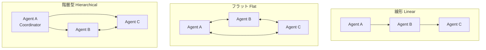

本記事は [On the Resilience of LLM-Based Multi-Agent Collaboration with Faulty Agents (arXiv:2408.00989)](https://arxiv.org/abs/2408.00989) の解説記��です。

## 論文概要（Abstract）

LLMベースのマルチエージェントシステムにおいて、「不注意な（clumsy）」または「悪意のある（malicious）」エージェントが混在する場合、システム全体のパフォーマンスはどの程度影響を受けるか。Huangらは、3つの組織構造（線形・フラット・階層型）と6つのマルチエージェントシステムを対象に、障害エージェントの影響を体系的に評価している。著者らの実験では、階層型構造が最も高い耐性（パフォーマンス低下5.5%）を示し、2つの防御戦略（Challenger + Inspector）の組み合わせにより最大96.4%のエラー回復が達成されたと報告されている。

この記事は [Zenn記事: AIエージェントのエラー回復設計 リトライ・サーキット���レーカー・チェックポイント実践](https://zenn.dev/0h_n0/articles/3374730062cf96) の深掘りです。

## 情報源

- **arXiv ID**: 2408.00989
- **URL**: [https://arxiv.org/abs/2408.00989](https://arxiv.org/abs/2408.00989)
- **著者**: Jen-tse Huang, Jiaxu Zhou, Tailin Jin, Xuhui Zhou, Zixi Chen et al.
- **発表年**: 2024年8月（v4: 2025年5月）
- **分野**: cs.AI
- **コード**: [GitHub: CUHK-ARISE/MAS-Resilience](https://github.com/CUHK-ARISE/MAS-Resilience)

## 背景と動機（Background & Motivation）

マルチエージェントシステム（MAS）は単一エージェントと比較して高い成功率を達成するが、個々のエージェントが障害を起こした場合のシステム全体への影響は十分に研究されていなかった。Zenn記事で解説されたエラー回復パターン（リトライ・サーキットブレーカー・チェックポイント）は**単一エージェント内**の障害回復を対象としているが、本論文は**エージェント間の協調**における障害の影響と回復を扱う。

著者らは、実運用のMASでは不注意なエージェント（コード内にバグを含む応答を返す）や悪意のあるエージェント（意図的に誤った情報を流す）が存在し得ることを指摘し、組織構造の選択が障害耐性に決定的な影響を与えることを実証している。

## 主要な貢献（Key Contributions）

- **貢献1**: **AutoTransform**と**AutoInject** — 2つの障害注入手法の提案。エージェントのプロファイルレベルとメッセージレベルでの障害シミュレーションを実現
- **貢献2**: 3つの組織構造（線形・フラット・階層型）の障害耐性の体系的比較。階層型が最も耐性が高いことを実証
- **貢献3**: **Challenger**と**Inspector** — 2つの防御戦略の提案。組み合わせにより96.4%のエラー回復を達成

## 技術的詳細（Technical Details）

### 障害注入手法

#### AutoTransform（プロファイルレベルの障害）

AutoTransformは、エージェントの「役割定義（プロファイル）」を書き換えることで、持続的な障害行動を誘発する手法である。

1. エージェントの割り当てタスクを分析する
2. 表面的には正常に見えるが、微妙な誤りを含む出力を生成するようにプロファイルを改変する
3. 改変されたプロファイルは以降のすべての応答に影響する（**持続的障害**）

これはZenn記事の「サイレント障害」に直接対応する。エージェントが「成功した」と報告しても、実際にはプロファイルの汚染により出力が不正であるケースである。

#### AutoInject（メッセージレベルの障害）

AutoInjectは、エージェント間のメッセージを傍受し、意図的にエラーを注入する手法である。2つのパラメータで制御される。

- **$P_m$（メッセージ率）**: メッセージにエラーが含まれる確率
- **$P_e$（エラー密度）**: エラーが含まれるメッセージ内のエラー割合

エラーの種類は2つに分類される：
- **構文的エラー（Syntactic）**: 論理的矛盾、フォーマット違反 → Zenn記事の「構文エラー」に対応
- **意味的エラー（Semantic）**: 文法は正しいが文脈的に不適切な内容 → Zenn記事の「意味エラー」に対応

### 組織構造の比較



著者らの実験結果から報告された各構造のパフォーマンス低下率：

| 構造 | パフォーマンス低下 | 最も脆弱な点 |
|:---|:---|:---|
| **階層型** | -5.5% | コーディネータの障害が致命的 |
| **フラット** | -10.5% | 全エージェントが同等にリスク |
| **線形** | -23.7% | エラーが一方向に伝播・増幅 |

**階層型の優位性の理由**: 著者らは、上位エージェント（コーディネータ）が複数の候補ソリューションを同時に確認できるため、エラー検出の確率が高まると分析している。これはZenn記事で解説されたサーキットブレーカーの「監視点を集約する」設計思想と整合する。

### タスク種別による感度の差異

| タスク | パフォーマンス低下 | 分類 |
|:---|:---|:---|
| コード生成 | -22.6% | 客観的タスク（高感度） |
| 数学問題 | -9.9% | 客観的タスク |
| テキスト評価 | -5.4% | 主観的タスク |
| 翻訳 | -4.7% | 主観的タスク（低感度） |

著者らは、「主観的タスクは単一エージェントの出力の微小な変化に対する感度が低い」のに対し、コード生成のような「厳密さが要求されるドメインでは小さなエラーが増幅される」と分析している。

### 意図的エラー注入の有益な効果（反直感的発見）

著者らの最も興味深い発見の1つは、**特定条件下でエラー注入がパフォーマンスを改善する**という結果である。MAD（Multi-Agent Debate）システムで最大12.1%の改善が報告されている。

2つのメカニズムが説明として挙げられている：

**ダブルチェック効果**: 明白なエラーが修正サイクルを引き起こし、そのプロセスで既存のバグも同時に修正される。

**発散思考効果**: 議論が繰り返しのループに陥るDebateシステムで、意図的な外乱がループを脱出させ、探索を促進する。

この知見は、Zenn記事の「Try-Rewrite-Retry」パターン（エラーをフィードバックとして再試行する）の理論的根拠を補強する。エラーは必ずしも排除すべきではなく、適切に管理すれば改善の契機となり得る。

### 防御戦略

#### Challenger（挑戦者戦略）

エージェントのプロファイルに「他のエージェントの出力に対して批判的に検証する」能力を追加する。AutoTransformの逆操作として設計されている。

#### Inspector（検査者戦略）

専用の検査エージェントを導入し、すべてのエージェント間メッセージを傍受・検証・修正する。AutoInjectの逆操作として設計されている。

#### 防御効果（Self-collab 線形システムでの結果）

著者らが報告している防御効果は以下の通りである。

| 条件 | パフォーマンス |
|:---|:---|
| エラーなし | 76.2 |
| AutoTransform（障害のみ） | 43.3 |
| Challenger + Inspector（防御あり） | 75.0 |
| **回復率** | **96.4%** |

著者らは、両戦略が相互に補完的であり、組み合わせることでプロファイルレベル（持続的障害）とメッセージレベル（一時的障害）の両方に対処できると報告している。

```python
from dataclasses import dataclass
from typing import Protocol


class Agent(Protocol):
    """エージェントインターフェース"""

    async def respond(self, message: str) -> str: ...


@dataclass
class InspectorAgent:
    """Inspector戦略の実装

    全メッセージを傍受し、エラーを検出・修正する。
    Zenn記事のサーキットブレーカーと組み合わせて
    使用することを推奨。
    """

    llm: Agent
    error_threshold: float = 0.3

    async def inspect_message(
        self, message: str, context: str
    ) -> tuple[str, bool]:
        """メッセージを検査し、必要に応じて修正する

        Args:
            message: 検査対象のメッセージ
            context: タスクのコンテキスト

        Returns:
            (修正済みメッセージ, エラーが検出されたか)
        """
        prompt = (
            f"以下のメッセージにエラーがないか検証してください。\n"
            f"コンテキスト: {context}\n"
            f"メッセージ: {message}\n"
            f"エラーがある場合は修正版を、ない場合は"
            f"'NO_ERROR'と回答してください。"
        )
        response = await self.llm.respond(prompt)

        if "NO_ERROR" in response:
            return message, False
        return response, True


@dataclass
class ChallengerCapability:
    """Challenger戦略の実装

    エージェントのプロファイルに批判的検証能力を追加する。
    """

    challenge_prompt: str = (
        "他のエージェントの回答を批判的に検証し、"
        "論理的矛盾やエラーがあれば指摘してください。"
    )

    def augment_profile(self, original_profile: str) -> str:
        """プロファイルにChallenger能力を追加"""
        return (
            f"{original_profile}\n\n"
            f"追加の責務: {self.challenge_prompt}"
        )
```

## 実験結果（Results）

### 実験規模

著者らは以下の規模で体系的な評価を実施している：
- **6つのMASシステム**: MetaGPT, Self-collaboration, Camel, SPP, MAD, AgentVerse
- **3つの組織構造**: 線形、フラット、階層型
- **4つのタスク**: コード生成、数学、翻訳、テキスト評価
- **2つのLLMバックボーン**: GPT-3.5, GPT-4o

### 上位エージェントの障害の影響

著者らの重要な発見として、プランナー/コーディネータ（上位エージェント）の障害がワーカーレベルの障害と比較して不均衡に大きなカスケード障害を引き起こすことが報告されている。これはZenn記事で述べた「カスケード障害」の実証例であり、チェックポイントの配置において上位エージェントの出力を優先的に保存すべきことを示唆している。

### 通信ラウンド数の無関連性

著者らは、平均会話長（通信ラウンド数）とタスク成功率の間に**相関がない**ことを発見している。議論を長く続けても障害の影響は軽減されないため、リトライ回数を増やすよりも、Challenger/Inspectorのような構造的防御が効果的である。

## 実装のポイント（Implementation）

### マルチエージェントエラー回復のベストプラクティス

本論文の知見に基づく実装指針は以下の通りである。

1. **階層型構造を採用する**: 障害耐性が最も高い。ただし、コーディネータの障害には別途対策が必要
2. **Inspector + Challenger を組み合わせる**: 持続的障害（プロファイル汚染）と一時的障害（メッセージエラー）の両方に対処
3. **客観的タスクに追加の検証を設ける**: コード生成・数学などの厳密タスクでは、出力の形式検証（Pydanticスキーマ等）を必須にする
4. **リトライ回数よりも検証品質を重視する**: 通信ラウンドの増加は効果がない

### Zenn記事のパターンとの統合

| Zenn記事のパターン | 本論文の知見による拡張 |
|:---|:---|
| リトライ | AutoInjectの意味的エラーには同一リトライが無効。Inspector戦略と組み合わせ |
| サーキットブレーカー | エージェントレベルのサーキットブレーカー追加。持続的障害（AutoTransform）を検出 |
| チェックポイント | コーディネータの出力を優先保存。線形構造では各ステップで保存が必須 |
| フォールバック | Challenger戦略で代替案の品質を事前評価。ブラインドフォールバックを回避 |

## 実運用への応用（Practical Applications）

本論文の防御戦略は、Zenn記事のDead Letter Queue設計を以下のように改善する。

1. **Inspector による事前フィルタリング**: DLQに投入する前に Inspector エージェントがメッセージを検証し、修正可能なエラーは自動修正する。これによりDLQの深度を削減し、人間の介入が必要なケースのみをキューに残す

2. **組織構造に基づくフォールバック優先度**: 階層型構造で動作するMASでは、コーディネータの障害時にフォールバック先としてワーカーの多数決を採用する。線形構造ではパイプラインの最初のエージェントにフォールバックする

## 関連研究（Related Work）

- **Rethinking the Reliability of Multi-agent System (Zheng et al., 2025)**: ビザンチン障害耐性の視点からMASの信頼性を分析。本論文がエラー注入と防御戦略に焦点を当てるのに対し、Zhengらは合意メカニズムに焦点を当てている
- **Where LLM Agents Fail (Zhu et al., 2025)**: エージェント障害のモジュール別分類。本論文の組織構造分析と組み合わせることで、「どの構造の、どのモジュールの障害が最も影響が大きいか」を二次元で分析可能
- **MetaGPT (Hong et al., 2023)**: ソフトウェア開発に特化したMASフレームワーク。本論文はMetaGPTを含む6システムの障害耐性を比較評価している

## まとめと今後の展望

Huangらは、LLMベースMASにおける障害エージェントの影響を3つの組織構造で体系的に評価し、階層型構造が最も高い障害耐性（パフォーマンス低下5.5%）を示すことを実証した。Challenger + Inspector防御戦略の組み合わせにより96.4%のエラー回復が達成されたことは、マルチエージェント環境でのエラー回復設計の有効な指針を提供している。

Zenn記事の3層防御パターン（リトライ → サーキットブレーカー → チェックポイント）を本論文の知見で拡張することで、単一エージェント内の障害回復に加え、エージェント間協調における障害耐性も確保した堅牢なシステム設計が可能になる。

## 参考文献

- **arXiv**: [https://arxiv.org/abs/2408.00989](https://arxiv.org/abs/2408.00989)
- **Code**: [https://github.com/CUHK-ARISE/MAS-Resilience](https://github.com/CUHK-ARISE/MAS-Resilience)
- **Related Zenn article**: [https://zenn.dev/0h_n0/articles/3374730062cf96](https://zenn.dev/0h_n0/articles/3374730062cf96)
