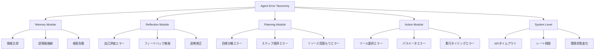

本記事は [Where LLM Agents Fail and How They can Learn From Failures (arXiv:2509.25370)](https://arxiv.org/abs/2509.25370) の解説記事です。

## 論文概要（Abstract）

LLMエージェントは、1つの根本原因エラーが後続の意思決定に連鎖的に伝播する「カスケード障害」に対して脆弱である。Zhuらは、エージェントの障害モードを記憶（Memory）・反省（Reflection）・計画（Planning）・行動（Action）・システムレベルの5モジュールにわたって分類する**AgentErrorTaxonomy**を提案している。さらに、障害軌跡のアノテーション付きデータセット**AgentErrorBench**と、根本原因を分離して修正フィードバックを提供するデバッグフレームワーク**AgentDebug**を導入し、ベースライン比で全正解精度24%向上・ステップ精度17%向上を達成したと報告している。

この記事は [Zenn記事: AIエージェントのエラー回復設計 リトライ・サーキットブレーカー・チェックポイント実践](https://zenn.dev/0h_n0/articles/3374730062cf96) の深掘りです。

## 情報源

- **arXiv ID**: 2509.25370
- **URL**: [https://arxiv.org/abs/2509.25370](https://arxiv.org/abs/2509.25370)
- **著者**: Kunlun Zhu, Zijia Liu, Bingxuan Li, Muxun Tian, Yingxuan Yang, Jiaxun Zhang, Pengrui Han et al.
- **発表年**: 2025年9月
- **分野**: cs.AI
- **コード・データ**: [GitHub: ulab-uiuc/AgentDebug](https://github.com/ulab-uiuc/AgentDebug)

## 背景と動機（Background & Motivation）

既存のエージェント評価は「最終結果が正しいかどうか」に焦点を当てるが、実運用では途中ステップでの障害が連鎖的に後続処理を破壊する問題が頻発する。Zenn記事で解説されている4つの障害カテゴリ（構文エラー・環境エラー・意味エラー・サイレント障害）は実装者の視点からの分類であるが、本論文はエージェントの内部アーキテクチャ（記憶・反省・計画・行動）に基づくモジュール別分類を提案しており、障害の「発生箇所」と「根本原因」をより精密に特定できる。

著者らは、単にエージェントの精度を改善するだけでなく、**障害から学習して回復する能力**こそがプロダクション品質のエージェントに不可欠であると主張している。

## 主要な貢献（Key Contributions）

- **貢献1**: **AgentErrorTaxonomy** — エージェントの障害モードをモジュール横断的に体系分類。記憶・反省・計画・行動・システムの5レベルで障害パターンを定義
- **貢献2**: **AgentErrorBench** — ALFWorld・GAIA・WebShopの3環境から収集した障害軌跡のアノテーション付きデータセット。各障害にタクソノミーに基づくラベルを付与
- **貢献3**: **AgentDebug** — 根本原因障害を分離し、修正フィードバックを提供するデバッグフレームワーク。反復的な修正により全正解精度24%向上を達成

## 技術的詳細（Technical Details）

### AgentErrorTaxonomy：モジュール別障害分類



著者らが定義する各モジュールの障害パターンを以下に整理する。

#### Memory Module（記憶モジュール）の障害

エージェントが過去の観察や行動結果を保持・参照するモジュールでの障害である。

- **情報忘却**: 重要な中間結果を保持できず、同じ操作を繰り返す
- **誤情報格納**: 外部APIの応答を検証せずに記憶に格納し、以降の判断を汚染する
- **検索失敗**: 記憶に正しい情報があるにもかかわらず、関連情報の検索に失敗する

Zenn記事で述べた「サイレント障害」は、このMemory Moduleの障害に対応する。エージェントが「成功した」と報告しても、実際には古いキャッシュデータを記憶から取得していた場合がこれに該当する。

#### Reflection Module（反省モジュール）の障害

自己評価と修正を行うモジュールでの障害である。

- **自己評価エラー**: 成功を失敗と判定（または逆）し、不要なリトライや修正を実行する
- **フィードバック無視**: エラーメッセージを受け取っても行動を変更しない
- **過剰修正**: 小さなエラーに対して大規模な修正を行い、正常だった部分まで破壊する

#### Planning Module（計画モジュール）の障害

タスク分解と実行計画の策定における障害である。

- **目標分解エラー**: 複合タスクを適切なサブタスクに分解できない
- **ステップ順序エラー**: 依存関係を無視した実行順序を計画する
- **リソース見積もりエラー**: トークン消費やAPI呼び出し回数を過小評価する

#### Action Module（行動モジュール）の障害

ツール呼び出しと環境操作における障害である。

- **ツール選択エラー**: 利用可能なツールの中から不適切なものを選択する
- **パラメータエラー**: 正しいツールを選択するがパラメータが不正
- **実行タイミングエラー**: 前提条件が満たされる前にアクションを実行する

#### System Level（システムレベル）の障害

エージェント外部のインフラストラクチャに起因する障害であり、Zenn記事の「環境エラー」に直接対応する。APIタイムアウト、429レート制限、環境状態の予期しない変化が含まれる。

### カスケード障害の分析

本論文の重要な知見の一つは、**単一の根本原因エラーが後続の複数ステップに連鎖的に伝播する**というカスケード障害のメカニズムの解明である。

著者らのモデルによれば、ステップ $t$ でのエラー $e_t$ は、後続ステップ $t+1, t+2, \ldots$ の判断に影響する。カスケード障害の深刻度は根本原因エラーの位置（パイプラインの早い段階ほど影響が大きい）とエラーの種類（Memory/Planningエラーは影響範囲が広い）に依存すると報告されている。

$$
\text{CascadeImpact}(e_t) = \sum_{i=t+1}^{T} \mathbb{1}[\text{step}_i \text{ affected by } e_t]
$$

ここで $T$ はタスクの総ステップ数、$\mathbb{1}[\cdot]$ は指示関数である。

この知見は、Zenn記事で解説されているチェックポイント機構の**配置戦略**に直接的な示唆を与える。パイプラインの早い段階（例: リサーチノード）でのチェックポイントがカスケード障害の軽減に最も効果的である。

### AgentDebug：反復的デバッグフレームワーク

AgentDebugは以下の3段階で動作する。

**段階1: 障害検出（Error Detection）**

実行軌跡の各ステップを分析し、期待される行動と実際の行動の乖離を検出する。Pydanticスキーマによる出力検証に類似するが、行動レベルでの意味的検証を含む点が異なる。

**段階2: 根本原因分離（Root Cause Isolation）**

カスケード障害の中から「最初に発生したエラー」を特定する。著者らは、障害の依存グラフを構築し、入次数がゼロのノード（他のエラーに依存しないエラー）を根本原因として識別するアルゴリズムを用いていると報告している。

**段階3: 修正フィードバック（Corrective Feedback）**

根本原因エラーに対して、AgentErrorTaxonomyに基づく具体的な修正指示を生成する。Zenn記事の「プロンプト変更付きリトライ」（Try-Rewrite-Retry）パターンに概念的に対応するが、AgentDebugは障害の分類情報を活用してより精密な修正指示を生成できる。

```python
from dataclasses import dataclass
from enum import Enum


class ErrorModule(Enum):
    """障害が発生したモジュールの分類"""
    MEMORY = "memory"
    REFLECTION = "reflection"
    PLANNING = "planning"
    ACTION = "action"
    SYSTEM = "system"


class ErrorType(Enum):
    """AgentErrorTaxonomyに基づく障害タイプ"""
    INFORMATION_FORGETTING = "information_forgetting"
    MISINFORMATION_STORAGE = "misinformation_storage"
    RETRIEVAL_FAILURE = "retrieval_failure"
    SELF_EVALUATION_ERROR = "self_evaluation_error"
    FEEDBACK_IGNORANCE = "feedback_ignorance"
    OVER_CORRECTION = "over_correction"
    GOAL_DECOMPOSITION_ERROR = "goal_decomposition_error"
    STEP_ORDERING_ERROR = "step_ordering_error"
    TOOL_SELECTION_ERROR = "tool_selection_error"
    PARAMETER_ERROR = "parameter_error"
    API_TIMEOUT = "api_timeout"
    RATE_LIMIT = "rate_limit"


@dataclass
class AgentError:
    """検出されたエージェントエラーの表現"""
    step: int
    module: ErrorModule
    error_type: ErrorType
    description: str
    is_root_cause: bool = False
    cascade_impact: int = 0


def isolate_root_cause(
    errors: list[AgentError],
) -> list[AgentError]:
    """カスケード障害から根本原因を分離する

    障害の依存グラフを構築し、入次数ゼロのノードを
    根本原因として返す。

    Args:
        errors: 検出されたエラーのリスト

    Returns:
        根本原因と判定されたエラーのリスト
    """
    if not errors:
        return []

    errors_sorted = sorted(errors, key=lambda e: e.step)
    root_causes: list[AgentError] = []

    for i, error in enumerate(errors_sorted):
        is_caused_by_earlier = any(
            earlier.step < error.step
            and earlier.module in (
                ErrorModule.MEMORY,
                ErrorModule.PLANNING,
            )
            for earlier in errors_sorted[:i]
        )
        if not is_caused_by_earlier:
            error.is_root_cause = True
            error.cascade_impact = len(errors_sorted) - i - 1
            root_causes.append(error)

    return root_causes
```

### 評価環境と結果

著者らは3つの環境でAgentDebugを評価している。

| 環境 | タスク種別 | 障害軌跡数 |
|:---|:---|:---|
| ALFWorld | 家庭内ロボット操作 | テキストベースの物体操作タスク |
| GAIA | 汎用アシスタント | Web検索・ファイル操作・推論タスク |
| WebShop | ECサイト操作 | 商品検索・比較・購入タスク |

## 実験結果（Results）

著者らが報告している主要な結果は以下の通りである。

| 指標 | ベースライン | AgentDebug | 改善率 |
|:---|:---|:---|:---|
| 全正解精度（All-correct） | — | +24% | 相対26%改善 |
| ステップ精度（Step-level） | — | +17% | 複数ベンチマーク平均 |

**カスケード障害の軽減効果**: AgentDebugによる根本原因分離により、1つのエラー修正で複数の後続エラーが同時に解消されるケースが多数観察されたと報告されている。これはZenn記事のチェックポイント回復パターン（障害ノードから再開）と同じ原理であり、早期段階での修正がパイプライン全体の健全性を回復させる。

**モジュール別の障害頻度**: 著者らの分析によれば、Action Module（ツール選択・パラメータ）の障害が最も頻繁であり、Planning Module（目標分解・ステップ順序）の障害がカスケード影響度が最も高いと報告されている。

## 実装のポイント（Implementation）

### エラー回復パターンとの統合

AgentErrorTaxonomyの分類は、Zenn記事のエラー回復パターンの適用判断に直接活用できる。

| 障害モジュール | 推奨されるリカバリパターン | 理由 |
|:---|:---|:---|
| Memory | チェックポイント回復 | 記憶の汚染は状態全体のロールバックが最も確実 |
| Reflection | プロンプト変更付きリトライ | 自己評価の誤りはフィードバック追加で修正可能 |
| Planning | DLQ投入 + 人間介入 | 計画の根本的誤りは自動回復が困難 |
| Action | 指数バックオフ付きリトライ | パラメータ修正で再試行可能なケースが多い |
| System | サーキットブレーカー | 外部サービス障害はリクエスト遮断が適切 |

### 障害検出の実装指針

本論文の知見に基づくと、エージェントパイプラインに以下の検出機構を組み込むことが推奨される。

1. **Memory検証**: 各ステップの出力をPydanticスキーマで検証し、記憶に格納する前に整合性をチェックする（Zenn記事の「サイレント障害」対策）
2. **Planning検証**: サブタスクの依存関係グラフを構築し、実行前にトポロジカルソートで順序の整合性を確認する
3. **カスケード検知**: 連続するエラーの発生パターンを監視し、閾値（例: 3ステップ連続エラー）を超えた場合にサーキットブレーカーを発動させる

## 実運用への応用（Practical Applications）

AgentErrorTaxonomyは、Zenn記事で紹介されたFAILURE.md仕様の障害モード定義を補完する位置づけである。FAILURE.mdが障害レベル（graceful_degradation, partial_failure, cascading_failure, silent_failure）を定義するのに対し、AgentErrorTaxonomyは障害の**発生モジュール**と**根本原因タイプ**を特定する。両者を組み合わせることで、「どの障害レベルの」「どのモジュール起因の」「どの種類のエラーか」を三次元で特定でき、最適なリカバリ戦略の自動選択が可能になる。

本番環境での監視メトリクスとしては、モジュール別のエラー発生率とカスケード影響度を構造化JSONログで記録し、Zenn記事で提案されている監視ダッシュボードに統合することが推奨される。

## 関連研究（Related Work）

- **AgentBench (Liu et al., 2023)**: LLMエージェントの能力を8環境で評価するベンチマーク。タスク成功率に焦点を当てており、障害の分類や回復は対象外。本論文はAgentBenchの評価環境での障害軌跡を活用してタクソノミーを構築
- **Towards a Science of AI Agent Reliability (Rabanser et al., 2026)**: 信頼性を4次元12指標で評価するフレームワーク。本論文の障害分類は、信頼性指標の**低下原因**を特定する手段として相互補完的
- **TrustAgent (Ren et al., 2024)**: 安全性と信頼性を保証する多層防御フレームワーク。エージェント憲法に基づく事前制約を課すアプローチであり、本論文の事後的なデバッグアプローチとは対照的

## まとめと今後の展望

Zhuらは、LLMエージェントの障害をモジュール別に体系分類するAgentErrorTaxonomyと、根本原因を分離して修正する AgentDebugフレームワークを提案した。全正解精度24%向上という結果は、障害の「種類」を正確に特定することがエラー回復の効率を大きく左右することを示している。

Zenn記事のエラー回復パターン（リトライ・サーキットブレーカー・チェックポイント）を運用する際、AgentErrorTaxonomyの分類を併用することで「どのパターンをいつ適用すべきか」の判断精度を向上させることができる。今後の方向性として、著者らはタクソノミーの自動アノテーション精度の向上と、より多様なエージェント環境での検証の必要性を示唆している。

## 参考文献

- **arXiv**: [https://arxiv.org/abs/2509.25370](https://arxiv.org/abs/2509.25370)
- **Code**: [https://github.com/ulab-uiuc/AgentDebug](https://github.com/ulab-uiuc/AgentDebug)
- **Related Zenn article**: [https://zenn.dev/0h_n0/articles/3374730062cf96](https://zenn.dev/0h_n0/articles/3374730062cf96)
