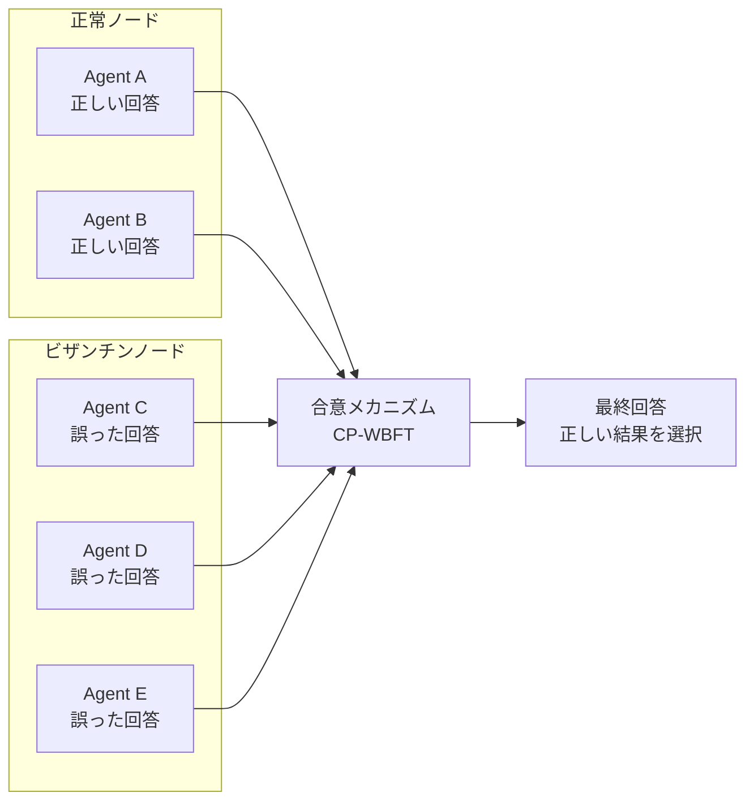

本記事は [Rethinking the Reliability of Multi-agent System: A Perspective from Byzantine Fault Tolerance (arXiv:2511.10400)](https://arxiv.org/abs/2511.10400) の解説記事です。

## 論文概要（Abstract）

マルチエージェントシステム（MAS）において、一部のエージェントが誤った応答を返す「ビザンチン障害」が発生した場合、システム全体の信頼性はどのように影響を受けるか。Zhengらは、LLMベースのエージェントが従来のエージェントと比較して**誤ったメッセージフローに対するより強い懐疑性**を示すことを発見し、この特性を活用した**CP-WBFT（Confidence Probe-based Weighted Byzantine Fault Tolerant）**合意メカニズムを提案している。論文の実験では、7ノード中6ノードがビザンチン（85.7%の障害率）という極端な条件下でも高い精度を維持できることが報告されている。

この記事は [Zenn記事: AIエージェントのエラー回復設計 リトライ・サーキットブレーカー・チェックポイント実践](https://zenn.dev/0h_n0/articles/3374730062cf96) の深掘りです。

## 情報源

- **arXiv ID**: 2511.10400
- **URL**: [https://arxiv.org/abs/2511.10400](https://arxiv.org/abs/2511.10400)
- **著者**: Lifan Zheng, Jiawei Chen, Qinghong Yin, Jingyuan Zhang, Xinyi Zeng, Yu Tian
- **発表年**: 2025年11月（v2: 2025年12月）
- **分野**: cs.MA, cs.AI, cs.CL

## 背景と動機（Background & Motivation）

古典的なビザンチン障害耐性（BFT）理論では、合意に到達するために障害ノードの数 $f$ がノード総数 $n$ に対して $f < n/3$ である必要がある（Lamport et al., 1982）。しかし、LLMベースのエージェントは「回答の意味的整合性を評価する能力」を持つため、従来のBFT境界を超えた障害耐性を示す可能性がある。

Zenn記事で解説されているサーキットブレーカーは**単一サービスの障害検出と遮断**に焦点を当てているが、マルチエージェント環境では複数のエージェントが協調して意思決定を行うため、**どのエージェントの出力を信頼すべきか**というビザンチン合意の問題が発生する。本論文はこの問題に対する体系的なアプローチを提供している。

## 主要な貢献（Key Contributions）

- **貢献1**: LLMベースのエージェントが従来のエージェントと比較して2-3倍の障害耐性を持つことの実証。古典的BFT境界 $f < n/3$ を大幅に超える耐性を示した
- **貢献2**: CP-WBFT合意メカニズムの提案。プロンプトレベル（PCP）と隠れ層レベル（HCP）の2段階信頼度推定に基づく重み付き合意
- **貢献3**: 6つのネットワークトポロジ（chain, tree, complete graph, random graph, layered graph, star）にわたる体系的な評価

## 技術的詳細（Technical Details）

### ビザンチン障害耐性とマルチエージェント

ビザンチン障害は、分散システムにおいてノードが**任意の誤り**（単なるクラッシュではなく、意図的な偽情報送信を含む）を起こす障害モデルである。



著者らのパイロット実験では、7ノードネットワークで以下の結果が報告されている。

| エージェント種別 | 障害ノード数 | 耐性限界 |
|:---|:---|:---|
| 従来エージェント | 2-3ノード | $f < n/3$ で崩壊（精度0%） |
| LLMベースエージェント | 6ノード | 85.7%障害率でも動作継続 |

GSM8K（数学推論）タスクにおいて、LLMエージェントは68.57%-87.14%のFinal Agent Accuracy（FAA）を達成したと報告されている。

### CP-WBFTメカニズム

CP-WBFTは2段階で動作する。

#### 段階1: 信頼度推定（Confidence Probing）

**プロンプトレベル信頼度推定（PCP）**: 構造化プロンプトにより、エージェントに明示的な信頼度を出力させる。「Answer: [回答], Confidence: [0.00-1.00]」形式で応答を要求する。

**隠れ層レベル信頼度推定（HCP）**: デコーダの中間表現から信頼度を抽出する。これがCP-WBFTの核心的技術である。

HCPの信頼度抽出は以下の3つの設計選択から構成される。

**1. 層の選択**: タスクに依存する最適層が存在する。著者らの実験では、LLaMA-3-8Bにおいて：
- GSM8K（数学推論）: Layer 16が最適
- XSTest（安全性評価）: Layer 17が最適

**2. 表現タイプ**: 回答トークン全体の平均プーリングが最も効果的であると報告されている：

$$
\mathbf{h}_p^{(l)} = \frac{1}{|T_a|}\sum_{t \in T_a}\mathbf{h}_t^{(l)}
$$

ここで、$T_a$ は回答トークンの集合、$\mathbf{h}_t^{(l)}$ は層 $l$ におけるトークン $t$ の隠れ状態ベクトルである。

著者らの実験では、プーリング表現が単一トークン表現と比較して優れた性能を示している：

| モデル | タスク | Pooled | Answer token | Query token |
|:---|:---|:---|:---|:---|
| LLaMA3.1 | GSM8K | 85.29% | 84.23% | 71.27% |
| LLaMA3.1 | XSTest | 95.24% | 80.16% | 80.95% |

著者らは、平均プーリングが「回答生成プロセス全体にわたる意味的一貫性」を捉えるのに対し、単一トークンは「不安定な単一点特徴」に依存するためと分析している。

**3. 特徴処理**: PCA（256次元に削減）+ z-score正規化の後、ロジスティック回帰で二値分類（正しい/誤り）を行う。

#### 段階2: 信頼度重み付き合意（Confidence-Guided Consensus）

2フェーズの合意プロトコルで動作する。

**フェーズ1 — ローカル精製**: 各エージェント $i$ は隣接エージェント $j$ の回答を受け取り、$j$ の信頼度が自身より高い場合（$\mathcal{C}_j(\mathbf{x}) > \mathcal{C}_i(\mathbf{x})$）に $j$ の回答を採用する。

**フェーズ2 — 集約選択**: 最も高い平均信頼度を持つ回答を最終結果として選択する：

$$
\mathcal{R} = \arg\max_r\left(\frac{1}{|\mathcal{A}_r|}\sum_{i \in \mathcal{A}_r}\mathcal{C}_i^{\text{final}}(\mathbf{x}),\ |\mathcal{A}_r|\right)
$$

ここで、$\mathcal{A}_r$ は回答 $r$ を支持するエージェントの集合である。

### トポロジ別の実験結果

著者らは6つのネットワークトポロジで実験を行い、トポロジがビザンチン耐性に大きく影響することを報告している。

**GSM8K（7ノード、6ノードがビザンチン）での結果**:

| トポロジ | HCP FAA | BFTI改善 | Round Accuracy |
|:---|:---|:---|:---|
| Complete Graph | 100% | +85.71% | 100% |
| Star（末端が悪意） | 100% | +85.71% | 100% |
| Random Graph | 57.14% | +42.86% | 100% |
| Chain | 42.86% | +28.57% | 100% |

**BFTI（Byzantine Fault Tolerance Improvement）**: ビザンチンノードがない場合の精度と比較した改善度。

**トポロジの影響に関する著者らの分析**:
- **Complete Graph**: 全ノード間の直接通信が可能なため、情報伝播が最適。HCPが最も効果を発揮する
- **Star**: 中心ノードの健全性が決定的に重要。中心が悪意の場合は性能が大幅に低下
- **Chain/Tree**: 情報フローが制約され、合意形成が困難。ただしHCPによりRound Accuracyは100%を維持

### スケーラビリティ検証

著者らは15ノード（93.3%ビザンチン率）のCommonsenseQAタスクでも検証を行い、Complete Graphで100%の最終精度とBFTI +93.33%を達成したと報告している。

## 実装のポイント（Implementation）

### マルチエージェント環境でのサーキットブレーカー拡張

Zenn記事のサーキットブレーカーは単一ツール/サービスの障害検出に対応するが、マルチエージェント環境では「どのエージェントが信頼できないか」を判定する必要がある。本論文のCP-WBFTの知見を活用して、信頼度ベースのエージェントレベルサーキットブレーカーを設計できる。

```python
from dataclasses import dataclass, field


@dataclass
class AgentCircuitBreaker:
    """エージェントレベルのサーキットブレーカー

    CP-WBFTの知見に基づき、個々のエージェントの
    信頼度が低下した場合にそのエージェントを
    合意プロセスから除外する。
    """

    name: str
    confidence_threshold: float = 0.5
    low_confidence_window: int = 5
    _recent_confidences: list[float] = field(
        default_factory=list
    )
    _excluded: bool = False

    def record_confidence(self, confidence: float) -> None:
        """エージェントの信頼度を記録"""
        self._recent_confidences.append(confidence)
        if len(self._recent_confidences) > self.low_confidence_window:
            self._recent_confidences.pop(0)

        avg = sum(self._recent_confidences) / len(
            self._recent_confidences
        )
        if avg < self.confidence_threshold:
            self._excluded = True

    @property
    def is_excluded(self) -> bool:
        return self._excluded

    def reset(self) -> None:
        self._excluded = False
        self._recent_confidences.clear()
```

### ネットワークトポロジの選択指針

本論文の結果から、マルチエージェントシステムのトポロジ選択について以下の指針が得られる。

| 要件 | 推奨トポロジ | 理由 |
|:---|:---|:---|
| 最大の障害耐性 | Complete Graph | 全ノード間の直接通信で最適な情報伝播 |
| レイテンシ重視 | Star | 中心ノード1ホップで合意。ただし中心ノードの健全性が前提 |
| 通信コスト重視 | Tree | 通信量が $O(n)$ で最小。ただし障害耐性は低い |

## 実験結果（Results）

著者らの実験結果の要点を以下にまとめる。

**HCPとPCPの比較**:
- HCPはタスク非依存の効果を示し、「極端なビザンチン条件下での卓越した頑健性」を達成
- PCPはトポロジ感受性が高く、特定の構成（例: Tree + XSTest）で負のBFTI（-11.43%）を示す場合がある
- HCPの優位性は、デコーダレベルの信頼度シグナルが「ドメイン固有の特性を超える基本的な意味的一貫性パターン」を捉えることに起因すると著者らは分析している

**古典的BFT境界の超越**:
従来のBFT理論が $f < n/3$ を要求するのに対し、LLMベースエージェントは $f = 6/7 \approx 85.7\%$ でも動作する。著者らは、これがLLMの「高度な内在的反省・識別能力」に由来すると主張している。

## 実運用への応用（Practical Applications）

本論文の知見は、Zenn記事のエラー回復パターンを以下のように拡張する。

1. **マルチプロバイダフォールバックの最適化**: Zenn記事のLayer 1フォールバック（Anthropic → OpenAI → Google）において、CP-WBFTの信頼度推定を用いてプロバイダ選択を動的に最適化できる。低信頼度の応答を返すプロバイダを自動的に除外する

2. **冗長エージェントによる耐障害性**: 同一タスクを複数のエージェント（異なるモデル/プロンプト）で並行実行し、信頼度重み付き合意で最終回答を決定する。Complete Graphトポロジであれば、過半数のエージェントが障害でも正しい結果が得られる

3. **DLQ投入判断の改善**: 単一エージェントの失敗率だけでなく、合意の「確信度」（最高信頼度と次点の差）をDLQ投入の判断基準に加えることで、偽陽性（不必要なDLQ投入）を削減できる

## 関連研究（Related Work）

- **Practical Byzantine Fault Tolerance (Castro & Liskov, 1999)**: 古典的BFTアルゴリズム。$f < n/3$ の制約下で合意に到達する。本論文はLLMの意味理解能力によりこの境界を超えられることを示した
- **MetaGPT (Hong et al., 2023)**: マルチエージェントの役割分担フレームワーク。障害耐性は対象外であり、本論文のCP-WBFTと組み合わせることで信頼性を向上させることが期待できる
- **On the Resilience of LLM-Based Multi-Agent Collaboration (Huang et al., 2024)**: 階層型構造が障害耐性に優れることを示した研究。本論文はより幅広いトポロジで分析を行い、Complete Graphの優位性を実証

## まとめと今後の展望

Zhengらは、LLMベースのマルチエージェントシステムが古典的BFT境界を超える障害耐性を持つことを実証し、この特性を活用するCP-WBFT合意メカニズムを提案した。特にComplete Graphトポロジにおいて、85.7%のビザンチン障害率でも100%の精度を達成したという結果は注目に値する。

Zenn記事のサーキットブレーカーが「個々のサービスの障害検出と遮断」に焦点を当てるのに対し、本論文は「マルチエージェント間の合意形成における障害耐性」を扱っており、両者は補完的な位置づけである。今後の方向性として、著者らはCP-WBFTの動的トポロジ適応や、大規模（100+ノード）環境でのスケーラビリティ検証の必要性を示唆している。

## 参考文献

- **arXiv**: [https://arxiv.org/abs/2511.10400](https://arxiv.org/abs/2511.10400)
- **Related Zenn article**: [https://zenn.dev/0h_n0/articles/3374730062cf96](https://zenn.dev/0h_n0/articles/3374730062cf96)
