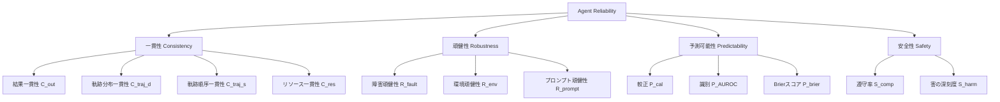

本記事は [Towards a Science of AI Agent Reliability (arXiv:2602.16666)](https://arxiv.org/abs/2602.16666) の解説記事です。

## 論文概要（Abstract）

AIエージェントのベンチマーク精度は向上し続けているが、実運用ではエージェントが予期せぬ失敗を起こす事例が後を絶たない。Rabanserらは、エージェントの「信頼性（reliability）」を精度とは独立した品質属性として定義し、**一貫性（consistency）・頑健性（robustness）・予測可能性（predictability）・安全性（safety）**の4次元12指標で定量評価するフレームワークを提案している。14モデルを2つのベンチマークで評価した結果、直近18か月の精度向上にもかかわらず信頼性の改善はわずかであることが報告されている。

この記事は [Zenn記事: AIエージェントのエラー回復設計 リトライ・サーキットブレーカー・チェックポイント実践](https://zenn.dev/0h_n0/articles/3374730062cf96) の深掘りです。

## 情報源

- **arXiv ID**: 2602.16666
- **URL**: [https://arxiv.org/abs/2602.16666](https://arxiv.org/abs/2602.16666)
- **著者**: Stephan Rabanser, Sayash Kapoor, Peter Kirgis, Kangheng Liu, Saiteja Utpala, Arvind Narayanan（Princeton University）
- **発表年**: 2026年2月
- **分野**: cs.AI, cs.CY, cs.LG
- **インタラクティブダッシュボード**: [hal.cs.princeton.edu/reliability](https://hal.cs.princeton.edu/reliability)

## 背景と動機（Background & Motivation）

従来のAIエージェント評価は単一実行の精度（accuracy）に偏っていた。しかし、Replit Agent がデータベースを誤削除した事例や、OpenAI Operator が未承認の購入を実行した事例が示すように、ベンチマーク精度の高さは必ずしも実運用での信頼性を保証しない。著者らは、航空・原子力・自動車といった安全重視産業における信頼性工学の知見を統合し、AIエージェント固有の信頼性を科学的に測定する枠組みの必要性を主張している。

Zenn記事で解説されているリトライ・サーキットブレーカー・チェックポイントといったエラー回復パターンは、まさにこの「信頼性と精度のギャップ」を埋めるための実装手法であり、本論文はそうしたパターンが**なぜ必要なのか**を実証データで裏付けている。

## 主要な貢献（Key Contributions）

- **貢献1**: エージェント信頼性を4次元12指標に分解する体系的フレームワークの提案。安全重視産業の信頼性工学に基づく理論的根拠を提示
- **貢献2**: 14モデル×2ベンチマーク（GAIA・τ-bench）での大規模実証評価。精度向上が信頼性向上に直結しないことを定量的に示した
- **貢献3**: 実世界のインシデント（Replit、OpenAI Operator、NYC Chatbot）と提案指標との対応関係を明示し、各指標の実用価値を検証

## 技術的詳細（Technical Details）

### 4次元12指標のフレームワーク



#### 次元1: 一貫性（Consistency）

同一条件下での複数実行における行動の再現性を測定する。4つのサブ指標で構成される。

**結果一貫性 $C_{\text{out}}$** は、同一タスクを $K$ 回実行したときの成功率のばらつきを測定する：

$$
C_{\text{out}} = 1 - \frac{\text{Var}(\text{success}_1, \ldots, \text{success}_K)}{\text{Var}_{\max}(\text{Bernoulli})}
$$

ここで、分母はベルヌーイ分布の最大分散 $0.25$ で正規化する。値が1に近いほど一貫性が高い。

**軌跡分布一貫性 $C_{\text{traj}}^d$** は、アクションタイプの分布をJensen-Shannon divergenceで比較する：

$$
C_{\text{traj}}^d = 1 - \text{JSD}(p_1 \| p_2 \| \cdots \| p_K)
$$

**軌跡順序一貫性 $C_{\text{traj}}^s$** は、正規化Levenshtein距離でアクション系列の順序類似度を測定する。

著者らの実験では、分布一貫性は比較的高い一方で順序一貫性が低い「what but not when」パターンが観察されたと報告されている。エージェントは類似のアクションタイプを選択するが、実行順序は実行ごとに大きく変動するという特性は、チェックポイント機構による状態復旧の設計において重要な示唆を与える。

#### 次元2: 頑健性（Robustness）

外部擾乱への耐性を3指標で測定する。

**障害頑健性 $R_{\text{fault}}$** は、確率 $p_{\text{fault}} = 0.2$ でツール呼び出しにエラーを注入したときの精度低下率を測る。論文の実験では、多くのモデルが障害頑健性で天井効果を示し、一時的なAPI障害には比較的うまく対処できることが報告されている。

**環境頑健性 $R_{\text{env}}$** は、意味を保持したフォーマット変更（JSONフィールド順の変更など）への耐性を測定する。

**プロンプト頑健性 $R_{\text{prompt}}$** は、$J = 5$ 通りの意味等価な指示文パラフレーズに対する精度安定性を測る。著者らは、プロンプト頑健性がモデル間の信頼性を最も顕著に差別化する指標であると報告している。

#### 次元3: 予測可能性（Predictability）

エージェントの自信度と実際の成功率の整合性を測定する。

**較正（Calibration）** $P_{\text{cal}}$ は期待較正誤差（ECE: Expected Calibration Error）で定義される：

$$
P_{\text{cal}} = 1 - \text{ECE} = 1 - \sum_{b=1}^{B} \frac{|B_b|}{N} \left| \text{acc}(B_b) - \text{conf}(B_b) \right|
$$

ここで、$B_b$ はビン $b$ に属するサンプル集合、$\text{acc}(B_b)$ はそのビンの実際の精度、$\text{conf}(B_b)$ は平均自信度である。

**識別（Discrimination）** $P_{\text{AUROC}}$ は、自信度スコアを使って成功と失敗を区別する能力をAUROCで評価する。

**Brierスコア** $P_{\text{brier}}$ は較正と識別を統合した適正スコアリングルールである。

予測可能性が高いエージェントは「自分がいつ失敗しそうか」を正しく推定できるため、サーキットブレーカーのしきい値設計やフォールバック発動条件の最適化に直結する。

#### 次元4: 安全性（Safety）

制約遵守と違反時の深刻度を測定する。安全性は他の次元と独立して報告される：

$$
\mathcal{R}_{\text{Safety}} = 1 - P(\text{violation}) \times \mathbb{E}[\text{severity} \mid \text{violation}]
$$

著者らは、安全性を全体スコアに平均化すると尾部リスクが隠蔽されるため、独立して評価すべきであると主張している。

### 評価プロトコル

| パラメータ | 設定 |
|:---|:---|
| 実行回数 $K$ | 5回（temperature = 0） |
| パラフレーズ数 $J$ | 5通り |
| 障害注入確率 $p_{\text{fault}}$ | 0.2 |
| 評価モデル数 | 14（OpenAI, Google, Anthropic） |
| ベンチマーク | GAIA（165タスク）, τ-bench（26タスク） |

## 実験結果（Results）

### 精度と信頼性の乖離

著者らの主要な発見は、**18か月間の精度向上にもかかわらず信頼性の改善はわずかである**という点である。具体的には：

| 観察項目 | 詳細 |
|:---|:---|
| 精度（accuracy） | モデル世代ごとに着実に向上 |
| 結果一貫性 | フロンティアモデルでも大幅な改善なし |
| プロンプト頑健性 | モデル間の信頼性差を最も顕著に差別化 |
| 較正 | Claudeファミリで顕著な改善が見られると報告 |
| 安全性 | 最新モデルで違反率は低下、ただし高深刻度インシデントは残存 |

### モデルタイプ別のパターン

論文Table等の結果から、著者らは以下の知見を報告している：

- **小規模モデル**がより大規模なモデルと同等以上の一貫性を示す場合がある
- **推論特化モデル**（reasoning model）は概して信頼性が向上するが、精度向上ほどの伸びは見せない
- 精度と信頼性の関係はベンチマーク依存であり、一般化には注意が必要

### 実世界インシデントとの対応

| インシデント | 検出可能な指標 |
|:---|:---|
| Replit Agent によるデータベース削除 | 安全性（$S_{\text{harm}}$）、プロンプト頑健性 |
| OpenAI Operator の未承認購入 | 安全性（$S_{\text{comp}}$）、結果一貫性 |
| NYC Chatbot の矛盾するアドバイス | 較正（$P_{\text{cal}}$）、結果一貫性 |

## 実装のポイント（Implementation）

### 信頼性メトリクスの実装手順

本論文のフレームワークを自システムに適用する際の要点は以下の通りである。

**多重実行テスト**: 同一タスクを $K \geq 5$ 回実行し、結果一貫性を計測する。temperature = 0でも LLM の出力は完全に決定的ではないため（サンプリングカーネルの浮動小数点演算等による非決定性）、複数回実行が必要である。

**障害注入テスト**: Zenn記事で解説されたサーキットブレーカーやリトライパターンの実効性を検証するには、意図的に障害を注入するテストが有効である。$p_{\text{fault}} = 0.2$ でツール呼び出しにエラーを注入し、エージェントの回復挙動を観察する。

**自信度の抽出**: Post-hocな自己評価（「この回答にどの程度自信がありますか？」）をプロンプトに追加し、較正誤差を測定する。サーキットブレーカーのOpen遷移しきい値やフォールバック発動条件の根拠データとなる。

**軌跡分析**: アクション系列のLevenshtein距離を計算し、順序一貫性が低いノード（＝実行順序が不安定なステップ）を特定する。このノードに重点的にチェックポイントを配置することで、障害復旧の効率を最大化できる。

```python
from collections import Counter
from scipy.spatial.distance import jensenshannon
import numpy as np


def outcome_consistency(successes: list[bool]) -> float:
    """結果一貫性を計算する

    Args:
        successes: K回の実行結果（True=成功、False=失敗）

    Returns:
        結果一貫性スコア（0-1、1が最も一貫）
    """
    arr = np.array(successes, dtype=float)
    var = np.var(arr)
    max_var = 0.25  # Bernoulli最大分散
    return float(1.0 - var / max_var)


def trajectory_distribution_consistency(
    trajectories: list[list[str]],
) -> float:
    """軌跡分布一貫性をJSD距離で計算する

    Args:
        trajectories: K回の実行における
                      アクションタイプのリスト

    Returns:
        分布一貫性スコア（0-1）
    """
    all_actions = set()
    for traj in trajectories:
        all_actions.update(traj)
    actions = sorted(all_actions)

    distributions = []
    for traj in trajectories:
        counter = Counter(traj)
        total = sum(counter.values())
        dist = [counter.get(a, 0) / total for a in actions]
        distributions.append(dist)

    jsd = jensenshannon(distributions[0], distributions[1])
    return float(1.0 - jsd)
```

## Production Deployment Guide

### AWS実装パターン（コスト最適化重視）

本論文の信頼性メトリクスを本番環境のモニタリングシステムとして実装する場合のAWS構成を示す。

**トラフィック量別の推奨構成**:

| 規模 | 月間評価タスク数 | 推奨構成 | 月額コスト | 主要サービス |
|------|--------------|---------|-----------|------------|
| **Small** | ~3,000 (100/日) | Serverless | $50-150 | Lambda + Bedrock + DynamoDB |
| **Medium** | ~30,000 (1,000/日) | Hybrid | $300-800 | Lambda + ECS Fargate + ElastiCache |
| **Large** | 300,000+ (10,000/日) | Container | $2,000-5,000 | EKS + Karpenter + EC2 Spot |

**Small構成の詳細** (月額$50-150):
- **Lambda**: 1GB RAM, 60秒タイムアウト ($20/月) — 各評価タスクの実行
- **Bedrock**: Claude 3.5 Haiku, Prompt Caching有効 ($80/月) — 自信度抽出・安全性判定
- **DynamoDB**: On-Demand ($10/月) — 実行結果・メトリクス格納
- **CloudWatch**: 基本監視 ($5/月) — メトリクスダッシュボード
- **API Gateway**: REST API ($5/月) — 評価パイプラインのトリガー

**コスト削減テクニック**:
- Spot Instances使用で最大90%削減（EKS + Karpenter）
- Reserved Instances購入で最大72%削減（1年コミット）
- Bedrock Batch API使用で50%削減（非リアルタイム評価処理）
- Prompt Caching有効化で30-90%削減（自信度抽出プロンプトの固定部分）

**コスト試算の注意事項**:
- 上記は2026年4月時点のAWS ap-northeast-1（東京）リージョン料金に基づく概算値です
- 実際のコストはトラフィックパターン、リージョン、バースト使用量により変動します
- 最新料金は [AWS料金計算ツール](https://calculator.aws/) で確認してください

### Terraformインフラコード

**Small構成 (Serverless): Lambda + Bedrock + DynamoDB**

```hcl
# --- VPC基盤 ---
module "vpc" {
  source  = "terraform-aws-modules/vpc/aws"
  version = "~> 5.0"

  name = "agent-reliability-vpc"
  cidr = "10.0.0.0/16"
  azs  = ["ap-northeast-1a", "ap-northeast-1c"]
  private_subnets = ["10.0.1.0/24", "10.0.2.0/24"]

  enable_nat_gateway   = false
  enable_dns_hostnames = true
}

# --- IAMロール（最小権限） ---
resource "aws_iam_role" "lambda_reliability" {
  name = "lambda-reliability-eval-role"

  assume_role_policy = jsonencode({
    Version = "2012-10-17"
    Statement = [{
      Action = "sts:AssumeRole"
      Effect = "Allow"
      Principal = { Service = "lambda.amazonaws.com" }
    }]
  })
}

resource "aws_iam_role_policy" "bedrock_invoke" {
  role = aws_iam_role.lambda_reliability.id
  policy = jsonencode({
    Version = "2012-10-17"
    Statement = [{
      Effect   = "Allow"
      Action   = ["bedrock:InvokeModel"]
      Resource = "arn:aws:bedrock:ap-northeast-1::foundation-model/anthropic.claude-3-5-haiku*"
    }]
  })
}

# --- Lambda関数（信頼性評価パイプライン） ---
resource "aws_lambda_function" "reliability_eval" {
  filename      = "reliability_eval.zip"
  function_name = "agent-reliability-evaluator"
  role          = aws_iam_role.lambda_reliability.arn
  handler       = "index.handler"
  runtime       = "python3.12"
  timeout       = 120
  memory_size   = 1024

  environment {
    variables = {
      BEDROCK_MODEL_ID = "anthropic.claude-3-5-haiku-20241022-v1:0"
      DYNAMODB_TABLE   = aws_dynamodb_table.metrics.name
      K_RUNS           = "5"
      P_FAULT          = "0.2"
    }
  }
}

# --- DynamoDB（メトリクス格納） ---
resource "aws_dynamodb_table" "metrics" {
  name         = "agent-reliability-metrics"
  billing_mode = "PAY_PER_REQUEST"
  hash_key     = "task_id"
  range_key    = "run_id"

  attribute {
    name = "task_id"
    type = "S"
  }
  attribute {
    name = "run_id"
    type = "S"
  }

  ttl {
    attribute_name = "expire_at"
    enabled        = true
  }
}

# --- CloudWatchアラーム（信頼性低下検知） ---
resource "aws_cloudwatch_metric_alarm" "consistency_drop" {
  alarm_name          = "agent-consistency-drop"
  comparison_operator = "LessThanThreshold"
  evaluation_periods  = 3
  metric_name         = "OutcomeConsistency"
  namespace           = "AgentReliability"
  period              = 3600
  statistic           = "Average"
  threshold           = 0.7
  alarm_description   = "結果一貫性が0.7を下回った場合にアラート"
}
```

### セキュリティベストプラクティス

- **IAMロール**: 最小権限の原則（Bedrock InvokeModelのみ許可）
- **ネットワーク**: Lambda VPC内配置、パブリックサブネット不使用
- **シークレット管理**: AWS Secrets Manager使用、環境変数へのハードコード禁止
- **暗号化**: DynamoDB KMS暗号化、S3バージョニング有効化
- **監査**: CloudTrail全リージョン有効化

### 運用・監視設定

**CloudWatch Logs Insights クエリ**:

```sql
-- 信頼性メトリクス異常検知: 結果一貫性の時系列
fields @timestamp, task_id, outcome_consistency, prompt_robustness
| stats avg(outcome_consistency) as avg_consistency,
        avg(prompt_robustness) as avg_robustness by bin(1h)
| filter avg_consistency < 0.7 OR avg_robustness < 0.6
```

**CloudWatch アラーム設定（Python）**:

```python
import boto3

cloudwatch = boto3.client('cloudwatch')

cloudwatch.put_metric_alarm(
    AlarmName='agent-reliability-degradation',
    ComparisonOperator='LessThanThreshold',
    EvaluationPeriods=3,
    MetricName='OverallReliability',
    Namespace='AgentReliability',
    Period=3600,
    Statistic='Average',
    Threshold=0.6,
    ActionsEnabled=True,
    AlarmActions=[
        'arn:aws:sns:ap-northeast-1:123456789:reliability-alerts'
    ],
    AlarmDescription='エージェント信頼性スコアが0.6を下回った'
)
```

### コスト最適化チェックリスト

**アーキテクチャ選択**:
- [ ] ~100 評価/日 → Lambda + Bedrock (Serverless) - $50-150/月
- [ ] ~1000 評価/日 → ECS Fargate + Bedrock (Hybrid) - $300-800/月
- [ ] 10000+ 評価/日 → EKS + Spot Instances (Container) - $2,000-5,000/月

**リソース最適化**:
- [ ] EC2: Spot Instances優先（最大90%削減）
- [ ] Reserved Instances: 1年コミットで72%削減
- [ ] Lambda: メモリサイズ最適化（CloudWatch Insights分析）
- [ ] ECS/EKS: 夜間評価バッチ時のスケールダウン
- [ ] S3: 古い評価結果のライフサイクルポリシー（90日で削除）

**LLMコスト削減**:
- [ ] Bedrock Batch API: 50%割引（非リアルタイム信頼性評価）
- [ ] Prompt Caching: 自信度抽出プロンプトの固定部分をキャッシュ
- [ ] モデル選択: 安全性判定はHaiku、較正分析はSonnet
- [ ] トークン数制限: max_tokens設定で過剰生成防止

**監視・アラート**:
- [ ] AWS Budgets: 月額予算設定（80%で警告）
- [ ] CloudWatch アラーム: 信頼性メトリクス低下検知
- [ ] Cost Anomaly Detection: 評価コストの異常検知
- [ ] 日次レポート: SNS/Slackへ信頼性ダッシュボード通知

## 実運用への応用（Practical Applications）

Zenn記事で解説されているエラー回復パターンと本論文のメトリクスの対応関係は以下の通りである。

| エラー回復パターン | 関連する信頼性指標 | 活用方法 |
|:---|:---|:---|
| リトライ（指数バックオフ） | 障害頑健性 $R_{\text{fault}}$ | 障害注入テストでリトライ戦略の有効性を定量評価 |
| サーキットブレーカー | 較正 $P_{\text{cal}}$ | 自信度較正でOpen遷移しきい値を最適化 |
| チェックポイント回復 | 軌跡順序一貫性 $C_{\text{traj}}^s$ | 低一貫性ノードにチェックポイントを重点配置 |
| フォールバック | 予測可能性 $P_{\text{AUROC}}$ | 識別能力でフォールバック発動条件を決定 |
| DLQ | 安全性 $S_{\text{comp}}$ | 遵守率低下をDLQ投入のトリガーに設定 |

本論文のフレームワークは、エラー回復パターンの「設計根拠」を提供する。リトライ回数やサーキットブレーカーのしきい値を勘と経験ではなく、実測した信頼性メトリクスに基づいて設定できるようになる。

## 関連研究（Related Work）

- **AgentBench (Liu et al., 2023)**: LLMエージェントの能力を8環境で評価するベンチマーク。精度評価に特化しており、信頼性の多次元評価は含まれていない。本論文はAgentBenchの「精度だけでは不十分」という限界を直接的に補完する
- **FAILURE.md仕様**: Zenn記事でも紹介されているAIエージェントの障害モード標準化仕様。本論文の安全性指標（$S_{\text{comp}}$, $S_{\text{harm}}$）はFAILURE.mdの障害レベル定義と整合的に運用できる
- **Microsoft AI Red Team Taxonomy**: エージェント障害の分類体系。本論文の4次元フレームワークはこの分類をさらに定量化・測定可能にした位置づけである

## まとめと今後の展望

Rabanserらは、AIエージェントの信頼性を4次元12指標で定量化するフレームワークを提案し、精度と信頼性の乖離を実証的に示した。14モデルの評価結果から、精度向上が信頼性向上に自動的に結びつかないことが明らかにされている。

本論文の実務への示唆として、エージェントの本番デプロイ前に多重実行テスト・障害注入テスト・プロンプト擾乱テストを実施し、信頼性メトリクスが許容範囲内であることを確認するゲーティングプロセスの導入が推奨されている。Zenn記事で解説されたリトライ・サーキットブレーカー・チェックポイントの各パターンは、これらの信頼性指標を改善するための具体的な実装手段として位置づけられる。

今後の研究方向として、著者らはベンチマークの多様化、スキャフォールド（エージェントフレームワーク）の影響分析、および動的な信頼性評価（デプロイ後の継続的モニタリング）の必要性を指摘している。

## 参考文献

- **arXiv**: [https://arxiv.org/abs/2602.16666](https://arxiv.org/abs/2602.16666)
- **ダッシュボード**: [hal.cs.princeton.edu/reliability](https://hal.cs.princeton.edu/reliability)
- **Related Zenn article**: [https://zenn.dev/0h_n0/articles/3374730062cf96](https://zenn.dev/0h_n0/articles/3374730062cf96)
