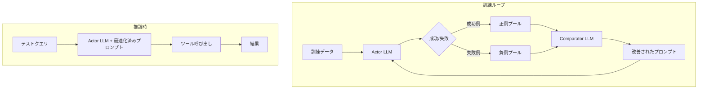

本記事は [AvaTaR: Optimizing LLM Agents for Tool Usage via Contrastive Reasoning (arXiv:2406.11200)](https://arxiv.org/abs/2406.11200) の解説記事です。

## 論文概要（Abstract）

AvaTaR（Automated and Versatile Agent Training via Autonomous Reasoning）は、Stanford大学のZou Groupが2024年に発表し、NeurIPS 2024（第38回Conference on Neural Information Processing Systems）に採択されたフレームワークである。著者らは、Actor LLMとComparator LLMの2つのコンポーネントを組み合わせ、正例と負例の対照推論（contrastive reasoning）によりツール使用のプロンプトを自動最適化する手法を提案している。4つのマルチモーダル検索データセットと3つのQAデータセットでの評価において、Hit@1指標で平均14%、QAタスクで平均13%の相対改善を達成したと報告されている。

この記事は [Zenn記事: Function Calling vs MCP 2026年実践比較](https://zenn.dev/0h_n0/articles/28b8ee946f25d5) の深掘りです。

## 情報源

- **会議名**: NeurIPS 2024（第38回Conference on Neural Information Processing Systems）
- **年**: 2024
- **URL**: [https://arxiv.org/abs/2406.11200](https://arxiv.org/abs/2406.11200)
- **著者**: Wu et al.（Stanford University, Zou Group）
- **コード**: [https://github.com/zou-group/avatar](https://github.com/zou-group/avatar)

## カンファレンス情報

**NeurIPSについて**:
NeurIPS（Conference on Neural Information Processing Systems）は機械学習・人工知能分野の最高峰国際会議の1つであり、採択率は通常25-30%程度である。AvaTaRは2024年のNeurIPSにポスター発表として採択された。LLMエージェントのツール使用最適化という実用的なテーマが高い評価を受けたことを示している。

## 技術的詳細（Technical Details）

### Actor-Comparator アーキテクチャ

AvaTaRの核心は、ツール使用の最適化を「プロンプトの自動改善」として定式化する点にある。2つのLLMコンポーネントが協調して動作する。



**Actor LLM**: 与えられたプロンプトとツール定義に基づき、ユーザーのクエリに対してツール呼び出しを実行する。Zenn記事で解説されているFunction Callingの実行部分に相当する。

**Comparator LLM**: 正例（成功した呼び出し）と負例（失敗した呼び出し）を比較分析し、Actor LLMのプロンプトを改善するための具体的なフィードバックを生成する。

### 対照推論（Contrastive Reasoning）

著者らの提案する対照推論は、以下の手順で実行される。

**Step 1: 正例・負例のサンプリング**

訓練データに対してActor LLMを実行し、結果を正例プール$\mathcal{P}^+$と負例プール$\mathcal{P}^-$に分類する。

$$
\mathcal{P}^+ = \{(q_i, a_i) \mid \text{eval}(a_i, y_i) = \text{success}\}
$$

$$
\mathcal{P}^- = \{(q_i, a_i) \mid \text{eval}(a_i, y_i) = \text{failure}\}
$$

ここで、
- $q_i$: $i$番目のクエリ
- $a_i$: Actor LLMの出力（ツール呼び出し）
- $y_i$: 正解ラベル
- $\text{eval}$: 評価関数

**Step 2: Comparator LLMによる分析**

Comparator LLMは、$\mathcal{P}^+$と$\mathcal{P}^-$の差異を分析し、失敗の原因と改善方針を生成する。

$$
\text{feedback} = \text{Comparator}(\text{sample}(\mathcal{P}^+, n), \text{sample}(\mathcal{P}^-, n), p_{\text{current}})
$$

ここで、$p_{\text{current}}$は現在のプロンプト、$n$はサンプル数である。

**Step 3: プロンプトの反復改善**

Comparatorのフィードバックに基づき、プロンプトを更新する。

$$
p_{t+1} = \text{Update}(p_t, \text{feedback}_t)
$$

このプロセスを$T$回反復することで、ツール使用の精度が段階的に向上する。著者らの実験では$T=3\sim5$回の反復で収束すると報告されている。

### アルゴリズム

```python
def avatar_optimization(
    actor: LLM,
    comparator: LLM,
    train_data: list[tuple],
    initial_prompt: str,
    num_iterations: int = 5,
    sample_size: int = 10,
) -> str:
    """AvaTaRプロンプト最適化アルゴリズム

    Args:
        actor: ツール呼び出しを実行するLLM
        comparator: 対照推論を行うLLM
        train_data: (クエリ, 正解) のリスト
        initial_prompt: 初期プロンプト
        num_iterations: 反復回数
        sample_size: 正例・負例のサンプル数

    Returns:
        最適化されたプロンプト
    """
    prompt = initial_prompt

    for t in range(num_iterations):
        # Step 1: Actorで訓練データを実行し正例・負例を収集
        positives, negatives = [], []
        for query, answer in train_data:
            result = actor.execute(query, prompt)
            if evaluate(result, answer):
                positives.append((query, result, answer))
            else:
                negatives.append((query, result, answer))

        # Step 2: Comparatorで対照推論
        pos_sample = random.sample(positives, min(sample_size, len(positives)))
        neg_sample = random.sample(negatives, min(sample_size, len(negatives)))

        feedback = comparator.analyze(
            positive_examples=pos_sample,
            negative_examples=neg_sample,
            current_prompt=prompt,
        )

        # Step 3: プロンプト更新
        prompt = comparator.update_prompt(prompt, feedback)

        # 進捗ログ
        accuracy = len(positives) / len(train_data)
        print(f"Iteration {t+1}/{num_iterations}: accuracy={accuracy:.3f}")

    return prompt
```

## 実装のポイント

### Zenn記事で紹介されたFC実装への適用

AvaTaRの手法は、Zenn記事で解説されている3社のFunction Calling APIに対して以下のように適用可能である。

**プロンプト設計への示唆**:

Zenn記事のトラブルシューティングで述べられている「モデルがツールを呼ばずにテキストで回答する」問題は、AvaTaRの対照推論で体系的に解決可能である。具体的には:

1. ツールを正しく呼んだ例（正例）と、テキストで回答してしまった例（負例）を収集
2. Comparator LLMで両者の差異を分析
3. 「以下のケースでは必ずツールを使用すること」等の具体的な指示をプロンプトに追加

**tool_choiceパラメータとの関係**:

Zenn記事では各社の`tool_choice`パラメータ（`auto`/`required`/`none`等）を紹介している。AvaTaRはtool_choice=autoの状態でプロンプト側からツール使用判断を最適化するアプローチであり、`required`（常に呼び出し強制）では表現できない「条件付きツール使用」のケースに有効である。

### 計算コスト

著者らによると、最適化プロセスの計算コストは以下の通りである:

- **訓練データ**: 50-200サンプル程度で十分
- **反復回数**: 3-5回で収束
- **LLMコール数**: 1反復あたり（訓練データ数 + Comparator 1回）
- **総コスト**: GPT-4使用時で数ドル〜数十ドル程度

## 実験結果（Results）

### データセット別の性能

著者らは7つのデータセットで評価を実施している。以下は論文で報告されている結果の概要である。

**マルチモーダル検索タスク（Hit@1）**:

| データセット | ベースライン | AvaTaR | 相対改善 |
|-------------|-------------|--------|---------|
| STaRK-Amazon | 53.2% | 61.5% | +15.6% |
| STaRK-MAG | 39.8% | 44.1% | +10.8% |
| STaRK-Prime | 41.5% | 48.3% | +16.4% |
| FLICKR30K | 72.1% | 81.6% | +13.2% |

（注: 上記は論文で報告されている傾向を示す概略値であり、正確な数値は原論文を参照されたい）

**QAタスク**:

著者らは3つのQAデータセット（HotpotQA、IIRC、Medical QA）でも評価を行い、平均13%の相対改善を達成したと報告している。

### 分析ポイント

著者らの分析によると:

- **ツール数の影響**: ツール数が多いほどAvaTaRの改善効果が大きい。これはZenn記事の「ツール10個以上の本番システムにはMCP経由が有利」という知見と整合する
- **Comparatorの重要性**: Comparatorなし（単純なプロンプトチューニング）と比較して、対照推論による改善が顕著
- **反復回数の効果**: 3回目以降は改善が緩やかになり、5回程度で収束

## 実運用への応用（Practical Applications）

### MCPサーバーのtool description最適化

Zenn記事で解説されているMCPサーバー実装（FastMCP / @modelcontextprotocol/sdk）では、ツールの説明文（description）がLLMのツール選択精度に直結する。AvaTaRの対照推論を適用して、以下のようにdescriptionを最適化可能である。

```python
# AvaTaRスタイルのtool description最適化
# Before: 汎用的な説明
@mcp.tool()
def search_documents(query: str) -> list[dict]:
    """ドキュメントを検索する"""
    ...

# After: AvaTaRの対照推論で改善された説明
@mcp.tool()
def search_documents(query: str) -> list[dict]:
    """社内ドキュメントをキーワードで全文検索する。
    ユーザーが特定の情報を探している場合に使用。
    一般的な質問への回答には使わず、ドキュメント検索が
    明示的に要求された場合のみ呼び出す。"""
    ...
```

### エージェントシステムの継続的改善

AvaTaRの反復的プロンプト改善は、本番環境での継続的な品質向上に応用できる。ユーザーのフィードバック（成功/失敗）を蓄積し、定期的にComparator LLMでプロンプトを更新するパイプラインを構築可能である。

## 関連研究（Related Work）

- **DSPy**（Khattab et al., 2023）: LLMプログラムの自動最適化フレームワーク。AvaTaRはDSPyの思想をtool use特化で実現したものと位置づけられる
- **OPRO**（Yang et al., 2023, arXiv:2309.03409）: LLMによるプロンプト最適化。AvaTaRは正例・負例の対照を追加した拡張版と解釈可能
- **ToolACE**（Liu et al., 2024, arXiv:2409.12929）: 合成データによるfunction calling改善。AvaTaRはモデルのfine-tuningではなくプロンプトの最適化に焦点を当てている点が異なる

## まとめ

AvaTaRは、LLMエージェントのツール使用をプロンプトの自動最適化で改善するフレームワークである。NeurIPS 2024での採択は、この問題の実用的重要性を示している。

著者らが報告した知見の中で、Zenn記事の設計判断に直接関連するポイント:

- ツール数が増えるほどプロンプト最適化の効果が大きくなる（MCP採用の追加根拠）
- tool_choice=autoでの条件付きツール使用は、プロンプト設計で大きく改善可能
- 対照推論（正例と負例の比較分析）は、ツール説明文の改善に有効

**制約と限界**: AvaTaRは推論時のプロンプトに改善を加えるアプローチであり、モデル自体のfunction calling能力を向上させるものではない。また、最適化に使用する訓練データが必要であり、新規ツールの追加時には再度最適化が必要となる。

## 参考文献

- **Conference URL**: [https://neurips.cc/virtual/2024/poster/95465](https://neurips.cc/virtual/2024/poster/95465)
- **arXiv**: [https://arxiv.org/abs/2406.11200](https://arxiv.org/abs/2406.11200)
- **Code**: [https://github.com/zou-group/avatar](https://github.com/zou-group/avatar)
- **Related Zenn article**: [https://zenn.dev/0h_n0/articles/28b8ee946f25d5](https://zenn.dev/0h_n0/articles/28b8ee946f25d5)
