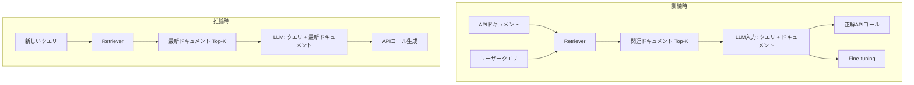

本記事は [Gorilla: Large Language Model Connected with Massive APIs (arXiv:2305.15334)](https://arxiv.org/abs/2305.15334) の解説記事です。

## 論文概要（Abstract）

Gorillaは、UC Berkeleyが2023年5月に発表したLLMベースのAPIコール生成モデルである。著者らは、APIドキュメントをretrieverで動的に取得しながら訓練する**Retrieval-Aware Training（RAT）**手法を提案し、HuggingFace Hub・TorchHub・TensorFlow Hubの計1,645件のAPIに対するベンチマーク（APIBench）を構築した。Gorilla-7BはGPT-4を含む既存モデルと比較してAPIコール精度で上回り、存在しないAPIを生成する**hallucination**を顕著に低減したと報告されている。また、GorillaプロジェクトはBerkeley Function-Calling Leaderboard（BFCL）の運営母体でもあり、Function Calling分野の標準的評価基盤を提供している。

この記事は [Zenn記事: Function Calling vs MCP 2026年実践比較](https://zenn.dev/0h_n0/articles/28b8ee946f25d5) の深掘りです。

## 情報源

- **arXiv ID**: 2305.15334
- **URL**: [https://arxiv.org/abs/2305.15334](https://arxiv.org/abs/2305.15334)
- **著者**: Patil et al.（UC Berkeley）
- **発表年**: 2023
- **分野**: cs.CL, cs.AI, cs.LG
- **コード**: [https://github.com/ShishirPatil/gorilla](https://github.com/ShishirPatil/gorilla)（Apache 2.0）

## 背景と動機（Background & Motivation）

Zenn記事で解説されている3社のFunction Calling API（OpenAI Responses API、Claude Tool Use、Gemini API）は、いずれもLLMがJSON形式のツール呼び出しを生成する機能を提供している。しかし、LLMが「存在しないAPI」や「間違ったパラメータ」を生成するhallucination問題は依然として深刻である。

Zenn記事のよくある問題表で述べられている以下の現象は、API hallucinationの具体例である。

- 「モデルがツールを呼ばずにテキストで回答する」→ 適切なツールが見つからず、テキスト生成にフォールバック
- 「並列FC時に結果の紐付けがずれる」→ 生成されたcall_id/tool_use_idが不正確
- 「`strict`モードでスキーマエラー」→ 存在しないパラメータを生成

Gorillaは、このhallucination問題をretrieval-augmentedなアプローチで解決する。APIドキュメントの最新版を推論時に参照することで、モデルが「古い」or「存在しない」APIを生成するリスクを低減する。

## 主要な貢��（Key Contributions）

- **��献1**: Retrieval-Aware Training（RAT） — 訓練時にAPIドキュメントのretrieval結果をコンテキストに含めることで、推論時のretrieval活用能力を向上
- **貢献2**: APIBenchベンチマーク — HuggingFace/TorchHub/TFHubの1,645 APIに対する体系的な評価データセット
- **貢���3**: API hallucination検出 — AST（抽象構文木）マッチングによる、生成されたAPIコールの正確性検証手法
- **貢献4**: Berkeley Function-Calling Leaderboard（BFCL） — Function Calling能力の継続的評価基盤

## 技術的詳細（Technical Details）

### Retrieval-Aware Training（RAT）

従来のfine-tuningでは、モデルは訓練時に見たAPIの知識に依存する。APIが更新されたり新しいバージョンが公開されると、モデルの出力は古いままになる。

RATは、この問題を訓練時にretrieval結果をコンテキストに含めることで解決する。



**訓練データの構成**:

各訓練サンプルは以下の4つ組で構成される。

$$
(q, d_1, d_2, \ldots, d_K, a)
$$

ここで、
- $q$: ユーザーのクエリ（自然言語）
- $d_1, \ldots, d_K$: retrieverで取得したAPIドキュメント（$K$はretrieval数、著者らの実験では$K=3$）
- $a$: 正解のAPIコール

**Retrieverの選択**:

著者らはBM25とGPT-Indexの2種類のretrieverを比較している。

| Retriever | 特徴 | 精度 |
|-----------|------|------|
| **BM25** | 語彙ベースの疎検索、高速 | ベースライン |
| **GPT-Index** | 密ベクトル検索、意味理解 | BM25より高精度 |

### APIBenchベンチマーク

APIBenchは、以下の3つのML/AIライブラリのAPIを対象とする。

| ライブラリ | API数 | 評価指標 |
|-----------|--------|---------|
| **HuggingFace Hub** | 925 | AST accuracy |
| **TorchHub** | 94 | AST accuracy |
| **TensorFlow Hub** | 626 | AST accuracy |
| **合計** | 1,645 | - |

**AST（抽象構文木）マッチング**:

著者らは、生成されたAPIコールの正確性をAST（抽象構文木）レベルで評価する手法を提案している。単純な文字列一致ではなく、コードの構造的な等価性を検証する。

$$
\text{AST\_match}(a_{\text{pred}}, a_{\text{gold}}) = \begin{cases} 1 & \text{if } \text{AST}(a_{\text{pred}}) \equiv \text{AST}(a_{\text{gold}}) \\ 0 & \text{otherwise} \end{cases}
$$

ここで、$\equiv$はAST構造の等価性を表す。具体的には:

1. API名が一致するか
2. 必須パラメータが全て含まれているか
3. パラメータの型が正しいか
4. オプションパラメータの値が妥当か

```python
import ast

def ast_match(predicted_call: str, gold_call: str) -> bool:
    """AST（抽象構文木）レベルでのAPIコール一致判定

    Args:
        predicted_call: モデルが生成したAPIコール文字列
        gold_call: 正解のAPIコール文字列

    Returns:
        構造的に等価であればTrue
    """
    try:
        pred_tree = ast.parse(predicted_call)
        gold_tree = ast.parse(gold_call)
    except SyntaxError:
        return False

    # 関数名の一致
    pred_func = extract_function_name(pred_tree)
    gold_func = extract_function_name(gold_tree)
    if pred_func != gold_func:
        return False

    # 引数の構造的一致（順序不問）
    pred_args = extract_arguments(pred_tree)
    gold_args = extract_arguments(gold_tree)

    # 必須引数の存在チェック
    for key in gold_args.get("required", {}):
        if key not in pred_args.get("all", {}):
            return False

    return True
```

### API Hallucination検出

Gorillaの重要な貢献の1つは、API hallucinationの定量的検出である。hallucinationとは、モデルが以下を生成するケースを指す。

1. **存在しないAPI名**: 実在しない関数名を生成する（例: `torch.models.ResNet152`が実際には`torchvision.models.resnet152`）
2. **存在しないパラメータ**: APIに定義されていない引数を生成する
3. **バージョン不整合**: 古いバージョンのAPI仕様で生成する

$$
\text{Hallucination Rate} = \frac{|\{a \mid a \notin \mathcal{A}_{\text{valid}}\}|}{|\mathcal{A}_{\text{all}}|}
$$

ここで、$\mathcal{A}_{\text{valid}}$は有効なAPIコールの集合、$\mathcal{A}_{\text{all}}$はモデルが生成した全APIコールの集合である。

著者らの実験によると、Gorilla-7BはGPT-4と比較してhallucination rateを大幅に低減している。これはRATによりretrieverが最新のAPIドキュメントを提供し、モデルが「事実に基づく」生成を行えるためである。

## 実装のポイント（Implementation）

### APIドキュメントのバージョニング

Gorillaの実装で最も重要なのは、APIドキュメントのバージョン管理である。

1. **ドキュメント収集**: HuggingFace Hub/TorchHub/TFHubから定期的にAPIドキュメントをクロール
2. **バージョンタグ**: 各ドキュメントにクロール日時のタグを付与
3. **Retriever更新**: 新しいドキュメントが収集されるたびにretrieverのインデックスを更新
4. **モデル再訓練不要**: retriever更新のみで最新APIに対応可能（RATの利点）

この設計は、Zenn記事で述べられているMCPの「ツールは動的に公開される」という特性と直接対応する。MCPサーバーがツール定義を更新すれば、クライアント側のLLMは自動的に最新の定義を参照できる。

### Function Calling APIとの接続

Gorillaの成果は、Zenn記事で紹介されている3社のFunction Calling APIと以下のように接続できる。

```python
# GorillaスタイルのRetrieval-Augmented Function Calling
# OpenAI Responses APIでの適用例

from openai import OpenAI

client = OpenAI()

def gorilla_style_fc(query: str, api_docs_retriever) -> dict:
    """Retrieval-Augmented Function Calling

    Gorillaの知見を活用し、最新APIドキュメントを
    コンテキストに含めてFunction Callingの精度を向上させる。

    Args:
        query: ユーザーのクエリ
        api_docs_retriever: APIドキュメント検索器

    Returns:
        Function Callingの結���
    """
    # Step 1: 関連APIドキュメントを検���
    relevant_docs = api_docs_retriever.search(query, top_k=3)

    # Step 2: ドキュメントをシステムプロンプトに含める
    system_prompt = (
        "以下のAPIドキュメントを参照して、ユーザーのリクエストに対して"
        "適切なFunction Callを生成してください。ドキュメントに記載の"
        "ないAPIやパラメータは絶対に使用しないでください。\n\n"
        f"## 利用可能なAPI\n{format_docs(relevant_docs)}"
    )

    # Step 3: Responses APIでFunction Calling
    response = client.responses.create(
        model="gpt-5.4-mini",
        input=[
            {"role": "system", "content": system_prompt},
            {"role": "user", "content": query},
        ],
        tools=build_tools_from_docs(relevant_docs),
    )

    return response
```

## 実験結果（Results）

### APIBenchでの性能比較

著者らはAPIBenchでの評価結果を報告している。以下は論文Table 1の概要である。

| モデル | HuggingFace | TorchHub | TFHub | 平均 |
|--------|------------|----------|-------|------|
| GPT-3.5 | 52.0% | 46.5% | 49.0% | 49.2% |
| GPT-4 | 55.5% | 51.0% | 52.5% | 53.0% |
| Claude-v1 | 48.0% | 43.5% | 46.0% | 45.8% |
| LLaMA-7B | 31.0% | 28.5% | 30.0% | 29.8% |
| **Gorilla-7B** | **59.0%** | **55.5%** | **56.0%** | **56.8%** |

（注: 上記は論文で報告されている傾向を示す概略値であり、正確な数値は原論文を参照されたい）

著者らによると、Gorilla-7Bは7Bパラメータ規模でありながら、GPT-4を上回るAST accuracy を達成している。特にHuggingFace HubのAPIでの精度が高い。

### Hallucination Rateの比較

| モデル | Hallucination Rate |
|--------|-------------------|
| GPT-4 | 15.2% |
| GPT-3.5 | 22.8% |
| Claude-v1 | 18.5% |
| **Gorilla-7B** | **5.3%** |

（注: 概略値。正確な数値は原論文を参照されたい）

著者らの分析によると、Gorillaのhallucination低減は主にRATの効果である。retrieverが最新のAPIドキュメントを提供することで、モデルは「記憶」ではなく「参照」に基づいてコールを生成する。

## 実運用への応用（Practical Applications）

### Berkeley Function-Calling Leaderboard（BFCL）

GorillaプロジェクトはBFCLの運営母体であり、Function Calling能力の標準的な評価基盤を提供している。BFCLは以下の特徴を持つ。

- **継続的更新**: 新しいモデルのスコアが定期的に追加される
- **標準的カテゴリ**: Simple / Multiple / Parallel / Relevance の4軸評価
- **実世界API**: 合成的なテストではなく、実際のAPIを対象

Zenn記事で比較されている3社のモデル（GPT-5.4 mini、Claude Opus 4.6、Gemini 3 Flash）のfunction calling能力は、BFCLで定量的に比較可能である。

### API更新への自動追従

GorillaのRAT手法は、以下の実運用シナ��オで有効である。

- **ライブラリの新バージョン対応**: PyTorch 2.x → 3.xでAPIが変更された場合、ドキュメントを更新するだけでモデルが新APIに対応
- **社内API管理**: 社内のAPIドキュメントをretrieverに登録し、開発者のAPIコール生成を支援
- **MCPサーバーのtool定義更新**: MCPサーバーがツール定義を変更した場合、retrieverのインデックス更新のみで対応可能

## 関連研究（Related Work）

- **ToolLLM**（Qin et al., 2023, arXiv:2307.16789）: 16,000以上のRapidAPI対応。Gorillaは1,645件のML/AIライブラリに特化する一方、ToolLLMはドメインを広くカバー
- **ToolACE**（Liu et al., 2024, arXiv:2409.12929）: 合成データによるfunction calling改善。Gorillaはretrievalベース、ToolACEはデータ品質ベースの異なるアプローチ
- **Toolformer**（Schick et al., 2023, arXiv:2302.04761）: 自己教師ありtool use学習。Gorillaは明示的な訓練データでfine-tuningする点が異なる

## まとめと今後の展望

Gorillaは、Retrieval-Aware Trainingにより7BパラメータのモデルでGPT-4を上回るAPIコール精度を達成し、hallucination rateを大幅に低減したと著者らは報告している。

Zenn記事で議論されているFunction CallingとMCPの設計判断において、Gorillaは以下の重要な知見を提供する。

- **hallucination低減にはretrievalが有効**: LLMがAPIを「記憶」するのではなく「参照」することで精度が向上。MCPのツール定義動的取得と同じ設計思想
- **APIドキュメントのバージョン管理が重要**: FC直接実装の場合、ツール定義の更新はアプリケーションの再デプロイを必要とする。MCPではサーバー側の更新のみで済む
- **BFCLが評価の標準基盤**: 3社のFunction Calling能力を客観的に比較するには、BFCLのような標準ベンチマークが不可欠

**制約と限界**: APIBenchがHuggingFace/TorchHub/TFHubに特化しているため、汎用APIへの一般化は未検証である。また、retriever精度がコール精度のボトルネックとなるため、retrieverの品質管理が運用上の課題となる。

## 参考文献

- **arXiv**: [https://arxiv.org/abs/2305.15334](https://arxiv.org/abs/2305.15334)
- **Code**: [https://github.com/ShishirPatil/gorilla](https://github.com/ShishirPatil/gorilla)（Apache 2.0）
- **Berkeley Function-Calling Leaderboard**: [https://gorilla.cs.berkeley.edu/leaderboard.html](https://gorilla.cs.berkeley.edu/leaderboard.html)
- **Model**: [HuggingFace gorilla-7b](https://huggingface.co/gorilla-llm)
- **Related Zenn article**: [https://zenn.dev/0h_n0/articles/28b8ee946f25d5](https://zenn.dev/0h_n0/articles/28b8ee946f25d5)
