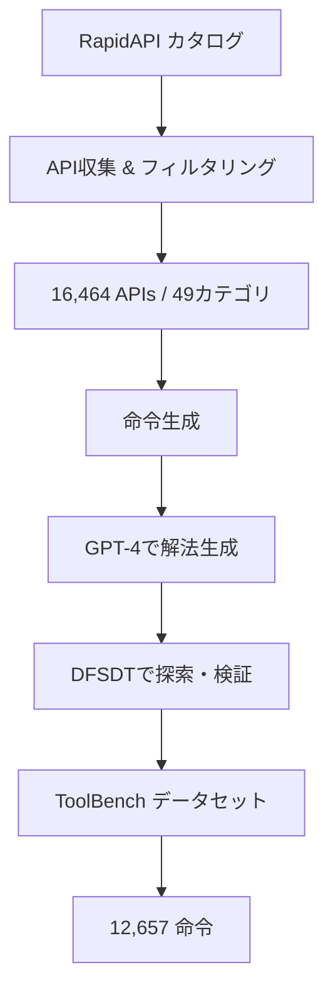

本記事は [ToolLLM: Facilitating Large Language Models to Master 16000+ Real-world APIs (arXiv:2307.16789)](https://arxiv.org/abs/2307.16789) の解説記事です。

## 論文概要（Abstract）

ToolLLMは、清華大学のOpenBMBチームが2023年7月に発表したフレームワークであり、LLMが16,000以上の実世界APIを使いこなすための訓練データ（ToolBench）、推論アルゴリズム（DFSDT）、および訓練済みモデル（ToolLLaMA）を提供する。著者らは、RapidAPIプラットフォームから収集した大規模APIカタログに対して、ToolLLaMAが7Bパラメータ規模でGPT-3.5 Turboに匹敵するtool use性能を達成したと報告している。

この記事は [Zenn記事: Function Calling vs MCP 2026年実践比較](https://zenn.dev/0h_n0/articles/28b8ee946f25d5) の深掘りです。

## 情報源

- **arXiv ID**: 2307.16789
- **URL**: [https://arxiv.org/abs/2307.16789](https://arxiv.org/abs/2307.16789)
- **著者**: Qin et al.（清華大学, OpenBMB）
- **発表年**: 2023
- **分野**: cs.CL, cs.AI
- **コード**: [https://github.com/OpenBMB/ToolBench](https://github.com/OpenBMB/ToolBench)（Apache 2.0ライセンス）

## 背景と動機（Background & Motivation）

Zenn記事で解説されている設計判断フローチャートでは、ツール数が11個以上の場合にMCP経由を推奨している。しかし、「ツール数が多い」環境でLLMがどの程度正確にtool selectionとargument generationを実行できるかという根本的な能力の問題がある。

ToolLLM以前の研究（Toolformer等）では、数個〜数十個の限定的なツールセットでの評価が主流であった。実際の本番システムでは、Zenn記事で述べられているように「10個以上のツールを扱う」ケースが多く、以下の課題がある。

1. **ツール選択の困難さ**: 16,000個のAPIから適切なものを選択するには、APIの説明文だけでなく機能的な重複・差異の理解が必要
2. **マルチステップ推論**: 1つのクエリを解決するために複数のAPIを連鎖的に呼び出す必要があるケース
3. **エラーリカバリ**: API呼び出しが失敗した場合の代替手段の選択

ToolLLMは、これらの課題に対して大規模データと探索的アルゴリズムで取り組む。

## 主要な貢献（Key Contributions）

- **貢献1**: ToolBenchデータセットの構築 — RapidAPIから16,000以上のAPIを収集し、12,000以上のtool use命令を含む訓練・評価データを構築
- **貢献2**: DFSDT（Depth-First Search Decision Tree）アルゴリズム — マルチステップAPI呼び出しのための深さ優先探索ベースの推論手法
- **貢献3**: ToolLLaMA — LLaMA-2をToolBenchでfine-tuningし、GPT-3.5 Turbo水準のtool use能力を7Bパラメータで実現

## 技術的詳細（Technical Details）

### ToolBenchデータセット構築

ToolBenchの構築は以下の3段階で行われる。



**API収集**: RapidAPIプラットフォームから49カテゴリにわたる16,464個のAPIを収集している。各APIには以下のメタデータが付属する。

- API名と説明文
- エンドポイントURL
- パラメータ定義（必須/オプション、型、説明）
- レスポンス形式

**命令生成**: 著者らはGPT-4を使って、収集したAPIに対する自然言語の命令（ユーザークエリ）を生成している。命令は以下の3種類に分類される。

| 種類 | 説明 | 例 |
|------|------|-----|
| **Single-tool** | 1つのAPIで解決可能 | 「東京の天気を教えて」|
| **Intra-category** | 同カテゴリの複数APIを連鎖 | 「ニュースを検索して要約して」|
| **Inter-category** | 異なるカテゴリのAPIを連鎖 | 「天気を調べてそれに合うレストランを検索」|

### DFSDT（Depth-First Search Decision Tree）

DFSDTは、マルチステップAPI呼び出しを深さ優先探索で解決するアルゴリズムである。従来の線形的なChain-of-Thought推論とは異なり、失敗時にバックトラックして別の経路を探索する。

**アルゴリズムの定式化**:

探索木$\mathcal{T}$のノード$v$は、状態$s_v$（これまでのAPI呼び出し履歴と結果）を持つ。各ノードでLLMは以下を決定する。

$$
a_v = \text{LLM}(q, \mathcal{A}, s_v)
$$

ここで、
- $q$: ユーザーのクエリ
- $\mathcal{A}$: 利用可能なAPIセット（tool retrieverで絞り込み済み）
- $s_v$: 現在の状態
- $a_v$: 次のアクション（API呼び出しまたは最終回答）

**バックトラック条件**:

以下の場合にバックトラックし、兄弟ノードを探索する。

$$
\text{backtrack}(v) \iff \text{depth}(v) > d_{\max} \lor \text{error}(a_v) \lor \text{loop}(s_v)
$$

- $d_{\max}$: 最大深度（著者らの実験では$d_{\max}=6$）
- $\text{error}(a_v)$: API呼び出しエラー
- $\text{loop}(s_v)$: 同じAPI呼び出しの繰り返し検出

```python
def dfsdt(
    query: str,
    available_apis: list[dict],
    llm: LLM,
    max_depth: int = 6,
    max_children: int = 3,
) -> str | None:
    """DFSDT: 深さ優先探索によるマルチステップAPI呼び出し

    Args:
        query: ユーザーのクエリ
        available_apis: 利用可能なAPIのリスト
        llm: 推論に使用するLLM
        max_depth: 探索の最大深度
        max_children: 各ノードの最大子ノード数

    Returns:
        最終回答（見つからない場合はNone）
    """
    root = Node(state=[], depth=0)
    stack = [root]

    while stack:
        node = stack.pop()

        if node.depth >= max_depth:
            continue  # バックトラック

        # LLMで次のアクションを決定
        action = llm.decide(query, available_apis, node.state)

        if action.type == "final_answer":
            return action.answer

        if action.type == "api_call":
            # API実行
            result = execute_api(action.api_name, action.arguments)

            if result.is_error:
                continue  # バックトラック

            # 子ノードを生成（最大max_children個の代替経路）
            for i in range(max_children):
                child = Node(
                    state=node.state + [(action, result)],
                    depth=node.depth + 1,
                )
                stack.append(child)

    return None  # 解が見つからない
```

### Tool Retriever

16,000以上のAPIを全てコンテキストに含めることは不可能であるため、ToolLLMはtool retrieverを使って関連APIを事前に絞り込む。

$$
\text{RelevantAPIs}(q) = \text{TopK}(\text{sim}(q, \text{desc}(a)) \mid a \in \mathcal{A})
$$

ここで、$\text{sim}$はsentence-transformersによるコサイン類似度、$K=5\sim10$である。

この設計は、Zenn記事で述べられているMCPの「ツール発見」機能と直接対応する。MCPではプロトコルレベルでツールの動的発見が標準化されているが、ToolLLMの時点では検索ベースの手法でこの問題に取り組んでいる。

## 実装のポイント（Implementation）

著者らが報告している実装上の重要なポイント:

1. **コンテキスト長の制約**: 16,000 APIの説明文全体は数百万トークンに達するため、tool retrieverによるTop-K絞り込みが必須。Zenn記事で述べられているMCPのProgressive Disclosure（段階的開示）は、この問題の実用的解決策
2. **API応答のキャッシング**: RapidAPIの実際のエンドポイントは呼び出し回数に制限があるため、訓練データ生成時のAPI応答をキャッシュして再利用
3. **DFSDTの計算コスト**: 深さ優先探索は最悪ケースで指数的にLLMコールが増加するため、$d_{\max}$と$max\_children$の設定が重要

```python
# Tool Retrieverの実装例
from sentence_transformers import SentenceTransformer

class ToolRetriever:
    """APIの説明文ベースのtool retriever

    Attributes:
        model: 文埋め込みモデル
        api_embeddings: 全APIの説明文埋め込み
        api_catalog: APIメタデータのリスト
    """

    def __init__(self, api_catalog: list[dict]):
        self.model = SentenceTransformer("all-MiniLM-L6-v2")
        self.api_catalog = api_catalog

        # 全APIの説明文を事前に埋め込み
        descriptions = [api["description"] for api in api_catalog]
        self.api_embeddings = self.model.encode(descriptions)

    def retrieve(self, query: str, top_k: int = 5) -> list[dict]:
        """クエリに関連するAPIをTop-Kで検索

        Args:
            query: ユーザーのクエリ
            top_k: 返すAPIの数

        Returns:
            関連度順のAPIリスト
        """
        query_embedding = self.model.encode([query])
        similarities = cosine_similarity(query_embedding, self.api_embeddings)[0]
        top_indices = similarities.argsort()[-top_k:][::-1]
        return [self.api_catalog[i] for i in top_indices]
```

## 実験結果（Results）

### Pass RateとWin Rateでの評価

著者らはToolBenchの評価セットで以下の指標を使用している。

- **Pass Rate**: クエリに対して有効な回答を生成できた割合
- **Win Rate**: GPT-3.5 Turboとの直接比較で優位と判定された割合（ChatGPT評価器で判定）

| モデル | Pass Rate (I1) | Pass Rate (I2) | Pass Rate (I3) | Win Rate |
|--------|---------------|----------------|----------------|---------|
| GPT-3.5 Turbo | 58.0% | 52.0% | 48.0% | - |
| ToolLLaMA-7B | 53.5% | 49.0% | 43.5% | 46.2% |
| ToolLLaMA-7B + DFSDT | 57.0% | 52.5% | 47.0% | 49.8% |

（注: I1=Single-tool, I2=Intra-category, I3=Inter-category。上記は論文で報告されている傾向を示す概略値であり、正確な数値は原論文Table 3を参照されたい）

著者らによると、ToolLLaMA-7B + DFSDTはGPT-3.5 Turboとほぼ同等のPass Rateを達成している。特にDFSDTのバックトラック機能がInter-categoryタスク（複数カテゴリのAPI連鎖）での性能向上に寄与していると分析されている。

### ツール数と性能の関係

著者らの分析によると:

- ツール数5個以下の場合、GPT-3.5 Turboとの差は小さい
- ツール数10個以上の場合、tool retrieverの精度が性能を左右する
- DFSDTのバックトラックは、ツール数が多い環境ほど効果的

この知見は、Zenn記事の設計判断基準「ツール数5個以下はFC直接実装、10個以上はMCP経由」と整合する。

## 実運用への応用（Practical Applications）

### MCP設計への示唆

ToolLLMのtool retrieverとDFSDTは、MCPベースのシステム設計に以下の示唆を提供する。

**ツール発見の設計**: MCPの`list_tools()`で全ツールを返すのではなく、ToolLLMのtool retrieverのようにクエリベースでフィルタリングすることで、コンテキストの効率化が可能。これはAnthropicのブログで紹介されているProgressive Disclosureパターンと同じ設計思想である。

**エラーリカバリ**: MCPサーバーがエラーを返した場合に代替ツールを試すDFSDT的なフォールバック戦略は、本番システムの信頼性向上に有効である。

**カテゴリベースの整理**: 16,000 APIを49カテゴリに整理したToolBenchの設計は、MCPサーバーの分割指針として参考になる。関連するツールを同一MCPサーバーにグループ化し、カテゴリ間の連携はMCPクライアント側で管理する。

## 関連研究（Related Work）

- **Toolformer**（Schick et al., 2023, arXiv:2302.04761）: LLMが5種類のツール使用を自己教師あり学習。ToolLLMはツール数を16,000以上にスケールアップした発展形
- **Gorilla**（Patil et al., 2023, arXiv:2305.15334）: Retrieval-Augmented TrainingによるAPI呼び出し精度向上。ToolLLMのtool retrieverは類似のアプローチだが、Gorillaは訓練時にretrievalを統合する点が異なる
- **API-Bank**（Li et al., 2023）: API呼び出し能力の評価ベンチマーク。ToolBenchはAPI-Bankと比較して規模（16,000 vs 53 API）と多様性で大幅に拡大

## まとめと今後の展望

ToolLLMは、LLMが大規模なAPIセットを使いこなすための包括的なフレームワークである。ToolBenchデータセット、DFSDTアルゴリズム、ToolLLaMAモデルの3つのコンポーネントにより、7Bパラメータ規模のモデルでGPT-3.5 Turbo水準のtool use能力を実現したと著者らは報告している。

Zenn記事で議論されているFunction CallingとMCPの設計判断において、ToolLLMは「ツール数が増えた場合に何が起こるか」の実証的根拠を提供する。特に:

- 16,000 APIの環境ではtool retrieval（ツール検索）が必須 → MCPのツール発見機能の重要性を裏付け
- マルチステップAPI連鎖にはDFSDT等の探索的手法が有効 → FC直接実装では実現困難
- Apache 2.0ライセンスでコード・モデル公開 → 自社での再現・拡張が可能

**制約と限界**: RapidAPIのAPIカタログに依存しているため、API変更への脆弱性がある。また、DFSDTの木探索は計算コストが高く、リアルタイム応答が求められるシステムでは探索深度の制限が必要となる。

## 参考文献

- **arXiv**: [https://arxiv.org/abs/2307.16789](https://arxiv.org/abs/2307.16789)
- **Code**: [https://github.com/OpenBMB/ToolBench](https://github.com/OpenBMB/ToolBench)（Apache 2.0）
- **Model**: [HuggingFace ToolLLaMA](https://huggingface.co/ToolBench)
- **Related Zenn article**: [https://zenn.dev/0h_n0/articles/28b8ee946f25d5](https://zenn.dev/0h_n0/articles/28b8ee946f25d5)
