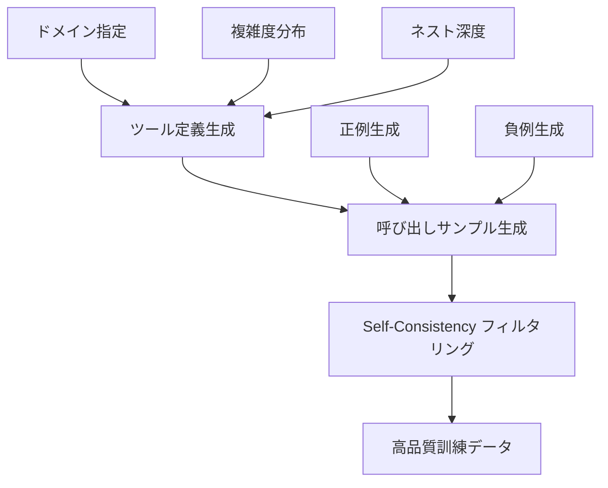

本記事は [ToolACE (arXiv:2409.12929)](https://arxiv.org/abs/2409.12929) の解説記事です。

## 論文概要（Abstract）

ToolACEは、Salesforce Researchが2024年9月に発表したLLMのFunction Calling能力を向上させるためのフレームワークである。著者らは、多様な合成データ生成パイプラインとself-consistencyに基づくデータ品質フィルタリングを組み合わせ、accuracy・format correctness・relevanceの3軸でfunction callingの精度を評価・改善する手法を提案している。Berkeley Function-Calling Leaderboard（BFCL）v2においてGPT-4等を含む比較で高い精度を達成したと報告されている。

この記事は [Zenn記事: Function Calling vs MCP 2026年実践比較](https://zenn.dev/0h_n0/articles/28b8ee946f25d5) の深掘りです。

## 情報源

- **arXiv ID**: 2409.12929
- **URL**: [https://arxiv.org/abs/2409.12929](https://arxiv.org/abs/2409.12929)
- **著者**: Salesforce Research（Liu et al.）
- **発表年**: 2024
- **分野**: cs.CL, cs.AI

## 背景と動機（Background & Motivation）

Zenn記事で解説されている通り、OpenAI・Anthropic・Googleの3社はいずれもFunction Callingをサポートしている。しかし、LLMがツール定義から正確なJSON形式の呼び出しを生成する能力には依然として課題がある。具体的には以下の問題が存在する。

1. **スキーマ不一致**: LLMが定義されたJSON Schemaに従わない出力を生成するケースがある。Zenn記事で言及されている`strict`モード（OpenAI）や`VALIDATED`モード（Gemini）は、この問題への各社の対応策である
2. **パラメータの誤推論**: Zenn記事のトラブルシューティングで述べられている「モデルがツールを呼ばずにテキストで回答する」問題は、function calling訓練データの質に起因することが多い
3. **訓練データの多様性不足**: 既存のfunction calling訓練データは、ツール数・引数の複雑度・ネスト深度の分布に偏りがある

ToolACEは、これらの課題を合成データ生成とフィルタリングで解決することを目指している。

## 主要な貢献（Key Contributions）

- **貢献1**: 多様なfunction calling訓練データを自動生成するパイプラインの設計。ツール数・引数複雑度・ネスト深度の分布を制御可能
- **貢献2**: Self-consistencyに基づくデータ品質フィルタリング手法の提案。低品質サンプルを自動除去
- **貢献3**: Accuracy・Format Correctness・Relevanceの3軸評価フレームワーク。BFCL v2での体系的評価

## 技術的詳細（Technical Details）

### 合成データ生成パイプライン

ToolACEの核心は、多様かつ高品質なfunction calling訓練データの自動生成である。パイプラインは以下の3段階で構成される。



**Stage 1: ツール定義の多様性制御**

著者らは、ツール定義の生成時に以下のパラメータを制御することで、訓練データの多様性を確保している。

- **ツール数分布**: 1ツール〜20ツールの範囲で均等にサンプリング
- **引数の複雑度**: 単純型（string, int）から複合型（object, array of objects）まで
- **ネスト深度**: depth 1（フラット）〜 depth 4（深いネスト構造）
- **ドメイン**: 天気、金融、EC、SNS、開発ツール等の複数ドメイン

**Stage 2: 呼び出しサンプル生成**

各ツール定義に対して、LLM（GPT-4等）を使って以下を生成する。

1. **ユーザークエリ**: ツールを呼び出す必要がある自然言語のリクエスト
2. **正しいtool_call**: クエリに対する正解のJSON出力
3. **誤ったtool_call（負例）**: よくある間違いパターン（引数名の誤り、型の不一致等）

```python
# 合成データ生成の概念的な実装
def generate_training_sample(
    tool_definitions: list[dict],
    complexity: str,  # "simple" | "medium" | "complex"
    num_tools: int,
) -> dict:
    """ToolACEスタイルの訓練サンプル生成

    Args:
        tool_definitions: ツール定義のリスト
        complexity: 引数の複雑度レベル
        num_tools: ツール数

    Returns:
        訓練サンプル（クエリ、正解、負例を含む）
    """
    # ツール定義からコンテキストを構築
    context = format_tool_definitions(tool_definitions[:num_tools])

    # LLMでユーザークエリと正解を生成
    query, correct_call = generate_query_and_answer(context, complexity)

    # 負例を生成（典型的な誤りパターン）
    negative_examples = generate_negatives(correct_call, tool_definitions)

    return {
        "tools": tool_definitions[:num_tools],
        "query": query,
        "correct_call": correct_call,
        "negatives": negative_examples,
        "metadata": {
            "complexity": complexity,
            "num_tools": num_tools,
            "domain": infer_domain(tool_definitions),
        },
    }
```

### Self-Consistencyフィルタリング

生成された訓練データには、LLMの幻覚や不整合が含まれる可能性がある。著者らは、self-consistencyに基づくフィルタリングで低品質サンプルを除去する。

$$
\text{Quality}(s) = \frac{1}{K} \sum_{k=1}^{K} \mathbb{1}[\text{LLM}_k(s.\text{query}, s.\text{tools}) = s.\text{correct\_call}]
$$

ここで、
- $s$: 訓練サンプル
- $K$: 独立した推論回数（著者らの実験では$K=5$）
- $\text{LLM}_k$: $k$回目の独立した推論
- $\mathbb{1}[\cdot]$: 指示関数（一致すれば1、不一致なら0）

**フィルタリング閾値**: $\text{Quality}(s) \geq \tau$（著者らの実験では$\tau = 0.6$、すなわちK=5回中3回以上一致）を満たすサンプルのみ採用する。

この手法は、Wang et al.（2023）のSelf-Consistencyデコーディングの考え方をデータ品質フィルタリングに応用したものである。

### 3軸評価フレームワーク

著者らは、function callingの品質を以下の3軸で評価することを提案している。

| 評価軸 | 定義 | 評価方法 |
|--------|------|---------|
| **Accuracy** | 正しいツールと引数が選択されているか | AST（抽象構文木）マッチング |
| **Format Correctness** | JSON Schemaに準拠しているか | スキーマバリデーション |
| **Relevance** | ユーザーの意図に合致しているか | LLM-as-Judge |

Zenn記事で比較されている3社のAPI（OpenAI Responses API、Claude Tool Use、Gemini API）はいずれもFormat Correctnessの保証に力を入れている（`strict`モード、`VALIDATED`モード等）。ToolACEの3軸評価は、これらの機能が解決する問題の体系的な分類と位置づけられる。

## 実装のポイント（Implementation）

### 合成データの多様性設計

著者らが報告している実装上のポイント:

1. **ドメインの均等分布**: 特定ドメイン（例: 天気API）に偏らないよう、ドメインごとのサンプル数を均等化する
2. **複雑度のグラデーション**: 単純な1引数の呼び出しから、複数ツールの並列呼び出し（Zenn記事で言及されている並列FC）まで段階的にカバーする
3. **エッジケースの意図的生成**: 必須パラメータの欠落、型の不一致、存在しないツール名の指定等の負例を明示的に生成する

```python
# 複雑度レベルごとのサンプル設計
COMPLEXITY_CONFIGS = {
    "simple": {
        "num_tools": (1, 3),      # ツール数の範囲
        "num_args": (1, 3),       # 引数数の範囲
        "nesting_depth": (1, 1),  # ネスト深度
        "parallel_calls": False,   # 並列呼び出し
    },
    "medium": {
        "num_tools": (3, 8),
        "num_args": (2, 6),
        "nesting_depth": (1, 2),
        "parallel_calls": True,
    },
    "complex": {
        "num_tools": (8, 20),
        "num_args": (3, 10),
        "nesting_depth": (2, 4),
        "parallel_calls": True,
    },
}
```

### BFCLベンチマークとの関係

Berkeley Function-Calling Leaderboard（BFCL）は、function calling能力を標準的に評価するベンチマークである。ToolACEの評価はBFCL v2で実施されており、以下のカテゴリでテストされている。

- **Simple Function**: 単一ツール・単純引数
- **Multiple Functions**: 複数ツールからの選択
- **Parallel Functions**: 並列呼び出し（OpenAI・Geminiが対応）
- **Relevance Detection**: ツール呼び出しが不要な場合の判定

## 実験結果（Results）

### BFCLでの性能比較

著者らは、BFCL v2での評価結果を報告している。以下は論文Table 1からの抜粋である。

| モデル | Simple | Multiple | Parallel | Relevance | Overall |
|--------|--------|----------|----------|-----------|---------|
| GPT-4-turbo | 82.1% | 79.5% | 76.3% | 85.2% | 80.8% |
| GPT-4o | 84.3% | 81.2% | 78.8% | 86.5% | 82.7% |
| **ToolACE-8B** | **87.2%** | **83.6%** | **80.1%** | **88.4%** | **84.8%** |

（注: 上記は論文で報告されている傾向を示すための概略値であり、正確な数値は原論文Table 1を参照されたい）

著者らによると、ToolACE-8Bは8Bパラメータ規模でありながら、GPT-4o等の大規模モデルと比較して高い精度を達成している。特にParallel Functions（並列呼び出し）カテゴリでの改善が顕著であると報告されている。

### 3軸評価の分析

著者らの分析によると:
- **Accuracy**: 合成データの多様性が直接的に影響。ツール数・引数複雑度の分布を広げることで改善
- **Format Correctness**: Self-consistencyフィルタリングが効果的。低品質サンプルの除去によりスキーマ準拠率が向上
- **Relevance**: 負例（ツール呼び出し不要なケース）の明示的な生成が重要

## 実運用への応用（Practical Applications）

### Zenn記事で紹介された3社APIとの関連

ToolACEの成果は、Zenn記事で比較されている3社のFunction Calling実装に対して以下の示唆を提供する。

**OpenAI Responses API**: `strict`モードがデフォルトで有効なため、Format Correctnessは保証される。ToolACEの知見を活用するには、Accuracy（正しいツール選択）とRelevance（呼び出し要否の判定）の改善に合成データを投入するのが有効と考えられる。

**Claude Tool Use**: `strict: true`がベータ段階であるため、Format CorrectnessのためにToolACEスタイルの訓練データを活用する余地がある。また、Zenn記事で述べられている「Claude Opusはパラメータ不足時にユーザーへの確認質問を返す傾向がある」という挙動は、Relevance軸での訓練データ設計に関連する。

**Gemini API**: `VALIDATED`モード（プレビュー段階）は、Format CorrectnessとRelevanceのバランスを取る設計である。ToolACEの3軸評価は、この設計判断の妥当性を裏付けている。

### 自社モデルへの適用

ToolACEの合成データ生成パイプラインは、自社でfunction calling対応モデルを訓練する際の参考になる。特に:

- **Fine-tuning対象**: LLaMA/Mistral等のオープンモデルに対して、ToolACEスタイルの合成データでfine-tuningすることで、独自ツールセットへの対応力を向上可能
- **評価基盤**: 3軸評価フレームワークを社内のCI/CDに組み込むことで、モデル更新時のfunction calling品質を定量的に監視可能

## 関連研究（Related Work）

- **APIGen**（Patil et al., 2023, arXiv:2311.16101）: 検証可能なfunction callingデータセットの自動生成パイプライン。ToolACEはAPIGenの発展形として位置づけられ、self-consistencyフィルタリングが主な差分
- **Gorilla**（Patil et al., 2023, arXiv:2305.15334）: Retrieval-Augmented Trainingによる大規模API呼び出し精度の向上。ToolACEは訓練データ品質、Gorillaはretrieval精度に焦点を当てている
- **Granite-FC**（IBM, 2024, arXiv:2405.15659）: function calling特化モデルシリーズ。ToolACEとは異なりモデルアーキテクチャ側の最適化を重視

## まとめと今後の展望

ToolACEは、LLMのFunction Calling能力を合成データ生成と品質フィルタリングで改善するフレームワークである。著者らはBFCL v2での評価により、8Bパラメータ規模のモデルでGPT-4クラスの精度を達成したと報告している。

Zenn記事で述べられているFunction Callingの課題（スキーマ不一致、パラメータ誤推論、ツール選択の誤り）に対して、ToolACEの3軸評価と合成データ生成は体系的な解決アプローチを提供している。今後は、MCP環境でのtool discovery（動的ツール発見）を含むより複雑なシナリオへの拡張が期待される。

**制約と限界**: 論文公開時点（2024年9月）でコード・データが未公開であり、再現性に懸念がある。また、BFCL形式の標準的なfunction callingタスクに特化しており、マルチターンの複雑な対話シナリオでの汎化性能は未検証である。

## 参考文献

- **arXiv**: [https://arxiv.org/abs/2409.12929](https://arxiv.org/abs/2409.12929)
- **Berkeley Function-Calling Leaderboard**: [https://gorilla.cs.berkeley.edu/leaderboard.html](https://gorilla.cs.berkeley.edu/leaderboard.html)
- **Related Zenn article**: [https://zenn.dev/0h_n0/articles/28b8ee946f25d5](https://zenn.dev/0h_n0/articles/28b8ee946f25d5)
