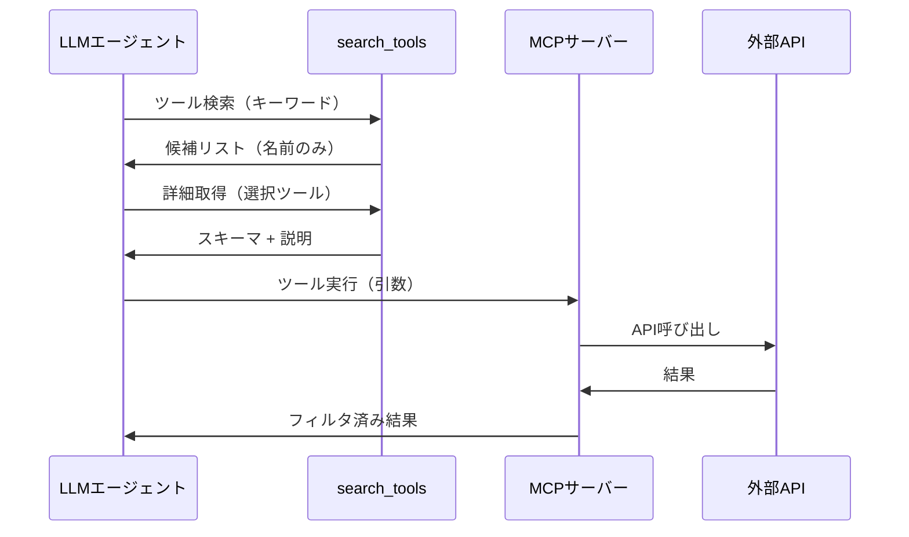

本記事は [Code execution with MCP: building more efficient AI agents](https://www.anthropic.com/engineering/code-execution-with-mcp)（Anthropic Engineering Blog）の解説記事です。

## ブログ概要（Summary）

Anthropicのエンジニアリングチームは、Model Context Protocol（MCP）におけるコード実行パターンを提案し、従来のツール直接呼び出し方式と比較してトークン使用量を150,000トークンから2,000トークンへ98.7%削減した事例を報告している。このパターンでは、MCPサーバーをコードAPIとして構成し、エージェントがツール定義をオンデマンドで発見・実行することで、コンテキストウィンドウの消費を大幅に抑制する。

この記事は [Zenn記事: Function Calling vs MCP 2026年実践比較](https://zenn.dev/0h_n0/articles/28b8ee946f25d5) の深掘りです。

## 情報源

- **種別**: 企業テックブログ
- **URL**: [https://www.anthropic.com/engineering/code-execution-with-mcp](https://www.anthropic.com/engineering/code-execution-with-mcp)
- **組織**: Anthropic Engineering
- **発表日**: 2025年

## 技術的背景（Technical Background）

Function Callingを用いたLLMエージェントシステムでは、すべてのツール定義をAPIリクエストに含める必要がある。Zenn記事で解説されている通り、ツール数が増加すると以下の問題が顕在化する。

1. **ツール定義のオーバーヘッド**: 各ツールのJSON Schema（名前・説明・パラメータ）をリクエストごとに送信するため、10個のツールで数千トークン、50個以上では数万トークンを消費する
2. **中間結果の重複**: ツールAの出力をツールBに渡す場合、結果がコンテキストに2回含まれる（取得時と送信時）
3. **制御フローのコスト**: ループや条件分岐を実現するために複数回のLLMラウンドトリップが必要

Anthropicのブログでは、これらの問題に対してMCPのコード実行パターンを解決策として提示している。この背景は、Zenn記事で言及されている「ツール数が10個以上の本番システムにはMCP経由がコスト・保守性の両面で有利」という設計判断の技術的根拠にあたる。

## 実装アーキテクチャ（Architecture）

### ファイルシステムベースのMCPサーバー構成

ブログで紹介されているアーキテクチャは、MCPサーバーをファイルシステム上のコードAPIとして構成する方式である。

```
servers/
├── google-drive/
│   ├── getDocument.ts
│   └── index.ts
├── salesforce/
│   ├── updateRecord.ts
│   └── index.ts
└── slack/
    ├── sendMessage.ts
    └── index.ts
```

各ツールファイルはMCPの呼び出しをTypeScriptインターフェースでラップし、エージェントはディレクトリ構造を探索することでツールを動的に発見する。



### Progressive Disclosure（段階的開示）

従来のFunction Callingでは全ツール定義をコンテキストに一括ロードするが、MCPコード実行パターンでは`search_tools`メカニズムを通じて3段階の詳細度でツールを開示する。

| 段階 | 内容 | トークンコスト |
|------|------|--------------|
| **Level 1** | ツール名のみ | 数トークン/ツール |
| **Level 2** | ツール名 + 説明文 | 数十トークン/ツール |
| **Level 3** | 完全なスキーマ | 数百トークン/ツール |

ブログによると、この段階的開示により、50ツール規模のシステムでもLevel 1の一覧取得は数百トークンで済み、実際に使用する2-3個のツールのみLevel 3まで展開する。

### コンテキスト効率化フィルタリング

大規模データの処理においては、MCPサーバー側でフィルタリングを実行してからLLMに返すことで、コンテキストの肥大化を防ぐ。ブログでは以下の例が示されている。

> 10,000行のスプレッドシートから5件の未処理注文を抽出する場合、従来方式では10,000行全体がコンテキストに載るが、MCPコード実行パターンではサーバー側で5件にフィルタリングしてから返す。

この設計は、Zenn記事で述べられている「MCPはツールの発見・接続・管理を標準化するプロトコル」という特性の実践的な活用例である。ツールの実行環境がサーバー側に存在するため、データの前処理・フィルタリングをサーバー側で完結できる。

## トークン効率化の定量分析

### 98.7%削減の内訳

ブログで報告されている「150,000トークン → 2,000トークン」の削減を構成要素ごとに分析する。

$$
\text{TokenSaved} = T_{\text{tool\_defs}} + T_{\text{intermediate}} + T_{\text{control\_flow}}
$$

ここで、
- $T_{\text{tool\_defs}}$: ツール定義のロードに消費されるトークン
- $T_{\text{intermediate}}$: 中間結果の重複によるトークン
- $T_{\text{control\_flow}}$: 制御フローのためのラウンドトリップで消費されるトークン

**ツール定義の削減**:

従来方式では、例えば50個のツール（各ツール平均3,000トークン）をすべてロードする場合:

$$
T_{\text{tool\_defs}}^{\text{traditional}} = 50 \times 3000 = 150{,}000 \text{ tokens}
$$

MCPコード実行パターンでは、search_toolsで2-3個のツールのみ展開:

$$
T_{\text{tool\_defs}}^{\text{MCP}} = 50 \times 5 + 3 \times 500 = 1{,}750 \text{ tokens}
$$

（Level 1一覧250トークン + 選択ツール3個のLevel 3展開1,500トークン）

**中間結果の削減**: 2時間の会議議事録（約50,000トークン）を取得して別ツールに渡すケースでは、従来方式ではコンテキストに2回載る（100,000トークン）が、MCPパターンではサーバー側のファイルシステムに永続化し、参照のみ渡す（数百トークン）。

### Tool Search Toolとの比較

ブログでは、MCPコード実行パターンの他に「Tool Search Tool」パターンも言及されている。Tool Search Toolは191,300トークンのコンテキスト節約を実現し、従来の122,800トークンのアプローチと比較して85%の削減率を達成したと報告されている。

この比較から、トークン効率化にはMCPコード実行パターンが最も効果的だが、Tool Search Toolパターンでも十分な効率化が得られることがわかる。

## 制御フローの最適化

### ネイティブコード実行の利点

従来のFunction Callingでは、ループ処理（例: リスト内の各要素に対する操作）をLLMのラウンドトリップで実現する必要がある。

```python
# 従来方式: N回のラウンドトリップが必要
for item in items:  # LLMが毎回判断
    result = call_tool("process", {"item": item})  # 1ラウンドトリップ
    results.append(result)
```

MCPコード実行パターンでは、ループ・条件分岐・エラーハンドリングがサーバー側のコードでネイティブに実行される。

```python
# MCPコード実行パターン: 1回のラウンドトリップ
@mcp.tool()
def process_batch(items: list[str]) -> list[dict]:
    """バッチ処理: items内の各要素を処理して結果を返す"""
    results = []
    for item in items:
        try:
            result = process_single(item)
            results.append({"item": item, "status": "success", "result": result})
        except Exception as e:
            results.append({"item": item, "status": "error", "error": str(e)})
    return results
```

この方式により、レイテンシの低減と「Time to First Token」の改善が見込まれるとブログでは述べられている。

### 状態管理とスキル蓄積

ブログでは、エージェントが中間結果をファイルに永続化し、処理を再開できる状態管理パターンも紹介されている。さらに、再利用可能な関数を`./skills/`ディレクトリに保存する「スキル蓄積」パターンにより、エージェントが高レベルの機能を参照・反復できるようになる。

```
./skills/
├── SKILL.md          # スキル一覧とメタデータ
├── filter_orders.py  # 注文フィルタリング
├── summarize_doc.py  # ドキュメント要約
└── notify_slack.py   # Slack通知
```

このパターンは、Zenn記事で述べられている「MCPはToolsの他にResources（参照データ）とPrompts（再利用可能テンプレート）を公開する」という3つのプリミティブの実践的な活用にあたる。

## プライバシー保護データフロー

ブログでは、MCPコード実行パターンのセキュリティ上の利点として、プライバシー保護データフローが挙げられている。


機密データはデフォルトで実行環境内に留まり、MCPクライアントがPII（個人識別情報）を自動的にトークン化してからモデルに送信する。下流のツール呼び出し時にアントークン化を行うことで、モデルのコンテキストに生のPIIが載ることを防止する。

## FC直接実装との比較（Zenn記事との関連）

Zenn記事では「ツール数が5個以下のプロトタイプにはFC直接実装、10個以上のツールを扱う本番システムにはMCP経由がコスト・保守性の両面で有利」と述べている。Anthropicのブログで報告されたデータは、この設計判断の定量的根拠を提供する。

| 観点 | FC直接実装 | MCPコード実行パターン |
|------|----------|-------------------|
| **ツール定義コスト** | ツール数 × 平均3,000 tokens | search_toolsで段階的開示 |
| **中間データ** | コンテキストに全量載る | サーバー側でフィルタリング |
| **制御フロー** | LLMラウンドトリップ | ネイティブコード実行 |
| **状態管理** | アプリケーション側で実装 | ファイル永続化 + スキル蓄積 |
| **プライバシー** | データがコンテキストに載る | PII自動トークン化 |
| **運用コスト** | 低（追加インフラ不要） | 高（サンドボックス・監視必要） |

### トレードオフの整理

ブログでは、MCPコード実行パターンが万能ではないことも明記されている。セキュアなサンドボックス環境の構築、リソース制限の設定、モニタリングインフラの整備といった運用コストが追加で発生する。Zenn記事で述べられている「MCPサーバーの起動・管理というインフラ運用コストが発生する」という注意点と一致する。

## パフォーマンス最適化（Performance）

### 実測値（ブログ報告値）

- **トークン削減率**: 98.7%（150,000 → 2,000トークン）
- **Tool Search Toolパターンの削減**: 85%（191,300トークンのコンテキスト節約）
- **レイテンシ改善**: ネイティブコード実行により、ループ処理のラウンドトリップ回数を1回に削減

### チューニング手法

ブログで示唆されている最適化アプローチ:

1. **search_toolsの閾値調整**: Level 1/2/3の展開基準を調整し、不要なスキーマ展開を抑制
2. **バッチ処理の活用**: 単一ツール呼び出しの代わりにバッチ処理ツールを設計
3. **中間結果のファイル永続化**: 大規模データはコンテキストではなくファイルシステムに保存

## 運用での学び（Production Lessons）

### サンドボックス環境の必要性

MCPコード実行パターンでは、エージェントが任意のコードを実行する可能性があるため、セキュアなサンドボックス環境が必須となる。ブログでは以下の運用要件が示唆されている。

- **リソース制限**: CPU・メモリ・ディスク・ネットワークの上限設定
- **実行時間制限**: タイムアウトの設定によるランナウェイ防止
- **ネットワーク分離**: 外部アクセスのホワイトリスト制御
- **監視・ログ**: 実行されたコードとその結果の記録

### 障害対応パターン

MCPサーバーの障害時には、stdioトランスポートの場合はプロセス再起動、SSE/streamable-httpトランスポートの場合はヘルスチェック+自動再起動が推奨される。Zenn記事で述べられている「MCPサーバーのstdioが壊れる」問題は、ログを標準エラー出力に書くことで回避する。

## 学術研究との関連（Academic Connection）

MCPコード実行パターンの設計思想は、以下の学術研究と関連がある。

- **Toolformer**（Schick et al., 2023, arXiv:2302.04761）: LLMがツール使用を自己学習する手法。MCPはこのアイデアをプロトコルレベルで標準化したものと位置づけられる
- **ToolLLM**（Qin et al., 2023, arXiv:2307.16789）: 16,000以上のAPIを扱うためのDFSDTアルゴリズム。MCPのsearch_toolsパターンは、このtool retrieval問題の実用的解決策にあたる
- **ReAct**（Yao et al., 2022, arXiv:2210.03629）: Reasoning + Actingの統合フレームワーク。MCPコード実行パターンでは、Actingの部分をネイティブコードで実現し効率化している

## まとめと実践への示唆

Anthropicのエンジニアリングブログで報告されたMCPコード実行パターンは、Function Callingの本番運用における3つの主要課題（ツール定義オーバーヘッド、中間結果の重複、制御フローのコスト）に対して、定量的に実証された解決策を提供している。

**実務への示唆**:
- ツール数10個以上のシステムでは、MCPコード実行パターンの採用を検討すべき
- ツール数5個以下のプロトタイプでは、FC直接実装の方がシンプルで保守しやすい
- MCPの導入にはサンドボックス・監視といったインフラコストが伴うため、トークンコスト削減との損益分岐点を見極める必要がある

## 参考文献

- **Blog URL**: [https://www.anthropic.com/engineering/code-execution-with-mcp](https://www.anthropic.com/engineering/code-execution-with-mcp)
- **Related Papers**: [Toolformer (arXiv:2302.04761)](https://arxiv.org/abs/2302.04761)、[ToolLLM (arXiv:2307.16789)](https://arxiv.org/abs/2307.16789)
- **MCP公式仕様**: [https://modelcontextprotocol.io/](https://modelcontextprotocol.io/)
- **Related Zenn article**: [https://zenn.dev/0h_n0/articles/28b8ee946f25d5](https://zenn.dev/0h_n0/articles/28b8ee946f25d5)
