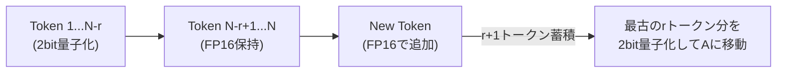
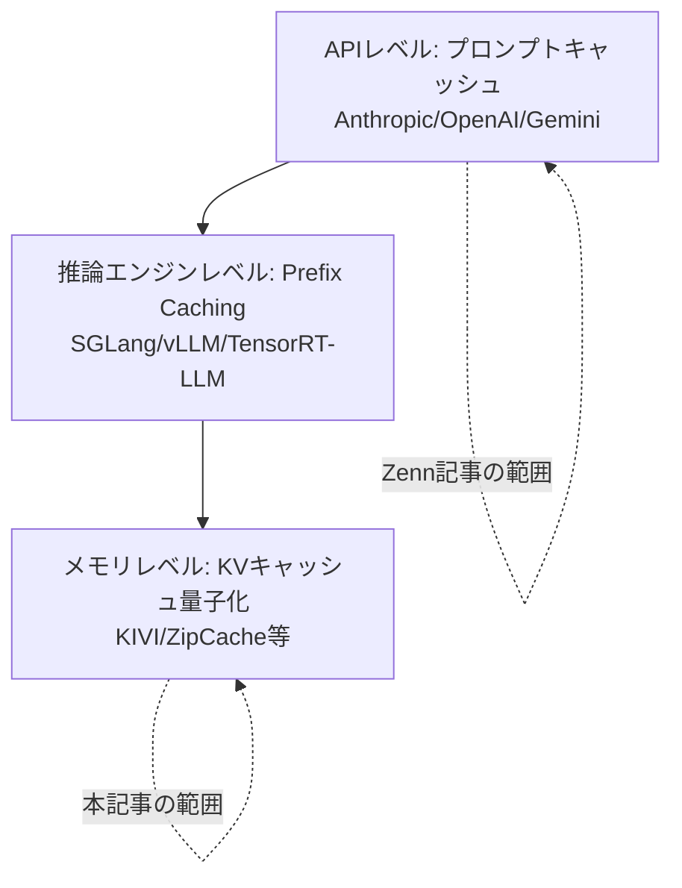

> 本記事は [ICML 2024 "KIVI: A Tuning-Free Asymmetric 2bit Quantization for KV Cache"](https://proceedings.mlr.press/v235/liu24bz.html) の解説記事です。論文の主張・実験結果は著者らによるものであり、本記事の著者が独自に実験を行ったものではありません。

## 論文概要（Abstract）

KIVIは、LLM推論時のKVキャッシュを2bitに量子化するチューニング不要の手法である。著者らの重要な発見は、KeyとValueでは最適な量子化軸が異なるという点である。Keyはチャネル（特徴量次元）単位、Valueはトークン単位での量子化が精度を保つ上で最適であることを実験的に示し、この**非対称量子化**アプローチにより、ピークメモリ使用量を2.6倍削減し、スループットを2.35〜3.47倍向上させたと報告している。Llama、Falcon、Mistralの各モデルで評価されている。

この記事は [Zenn記事: プロンプトキャッシュのヒット率を最大化する実装パターンと運用設計](https://zenn.dev/0h_n0/articles/d7e8a46ea2736d) の深掘りです。

## 情報源

- **会議名**: ICML 2024（41st International Conference on Machine Learning）
- **年**: 2024（July 21-27, 2024）
- **URL**: [https://proceedings.mlr.press/v235/liu24bz.html](https://proceedings.mlr.press/v235/liu24bz.html)
- **著者**: Zirui Liu, Jiayi Yuan, Hongye Jin, Shaochen Zhong, Zhaozhuo Xu, Vladimir Braverman, Beidi Chen, Xia Hu
- **Volume**: PMLR 235, pp. 32332-32344

## カンファレンス情報

ICMLは機械学習分野のトップカンファレンスの1つであり、採択率は通常25-30%程度である。KIVIはこのカンファレンスに採択されたことで、手法の新規性と実験的妥当性が査読者により評価されている。

## 技術的詳細（Technical Details）

### 問題設定: KVキャッシュのメモリボトルネック

LLMの推論では、生成されたすべてのトークンのKey-Value（KV）ペアをキャッシュとして保持する。KVキャッシュのメモリ消費量は以下の式で表される：

$$
M_{\text{KV}} = 2 \times L \times H \times d_h \times s \times b
$$

ここで、
- $L$: Transformerレイヤー数
- $H$: Attentionヘッド数
- $d_h$: ヘッドあたりの次元数
- $s$: シーケンス長
- $b$: バッチサイズ
- $2$: KeyとValueの2要素

例えば、Llama-2-13B（$L=40$, $H=40$, $d_h=128$）でシーケンス長4096、バッチサイズ32の場合：

$$
M_{\text{KV}} = 2 \times 40 \times 40 \times 128 \times 4096 \times 32 \times 2 \text{ bytes} \approx 53 \text{ GB}
$$

これはA100 80GBのメモリの66%以上を占め、モデルパラメータ自体のメモリ（FP16で約26GB）の約2倍に達する。

### Key-Valueの分布特性の違い

著者らの重要な観察は、KeyテンソルとValueテンソルで数値分布が根本的に異なるという点である：

**Keyの分布特性**:
- **チャネル方向に外れ値が集中**: 特定のチャネル（特徴量次元）に非常に大きな値が現れる
- チャネルごとの分散が大きく異なる
- トークン方向では比較的均一

**Valueの分布特性**:
- **トークン方向に外れ値が集中**: 特定のトークン位置に大きな値が現れる
- チャネル方向では比較的均一
- トークンごとの分散が大きく異なる

### 非対称量子化アルゴリズム

この分布の違いに基づき、著者らはKeyとValueで異なる量子化軸を使い分ける**非対称量子化**を提案している。

**Keyの量子化（チャネル単位）**:

各チャネル$c$に対して、量子化パラメータ（スケールとゼロポイント）を個別に計算する：

$$
\hat{K}_{:,c} = \text{clamp}\left(\left\lfloor \frac{K_{:,c} - z_c}{s_c} \right\rceil, 0, 2^n - 1\right)
$$

ここで、
- $K_{:,c}$: チャネル$c$の全トークンにわたるKey値
- $s_c$: チャネル$c$のスケール（$s_c = \frac{\max(K_{:,c}) - \min(K_{:,c})}{2^n - 1}$）
- $z_c$: チャネル$c$のゼロポイント（$z_c = \min(K_{:,c})$）
- $n$: 量子化ビット数（KIVI では $n=2$）

**Valueの量子化（トークン単位）**:

各トークン位置$t$に対して、量子化パラメータを個別に計算する：

$$
\hat{V}_{t,:} = \text{clamp}\left(\left\lfloor \frac{V_{t,:} - z_t}{s_t} \right\rceil, 0, 2^n - 1\right)
$$

ここで、
- $V_{t,:}$: トークン$t$の全チャネルにわたるValue値
- $s_t$, $z_t$: トークン$t$のスケールとゼロポイント

### 残余長（Residual Length）の導入

著者らは、直近のKVキャッシュ（最新の$r$トークン分）はFP16のまま保持し、それ以前の部分のみ2bit量子化する設計を採用している。



残余長$r$は著者らの実験で$r=128$が推奨されている。これにより：
- 直近のトークンはAttentionで重要度が高いためFP16精度を維持
- 古いトークンは2bit量子化によるメモリ削減効果を享受
- $r$トークンが蓄積されるたびにバッチ量子化を実行（オーバーヘッド最小化）

### 概念的な実装

```python
import torch
from dataclasses import dataclass


@dataclass
class KVIQuantizedCache:
    """KIVI方式の量子化KVキャッシュ

    Attributes:
        quantized_keys: 2bit量子化済みKey (チャネル単位)
        quantized_values: 2bit量子化済みValue (トークン単位)
        key_scales: Keyのチャネルごとスケール
        key_zeros: Keyのチャネルごとゼロポイント
        value_scales: Valueのトークンごとスケール
        value_zeros: Valueのトークンごとゼロポイント
        residual_keys: FP16残余Key (直近rトークン)
        residual_values: FP16残余Value (直近rトークン)
    """
    quantized_keys: torch.Tensor    # uint8 packed (2bit)
    quantized_values: torch.Tensor  # uint8 packed (2bit)
    key_scales: torch.Tensor        # float16, shape: (channels,)
    key_zeros: torch.Tensor         # float16, shape: (channels,)
    value_scales: torch.Tensor      # float16, shape: (tokens,)
    value_zeros: torch.Tensor       # float16, shape: (tokens,)
    residual_keys: torch.Tensor     # float16
    residual_values: torch.Tensor   # float16


def quantize_per_channel(tensor: torch.Tensor, n_bits: int = 2) -> tuple:
    """チャネル単位の非対称量子化（Key用）

    Args:
        tensor: 入力テンソル (tokens, channels)
        n_bits: 量子化ビット数

    Returns:
        (量子化テンソル, スケール, ゼロポイント)
    """
    max_val = 2**n_bits - 1
    # チャネルごとにmin/maxを計算
    ch_min = tensor.min(dim=0).values  # (channels,)
    ch_max = tensor.max(dim=0).values  # (channels,)

    scale = (ch_max - ch_min) / max_val
    scale = scale.clamp(min=1e-8)  # ゼロ除算防止
    zero_point = ch_min

    quantized = ((tensor - zero_point) / scale).round().clamp(0, max_val)
    return quantized.to(torch.uint8), scale, zero_point


def quantize_per_token(tensor: torch.Tensor, n_bits: int = 2) -> tuple:
    """トークン単位の非対称量子化（Value用）

    Args:
        tensor: 入力テンソル (tokens, channels)
        n_bits: 量子化ビット数

    Returns:
        (量子化テンソル, スケール, ゼロポイント)
    """
    max_val = 2**n_bits - 1
    # トークンごとにmin/maxを計算
    tok_min = tensor.min(dim=1).values  # (tokens,)
    tok_max = tensor.max(dim=1).values  # (tokens,)

    scale = (tok_max - tok_min) / max_val
    scale = scale.clamp(min=1e-8)
    zero_point = tok_min

    quantized = ((tensor - zero_point.unsqueeze(1)) / scale.unsqueeze(1))
    quantized = quantized.round().clamp(0, max_val)
    return quantized.to(torch.uint8), scale, zero_point
```

## 実装のポイント（Implementation）

KIVIの「チューニング不要」という特性は実務上の大きな利点である：

- **事前キャリブレーション不要**: 量子化パラメータ（スケール・ゼロポイント）はランタイムで動的に計算される。キャリブレーションデータセットの準備が不要
- **モデル再学習不要**: 既存の学習済みモデルにそのまま適用可能
- **残余長の設定**: $r=128$が推奨値。タスクの精度要件に応じて調整可能（大きいほど精度向上、メモリ削減効果は低下）
- **実装上の注意**: 2bitパッキング（4つの2bit値を1つのuint8に格納）の実装が必要。CUDAカーネルでの効率的なパッキング/アンパッキングが性能に影響

## 実験結果（Results）

### メモリ削減

著者らはLlama、Falcon、Mistralモデルで以下の結果を報告している（論文より）：

| メトリクス | FP16（ベースライン） | KIVI (2bit) | 改善率 |
|-----------|-------------------|-------------|--------|
| ピークメモリ | 1.0× | 0.38× | **2.6倍削減** |

### スループット向上

| モデル | FP16スループット | KIVI (2bit) | 向上率 |
|--------|----------------|-------------|--------|
| Llama-2-7B | 1.0× | 2.35× | 2.35倍 |
| Llama-2-13B | 1.0× | 3.47× | 3.47倍 |
| Falcon-7B | 1.0× | 2.8× | 2.8倍 |
| Mistral-7B | 1.0× | 3.1× | 3.1倍 |

モデルサイズが大きいほど（KVキャッシュの相対的なメモリ比率が高いほど）、スループット向上効果が大きいと著者らは報告している。

### 精度への影響

著者らの実験では、2bit量子化でもperplexityの劣化は限定的と報告されている：

- WikiText-2 perplexity: FP16比で0.1-0.3ポイント増（モデル依存）
- ダウンストリームタスク（MMLU等）: 精度低下1%未満

ただし、著者らは残余長$r=0$（全トークン量子化）の場合には精度劣化が顕著になることも報告しており、$r=128$の設定が重要であると述べている。

## Production Deployment Guide

### AWS実装パターン（コスト最適化重視）

KVキャッシュ量子化を本番環境で活用する場合のAWS構成を示す。

| 規模 | 月間リクエスト | 推奨構成 | 月額コスト概算 | 主要サービス |
|------|--------------|---------|-------------|------------|
| **Small** | ~3,000 | Serverless | $100-300 | Lambda + Bedrock |
| **Medium** | ~30,000 | Single GPU | $800-2,000 | EC2 g5.xlarge + ECS |
| **Large** | 300,000+ | Multi-GPU | $3,000-8,000 | EKS + g5.xlarge × 2-4 |

**KIVI量子化によるコスト削減効果**: KVキャッシュメモリが2.6倍削減されるため、同一GPUでより大きなバッチサイズやより長いシーケンスを処理可能。結果として、同等のスループットをより少ないGPUインスタンスで実現できる。

**コスト試算の注意事項**: 上記は2026年4月時点のAWS ap-northeast-1リージョン料金に基づく概算値です。最新料金は[AWS料金計算ツール](https://calculator.aws/)で確認してください。

### コスト最適化チェックリスト

- [ ] KVキャッシュ量子化: KIVI 2bit適用でGPUメモリ2.6倍効率化
- [ ] インスタンスサイズ: メモリ削減分だけ小さいGPUインスタンスに変更可能
- [ ] バッチサイズ: メモリ余裕を活かしてバッチサイズ増大→スループット向上
- [ ] Spot Instances: g5.xlarge、最大70%削減
- [ ] 残余長$r$: 精度要件に応じて128（推奨）〜256で調整
- [ ] CloudWatch: perplexity・精度メトリクスの継続監視
- [ ] Prompt Caching併用: KIVI + Anthropic/OpenAIプロンプトキャッシュの併用でさらにコスト削減

## 実運用への応用（Practical Applications）

KIVIのKVキャッシュ量子化は、Zenn記事で解説したプロンプトキャッシュとは**異なるレイヤー**で動作する最適化手法である。



**プロンプトキャッシュとKVキャッシュ量子化は併用可能**であり、相乗効果が期待される：
- プロンプトキャッシュ: 同一プレフィックスの**再計算を回避**（コスト削減）
- KVキャッシュ量子化: 保持するKVキャッシュの**メモリ消費を削減**（同一GPU上でのバッチサイズ増大）

**適用が効果的な場面**:
- 長文脈処理（KVキャッシュが大量のメモリを消費）
- 大バッチ推論（多数の同時リクエスト処理）
- GPU メモリが制約要因となっている環境

**注意が必要な場面**:
- 極めて高い精度が要求されるタスク（perplexity 0.1-0.3の劣化が許容できない場合）
- 短いシーケンス長（KVキャッシュのメモリ比率が小さく効果が薄い）

## 関連研究（Related Work）

- **ZipCache** (arXiv:2412.19261): Salientトークン識別によるKVキャッシュ量子化。KIVIの非対称アプローチとは異なり、トークンの重要度に基づく選択的量子化を採用
- **KVSharer** (arXiv:2504.00658): レイヤー間でのKVキャッシュ共有。量子化ではなく冗長性除去によるメモリ削減
- **KIVI + CacheBlend**: KIVIで量子化したKVキャッシュをCacheBlend方式で非プレフィックス再利用することも理論的には可能（ただし量子化誤差の累積に注意が必要）

## まとめと今後の展望

KIVIは「KeyとValueで最適な量子化軸が異なる」というシンプルだが重要な観察に基づき、チューニング不要の2bit KVキャッシュ量子化を実現している。著者らは2.6倍のメモリ削減と最大3.47倍のスループット向上を報告しており、既存のプロンプトキャッシュやprefix cachingと併用可能な点が実用的である。

KVキャッシュのメモリ効率化はLLMサービングの重要な研究分野であり、量子化・圧縮・エビクション・オフロードの各アプローチが相互補完的に発展している。

## 参考文献

- **Conference URL**: [https://proceedings.mlr.press/v235/liu24bz.html](https://proceedings.mlr.press/v235/liu24bz.html)
- **OpenReview**: [https://openreview.net/forum?id=L057s2Rq8O](https://openreview.net/forum?id=L057s2Rq8O)
- **Related Zenn article**: [https://zenn.dev/0h_n0/articles/d7e8a46ea2736d](https://zenn.dev/0h_n0/articles/d7e8a46ea2736d)
