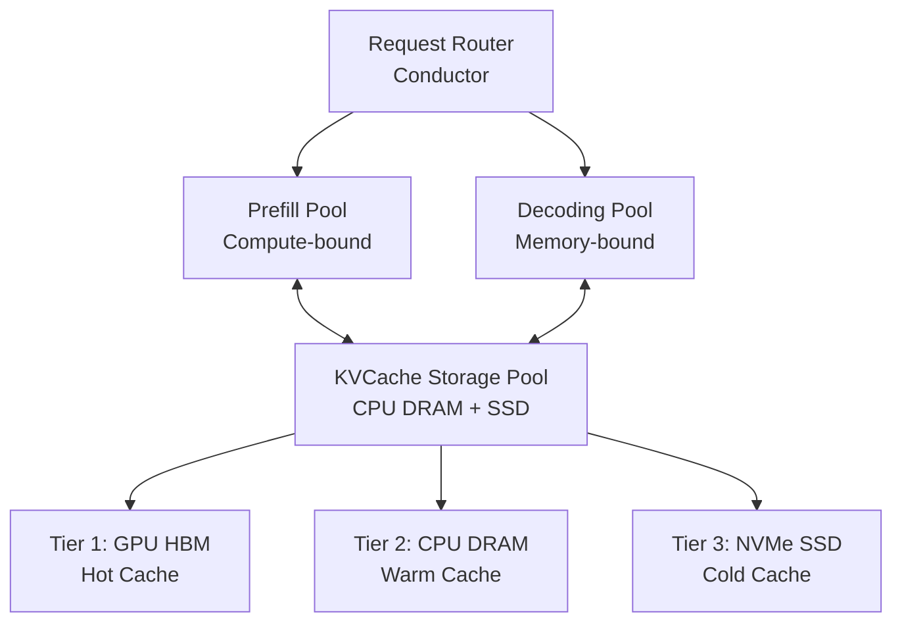

> 本記事は [arXiv:2411.09054 "Mooncake: A KVCache-centric Disaggregated Architecture for LLM Serving"](https://arxiv.org/abs/2411.09054) の解説記事です。論文の主張・実験結果は著者ら（Moonshot AI）によるものであり、本記事の著者が独自に実験を行ったものではありません。

## 論文概要（Abstract）

Mooncakeは、Moonshot AIが開発したチャットボットサービス「Kimi」の本番サービングプラットフォームである。KVキャッシュを「第一級市民」として扱う分離型アーキテクチャを採用し、PrefillクラスタとDecodingクラスタを分離する。GPUクラスタの未活用CPU DRAM・SSDリソースを活用した分散KVキャッシュストレージプールを実装し、キャッシュアウェアスケジューラ「Conductor」によりスループットの最大化とSLO達成を両立する。著者らは、高負荷条件下でvLLM比525%のスループット向上を報告している。

この記事は [Zenn記事: プロンプトキャッシュのヒット率を最大化する実装パターンと運用設計](https://zenn.dev/0h_n0/articles/d7e8a46ea2736d) の深掘りです。

## 情報源

- **arXiv ID**: 2411.09054
- **URL**: [https://arxiv.org/abs/2411.09054](https://arxiv.org/abs/2411.09054)
- **著者**: Ruoyu Qin, Zhuomin He, Pengjie Hu, Wenyuan Yu, Xinran Xu et al.
- **所属**: Moonshot AI
- **発表年**: 2024
- **分野**: cs.DC, cs.LG

## 背景と動機（Background & Motivation）

Kimi（Moonshot AI）は2024年時点で以下の特性を持つワークロードを処理している：

- 数億件の会話を処理
- 全会話の40%が32Kトークン超の長文脈
- 一部の会話は1Mトークン超

このスケールでLLMサービングが直面する3つの課題を著者らは指摘している：

1. **フェーズ間の計算特性の非対称性**: Prefillはコンピュートバウンド（高並列GEMM演算）、Decodingはメモリバウンド（逐次トークン生成）。最適なハードウェアリソースとスケジューリング戦略が異なる
2. **KVキャッシュのメモリ管理**: GPU HBMへのKVキャッシュ常駐はコスト大、オフロードはレイテンシ増
3. **長文脈リクエストのメモリ圧迫**: 長文脈リクエストがGPUメモリを占有し、バッチサイズを制限する

## 主要な貢献（Key Contributions）

- **貢献1**: KVキャッシュを主要管理リソースとする分離型アーキテクチャ（Prefill/Decodingクラスタ分離）
- **貢献2**: CPU DRAM・SSDを活用した3階層分散KVキャッシュストレージプール
- **貢献3**: キャッシュアウェア・SLO駆動型スケジューラ「Conductor」
- **貢献4**: Kimiでの本番デプロイによる実世界規模での検証

## 技術的詳細（Technical Details）

### 分離型アーキテクチャ

Mooncakeは推論インフラを3つの独立クラスタに分離する：



**Prefill Pool**: Prefillステージ専用GPU群。入力プロンプト全体を並列処理し、KVキャッシュを生成する。コンピュートインテンシブな操作に最適化。

**Decoding Pool**: Decodingステージ専用GPU群。トークンを1つずつ逐次生成する。メモリバウンド操作に最適化。

**KVCache Storage Pool**: GPUクラスタ全体の未活用CPU DRAM・NVMe SSDを活用した分散ストレージ。

### 3階層KVキャッシュストレージ

著者らは、GPUサーバのCPU DRAM（通常256GB〜2TB）やNVMe SSD容量が、LLMワークロード実行時にほとんど使われていないことに着目した。

| 階層 | ストレージ | 用途 | レイテンシ |
|------|-----------|------|-----------|
| Tier 1 | GPU HBM | 実行中リクエストのホットKVキャッシュ | ナノ秒オーダー |
| Tier 2 | CPU DRAM | キュー内リクエスト用ウォームKVキャッシュ | マイクロ秒オーダー |
| Tier 3 | NVMe SSD | 頻繁アクセスされるプレフィックスのコールドKVキャッシュ | ミリ秒オーダー |

階層間のデータ移動はアクセスパターンと空き容量に基づいて自動管理される。

### Conductor: キャッシュアウェアスケジューラ

ConductorはMooncakeのスケジューリングコンポーネントで、2つの目標を最適化する：

**1. KVキャッシュ再利用の最大化（Prefill向け）**

Conductorはグローバルなプレフィックスツリー（trie）を維持し、キャッシュ済みトークン列とストレージ位置をマッピングしている。新規リクエスト到着時に以下のステップで処理する：

1. プレフィックスツリーで最長一致プレフィックスを検索
2. 一致したKVキャッシュが存在する（または近い）Prefillノードにルーティング
3. 不足分のみ再計算

これにより、システムプロンプト・マルチターン会話・類似プレフィックスの横断的な再利用が実現される。

**2. SLO達成の最大化（Decoding向け）**

予測モデルにより以下を推定し、SLO達成可能性が最も高いDecodingノードにルーティングする：
- 各Decodingノードの期待キュー長
- TBT（Time-Between-Tokens）予測値
- SLO実現可能性

### KVキャッシュ転送メカニズム

Prefillノードで生成されたKVキャッシュをDecodingノードに転送する際、RDMAベースの高速転送を使用する：

- **RDMA (Remote Direct Memory Access)**: InfiniBandおよびRoCE（RDMA over Converged Ethernet）両対応
- **ゼロコピー転送**: GPU HBM間でCPUを介さず直接転送
- **パイプライン実行**: 転送と計算をオーバーラップさせてレイテンシを隠蔽

### エビクションポリシー

KVキャッシュのエビクションは以下の要素を考慮する：

- **LRU（基本方針）**: 最も最近未使用のエントリを優先エビクト
- **アクセス頻度**: 頻繁にアクセスされるエントリ（例：共通システムプロンプト）は長期保持
- **リクエストキュー先読み**: 待機中のリクエストを分析し、将来のキャッシュアクセスパターンを予測

## 実装のポイント（Implementation）

**技術スタック**:
- PyTorch / CUDA（GPU計算）
- vLLMとの互換性（テンソル並列実行）
- gRPC（ノード間通信）
- RDMAライブラリ（高性能KVキャッシュ転送）
- 非同期I/O（CPU DRAM・SSDからのKVキャッシュロード）

**本番デプロイ規模**（Kimi）:
- 数千GPUノード
- オンライン（チャットボット）+ オフライン（バッチAPI）混在
- 最大1Mトークンのコンテキスト長

**オンライン/オフライン混在デプロイ**: オンラインリクエストが優先キューで処理され、オフラインリクエストは余剰リソースを利用する。比率は需要に応じて動的に調整される。

## Production Deployment Guide

### AWS実装パターン（コスト最適化重視）

Mooncakeの分離型アーキテクチャをAWS上で実現する場合の構成を示す。

| 規模 | 月間リクエスト | 推奨構成 | 月額コスト概算 | 主要サービス |
|------|--------------|---------|-------------|------------|
| **Small** | ~3,000 | Single Node | $800-2,000 | EC2 g5.2xlarge + EBS |
| **Medium** | ~30,000 | Disaggregated | $3,000-8,000 | ECS(Prefill) + ECS(Decode) + ElastiCache |
| **Large** | 300,000+ | Full Cluster | $15,000-40,000 | EKS + p4d/p5 + Karpenter + S3 + EFS |

**Large構成の詳細**（Mooncakeアーキテクチャのフル再現）:
- **Prefill Pool**: p4d.24xlarge × 2-4台（8×A100 40GB、Spot $13,000/月→Spot割引で$4,000/月）
- **Decoding Pool**: g5.12xlarge × 4-8台（4×A10G、Spot割引適用）
- **KVCache Storage**: ElastiCache Redis Cluster (r7g.xlarge × 3ノード) + S3 Intelligent-Tiering
- **ネットワーク**: EFA（Elastic Fabric Adapter）によるRDMA相当の高速通信
- **Karpenter**: GPU自動スケーリング、アイドル時スケールダウン

**コスト試算の注意事項**: 上記は2026年4月時点のAWS ap-northeast-1リージョン料金に基づく概算値です。GPU Spot Instancesの割引率は変動します。最新料金は[AWS料金計算ツール](https://calculator.aws/)で確認してください。

### Terraformインフラコード

```hcl
# Mooncake風 Prefill/Decoding分離構成
module "eks" {
  source  = "terraform-aws-modules/eks/aws"
  version = "~> 20.0"

  cluster_name    = "mooncake-llm-serving"
  cluster_version = "1.31"
  vpc_id          = module.vpc.vpc_id
  subnet_ids      = module.vpc.private_subnets

  cluster_endpoint_public_access = true
  enable_cluster_creator_admin_permissions = true
}

# Prefill Pool: 高コンピュート GPU ノード
resource "kubectl_manifest" "prefill_nodepool" {
  yaml_body = <<-YAML
    apiVersion: karpenter.sh/v1
    kind: NodePool
    metadata:
      name: prefill-pool
    spec:
      template:
        spec:
          requirements:
            - key: karpenter.sh/capacity-type
              operator: In
              values: ["spot"]
            - key: node.kubernetes.io/instance-type
              operator: In
              values: ["p4d.24xlarge", "g5.48xlarge"]
          taints:
            - key: "workload-type"
              value: "prefill"
              effect: NoSchedule
      limits:
        nvidia.com/gpu: "32"
  YAML
}

# Decoding Pool: メモリ最適化 GPU ノード
resource "kubectl_manifest" "decoding_nodepool" {
  yaml_body = <<-YAML
    apiVersion: karpenter.sh/v1
    kind: NodePool
    metadata:
      name: decoding-pool
    spec:
      template:
        spec:
          requirements:
            - key: karpenter.sh/capacity-type
              operator: In
              values: ["spot", "on-demand"]
            - key: node.kubernetes.io/instance-type
              operator: In
              values: ["g5.xlarge", "g5.2xlarge"]
      limits:
        nvidia.com/gpu: "16"
      disruption:
        consolidationPolicy: WhenEmptyOrUnderutilized
        consolidateAfter: 120s
  YAML
}

# KVCache Storage: ElastiCache Redis Cluster
resource "aws_elasticache_replication_group" "kv_cache_pool" {
  replication_group_id = "kvcache-pool"
  description          = "Distributed KVCache Storage Pool (Tier 2)"
  node_type            = "cache.r7g.xlarge"
  num_cache_clusters   = 3
  engine               = "redis"
  engine_version       = "7.1"

  at_rest_encryption_enabled = true
  transit_encryption_enabled = true
}
```

### コスト最適化チェックリスト

- [ ] Prefill Pool: Spot Instances優先（p4d.24xlarge、最大60%削減）
- [ ] Decoding Pool: On-DemandとSpotの混在（SLO重要度に応じて）
- [ ] KVCache Storage: ElastiCache Reserved Nodesで最大55%割引
- [ ] EFA: Prefill→Decoding間の高速KVキャッシュ転送
- [ ] Karpenter: アイドルタイム120秒でDecoding Poolスケールダウン
- [ ] S3 Intelligent-Tiering: Cold KVキャッシュの自動階層化
- [ ] CloudWatch: TTFT・TBT・キャッシュヒット率の継続監視
- [ ] AWS Budgets: 月額予算設定（80%で警告、100%でアラート）

## 実験結果（Results）

### スループット比較

著者らはマルチノードGPUクラスタ（RDMA接続）で以下の結果を報告している：

| 条件 | Mooncake vs vLLM |
|---|---|
| 高負荷（Overload） | **+525%** スループット |
| 通常条件 | 理論最大値の**75.9%**を達成（SLO維持） |

### レイテンシ指標

- **TTFT（Time-To-First-Token）**: 冗長Prefill計算の回避により削減
- **TBT（Time-Between-Tokens）**: SLOアウェアDecodingスケジューリングでSLO範囲内維持
- **P99レイテンシ**: 高負荷下でベースライン比改善

### 長文脈での優位性

著者らによると：
- プレフィックスキャッシュの有効性はコンテキスト長とともに増大
- RDMA転送の恩恵は大きいKVキャッシュサイズ（長文脈）ほど顕著
- SSDオフロードによりGPUメモリ超過リクエストも処理可能

## 実運用への応用（Practical Applications）

Mooncakeのアーキテクチャは、Zenn記事で解説したプロンプトキャッシュの概念を**インフラストラクチャレベル**で実装したものと捉えることができる。

**Zenn記事との関連**:
- Zenn記事で述べた「静的コンテンツを先頭に、動的コンテンツを末尾に」の原則は、MooncakeのConductorスケジューラがプレフィックスツリーで自動的に最適化する
- TTLの設定（Zenn記事の「5分」「1時間」の選択）は、Mooncakeの3階層ストレージの自動階層間移動で代替される

**制約と注意事項**:
- RDMA対応ネットワークが必要（一般的なクラウド環境では利用できない場合がある）
- 分離型アーキテクチャはモノリシック構成と比較して運用複雑性が増す
- Kimiの特性（長文脈・プレフィックス共有が多い）に最適化されており、他ワークロードでの効果は異なる可能性がある

## 関連研究（Related Work）

- **vLLM** (Kwon et al., SOSP 2023): PagedAttentionによる単一ノード内KVキャッシュ管理。Mooncakeは複数ノード分散KVキャッシュプールへ拡張
- **Splitwise** (Patel et al., 2023): Prefill/Decoding分離の先行研究。Mooncakeは本番規模での実証と分散KVキャッシュプール統合が差別化
- **DistServe** (Zhong et al., 2024): 同様の分離型アプローチ。MooncakeはKimiの大規模ワークロードでの本番実証が追加
- **SGLang** (Zheng et al., 2024): RadixAttentionベースのprefix caching。Mooncakeはクラスタレベルでのキャッシュアウェアルーティングを追加

## まとめと今後の展望

Mooncakeは、KVキャッシュを「第一級市民」として設計の中心に据えることで、LLMサービングのスループットを大幅に向上させている。Prefill/Decoding分離、3階層KVキャッシュストレージ、Conductorスケジューラの3要素が統合的に機能し、著者らはvLLM比525%のスループット向上を報告している。

Kimiでの数億件の会話処理という本番実績は、このアーキテクチャの実用性を強く支持するものである。ただし、RDMA依存性や運用複雑性は、小規模環境への適用における障壁となりうる。

## 参考文献

- **arXiv**: [https://arxiv.org/abs/2411.09054](https://arxiv.org/abs/2411.09054)
- **vLLM**: [https://arxiv.org/abs/2309.06180](https://arxiv.org/abs/2309.06180)
- **Related Zenn article**: [https://zenn.dev/0h_n0/articles/d7e8a46ea2736d](https://zenn.dev/0h_n0/articles/d7e8a46ea2736d)
