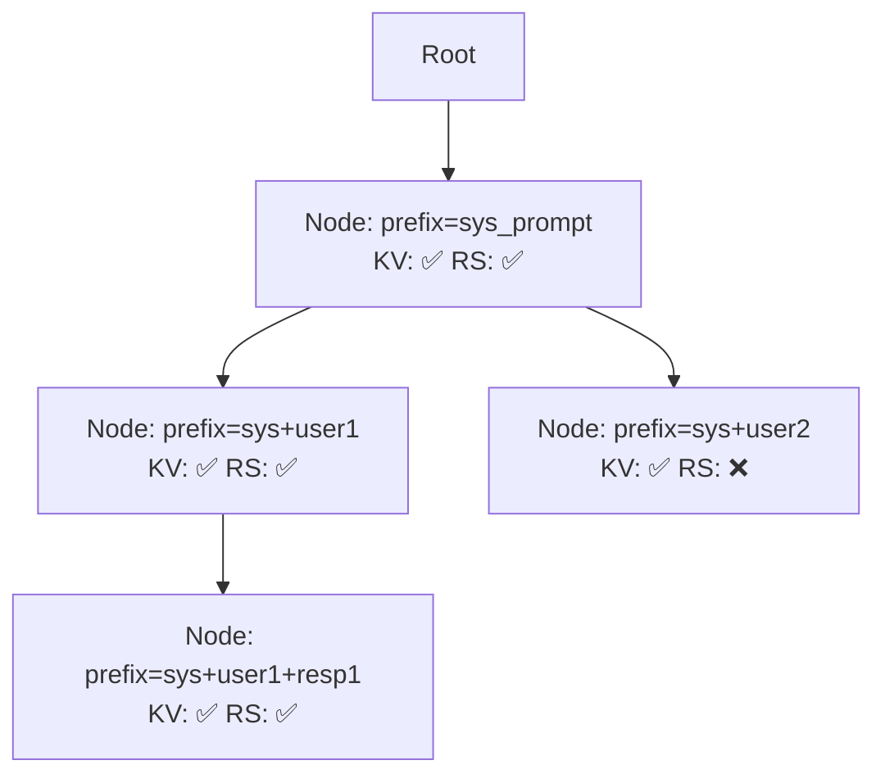

> 本記事は [arXiv:2411.19708 "Marconi: Prefix Caching for the Era of Hybrid LLMs"](https://arxiv.org/abs/2411.19708) の解説記事です。論文の主張・実験結果は著者らによるものであり、本記事の著者が独自に実験を行ったものではありません。

## 論文概要（Abstract）

Marconiは、Attention層とSSM（State Space Model）層を混在させたハイブリッドLLMのためのprefix cachingシステムである。著者らは、ハイブリッドモデルにおけるKVキャッシュとrecurrent stateキャッシュの根本的な性質の違いに着目し、両キャッシュを統合管理する新しいアーキテクチャを提案している。SGLangおよびvLLMとの比較で、マルチターン会話タスクにおいて最大34.4倍のスループット向上と84.1%のTTFT削減を報告している。

この記事は [Zenn記事: プロンプトキャッシュのヒット率を最大化する実装パターンと運用設計](https://zenn.dev/0h_n0/articles/d7e8a46ea2736d) の深掘りです。

## 情報源

- **arXiv ID**: 2411.19708
- **URL**: [https://arxiv.org/abs/2411.19708](https://arxiv.org/abs/2411.19708)
- **著者**: Rui Pan, Zhuang Wang, Zhen Jia, Can Karakus, Luca Zancato, Tri Dao et al.
- **発表年**: 2024
- **分野**: cs.LG, cs.AI

## 背景と動機（Background & Motivation）

Attention-onlyモデル（GPT、Llama等）では、KVキャッシュは**入力非依存**かつ**合成可能（composable）**である。短いプレフィックスPのKVキャッシュは、より長いプレフィックスP'（P' ⊃ P）のKVキャッシュの部分集合として再利用できる。SGLangやvLLMのprefix cachingはこの性質を前提として設計されている。

一方、Mamba等のSSMレイヤーを持つハイブリッドモデルでは、SSMの隠れ状態（recurrent state）は以下の3つの性質を持つ：

1. **入力依存（input-dependent）**: 同じ位置のトークンでも、それ以前の全トークンによって値が変わる
2. **固定サイズ（fixed-size）**: プレフィックス長に関わらず常に一定（Mamba2で約1MB/レイヤー）
3. **非合成的（non-composable）**: 短いプレフィックスPのrecurrent stateから、長いプレフィックスP'のrecurrent stateを再構成できない

著者らは、既存のprefix cachingシステムをハイブリッドモデルにnaiveに適用すると、recurrent stateを合成可能と誤って扱い、不正確なキャッシュ状態を使用するか、キャッシュヒットの機会を逃すと指摘している。

## 主要な貢献（Key Contributions）

- **貢献1**: KVキャッシュとrecurrent stateの再計算コストの非対称性を考慮した新しいヒットメトリックの提案
- **貢献2**: 長さインデックス付きRadix Treeによる効率的なキャッシュ検索データ構造
- **貢献3**: Recurrent stateの高価値性を反映したスマートエビクションポリシー

## 技術的詳細（Technical Details）

### 新しいヒットメトリック（Hit Value Metric）

従来のprefix cachingでは「キャッシュヒットの長さを最大化」するだけだった。しかしハイブリッドモデルでは、ヒット長の最大化と計算コストの最小化が等価ではない。

プロンプト長$L$、候補ヒット位置$H$に対する処理コストを著者らは以下のように定式化している：

$$
C(H) = (L - H) \cdot c_{\text{KV}} + \begin{cases} (L - H) \cdot c_{\text{SSM}} & \text{if recurrent state at } H \text{ is cached} \\ L \cdot c_{\text{SSM}} & \text{otherwise} \end{cases}
$$

ここで、
- $L$: プロンプト全体のトークン数
- $H$: キャッシュヒット位置（プレフィックス長）
- $c_{\text{KV}}$: Attentionレイヤー1トークンあたりの計算コスト
- $c_{\text{SSM}}$: SSMレイヤー1トークンあたりの計算コスト

recurrent stateがヒット位置$H$にキャッシュされていない場合、SSMレイヤーは全$L$トークンを最初から再処理する必要がある。これがKVキャッシュとの根本的な違いである。

ヒット価値（hit value）は、キャッシュ未使用時$C(0)$との差分として定義される：

$$
\text{value}(H) = C(0) - C(H) = H \cdot c_{\text{KV}} + \begin{cases} H \cdot c_{\text{SSM}} & \text{if recurrent state cached at } H \\ 0 & \text{otherwise} \end{cases}
$$

この定式化の実践的な意味は重要である。例えば、位置$H_1$にrecurrent state付きキャッシュが存在し、$H_2 > H_1$にKVキャッシュのみが存在する場合、recurrent stateの節約コストがKV再計算の追加コストを上回れば、Marconiはより短い$H_1$を選択する。

### 長さインデックス付きRadix Tree

SGLangが使用するRadix Treeを拡張し、各ノードがKVキャッシュだけでなく**recurrent stateの有無とプレフィックス長**も保持する構造を導入している。



ルックアップ手順：
1. リクエストのプレフィックスでツリーを走査し、すべての候補ヒット位置を収集
2. 各候補に対してhit valueメトリックを計算
3. 最長マッチだけでなく、recurrent state付きの短いヒットとも比較
4. value(H)を最大化するHを選択

時間計算量はプレフィックス長$L$に対して$O(L)$と著者らは報告している。

### スマートエビクションポリシー

Recurrent stateは固定サイズ（保持コストが低い）かつ再計算コストが高い（全トークンの再処理が必要）。この非対称性を反映したエビクションスコアを著者らは以下のように設計している：

$$
\text{score}(E) = \frac{\text{LRU\_rank}(E)}{1 + \lambda \cdot \mathbb{1}[\text{has\_recurrent\_state}(E)]}
$$

ここで、
- $\text{LRU\_rank}(E)$: エントリ$E$のLRU順位（小さい＝最近使用）
- $\lambda$: recurrent stateの「粘着性」を制御するハイパーパラメータ
- $\mathbb{1}[\cdot]$: 指示関数

スコアが最高のエントリ（最も使用頻度が低く、recurrent stateを持たない）から優先的にエビクトされる。著者らの感度分析によると、$\lambda \in [1, 10]$の範囲で性能は安定しており、$\lambda = 3$付近でピークと報告されている。

recurrent stateエントリがエビクトされた場合、依存するKVキャッシュエントリもすべてエビクトされる（recurrent stateなしではKVだけでは正しく推論できないため）。

## 実装のポイント（Implementation）

著者らはSGLang上に約800行のPython/C++コードを追加してMarconiを実装している。

実装上の注意点：
- **チェックポイント配置**: 各処理セグメントの終端にrecurrent stateのチェックポイントを保存。1回のprefill処理ではフルプレフィックス長末尾に1チェックポイント
- **ストレージ**: KVキャッシュはGPUメモリ、recurrent stateはGPUメモリまたはCPU DRAMへオフロード可能（非同期転送で計算とオーバーラップ）
- **ページドメモリ統合**: SGLangのページドメモリ管理と統合し、KVページとrecurrent stateエントリをRadix Treeで追跡

```python
# Marconiのヒット位置選択の概念的な実装
from dataclasses import dataclass


@dataclass
class CacheEntry:
    """キャッシュエントリの表現"""
    prefix_length: int
    has_kv: bool
    has_recurrent_state: bool
    lru_rank: int


def select_optimal_hit(
    candidates: list[CacheEntry],
    prompt_length: int,
    cost_kv: float,
    cost_ssm: float,
) -> CacheEntry | None:
    """ヒット価値メトリックに基づく最適ヒット位置の選択

    Args:
        candidates: キャッシュ候補エントリのリスト
        prompt_length: リクエストのプロンプト長
        cost_kv: Attentionレイヤーのトークンあたり計算コスト
        cost_ssm: SSMレイヤーのトークンあたり計算コスト

    Returns:
        最適なキャッシュエントリ、またはヒットなしの場合None
    """
    best_entry = None
    best_value = 0.0

    for entry in candidates:
        h = entry.prefix_length
        # KVキャッシュの節約は常にH * cost_kv
        kv_savings = h * cost_kv
        # Recurrent stateがキャッシュされている場合のみSSM節約
        ssm_savings = h * cost_ssm if entry.has_recurrent_state else 0.0

        value = kv_savings + ssm_savings

        if value > best_value:
            best_value = value
            best_entry = entry

    return best_entry
```

## Production Deployment Guide

### AWS実装パターン（コスト最適化重視）

Marconiのようなハイブリッドモデル向けprefix cachingを本番環境にデプロイする場合のAWS構成を示す。

**トラフィック量別の推奨構成**:

| 規模 | 月間リクエスト | 推奨構成 | 月額コスト概算 | 主要サービス |
|------|--------------|---------|-------------|------------|
| **Small** | ~3,000 (100/日) | Serverless | $150-400 | Lambda + Bedrock + DynamoDB |
| **Medium** | ~30,000 (1,000/日) | Hybrid | $800-2,000 | ECS Fargate + ElastiCache |
| **Large** | 300,000+ (10,000/日) | Container | $3,000-8,000 | EKS + GPU Instances + Karpenter |

**Small構成の詳細** (月額$150-400):
- **Lambda**: イベント処理・API Gateway統合 ($30/月)
- **Bedrock**: Claude 3.5 Haiku、Prompt Caching有効 ($200/月)
- **DynamoDB**: On-Demand、KVキャッシュメタデータ管理 ($15/月)
- **CloudWatch**: 基本監視 ($10/月)

**Large構成の詳細** (月額$3,000-8,000):
- **EKS**: コントロールプレーン ($72/月)
- **EC2 GPU**: g5.xlarge × 2-4台、Spot Instances ($1,500/月、Spot割引適用)
- **Karpenter**: GPU自動スケーリング (追加コストなし)
- **S3**: KVキャッシュオフロードストレージ ($30/月)
- **ElastiCache Redis**: プレフィックスマッチング用 ($50/月)

**コスト試算の注意事項**: 上記は2026年4月時点のAWS ap-northeast-1リージョン料金に基づく概算値です。実際のコストはトラフィックパターンやバースト使用量により変動します。最新料金は[AWS料金計算ツール](https://calculator.aws/)で確認してください。

### Terraformインフラコード

**Large構成 (EKS + GPU Instances)**:

```hcl
module "eks" {
  source  = "terraform-aws-modules/eks/aws"
  version = "~> 20.0"

  cluster_name    = "hybrid-llm-serving"
  cluster_version = "1.31"

  vpc_id     = module.vpc.vpc_id
  subnet_ids = module.vpc.private_subnets

  cluster_endpoint_public_access = true
  enable_cluster_creator_admin_permissions = true
}

resource "kubectl_manifest" "karpenter_gpu_provisioner" {
  yaml_body = <<-YAML
    apiVersion: karpenter.sh/v1
    kind: NodePool
    metadata:
      name: gpu-spot-pool
    spec:
      template:
        spec:
          requirements:
            - key: karpenter.sh/capacity-type
              operator: In
              values: ["spot"]
            - key: node.kubernetes.io/instance-type
              operator: In
              values: ["g5.xlarge", "g5.2xlarge"]
          nodeClassRef:
            group: karpenter.k8s.aws
            kind: EC2NodeClass
            name: default
      limits:
        cpu: "32"
        memory: "128Gi"
        nvidia.com/gpu: "8"
      disruption:
        consolidationPolicy: WhenEmptyOrUnderutilized
        consolidateAfter: 60s
  YAML
}

resource "aws_dynamodb_table" "prefix_cache_metadata" {
  name         = "prefix-cache-metadata"
  billing_mode = "PAY_PER_REQUEST"
  hash_key     = "prefix_hash"

  attribute {
    name = "prefix_hash"
    type = "S"
  }

  ttl {
    attribute_name = "expire_at"
    enabled        = true
  }
}
```

### 運用・監視設定

**CloudWatch Logs Insightsクエリ（キャッシュヒット率監視）**:

```sql
fields @timestamp, cache_hit_rate, recurrent_state_hit_rate, ttft_ms
| stats avg(cache_hit_rate) as avg_hit_rate,
        avg(recurrent_state_hit_rate) as avg_rs_hit_rate,
        pct(ttft_ms, 95) as p95_ttft
  by bin(5m)
| filter avg_hit_rate < 0.5
```

### コスト最適化チェックリスト

- [ ] GPU: Spot Instances優先（g5.xlarge、最大70%削減）
- [ ] Recurrent stateキャッシュ: CPU DRAMへのオフロード（GPU HBMコスト削減）
- [ ] Bedrock Batch API: 非リアルタイム処理に50%割引活用
- [ ] Prompt Caching有効化: Anthropic APIで最大90%入力トークンコスト削減
- [ ] Karpenter: アイドルタイム60秒でスケールダウン
- [ ] AWS Budgets: 月額予算設定（80%で警告）
- [ ] CloudWatch: キャッシュヒット率低下アラート設定

## 実験結果（Results）

### マルチターン会話タスク

著者らはNVIDIA A100 80GB（シングルGPU）上で以下の結果を報告している（論文Table 1より）：

| モデル | 比較対象 | スループット向上 | TTFT削減 |
|--------|----------|----------------|-----------|
| Zamba2-2.7B | SGLang | 34.4倍 | 84.1% |
| Zamba2-2.7B | vLLM | 23.1倍 | — |
| Llama-based Mamba2 | SGLang | 12.7倍 | 71.3% |

### Document QAタスク

| モデル | 比較対象 | スループット向上 | TTFT削減 |
|--------|----------|----------------|-----------|
| Zamba2-2.7B | SGLang | 18.2倍 | 76.4% |

### キャッシュヒット率分析

Recurrent stateのヒット率において、Marconiは78.3%を達成した一方、SGLangは0%であった（recurrent stateキャッシングを処理しないため）。

### アブレーション実験

著者らのアブレーション実験では、以下の各コンポーネントの寄与が報告されている：
- **ヒットメトリック**: 標準最長プレフィックスメトリック比で8-15%のスループット改善
- **エビクションポリシー**: 標準LRU比でメモリ圧迫下12-20%のスループット改善
- **$\lambda$感度**: $\lambda \in [1, 10]$で安定、$\lambda = 3$付近でピーク

## 実運用への応用（Practical Applications）

Marconiの手法は、Zenn記事で解説したプロンプトキャッシュの「静的プレフィックス分離パターン」を、ハイブリッドモデルに拡張するものである。

**実務での適用場面**:
- Mamba系ハイブリッドモデルをマルチターンチャットボットとしてデプロイする場合
- Document QAシステムで同一ドキュメントに対する複数クエリを処理する場合
- SGLangベースの推論スタックにおけるハイブリッドモデル対応

**制約と注意事項**:
- 著者らはシングルGPUでの評価のみを実施。マルチGPU（テンソル並列）環境では追加の考慮が必要
- デコードフェーズの最適化は論文の範囲外
- 対応モデルはZamba2-2.7BとLlama-based Mamba2の2種類に限定

## 関連研究（Related Work）

- **SGLang** (Zheng et al., 2024): Radix Treeベースのprefix cachingの基盤システム。Marconiはこの上に約800行を追加して構築
- **vLLM** (Kwon et al., SOSP 2023): PagedAttentionによるメモリ管理。prefix cachingをサポートするが、ハイブリッドモデルのrecurrent stateは非対応
- **Mamba/Mamba2** (Gu & Dao, 2023; Dao & Gu, ICML 2024): SSMの基礎アーキテクチャ。線形時間推論を可能にしたが、キャッシュ管理の複雑性を生んだ

## まとめと今後の展望

Marconiは、ハイブリッドLLMにおけるprefix cachingの根本問題（KVキャッシュとrecurrent stateの性質の違い）を、3つの設計要素（新ヒットメトリック・Radix Tree拡張・スマートエビクション）で解決するシステムである。著者らは最大34.4倍のスループット向上を報告しているが、マルチGPU環境やデコードフェーズの最適化は今後の課題として残されている。

Attention-onlyモデルからハイブリッドモデルへの移行が進む中、キャッシュ管理のパラダイムも変化が必要であることを本論文は示唆している。

## 参考文献

- **arXiv**: [https://arxiv.org/abs/2411.19708](https://arxiv.org/abs/2411.19708)
- **SGLang**: [https://arxiv.org/abs/2312.03241](https://arxiv.org/abs/2312.03241)
- **vLLM (PagedAttention)**: [https://arxiv.org/abs/2309.06180](https://arxiv.org/abs/2309.06180)
- **Related Zenn article**: [https://zenn.dev/0h_n0/articles/d7e8a46ea2736d](https://zenn.dev/0h_n0/articles/d7e8a46ea2736d)
