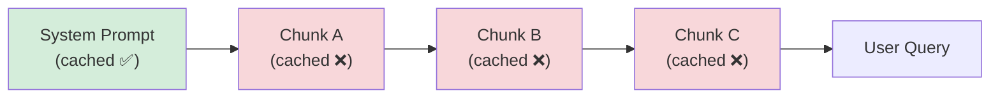

> 本記事は [arXiv:2412.08734 "CacheBlend: Fast Large Language Model Serving for RAG with Cached Knowledge Fusion"](https://arxiv.org/abs/2412.08734) の解説記事です。論文の主張・実験結果は著者らによるものであり、本記事の著者が独自に実験を行ったものではありません。本論文はEuroSys 2025に採択されている。

## 論文概要（Abstract）

CacheBlendは、RAG（Retrieval-Augmented Generation）ワークロードにおいて、プレフィックスが一致しないテキストチャンクのKVキャッシュを再利用するシステムである。従来のprefix cachingは先頭部分が一致するリクエストのみキャッシュヒットするが、RAGでは複数チャンクの組み合わせがクエリごとに変化するため、キャッシュ効率が低い。著者らは、キャッシュ済みKVとフルコンテキスト下のKVの差分が小さいという経験的観察を利用し、一部のトークンのみ選択的に再計算する手法を提案している。

この記事は [Zenn記事: プロンプトキャッシュのヒット率を最大化する実装パターンと運用設計](https://zenn.dev/0h_n0/articles/d7e8a46ea2736d) の深掘りです。

## 情報源

- **arXiv ID**: 2412.08734
- **URL**: [https://arxiv.org/abs/2412.08734](https://arxiv.org/abs/2412.08734)
- **著者**: Jiayi Yao, Hanchen Li, Yuhan Liu, Siddhant Ray, Yihua Cheng et al.
- **所属**: University of Chicago
- **発表年**: 2024（EuroSys 2025採択）
- **分野**: cs.LG, cs.IR

## 背景と動機（Background & Motivation）

RAGパイプラインでは、プロンプトが「システムプロンプト＋複数の取得チャンク＋ユーザークエリ」で構成される。チャンクの組み合わせはクエリごとに変わるため、従来のprefix-only KVキャッシュでは最初のチャンク（プレフィックス部分）しかキャッシュヒットしない。

著者らのデータによると、4チャンクRAG構成でKVキャッシュなしの場合、prefill時間がTTFT全体の約80%を占める。チャンク数が増えるほどこの問題は悪化する。



従来のprefix cachingでは、System Promptのみがキャッシュヒットし、Chunk A/B/Cは毎回再計算される。CacheBlendは、各チャンクを単独で事前計算したKVキャッシュを再利用することでこの問題を解決する。

## 主要な貢献（Key Contributions）

- **貢献1**: プレフィックスが一致しない任意のテキストチャンクのKVキャッシュを再利用できる初のシステム
- **貢献2**: 差分が大きいトークンのみを選択的に再計算するアルゴリズム（精度と速度のトレードオフを制御可能）
- **貢献3**: vLLMへの実装・統合（EuroSys 2025に採択、GitHubで公開）

## 技術的詳細（Technical Details）

### 核心的な観察

著者らの核心的な発見は、「チャンクを単独でprefillしたKV値と、フルコンテキスト下で計算したKV値の差分は、多くのトークンで小さい」という点である。数式で表現すると：

$$
\|\mathbf{KV}_{\text{cached}}^{(i)} - \mathbf{KV}_{\text{full}}^{(i)}\| \approx 0 \quad \text{for most tokens } i
$$

ここで、
- $\mathbf{KV}_{\text{cached}}^{(i)}$: チャンク単独でprefillしたトークン$i$のKV値
- $\mathbf{KV}_{\text{full}}^{(i)}$: フルコンテキスト下で計算したトークン$i$のKV値

ただし一部のトークン（チャンク境界付近や、他チャンクとの文脈依存性が高いトークン）では差分が大きくなる。CacheBlendはこれらのトークンのみを選択的に再計算する。

### KV Fusionアルゴリズム

CacheBlendの処理フローは以下の通りである：

1. **KV連結**: 各チャンクのキャッシュ済みKVを連結し、仮KVシーケンスを構成
2. **重要度スコアリング**: 各トークンについてQとKの内積変化量を簡易推定
3. **トークン選択**: スコア上位$\rho$%のトークンを再計算対象として選択
4. **選択的再計算**: 選択されたトークンのみフルAttention計算を実行
5. **KV更新**: キャッシュ済みKVの該当部分を更新されたKVで置換

再計算比率$\rho$はハイパーパラメータとして制御可能である：
- $\rho = 0$: 完全キャッシュ流用（最速だが精度低下リスク）
- $\rho = 1$: 完全再計算（最高精度だがキャッシュ効果なし）
- $\rho = 0.1$〜$0.15$: 著者らが報告する精度と速度の最適バランス

### 重要度スコアリングの詳細

各トークン$i$に対する重要度スコアは以下のように計算される：

$$
s_i = \sum_{l=1}^{L} \left\| \mathbf{Q}^{(l)} \cdot (\mathbf{K}_{\text{full}}^{(l,i)} - \mathbf{K}_{\text{cached}}^{(l,i)})^\top \right\|
$$

ここで、
- $L$: Transformerのレイヤー数
- $\mathbf{Q}^{(l)}$: レイヤー$l$のQuery行列
- $\mathbf{K}_{\text{full}}^{(l,i)}$, $\mathbf{K}_{\text{cached}}^{(l,i)}$: フルコンテキスト/キャッシュ版のKey行列

ただし、フルコンテキストのKV値は計算前には未知であるため、著者らはAttentionスコアの近似推定を用いた軽量版スコアリングを実装している。この軽量版はフルAttention計算の約5%の計算コストで済むと報告されている。

### レイヤーワイズ処理

KVの再計算はレイヤーごとに逐次実施される：

```python
# CacheBlendの概念的な処理フロー
def cache_blend_prefill(
    cached_kvs: list[tuple],  # [(K_chunk1, V_chunk1), ...]
    query_tokens: list[int],
    model: TransformerModel,
    rho: float = 0.1,
) -> tuple:
    """CacheBlendによるprefill処理

    Args:
        cached_kvs: 各チャンクのキャッシュ済みKVペア
        query_tokens: ユーザークエリのトークン列
        model: Transformerモデル
        rho: 再計算比率（0.0-1.0）

    Returns:
        最終的なKVキャッシュとhidden states
    """
    # Step 1: キャッシュ済みKVを連結
    merged_k = concatenate([kv[0] for kv in cached_kvs])
    merged_v = concatenate([kv[1] for kv in cached_kvs])
    total_tokens = merged_k.shape[1]

    # Step 2: 重要度スコアリング（軽量版）
    scores = compute_importance_scores(merged_k, merged_v, model)

    # Step 3: 上位ρ%を選択
    n_recompute = int(total_tokens * rho)
    top_indices = topk(scores, n_recompute)

    # Step 4: 選択トークンのみ再計算
    for layer in model.layers:
        new_k, new_v = layer.compute_kv(top_indices)
        merged_k[layer][top_indices] = new_k
        merged_v[layer][top_indices] = new_v

    return merged_k, merged_v
```

## 実装のポイント（Implementation）

著者らの実装に関する主要な点：

- **vLLM統合**: vLLMのPrefix Caching機構を拡張し、非プレフィックスチャンクのKVも保持。KV BlenderはカスタムCUDAカーネルとして実装
- **PagedAttention互換**: vLLMのPagedAttentionとの互換性を維持
- **3段階ストレージ**: チャンクKVキャッシュはGPU VRAM → CPU RAM → SSDの3段階で管理
- **GitHub公開**: [https://github.com/YaoJiayi/CacheBlend](https://github.com/YaoJiayi/CacheBlend) でコードが公開されている

**処理時間の内訳**（$\rho = 0.1$の場合、著者らの報告）：
- スコアリング: 全処理時間の約5%
- 選択トークン再計算: 約30%
- キャッシュロード・結合: 約10%
- 合計: フルprefillの約45%の時間で完了

## Production Deployment Guide

### AWS実装パターン（コスト最適化重視）

RAGワークロード向けCacheBlendの本番デプロイ構成を示す。

| 規模 | 月間リクエスト | 推奨構成 | 月額コスト概算 | 主要サービス |
|------|--------------|---------|-------------|------------|
| **Small** | ~3,000 | Serverless | $100-300 | Lambda + Bedrock + S3 |
| **Medium** | ~30,000 | Hybrid | $500-1,500 | ECS Fargate + ElastiCache + S3 |
| **Large** | 300,000+ | Container | $2,500-6,000 | EKS + GPU + ElastiCache Cluster |

**コスト試算の注意事項**: 上記は2026年4月時点のAWS ap-northeast-1リージョン料金に基づく概算値です。最新料金は[AWS料金計算ツール](https://calculator.aws/)で確認してください。

### Terraformインフラコード

```hcl
# RAG向けKVキャッシュストレージ（S3 + ElastiCache）
resource "aws_s3_bucket" "kv_cache_store" {
  bucket = "rag-kv-cache-store"
}

resource "aws_s3_bucket_lifecycle_configuration" "kv_cache_lifecycle" {
  bucket = aws_s3_bucket.kv_cache_store.id

  rule {
    id     = "expire-old-cache"
    status = "Enabled"

    expiration {
      days = 7  # 7日でKVキャッシュ自動削除
    }
  }
}

resource "aws_elasticache_replication_group" "prefix_index" {
  replication_group_id = "rag-prefix-index"
  description          = "RAGチャンクプレフィックスインデックス"
  node_type            = "cache.r7g.large"
  num_cache_clusters   = 2
  engine               = "redis"
  engine_version       = "7.1"

  at_rest_encryption_enabled = true
  transit_encryption_enabled = true
}
```

### コスト最適化チェックリスト

- [ ] チャンクKVキャッシュ: S3 Intelligent-Tieringでストレージコスト自動最適化
- [ ] ElastiCache: Reserved Nodesで最大55%割引
- [ ] GPU: Spot Instances優先（推論ワークロード向け）
- [ ] Bedrock Prompt Caching: システムプロンプト部分の90%コスト削減
- [ ] $\rho$パラメータ: ワークロード別に最適値を設定（精度-速度トレードオフ）
- [ ] KVキャッシュTTL: アクセスパターンに応じたライフサイクル設定
- [ ] CloudWatch: キャッシュヒット率・$\rho$別精度低下の監視

## 実験結果（Results）

### TTFT削減率

著者らはLLaMA-2-13B、Mistral-7B-Instruct、LLaMA-3-8B-InstructでNVIDIA A100上の実験を報告している：

| チャンク構成 | ベースライン（vLLM） | CacheBlend TTFT削減率 |
|---|---|---|
| 4チャンク、1kトークン | 100%（基準） | 約35-45%削減 |
| 8チャンク、2kトークン | 100% | 約50-60%削減 |
| 16チャンク、4kトークン | 100% | 約60-70%削減 |

### スループット

リクエスト/秒（throughput）はベースライン比で最大2.0〜2.8倍と報告されている。P99 TTFTは高負荷時に最大4倍以上の削減。

### 精度への影響

Natural QuestionsデータセットでのExact Match（EM）スコア：

| モデル | フルprefill（上限） | CacheBlend ($\rho=0.1$) | 差分 |
|---|---|---|---|
| LLaMA-2-13B | 41.2% | 40.8% | -0.4pt |
| Mistral-7B | 43.1% | 42.7% | -0.4pt |

著者らは、この精度低下は実用上無視できるレベルと主張している。

### キャッシュ再利用率

従来のprefix cache（vLLM）は4チャンク構成で約25%のKVのみ再利用。CacheBlendは同構成で最大90%のKVを再利用（10%のみ再計算）と報告されている。

## 実運用への応用（Practical Applications）

CacheBlendは、Zenn記事で解説した「プロンプトの静的/動的分離」パターンをRAGワークロードに拡張するものである。

**適用が効果的な場面**:
- FAQやマニュアルなど、同一チャンクが多数のクエリで繰り返し参照されるRAGシステム
- チャンク数が多く（4チャンク以上）、TTFTがボトルネックとなっている場合
- vLLM/SGLangベースの既存推論インフラ上

**適用に注意が必要な場面**:
- チャンクが毎回動的に生成されるシステム（キャッシュヒット率が低い）
- 精度許容誤差が非常に小さいタスク（法律文書、医療診断等）
- シングルチャンクや短コンテキストのRAG（効果が薄い）
- チャンク間の依存性が強いマルチホップ推論（精度低下が累積する可能性を著者らが指摘）

## 関連研究（Related Work）

- **vLLM Prefix Caching** (Kwon et al., 2023): プレフィックス完全一致によるKVキャッシュ再利用。CacheBlendは非一致チャンクにも適用可能
- **SGLang RadixAttention** (Zheng et al., 2024): Radix Treeによる柔軟なプレフィックス共有。同じくプレフィックス一致が前提
- **ChunkAttention** (2412.01380): チャンクベースのAttention計算最適化。CacheBlendとは相補的なアプローチ
- **CacheGen** (2411.05718): KVキャッシュの圧縮転送。CacheBlendの3段階ストレージと組み合わせ可能

## まとめと今後の展望

CacheBlendは「プレフィックスが一致しなくてもKVキャッシュを再利用できる」という重要な技術的前進を示している。再計算比率$\rho$による精度-速度トレードオフの制御は実用的であり、RAGアプリケーションでのプロンプトキャッシュ効率向上に寄与する。

ただし、著者らが認めているように、チャンクの同一性が前提であり、動的に生成されるチャンクへの適用や、マルチホップ推論での精度保証は今後の課題である。

## 参考文献

- **arXiv**: [https://arxiv.org/abs/2412.08734](https://arxiv.org/abs/2412.08734)
- **Code**: [https://github.com/YaoJiayi/CacheBlend](https://github.com/YaoJiayi/CacheBlend)
- **Related Zenn article**: [https://zenn.dev/0h_n0/articles/d7e8a46ea2736d](https://zenn.dev/0h_n0/articles/d7e8a46ea2736d)
