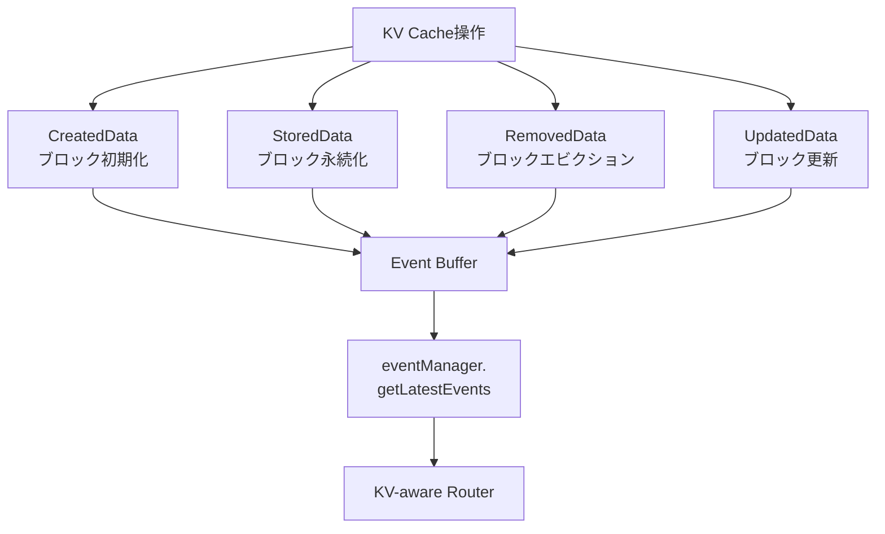

> 本記事は [NVIDIA Developer Blog: "Introducing New KV Cache Reuse Optimizations in NVIDIA TensorRT-LLM"](https://developer.nvidia.com/blog/introducing-new-kv-cache-reuse-optimizations-in-nvidia-tensorrt-llm/) の解説記事です。ブログの主張・実測値はNVIDIAによるものであり、本記事の著者が独自に検証を行ったものではありません。

## ブログ概要（Summary）

NVIDIAはTensorRT-LLMに2つの新機能を導入した。(1) **優先度ベースKVキャッシュエビクション**：デフォルトのLRUエビクションを、開発者が優先度とTTLを設定できる構造に置き換える。(2) **KV Cache Event API**：キャッシュの状態変化をリアルタイムで追跡し、分散環境でのKV-awareルーティングを実現する。NVIDIAは優先度ベースエビクションにより約20%のキャッシュヒット率改善を報告している。

この記事は [Zenn記事: プロンプトキャッシュのヒット率を最大化する実装パターンと運用設計](https://zenn.dev/0h_n0/articles/d7e8a46ea2736d) の深掘りです。

## 情報源

- **種別**: 企業テックブログ
- **URL**: [NVIDIA Developer Blog](https://developer.nvidia.com/blog/introducing-new-kv-cache-reuse-optimizations-in-nvidia-tensorrt-llm/)
- **組織**: NVIDIA (TensorRT-LLMチーム)
- **公開日**: 2025年1月16日（最終更新: 2025年4月23日）
- **著者**: John Thomson, Anjali Shah, Laikh Tewari

## 技術的背景（Technical Background）

LLMの推論では、逐次トークン生成の際にKey-Value（KV）要素をキャッシュし、過去のトークンの再計算を回避する。しかしKVキャッシュはモデルサイズ・バッチサイズ・シーケンス長に比例して増大し、GPUメモリの制約要因となる。

TensorRT-LLMは既に以下のKVキャッシュ最適化を実装していた：
- Paged KVキャッシュアーキテクチャ
- 量子化KVキャッシュ（INT8/FP8対応）
- 循環バッファ/スライディングウィンドウAttention
- KVキャッシュ再利用メカニズム

本ブログで紹介されるのは、これらに加えた**2つの新しい制御インターフェース**である。

## 実装アーキテクチャ（Architecture）

### 機能1: 優先度ベースKVキャッシュエビクション

従来のLRUエビクションでは、最も古いキャッシュエントリが無条件に削除される。これは、長時間繰り返し使用されるシステムプロンプトのKVキャッシュが、一時的なユーザーメッセージの後に不要としてエビクトされる問題を引き起こす。

NVIDIAの新機能では、開発者がトークン範囲ごとに**優先度（0-100）**と**保持期間（duration）**を設定できる。

```python
# TensorRT-LLM Executor APIでの優先度設定の概念的な例
from dataclasses import dataclass


@dataclass
class TokenRangeRetentionConfig:
    """トークン範囲に対するキャッシュ保持設定

    Attributes:
        start: 範囲の開始位置
        end: 範囲の終了位置（Noneの場合はシーケンス末尾まで）
        priority: 保持優先度（0-100、100が最高）
        duration: 優先度の適用期間（秒）
    """
    start: int
    end: int | None
    priority: int  # 0-100
    duration: float  # seconds
```

**設計パターン**:

| ユースケース | priority | duration | 理由 |
|-------------|----------|----------|------|
| 使い捨てクエリ | 0 | 0 | 再利用されない |
| システムプロンプト | 100 | 3600 | 全リクエストで共有 |
| マルチターン会話 | 50 | 30 | セッション内で再利用 |
| デコードトークン | 30 | 10 | 短期的に再利用 |

このエビクション設計は、Zenn記事で解説した「Anthropicのキャッシュ階層構造」と類似のコンセプトである。Anthropicは`cache_control`でブレークポイントを配置し、TensorRT-LLMは`TokenRangeRetentionConfig`でトークン範囲ごとの優先度を設定する。両者とも「静的コンテンツを高優先・長保持、動的コンテンツを低優先・短保持」という設計原則を共有している。

### 機能2: KV Cache Event API

分散LLM推論環境では、複数のGPUインスタンスにまたがるKVキャッシュの状態を把握し、リクエストを最適なインスタンスにルーティングする必要がある。

Event APIは以下の4種類のイベントを追跡する：



**StoredDataイベントのメタデータ**:
- `blockHash`: キャッシュブロックの一意識別子
- `tokens`: ブロック内のトークン数
- `LoraId`: LoRAアダプタの識別子（マルチテナント環境向け）
- `cacheLevel`: キャッシュ階層（GPU HBM/CPU DRAM等）
- `priority`: 設定された優先度レベル

**分散ルーティングの実装パターン**:

```python
# KV-awareルーティングの概念的な実装
from collections import defaultdict


class KVAwareRouter:
    """KVキャッシュ状態に基づく分散ルーティング"""

    def __init__(self, instances: list[str]):
        # instance_id -> set of cached block hashes
        self.cache_state: dict[str, set[str]] = defaultdict(set)
        self.instances = instances

    def update_from_events(self, instance_id: str, events: list) -> None:
        """イベントからキャッシュ状態を更新

        Args:
            instance_id: 推論インスタンスの識別子
            events: KV Cache Event APIから取得したイベントリスト
        """
        for event in events:
            if event.type == "StoredData":
                self.cache_state[instance_id].add(event.block_hash)
            elif event.type == "RemovedData":
                self.cache_state[instance_id].discard(event.block_hash)

    def route_request(self, request_prefix_hashes: list[str]) -> str:
        """リクエストのプレフィックスハッシュに基づき最適インスタンスを選択

        Args:
            request_prefix_hashes: リクエストのプレフィックスを構成するブロックハッシュ

        Returns:
            最もキャッシュヒットが期待されるインスタンスID
        """
        prefix_set = set(request_prefix_hashes)
        best_instance = self.instances[0]
        best_overlap = 0

        for instance_id in self.instances:
            overlap = len(prefix_set & self.cache_state[instance_id])
            if overlap > best_overlap:
                best_overlap = overlap
                best_instance = instance_id

        return best_instance
```

**注意点**: Event APIは**結果整合性（eventually consistent）**である。キャッシュ状態のスナップショットは厳密にリアルタイムではなく、短い遅延がある。ルーティング判断はこの遅延を許容する設計にする必要がある。

## パフォーマンス最適化（Performance）

NVIDIAは優先度ベースエビクションにより「約20%」のキャッシュヒット率改善を報告している。ただしこの数値はワークロード特性に依存する。

**効果が高いワークロード**:
- 共通システムプロンプトを使う多数のリクエスト
- マルチターン会話（セッション内でKVを再利用）
- 類似プレフィックスを持つバッチリクエスト

**効果が限定的なワークロード**:
- 毎回異なるプロンプトを使う一発リクエスト
- 非常に短いプロンプト（KVキャッシュ量が少ない）

## Production Deployment Guide

### AWS実装パターン（コスト最適化重視）

TensorRT-LLMベースの推論サーバを本番デプロイする場合のAWS構成。

| 規模 | 月間リクエスト | 推奨構成 | 月額コスト概算 | 主要サービス |
|------|--------------|---------|-------------|------------|
| **Small** | ~3,000 | Single Instance | $500-1,500 | EC2 g5.xlarge + ALB |
| **Medium** | ~30,000 | Multi-Instance | $2,000-5,000 | ECS + g5.xlarge × 2-4 |
| **Large** | 300,000+ | Cluster | $8,000-20,000 | EKS + p4d.24xlarge + Karpenter |

**コスト試算の注意事項**: 上記は2026年4月時点のAWS ap-northeast-1リージョン料金に基づく概算値です。GPU Instancesの価格はSpot割引適用時の値を含みます。

### Terraformインフラコード

```hcl
# TensorRT-LLM推論サーバ用ECS構成
resource "aws_ecs_task_definition" "tensorrt_llm" {
  family                   = "tensorrt-llm-inference"
  requires_compatibilities = ["EC2"]

  container_definitions = jsonencode([{
    name  = "tensorrt-llm-server"
    image = "nvcr.io/nvidia/tritonserver:24.12-trtllm-python-py3"

    resourceRequirements = [{
      type  = "GPU"
      value = "1"
    }]

    environment = [
      { name = "KV_CACHE_EVICTION_POLICY", value = "priority" },
      { name = "EVENT_BUFFER_MAX_SIZE", value = "10000" },
    ]

    portMappings = [{ containerPort = 8000, protocol = "tcp" }]

    logConfiguration = {
      logDriver = "awslogs"
      options = {
        "awslogs-group"  = "/ecs/tensorrt-llm"
        "awslogs-region" = "ap-northeast-1"
      }
    }
  }])
}
```

### コスト最適化チェックリスト

- [ ] GPU: EC2 Spot Instances（g5.xlarge、最大70%削減）
- [ ] 優先度設定: システムプロンプト=100、デコード=30でキャッシュ効率最大化
- [ ] Event API: KV-awareルーティングでキャッシュヒット率向上
- [ ] Triton推論サーバ: 動的バッチングで GPU utilization 向上
- [ ] CloudWatch: キャッシュヒット率・エビクション頻度の監視
- [ ] Auto Scaling: GPU utilization 70%超でスケールアウト
- [ ] AWS Budgets: 月額予算設定

## 運用での学び（Production Lessons）

NVIDIAのブログから読み取れる運用上の知見：

- **LRUの限界**: デフォルトLRUは「すべてのキャッシュエントリが等価」という前提に立つが、実際にはシステムプロンプトのような高頻度再利用エントリと一発クエリのエントリでは価値が大きく異なる
- **分散環境の課題**: 単純なロードバランシングはKVキャッシュの局所性を破壊する。Event APIによるKV-awareルーティングが必要
- **設定の粒度**: トークン範囲レベルでの優先度設定は柔軟だが、適切な値の選定にはワークロード分析が前提

## 学術研究との関連（Academic Connection）

優先度ベースエビクションは、Zenn記事で解説したAnthropicの`cache_control`やOpenAIの自動prefix cachingと同じ問題空間にある。

| 手法 | 制御方式 | 粒度 | プラットフォーム |
|------|---------|------|--------------|
| Anthropic `cache_control` | 明示的ブレークポイント | ブロック単位 | API |
| OpenAI自動キャッシュ | 自動（prefix match） | 128トークン単位 | API |
| TensorRT-LLM Priority | 優先度 + duration | トークン範囲単位 | 推論エンジン |

TensorRT-LLMの手法はAPIレベルではなく推論エンジンレベルで動作するため、より細かいGPUメモリ管理と連携できる点が特徴である。

関連するarXiv論文：
- **arXiv:2601.06007** (Don't Break the Cache): エージェント環境でのキャッシュ無効化パターンを体系的に分析。TensorRT-LLMの優先度設定はこの論文が指摘するツール定義変動問題への対策として機能する
- **Mooncake** (arXiv:2411.09054): 分散KVキャッシュプール設計。Event APIと組み合わせることで、さらに効率的な分散ルーティングが可能

## まとめと実践への示唆

TensorRT-LLMの新機能は、KVキャッシュ管理を「受動的なLRU」から「能動的な優先度制御」に進化させるものである。特にEvent APIによる分散KV-awareルーティングは、マルチインスタンス環境でのキャッシュヒット率向上に直結する。

実践的には、まずシステムプロンプトにpriority=100を設定し、Event APIでルーティングを最適化することが最初のステップとなる。

## 参考文献

- **Blog URL**: [https://developer.nvidia.com/blog/introducing-new-kv-cache-reuse-optimizations-in-nvidia-tensorrt-llm/](https://developer.nvidia.com/blog/introducing-new-kv-cache-reuse-optimizations-in-nvidia-tensorrt-llm/)
- **TensorRT-LLM GitHub**: [https://github.com/NVIDIA/TensorRT-LLM](https://github.com/NVIDIA/TensorRT-LLM)
- **Related Zenn article**: [https://zenn.dev/0h_n0/articles/d7e8a46ea2736d](https://zenn.dev/0h_n0/articles/d7e8a46ea2736d)
