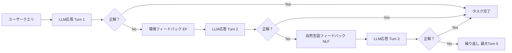

本記事は [MINT: Evaluating LLMs in Multi-turn Interaction with Tools and Language Feedback（arXiv:2401.15077）](https://arxiv.org/abs/2401.15077) の解説記事です。

## 論文概要（Abstract）

MINTは、LLMがツール使用とフィードバックループを含むマルチターンインタラクションにおいてどの程度の能力を発揮するかを定量的に評価するベンチマークである。598のタスクインスタンス、8つのタスクカテゴリで構成され、環境フィードバック（ツール実行結果）と自然言語フィードバック（擬似ヒューマンヒント）の2種類のフィードバックがLLM性能に与える影響を分析している。

この記事は [Zenn記事: LangSmithでLLMエージェントをデバッグする実践ガイド 2026年版](https://zenn.dev/0h_n0/articles/734ae787f0cc54) の深掘りです。

## 情報源

- **arXiv ID**: 2401.15077
- **URL**: [https://arxiv.org/abs/2401.15077](https://arxiv.org/abs/2401.15077)
- **著者**: Xingyao Wang, Zihan Wang, Jiateng Liu, Yangyi Chen et al.
- **発表年**: 2024
- **分野**: cs.CL, cs.AI

## 背景と動機（Background & Motivation）

従来のLLM評価は主にシングルターン（1回のプロンプト→1回の応答）で行われてきた。しかし実際のエージェントユースケースでは、ユーザーとの複数回のやり取り、ツールの実行結果を受けた修正、フィードバックに基づく改善といったマルチターンインタラクションが不可欠である。

著者らは「シングルターン評価では捉えられない2つの重要な能力がある」と主張している。第一に「フィードバックを受けて改善できるか」、第二に「ツールを適切に組み合わせて問題を解決できるか」である。これはLangSmithのMulti-turn Evalsが対象とする課題と直接対応しており、Thread単位での会話品質評価の理論的根拠を提供している。

## 主要な貢献（Key Contributions）

- **貢献1**: ツール使用とフィードバックを統合したマルチターン評価ベンチマーク（598タスク、8カテゴリ）
- **貢献2**: $k$-turn success rateという新規メトリクスの提案。$k$ターン以内にタスクを解決できるか測定する
- **貢献3**: Human Utility Rate（HUR）の定義。自然言語フィードバックをLLMがどの程度活用できるかを定量化
- **貢献4**: 6つの主要LLMでの包括的実験。ターン数の効果は3ターン目以降で急激に減少することを報告

## 技術的詳細（Technical Details）

### ベンチマーク設計

MINTは8つのタスクカテゴリで構成される。

| カテゴリ | インスタンス数 | 評価方法 |
|---------|-------------|---------|
| Reasoning（数学推論） | 150 | 数値一致（±0.01許容誤差） |
| Coding（コード生成・デバッグ） | 98 | テストケース通過率 |
| Decision Making（意思決定） | 85 | 環境状態検証 |
| Information Retrieval（情報検索） | 75 | ROUGE-L ≥ 0.5 |
| Creative Writing（創作） | 62 | GPT-4 judge（0-4スケール） |
| Science（科学問題） | 58 | 数値一致 |
| Tool Use（API/関数呼び出し） | 45 | 関数呼び出し正確性 |
| Instruction Following（指示追従） | 25 | GPT-4 judge |
| **合計** | **598** | |

### ターン設定とメトリクス

最大ターン数は5に設定されている。評価メトリクスは以下の通り。

**$k$-turn success rate**: $k$ターン以内にタスクを正しく解決したタスクの割合。

$$
\text{success@}k = \frac{|\{t \in \mathcal{T} : \exists i \leq k, \text{correct}(t, i) = 1\}|}{|\mathcal{T}|}
$$

ここで、
- $\mathcal{T}$: タスク集合
- $\text{correct}(t, i)$: タスク $t$ がターン $i$ で正解したかの指示関数
- $k = 1$ の場合は従来のシングルターン評価と等価

**Human Utility Rate（HUR）**: 自然言語フィードバック（NLF）を与えたときの改善率。

$$
\text{HUR} = \frac{|\{t : \text{fail}(t, \text{EF}) \land \text{success}(t, \text{EF+NLF})\}|}{|\{t : \text{fail}(t, \text{EF})\}|}
$$

ここで、
- $\text{EF}$: 環境フィードバックのみ
- $\text{NLF}$: 自然言語フィードバック
- 分子: EFのみでは失敗したがEF+NLFで成功したタスク数
- 分母: EFのみで失敗したタスク数

### フィードバックの2つのタイプ



**環境フィードバック（EF）**: ツール実行結果やエラーメッセージ。自動的に生成される。

**自然言語フィードバック（NLF）**: GPT-4が生成した擬似ヒューマンヒント。3段階の詳細度がある。
1. 曖昧なヒント（vague hint）
2. 具体的なヒント（specific hint）
3. 直接的な回答（direct answer）

NLFはタスクが失敗した場合にのみ提供される。

### 提供ツール

MINTでは以下のツールがエージェントに提供される。

```python
# MINTで提供されるツール群
TOOLS = {
    "python_interpreter": {
        "description": "Pythonコードを実行し結果を返す",
        "execution": "Dockerコンテナ内で安全に実行",
    },
    "wikipedia_search": {
        "description": "Wikipediaを検索し関連記事を返す",
        "execution": "Wikipedia APIへのクエリ",
    },
    "calculator": {
        "description": "数値計算を実行する",
        "execution": "シンボリック計算エンジン",
    },
    "file_system_io": {
        "description": "ファイルの読み書きを行う",
        "execution": "サンドボックス内のファイル操作",
    },
    "web_scraper": {
        "description": "Webページの内容を取得する",
        "execution": "制限付きHTTPクライアント",
    },
}
```

### アルゴリズム

```python
from dataclasses import dataclass


@dataclass
class MINTEvalResult:
    """MINT評価結果を格納するデータクラス"""
    task_id: str
    category: str
    success_turn: int | None  # 成功したターン番号（Noneなら全ターン失敗）
    ef_only_success: bool     # EFのみで成功したか
    ef_nlf_success: bool      # EF+NLFで成功したか


def evaluate_multi_turn(
    model: str,
    task: dict,
    max_turns: int = 5,
    use_nlf: bool = True,
) -> MINTEvalResult:
    """MINTのマルチターン評価を実行する

    Args:
        model: 評価対象のLLMモデル名
        task: タスク定義（input, expected_output, tools, category）
        max_turns: 最大ターン数（デフォルト: 5）
        use_nlf: 自然言語フィードバックを使用するか

    Returns:
        MINTEvalResult: 評価結果
    """
    conversation = [{"role": "user", "content": task["input"]}]

    for turn in range(1, max_turns + 1):
        # LLMの応答を取得
        response = call_llm(model, conversation)

        # ツール呼び出しがあれば実行
        if has_tool_calls(response):
            tool_results = execute_tools(response.tool_calls)
            conversation.append({"role": "tool", "content": tool_results})

        # 正解判定
        if is_correct(response, task["expected_output"], task["category"]):
            return MINTEvalResult(
                task_id=task["id"],
                category=task["category"],
                success_turn=turn,
                ef_only_success=True,
                ef_nlf_success=True,
            )

        # フィードバック生成
        ef = generate_environment_feedback(response, task)
        conversation.append({"role": "user", "content": ef})

        if use_nlf and turn >= 2:
            nlf = generate_natural_language_feedback(task, conversation)
            conversation.append({"role": "user", "content": nlf})

    return MINTEvalResult(
        task_id=task["id"],
        category=task["category"],
        success_turn=None,
        ef_only_success=False,
        ef_nlf_success=False,
    )


def compute_k_turn_success(
    results: list[MINTEvalResult],
    k: int,
) -> float:
    """k-turn success rateを計算する

    Args:
        results: 評価結果リスト
        k: ターン数上限

    Returns:
        success@k: k以内に成功したタスクの割合
    """
    successes = sum(
        1 for r in results
        if r.success_turn is not None and r.success_turn <= k
    )
    return successes / len(results) if results else 0.0
```

## 実装のポイント（Implementation）

- **Dockerコンテナ**: ツール実行（特にPythonインタプリタ）はDockerコンテナ内で隔離されており、安全性が確保されている
- **NLF生成コスト**: 自然言語フィードバックの生成にGPT-4 APIを使用するため、評価コストが高い。著者らは「NLF生成コストは全評価コストの約40%を占める」と報告している
- **人間評価との一致率**: ランダム100サンプルでの検証結果、自動評価と人間評価の一致率は92.3%と報告されている
- **LangSmithとの関連**: MINTの$k$-turn success rateはLangSmithのMulti-turn Evalsでカスタム評価関数として実装可能である

## 実験結果（Results）

### 1-turn vs 5-turnの比較

著者らは6つの主要LLMで実験を行っている（論文Table 2より）。

| モデル | 1-turn | 5-turn (EFのみ) | 5-turn (EF+NLF) | NLFによる追加改善 |
|-------|--------|----------------|-----------------|-----------------|
| GPT-4 | 56.2% | 68.7% | 74.3% | +5.6pp |
| GPT-3.5-turbo | 38.4% | 52.1% | 61.8% | +9.7pp |
| Claude-2 | 47.6% | 61.3% | 68.9% | +7.6pp |
| Llama-2-70B | 28.3% | 39.7% | 48.2% | +8.5pp |
| CodeLlama-34B | 35.1% | 48.6% | 55.4% | +6.8pp |
| Mistral-7B | 22.7% | 33.4% | 42.1% | +8.7pp |

著者らの分析によると、「能力の低いモデルほど自然言語フィードバック（NLF）の恩恵が大きい」傾向がある。GPT-4のNLF追加改善は+5.6ppであるのに対し、GPT-3.5-turboは+9.7pp、Mistral-7Bは+8.7ppである。

### カテゴリ別 5-turn success rate（GPT-4, EF+NLF）

| カテゴリ | 成功率 | 1-turnからの改善幅 |
|---------|--------|-----------------|
| Tool Use | 85.3% | 最大（+約25pp） |
| Coding | 82.4% | 大（+約20pp） |
| Information Retrieval | 79.2% | 中（+約15pp） |
| Instruction Following | 76.0% | 中 |
| Reasoning | 71.3% | 中 |
| Creative Writing | 68.1% | 最小 |
| Science | 64.5% | 中 |
| Decision Making | 58.7% | 中 |

著者らは「Tool Useタスクでの改善幅が最も大きいのは、ツールの実行結果という明確なフィードバックが得られるためである」と分析している。一方、Creative Writingの改善幅が最小なのは「主観的タスクの評価の難しさを反映している」と述べている。

### ターン数別の改善曲線（GPT-4, 全タスク平均）

| ターン | 成功率 | 前ターンからの改善幅 |
|-------|--------|-----------------|
| Turn 1 | 56.2% | — |
| Turn 2 | 63.1% | +6.9pp |
| Turn 3 | 66.8% | +3.7pp |
| Turn 4 | 68.2% | +1.4pp |
| Turn 5 | 68.7% | +0.5pp |

著者らは「ターン数の効果はTurn 3以降で急激に減少する（diminishing returns）」と報告している。この知見はLangSmithでのMulti-turn Evals設計において、何ターンまで評価すべきかの判断基準となる。

### Human Utility Rate（HUR）

| モデル | HUR |
|-------|-----|
| GPT-4 | 65.8% |
| Claude-2 | 57.2% |
| GPT-3.5-turbo | 48.3% |
| Llama-2-70B | 35.6% |

GPT-4はNLFを与えられた場合の65.8%で改善に成功しているが、残り34.2%ではフィードバックを活用できていない。

## 実運用への応用（Practical Applications）

MINTの知見はLangSmithを使ったエージェント評価に以下のように活用できる。

- **評価ターン数の設定**: Turn 3以降のdiminishing returnsを考慮し、Multi-turn Evalsのターン上限を3-5に設定するのが効率的
- **フィードバック品質の評価**: HURメトリクスを導入し、「エージェントがユーザーのフィードバックをどれだけ活用できているか」を定量化
- **カテゴリ別評価基準**: タスクカテゴリに応じて異なるGrader（Code-based for Coding、LLM-as-judge for Creative Writing）を設定

ただし、MINTは英語タスクのみであり、日本語環境への適用には追加検証が必要である。

## 関連研究（Related Work）

- **MT-Bench**（Zheng et al., 2023）: LLM-as-a-Judgeによるマルチターン評価。MINTはツール使用と環境フィードバックを追加した拡張版と位置づけられる
- **AgentBench**（Liu et al., 2023）: LLMエージェントの環境対話ベンチマーク。MINTよりタスク環境が多様だが、フィードバックの効果分析は行っていない
- **LMRL Gym**（Abdulhai et al., 2024）: マルチターン強化学習ベンチマーク。MINTがプロンプティングベースの評価であるのに対し、LMRL Gymはファインチューニングの文脈で使用される

## まとめと今後の展望

MINTは、LLMのマルチターンインタラクション能力を体系的に評価する先駆的なベンチマークである。Turn 3以降のdiminishing returns、能力の低いモデルほどNLFの恩恵が大きいという知見は、LangSmithのMulti-turn Evals設計に実践的な示唆を与える。特にHURメトリクスは、エージェントが「フィードバックから学べるか」を定量化する新しい観点を提供しており、本番エージェントの品質指標として導入する価値がある。

## 参考文献

- **arXiv**: [https://arxiv.org/abs/2401.15077](https://arxiv.org/abs/2401.15077)
- **Code**: [https://github.com/xingyaoww/mint-bench](https://github.com/xingyaoww/mint-bench)
- **Dataset**: [HuggingFace: xingyaoww/mint-bench](https://huggingface.co/datasets/xingyaoww/mint-bench)
- **Related Zenn article**: [LangSmithでLLMエージェントをデバッグする実践ガイド 2026年版](https://zenn.dev/0h_n0/articles/734ae787f0cc54)
