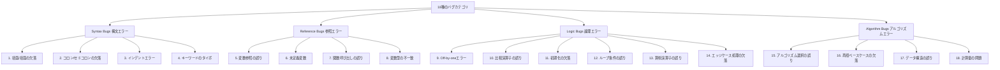

本記事は [DebugBench: Evaluating Debugging Capability of Large Language Models（arXiv:2404.14619）](https://arxiv.org/abs/2404.14619) の解説記事です。

## 論文概要（Abstract）

DebugBenchは、LLMのコードデバッグ能力を体系的に評価するベンチマークである。4つのプログラミング言語（C++, Java, Python, JavaScript）、18種のバグカテゴリ、合計4,253のインスタンスで構成されている。著者らはGPT-4やGPT-3.5等の主要モデルと人間プログラマーを比較し、構文エラーには強いがアルゴリズム的誤りには弱いというLLMの傾向を報告している。

この記事は [Zenn記事: LangSmithでLLMエージェントをデバッグする実践ガイド 2026年版](https://zenn.dev/0h_n0/articles/734ae787f0cc54) の深掘りです。

## 情報源

- **arXiv ID**: 2404.14619
- **URL**: [https://arxiv.org/abs/2404.14619](https://arxiv.org/abs/2404.14619)
- **著者**: Runchu Tian, Yining Ye, Yujia Qin, Xin Cong et al.（清華大学 NLP Lab）
- **発表年**: 2024
- **分野**: cs.SE, cs.CL

## 背景と動機（Background & Motivation）

LLMのコード生成能力はHumanEvalやMBPP等のベンチマークで広く評価されてきたが、デバッグ能力の体系的な評価はこれまで十分に行われていなかった。既存のデバッグ評価は「バグあり/なし」の2値分類が主であり、バグの種類やプログラミング言語による難易度の違いは考慮されていなかった。

著者らは「LLMが本番環境でデバッグエージェントとして機能するには、バグカテゴリごとの強み・弱みを理解する必要がある」と主張している。これはLangSmithのPolly（AIアシスタント）やInsights Agentがエージェントの障害パターンを分類・分析する際に、「何が得意で何が苦手か」を知るための基礎データとなる。

## 主要な貢献（Key Contributions）

- **貢献1**: 18種のバグカテゴリという細粒度の分類体系。既存ベンチマークより粒度が細かい
- **貢献2**: 4言語 × 18カテゴリ × 3難易度の直交設計による4,253インスタンスの大規模データセット
- **貢献3**: バグ埋め込みの自動化パイプライン（LeetCode ACコードにGPT-4でバグ注入）
- **貢献4**: 人間専門家（Fix Accuracy 90.4%）とGPT-4（52.6%）の37.8ppのギャップを定量化

## 技術的詳細（Technical Details）

### 18種のバグカテゴリ

著者らは18種のバグを4つの大グループに分類している。



### データセット構成

| 言語 | インスタンス数 |
|------|-------------|
| C++ | 1,100 |
| Java | 1,096 |
| Python | 1,073 |
| JavaScript | 984 |
| **合計** | **4,253** |

難易度別分布:
- Easy: 1,418（33.3%）
- Medium: 1,418（33.3%）
- Hard: 1,417（33.3%）

### バグ埋め込みパイプライン

著者らは以下のパイプラインでバグを自動生成している。

1. **ACコード収集**: LeetCodeからAccepted済みのコードを4言語で収集
2. **バグ注入**: GPT-4に「特定のバグカテゴリのバグを1つ注入せよ」とプロンプト
3. **WA検証**: 注入後のコードをLeetCodeジャッジで実行し、Wrong Answer（WA）になることを確認
4. **人間レビュー**: バグが明確かつ修正可能であることを人間レビュアーが確認
5. **正解定義**: 元のACコードが修正の正解となる

### 評価基準

Fix Accuracy（修正正確度）:

$$
\text{Fix Accuracy} = \frac{|\{t \in \mathcal{T} : \text{judge}(\text{fix}(t)) = \text{AC}\}|}{|\mathcal{T}|}
$$

ここで、
- $\mathcal{T}$: テストケース集合
- $\text{fix}(t)$: LLMが修正したコード
- $\text{judge}(\cdot)$: LeetCodeオンラインジャッジの判定
- $\text{AC}$: Accepted（全テストケース通過）

LeetCodeのオンラインジャッジを使用することで、部分的な修正ではなく完全な修正のみを正解として扱っている。

### アルゴリズム

```python
from dataclasses import dataclass


@dataclass
class DebugBenchInstance:
    """DebugBenchの1インスタンスを表すデータクラス"""
    problem_id: str
    language: str
    difficulty: str  # Easy, Medium, Hard
    bug_category: str  # 18カテゴリのいずれか
    buggy_code: str
    correct_code: str
    test_cases: list[dict]


def evaluate_debugging(
    model_name: str,
    instance: DebugBenchInstance,
    use_cot: bool = False,
) -> dict:
    """LLMのデバッグ能力を評価する

    Args:
        model_name: 評価対象のLLMモデル名
        instance: DebugBenchインスタンス
        use_cot: Chain-of-Thoughtプロンプティングを使用するか

    Returns:
        評価結果の辞書（fix_correct, fixed_code, reasoning）
    """
    if use_cot:
        prompt = f"""以下のコードにはバグがあります。
まず、バグの原因をステップバイステップで分析してください。
次に、修正したコードを出力してください。

バグのあるコード:
```{instance.language}
{instance.buggy_code}
```"""
    else:
        prompt = f"""以下のコードのバグを修正してください。
修正後のコードのみを出力してください。

```{instance.language}
{instance.buggy_code}
```"""

    fixed_code = call_llm(model_name, prompt)
    judge_result = run_leetcode_judge(fixed_code, instance.test_cases)

    return {
        "fix_correct": judge_result == "AC",
        "fixed_code": fixed_code,
        "bug_category": instance.bug_category,
        "difficulty": instance.difficulty,
        "language": instance.language,
    }
```

## 実装のポイント（Implementation）

- **LeetCode APIへの依存**: 評価にはLeetCodeのオンラインジャッジが必要。著者らは「ローカルジャッジ環境の構築も可能だが、テストケースの網羅性がLeetCodeに劣る」と述べている
- **バグ注入の品質管理**: GPT-4によるバグ注入は自動化されているが、著者らは「注入されたバグの約15%は人間レビューで不適切と判断された（自明すぎる、または修正不能）」と報告している
- **CoTの効果**: Chain-of-Thoughtプロンプティングを使用するとGPT-4のFix Accuracyが52.6%→55.3%に改善するが、効果はAlgorithm Bugsに集中している
- **LangSmithとの関連**: LangSmithでエージェントのコード修正能力を評価する際、DebugBenchの18カテゴリ分類をカスタムメタデータとして記録することで、「どの種類のバグ修正が苦手か」を体系的に把握できる

## 実験結果（Results）

### 全体Fix Accuracy

著者らは8つのモデルと人間専門家を比較している（論文Table 4より）。

| モデル | Easy | Medium | Hard | Overall |
|-------|------|--------|------|---------|
| Human (expert) | 94.2% | 91.3% | 85.7% | **90.4%** |
| GPT-4 | 67.3% | 52.1% | 38.4% | **52.6%** |
| Claude-3-Sonnet | 63.7% | 49.5% | 36.1% | 49.8% |
| Claude-2 | 58.4% | 44.2% | 31.7% | 44.8% |
| DeepSeek-Coder-33B | 55.2% | 42.1% | 29.8% | 42.4% |
| GPT-3.5-turbo | 52.8% | 37.6% | 24.3% | 38.2% |
| CodeLlama-34B | 47.3% | 34.8% | 22.6% | 34.9% |
| Llama-2-70B | 38.1% | 25.4% | 15.2% | 26.2% |

人間専門家（90.4%）とGPT-4（52.6%）の差は37.8ポイントであり、LLMのデバッグ能力にはまだ大きな改善余地があることが示されている。

### バグカテゴリグループ別Fix Accuracy（GPT-4）

| バググループ | 平均Fix Accuracy | 代表的カテゴリ |
|-------------|-----------------|--------------|
| **Syntax Bugs** | 78.9% | タイポ 82.1%, 括弧欠落 78.4% |
| **Reference Bugs** | 57.2% | 未定義変数 61.7%, 型不一致 52.8% |
| **Logic Bugs** | 51.8% | 比較演算子 58.9%, エッジケース 41.7% |
| **Algorithm Bugs** | 31.4% | アルゴリズム選択 28.3%, 計算量 24.7% |

著者らは「構文エラー（78.9%）とアルゴリズムエラー（31.4%）の間に47.5ppの差がある」と報告しており、LLMはパターンマッチ的な修正は得意だが、高次の推論を要するバグ修正は依然として困難であるという明確な傾向が示されている。

### 言語別Fix Accuracy（GPT-4）

| 言語 | Fix Accuracy |
|------|-------------|
| Python | 57.3% |
| JavaScript | 55.8% |
| Java | 50.4% |
| C++ | 47.1% |

著者らはPythonとC++の10.2ppの差について「訓練データのバイアスを反映している可能性がある」と考察している。

### CoTプロンプティングの効果（GPT-4）

| 設定 | Overall | Syntax | Algorithm |
|------|---------|--------|-----------|
| Zero-shot | 52.6% | 78.9% | 31.4% |
| CoT | 55.3% (+2.7pp) | 79.8% (+0.9pp) | 36.5% (+5.1pp) |

CoTの効果はAlgorithm Bugs（+5.1pp）で顕著であるが、Syntax Bugs（+0.9pp）ではほとんど効果がない。著者らは「構文エラーの修正はパターンマッチで十分であり、推論チェーンが必要ないため」と分析している。

## 実運用への応用（Practical Applications）

DebugBenchの知見はLangSmithを使ったエージェントデバッグに以下のように活用できる。

- **障害パターン分類**: LangSmithのInsights Agentが検出する障害パターンを、DebugBenchの18カテゴリに準じて分類することで、対処の優先順位付けが体系化される
- **モデル選択の指針**: コードデバッグエージェントのモデル選択において、DebugBenchのカテゴリ別結果を参考にできる。構文エラー中心ならHaiku級モデルで十分だが、アルゴリズムエラーにはSonnet/Opus級が必要
- **CoTの適用判断**: Algorithm Bugsにのみ効果が大きいことから、LangSmithのトレースでバグカテゴリを判定し、動的にCoTの有無を切り替えるワークフローが考えられる

ただし、DebugBenchはLeetCodeスタイルのアルゴリズム問題に限定されており、実世界のコードベース（マルチファイル、依存関係、非同期処理等）のデバッグとは乖離がある点に注意が必要である。

## 関連研究（Related Work）

- **HumanEval**（Chen et al., 2021）: LLMのコード生成ベンチマーク。DebugBenchはコード「修正」に特化した補完的ベンチマーク
- **SWE-bench**（Jimenez et al., 2024）: 実世界のGitHub Issueベースのバグ修正ベンチマーク。DebugBenchよりスケールは小さいが、実世界のバグに近い
- **AgentBench**（Liu et al., 2023）: LLMエージェントの統一評価。DebugBenchのコードデバッグは、AgentBenchの環境対話タスクの一部として位置づけられる

## まとめと今後の展望

DebugBenchは、LLMのデバッグ能力を18カテゴリ・4言語で体系的に評価した論文である。構文エラーに強くアルゴリズムエラーに弱いという明確な傾向、人間専門家との37.8ppのギャップ、CoTの限定的な効果という3つの主要な知見を報告している。これらの知見は、LangSmithでエージェントのコード修正品質を評価・改善する際の具体的な指針となる。今後は、実世界のコードベースを対象としたデバッグベンチマークの発展が期待される。

## 参考文献

- **arXiv**: [https://arxiv.org/abs/2404.14619](https://arxiv.org/abs/2404.14619)
- **Code**: [https://github.com/thunlp/DebugBench](https://github.com/thunlp/DebugBench)
- **Dataset**: [HuggingFace: thunlp/DebugBench](https://huggingface.co/datasets/thunlp/DebugBench)
- **Related Zenn article**: [LangSmithでLLMエージェントをデバッグする実践ガイド 2026年版](https://zenn.dev/0h_n0/articles/734ae787f0cc54)
