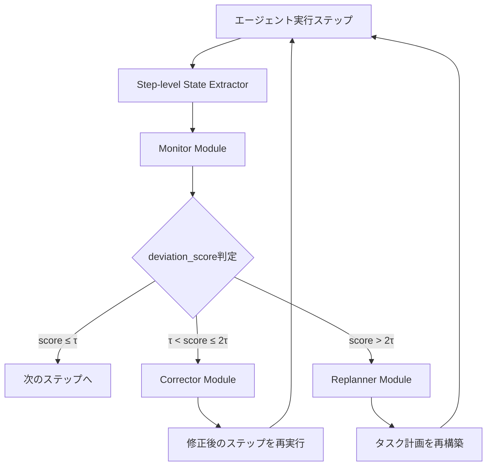

本記事は [AgentMonitor: A Plug-and-Play Framework for Real-Time Evaluation, Modification, and Replanning of LLM Agents（arXiv:2405.14744）](https://arxiv.org/abs/2405.14744) の解説記事です。

## 論文概要（Abstract）

AgentMonitorは、LLMベースのマルチエージェントシステムに対して、タスク実行中の各ステップをリアルタイムで監視・評価し、逸脱を検知した場合に自動修正（Corrector）または再計画（Replanner）を実行するプラグアンドプレイ型フレームワークである。AutoGen、MetaGPT、LangChain等の既存エージェントフレームワークに最小限のコード変更で統合可能な設計を特徴とする。

この記事は [Zenn記事: LangSmithでLLMエージェントをデバッグする実践ガイド 2026年版](https://zenn.dev/0h_n0/articles/734ae787f0cc54) の深掘りです。

## 情報源

- **arXiv ID**: 2405.14744
- **URL**: [https://arxiv.org/abs/2405.14744](https://arxiv.org/abs/2405.14744)
- **著者**: Saizhuo Wang, Bohan Hou, Jian Guan, Qijiong Liu et al.
- **発表年**: 2024
- **分野**: cs.AI, cs.MA

## 背景と動機（Background & Motivation）

LLMエージェントが数十〜数百ステップにわたるタスクを実行する際、途中で誤ったツール呼び出しや不適切な推論を行うことがある。従来の評価手法はタスク完了後に結果を事後分析する方式が主流であり、実行中のリアルタイム介入ができなかった。

著者らは「タスクレベルの事後評価ではなく、ステップレベルの逐次評価が必要である」と主張している。この課題はLangSmithのRun・Trace・Threadの3層トレーシング構造が解決しようとしている問題と同一であり、AgentMonitorはその学術的な定式化を提供している。

## 主要な貢献（Key Contributions）

- **貢献1**: ステップレベルのリアルタイム監視アーキテクチャ（Monitor / Corrector / Replanner の3コンポーネント構成）
- **貢献2**: AgentMonitor Score（AMS）という新規メトリクスの定義。各ステップの期待状態と実際状態の一致度を定量化する
- **貢献3**: 4つのベンチマーク（WebArena, ALFWorld, HotpotQA, ScienceWorld）における有効性の実証。全ベンチマークで+4.7〜+8.6ポイントの改善を報告

## 技術的詳細（Technical Details）

### アーキテクチャ

AgentMonitorは3つのコアコンポーネントから構成される。



#### 1. Step-level State Extractor

各エージェントアクション後に環境状態をスナップショットとして取得する。状態は3つ組 $(s_{\text{current}}, s_{\text{expected}}, d)$ で表現される。

$$
d = 1 - \cos(\mathbf{e}_{\text{current}}, \mathbf{e}_{\text{expected}})
$$

ここで、
- $\mathbf{e}_{\text{current}}$: 現在状態の埋め込みベクトル
- $\mathbf{e}_{\text{expected}}$: 期待状態の埋め込みベクトル
- $d$: 逸脱スコア（deviation score）、$d \in [0, 2]$

期待状態 $s_{\text{expected}}$ はLLM-as-judge方式（few-shot prompting）で推定される。

#### 2. Monitor Module

閾値 $\tau$（デフォルト値 0.3）でdeviation scoreを3段階に分類する。

| 条件 | 判定 | アクション |
|------|------|-----------|
| $d \leq \tau$ | 正常 | 次のステップへ進行 |
| $\tau < d \leq 2\tau$ | 軽微な逸脱 | Correctorが現在ステップを修正 |
| $d > 2\tau$ | 重大な逸脱 | Replannerがタスク計画を再構築 |

著者らは $\tau$ の推奨値をタスク複雑度に応じて調整することを勧めている。具体的には、webタスクでは $\tau = 0.25$、推論タスクでは $\tau = 0.35$ が推奨されている。

#### 3. Corrector Module

軽微な逸脱に対して、現在ステップを修正して再実行する。最大3回のリトライが設定可能である。

#### 4. Replanner Module

重大な逸脱に対して、過去のステップ履歴をコンテキストとして使用し、タスク全体の計画をゼロから再構築する。

### AgentMonitor Score（AMS）

著者らが提案する新規メトリクスは以下の式で定義される。

$$
\text{AMS} = \frac{1}{N} \sum_{i=1}^{N} \max(0, 1 - d_i)
$$

ここで、
- $N$: 総ステップ数
- $d_i$: ステップ $i$ の逸脱スコア
- $\text{AMS} \in [0, 1]$、高いほどエージェントが意図通りに動作

### アルゴリズム

```python
from dataclasses import dataclass
from typing import Literal


@dataclass
class StepState:
    """各ステップの状態を表現するデータクラス"""
    current_embedding: list[float]
    expected_embedding: list[float]
    deviation_score: float


def cosine_similarity(a: list[float], b: list[float]) -> float:
    """コサイン類似度を計算する"""
    dot = sum(x * y for x, y in zip(a, b))
    norm_a = sum(x**2 for x in a) ** 0.5
    norm_b = sum(x**2 for x in b) ** 0.5
    return dot / (norm_a * norm_b) if norm_a * norm_b > 0 else 0.0


def monitor_step(
    state: StepState,
    tau: float = 0.3,
) -> Literal["continue", "correct", "replan"]:
    """ステップの逸脱度に基づいて次のアクションを決定する

    Args:
        state: 現在のステップ状態
        tau: 逸脱閾値（デフォルト: 0.3）

    Returns:
        "continue": 正常、"correct": 修正必要、"replan": 再計画必要
    """
    d = state.deviation_score
    if d <= tau:
        return "continue"
    elif d <= 2 * tau:
        return "correct"
    else:
        return "replan"


def compute_ams(deviation_scores: list[float]) -> float:
    """AgentMonitor Scoreを計算する

    Args:
        deviation_scores: 各ステップの逸脱スコアリスト

    Returns:
        AMS値（0-1、高いほど良い）
    """
    n = len(deviation_scores)
    if n == 0:
        return 0.0
    return sum(max(0, 1 - d) for d in deviation_scores) / n
```

## 実装のポイント（Implementation）

- **監視LLMの分離**: 著者らは、監視に使用するLLMをエージェント本体のLLMとは別のAPIキーで運用することを推奨している。これによりレート制限の干渉を防ぐ
- **State Extractorのドメイン適応**: WebArena用（DOM状態の差分検出）、テキストゲーム用（テキスト状態の意味的比較）等、タスクドメインごとに実装が必要
- **$\tau$ のチューニング**: 著者らは「$\tau$ が小さすぎると過剰な介入でオーバーヘッドが増大し、大きすぎると逸脱を見逃す」と指摘している
- **LangSmithとの関連**: AgentMonitorのdeviation scoreをLangSmithのカスタムメトリクスとして記録し、Insights Agentで集約分析するワークフローが考えられる

## Production Deployment Guide

### AWS実装パターン（コスト最適化重視）

AgentMonitorのリアルタイム監視をAWS上で実装する場合の推奨構成を示す。

**トラフィック量別の推奨構成**:

| 規模 | エージェント実行数 | 推奨構成 | 月額コスト | 主要サービス |
|------|------------------|---------|-----------|------------|
| **Small** | ~100 実行/日 | Serverless | $100-250 | Lambda + Bedrock + DynamoDB |
| **Medium** | ~1,000 実行/日 | Hybrid | $600-1,500 | ECS Fargate + Bedrock + ElastiCache |
| **Large** | 10,000+ 実行/日 | Container | $3,000-8,000 | EKS + Karpenter + Spot Instances |

**Small構成の詳細**（月額$100-250）:
- **Lambda（Monitor）**: 512MB RAM, 30秒タイムアウト $20/月
- **Lambda（Corrector/Replanner）**: 1GB RAM, 120秒タイムアウト $40/月
- **Bedrock**: Claude 3.5 Haiku（State Extractor用）$120/月
- **DynamoDB**: On-Demand（ステップ状態・AMSスコア保存）$15/月
- **CloudWatch**: 基本監視 $5/月

**コスト削減テクニック**:
- Prompt Caching有効化で30-90%削減（期待状態推定の固定プロンプト部分）
- Bedrock Batch API使用で50%削減（非リアルタイム分析時）
- Spot Instances使用で最大90%削減（EKS構成時）

**コスト試算の注意事項**:
- 上記は2026年4月時点のAWS ap-northeast-1（東京）リージョン料金に基づく概算値です
- 実際のコストはエージェントのステップ数、監視LLMの呼び出し頻度により変動します
- 最新料金は [AWS料金計算ツール](https://calculator.aws/) で確認してください

### Terraformインフラコード

**Small構成（Serverless）: Lambda + Bedrock + DynamoDB**

```hcl
# --- IAMロール（Monitor Lambda用） ---
resource "aws_iam_role" "monitor_lambda" {
  name = "agent-monitor-lambda-role"
  assume_role_policy = jsonencode({
    Version = "2012-10-17"
    Statement = [{
      Action = "sts:AssumeRole"
      Effect = "Allow"
      Principal = { Service = "lambda.amazonaws.com" }
    }]
  })
}

resource "aws_iam_role_policy" "monitor_bedrock" {
  role = aws_iam_role.monitor_lambda.id
  policy = jsonencode({
    Version = "2012-10-17"
    Statement = [{
      Effect   = "Allow"
      Action   = ["bedrock:InvokeModel"]
      Resource = "arn:aws:bedrock:ap-northeast-1::foundation-model/anthropic.claude-3-5-haiku*"
    }]
  })
}

# --- Lambda: Monitor Module ---
resource "aws_lambda_function" "monitor" {
  filename      = "monitor.zip"
  function_name = "agent-monitor-step"
  role          = aws_iam_role.monitor_lambda.arn
  handler       = "monitor.handler"
  runtime       = "python3.12"
  timeout       = 30
  memory_size   = 512

  environment {
    variables = {
      BEDROCK_MODEL_ID = "anthropic.claude-3-5-haiku-20241022-v1:0"
      DEVIATION_THRESHOLD = "0.3"
      DYNAMODB_TABLE = aws_dynamodb_table.step_states.name
    }
  }
}

# --- Lambda: Corrector/Replanner ---
resource "aws_lambda_function" "corrector" {
  filename      = "corrector.zip"
  function_name = "agent-monitor-corrector"
  role          = aws_iam_role.monitor_lambda.arn
  handler       = "corrector.handler"
  runtime       = "python3.12"
  timeout       = 120
  memory_size   = 1024

  environment {
    variables = {
      BEDROCK_MODEL_ID = "anthropic.claude-3-5-haiku-20241022-v1:0"
      MAX_RETRIES      = "3"
    }
  }
}

# --- DynamoDB（ステップ状態保存） ---
resource "aws_dynamodb_table" "step_states" {
  name         = "agent-monitor-states"
  billing_mode = "PAY_PER_REQUEST"
  hash_key     = "trace_id"
  range_key    = "step_id"

  attribute {
    name = "trace_id"
    type = "S"
  }
  attribute {
    name = "step_id"
    type = "N"
  }

  ttl {
    attribute_name = "expire_at"
    enabled        = true
  }
}

# --- CloudWatch: AMS低下アラート ---
resource "aws_cloudwatch_metric_alarm" "ams_low" {
  alarm_name          = "agent-monitor-ams-low"
  comparison_operator = "LessThanThreshold"
  evaluation_periods  = 3
  metric_name         = "AMS"
  namespace           = "AgentMonitor"
  period              = 300
  statistic           = "Average"
  threshold           = 0.5
  alarm_description   = "AMSスコア低下（エージェント品質劣化の可能性）"
}
```

### 運用・監視設定

**CloudWatch Logs Insights クエリ**:
```sql
-- 逸脱パターン分析
fields @timestamp, trace_id, step_id, deviation_score, action_taken
| filter deviation_score > 0.3
| stats count(*) as intervention_count by action_taken, bin(1h)

-- AMS推移の時系列分析
fields @timestamp, trace_id, ams_score
| stats avg(ams_score) as avg_ams, min(ams_score) as min_ams by bin(1h)
```

### コスト最適化チェックリスト

- [ ] Monitor Lambda: メモリ512MBで十分か確認（CloudWatch Insights分析）
- [ ] Bedrock: Prompt Caching有効化（期待状態推定の固定プロンプト部分）
- [ ] DynamoDB: TTL設定で古いステップ状態を自動削除（7日推奨）
- [ ] 夜間: Lambda Reserved Concurrency = 0で課金停止

## 実験結果（Results）

著者らは4つのベンチマークで検証を行っている。

**WebArena（Web Navigation）での成功率**（論文Table 1より）:

| モデル | ベースライン | AgentMonitor適用 | 改善幅 |
|-------|------------|-----------------|--------|
| GPT-4o | 39.2% | 47.8% | +8.6pp |
| GPT-3.5-turbo | 24.1% | 31.5% | +7.4pp |
| Claude-3-Opus | 35.7% | 43.2% | +7.5pp |

**ALFWorld（Interactive Text Game）での成功率**:
| GPT-4o | 67.3% | 74.1% | +6.8pp |
| GPT-3.5-turbo | 51.2% | 58.9% | +7.7pp |

**HotpotQA（Multi-hop QA）でのExact Match**:
| GPT-4o | 52.4% | 57.1% | +4.7pp |

**AMSとタスク成功率の相関**（論文Table 3より）:
- WebArena: Pearson $r = 0.847$（$p < 0.001$）
- ALFWorld: $r = 0.821$（$p < 0.001$）
- HotpotQA: $r = 0.793$（$p < 0.001$）

この高い相関は、AMSがエージェント品質の信頼できる代理指標として機能することを示唆している。

**コンポーネント別効果分解**（WebArena, GPT-4o）:
- Correctorのみ: +3.2pp
- Replannerのみ: +5.1pp
- 両方: +8.6pp（相乗効果あり）

**オーバーヘッド測定**:
- Monitorのみ: レイテンシ+12%
- Monitor + Corrector: +18%
- Monitor + Corrector + Replanner: +27%

著者らは「+27%のレイテンシ増加は、+8.6ppの成功率改善とのトレードオフとして許容可能」と主張している。

## 実運用への応用（Practical Applications）

AgentMonitorの設計思想はLangSmithのトレーシング機能と共通点が多い。以下のような応用が考えられる。

- **LangSmithカスタムメトリクス**: deviation scoreとAMSをLangSmithのRunメタデータに記録し、Insights Agentで集約分析
- **アラート設定**: AMSが閾値以下のTraceを自動検出し、Pollyで分析する運用ワークフロー
- **A/Bテスト**: AgentMonitor有無でのタスク成功率比較を、LangSmithのExperiments機能で実施

ただし、監視LLMの追加コスト（特にGPT-4o使用時）とレイテンシ増加は本番環境で考慮すべきトレードオフである。

## 関連研究（Related Work）

- **AutoGen**（Wu et al., 2023）: マルチエージェント会話フレームワーク。AgentMonitorの統合対象の一つ
- **Reflexion**（Shinn et al., 2023）: 言語フィードバックによるエージェント自己修正。AgentMonitorのCorrectorと類似するが、Reflexionはタスク完了後の反省であるのに対し、AgentMonitorはリアルタイム介入
- **AgentBench**（Liu et al., 2023）: LLMエージェントの統一評価ベンチマーク。AgentMonitorの評価環境として使用されている

## まとめと今後の展望

AgentMonitorは、LLMエージェントの「実行中」品質保証という新しい問題設定に取り組んだ論文である。ステップレベルの逸脱検知とリアルタイム修正により、全ベンチマークで一貫した改善を報告している。AMSメトリクスとタスク成功率の高い相関（$r > 0.79$）は、このアプローチの妥当性を支持している。LangSmithのような本番オブザーバビリティツールとの統合により、監視→検知→修正のループを自動化する方向性が期待される。

## 参考文献

- **arXiv**: [https://arxiv.org/abs/2405.14744](https://arxiv.org/abs/2405.14744)
- **Code**: [https://github.com/saizhuo/AgentMonitor](https://github.com/saizhuo/AgentMonitor)
- **Related Zenn article**: [LangSmithでLLMエージェントをデバッグする実践ガイド 2026年版](https://zenn.dev/0h_n0/articles/734ae787f0cc54)
