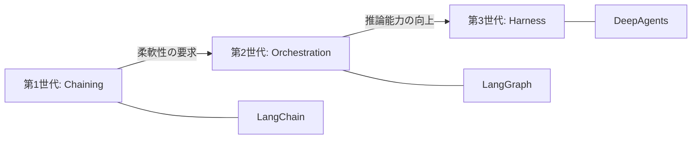
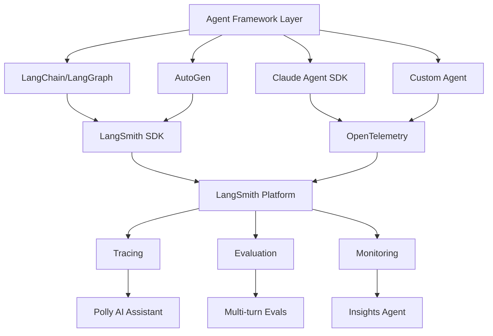

本記事は [On Agent Frameworks and Agent Observability（LangChain Blog, 2026年2月12日公開）](https://blog.langchain.com/on-agent-frameworks-and-agent-observability/) の解説記事です。

## ブログ概要（Summary）

LangChainの共同創設者Harrison Chaseが「In the Loop」シリーズとして執筆した記事で、エージェントフレームワークの進化を3世代に分類し、オブザーバビリティ（可観測性）がフレームワークから独立して設計されるべきである理由を論じている。従来のソフトウェアではコードが設計図となるが、非決定的なAIアプリケーションでは「トレースが設計図となる」という洞察が、LangSmithの設計思想の核心を明らかにしている。

この記事は [Zenn記事: LangSmithでLLMエージェントをデバッグする実践ガイド 2026年版](https://zenn.dev/0h_n0/articles/734ae787f0cc54) の深掘りです。

## 情報源

- **種別**: 企業テックブログ
- **URL**: [https://blog.langchain.com/on-agent-frameworks-and-agent-observability/](https://blog.langchain.com/on-agent-frameworks-and-agent-observability/)
- **組織**: LangChain
- **著者**: Harrison Chase（LangChain共同創設者）
- **発表日**: 2026年2月12日（2月15日更新）

## 技術的背景（Technical Background）

2023年以降、LLMエージェントフレームワークは急速に増加し、LangChain、AutoGen、CrewAI、OpenAI Agents SDK等が登場した。しかし「フレームワークはもう不要ではないか」という議論も繰り返し起きている。LLMの推論能力が向上するにつれ、フレームワークの抽象化がかえって邪魔になるのではないかという懸念である。

著者のHarrison Chaseはこの議論に対し、フレームワークの役割は変化しているが消滅はしていないと主張している。そしてフレームワークの変化とは独立に、オブザーバビリティ（トレーシング・評価・監視）の重要性は増し続けていると論じている。

## エージェントフレームワークの3世代

著者は、エージェントフレームワークの進化を3世代に分類している。

### 第1世代: チェイニング（Chaining）— LangChain

LLMアプリケーションの「イージーボタン」として登場した世代。基盤モデルをデータやAPIに接続するインテグレーションを提供し、学習のしやすさを重視していた。

著者は「初期のLangChainは、LLMアプリケーション構築のベストプラクティスをフレームワーク自体にエンコードすることを目指していた」と振り返っている。ただし、この抽象化は制御の柔軟性を犠牲にしていた面がある。

### 第2世代: オーケストレーション（Orchestration）— LangGraph

第1世代の柔軟性の制約を解消するために登場した世代。ランタイムサポートとして耐久性（durability）とステートフルネス（statefulness）を提供し、人間とAIの協調シナリオに対応した。

著者は「LangGraphは、開発者により多くの制御を与えつつ、エージェントの状態管理や人間介入ポイント（human-in-the-loop）といった本番運用に必要な機能を提供した」と説明している。

### 第3世代: ハーネス（Harness）— DeepAgents

最新の世代で、計画立案（planning）、ツール呼び出しのループ処理、ファイルシステムベースのコンテキストオフロード、サブエージェントの協調を支援する。LLMの推論能力の向上によって実現された設計パターンである。

著者は「LLMの推論能力が向上したことで、エージェントフレームワークが提供すべき価値も変化した。もはやLLM呼び出しの簡易ラッパーではなく、計画・実行・監視のオーケストレーション基盤が求められている」と述べている。



## オブザーバビリティのフレームワーク非依存性

### LangSmithの設計思想

著者はLangSmithがエージェントフレームワークから意図的に独立して設計されていることを強調している。著者は「Vercelが複数のフロントエンドエコシステムをサポートするのと同様に、LangSmithは特定のフレームワークに縛られないオブザーバビリティプラットフォームである」と説明している。

現在LangSmithがサポートしているフレームワークは以下の通り。

| フレームワーク | 統合方式 |
|-------------|---------|
| LangChain / LangGraph | ネイティブ統合 |
| AutoGen | コールバック統合 |
| Claude Agent SDK | トレーシングAPI |
| CrewAI | プラグイン統合 |
| OpenAI Agents | OpenTelemetry |
| カスタム実装 | @traceable デコレータ / OpenTelemetry |

### OpenTelemetry統合

著者は、2025年3月のOpenTelemetryサポート開始について触れ、「フレームワーク非依存のトレーシングを実現する標準として、OpenTelemetryが最適である」と述べている。これにより、LangChainやLangGraphに依存しないカスタムエージェントでも、標準的なOpenTelemetryスパンとしてトレースをLangSmithに送信できるようになった。

```python
# OpenTelemetryによるフレームワーク非依存トレーシングの例
from opentelemetry import trace
from opentelemetry.sdk.trace import TracerProvider
from opentelemetry.sdk.trace.export import BatchSpanProcessor

# LangSmith OpenTelemetryエクスポーターの設定
from langsmith.otel import LangSmithOTLPExporter

provider = TracerProvider()
processor = BatchSpanProcessor(LangSmithOTLPExporter())
provider.add_span_processor(processor)
trace.set_tracer_provider(provider)

tracer = trace.get_tracer("my-custom-agent")

# カスタムエージェントのトレーシング
with tracer.start_as_current_span("agent-execution") as span:
    span.set_attribute("agent.framework", "custom")
    span.set_attribute("agent.model", "claude-3-5-sonnet")

    # エージェントの実行ロジック
    with tracer.start_as_current_span("llm-call") as llm_span:
        llm_span.set_attribute("llm.model", "claude-3-5-sonnet")
        llm_span.set_attribute("llm.token_count.input", 1500)
        response = call_llm(prompt)
        llm_span.set_attribute("llm.token_count.output", 500)

    with tracer.start_as_current_span("tool-execution") as tool_span:
        tool_span.set_attribute("tool.name", "search")
        result = execute_tool("search", query)
```

## 「トレースが設計図となる」という洞察

著者が述べる最も重要な洞察は、従来のソフトウェアとAIアプリケーションの根本的な違いである。

著者は「従来のソフトウェアでは、コードがアプリケーションの振る舞いを文書化する。しかしAIでは、トレースがその役割を担う」と主張している。

この違いは以下の点から生じる。

| 観点 | 従来のソフトウェア | AIアプリケーション |
|------|------------------|------------------|
| 振る舞いの決定 | コード（決定的） | モデル＋プロンプト（非決定的） |
| 設計図 | ソースコード | トレース |
| デバッグ方法 | ステップ実行、ブレークポイント | トレース分析、パターン分類 |
| テスト方法 | ユニットテスト | 評価（Evals）、A/Bテスト |
| 品質保証 | 静的解析、コードレビュー | オンライン監視、LLM-as-judge |

この洞察がLangSmithの3つの核心機能を動機づけている。

1. **トレーシング**: 非決定的な振る舞いの完全な記録
2. **評価**: トレースに基づく品質測定（Multi-turn Evals）
3. **監視**: 本番トレースのパターン分析（Insights Agent）

## 実装アーキテクチャ（Architecture）

著者のブログからは明示的なアーキテクチャ図は提供されていないが、述べられている設計原則を整理すると以下の構成となる。



著者は「質の高いフレームワークはベストプラクティスをフレームワーク自体にエンコードし、ボイラープレートコードを削減し、チームの標準化を促進し、本番への到達を加速する」と述べている。一方で、オブザーバビリティはフレームワーク選択に関わらず必要であり、フレームワーク固有の実装に縛られるべきではないとしている。

## Production Deployment Guide

### AWS実装パターン（コスト最適化重視）

エージェントオブザーバビリティ基盤をAWS上で構築する場合の推奨構成を示す。

**トラフィック量別の推奨構成**:

| 規模 | トレース数 | 推奨構成 | 月額コスト | 主要サービス |
|------|----------|---------|-----------|------------|
| **Small** | ~5,000/月 | Serverless | $50-120 | Lambda + S3 + DynamoDB |
| **Medium** | ~50,000/月 | Hybrid | $300-700 | ECS Fargate + ElastiCache + S3 |
| **Large** | 500,000+/月 | Container | $2,000-5,000 | EKS + Karpenter + OpenSearch |

**Small構成の詳細**（月額$50-120）:
- **Lambda**: トレース受信・処理 $15/月
- **S3**: トレース永続化 $10/月
- **DynamoDB**: メタデータインデックス $15/月
- **API Gateway**: トレース受信エンドポイント $5/月
- **CloudWatch**: 基本監視 $5/月

**コスト削減テクニック**:
- S3 Intelligent-Tiering: アクセス頻度に応じた自動階層化
- DynamoDB TTL: 古いトレースの自動削除（30日推奨）
- Lambda Reserved Concurrency: 夜間のコスト抑制

**コスト試算の注意事項**:
- 上記は2026年4月時点のAWS ap-northeast-1（東京）リージョン料金に基づく概算値です
- 実際のコストはトレースサイズ、保持期間、クエリ頻度により変動します
- LangSmith SaaSを利用する場合は、Developerプラン（無料、5,000トレース/月）からPlusプラン（$39/seat/月）が別途必要です

### Terraformインフラコード

**Small構成（Serverless）: Lambda + S3 + DynamoDB**

```hcl
# --- IAMロール ---
resource "aws_iam_role" "trace_processor" {
  name = "trace-processor-role"
  assume_role_policy = jsonencode({
    Version = "2012-10-17"
    Statement = [{
      Action = "sts:AssumeRole"
      Effect = "Allow"
      Principal = { Service = "lambda.amazonaws.com" }
    }]
  })
}

# --- S3（トレース永続化） ---
resource "aws_s3_bucket" "traces" {
  bucket = "agent-traces-store"
}

resource "aws_s3_bucket_intelligent_tiering_configuration" "traces" {
  bucket = aws_s3_bucket.traces.id
  name   = "traces-tiering"

  tiering {
    access_tier = "ARCHIVE_ACCESS"
    days        = 90
  }
  tiering {
    access_tier = "DEEP_ARCHIVE_ACCESS"
    days        = 180
  }
}

resource "aws_s3_bucket_server_side_encryption_configuration" "traces" {
  bucket = aws_s3_bucket.traces.id
  rule {
    apply_server_side_encryption_by_default {
      sse_algorithm = "aws:kms"
    }
  }
}

# --- DynamoDB（メタデータインデックス） ---
resource "aws_dynamodb_table" "trace_index" {
  name         = "trace-metadata-index"
  billing_mode = "PAY_PER_REQUEST"
  hash_key     = "trace_id"
  range_key    = "timestamp"

  attribute {
    name = "trace_id"
    type = "S"
  }
  attribute {
    name = "timestamp"
    type = "N"
  }

  global_secondary_index {
    name            = "agent-framework-index"
    hash_key        = "framework"
    range_key       = "timestamp"
    projection_type = "ALL"
  }
  attribute {
    name = "framework"
    type = "S"
  }

  ttl {
    attribute_name = "expire_at"
    enabled        = true
  }
}

# --- Lambda（トレース処理） ---
resource "aws_lambda_function" "trace_processor" {
  filename      = "trace_processor.zip"
  function_name = "agent-trace-processor"
  role          = aws_iam_role.trace_processor.arn
  handler       = "index.handler"
  runtime       = "python3.12"
  timeout       = 60
  memory_size   = 512

  environment {
    variables = {
      S3_BUCKET      = aws_s3_bucket.traces.id
      DYNAMODB_TABLE = aws_dynamodb_table.trace_index.name
    }
  }
}
```

### セキュリティベストプラクティス

- **トレースデータの機密性**: LangSmithはSaaS型のため、トレースデータが外部サーバーに送信される。機密データを含む場合はセルフホスト版を検討するか、`hide_inputs` / `hide_outputs` オプションでフィルタリングする
- **APIキー管理**: LangSmith APIキーはAWS Secrets Managerで管理し、環境変数への直接記載は避ける
- **暗号化**: S3/DynamoDB全てKMS暗号化を有効化

### 運用・監視設定

**CloudWatch Logs Insights クエリ**:
```sql
-- フレームワーク別トレース量分析
fields @timestamp, framework, trace_count
| stats count(*) as trace_count by framework, bin(1h)
| sort trace_count desc

-- トレース処理レイテンシ分析
fields @timestamp, processing_duration_ms
| stats pct(processing_duration_ms, 95) as p95 by bin(5m)
```

### コスト最適化チェックリスト

- [ ] LangSmith Developerプラン（5,000トレース/月無料）の範囲内か確認
- [ ] トレースのサンプリング率設定（本番で100%記録は不要な場合）
- [ ] S3ライフサイクルポリシー: 90日→IA、180日→Glacier
- [ ] DynamoDB TTL: 30日で自動削除
- [ ] Lambda: メモリ最適化（CloudWatch Insights分析）
- [ ] OpenTelemetry Batch Processor: バッチサイズ最適化で送信回数削減

## パフォーマンス最適化（Performance）

著者のブログでは具体的なパフォーマンス数値は提示されていないが、設計上の最適化ポイントとして以下が示唆されている。

- **バッチ送信**: LangSmith SDKはトレースをバッチで非同期送信する設計。これによりエージェント実行のレイテンシへの影響を最小化
- **選択的トレーシング**: `ls.tracing_context()` でトレーシングの有効/無効を動的に制御可能
- **サンプリング**: 本番環境で全トレースを記録する必要がない場合、サンプリング率の設定でコストとストレージを削減

## 運用での学び（Production Lessons）

著者のブログから読み取れる運用上の教訓は以下の通り。

- **フレームワークロックインの回避**: 著者は「オブザーバビリティはフレームワーク選択に依存すべきでない」と強調している。OpenTelemetry統合により、フレームワーク移行時もトレーシング基盤を維持できる
- **段階的な導入**: Developerプラン（無料）からスタートし、トレースデータの蓄積に応じてPlusプランにアップグレードする段階的導入が推奨されている
- **トレースの文化**: 著者は「トレースはデバッグだけでなく、チーム全体でエージェントの振る舞いを理解するための共通言語となる」と述べている

## 学術研究との関連（Academic Connection）

著者のブログで述べられているオブザーバビリティの概念は、分散システムのオブザーバビリティ研究（Dapper: Google's Large-Scale Distributed Systems Tracing Infrastructure, Sigelman et al., 2010）の延長線上にある。DapperがマイクロサービスのトレーシングにSpan/Trace/Annotationの概念を導入したのと同様に、LangSmithはLLMエージェントにRun/Trace/Threadの概念を導入している。OpenTelemetryの採用はこの系譜を引き継いだものと位置づけられる。

## まとめと実践への示唆

Harrison Chaseのブログは、LangSmithの設計思想の背景を理解するための重要な一次情報である。「トレースが設計図となる」という洞察は、なぜLangSmithがRun・Trace・Threadの3層構造を採用しているのか、なぜPollyやInsights Agentがトレースの分析に焦点を当てているのかを説明する。エージェントフレームワークの第3世代への進化に伴い、オブザーバビリティの役割はデバッグツールから品質保証基盤へと拡大しており、LangSmithはその中心に位置づけられている。

## 参考文献

- **Blog URL**: [On Agent Frameworks and Agent Observability（LangChain Blog）](https://blog.langchain.com/on-agent-frameworks-and-agent-observability/)
- **Related Blog**: [Introducing End-to-End OpenTelemetry Support in LangSmith](https://blog.langchain.com/end-to-end-opentelemetry-langsmith/)
- **Related Papers**: Sigelman et al., "Dapper, a Large-Scale Distributed Systems Tracing Infrastructure" (2010)
- **Related Zenn article**: [LangSmithでLLMエージェントをデバッグする実践ガイド 2026年版](https://zenn.dev/0h_n0/articles/734ae787f0cc54)
