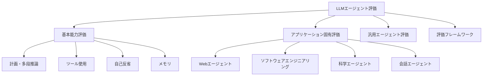

## 論文概要（Abstract）

本記事は [arXiv:2503.16416 Survey on Evaluation of LLM-based Agents](https://arxiv.org/abs/2503.16416) の解説記事である。Hebrew University of Jerusalem、IBM Research、Yale Universityの共同研究チームが、LLMエージェント評価手法の初の包括的サーベイを提示している。著者らは70以上のベンチマークを4つの次元——基本能力（計画・ツール使用・自己反省・メモリ）、アプリケーション固有ベンチマーク、汎用エージェントベンチマーク、評価フレームワーク——で体系的に分類し、コスト効率・安全性・ロバスト性の評価における重大なギャップを特定している。

この記事は [Zenn記事: AgentCore Evaluationsでエピソディックメモリの効果を定量評価する実践手法](https://zenn.dev/0h_n0/articles/b60d93971f75f0) の深掘りです。

## 情報源

- **arXiv ID**: 2503.16416
- **URL**: [https://arxiv.org/abs/2503.16416](https://arxiv.org/abs/2503.16416)
- **著者**: Asaf Yehudai, Lilach Eden, Alan Li, Guy Uziel, Yilun Zhao, Roy Bar-Haim, Arman Cohan, Michal Shmueli-Scheuer
- **発表年**: 2025年3月
- **分野**: cs.AI, cs.CL, cs.LG

## 背景と動機（Background & Motivation）

LLMベースのエージェントは、計画・推論・ツール使用・メモリ維持を行いながら動的環境と対話する自律システムとして急速に発展している。しかし、従来のLLMベンチマーク（MMLU、AlpacaEvalなど）は単一ターンのテキスト-テキストタスクを対象としており、エージェントの複合的な能力——マルチステップの計画実行、外部ツールとの対話、過去の経験からの学習——を評価するには不十分である。

著者らは、エージェント評価には「新しい種類の評価方法論、ベンチマーク、環境、メトリクス」が必要であると主張している。エージェントを定義する特性——特定のLLM能力への依存、動的環境での逐次的動作、多様で複雑なタスクの遂行——が評価に新たな課題をもたらすためである。

## 主要な貢献（Key Contributions）

- **貢献1**: LLMエージェント評価の初の包括的マッピングを提供し、4つの対象読者（開発者、実務者、ベンチマーク開発者、AI研究者）に向けた体系化を実現した
- **貢献2**: 70以上のベンチマークを4次元で分類し、各ベンチマークの評価対象・メトリクス・限界を明示した
- **貢献3**: 現在のトレンド（現実的で困難な評価への移行、ライブベンチマーク）と今後の研究方向（コスト効率、安全性、スケーラブルな評価手法）を特定した

## 技術的詳細（Technical Details）

### 4次元評価フレームワーク

### 次元1: 基本能力評価

#### 計画・多段推論（Planning and Multi-Step Reasoning）

エージェントの計画能力を評価するベンチマークとして、以下が体系的に分類されている。

| ベンチマーク | 評価対象 | 主な知見 |
|-------------|---------|---------|
| **PlanBench** (Valmeekam et al., 2023) | 多様なドメインでの計画能力 | 短期戦術的計画は得意だが、長期戦略的計画は苦手 |
| **MINT** (Wang et al., 2023) | インタラクティブ環境での計画 | 先進的LLMも多段タスクで苦戦する |
| **Natural Plan** (Zheng et al., 2024) | 自然言語での実世界計画 | 複雑性増加に伴い性能が著しく低下 |
| **FlowBench** (Xiao et al., 2024) | ワークフロー計画 | 専門的タスクでの計画精度を評価 |
| **ACPBench** (Kokel et al., 2024) | コア推論スキル | 基本的推論能力の評価 |

著者らは効果的な計画に不可欠な5つの能力を特定している:
1. **タスク分解**: 複雑な問題を管理可能なサブタスクに分割する能力
2. **状態追跡と信念維持**: 多段推論での正確な中間状態管理
3. **自己修正**: エラーの検出と回復
4. **因果理解**: 行動結果の予測
5. **メタ計画**: 計画戦略自体の改善

#### ツール使用（Function Calling & Tool Use）

ツール使用の評価は、単純な1ステップ対話から複雑なマルチステップ対話へと進化している。

**評価のサブタスク:**
- **意図認識**: ユーザー要求に基づいて関数が必要かを判断
- **関数選択**: タスクに最適なツールを決定
- **パラメータ抽出**: 会話からパラメータを抽出しマッピング
- **関数実行**: パラメータを用いて外部システムと対話
- **応答生成**: 関数出力を処理しLLM応答に統合

**ベンチマーク進化（第1世代→第3世代）:**

- **第1世代**: ToolAlpaca、APIBench、BFCL v1——合成データセット、ルールベースマッチング、単純なパス率評価
- **第2世代**: ToolSandbox、API-Bank——ステートフルなツール実行、会話ベース評価、現実的なAPI対話
- **第3世代**: ComplexFuncBench、NESTFUL——暗黙的パラメータ推論、ネストされたAPI呼び出し、複雑な制約遵守

BFCL（Berkeley Function Calling Leaderboard）はv1→v2→v3と進化し、v3ではマルチターン・マルチステップ評価ロジックを統合している。著者らは、この進化が「現実世界の複雑性をより忠実に近似する」ものであると評価している。

#### 自己反省（Self-Reflection）

エージェントが対話的フィードバックを通じて推論を改善できるかを評価する領域である。

初期の研究では、既存の推論タスク（ALFWorld、MiniWoB++等）をマルチターンフィードバックループに再利用していた。しかし、著者らは「観測された改善がプロンプティング技法に依存している可能性があり、適切な標準化が欠如している」と指摘している。

専用ベンチマーク:
- **LLF-Bench** (Cheng et al., 2023): タスク指示を環境の一部として組み込み、過適合を防ぐランダム化オプションを提供
- **LLM-Evolve** (You et al., 2024): 過去の経験を文脈内デモンストレーションとして抽出し、自己反省能力を評価
- **Reflection-Bench** (Li et al., 2024): 6つのコア認知能力をカバー——知覚、新情報への適応、メモリ使用、信念更新、反事実推論、メタ反省

#### メモリ（Memory）

メモリ評価のベンチマークは以下のように分類される。

| ベンチマーク | 評価焦点 | 特徴 |
|-------------|---------|------|
| **LoCoMo** (Maharana et al., 2024) | 長期会話メモリ | 最大35セッション、300+ターン |
| **MemGPT** (Packer et al., 2024) | 階層的メモリ管理 | OS風3層アーキテクチャ |
| **ReadAgent** (Lee et al., 2024) | 読解におけるメモリ | 長文文書のページングメモリ |
| **StreamBench** (Wu et al., 2024a) | ストリーミングデータでのメモリ | リアルタイムメモリ更新 |
| **A-MEM** (Xu et al., 2025) | エージェンティックメモリ | 自律的メモリ管理 |
| **LTMbenchmark** (Castillo-Bolado et al., 2024a) | 長期メモリ | セッション横断の一貫性 |

AgentCore Evaluationsの組み込みエバリュエータ（Helpfulness、GoalSuccessRate等）は、この分類における「タスク有効性」メトリクスに対応する。ただし、**メモリ品質そのものを評価するエバリュエータ**（検索精度、矛盾率、陳腐化等）は組み込みエバリュエータに含まれておらず、カスタムエバリュエータで補完する必要がある。

### 次元2: アプリケーション固有ベンチマーク

#### Webエージェント

MiniWoB→MiniWoB++→WebArena→VisualWebArenaへと進化し、評価環境の現実性が段階的に向上している。WorkArena++（Boisvert et al., 2025）は企業向けServiceNow環境での複雑なタスク遂行を評価する。

#### ソフトウェアエンジニアリングエージェント

SWE-bench系列が中核を占める:
- **SWE-bench** (Jimenez et al., 2023): GitHub issueからの自動修正
- **SWE-bench Verified** (OpenAI, 2024): 人手検証済みサブセット
- **SWE-bench+** (Aleithan et al., 2024): テスト品質改善版
- **TDD-Bench Verified** (Ahmed et al., 2024): テスト駆動開発での評価

#### 科学エージェント

ScienceAgentBench、CORE-Bench、MLGym-Benchなどが研究の設計・実行・分析能力を評価する。

#### 会話エージェント

τ-Bench（Yao et al., 2024）は航空会社・小売シナリオでの顧客サービスエージェントを評価し、IntellAgent（Levi and Kadar, 2025a）は制御可能なベンチマーク生成フレームワークを提供する。

### 次元3: 汎用エージェントベンチマーク

| ベンチマーク | 特徴 | 評価スコープ |
|-------------|------|------------|
| **GAIA** (Mialon et al., 2023) | 人間には容易だがAIには困難なタスク | 多段推論、ツール使用の統合 |
| **AgentBench** (Liu et al., 2023b) | 8環境での包括的評価 | OS操作、DB操作、Web閲覧等 |
| **TheAgentCompany** (Xu et al., 2024) | 現実的な企業タスク51件 | LLMベース評価、高精度 |
| **OSWorld** (Xie et al., 2024) | デスクトップOS環境 | マルチアプリ操作 |
| **AppWorld** (Trivedi et al., 2024) | モバイルアプリ環境 | APIベースのタスク完了 |

### 次元4: 評価フレームワーク

開発フレームワーク:
- **LangSmith** (LangChain): エージェント開発ライフサイクル全体の評価サポート
- **Langfuse**: オープンソースの可観測性・評価プラットフォーム
- **Galileo Agentic**: エージェント品質のリアルタイム監視

Gym風環境:
- **MLGym** (Nathani et al., 2025): ML実験のエージェント評価
- **BrowserGym** (Chezelles et al., 2024): ブラウザ操作の統一環境
- **SWE-Gym** (Pan et al., 2024a): ソフトウェアエンジニアリングの学習環境

### LLM-as-a-Judge手法の位置づけ

本サーベイでは、LLM-as-a-Judgeがエージェント評価における主要な自動評価手法として繰り返し登場する。TheAgentCompany（Xu et al., 2024）では、「明確に定義されたタスクで単純な情報抽出と分類を必要とする場合、LLMベース評価者は高い精度を持つ」と報告されている。

AgentCore EvaluationsはこのLLM-as-a-Judge手法をマネージドサービスとして提供しており、本サーベイの分類では「評価フレームワーク」次元に該当する。組み込みエバリュエータは事前設定済みのプロンプトテンプレート・モデル・スコアリング基準を持ち、カスタムエバリュエータではプロンプトとモデルを自由に選択できる。

## 実験結果（Results）— 現在のトレンドと研究ギャップ

### 現在のトレンド

著者らは2つの主要トレンドを特定している:

1. **現実的で困難な評価への移行**: 合成データから実世界のタスクへ、単純な成功/失敗から細粒度の評価指標へと進化している
2. **ライブベンチマーク**: 継続的に更新されるベンチマーク（BFCL、Galileo Agent Leaderboard等）により、データ汚染リスクを低減し、最新のエージェント能力を反映する

### 特定された研究ギャップ

| ギャップ | 現状 | 今後の方向性 |
|---------|------|------------|
| **コスト効率** | ほぼすべてのベンチマークが精度のみを評価 | トークン消費量、API呼び出し回数、金銭コストの標準化 |
| **安全性** | 安全性評価ベンチマークが極めて少ない | エージェント固有のリスク（ツール悪用、権限昇格等）の体系的評価 |
| **ロバスト性** | 理想条件下での評価が主流 | ノイジーな入力、API障害、曖昧な指示への耐性評価 |
| **細粒度評価** | 最終結果（成功/失敗）のみ | 中間ステップ、計画品質、ツール選択の適切性 |
| **スケーラブル評価** | 人手評価に依存する部分が多い | LLM-as-a-Judgeの精度向上と自動化 |

## 実運用への応用（Practical Applications）

本サーベイから導出されるエピソディックメモリ評価への実践的示唆:

**1. 多層評価の設計**

AgentCore Evaluationsの3レベル評価（Session/Trace/Span）は、本サーベイの「細粒度評価」トレンドと合致する。メモリ評価においても以下の多層設計が有効である:
- **Session レベル**: エピソード学習による目標達成率向上（GoalSuccessRate）
- **Trace レベル**: 個別応答へのメモリ知見反映（Helpfulness, Correctness）
- **Span レベル**: メモリ検索操作の精度（カスタムエバリュエータ）

**2. コスト効率メトリクスの導入**

本サーベイで最も強調されているギャップの一つが「コスト効率」である。メモリ評価においても:
- メモリ検索のレイテンシ（p50, p90, p99）
- 検索あたりのトークン消費量
- メモリストレージの成長率

をCloudWatchメトリクスとして計測し、品質スコアと併せて評価することが推奨される。

**3. ベンチマーク選択の指針**

メモリ能力の評価には、本サーベイで分類されたベンチマークから以下を選択するのが適切である:
- **LoCoMo**: セッション横断の長期記憶評価
- **LTMbenchmark**: 長期記憶の一貫性評価
- **τ-Bench**: 会話エージェントの顧客対応品質（メモリ活用含む）

## 関連研究（Related Work）

- **Wang et al. (2024a)**: LLMエージェントのモデリング・設計に関するサーベイ。本論文は評価に特化している点で補完関係にある
- **Du (2026) "Memory for Autonomous LLM Agents" (arXiv:2603.07670)**: メモリ機構に焦点を当てたサーベイ。メモリ評価のベンチマーク分析で本論文と重複があるが、本論文はメモリ以外の能力（計画、ツール使用、自己反省）もカバーしている
- **Zheng et al. (2023) "Judging LLM-as-a-Judge" (arXiv:2306.05685)**: LLM-as-a-Judge手法の基盤研究。本サーベイではこの手法がエージェント評価全体を通じて活用されていることが示されている

## まとめと今後の展望

本サーベイは、LLMエージェント評価の現状を以下のように整理している:

- 70以上のベンチマークが4次元で体系化され、各ベンチマークの評価対象・限界が明確化された
- **現実的で困難な評価への移行**と**ライブベンチマーク**の2つのトレンドが特定された
- **コスト効率**、**安全性**、**ロバスト性**、**細粒度評価**、**スケーラブルな評価手法**の5つの研究ギャップが明確化された

AgentCore Evaluationsはこのサーベイの文脈において、「評価フレームワーク」次元のマネージドサービス実装であり、LLM-as-a-Judgeによる自動評価をSession/Trace/Spanの3レベルで提供する。ただし、コスト効率メトリクスや安全性評価は標準機能に含まれておらず、カスタムエバリュエータやCloudWatch統合で補完する必要がある。

## 参考文献

- **arXiv**: [https://arxiv.org/abs/2503.16416](https://arxiv.org/abs/2503.16416)
- **AgentBench**: [arXiv:2308.03688](https://arxiv.org/abs/2308.03688)
- **SWE-bench**: [arXiv:2310.06770](https://arxiv.org/abs/2310.06770)
- **LLM-as-a-Judge**: [arXiv:2306.05685](https://arxiv.org/abs/2306.05685)
- **Related Zenn article**: [AgentCore Evaluationsでエピソディックメモリの効果を定量評価する実践手法](https://zenn.dev/0h_n0/articles/b60d93971f75f0)
