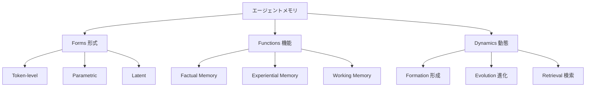

## 論文概要（Abstract）

本記事は [arXiv:2512.13564 Memory in the Age of AI Agents](https://arxiv.org/abs/2512.13564) の解説記事である。Yuyang Huを筆頭著者とする47名の研究者が共同執筆した本サーベイは、基盤モデルベースのエージェントにおけるメモリシステムを包括的に検討している。著者らは「メモリは基盤モデルベースエージェントのコア機能として出現し、今後もそうあり続ける」と主張し、**形式（Forms）・機能（Functions）・動態（Dynamics）**の3次元分類法を提案している。メモリをLLMメモリ、RAG、コンテキストエンジニアリングといった関連概念から明確に区別し、実務的なベンチマークとオープンソースフレームワークのリソースを提供している点が特徴的である。

この記事は [Zenn記事: AgentCore Evaluationsでエピソディックメモリの効果を定量評価する実践手法](https://zenn.dev/0h_n0/articles/b60d93971f75f0) の深掘りです。

## 情報源

- **arXiv ID**: 2512.13564
- **URL**: [https://arxiv.org/abs/2512.13564](https://arxiv.org/abs/2512.13564)
- **著者**: Yuyang Hu et al.（47名の共同著者）
- **発表年**: 2025年12月（v1）、2026年1月（v2）
- **分野**: cs.CL（計算言語学）、cs.AI（人工知能）

## 背景と動機（Background & Motivation）

エージェントメモリの研究は急速に拡大しているが、動機・実装・評価プロトコルの違いにより断片化が進んでいる。著者らは、「エージェントメモリ」がLLMメモリ（モデルの重みに埋め込まれた知識）、RAG（外部知識の検索拡張）、コンテキストエンジニアリング（プロンプト設計の最適化）と混同されがちであることを問題視している。

本サーベイの目的は、これらの概念を明確に区別した上で、エージェントメモリを統一的な分類法で整理することである。著者らはメモリを「エージェントにおけるファーストクラスプリミティブ」として位置づけ、長期的推論と継続的適応を可能にするものと定義している。

## 主要な貢献（Key Contributions）

- **貢献1**: エージェントメモリをLLMメモリ・RAG・コンテキストエンジニアリングから概念的に区別し、スコープを明確化した
- **貢献2**: 形式（Forms）・機能（Functions）・動態（Dynamics）の3次元分類法を導入し、既存研究を体系的に整理した
- **貢献3**: メモリベンチマークとオープンソースフレームワークの実務的リソースをまとめた
- **貢献4**: メモリ自動化、RL統合、マルチモーダルメモリ、マルチエージェントメモリ、信頼性の5つの未来方向を特定した

## 技術的詳細（Technical Details）

### 3次元分類法の全体像

この分類法は3つの軸を組み合わせることで $3 \times 3 \times 3 = 27$ の理論的カテゴリを生成する。すべてのカテゴリが実用的に存在するわけではないが、この枠組みにより既存研究の位置づけと未開拓領域の特定が可能になる。

### 次元1: Forms（形式）— メモリの格納媒体

メモリの「物理的な」格納方法に基づく分類である。

#### Token-level メモリ

明示的で離散的なテキストトークンとして格納されるメモリである。

- **特徴**: 解釈可能性が高い、監査可能、削除・更新が容易
- **制約**: コンテキストウィンドウの容量制限、トークン数に比例するコスト増
- **代表的システム**: MemGPT（3層仮想メモリ）、HippoRAG（海馬着想の検索）、コンテキスト圧縮手法

AgentCoreのエピソディックメモリはToken-levelメモリに分類される。エピソードはテキスト形式で格納され、セマンティック検索により取得される。

#### Parametric メモリ

モデルの重み自体にメモリを埋め込む方式である。

- **特徴**: 検索レイテンシなし、推論中に自然に想起される
- **制約**: 監査困難、削除が原理的に困難（機械アンラーニング問題）、更新にファインチューニングが必要
- **代表的手法**: 知識編集（ROME, MEMIT）、LoRAベースメモリシステム、継続学習

#### Latent メモリ

隠れ状態表現としてメモリを保持する方式である。

- **特徴**: 連続空間での情報圧縮、高密度表現
- **制約**: 解釈可能性が低い
- **代表的手法**: Memory³（メモリキューブ）、KVキャッシュ最適化（SnapKV, H2O）

### 次元2: Functions（機能）— メモリの目的

メモリが「何のために」使われるかによる分類である。認知科学のTulvingのメモリ分類に着想を得ている。

#### Factual Memory（事実的メモリ）

知識の格納と保持に焦点を当てたメモリである。

- **対応する認知科学概念**: 宣言的メモリ（declarative memory）
- **含まれる情報**: ユーザー属性（「AはPythonを好む」）、ドメイン知識、事実関係
- **AgentCore対応**: セマンティックメモリ

| 形式 | Factual Memoryの例 |
|------|-------------------|
| Token-level | MemGPT archival storage、HippoRAGナレッジグラフ |
| Parametric | ROME/MEMITによる知識編集 |
| Latent | Memory³フレームワーク |

#### Experiential Memory（経験的メモリ）

対話から得られた洞察や学習スキルを蓄積するメモリである。

- **対応する認知科学概念**: エピソディックメモリ + 手続き的メモリ
- **含まれる情報**: 過去の成功/失敗経験、推論プロセス、学習した手順
- **AgentCore対応**: エピソディックメモリ

AgentCore Evaluationsのコンテキストにおいて、Experiential Memoryは最も直接的な評価対象である。GoalSuccessRateは「経験から学んだ結果、目標達成率が向上したか」を測定し、Helpfulnessは「過去の経験を参照した応答が有用であるか」を測定する。

| 形式 | Experiential Memoryの例 |
|------|------------------------|
| Token-level | Reflexion自己批評、ExpeL経験蓄積 |
| Parametric | AgentEvolver、LifelongAdaptation |
| Latent | MemGen、MemoryVLA |

Reflexion（Shinn et al., 2023）はExperiential Memory（Token-level形式）の代表例であり、自然言語のself-critiqueをエピソードレコードとして蓄積する。HumanEvalで91% pass@1を達成したと報告されている（論文Table 5より）。

#### Working Memory（作業メモリ）

アクティブなコンテキストと即座の処理を管理するメモリである。

- **対応する認知科学概念**: 短期記憶、ワーキングメモリ
- **含まれる情報**: 現在の会話コンテキスト、中間推論結果
- **AgentCore対応**: セッション内会話履歴

| 形式 | Working Memoryの例 |
|------|-------------------|
| Token-level | コンテキスト圧縮（MemSearcher、AgentFold） |
| Parametric | Attention Sinks、Lightning Attention |
| Latent | KVキャッシュ最適化（SnapKV、H2O、ScissorHands） |

### 次元3: Dynamics（動態）— メモリのライフサイクル

メモリが「いつ・どのように」変化するかによる分類である。

#### Formation（形成）

メモリがいつ・何から生成されるかを規定する。

- **能動的形成**: エージェントがメモリの書き込みを明示的に決定する
- **受動的形成**: 全対話が自動的にメモリに蓄積される
- **トリガーベース**: 重要度スコアや特定条件に基づいて形成を判断する

#### Evolution（進化）

時間経過に伴うメモリの更新・統合・忘却を規定する。

- **統合（Consolidation）**: 複数の関連エピソードを統合し、抽象化された知識に変換する
- **忘却（Forgetting）**: 古い・不要なメモリを選択的に破棄する
- **矛盾解消（Conflict Resolution）**: 矛盾する情報の処理規則を定める

著者らは、適切な忘却メカニズムの欠如が現在の主要な課題であると指摘している。メモリが蓄積されるだけで忘却されないシステムでは、ノイズの増大と検索精度の低下が不可避となる。

#### Retrieval（検索）

クエリに応じたメモリの取得方法を規定する。

- **セマンティック検索**: 埋め込みベクトルの類似度に基づく検索
- **構造化クエリ**: メタデータ・タグに基づくフィルタリング
- **ハイブリッド検索**: セマンティック + 構造化の組み合わせ
- **検索ゲーティング**: 検索が必要な場合のみ実行する判断機構

### 関連概念との区別

本サーベイの重要な貢献の一つは、エージェントメモリを以下の概念から明確に区別したことである。

| 概念 | 定義 | エージェントメモリとの関係 |
|------|------|--------------------------|
| **LLMメモリ** | 学習データからモデル重みに埋め込まれた知識 | Parametric形式のFactual Memoryに対応 |
| **RAG** | 外部知識ソースからの検索拡張 | Token-level形式のFactual Memory検索に類似 |
| **コンテキストエンジニアリング** | プロンプト設計の最適化 | Working Memoryの管理手法 |
| **エージェントメモリ** | エージェント自身の経験・知識を自律的に管理するシステム | 3次元すべてを包含する統合概念 |

著者らは、RAGは「外部知識の検索」に焦点を当てているのに対し、エージェントメモリは「エージェント自身の経験の蓄積・管理・活用」を含むより広い概念であると位置づけている。

## 実験結果（Results）— ベンチマーク分析

### 主要ベンチマークの分類

| ベンチマーク | 評価対象 | 分類法上の位置 |
|-------------|---------|---------------|
| **LoCoMo** (2024) | 長期会話メモリ | Experiential × Token-level × Retrieval |
| **MemBench** (2025) | 事実的 vs リフレクティブ | Factual + Experiential × 有効性/効率性/容量 |
| **MemoryAgentBench** (2025) | 4認知能力 | 全Functions × Formation/Retrieval |
| **MemoryArena** (2026) | 相互依存マルチセッション | Experiential × Token-level × 全Dynamics |

MemBenchが導入した3つの評価次元は、AgentCore Evaluationsの設計と関連が深い:

- **有効性（Effectiveness）**: スコアの正確性 → GoalSuccessRate, Helpfulness
- **効率性（Efficiency）**: 操作回数・レイテンシ → CloudWatch Memory Metrics
- **容量（Capacity）**: ストア成長時の劣化 → eventExpiryDuration設定の最適化

### 未開拓領域

3次元分類法を適用すると、以下の組み合わせが研究の空白であることが明らかになる:

- **Latent × Experiential × Evolution**: 潜在表現での経験メモリの統合・忘却
- **Parametric × Working × Dynamics**: モデル重みでの作業メモリの動的管理
- **Multi-agent × Formation**: マルチエージェント環境でのメモリ形成の協調

## 実運用への応用（Practical Applications）

本サーベイの3次元分類法をAgentCoreのメモリ設計に適用すると、以下の評価指針が導出される:

**1. 形式（Forms）の評価**:
AgentCoreはToken-level形式を採用しているため、検索精度（precision/recall）とトークンコスト（tokens consumed per retrieval）が主要メトリクスとなる。CloudWatchのLatencyメトリクスとInvocationsメトリクスで監視できる。

**2. 機能（Functions）の評価**:
エピソディックメモリはExperiential Memoryに該当する。Zenn記事で提案されているカスタムエバリュエータ「メモリ活用度」は、Experiential Memoryの応答への反映度を測定するものであり、本分類法の「Functions」次元での評価に対応する。

**3. 動態（Dynamics）の評価**:
メモリの形成（どのタイミングでエピソードが作成されるか）、進化（eventExpiryDurationによる自動失効）、検索（top_kとrelevance_scoreの設定）の各フェーズをCloudWatchメトリクスで個別に監視することが推奨される。

## 関連研究（Related Work）

- **Du (2026) "Memory for Autonomous LLM Agents" (arXiv:2603.07670)**: 本論文の後に発表されたサーベイ。write-manage-readループの形式化と5つのメモリ機構の分類で独自の視点を提供している。本論文の3次元分類法とは異なるが補完的な整理を行っている
- **Zhang et al. (2024b)**: write-manage-readフレームワークを最初に提案した研究。本論文はその後2026年初頭までの研究をカバーし、分類法を拡張している
- **Sumers et al. (2024)**: 認知アーキテクチャの観点からエージェントメモリを分析した研究。本論文のFunctions次元（Factual/Experiential/Working）はTulvingのメモリ分類に基づいており、認知科学との接点を明示している

## まとめと今後の展望

本サーベイは47名の研究者による共同作業であり、エージェントメモリ研究の断片化に対する統一的な枠組みを提供している:

- **3次元分類法**（Forms × Functions × Dynamics）により、既存研究の体系的な位置づけと未開拓領域の特定が可能になった
- 「エージェントメモリ」をLLMメモリ・RAG・コンテキストエンジニアリングから明確に区別し、概念的な混乱を解消した
- **5つの未来方向**——メモリ自動化、RL統合、マルチモーダルメモリ、マルチエージェントメモリアーキテクチャ、信頼性——が研究ロードマップとして示された

エピソディックメモリの評価設計において、本分類法のFunctions次元（Experiential Memory）とDynamics次元（Formation/Evolution/Retrieval）は、「何を評価するか」と「いつ評価するか」を決定する理論的基盤として活用できる。

## 参考文献

- **arXiv**: [https://arxiv.org/abs/2512.13564](https://arxiv.org/abs/2512.13564)
- **Paper List**: [Agent-Memory-Paper-List (GitHub)](https://github.com/Shichun-Liu/Agent-Memory-Paper-List)
- **Reflexion**: [arXiv:2303.11366](https://arxiv.org/abs/2303.11366)
- **MemGPT**: [arXiv:2310.08560](https://arxiv.org/abs/2310.08560)
- **Related Zenn article**: [AgentCore Evaluationsでエピソディックメモリの効果を定量評価する実践手法](https://zenn.dev/0h_n0/articles/b60d93971f75f0)
