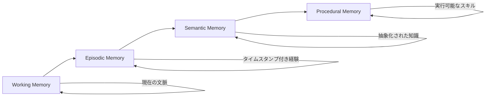

## 論文概要（Abstract）

本記事は [arxiv:2603.07670 Memory for Autonomous LLM Agents: Mechanisms, Evaluation, and Emerging Frontiers](https://arxiv.org/abs/2603.07670) の解説記事である。著者 Pengfei Du は、2022年から2026年初頭までのLLMエージェントメモリ研究を包括的にサーベイし、エージェントメモリを **write-manage-read ループ** として形式化している。5つのメモリ機構ファミリー、4つの評価ベンチマーク、3つの本番アーキテクチャパターンを体系的に整理した論文であり、エピソディックメモリの評価手法を検討する上で不可欠な理論的基盤を提供する。

この記事は [Zenn記事: AgentCore Evaluationsでエピソディックメモリの効果を定量評価する実践手法](https://zenn.dev/0h_n0/articles/b60d93971f75f0) の深掘りです。

## 情報源

- **arXiv ID**: 2603.07670
- **URL**: [https://arxiv.org/abs/2603.07670](https://arxiv.org/abs/2603.07670)
- **著者**: Pengfei Du
- **発表年**: 2026年3月
- **分野**: cs.AI（人工知能）

## 背景と動機（Background & Motivation）

LLMベースのエージェントは、固定長のコンテキストウィンドウという根本的制約を持つ。単一セッション内であれば会話履歴をプロンプトに含めることで対処できるが、複数セッションにまたがる長期的なタスクでは、過去の経験を記憶・検索・活用するメモリ機構が不可欠となる。

著者は、メモリがエージェントの品質向上において「モデルスケーリングに匹敵するリターンを生む」と主張している。にもかかわらず、メモリシステムの設計・テスト・最適化はLLMコンポーネントと比較して注力が不十分であると指摘している。

先行研究のサーベイ（Xi et al. 2023; Wang et al. 2024a）はメモリを一モジュールとして扱うに留まっていたが、本論文はメモリに特化し、POMDP（部分観測マルコフ決定過程）としての形式化から実装パターン、ガバナンスまでを網羅している。

## 主要な貢献（Key Contributions）

- **貢献1**: エージェントメモリをwrite-manage-readループとしてPOMDP上で形式化し、メモリを信念状態（belief state）として定位した
- **貢献2**: 時間スコープ（temporal scope）、表現基盤（representational substrate）、制御方式（control policy）の3次元分類法を導入した
- **貢献3**: 5つのメモリ機構ファミリーを詳細に分析し、各機構のリスクと緩和策を明示した
- **貢献4**: 4つの評価ベンチマーク（LoCoMo, MemBench, MemoryAgentBench, MemoryArena）を横断的に分析し、4層メトリクススタックを提案した

## 技術的詳細（Technical Details）

### Write-Manage-Readループの形式化

著者はエージェントメモリを以下の2つの方程式で形式化している。

**行動選択**: エージェントは現在の入力 $o_t$、検索されたメモリ内容 $\text{read}(M_t, o_t)$、アクティブな目標 $g_t$ に基づき、方策 $\pi_\theta$ を用いて行動 $a_t$ を選択する。

$$
a_t = \pi_\theta(o_t, \text{read}(M_t, o_t), g_t)
$$

**メモリ更新**: メモリ状態 $M_t$ は書き込み・管理操作を通じて更新される。

$$
M_{t+1} = \text{manage}(\text{write}(M_t, o_t, a_t, r_t))
$$

ここで、
- $o_t$: 時刻 $t$ の観測（ユーザー入力、ツール結果等）
- $a_t$: エージェントの行動
- $r_t$: 報酬（タスク成功/失敗等）
- $M_t$: 時刻 $t$ のメモリ状態

この形式化はPOMDPアーキテクチャと対応しており、メモリが対話履歴の十分統計量（sufficient statistics）として機能する。

### 3次元分類法

#### 時間スコープ（4レベル）

| メモリ種別 | 説明 | 例 | AgentCoreとの対応 |
|-----------|------|------|-------------------|
| **Working Memory** | 現在のコンテキストウィンドウ内の情報 | 直近の会話ターン | セッション内会話履歴 |
| **Episodic Memory** | タイムスタンプ付きの具体的経験 | 過去のサポート対応の成功/失敗記録 | AgentCoreエピソディックメモリ |
| **Semantic Memory** | 抽象化・脱文脈化された知識 | 「ユーザーAはPythonを好む」 | AgentCoreセマンティックメモリ |
| **Procedural Memory** | 再利用可能なスキル・実行計画 | APIコール手順、デバッグワークフロー | 未対応（Mem0 v1.0.0で導入） |

#### 表現基盤（5種類）

- **コンテキスト常駐テキスト**: 透明性が高いが容量制限あり
- **ベクトルインデックスストア**: スケーラブルなセマンティック検索
- **構造化ストア**: SQLデータベース、ナレッジグラフ
- **実行可能リポジトリ**: コードライブラリ、プランテンプレート
- **ハイブリッド実装**: 複数ティアの組み合わせ

#### 制御方式（3種類）

- **ヒューリスティック**: 固定ルール（固定検索件数、定期要約）
- **プロンプト自己制御**: LLMがメモリ操作の実行判断を行う
- **学習制御**: RLで最適化されたメモリ管理ポリシー

### 5つのメモリ機構ファミリー

#### 1. コンテキスト常駐メモリと圧縮

プロンプト内にワーキングメモリとして関連情報を保持する手法である。スライディングウィンドウ、ローリング要約、階層的要約、タスク条件付き圧縮の4つの戦略が存在する。

著者は2つの病理を指摘している:
- **要約ドリフト**: 複数回の圧縮を経て、稀だが重要な詳細が消失する現象
- **注意の希薄化**: 長いコンテキストの中間部分の情報が想起されにくくなる "lost in the middle" 効果

#### 2. 検索拡張メモリストア（RAGベース）

対話記録を外部インデックスに蓄積し、クエリに応じて検索する手法である。論文では以下のコンポーネントが分析されている:

- **インデックス粒度**: 多粒度アプローチ（精度重視の細粒度、文脈保持の粗粒度を適応的に選択）
- **クエリ定式化**: LLMによるクエリ再構成、マルチクエリ展開
- **検索ゲーティング**: Self-RAGにより検索が必要な場合のみ実行し、不要なレイテンシを削減
- **読み書きメモリ**: 書き込み時は構造化トリプレット、読み取り時は自然言語クエリという非対称設計

#### 3. リフレクティブ・自己改善メモリ

失敗後の自然言語ポストモーテムをエピソディックレコードとして蓄積し、将来の試行を導く手法である。Reflexion（Shinn et al., 2023）ではHumanEvalで91% pass@1を達成したと報告されている。

著者は**自己強化エラー**を中心的リスクとして指摘している。例えば「API Xは常に失敗する」という誤った結論がエビデンスなく定着する現象である。緩和策として、リフレクション根拠付け（具体的なエピソード証拠の引用を要求）、信頼度スコアリング、未検証リフレクションの定期的失効が提案されている。

#### 4. 階層的メモリと仮想コンテキスト管理

OS のメモリ管理に着想を得た手法であり、MemGPT（Packer et al., 2024）の3層アーキテクチャが代表例である:

- **Main Context（RAM）**: アクティブウィンドウ（システムプロンプト、直近メッセージ、関連レコード）
- **Recall Storage（Disk）**: 検索可能な過去メッセージデータベース
- **Archival Storage（Cold）**: ベクトルインデックス化されたドキュメント・長期知識

著者は**サイレントオーケストレーション障害**を指摘している。誤ったページング判断が明示的なエラーなく応答品質を劣化させ、時間とともに蓄積する問題である。

#### 5. ポリシー学習メモリ管理

store, retrieve, update, summarize, discardを呼び出し可能なツールとして扱い、強化学習で最適化する手法である。Agentic Memory（2026）では、教師ありウォームアップ→タスクレベルRL→ステップレベルGRPO（Group Relative Policy Optimization）の3段階学習が提案されている。

著者らが報告した非自明な発見:
- 事前コンテキスト充填要約（proactive pre-context-fill summarization）
- 意味的に類似するが情報的に冗長なレコードの選択的破棄

## 実験結果（Results）— 評価ベンチマーク横断分析

論文では4つの主要ベンチマークが分析されている。

| ベンチマーク | 年 | 評価対象 | 主要な知見 |
|-------------|-----|---------|-----------|
| **LoCoMo** | 2024 | 長期会話メモリ（最大35セッション、300+ターン） | RAG拡張モデルは時間的・因果的推論で人間に大きく劣る |
| **MemBench** | 2025 | 事実的 vs リフレクティブメモリ | 3次元評価: 有効性、効率性、容量（ストア成長時の劣化） |
| **MemoryAgentBench** | 2025 | 4つの認知能力 | 選択的忘却で全システムが広範に失敗 |
| **MemoryArena** | 2026 | 相互依存マルチセッションタスク | LoCoMoでほぼ完璧なモデルが40-60%に低下 |

MemoryArena（2026）の結果は注目に値する。著者によれば、アクティブメモリエージェントは80%以上の完了率を達成したが、ロングコンテキストのみのベースラインは約45%に低下した。この結果は、**受動的想起（passive recall）と意思決定関連メモリ（decision-relevant memory）の間に大きなギャップ**が存在することを示している。

### 4層メトリクススタック

著者は以下の4層でメモリ品質を評価することを提案している:

1. **タスク有効性**: 成功率、事実的正確性、計画完了率
2. **メモリ品質**: 検索レコードの精度/再現率、矛盾率、陳腐化分布、タスク関連性カバレッジ
3. **効率性**: 操作あたりレイテンシ、消費プロンプトトークン数、ステップあたり検索呼び出し数、ストレージ成長率
4. **ガバナンス**: プライバシー漏洩率、削除コンプライアンス、アクセススコープ違反

### ベンチマーク横断の教訓

論文から導出される重要な知見:

- **ロングコンテキスト ≠ メモリ**: 目的特化型システムが拡張コンテキストウィンドウを上回る
- **選択的忘却の評価がほぼ存在しない**: MemoryAgentBenchのみが測定
- **コストは精度と並んで報告されるべき**: 将来の評価で必須とされる

## 実運用への応用（Practical Applications）

### 3つのアーキテクチャパターン

著者は本番環境向けに3つのパターンを推奨している:

| パターン | 構成 | 適用場面 | 主な課題 |
|---------|------|---------|---------|
| **A: モノリシック** | 全メモリをプロンプト内 | プロトタイプ、短命エージェント | 容量制限 |
| **B: コンテキスト+検索** | ワーキングメモリ+外部ストア | 本番エージェントの標準 | 検索品質 |
| **C: 階層的+学習制御** | 多層ティア+学習コントローラ | 高度な要件 | 複雑なエンジニアリング |

著者の推奨: **パターンBから開始**し、徹底的に計装し、実証データがある場合にのみパターンCに移行する。

Amazon Bedrock AgentCoreのエピソディックメモリはパターンBに該当し、検索拡張メモリストアとしてセマンティック検索を用いたレコード取得を行う。AgentCore Evaluationsの4つのエバリュエータ（Helpfulness, Correctness, GoalSuccessRate, ToolSelectionAccuracy）は、本論文の4層メトリクススタックのうち「タスク有効性」層に対応する。

### エンジニアリング上の注意点

- **検索レイテンシ**: 200-500msの追加が発生する。緩和策として非同期書き込み、段階的検索、曖昧性に基づく動的ルーティングが挙げられている
- **陳腐化と矛盾**: 時間的バージョニング（最新レコード優先）、ソース帰属（人間 > エージェント推論）、矛盾検出、定期的統合スイープが推奨されている
- **観測可能性**: メモリ操作の包括的ログ記録（書き込み、読み取り、更新、削除にタイムスタンプとコンテキスト付き）、リプレイツール、ターン間のメモリdiffが重要インフラとして位置づけられている

## 関連研究（Related Work）

- **Zhang et al. (2024b)**: write-manage-readフレームワークを提案した先行研究。本論文は2026年初頭までのカバレッジを追加し、POMDP形式化、応用、エンジニアリング、ガバナンスの議論を拡張している
- **Gao et al. (2024)**: RAGサーベイ。検索-生成パイプラインをカバーするが、エージェント固有のメモリは対象外
- **Sumers et al. (2024)**: 認知アーキテクチャの観点からの研究。本論文とは表現基盤とポリシーへの焦点で補完関係にある

## まとめと今後の展望

本論文は、LLMエージェントメモリを「ステートレステキスト生成器を真に適応的なエージェントに変えるもの」と位置づけている。主要な成果は以下の通りである:

- write-manage-readループのPOMDP形式化により、メモリ設計の理論的基盤が確立された
- 5つのメモリ機構の分析から、各機構固有のリスク（要約ドリフト、自己強化エラー、サイレント障害）と緩和策が明確化された
- 4つのベンチマーク横断分析から、「ロングコンテキスト≠メモリ」「選択的忘却の評価がほぼ欠如」という知見が導出された
- 今後の10の優先課題として、原理的統合、因果的検索、信頼性あるリフレクション、学習忘却等が特定された

エピソディックメモリの効果評価においては、本論文の4層メトリクススタック（タスク有効性→メモリ品質→効率性→ガバナンス）が評価設計の指針となる。

## 参考文献

- **arXiv**: [https://arxiv.org/abs/2603.07670](https://arxiv.org/abs/2603.07670)
- **Related surveys**: [Memory in the Age of AI Agents (arXiv:2512.13564)](https://arxiv.org/abs/2512.13564)
- **MemGPT**: [arXiv:2310.08560](https://arxiv.org/abs/2310.08560)
- **Reflexion**: [arXiv:2303.11366](https://arxiv.org/abs/2303.11366)
- **Related Zenn article**: [AgentCore Evaluationsでエピソディックメモリの効果を定量評価する実践手法](https://zenn.dev/0h_n0/articles/b60d93971f75f0)
