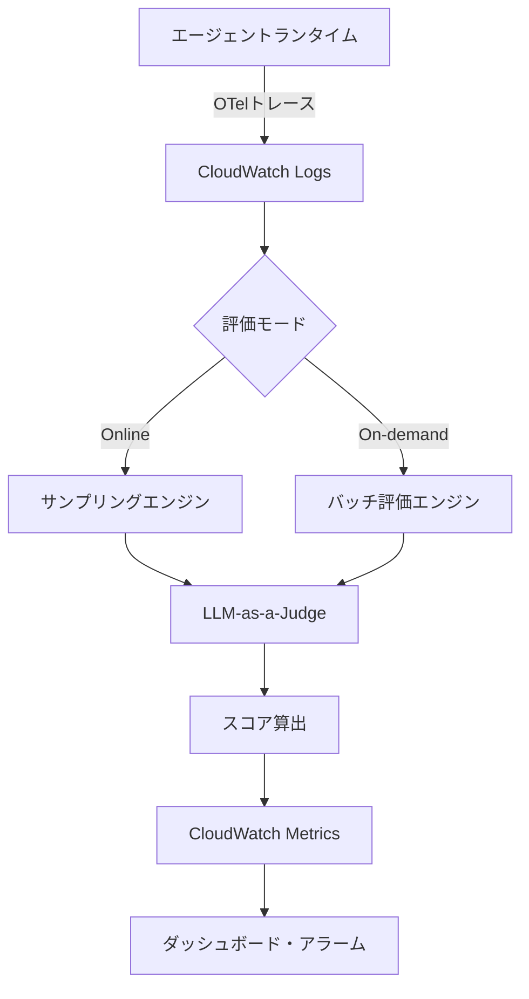

## ブログ概要（Summary）

本記事は [AWS Machine Learning Blog: Build reliable AI agents with Amazon Bedrock AgentCore Evaluations](https://aws.amazon.com/blogs/machine-learning/build-reliable-ai-agents-with-amazon-bedrock-agentcore-evaluations/) の解説記事である。AgentCore Evaluationsは2026年3月31日にGA（一般提供）となったエージェント品質評価サービスであり、LLM-as-a-Judge手法を用いてエージェントの応答品質を3つのレベル（Session/Trace/Span）で自動スコアリングする。本ブログでは、Online評価とOn-demand評価の2モードの使い分け、13種の組み込みエバリュエータの設計思想、Wanderlust Travel Platformでの実適用事例が解説されている。

この記事は [Zenn記事: AgentCore Evaluationsでエピソディックメモリの効果を定量評価する実践手法](https://zenn.dev/0h_n0/articles/b60d93971f75f0) の深掘りです。

## 情報源

- **種別**: 企業テックブログ（AWS Machine Learning Blog）
- **URL**: [Build reliable AI agents with Amazon Bedrock AgentCore Evaluations](https://aws.amazon.com/blogs/machine-learning/build-reliable-ai-agents-with-amazon-bedrock-agentcore-evaluations/)
- **組織**: Amazon Web Services, Machine Learning チーム
- **発表日**: 2026年3月（AgentCore Evaluations GA発表と同時期）

## 技術的背景（Technical Background）

LLMベースのエージェントが本番環境で稼働する場合、応答品質の劣化を早期に検知する仕組みが不可欠となる。従来の手動レビューでは、品質問題の発見に数週間を要することがあった。AgentCore Evaluationsは、この課題をLLM-as-a-Judge手法で解決する。

LLM-as-a-Judgeとは、評価対象のエージェント出力を別のLLM（ジャッジモデル）に渡し、事前定義された評価基準（ルーブリック）に基づいてスコアリングする手法である。人間の評価者と比較して、一貫性が高く、スケーラブルであるという特性を持つ。ただし、ジャッジモデル自体のバイアス（自己強化バイアス、位置バイアス等）が存在するため、評価基準の設計が重要となる。

AgentCore Evaluationsの学術的背景として、Zheng et al. (2023) の "Judging LLM-as-a-Judge with MT-Bench and Chatbot Arena"（arXiv:2306.05685）で提案されたLLM-as-a-Judge手法がある。この研究では、GPT-4をジャッジとして使用した場合に人間評価者との一致率が80%以上であることが報告されている。AgentCore Evaluationsはこのアプローチをエージェント評価に特化させ、Session/Trace/Spanの3レベルでの評価を実現している。

## 実装アーキテクチャ（Architecture）

### 評価パイプラインの全体構成

AgentCore Evaluationsの評価パイプラインは、以下の3つのコンポーネントで構成される。



1. **データ収集層**: OpenTelemetry互換のトレースデータをCloudWatch Logsに蓄積する。Strands Agents SDKを使用している場合、AgentCoreランタイムが自動でトレースを出力するため追加設定は不要である
2. **評価実行層**: Online（サンプリング＋連続評価）またはOn-demand（API経由バッチ評価）のいずれかのモードで評価を実行する
3. **可視化層**: 評価結果をCloudWatch Metricsに出力し、ダッシュボードやアラームと連携する

### 3レベル評価モデル

ブログで解説されている評価レベルの設計は以下の通りである。

| レベル | 評価粒度 | 入力データ | 代表的エバリュエータ |
|--------|----------|-----------|---------------------|
| **Session** | 対話セッション全体 | 全ターンの会話履歴 | GoalSuccessRate |
| **Trace** | 個別の応答ターン | 1つのuser-assistantペア | Helpfulness, Correctness, Faithfulness |
| **Span** | ツール呼び出し単位 | 個別のtool_call/tool_result | ToolSelectionAccuracy, ParameterExtraction |

この3レベル設計により、「セッション全体は成功したが個別の応答精度が低い」ケースや、「応答は正確だがツール選択が最適でない」ケースを区別して検知できる。

### 13組み込みエバリュエータの分類

AWS公式ドキュメント（[Built-in evaluators](https://docs.aws.amazon.com/bedrock-agentcore/latest/devguide/built-in-evaluators-overview.html)）によると、13種の組み込みエバリュエータは以下のように分類される。

**品質系エバリュエータ:**

- **Helpfulness**: 応答がユーザーの質問に対して有用であるかを0-1でスコアリング
- **Correctness**: 応答の事実的正確性を評価
- **Faithfulness**: 提供されたコンテキスト（検索結果、ドキュメント等）に忠実であるかを評価
- **InstructionFollowing**: システムプロンプトの指示に従っているかを評価
- **Completeness**: 要求された情報を網羅的にカバーしているかを評価

**ツール系エバリュエータ:**

- **ToolSelectionAccuracy**: 利用可能なツールの中から適切なツールを選択できたかを評価
- **ParameterExtraction**: ツール呼び出し時のパラメータ抽出精度を評価

**安全性系エバリュエータ:**

- **Harmfulness**: 応答に有害な内容が含まれていないかを判定
- **Stereotyping**: ステレオタイプや偏見を含む表現がないかを判定

**セッション系エバリュエータ:**

- **GoalSuccessRate**: セッション全体を通じて、ユーザーの目標が達成されたかを評価
- **Conversationality**: 自然な会話の流れを維持しているかを評価

各エバリュエータは内部的にプロンプトテンプレート、評価モデル、スコアリング基準が事前設定されており、判定ロジックの変更はできない。ビジネス固有の品質基準を評価するにはカスタムエバリュエータが必要となる。

## Online評価とOn-demand評価の使い分け

### Online評価: 本番トラフィックの継続監視

Online評価は本番トラフィックの一定割合をサンプリングし、バックグラウンドで連続的に評価を実行するモードである。ブログでは以下の特徴が解説されている。

**設計上のポイント:**

- サンプリングレートは1-100%の範囲で設定可能（ブログでは1-2%を推奨）
- 既存のOTelトレースを利用するため、エージェントのコード変更が不要
- 評価は非同期実行のため、エンドユーザーのレイテンシに影響しない

```python
import boto3

client = boto3.client("bedrock-agentcore-control", region_name="us-east-1")

# Online評価構成の作成
config = client.create_online_evaluation_config(
    onlineEvaluationConfigName="ProductionQualityMonitor",
    description="本番環境の応答品質を継続監視",
    rule={
        "samplingConfig": {"samplingPercentage": 2.0},
    },
    dataSourceConfig={
        "cloudWatchLogs": {
            "logGroupNames": ["/aws/agentcore/my-agent-traces"],
            "serviceNames": ["my-agent.DEFAULT"],
        }
    },
    evaluators=[
        {"evaluatorId": "Builtin.Helpfulness"},
        {"evaluatorId": "Builtin.Correctness"},
        {"evaluatorId": "Builtin.GoalSuccessRate"},
    ],
    evaluationExecutionRoleArn=(
        "arn:aws:iam::123456789012:role/AgentCoreEvaluationRole"
    ),
    enableOnCreate=True,
)
```

### On-demand評価: CI/CDパイプラインでの品質ゲート

On-demand評価はAPI経由でプログラム的に評価を実行するモードであり、CI/CDパイプラインでのデプロイゲートとして使用できる。

```python
# On-demand評価の実行
runtime_client = boto3.client(
    "bedrock-agentcore-runtime", region_name="us-east-1"
)

eval_result = runtime_client.run_evaluation(
    evaluationName="pre-deploy-check",
    evaluators=[
        {"evaluatorId": "Builtin.Helpfulness"},
        {"evaluatorId": "Builtin.GoalSuccessRate"},
    ],
    evaluationDataSource={
        "traceIds": ["trace-id-1", "trace-id-2", "trace-id-3"],
    },
)

# 品質閾値チェック
for score in eval_result["evaluationResults"]:
    evaluator = score["evaluatorId"]
    avg_score = score["averageScore"]
    if avg_score < 0.7:
        raise ValueError(
            f"品質ゲート失敗: {evaluator} = {avg_score:.3f} < 0.7"
        )
```

ブログでは、**Online評価で継続トレンド監視**、**On-demand評価でリグレッションテスト**を組み合わせる運用パターンが推奨されている。

## Wanderlust Travel Platformの事例分析

ブログで紹介されているWanderlust Travel Platformは、旅行予約エージェントの実運用事例である。この事例では、以下の成果が報告されている。

### 品質劣化の早期検知

Online評価を導入した結果、ツール選択精度の低下（0.91→0.3）を**数時間で検知**できたと報告されている。従来の手動レビューでは数週間を要していた問題が、自動評価により即座に発見された。

この事例の具体的なシナリオ:

1. エージェントのプロンプト更新後、ToolSelectionAccuracyスコアが急落
2. Online評価のCloudWatchアラームが自動発報
3. 問題のあるプロンプト変更を特定し、数時間以内にロールバック
4. スコアが0.91水準に回復

### Ground Truth評価

ブログではGround Truth（期待される正解）を用いた評価も解説されている。

- **Reference answers**: 期待される応答テキストとの比較
- **Behavioral assertions**: セッションレベルの目標達成条件
- **Expected tool sequences**: 期待されるツール呼び出し順序

この機能により、「正解が明確なケース」では決定論的な評価が可能となる。

### カスタムエバリュエータの設計

ブログではビジネス固有の評価基準をカスタムエバリュエータとして実装する方法も解説されている。

```python
# カスタムエバリュエータ: ドメイン固有の品質基準
custom_evaluator = client.create_evaluator(
    evaluatorName="TravelDomainAccuracy",
    description="旅行ドメイン固有の正確性評価",
    level="TRACE",
    evaluatorConfig={
        "llmAsAJudge": {
            "modelConfig": {
                "bedrockEvaluatorModelConfig": {
                    "modelId": "anthropic.claude-sonnet-4-20250514-v1:0",
                    "inferenceConfig": {
                        "temperature": 0.0,
                        "maxTokens": 512,
                    },
                }
            },
            "ratingScale": {
                "numerical": [
                    {
                        "value": 0.0,
                        "label": "不正確",
                        "definition": "事実と異なる情報を含む",
                    },
                    {
                        "value": 0.5,
                        "label": "部分的に正確",
                        "definition": "一部不正確だが概ね正しい",
                    },
                    {
                        "value": 1.0,
                        "label": "正確",
                        "definition": "すべての情報が事実と一致",
                    },
                ]
            },
            "instructions": (
                "旅行予約に関する応答の正確性を評価してください。"
                "フライト時刻、料金、空席状況等の事実情報が正確かを判定します。"
            ),
        }
    },
)
```

2種類のカスタムエバリュエータが提供されている:

1. **LLM-as-a-Judge型**: ジャッジモデル、プロンプト、スコアリング基準を自由に設定
2. **Lambda関数型**: Python/JavaScriptで任意の評価ロジックを実装（ルールベース、外部API呼び出し等）

## パフォーマンスと制約

### レイテンシへの影響

Online評価は非同期実行のため、エンドユーザーのレイテンシに直接影響しない。ただし、評価結果のCloudWatch反映には5-15分のラグがある。

### スケーラビリティ制約

AWS公式ドキュメントによると、以下の制約が存在する:

| リソース | 制限値 |
|----------|--------|
| 評価構成数（アカウント） | 最大1,000件 |
| 同時アクティブ構成 | 最大100件 |
| 処理上限（リージョン） | 100万トークン/分 |
| 対応リージョン | 9リージョン（us-east-1, us-east-2, us-west-2, ap-south-1, ap-southeast-1, ap-southeast-2, ap-northeast-1, eu-central-1, eu-west-1） |

### コスト構造

AgentCore Evaluationsの料金は、評価で処理される入出力トークン数に基づく従量課金制である（[AgentCore Pricing](https://aws.amazon.com/bedrock/agentcore/pricing/)）。

| 評価モード | コスト要因 | 最適化方針 |
|-----------|-----------|-----------|
| Online | サンプリング数 × エバリュエータ数 × トークン数 | サンプリングレート1-2%、エバリュエータ4つ以下 |
| On-demand | 評価回数 × トレース数 × トークン数 | CI/CDでは差分のみ、全量は週次バッチ |
| カスタム | 選択モデルの推論コスト | 精度不要ならHaiku等の軽量モデル |

## 運用での学び（Production Lessons）

### Online評価のサンプリング設計

ブログの事例から、サンプリングレートの設計に関する以下の教訓が導出される。

- **低トラフィック環境**（100件/日未満）: サンプリングレート5-10%が推奨される。1%では統計的に有意なデータが得られない
- **高トラフィック環境**（10,000件/日以上）: 1%で十分。ただし100万トークン/分の処理上限に注意が必要
- **曜日変動の考慮**: サポート対話はトラフィックに曜日変動があるため、評価期間は最低1週間を確保すべき

### 評価基準のキャリブレーション

カスタムエバリュエータの設計時に注意すべき点:

- スコアリングルーブリックが曖昧だと、スコアが常に高くなる傾向がある
- 0点条件（どのような応答が最低スコアになるか）を明示的に定義することが重要
- ジャッジモデルの温度パラメータは0.0に設定し、評価の再現性を確保する

### アラーム設計のベストプラクティス

```python
import boto3

cloudwatch = boto3.client("cloudwatch", region_name="us-east-1")

# 品質劣化検知アラーム
cloudwatch.put_metric_alarm(
    AlarmName="AgentQuality-Helpfulness-Degradation",
    MetricName="EvaluationScore",
    Namespace="AWS/BedrockAgentCore/Evaluations",
    Dimensions=[
        {"Name": "EvaluatorId", "Value": "Builtin.Helpfulness"},
    ],
    Statistic="Average",
    Period=3600,
    EvaluationPeriods=3,  # 3時間連続で閾値以下
    Threshold=0.7,
    ComparisonOperator="LessThanThreshold",
    AlarmActions=[
        "arn:aws:sns:us-east-1:123456789012:agent-quality-alerts"
    ],
)
```

ブログでは、**単一データポイントではなく3時間連続**での閾値判定を推奨している。一時的なスコア低下（ノイズ）でアラームが発報されることを防ぐためである。

## 学術研究との関連（Academic Connection）

AgentCore Evaluationsは以下の学術研究を基盤としている。

- **LLM-as-a-Judge** (Zheng et al., 2023, arXiv:2306.05685): MT-BenchとChatbot Arenaで提案されたLLMによる自動評価手法。AgentCore Evaluationsの組み込みエバリュエータはこのアプローチをエージェント評価に特化させている
- **AgentBench** (Liu et al., 2023, arXiv:2308.03688): LLMをエージェントとして評価する8つの環境を提供するベンチマーク。Session/Trace/Spanの階層的評価設計に影響を与えている
- **Ragas** (Shahul et al., 2024): RAGパイプラインの評価フレームワーク。FaithfulnessやCorrectnessの評価指標設計にRagasの知見が取り入れられている

関連するAWSブログとして、[Evaluate Amazon Bedrock Agents with Ragas and LLM-as-a-judge](https://aws.amazon.com/blogs/machine-learning/evaluate-amazon-bedrock-agents-with-ragas-and-llm-as-a-judge/) では、Ragasフレームワークとの統合による評価パイプライン構築が解説されている。

## まとめと実践への示唆

AgentCore Evaluationsは、LLMエージェントの品質評価を自動化・標準化するAWSマネージドサービスである。ブログの要点を整理する:

- **3レベル評価**: Session/Trace/Spanの階層的評価により、品質問題の原因を特定しやすい
- **2つの評価モード**: Online（継続監視）とOn-demand（CI/CDゲート）の組み合わせが実用的
- **Wanderlust事例**: 手動レビュー（数週間）→自動検知（数時間）への改善が報告されている
- **カスタムエバリュエータ**: ビジネス固有の品質基準をLLM-as-a-JudgeまたはLambda関数で実装できる

エピソディックメモリとの組み合わせでは、GoalSuccessRateとHelpfulnessの2指標でメモリ導入前後の品質変化を定量化し、カスタムエバリュエータで「メモリ活用度」を独自スコアリングするアプローチが有効である。

## 参考文献

- **Blog URL**: [Build reliable AI agents with Amazon Bedrock AgentCore Evaluations](https://aws.amazon.com/blogs/machine-learning/build-reliable-ai-agents-with-amazon-bedrock-agentcore-evaluations/)
- **AWS Docs**: [AgentCore Evaluations](https://docs.aws.amazon.com/bedrock-agentcore/latest/devguide/evaluations.html)
- **Built-in evaluators**: [Built-in evaluators overview](https://docs.aws.amazon.com/bedrock-agentcore/latest/devguide/built-in-evaluators-overview.html)
- **GA Announcement**: [AgentCore Evaluations GA](https://aws.amazon.com/about-aws/whats-new/2026/03/agentcore-evaluations-generally-available/)
- **Related Paper**: [Judging LLM-as-a-Judge (arXiv:2306.05685)](https://arxiv.org/abs/2306.05685)
- **Related Zenn article**: [AgentCore Evaluationsでエピソディックメモリの効果を定量評価する実践手法](https://zenn.dev/0h_n0/articles/b60d93971f75f0)
