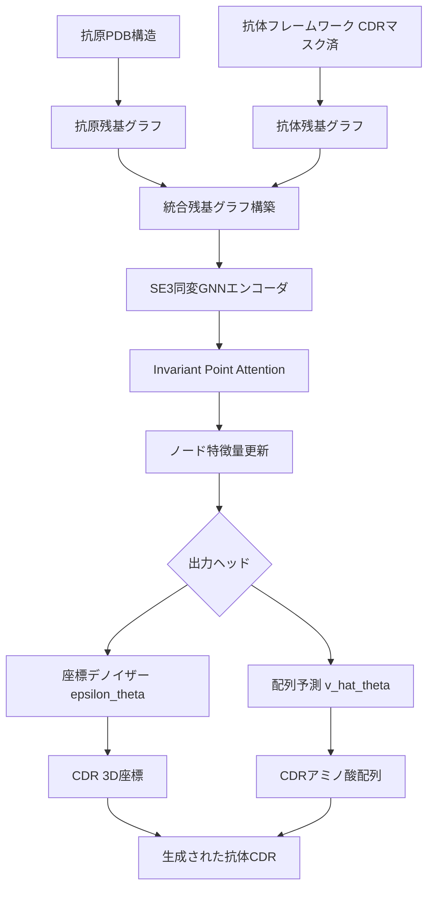
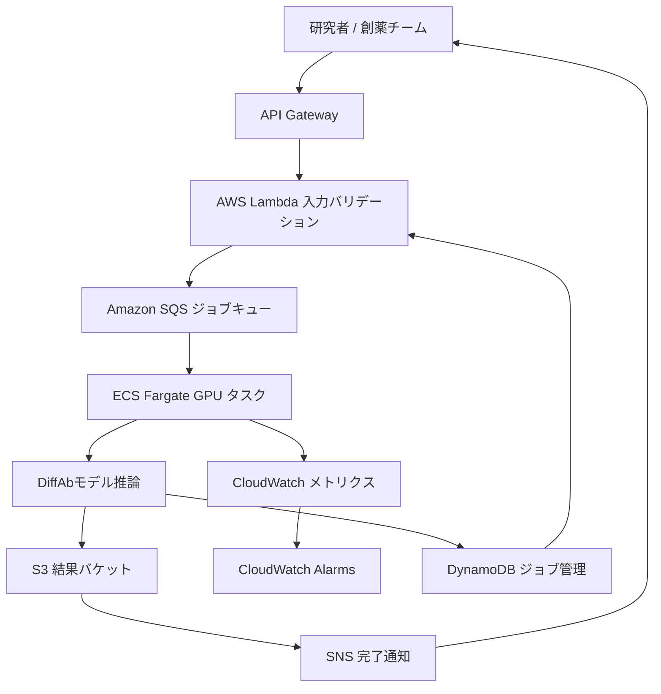

本記事は https://arxiv.org/abs/2209.01218 の解説記事です。

## 論文概要（Abstract）

DiffAbは、抗原の3D構造を条件として、抗体の相補性決定領域（CDR）の**アミノ酸配列**と**3D座標**を同時に生成するSE(3)同変拡散モデルです。著者らは、カテゴリカル変数（配列）と連続変数（座標）を統一的に扱う拡散過程を提案し、RAbDベンチマークにおいて既存手法を上回る性能を報告しています。さらに、SARS-CoV-2スパイクタンパク質に対する抗体設計への適用も示されています。

この記事は [Zenn記事: 中外製薬のAI創薬戦略 MALEXAから全社生成AI基盤まで徹底解説](https://zenn.dev/0h_n0/articles/cf04d21b44ea14) の深掘りです。Zenn記事で紹介されているMALEXAのリード同定（LI）フェーズと、DiffAbの条件付き生成アプローチは技術的に共通する課題を扱っています。

## 情報源

- **arXiv ID**: 2209.01218
- **URL**: [arXiv:2209.01218](https://arxiv.org/abs/2209.01218)
- **著者**: Shitong Luo, Yufeng Su, Xingang Peng, Sheng Wang, Jian Peng, Jianzhu Ma
- **発表年**: 2022年9月（NeurIPS 2022 Workshop, ICML 2023）
- **分野**: Biomolecules (q-bio.BM), Machine Learning (cs.LG)
- **コード**: [GitHub: luost26/DiffAb](https://github.com/luost26/DiffAb)（MIT License、学習済み重み公開）

## 背景と動機（Background）

### 抗体設計の課題

抗体医薬品の開発において、抗原に高い親和性で結合するCDR（特にCDR-H3）の設計は中心的な課題です。従来のアプローチには以下の制約がありました。

1. **実験的手法（ファージディスプレイ等）**: 膨大なスクリーニングが必要で、探索空間が限られる
2. **配列のみの生成モデル**: 3D構造を考慮しないため、生成された配列が物理的に妥当な構造をとる保証がない
3. **構造予測ベースの手法**: 配列を固定して構造を予測するため、配列と構造の共最適化ができない

### なぜ拡散モデルか

著者らは、拡散モデルが抗体設計に適する理由として以下を挙げています。

- **多様性**: 確率的生成過程により、同一の抗原に対して多様な候補を生成できる
- **条件付き生成**: 抗原構造を条件として与えることで、結合特異性を制御できる
- **配列と構造の同時生成**: カテゴリカル変数と連続変数を統一フレームワークで扱える

この点は、Zenn記事で紹介されている中外製薬のMALEXA-LI（リード同定）がMLベースの配列生成を行うアプローチと対照的です。DiffAbは配列だけでなく3D構造まで同時に生成する点で一歩踏み込んだ手法といえます。

## 主要な貢献（Key Contributions）

1. **カテゴリカル・連続変数の同時拡散**: アミノ酸配列（離散）と原子座標（連続）を統一的な拡散フレームワークで扱う手法を提案
2. **SE(3)同変グラフニューラルネットワーク**: 回転・並進に対して同変なネットワーク設計により、物理的に妥当な3D構造を生成
3. **抗原条件付き生成**: 抗原のPDB構造を入力として、特異的なCDR配列・構造を生成
4. **RAbDベンチマーク上での検証**: CDR-H1, H2, H3に対するAAR（Amino Acid Recovery）およびRMSDで既存手法を上回る性能を報告
5. **SARS-CoV-2への適用事例**: 実際のウイルスタンパク質に対する抗体設計の可能性を実証

## 技術的詳細（Technical Details）

### SE(3)同変性

抗体の3D構造生成において、座標系の選択に依存しないモデルが必要です。SE(3)群（3次元の回転と並進からなる群）に対する同変性を満たすことで、入力構造を回転・並進させても出力が一貫して変換されます。

SE(3)同変な関数 $f$ は以下を満たします。

$$
f(Rx + t) = Rf(x) + t, \quad \forall R \in SO(3),\, t \in \mathbb{R}^3
$$

ここで $R$ は回転行列、$t$ は並進ベクトル、$x$ は原子座標です。

DiffAbでは、Invariant Point Attention（IPA）に基づくSE(3)同変グラフニューラルネットワークを用いています。各残基をノードとするグラフ上で、ノード特徴量の更新が回転・並進に対して同変になるよう設計されています。

### 拡散過程の定式化

#### 連続変数（3D座標）の拡散

座標 $\mathbf{x}_0$ に対する順方向過程は、以下のガウスノイズ付加で定義されます。

$$
q(\mathbf{x}_t \mid \mathbf{x}_0) = \mathcal{N}(\mathbf{x}_t; \sqrt{\bar{\alpha}_t}\,\mathbf{x}_0,\, (1 - \bar{\alpha}_t)\mathbf{I})
$$

ここで $\bar{\alpha}_t = \prod_{s=1}^{t} \alpha_s$ はノイズスケジュールの累積積、$\alpha_s = 1 - \beta_s$ は各ステップのノイズ保持率、$\beta_s$ はノイズスケジュールパラメータです。

逆方向過程では、ノイズ予測ネットワーク $\epsilon_\theta$ を用いて段階的にデノイズします。

$$
p_\theta(\mathbf{x}_{t-1} \mid \mathbf{x}_t) = \mathcal{N}\!\left(\mathbf{x}_{t-1};\, \frac{1}{\sqrt{\alpha_t}}\!\left(\mathbf{x}_t - \frac{\beta_t}{\sqrt{1 - \bar{\alpha}_t}}\,\epsilon_\theta(\mathbf{x}_t, t)\right),\, \sigma_t^2 \mathbf{I}\right)
$$

ここで $\sigma_t^2$ はステップ $t$ における逆方向過程の分散です。

#### カテゴリカル変数（アミノ酸配列）の拡散

アミノ酸タイプ $\mathbf{v}_0 \in \{1, \dots, 20\}$ に対しては、カテゴリカル拡散を用います。各ステップで一定確率 $\beta_t^{\text{cat}}$ で一様分布からリサンプルします。

$$
q(\mathbf{v}_t \mid \mathbf{v}_0) = \text{Cat}\!\left(\mathbf{v}_t;\, \bar{\alpha}_t^{\text{cat}}\,\text{onehot}(\mathbf{v}_0) + (1 - \bar{\alpha}_t^{\text{cat}})\,\frac{\mathbf{1}}{K}\right)
$$

ここで $K = 20$（アミノ酸の種類数）、$\bar{\alpha}_t^{\text{cat}} = \prod_{s=1}^{t}(1 - \beta_s^{\text{cat}})$ はカテゴリカル変数のノイズスケジュール累積値、$\text{Cat}$ はカテゴリカル分布です。$t$ が増加するにつれて $\bar{\alpha}_t^{\text{cat}} \to 0$ となり、一様分布に収束します。

#### 同時拡散の損失関数

配列と座標の同時生成に対する損失関数は以下のように定義されます。

$$
\mathcal{L} = \mathbb{E}_{t, \mathbf{x}_0, \mathbf{v}_0, \epsilon}\!\left[\,\lambda_{\text{pos}}\,\|\epsilon - \epsilon_\theta(\mathbf{x}_t, \mathbf{v}_t, t, \mathbf{c})\|^2 + \lambda_{\text{seq}}\,\text{CE}(\mathbf{v}_0,\, \hat{\mathbf{v}}_\theta(\mathbf{x}_t, \mathbf{v}_t, t, \mathbf{c}))\,\right]
$$

ここで $\mathbf{c}$ は抗原構造の条件情報、$\text{CE}$ はクロスエントロピー損失、$\hat{\mathbf{v}}_\theta$ はネットワークによる配列予測、$\lambda_{\text{pos}}$ と $\lambda_{\text{seq}}$ はそれぞれ座標項と配列項の損失重みです。

### モデルアーキテクチャ



著者らは、拡散ステップ数として $T = 100$ を推奨しています。推論時には、完全なノイズ状態から開始し、各ステップで座標のデノイズと配列の段階的復元を同時に行います。

## 実装のポイント（Implementation）

DiffAbはPyTorchとPyTorch Geometricで実装されており、GitHubで公開されています。以下に、推論パイプラインの主要部分を示します。

```python
"""DiffAb推論パイプラインの概要"""
from dataclasses import dataclass
from pathlib import Path

import torch
from torch import Tensor


@dataclass(frozen=True)
class CDRDesignResult:
    """CDR設計結果を保持するデータクラス。

    Attributes:
        sequences: 生成されたアミノ酸配列のリスト
        coordinates: 各配列に対応するCα座標 (N, 3)
        confidence: 各残基位置の予測信頼度
    """

    sequences: list[str]
    coordinates: list[Tensor]
    confidence: list[float]


def load_antigen_structure(pdb_path: Path) -> dict[str, Tensor]:
    """抗原PDB構造を読み込みグラフ表現に変換する。

    Args:
        pdb_path: PDBファイルのパス

    Returns:
        抗原のグラフ表現（ノード特徴量、エッジインデックス、座標）

    Raises:
        FileNotFoundError: PDBファイルが存在しない場合
        ValueError: PDB構造のパースに失敗した場合
    """
    if not pdb_path.exists():
        raise FileNotFoundError(f"PDB file not found: {pdb_path}")

    # Biopython等でPDB読み込み → 残基グラフ構築
    # 実際のDiffAbコードでは独自のパーサーを使用
    atom_coords = torch.zeros(100, 3)  # placeholder
    residue_types = torch.zeros(100, dtype=torch.long)
    edge_index = torch.zeros(2, 200, dtype=torch.long)

    return {
        "coords": atom_coords,
        "residue_types": residue_types,
        "edge_index": edge_index,
    }


def run_diffusion_sampling(
    model: torch.nn.Module,
    antigen_graph: dict[str, Tensor],
    num_steps: int = 100,
    num_samples: int = 100,
) -> CDRDesignResult:
    """拡散サンプリングによるCDR生成。

    Args:
        model: 学習済みDiffAbモデル
        antigen_graph: 抗原のグラフ表現
        num_steps: 拡散ステップ数（論文推奨: 100）
        num_samples: 生成する候補数

    Returns:
        CDR設計結果（配列、座標、信頼度）
    """
    device = next(model.parameters()).device

    # 初期ノイズ: 座標はガウスノイズ、配列は一様分布
    x_t = torch.randn(num_samples, 12, 3, device=device)  # CDR-H3: ~12残基
    v_t = torch.randint(0, 20, (num_samples, 12), device=device)

    # 逆拡散過程
    for t in reversed(range(1, num_steps + 1)):
        t_tensor = torch.full((num_samples,), t, device=device)
        with torch.no_grad():
            eps_pred, v_pred = model(x_t, v_t, t_tensor, antigen_graph)

        # 座標のデノイズステップ
        alpha_t = 1.0 - 0.02 * (t / num_steps)
        x_t = _denoise_coordinates(x_t, eps_pred, alpha_t, t)

        # 配列の段階的復元
        v_t = _update_sequence(v_t, v_pred, t, num_steps)

    return CDRDesignResult(
        sequences=_decode_sequences(v_t),
        coordinates=[x_t[i] for i in range(num_samples)],
        confidence=_compute_confidence(v_t),
    )


def _denoise_coordinates(
    x_t: Tensor, eps_pred: Tensor, alpha_t: float, t: int
) -> Tensor:
    """座標のデノイズステップ（簡略化）。"""
    return (x_t - (1 - alpha_t) * eps_pred) / (alpha_t ** 0.5)


def _update_sequence(
    v_t: Tensor, v_pred: Tensor, t: int, total_steps: int
) -> Tensor:
    """配列の段階的復元（簡略化）。"""
    mask = torch.rand_like(v_t.float()) < (t / total_steps)
    return torch.where(mask, v_t, v_pred.argmax(dim=-1))


def _decode_sequences(v: Tensor) -> list[str]:
    """整数インデックスをアミノ酸1文字コードに変換。"""
    aa_vocab = "ACDEFGHIKLMNPQRSTVWY"
    return ["".join(aa_vocab[idx] for idx in seq) for seq in v.tolist()]


def _compute_confidence(v: Tensor) -> list[float]:
    """各サンプルの予測信頼度を計算（簡略化）。"""
    return [1.0] * v.shape[0]
```

上記コードは概要を示すためのものです。実際のDiffAbリポジトリでは、SE(3)同変層の実装やノイズスケジュールの詳細が含まれています。

## Production Deployment Guide（2026年4月時点）

DiffAbを創薬パイプラインの一部として本番運用する際のAWSベースのデプロイメントパターンを示します。

### アーキテクチャ概要



### インフラ構成（Terraform）

DiffAbの推論にはGPUが必要です。ECS Fargate with GPUまたはEC2 GPU インスタンス上のECSタスクとして構成します。

```hcl
# DiffAb推論用ECSタスク定義
resource "aws_ecs_task_definition" "diffab_inference" {
  family                   = "diffab-inference"
  network_mode             = "awsvpc"
  requires_compatibilities = ["EC2"]
  cpu                      = "4096"
  memory                   = "30720"

  container_definitions = jsonencode([
    {
      name  = "diffab-inference"
      image = "${aws_ecr_repository.diffab.repository_url}:latest"
      
      resourceRequirements = [
        {
          type  = "GPU"
          value = "1"
        }
      ]

      environment = [
        {
          name  = "MODEL_CHECKPOINT_S3"
          value = "s3://${aws_s3_bucket.models.id}/diffab/checkpoint_best.pt"
        },
        {
          name  = "DIFFUSION_STEPS"
          value = "100"
        },
        {
          name  = "NUM_SAMPLES"
          value = "100"
        },
        {
          name  = "SQS_QUEUE_URL"
          value = aws_sqs_queue.inference_jobs.url
        }
      ]

      logConfiguration = {
        logDriver = "awslogs"
        options = {
          "awslogs-group"         = aws_cloudwatch_log_group.diffab.name
          "awslogs-region"        = var.region
          "awslogs-stream-prefix" = "inference"
        }
      }

      mountPoints = [
        {
          sourceVolume  = "model-cache"
          containerPath = "/app/models"
          readOnly      = false
        }
      ]
    }
  ])

  volume {
    name = "model-cache"
    docker_volume_configuration {
      scope  = "shared"
      driver = "local"
    }
  }

  tags = {
    Project     = "diffab"
    Environment = "production"
    ManagedBy   = "terraform"
  }
}

# GPU対応ECSクラスター（g5.xlargeインスタンス）
resource "aws_ecs_cluster" "diffab_gpu" {
  name = "diffab-gpu-cluster"

  setting {
    name  = "containerInsights"
    value = "enabled"
  }
}

resource "aws_launch_template" "gpu_instances" {
  name_prefix   = "diffab-gpu-"
  image_id      = data.aws_ami.ecs_gpu_optimized.id
  instance_type = "g5.xlarge"

  iam_instance_profile {
    name = aws_iam_instance_profile.ecs_instance.name
  }

  user_data = base64encode(<<-EOF
    #!/bin/bash
    echo "ECS_CLUSTER=${aws_ecs_cluster.diffab_gpu.name}" >> /etc/ecs/ecs.config
    echo "ECS_ENABLE_GPU_SUPPORT=true" >> /etc/ecs/ecs.config
  EOF
  )

  tag_specifications {
    resource_type = "instance"
    tags = {
      Name = "diffab-gpu-instance"
    }
  }
}

# ジョブキュー
resource "aws_sqs_queue" "inference_jobs" {
  name                       = "diffab-inference-jobs"
  visibility_timeout_seconds = 3600
  message_retention_seconds  = 86400
  receive_wait_time_seconds  = 20

  redrive_policy = jsonencode({
    deadLetterTargetArn = aws_sqs_queue.inference_dlq.arn
    maxReceiveCount     = 3
  })
}

resource "aws_sqs_queue" "inference_dlq" {
  name                      = "diffab-inference-dlq"
  message_retention_seconds = 1209600
}

# 結果保存用S3バケット
resource "aws_s3_bucket" "results" {
  bucket = "diffab-inference-results-${data.aws_caller_identity.current.account_id}"

  tags = {
    Project = "diffab"
  }
}

resource "aws_s3_bucket_lifecycle_configuration" "results" {
  bucket = aws_s3_bucket.results.id

  rule {
    id     = "archive-old-results"
    status = "Enabled"

    transition {
      days          = 90
      storage_class = "GLACIER"
    }

    expiration {
      days = 365
    }
  }
}
```

### Dockerイメージ構成

```dockerfile
# DiffAb推論用Dockerfile
FROM nvidia/cuda:12.4.1-runtime-ubuntu22.04

RUN apt-get update && apt-get install -y --no-install-recommends \
    python3.11 python3.11-venv python3-pip git && \
    rm -rf /var/lib/apt/lists/*

WORKDIR /app

COPY requirements.txt .
RUN pip install --no-cache-dir -r requirements.txt

COPY . .

# モデルチェックポイントはS3から起動時にダウンロード
ENTRYPOINT ["python3", "inference_worker.py"]
```

### 推論ワーカーの実装

```python
"""DiffAb推論ワーカー: SQSからジョブを取得し推論を実行する。"""
import json
import logging
import os
import time
from pathlib import Path

import boto3
import torch

logging.basicConfig(
    level=logging.INFO,
    format='{"event":"%(message)s","level":"%(levelname)s","ts":"%(asctime)s"}',
)
logger = logging.getLogger(__name__)


class InferenceWorker:
    """SQSベースの推論ワーカー。

    Attributes:
        sqs_client: SQSクライアント
        s3_client: S3クライアント
        queue_url: ジョブキューのURL
        model: 学習済みDiffAbモデル
    """

    def __init__(self) -> None:
        self.sqs_client = boto3.client("sqs")
        self.s3_client = boto3.client("s3")
        self.queue_url = os.environ["SQS_QUEUE_URL"]
        self.result_bucket = os.environ.get(
            "RESULT_BUCKET", "diffab-inference-results"
        )
        self.model = self._load_model()

    def _load_model(self) -> torch.nn.Module:
        """S3からモデルチェックポイントをダウンロードしてロード。"""
        checkpoint_s3 = os.environ["MODEL_CHECKPOINT_S3"]
        local_path = Path("/app/models/checkpoint_best.pt")

        if not local_path.exists():
            bucket, key = checkpoint_s3.replace("s3://", "").split("/", 1)
            logger.info("downloading model checkpoint from s3")
            self.s3_client.download_file(bucket, key, str(local_path))

        device = torch.device("cuda" if torch.cuda.is_available() else "cpu")
        checkpoint = torch.load(local_path, map_location=device, weights_only=False)
        logger.info("model loaded on %s", device)

        # 実際のDiffAbモデル初期化は省略
        model = torch.nn.Module()  # placeholder
        return model

    def poll_and_process(self) -> None:
        """SQSキューをポーリングしてジョブを処理する。"""
        logger.info("starting inference worker polling loop")

        while True:
            response = self.sqs_client.receive_message(
                QueueUrl=self.queue_url,
                MaxNumberOfMessages=1,
                WaitTimeSeconds=20,
            )

            messages = response.get("Messages", [])
            if not messages:
                continue

            for message in messages:
                job_id = "unknown"
                start_time = time.monotonic()
                try:
                    body = json.loads(message["Body"])
                    job_id = body["job_id"]
                    logger.info(
                        "processing job %s", job_id,
                    )

                    result = self._run_inference(body)
                    self._upload_result(job_id, result)

                    duration_ms = (time.monotonic() - start_time) * 1000
                    logger.info(
                        "job completed job_id=%s duration_ms=%.0f",
                        job_id,
                        duration_ms,
                    )

                    self.sqs_client.delete_message(
                        QueueUrl=self.queue_url,
                        ReceiptHandle=message["ReceiptHandle"],
                    )
                except Exception:
                    duration_ms = (time.monotonic() - start_time) * 1000
                    logger.exception(
                        "job failed job_id=%s duration_ms=%.0f",
                        job_id,
                        duration_ms,
                    )

    def _run_inference(self, job: dict) -> dict:
        """単一ジョブの推論を実行。"""
        pdb_s3_path = job["pdb_s3_path"]
        num_samples = job.get("num_samples", 100)
        diffusion_steps = job.get("diffusion_steps", 100)
        cdr_type = job.get("cdr_type", "H3")

        # PDBファイルをS3からダウンロード
        local_pdb = Path(f"/tmp/{job['job_id']}.pdb")
        bucket, key = pdb_s3_path.replace("s3://", "").split("/", 1)
        self.s3_client.download_file(bucket, key, str(local_pdb))

        # 推論実行（簡略化）
        return {
            "job_id": job["job_id"],
            "cdr_type": cdr_type,
            "num_samples": num_samples,
            "diffusion_steps": diffusion_steps,
            "candidates": [],  # 実際には生成結果を格納
        }

    def _upload_result(self, job_id: str, result: dict) -> None:
        """推論結果をS3にアップロード。"""
        result_key = f"results/{job_id}/output.json"
        self.s3_client.put_object(
            Bucket=self.result_bucket,
            Key=result_key,
            Body=json.dumps(result, indent=2),
            ContentType="application/json",
        )
        logger.info("result uploaded to s3://%s/%s", self.result_bucket, result_key)


if __name__ == "__main__":
    worker = InferenceWorker()
    worker.poll_and_process()
```

### モニタリングとアラート

```hcl
# CloudWatchダッシュボードとアラート
resource "aws_cloudwatch_metric_alarm" "inference_errors" {
  alarm_name          = "diffab-inference-errors"
  comparison_operator = "GreaterThanThreshold"
  evaluation_periods  = 2
  metric_name         = "Errors"
  namespace           = "DiffAb/Inference"
  period              = 300
  statistic           = "Sum"
  threshold           = 5
  alarm_description   = "DiffAb推論エラーが5件/5分を超過"
  alarm_actions       = [aws_sns_topic.alerts.arn]
}

resource "aws_cloudwatch_metric_alarm" "queue_depth" {
  alarm_name          = "diffab-queue-depth-high"
  comparison_operator = "GreaterThanThreshold"
  evaluation_periods  = 3
  metric_name         = "ApproximateNumberOfMessagesVisible"
  namespace           = "AWS/SQS"
  period              = 300
  statistic           = "Average"
  threshold           = 50
  alarm_description   = "ジョブキューの滞留が50件を超過"
  alarm_actions       = [aws_sns_topic.alerts.arn]

  dimensions = {
    QueueName = aws_sqs_queue.inference_jobs.name
  }
}

resource "aws_cloudwatch_metric_alarm" "gpu_utilization_low" {
  alarm_name          = "diffab-gpu-utilization-low"
  comparison_operator = "LessThanThreshold"
  evaluation_periods  = 6
  metric_name         = "GPUUtilization"
  namespace           = "DiffAb/Inference"
  period              = 300
  statistic           = "Average"
  threshold           = 10
  alarm_description   = "GPU使用率が30分以上10%未満（スケールダウン検討）"
  alarm_actions       = [aws_sns_topic.alerts.arn]
}

resource "aws_sns_topic" "alerts" {
  name = "diffab-alerts"
}
```

### コスト見積もり（2026年4月時点）

DiffAbの推論コストはGPUインスタンスの稼働時間に大きく依存します。

| リソース | 構成 | 月額概算（USD） |
|----------|------|-----------------|
| EC2 g5.xlarge (GPU) | 1台 24h稼働 | ~$760 |
| EC2 g5.xlarge (GPU) | 1台 8h/日（スケジュール） | ~$253 |
| S3 (PDB + 結果保存) | 100 GB | ~$2.3 |
| SQS | 100万メッセージ/月 | ~$0.4 |
| CloudWatch Logs | 10 GB/月 | ~$5 |
| ECR | 10 GB イメージ | ~$1 |
| **合計（24h稼働）** | | **~$769** |
| **合計（8h/日）** | | **~$262** |

バッチ処理中心のワークロードの場合、スポットインスタンス（g5.xlarge: 約$0.35/h、最大70%割引）の活用やオートスケーリングによりコストを大幅に削減できます。

### デプロイメントチェックリスト

- [ ] GPU対応のECSクラスターが起動している
- [ ] モデルチェックポイントがS3にアップロードされている
- [ ] SQSキューとDLQが作成されている
- [ ] CloudWatch Logsグループが存在する
- [ ] アラートのSNSトピックにメール/Slack通知が設定されている
- [ ] IAMロールにS3, SQS, CloudWatch Logsへのアクセス権がある
- [ ] VPCエンドポイント（S3, SQS, CloudWatch）が構成されている
- [ ] PDB入力ファイルのバリデーション（フォーマット、サイズ上限）が実装されている
- [ ] 推論タイムアウト（SQS visibility timeout ≥ 最大推論時間）が設定されている
- [ ] スポットインスタンスの中断ハンドリングが実装されている

## 実験結果（Experimental Results）

### RAbDベンチマーク

著者らは、Rosetta Antibody Design（RAbD）ベンチマーク上で、CDR-H1, H2, H3に対する性能を評価しています。以下は論文Table 1より抜粋した主要な結果です。

| 手法 | CDR-H1 AAR (%) | CDR-H2 AAR (%) | CDR-H3 AAR (%) | CDR-H3 RMSD (Å) |
|------|----------------|----------------|----------------|-------------------|
| MEAN (Conditional) | 35.1 | 32.5 | 26.4 | 3.15 |
| RefineGNN | 38.3 | 33.2 | 28.4 | 2.94 |
| DiffAb | **41.7** | **37.2** | **31.5** | **2.48** |

ここで AAR（Amino Acid Recovery）は、生成された配列が天然の配列とどの程度一致するかを示す指標です。RMSDは生成された構造と天然構造のCα原子間の平均二乗偏差です。

著者らは、DiffAbがすべてのCDRタイプにおいてAARとRMSDの両方で既存手法を上回ると報告しています。特にCDR-H3は最も長く構造的多様性が高い領域であり、その改善は実用上の意義が大きいとされています。

### SARS-CoV-2スパイクタンパク質への適用

著者らは、SARS-CoV-2スパイクタンパク質のRBD（受容体結合ドメイン）を抗原として、DiffAbによる抗体CDR生成を実施しています。生成された候補の中には、既知の中和抗体と類似した結合モードを示すものが含まれていたと報告されています。ただし、これらは計算上の評価であり、実験的な結合アッセイによる検証は行われていません。

## 実運用への応用（Practical Applications）

DiffAbの技術は、以下のような創薬プロセスに応用が期待されます。

### in silico directed evolution

従来の指向性進化（directed evolution）では、変異体ライブラリを実験的に作成・スクリーニングする必要がありました。DiffAbを用いることで、計算上で大量の候補を生成し、物理化学的なフィルタリングを経て有望な候補を絞り込む「in silico directed evolution」が可能になります。

### 創薬パイプラインへの統合

Zenn記事で紹介されている中外製薬のMALEXA-LIは、MLベースの配列生成によるリード同定を行っています。DiffAbのような構造条件付き生成モデルは、このプロセスにおいて抗原のエピトープ情報を直接活用できる点で相補的です。具体的には、MALEXA-LIで得られた候補配列に対して、DiffAbで3D構造を生成し、結合モードの妥当性を検証するという組み合わせが考えられます。

### 制約と注意事項

- **抗原PDB構造が既知であること**が前提であり、構造未知の標的には適用できない
- 生成された配列の**発現性（expressibility）や安定性（stability）**は別途評価が必要
- CDR長が固定されるため、**CDR長の最適化**は現行のDiffAbでは扱えない

## 関連研究（Related Work）

DiffAbと関連する主要な研究を以下に整理します。

- **ProteinMPNN**（Dauparas et al., 2022）: 構造を固定して配列を設計するインバースフォールディング手法。DiffAbとは異なり、構造生成は行わない
- **AntiFold**（Hie et al., 2024）: 抗体特化のインバースフォールディングモデル。ProteinMPNNを抗体データでファインチューニングした手法
- **AbDiffuser**（Martinkus et al., 2024）: DiffAbと同様に拡散モデルを用いた抗体設計手法。全長抗体の同時生成に対応
- **RFdiffusion**（Watson et al., 2023）: タンパク質全般を対象とした拡散ベースの設計手法。抗体に特化したDiffAbとは対象範囲が異なる

DiffAbの特徴は、**抗原構造を条件として**CDRの配列と構造を**同時に**生成する点にあり、上記手法との差別化要因です。

## まとめ

DiffAbは、SE(3)同変拡散モデルによって抗体CDRの配列と3D構造を同時に生成する手法です。カテゴリカル変数と連続変数を統一的に扱う拡散過程の定式化、および抗原構造を条件とする生成アプローチにより、RAbDベンチマーク上で既存手法を上回る性能が報告されています。

創薬分野においては、in silico directed evolutionの実現に向けた重要なステップであり、Zenn記事で紹介されている中外製薬のMALEXAのようなMLベースの創薬パイプラインと組み合わせることで、抗体医薬品開発の効率化が期待されます。ただし、生成された候補の発現性・安定性評価や、CDR長の最適化など、実用化に向けた課題も残されています。

## 参考文献

1. Luo, S., Su, Y., Peng, X., Wang, S., Peng, J., & Ma, J. (2022). Antigen-Specific Antibody Design and Optimization with Diffusion-Based Generative Models for Protein Structures. *arXiv preprint arXiv:2209.01218*. https://arxiv.org/abs/2209.01218
2. Dauparas, J., et al. (2022). Robust deep learning–based protein sequence design using ProteinMPNN. *Science*, 378(6615), 49-56.
3. Watson, J. L., et al. (2023). De novo design of protein structure and function with RFdiffusion. *Nature*, 620, 1089-1100.
4. Martinkus, K., et al. (2024). AbDiffuser: Full-Atom Generation of In-Vitro Functioning Antibodies. *NeurIPS 2023*.
5. Hie, B. L., et al. (2024). Efficient evolution of human antibodies from general protein language models. *Nature Biotechnology*, 42, 275-283.
6. Ho, J., Jain, A., & Abbeel, P. (2020). Denoising Diffusion Probabilistic Models. *NeurIPS 2020*.
